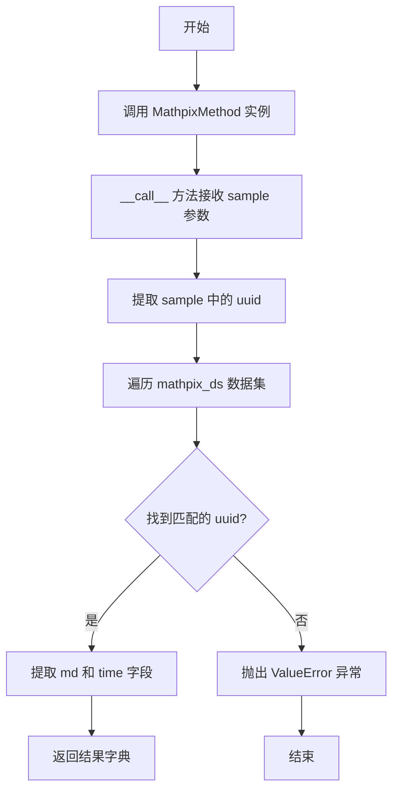
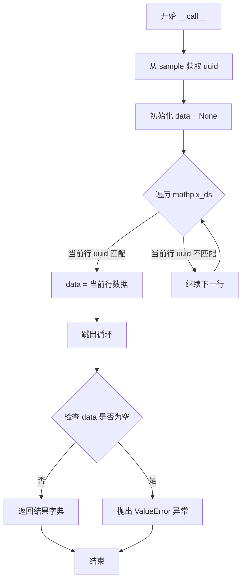
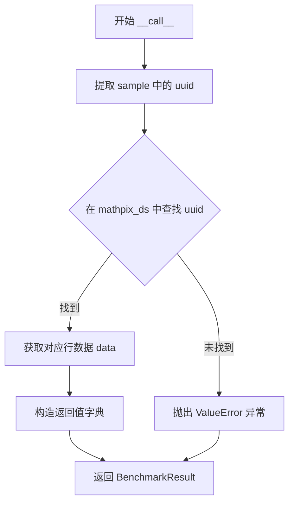
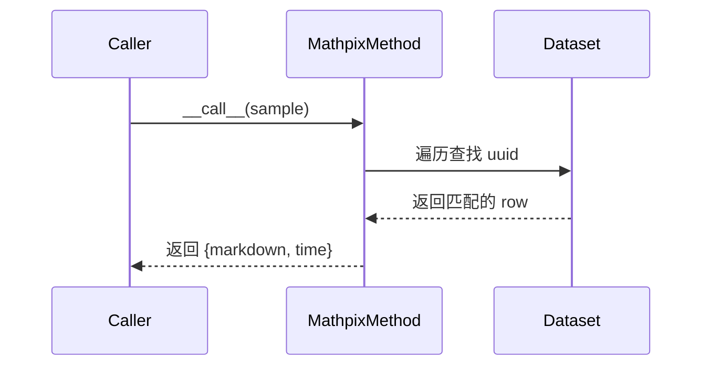

# `marker\benchmarks\overall\methods\mathpix.py` 详细设计文档

这是一个 Mathpix 数学公式识别方法的基准测试实现类，继承自 BaseMethod，通过 uuid 在 Mathpix 数据集中查找对应的识别结果，并返回 markdown 格式的识别文本和识别耗时信息。

## 整体流程



## 类结构

```
BaseMethod (基类)
└── MathpixMethod (继承自 BaseMethod 的具体实现类)
```

## 全局变量及字段


### `datasets`
    
Hugging Face datasets 库，用于加载和处理数据集

类型：`module`
    


### `BaseMethod`
    
基准测试方法的基类，定义方法调用接口

类型：`class`
    


### `BenchmarkResult`
    
基准测试结果类型，包含识别结果和性能指标

类型：`type`
    


### `MathpixMethod.mathpix_ds`
    
存储 Mathpix 识别结果的 Hugging Face datasets 数据集对象

类型：`datasets.Dataset`
    
    

## 全局函数及方法


### `MathpixMethod.__call__`

该方法是 `MathpixMethod` 类的核心调用接口，通过接收样本数据中的 uuid 在 mathpix_ds 数据集中查找对应的数学公式识别结果，并返回包含 markdown 内容和处理时间的基准测试结果。

参数：

- `sample`：`Dict`，输入样本数据，必须包含 "uuid" 字段用于唯一标识查找目标

返回值：`BenchmarkResult`（Dict），包含以下字段的字典：
- `markdown`：字符串，识别后的 Markdown 格式数学公式
- `time`：数值型，处理耗时（毫秒）

若未在数据集中找到对应 uuid，则抛出 `ValueError` 异常。

#### 流程图



#### 带注释源码

```python
def __call__(self, sample) -> BenchmarkResult:
    """
    执行数学公式识别的主方法
    
    参数:
        sample: 包含 uuid 字段的样本字典，用于在数据集中查找对应结果
        
    返回:
        包含 markdown 识别结果和 time 处理耗时的字典
        
    异常:
        ValueError: 当在 mathpix_ds 中找不到对应 uuid 的数据时抛出
    """
    # 从输入样本中提取唯一标识符
    uuid = sample["uuid"]
    
    # 初始化数据为 None，用于后续判断是否找到匹配
    data = None
    
    # 线性遍历整个数据集以查找匹配的 uuid
    # 注意：这里使用线性搜索而非索引，时间复杂度为 O(n)
    for row in self.mathpix_ds:
        # 将两边都转为字符串进行比较，确保类型兼容性
        if str(row["uuid"]) == str(uuid):
            data = row
            break
    
    # 如果遍历完整个数据集仍未找到匹配，抛出异常
    if not data:
        raise ValueError(f"Could not find data for uuid {uuid}")
    
    # 返回包含识别结果和耗时的基准测试结果
    return {
        "markdown": data["md"],   # 从匹配行提取 Markdown 内容
        "time": data["time"]      # 从匹配行提取处理时间
    }
```


### `MathpixMethod.__call__`

该方法是 `MathpixMethod` 类的核心调用接口，通过传入的样本数据中的 `uuid` 在 `mathpix_ds` 数据集中查找对应的记录，并返回包含 markdown 内容和处理时间的 `BenchmarkResult` 结果字典。

参数：

- `sample`：`dict`，待处理的样本数据，必须包含 `uuid` 字段用于数据查找

返回值：`BenchmarkResult`（dict），包含 markdown 格式内容和处理时间的字典，具体结构为 `{"markdown": str, "time": float}`

#### 流程图



#### 带注释源码

```python
# 导入 datasets 库用于数据处理
import datasets

# 从 benchmarks.overall.methods 模块导入基类和数据结构类型
from benchmarks.overall.methods import BaseMethod, BenchmarkResult


class MathpixMethod(BaseMethod):
    # 类字段：存储数学公式识别数据集，类型为 Hugging Face datasets.Dataset
    mathpix_ds: datasets.Dataset = None

    def __call__(self, sample) -> BenchmarkResult:
        """
        处理单个样本，查找并返回对应的数学公式识别结果
        
        Args:
            sample: 包含 uuid 字段的字典，用于在数据集中定位记录
            
        Returns:
            BenchmarkResult: 包含 markdown 内容和处理时间的字典
            
        Raises:
            ValueError: 当找不到对应 uuid 的数据时抛出
        """
        # 从样本中提取唯一标识符 UUID
        uuid = sample["uuid"]
        
        # 初始化数据为 None
        data = None
        
        # 遍历整个数据集查找匹配的 UUID
        # 注意：这是一个 O(n) 的线性查找操作，性能可能需要优化
        for row in self.mathpix_ds:
            # 使用 str() 转换确保类型一致性后再比较
            if str(row["uuid"]) == str(uuid):
                data = row
                break
        
        # 如果遍历完成后仍未找到对应数据，抛出异常
        if not data:
            raise ValueError(f"Could not find data for uuid {uuid}")

        # 返回包含 markdown 内容和处理时间的结果字典
        # 这是 BenchmarkResult 类型的具体表现形式
        return {
            "markdown": data["md"],    # 从数据行中提取 markdown 内容
            "time": data["time"]       # 从数据行中提取处理耗时
        }
```


### `MathpixMethod.__call__`

该方法是 `MathpixMethod` 类的核心调用接口，通过遍历 `mathpix_ds` 数据集来查找与输入样本 `uuid` 匹配的记录，并返回对应的 Markdown 识别结果和识别耗时。

参数：

- `sample`：`dict`，包含 uuid 字段的样本字典，用于匹配数据集记录

返回值：`BenchmarkResult`，包含 markdown 识别结果和 time 识别耗时的字典

#### 流程图



#### 带注释源码

```python
def __call__(self, sample) -> BenchmarkResult:
    # 从样本字典中提取 uuid 字段，用于后续匹配数据集记录
    uuid = sample["uuid"]
    
    # 初始化 data 变量为 None，用于存储匹配到的数据记录
    data = None
    
    # 遍历整个 mathpix_ds 数据集，查找 uuid 匹配的记录
    for row in self.mathpix_ds:
        # 使用 str() 转换确保字符串比较的准确性
        if str(row["uuid"]) == str(uuid):
            data = row
            break
    
    # 如果遍历完数据集仍未找到匹配记录，抛出 ValueError 异常
    if not data:
        raise ValueError(f"Could not find data for uuid {uuid}")

    # 返回包含 markdown 内容和识别耗时的结果字典
    return {
        "markdown": data["md"],
        "time": data["time"]
    }
```

## 关键组件


### MathpixMethod 类

继承自 BaseMethod 的核心方法类，负责根据 uuid 从数据集中检索数学公式的 Markdown 内容和处理时间。

### mathpix_ds 类字段

类型为 `datasets.Dataset` 的类变量，用于存储包含数学公式数据的 Hugging Face 数据集对象，支持通过 uuid 检索对应的转换结果。

### __call__ 方法

实现样本调用的核心方法，接收包含 uuid 的样本，遍历数据集查找匹配记录并返回 BenchmarkResult 格式的结果。

### 线性搜索逻辑

在 `__call__` 方法中通过逐行遍历数据集查找 uuid 的实现方式，存在性能瓶颈，复杂度为 O(n)。

### 错误处理机制

当指定 uuid 在数据集中不存在时，抛出 ValueError 异常，确保程序在数据缺失时给出明确的错误提示。


## 问题及建议


### 已知问题

-   **性能问题**：每次调用 `__call__` 方法时都使用线性遍历（for 循环）查找 uuid，数据集规模较大时会导致严重的性能瓶颈，时间复杂度为 O(n)
-   **缺少初始化逻辑**：`MathpixMethod` 类没有 `__init__` 方法，`mathpix_ds` 作为类字段直接赋值为 `None`，无法在实例化时传入数据集，导致运行时可能因未初始化而出错
-   **类型不一致**：`__call__` 方法声明返回类型为 `BenchmarkResult`，但实际返回的是字典对象 `{"markdown": ..., "time": ...}`，类型注解与实际返回值不匹配
-   **数据重复遍历**：如果 `__call__` 被多次调用（例如批量处理多个 sample），每次都会重新遍历整个数据集，效率低下且浪费计算资源
-   **字符串转换开销**：在循环中每次比较都执行 `str(row["uuid"]) == str(uuid)`，存在不必要的字符串转换操作

### 优化建议

-   **构建索引映射**：在类初始化时（如 `__init__` 方法中）将 `mathpix_ds` 转换为字典形式 `{uuid: row_data}`，将查找时间复杂度从 O(n) 降至 O(1)
-   **完善初始化方法**：添加 `__init__` 方法，接收 `mathpix_ds` 参数并进行必要验证，确保数据集在使用前已正确加载
-   **修正返回类型**：确保 `__call__` 方法返回 `BenchmarkResult` 类型对象，或调整类型注解以匹配实际返回的字典结构
-   **缓存优化**：如果数据集不可变，可在实例化时一次性构建索引，避免重复遍历；若数据集可能变化，考虑使用 lazy loading 策略
-   **异常处理增强**：增加更细粒度的异常捕获，例如处理 KeyError、TypeError 等，提供更具体的错误信息

## 其它


### 设计目标与约束

设计目标：该类实现从Mathpix数据集中根据uuid检索对应的markdown内容和处理时间，并将结果封装为BenchmarkResult格式返回。约束条件包括：输入sample必须包含uuid字段，mathpix_ds数据集必须预先加载且包含uuid、md、time字段。

### 错误处理与异常设计

当根据uuid无法在mathpix_ds中找到对应数据时，抛出ValueError异常，异常信息包含无法找到的uuid值。调用方需要处理该异常或确保传入的uuid在数据集中存在。

### 数据流与状态机

数据输入流程：外部调用者传入包含uuid的sample字典 -> __call__方法接收sample -> 提取uuid字段 -> 遍历mathpix_ds进行线性查找 -> 匹配成功后提取md和time字段。数据输出流程：构建包含markdown和time键的字典作为BenchmarkResult返回。状态机转换：初始化状态（mathpix_ds为None）-> 就绪状态（mathpix_ds已赋值）-> 执行查找状态 -> 返回结果或抛出异常。

### 外部依赖与接口契约

外部依赖：datasets库（来自Hugging Face的datasets包），BaseMethod基类（来自benchmarks.overall.methods），BenchmarkResult类型（来自benchmarks.overall.methods）。接口契约：__call__方法接受单个sample参数（字典类型），必须包含uuid键；返回值为字典，包含markdown（字符串）和time（数值）两个键。

### 性能考虑与优化空间

当前实现使用线性遍历查找uuid，时间复杂度为O(n)，当mathpix_ds数据量较大时性能较差。优化方向：1）将mathpix_ds转换为字典映射，以uuid为键实现O(1)查找；2）在初始化时建立索引结构；3）考虑使用datasets的filter或select方法进行高效查询。

### 安全考虑

代码中直接使用str()进行类型转换后比较，需要注意uuid的类型一致性。数据来源需要验证，确保mathpix_ds中的数据可信。

### 测试策略

单元测试应覆盖：正常查找成功场景（uuid存在于数据集中）、查找失败场景（uuid不存在抛出ValueError）、空数据集场景、mathpix_ds为None时的行为。

### 版本兼容性

依赖datasets库的版本特性，需要确认datasets.Dataset的迭代器行为和字段访问方式在不同版本间的一致性。

    