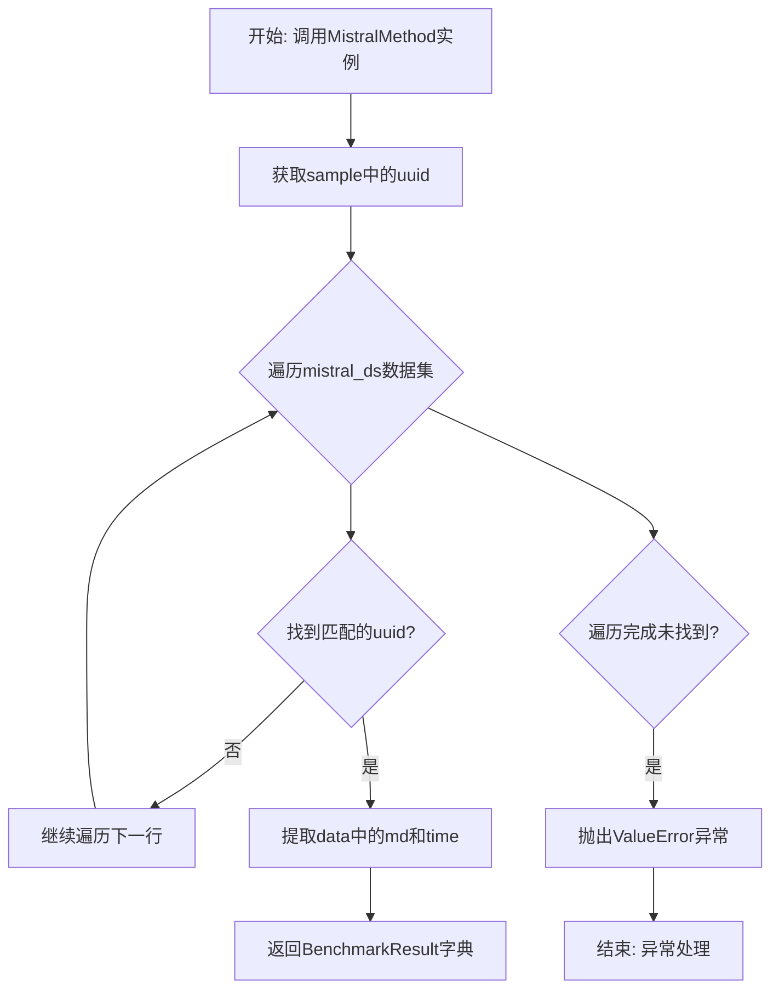
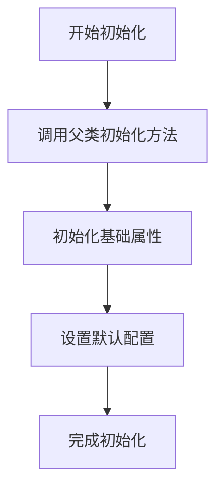
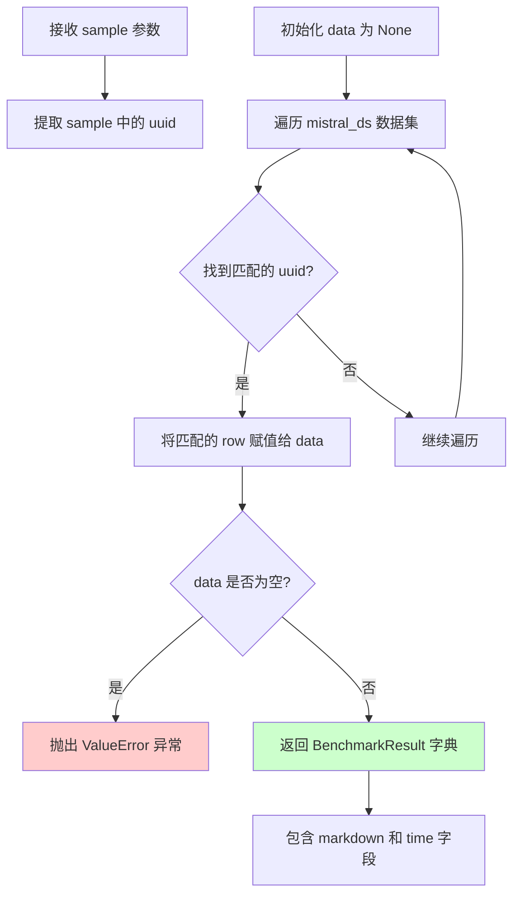

# `marker\benchmarks\overall\methods\mistral.py` 详细设计文档

该代码实现了一个MistralMethod类，继承自BaseMethod，用于在基准测试中根据样本UUID从Mistral数据集中检索对应的markdown文档和执行时间信息，并返回包含markdown内容和耗时的BenchmarkResult结果。

## 整体流程



## 类结构

```
BaseMethod (抽象基类)
└── MistralMethod (实现类)
```

## 全局变量及字段


### `datasets`
    
Hugging Face 数据集加载库，用于读取和处理结构化数据集

类型：`module`
    


### `BaseMethod`
    
基准测试方法的抽象基类，定义了调用接口供子类实现

类型：`class`
    


### `BenchmarkResult`
    
基准测试结果容器，通常以字典形式返回markdown和时间等字段

类型：`class`
    


### `MistralMethod.mistral_ds`
    
Mistral模型输出的数据集，包含uuid、md和time字段

类型：`datasets.Dataset`
    
    

## 全局函数及方法


### `BaseMethod.__init__`

基类构造函数，用于初始化基准测试方法的基本属性和状态。由于代码中未显示具体实现，以下信息基于代码上下文和常见设计模式的推断。

参数：

- `self`：对象实例本身，包含子类的所有属性

返回值：无（`None`），构造函数不返回值

#### 流程图



#### 带注释源码

```
# 注意：以下源码为基于代码上下文的推断，并非给定代码中的实际实现
# 实际的 BaseMethod 实现需要在 benchmarks.overall.methods 模块中查看

class BaseMethod:
    """
    基准测试方法的基类，定义统一的接口规范
    """
    
    def __init__(self):
        """
        构造函数：初始化基类属性
        
        可能包含：
        - 配置参数初始化
        - 资源加载状态标记
        - 日志记录器设置
        """
        self.is_initialized = False
        # 其他基础属性的初始化...
    
    def __call__(self, sample):
        """
        抽象方法：执行基准测试
        需要在子类中实现具体逻辑
        """
        raise NotImplementedError("子类必须实现 __call__ 方法")
```

#### 补充说明

由于给定代码中未显示 BaseMethod 的实际实现，以上信息基于以下推断依据：

1. **继承关系**：MistralMethod 继承自 BaseMethod，表明 BaseMethod 提供了基础接口
2. **调用模式**：MistralMethod 实现了 `__call__` 方法，使其可像函数一样被调用，这是装饰器模式的应用
3. **模块位置**：位于 benchmarks.overall.methods，说明是基准测试框架的标准基类

如需获取 BaseMethod 的完整实现，建议查看 `benchmarks/overall/methods.py` 源文件。


### `MistralMethod.__call__`

该方法是 MistralMethod 类的核心调用方法，通过传入的样本 UUID 在预加载的 Mistral 数据集中查找对应的数据记录，并返回包含 Markdown 内容和处理时间的基准测试结果。

参数：

- `sample`：`dict`，包含 UUID 的样本字典，用于在数据集中定位对应的记录

返回值：`BenchmarkResult`，返回一个字典，包含 `markdown`（Markdown 内容）和 `time`（处理时间）两个字段

#### 流程图



#### 带注释源码

```python
import datasets

from benchmarks.overall.methods import BaseMethod, BenchmarkResult


class MistralMethod(BaseMethod):
    """基于 Mistral 模型的基准测试方法类"""
    
    # 类字段：存储 Mistral 数据集，初始化为 None
    mistral_ds: datasets.Dataset = None

    def __call__(self, sample) -> BenchmarkResult:
        """
        调用方法，从 Mistral 数据集中查找并返回对应 UUID 的基准测试结果
        
        参数:
            sample: 包含 uuid 字段的样本字典，用于定位数据记录
            
        返回:
            BenchmarkResult: 包含 markdown 和 time 字段的字典
            
        异常:
            ValueError: 当无法找到对应 UUID 的数据时抛出
        """
        # 从样本中提取 UUID
        uuid = sample["uuid"]
        
        # 初始化 data 为 None
        data = None
        
        # 遍历整个 Mistral 数据集查找匹配的 UUID
        for row in self.mistral_ds:
            # 将 row 和 sample 的 UUID 都转换为字符串进行比较
            if str(row["uuid"]) == str(uuid):
                # 找到匹配记录后跳出循环
                data = row
                break
        
        # 如果未找到对应数据，抛出 ValueError 异常
        if not data:
            raise ValueError(f"Could not find data for uuid {uuid}")

        # 返回包含 markdown 和 time 的 BenchmarkResult 字典
        return {
            "markdown": data["md"],
            "time": data["time"]
        }
```


### `MistralMethod.__call__`

这是一个使得 MistralMethod 实例可调用的方法，通过传入的样本字典中的 uuid 在 mistral_ds 数据集中查找对应的记录，并返回包含 markdown 文档和执行时间的 BenchmarkResult 字典。

参数：

- `sample`：`dict`，包含uuid的样本字典

返回值：`BenchmarkResult`，包含markdown文档和执行时间的字典

#### 流程图

```mermaid
flowchart TD
    A([开始]) --> B[提取uuid: uuid = sample["uuid"]]
    B --> C[初始化 data = None]
    C --> D{遍历 self.mistral_ds}
    D --> E{当前行的uuid == 请求的uuid?}
    E -->|是| F[设置 data = 当前行]
    F --> G[跳出循环]
    G --> H{data 是否为空?}
    E -->|否| D
    H -->|否| I[返回 {"markdown": data["md"], "time": data["time"]}]
    H -->|是| J[抛出 ValueError: Could not find data for uuid {uuid}]
    I --> K([结束])
    J --> K
```

#### 带注释源码

```python
def __call__(self, sample) -> BenchmarkResult:
    """
    通过 uuid 在数据集中查找对应的记录并返回结果
    
    参数:
        sample: 包含 uuid 键的字典，用于指定要查询的样本
    
    返回:
        包含 markdown 文档和执行时间的字典
    
    异常:
        ValueError: 当找不到对应 uuid 的数据时抛出
    """
    # 从输入样本中提取 uuid
    uuid = sample["uuid"]
    
    # 初始化 data 为 None，用于存储查询结果
    data = None
    
    # 遍历整个 mistral_ds 数据集，线性查找匹配的 uuid
    # 注意：这是 O(n) 时间复杂度，存在性能优化空间
    for row in self.mistral_ds:
        # 使用 str() 确保类型一致后再比较
        if str(row["uuid"]) == str(uuid):
            data = row
            break  # 找到匹配后立即跳出循环
    
    # 如果遍历完整个数据集仍未找到匹配，抛出异常
    if not data:
        raise ValueError(f"Could not find data for uuid {uuid}")
    
    # 返回包含 markdown 和执行时间的 BenchmarkResult
    return {
        "markdown": data["md"],   # markdown 文档内容
        "time": data["time"]      # 执行时间
    }
```

## 关键组件


### MistralMethod 类

继承自 BaseMethod 的方法类，用于通过 UUID 在数据集中查找对应的记录并返回 markdown 内容和处理时间。

### BaseMethod 基类

作为所有方法类的抽象基类，定义方法调用接口和 BenchmarkResult 返回类型。

### 张量索引与惰性加载

代码中使用 for 循环遍历整个数据集来查找匹配的 uuid，这是一种低效的线性搜索方式，每次调用都需要遍历整个数据集直到找到匹配项，没有利用数据集的索引机制。

### 数据集查询逻辑

通过字符串比较 `str(row["uuid"]) == str(uuid)` 进行精确匹配，查找对应的数据记录。

### 错误处理机制

当未找到对应 uuid 的数据时，抛出 ValueError 异常并包含具体的 uuid 信息。

### BenchmarkResult 返回结构

返回一个包含 "markdown" 和 "time" 字段的字典对象，作为基准测试的结果。


## 问题及建议


### 已知问题

-   **线性搜索性能瓶颈**：`__call__` 方法中通过遍历整个数据集查找 uuid，时间复杂度为 O(n)，当数据集规模较大时性能极差
-   **缺少索引机制**：未对 `mistral_ds` 构建 uuid 到数据行的索引映射，导致每次调用都需全表扫描
-   **类型注解不规范**：`mistral_ds` 声明为 `datasets.Dataset = None`，缺少 `Optional` 类型标注，且类字段初始化为 `None` 而非在 `__init__` 中初始化
-   **字段名硬编码**：多处使用字符串硬编码（`"uuid"`, `"md"`, `"time"`），缺乏常量定义，字段名变更时维护成本高
-   **异常处理不全面**：仅处理了数据未找到的情况，未处理 `KeyError`（如 sample 缺少 uuid 字段）等潜在异常
-   **参数类型缺失**：`sample` 参数和返回值 `BenchmarkResult` 缺少类型注解，影响静态检查和代码可读性

### 优化建议

-   **构建索引字典**：在类初始化或首次调用时，将 `mistral_ds` 转换为 `{uuid: row}` 形式的字典，实现 O(1) 查找
-   **添加缓存机制**：使用 `@functools.lru_cache` 或实例级缓存，避免重复查找
-   **完善类型注解**：修改为 `mistral_ds: Optional[datasets.Dataset] = None`，并在 `__call__` 方法中添加参数和返回值的类型注解
-   **提取常量定义**：将字段名定义为类常量或枚举，如 `UUID_FIELD = "uuid"`
-   **增强异常处理**：添加对 sample 结构、KeyError 等情况的处理，提供更友好的错误信息
-   **考虑懒加载**：如果数据集很大，可使用 `datasets.Dataset.to_dict()` 或生成器按需加载

## 其它


### 设计目标与约束

**设计目标**：通过UUID在数据集中高效检索对应的markdown文档和执行时间信息，为基准测试框架提供统一的方法调用接口。

**约束条件**：
- 输入sample必须包含uuid字段，且uuid为字符串类型
- mistral_ds数据集必须包含uuid、md、time三个字段
- 数据集加载由外部负责，类内部不处理数据集的加载和缓存策略

### 错误处理与异常设计

**异常类型**：
- `ValueError`：当根据uuid无法在数据集中找到对应记录时抛出，错误信息包含无法找到的uuid值

**异常处理策略**：
- 查找失败时立即抛出异常，不返回空值或默认值
- 异常信息格式：`"Could not find data for uuid {uuid}"`，便于调试和日志追踪

**潜在异常**：
- `KeyError`：当sample中缺少uuid字段，或数据集中缺少必要字段时可能抛出
- `TypeError`：当uuid类型不匹配（str vs int）时可能抛出

### 数据流与状态机

**输入数据流**：
```
sample(dict) 
    ↓
uuid提取(sample["uuid"])
    ↓
数据遍历(self.mistral_ds)
    ↓
UUID匹配(str(row["uuid"]) == str(uuid))
    ↓
数据提取(row["md"], row["time"])
    ↓
BenchmarkResult返回
```

**状态转换**：
- IDLE → LOADING(数据集就绪)
- LOADING → SEARCHING(开始查找)
- SEARCHING → FOUND(匹配成功) / NOT_FOUND(匹配失败)

### 外部依赖与接口契约

**依赖项**：
- `datasets`：HuggingFace datasets库，用于加载和处理数据集
- `benchmarks.overall.methods.BaseMethod`：基类，定义方法调用的标准接口
- `benchmarks.overall.methods.BenchmarkResult`：返回值类型注解

**接口契约**：
- `__call__(self, sample) -> BenchmarkResult`：方法必须实现可调用接口
- 输入：sample为字典，必须包含uuid键
- 输出：返回字典，包含markdown和time两个键

### 性能考虑与优化空间

**当前性能问题**：
- 线性遍历数据集查找UUID，时间复杂度O(n)
- 每次调用都重新遍历，未利用索引或缓存

**优化建议**：
- 预先构建uuid到数据行的哈希映射，将查找复杂度降至O(1)
- 使用数据集的filter或select方法利用索引
- 考虑添加LRU缓存机制存储热点数据
- 数据集较大时考虑分片加载

### 安全性考虑

**输入验证**：
- 缺少uuid字段时会在访问sample["uuid"]时抛出KeyError
- 建议在方法开头增加参数校验

**数据安全**：
- 仅读取数据，不涉及敏感操作
- uuid比较使用str()转换避免类型不一致问题

### 并发与线程安全

**并发分析**：
- 类本身不包含共享状态，理论上线程安全
- mistral_ds的迭代行为取决于数据集实现
- 多线程同时调用时每个线程独立遍历数据集

**建议**：
- 如需并发优化，考虑预先构建索引结构
- 数据集迭代可能非线程安全，需确认datasets库的实现

### 使用示例

```python
# 初始化方法
method = MistralMethod()
method.mistral_ds = datasets.load_dataset("mistral/benchmark")["train"]

# 调用执行
sample = {"uuid": "12345"}
result = method(sample)
# result: {"markdown": "# Title", "time": 1.23}
```

### 版本兼容性

**Python版本**：建议Python 3.8+

**依赖版本**：
- `datasets`库：2.0.0及以上
- `benchmarks.overall.methods`：需与BaseMethod接口兼容

### 单元测试建议

**测试用例**：
- 正常查找：验证返回正确的markdown和time
- UUID未找到：验证抛出ValueError
- 缺少uuid字段：验证抛出KeyError
- UUID类型转换：验证整型和字符串UUID都能匹配
- 空数据集：验证行为正确性


    