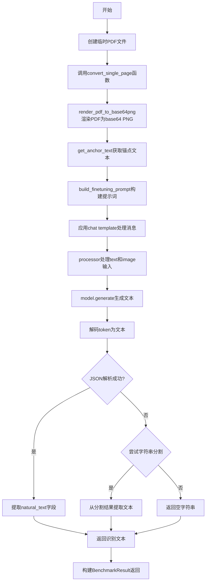
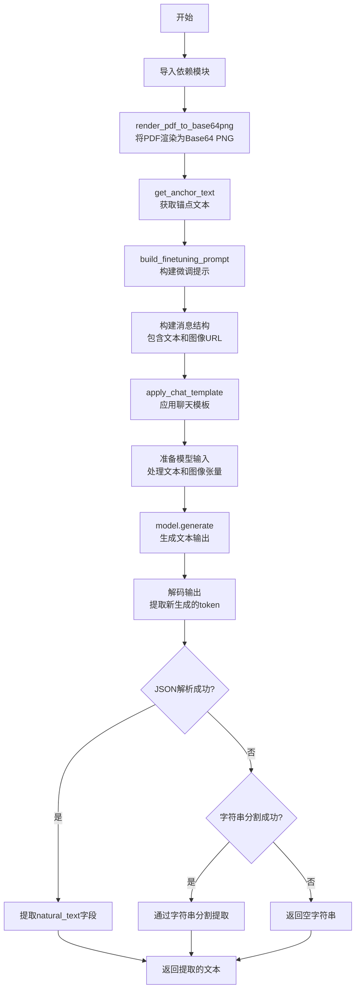
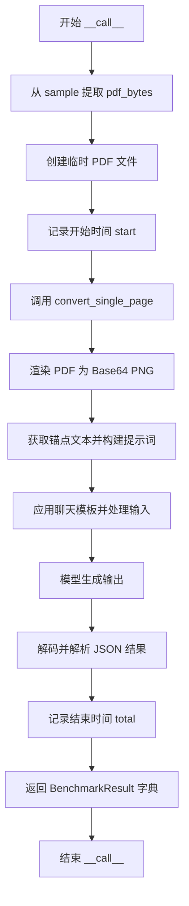

# `marker\benchmarks\overall\methods\olmocr.py` 详细设计文档

该代码实现了一个PDF文档OCR识别方法，通过调用OlmOCR模型将PDF页面转换为结构化文本，支持单页PDF的渲染、提示构建、模型推理和JSON结果解析。

## 整体流程



## 类结构

```
BaseMethod (抽象基类)
└── OlmOCRMethod (PDF OCR识别方法类)
```

## 全局变量及字段


### `convert_single_page`
    
将单个PDF页面渲染为图像并进行OCR识别的核心函数

类型：`function`
    


### `BaseMethod`
    
基准测试方法基类，定义接口规范

类型：`class`
    


### `BenchmarkResult`
    
基准测试结果类型，包含markdown和time字段

类型：`dict`
    


### `OlmOCRMethod.olmocr_model`
    
存储模型和处理器等配置，包含model、processor和device信息

类型：`dict`
    


### `OlmOCRMethod.use_llm`
    
是否使用LLM标志，当前未使用

类型：`bool`
    
    

## 全局函数及方法


### `convert_single_page`

将单个PDF页面渲染为图像，通过OCR模型提取页面中的文本内容，解析模型输出的JSON结果并返回自然文本。

参数：

- `filename`：`str`，PDF文件的路径
- `model`：模型对象，用于文本生成的视觉-语言模型
- `processor`：处理器对象，用于处理文本模板和图像输入
- `device`：`torch.device`，运行模型的设备（CPU或CUDA）

返回值：`str`，从PDF页面提取的自然文本内容

#### 流程图



#### 带注释源码

```python
def convert_single_page(filename: str, model, processor, device):
    """
    将单个PDF页面转换为文本内容
    
    Args:
        filename: PDF文件的路径
        model: 视觉-语言模型实例
        processor: 用于处理文本和图像的处理器
        device: 模型运行的设备
    
    Returns:
        从PDF页面提取的文本内容
    """
    # 动态导入，避免顶层依赖冲突
    from olmocr.data.renderpdf import render_pdf_to_base64png
    from olmocr.prompts import build_finituning_prompt
    from olmocr.prompts.anchor import get_anchor_text

    # Step 1: 将PDF第一页渲染为Base64编码的PNG图像
    # target_longest_image_dim=1024 限制图像最长边为1024像素
    image_base64 = render_pdf_to_base64png(filename, 1, target_longest_image_dim=1024)

    # Step 2: 获取锚点文本，用于辅助模型理解文档结构
    # pdf_engine="pdfreport" 指定PDF解析引擎
    # target_length=4000 限制锚点文本长度
    anchor_text = get_anchor_text(filename, 1, pdf_engine="pdfreport", target_length=4000)
    
    # Step 3: 构建微调提示，将锚点文本融入指令中
    prompt = build_finetuning_prompt(anchor_text)

    # Step 4: 构建符合ChatML格式的消息结构
    # 包含用户角色、文本指令和Base64编码的图像
    messages = [
        {
            "role": "user",
            "content": [
                {"type": "text", "text": prompt},
                {"type": "image_url", "image_url": {"url": f"data:image/png;base64,{image_base64}"}},
            ],
        }
    ]

    # Step 5: 应用聊天模板，添加生成提示
    # tokenize=False 返回字符串而非token IDs
    # add_generation_prompt=True 在末尾添加模型生成标记
    text = processor.apply_chat_template(messages, tokenize=False, add_generation_prompt=True)
    
    # Step 6: 解码Base64图像为PIL Image对象
    main_image = Image.open(BytesIO(base64.b64decode(image_base64)))

    # Step 7: 准备模型输入
    # 文本和图像分别处理，padding=True 批量对齐
    # return_tensors="pt" 返回PyTorch张量
    inputs = processor(
        text=[text],
        images=[main_image],
        padding=True,
        return_tensors="pt",
    )
    
    # Step 8: 将输入张量移动到指定设备（CPU/CUDA）
    inputs = {key: value.to(device) for (key, value) in inputs.items()}

    # Step 9: 模型推理生成文本
    # temperature=0.8 控制采样随机性
    # max_new_tokens=8192 限制最大生成长度
    # do_sample=True 启用采样而非贪婪解码
    output = model.generate(
        **inputs,
        temperature=0.8,
        max_new_tokens=8192,
        num_return_sequences=1,
        do_sample=True,
    )

    # Step 10: 解码输出，去除输入部分
    # 计算输入token长度，仅保留模型新生成的部分
    prompt_length = inputs["input_ids"].shape[1]
    new_tokens = output[:, prompt_length:]
    
    # 批量解码，skip_special_tokens=True 去除特殊标记
    text_output = processor.tokenizer.batch_decode(
        new_tokens, skip_special_tokens=True
    )[0]

    # Step 11: 解析模型输出
    # 尝试解析JSON格式的输出
    try:
        text_output = json.loads(text_output)
        text = text_output["natural_text"]
    except Exception:
        # JSON解析失败时，尝试通过字符串分割提取
        try:
            text = text_output.split("natural_text")[1].strip()
        except Exception:
            # 提取失败返回空字符串
            text = ""

    return text
```


### `OlmOCRMethod.__call__`

该方法是 `OlmOCRMethod` 类的可调用接口实现，接收包含 PDF 数据的样本字典，将 PDF 写入临时文件后调用 `convert_single_page` 函数进行 OCR 识别，返回包含识别文本（markdown）和处理耗时的基准测试结果。

参数：

- `self`：`OlmOCRMethod` 实例本身，包含模型、处理器等依赖
- `sample`：`dict`，样本字典，必须包含键 `"pdf"`，值为 PDF 文件的字节数据（单页 PDF）

返回值：`BenchmarkResult`，基准测试结果字典，包含以下键值对：
- `"markdown"`：`str`，OCR 识别出的文本内容
- `"time"`：`float`，处理该 PDF 页面所花费的时间（秒）

#### 流程图



#### 带注释源码

```python
def __call__(self, sample) -> BenchmarkResult:
    """
    可调用接口实现，处理单个 PDF 样本并返回 OCR 识别结果。
    
    参数:
        sample: 包含 PDF 数据的字典，必须有 'pdf' 键，值为字节数据
        
    返回值:
        BenchmarkResult: 包含识别文本和耗时的字典
    """
    # 从样本中提取 PDF 字节数据（单页 PDF）
    pdf_bytes = sample["pdf"]
    
    # 创建临时 PDF 文件以便传递给底层处理函数
    # 使用 tempfile.NamedTemporaryFile 确保文件在使用后自动清理
    with tempfile.NamedTemporaryFile(suffix=".pdf", mode="wb") as f:
        # 将 PDF 字节写入临时文件
        f.write(pdf_bytes)
        
        # 记录处理开始时间
        start = time.time()
        
        # 调用核心 OCR 处理函数，传入临时文件路径、模型、处理器和设备
        # 该函数内部完成 PDF 渲染、提示词构建、模型推理和结果解析
        result = convert_single_page(
            f.name, 
            self.olmocr_model["model"], 
            self.olmocr_model["processor"], 
            self.olmocr_model["model"].device
        )
        
        # 计算总处理耗时
        total = time.time() - start
    
    # 返回基准测试结果，包含 OCR 识别的文本（markdown 格式）和处理时间
    return {
        "markdown": result,  # OCR 识别出的自然语言文本
        "time": total        # 处理耗时（秒）
    }
```

## 关键组件


### PDF渲染与Base64编码

将PDF文件单页渲染为Base64编码的PNG图像，支持指定最长图像维度（默认1024）

### 锚点文本提取

从PDF中提取指定长度的锚点文本（目标长度4000），用于构建OCR提示

### 微调提示构建

使用锚点文本构建微调提示，用于指导模型进行文档OCR识别

### 聊天模板应用

将构建好的消息列表应用聊天模板，生成模型输入的文本格式，支持添加生成提示

### 图像与文本输入处理

将文本和图像转换为PyTorch张量格式，并移动到指定设备（CPU/GPU）

### 模型文本生成

使用因果语言模型生成OCR文本，支持温度采样、最大新token数控制等参数配置

### 输出解码与JSON解析

从模型生成的token中提取新生成的文本，尝试解析为JSON格式并提取natural_text字段，失败时回退到字符串分割

### OlmOCRMethod类

继承BaseMethod的OCR方法实现类，管理模型和processor实例，负责单页PDF到markdown文本的转换流程

### 临时文件管理

使用命名临时文件暂存PDF字节数据，传递给渲染函数使用

### 性能计时

记录OCR处理耗时，用于性能基准测试


## 问题及建议


### 已知问题

- **临时文件I/O开销**：每次调用都创建临时文件并写入PDF字节，引入不必要的磁盘I/O操作，可以直接使用内存文件对象或BytesIO替代
- **异常处理过于宽泛**：使用两个嵌套的try-except捕获JSON解析异常，逻辑不够清晰，且捕获所有Exception可能导致隐藏真正的问题
- **硬编码参数**：temperature、max_new_tokens、target_longest_image_dim、target_length等参数直接写在代码中，缺乏灵活配置
- **类型标注不准确**：`olmocr_model: dict = None` 应使用更具体的类型如`Optional[Dict[str, Any]]`，且未标注`use_llm`的类型
- **设备获取方式不健壮**：直接使用`self.olmocr_model["model"].device`获取设备，如果model对象结构变化会导致运行时错误
- **缺乏输入验证**：未验证`sample["pdf"]`是否存在或为有效PDF数据，可能导致后续处理失败
- **未处理生成异常**：model.generate调用没有异常处理，可能导致整个流程崩溃
- **潜在空值风险**：result可能返回空字符串""，调用方需要额外处理

### 优化建议

- 使用`tempfile.NamedTemporaryFile(delete=False)`并确保显式删除，或直接使用BytesIO进行内存操作
- 提取JSON解析逻辑为独立函数，使用更具体的异常类型（如json.JSONDecodeError），并添加日志记录
- 将硬编码参数提取为类属性或配置文件，支持通过初始化参数或环境变量传入
- 使用`dataclass`或`TypedDict`定义olmocr_model的结构，增强类型安全
- 添加设备获取的默认值处理和错误提示
- 在`__call__`方法开头添加输入验证，检查sample的必需键和PDF数据有效性
- 在model.generate调用周围添加try-except，捕获可能的CUDA内存不足或生成错误
- 对返回结果进行预检查，提供默认空值或抛出明确的业务异常

## 其它


### 设计目标与约束

本代码旨在实现将PDF文档转换为结构化文本（markdown格式）的OCR功能。设计目标包括：1）支持单页PDF的文本提取；2）利用视觉语言模型进行文档理解；3）提供统一的BenchmarkResult输出格式。约束条件包括：1）依赖PyTorch和GPU进行推理；2）输入PDF必须是单页；3）最大生成长度限制为8192 tokens；4）模型推理温度固定为0.8。

### 错误处理与异常设计

代码采用三层异常处理机制：第一层在JSON解析阶段，使用try-except捕获json.loads失败；第二层在字符串分割阶段，捕获natural_text字段提取失败；第三层在convert_single_page调用外层，BenchmarkResult返回空markdown。当前缺陷是异常被静默吞噬，返回空字符串而非抛出明确错误码，建议改为返回结构化错误信息并记录详细日志。

### 数据流与状态机

数据流如下：1）输入sample获取pdf_bytes；2）写入临时PDF文件；3）render_pdf_to_base64png将PDF渲染为base64图像；4）get_anchor_text获取锚点文本；5）build_finetuning_prompt构建提示词；6）processor处理文本和图像；7）model.generate生成结果；8）解析JSON输出。没有状态机设计，属于同步单次调用流程。

### 外部依赖与接口契约

核心依赖包括：1）olmocr.data.renderpdf.render_pdf_to_base64png：PDF渲染函数；2）olmocr.prompts.build_finetuning_prompt：提示词构建；3）olmocr.prompts.anchor.get_anchor_text：锚点文本获取；4）torch和PIL图像处理。输入契约：sample字典包含"pdf"键，值为PDF字节；输出契约：返回BenchmarkResult字典，包含markdown（字符串）和time（浮点数）字段。

### 性能考量

当前性能特征：1）每次调用创建临时文件，I/O开销；2）图像base64编解码两次；3）模型推理占主要时间。优化方向：1）使用内存缓冲区替代临时文件；2）传递图像字节而非重新编码；3）添加批处理支持；4）考虑模型量化推理。

### 安全性考虑

代码存在以下安全风险：1）临时文件创建后未显式删除（依赖GC）；2）PDF内容直接写入临时文件可能被其他进程读取；3）无输入验证，恶意PDF可能导致资源耗尽。建议：1）使用secure_tempfile或内存文件系统；2）添加PDF大小和页数校验；3）处理完成后立即删除临时文件。

### 配置管理

模型配置（model、processor、device）通过olmocr_model字典传入，属于依赖注入模式。当前硬编码参数包括：target_longest_image_dim=1024、target_length=4000、temperature=0.8、max_new_tokens=8192。建议将这些参数提取到配置文件中，支持运行时调整。

### 测试策略

建议测试覆盖：1）正常PDF转换功能；2）空PDF或损坏PDF的处理；3）JSON解析失败的fallback逻辑；4）多线程并发调用；5）临时文件清理验证。单元测试应mock OlmOCRModel，集成测试使用真实模型。

### 监控与日志

当前缺少日志记录和性能监控。建议添加：1）PDF处理开始和结束的timestamp日志；2）各阶段耗时统计（渲染、推理、解析）；3）异常发生时的上下文信息；4）集成metrics上报（如Prometheus）用于生产环境监控。

    