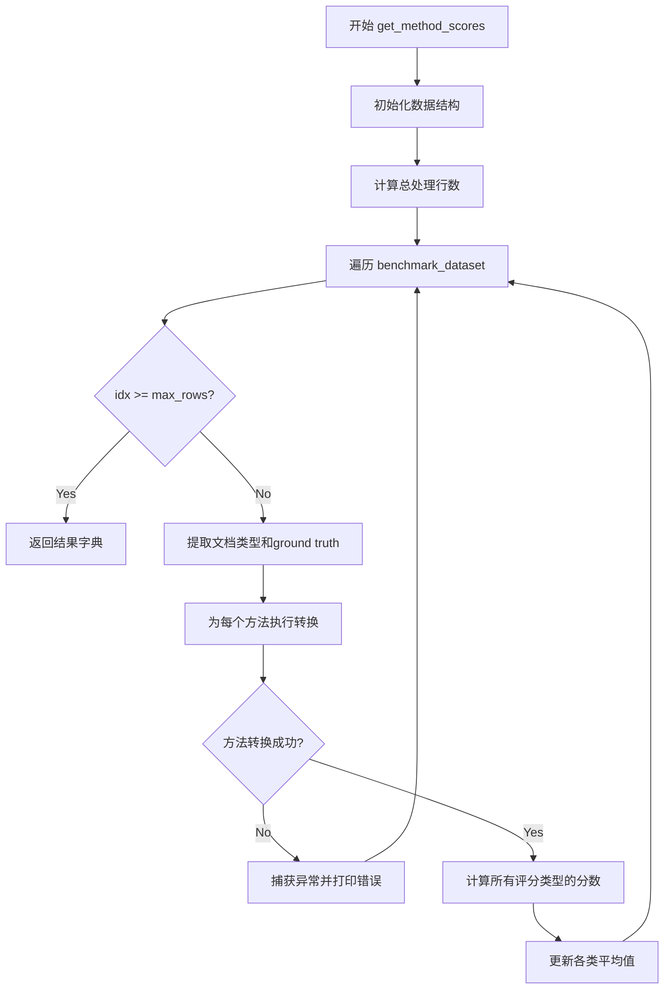
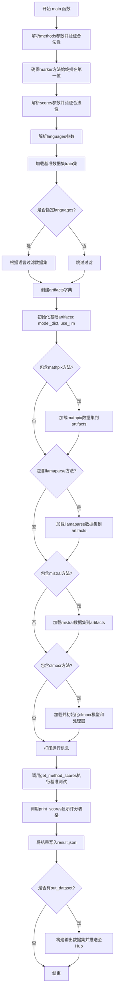

# `marker\benchmarks\overall\overall.py` 详细设计文档

这是一个基准测试脚本，用于评估和比较不同的PDF转Markdown转换方法（如Marker, Mathpix等）。它通过命令行参数加载数据集和配置，运行各种转换方法，根据启发式或LLM评分标准对输出进行评分，按文档类型和块类型聚合结果，并最终生成表格和JSON结果文件。

## 整体流程

```mermaid
graph TD
    A[开始: main()] --> B[解析命令行参数]
    B --> C[加载基准数据集 dataset]
    C --> D{是否指定语言?}
    D -- 是 --> E[根据语言过滤数据集]
    D -- 否 --> F[准备 Artifacts (模型/数据集)]
    E --> F
    F --> G[调用 get_method_scores()]
    G --> H[遍历数据集样本]
    H --> I[解析 Ground Truth (gt_blocks)]
    I --> J[遍历方法列表 (methods)]
    J --> K[实例化方法类 METHOD_REGISTRY[method]]
    K --> L[执行转换获取 markdown]
    L --> M[遍历评分类型 (score_types)]
    M --> N[计算分数 SCORE_REGISTRY[score_type]]
    N --> O[更新 averages_by_type 和 averages_by_block_type]
    M --> P{还有更多评分类型?}
    P -- 是 --> M
    P -- 否 --> Q{还有更多方法?}
    Q -- 是 --> J
    Q -- 否 --> R{还有更多样本?}
    R -- 是 --> H
    R -- 否 --> S[返回结果字典 (scores, markdown, averages)]
    S --> T[调用 print_scores 生成表格]
    T --> U[保存 result.json]
    U --> V{是否指定输出数据集?}
    V -- 是 --> W[构建并推送 Dataset 到 Hub]
    V -- 否 --> X[结束]
```

## 类结构

```
Main Script (Procedural)
├── Dependencies (Registries)
│   ├── METHOD_REGISTRY (管理如 marker, mathpix 等转换方法)
│   └── SCORE_REGISTRY (管理如 heuristic, llm 等评分方法)
└── Data Structures
    ├── Input: datasets.Dataset
    └── Output: FullResult (Dict structure)
```

## 全局变量及字段


### `bench_scores`
    
存储每个样本的评分结果，以样本索引为键

类型：`dict`
    


### `averages_by_type`
    
按文档类型和方法存储评分的平均值，用于后续统计分析

类型：`defaultdict`
    


### `averages_by_block_type`
    
按块类型和方法存储评分的平均值，用于评估不同内容块的效果

类型：`defaultdict`
    


### `average_times`
    
存储每个方法处理每个样本所需的时间列表

类型：`defaultdict`
    


### `markdown_by_method`
    
存储每个样本每个方法生成的markdown结果

类型：`defaultdict`
    


### `total_rows`
    
基准数据集的总行数，若设置max_rows则取两者的较小值

类型：`int`
    


### `out_data`
    
临时存储当前样本的评分数据，按方法和评分类型组织

类型：`defaultdict`
    


### `artifacts`
    
存储模型、数据集等资源对象，供各方法使用

类型：`dict`
    


### `methods`
    
待评估的方法名称列表，如marker、mathpix等

类型：`List[str]`
    


### `score_types`
    
使用的评分函数类型列表，如heuristic、llm

类型：`List[str]`
    


### `languages`
    
筛选数据集的语言列表，若为None则处理所有语言

类型：`List[str] | None`
    


### `out_path`
    
结果输出的目录路径

类型：`Path`
    


    

## 全局函数及方法


### `get_method_scores`

该函数是PDF转Markdown基准测试的核心引擎，遍历基准数据集，对每个文档样本执行多种转换方法，将每种方法的输出与ground truth进行比较，计算多维度的评分指标（支持按文档类型和块类型聚合），并收集性能时间数据，最终返回完整的评分结果、生成的markdown内容、各类平均值和平均处理时间。

参数：

- `benchmark_dataset`：`datasets.Dataset`，输入的基准数据集，包含待评估的文档样本
- `methods`：`List[str]` ，要评估的转换方法标识列表，如 ["marker", "mathpix"]
- `score_types`：`List[str]` ，用于评分的评分器类型列表，如 ["heuristic", "llm"]
- `artifacts`：`dict`，包含方法所需的模型资源和其他依赖的字典（如 model_dict、use_llm 等）
- `max_rows`：`int`，可选参数，限制处理的样本数量上限

返回值：`dict`（映射到 FullResult 类型），包含以下键：
- `scores`：dict，按样本索引和方法存储的详细评分数据
- `markdown`：dict，按样本索引和方法存储的生成markdown内容
- `averages_by_type`：defaultdict，按方法和评分类型及文档类型聚合的平均分
- `averages_by_block_type`：defaultdict，按方法和评分类型及块类型聚合的平均分
- `average_times`：defaultdict，每种方法的平均处理时间列表

#### 流程图



#### 带注释源码

```python
def get_method_scores(benchmark_dataset: datasets.Dataset, methods: List[str], score_types: List[str], artifacts: dict, max_rows=None) -> FullResult:
    """
    执行PDF转Markdown基准测试的核心函数
    
    参数:
        benchmark_dataset: HuggingFace datasets库的数据集对象
        methods: 要评估的方法名称列表
        score_types: 评分器类型列表
        artifacts: 包含模型和资源的字典
        max_rows: 可选的行数限制
    
    返回:
        包含评分、markdown内容、各类平均值的字典
    """
    
    # 存储每个样本的详细评分结果 {idx: {method: {score_type: scores}}}
    bench_scores = {}
    
    # 三层嵌套defaultdict: method -> score_type -> doc_type -> [scores列表]
    averages_by_type = defaultdict(lambda: defaultdict(lambda: defaultdict(list)))
    
    # 按块类型聚合的评分: method -> score_type -> block_type -> [scores列表]
    averages_by_block_type = defaultdict(lambda: defaultdict(lambda: defaultdict(list)))
    
    # 存储每种方法的处理时间
    average_times = defaultdict(list)
    
    # 存储生成的markdown: {idx: {method: markdown}}
    markdown_by_method = defaultdict(dict)
    
    # 确定实际要处理的行数
    total_rows = len(benchmark_dataset)
    if max_rows:
        total_rows = min(max_rows, total_rows)
    
    # 遍历数据集样本，使用tqdm显示进度
    for idx, sample in tqdm(enumerate(benchmark_dataset), desc="Running benchmark", total=total_rows):
        # 超过最大行数时退出循环
        if max_rows is not None and idx >= max_rows:
            break

        # 获取文档分类类型
        doc_type = sample["classification"]
        
        # 获取ground truth转换器并生成标准markdown
        gt_cls = METHOD_REGISTRY["gt"]
        gt_blocks = json.loads(sample["gt_blocks"])  # 解析ground truth的块结构
        gt_md = gt_cls(**artifacts)(sample)["markdown"]
        markdown_by_method[idx]["gt"] = gt_md

        # 存储当前样本的所有方法输出
        out_data = defaultdict(dict)

        try:
            # 遍历每种要评估的方法
            for method in methods:
                # 从注册表获取方法类并实例化
                method_cls = METHOD_REGISTRY[method](**artifacts)
                method_info = method_cls(sample)
                method_md = method_info["markdown"]
                
                # 防止None值导致后续处理失败
                if method_md is None:
                    method_md = ""

                # 记录处理时间
                average_times[method].append(method_info["time"])
                
                # 保存方法生成的markdown
                markdown_by_method[idx][method] = method_md

                # 遍历每种评分类型
                for score_type in score_types:
                    # 获取评分器类并实例化
                    score_cls = SCORE_REGISTRY[score_type]()
                    try:
                        # 计算该方法输出与ground truth的评分
                        scores = score_cls(sample, gt_md, method_md)
                    except Exception as e:
                        # 某些评分器可能失败（如LLM评分器）
                        print(f"Failed to score {method} with {score_type}: {e}")
                        continue

                    # 保存详细评分
                    out_data[method][score_type] = scores

                    # 按文档类型累加评分用于后续计算平均值
                    averages_by_type[method][score_type][doc_type].append(scores["score"])

                    # 检查评分器是否支持按块评分
                    if "by_block" in scores["specific_scores"]:
                        # 按块类型聚合评分
                        for score, gt_block in zip(scores["specific_scores"]["by_block"], gt_blocks):
                            averages_by_block_type[method][score_type][gt_block["block_type"]].append(score)
        except Exception as e:
            # 捕获整个样本处理过程中的异常
            print(f"Failed to process {idx}: {e}")
            traceback.print_exc()
            # 清理已失败样本的数据
            if idx in markdown_by_method:
                del markdown_by_method[idx]
            continue

        # 保存当前样本的评分数据
        bench_scores[idx] = out_data

    # 返回完整的结果字典
    return {
        "scores": bench_scores,
        "markdown": markdown_by_method,
        "averages_by_type": averages_by_type,
        "averages_by_block_type": averages_by_block_type,
        "average_times": average_times,
    }
```


### `main`

该函数是PDF转Markdown转换基准测试的入口点，负责解析命令行参数、加载数据集、初始化模型、运行基准测试并输出结果。它整合了多种PDF转换方法（如marker、mathpix、llamaparse等）并使用不同的评分机制（heuristic、llm）对转换质量进行评估和比较。

参数：

- `dataset`：`str`，基准数据集路径，默认为"datalab-to/marker_benchmark"
- `out_dataset`：`str`，输出数据集路径，默认为None
- `methods`：`str`，逗号分隔的要比较的方法列表，可选值包括marker、mathpix、llamaparse、docling、mistral
- `scores`：`str`，逗号分隔的评分函数列表，可选值包括heuristic、llm
- `result_path`：`str`，结果输出路径，默认为settings.OUTPUT_DIR/benchmark/overall
- `max_rows`：`int`，最大处理行数，默认为None表示处理全部
- `use_llm`：`bool`，是否使用LLM模型提升marker质量
- `languages`：`str`，逗号分隔的语言列表，用于过滤数据集，默认为None

返回值：`None`，该函数为Click命令行装饰器入口，执行完成后结果写入文件而非通过返回值传递

#### 流程图



#### 带注释源码

```python
@click.command(help="Benchmark PDF to MD conversion.")
@click.option("--dataset", type=str, help="Path to the benchmark dataset", default="datalab-to/marker_benchmark")
@click.option("--out_dataset", type=str, help="Path to the output dataset", default=None)
@click.option("--methods", type=str, help="Comma separated list of other methods to compare against.  Possible values: marker,mathpix,llamaparse,docling,mistral", default="marker")
@click.option("--scores", type=str, help="Comma separated list of scoring functions to use.  Possible values: heuristic,llm", default="heuristic")
@click.option("--result_path", type=str, default=os.path.join(settings.OUTPUT_DIR, "benchmark", "overall"), help="Output path for results.")
@click.option("--max_rows", type=int, default=None, help="Maximum number of rows to process.")
@click.option("--use_llm", is_flag=True, help="Use the LLM model for better marker quality.")
@click.option("--languages", type=str, help="Comma separated list of languages to use for LLM", default=None)
def main(
        dataset: str,
        out_dataset: str,
        methods: str,
        scores: str,
        result_path: str,
        max_rows: int,
        use_llm: bool,
        languages: str
):
    # 创建结果输出目录，如果不存在则递归创建
    out_path = Path(result_path)
    out_path.mkdir(parents=True, exist_ok=True)

    # 将methods参数字符串拆分为列表
    methods = methods.split(",")
    # 验证每个method是否在METHOD_REGISTRY中注册
    for method in methods:
        if method not in METHOD_REGISTRY:
            raise ValueError(f"Method {method} not allowed.  Allowed methods are {METHOD_REGISTRY.keys()}")

    # 确保marker方法始终作为第一个方法进行基准测试
    all_methods = list(set(methods))
    methods = ["marker"] if "marker" in all_methods else []
    methods += [m for m in all_methods if m != "marker"]

    # 将scores参数字符串拆分为列表
    score_types = scores.split(",")
    # 验证每个score_type是否在SCORE_REGISTRY中注册
    for score_type in score_types:
        if score_type not in SCORE_REGISTRY:
            raise ValueError(f"Score type {score_type} not allowed.  Allowed types are {SCORE_REGISTRY.keys()}")

    # 解析languages参数，如果为空则设为None
    if languages:
        languages = languages.split(",")
    else:
        languages = None

    # 从HuggingFace加载基准数据集
    benchmark_dataset = datasets.load_dataset(dataset, split="train")
    # 如果指定了languages，则按语言过滤数据集
    if languages:
        benchmark_dataset = benchmark_dataset.filter(lambda x: x["language"] in languages)

    # 初始化artifacts字典，包含模型配置和数据集占位符
    artifacts = {
        "model_dict": create_model_dict(),
        "use_llm": use_llm,
        "mathpix_ds": None,
        "llamaparse_ds": None,
    }

    # 根据methods列表动态加载额外的数据集资源
    if "mathpix" in methods:
        artifacts["mathpix_ds"] = datasets.load_dataset("datalab-to/marker_benchmark_mathpix", split="train")

    if "llamaparse" in methods:
        artifacts["llamaparse_ds"] = datasets.load_dataset("datalab-to/marker_benchmark_llamaparse", split="train")

    if "mistral" in methods:
        artifacts["mistral_ds"] = datasets.load_dataset("datalab-to/marker_benchmark_mistral", split="train")

    # 如果使用olmocr方法，需要加载大型视觉语言模型
    if "olmocr" in methods:
        from transformers import AutoProcessor, Qwen2VLForConditionalGeneration
        # 加载olmOCR模型， 使用bfloat16精度以节省显存
        model = Qwen2VLForConditionalGeneration.from_pretrained("allenai/olmOCR-7B-0225-preview",
                                                                torch_dtype=torch.bfloat16).eval()
        # 加载对应的处理器
        processor = AutoProcessor.from_pretrained("Qwen/Qwen2-VL-7B-Instruct")
        # 将模型移至可用设备（CUDA或CPU）
        model.to(torch.device("cuda" if torch.cuda.is_available() else "cpu"))
        # 将模型和处理器存入artifacts
        artifacts["olmocr_model"] = {"model": model, "processor": processor}

    # 打印基准测试配置信息
    print(f"Running benchmark with methods: {methods} and scores: {score_types}")
    # 执行核心基准测试逻辑，返回包含分数、markdown等内容的结果字典
    result = get_method_scores(benchmark_dataset, methods, score_types, artifacts, max_rows=max_rows)

    # 显示基准测试评分表格
    print_scores(result, out_path, methods, score_types, default_method=methods[0], default_score_type=score_types[0])

    # 将完整结果序列化为JSON并写入文件
    with open(out_path / "result.json", "w") as f:
        json.dump(result, f)

    # 如果指定了输出数据集，则构建并推送至Hub
    if out_dataset:
        # LLM版本在数据集名称后添加_llm后缀
        if use_llm:
            out_dataset += "_llm"
        # 构建输出数据集对象
        dataset = build_dataset(benchmark_dataset, result, score_types, max_rows=max_rows)
        # 推送至HuggingFace Hub，设为私有仓库
        dataset.push_to_hub(out_dataset, private=True)


if __name__ == "__main__":
    # 程序入口点
    main()
```

## 关键组件


### 张量索引与惰性加载

代码中使用惰性加载方式处理模型和数据集。通过`torch.cuda.is_available()`检查CUDA可用性，模型在需要时才加载到指定设备（GPU或CPU）。基准数据集使用`datasets.load_dataset`加载，支持通过`max_rows`参数限制处理行数实现惰性加载。

### 反量化支持

使用`torch.bfloat16`数据类型加载`olmOCR-7B-0225-preview`模型，实现反量化支持以平衡精度和内存使用。模型通过`.eval()`设置为推理模式，并使用`.to(torch.device(...))`移动到计算设备。

### 量化策略

代码中采用`torch.bfloat16`作为主要的量化策略，用于`Qwen2VLForConditionalGeneration`模型的加载和推理，以减少显存占用同时保持合理的精度。

### 数据集管理

使用`datasets`库管理基准数据集，支持加载多个外部数据集（marker_benchmark、marker_benchmark_mathpix、marker_benchmark_llamaparse、marker_benchmark_mistral）。支持语言过滤和行数限制功能。

### 方法注册表模式

通过`METHOD_REGISTRY`和`SCORE_REGISTRY`实现插件式架构，支持动态注册和调用不同的PDF转换方法（marker、mathpix、llamaparse、docling、mistral、olmocr）和评分方法（heuristic、llm）。

### 多维度评分系统

支持按文档类型（doc_type）和块类型（block_type）分别计算评分并累积平均值，便于细粒度分析不同方法在不同场景下的表现。

### 错误恢复机制

在循环中使用try-except捕获异常，单个样本处理失败不影响整体流程，并打印详细错误信息供调试使用。


## 问题及建议


### 已知问题

- **模型重复加载**：olmocr模型在`main`函数中加载，且在循环外部加载后放入artifacts，但其他模型（`create_model_dict()`）每次调用都会重新创建，缺乏缓存机制
- **GPU资源未正确释放**：模型加载到GPU后没有显式的清理代码，可能导致显存泄漏
- **异常处理过于宽泛**：外层`try-except`捕获所有异常并仅打印日志后`continue`，可能导致部分样本失败但无法追溯具体原因
- **JSON解析缺乏验证**：`json.loads(sample["gt_blocks"])`未做异常处理，若数据格式错误会导致整个流程中断
- **可变默认参数**：使用了`defaultdict(lambda: defaultdict(lambda: defaultdict(list)))`这样的深层嵌套结构，虽然不是可变默认参数，但结构复杂难以调试
- **数据集多次加载**：mathpix、llamaparse、mistral数据集在满足条件时分别单独加载，缺乏统一管理
- **魔法字符串散落**："gt"、"marker"、"markdown"等字符串在多处硬编码，缺乏常量定义
- **逻辑复杂度**：`main`函数职责过多，既要处理参数解析，又要管理资源配置，还要执行基准测试
- **潜在空值风险**：`method_info["markdown"]`访问后做None检查，但`method_info`本身未验证是否为None或是否包含"markdown"键

### 优化建议

- **模型缓存机制**：引入单例模式或全局缓存管理模型实例，避免重复加载
- **资源上下文管理器**：使用`torch.no_grad()`和上下文管理器管理GPU资源，或在结束时显式调用`del`释放显存
- **结构化异常处理**：针对不同异常类型进行分层处理，记录更详细的失败样本信息到独立日志文件
- **数据验证层**：在解析JSON前添加Schema验证，或使用try-except包装并记录具体字段错误
- **配置统一管理**：将数据集名称、评分类型等硬编码字符串提取为配置文件或枚举类
- **函数职责分离**：将`main`函数拆分为配置解析、资源初始化、基准执行、结果输出等独立模块
- **批处理优化**：对大规模数据集考虑批处理而非逐行迭代，减少I/O开销
- **日志增强**：使用结构化日志记录中间状态，便于问题排查和性能分析

## 其它


### 设计目标与约束

**设计目标**：标准化评估不同PDF转Markdown转换方法的性能，通过统一的基准数据集和评分机制，对比各方法的准确率、处理速度和输出质量。

**约束条件**：
- 依赖HuggingFace `datasets`库加载基准数据集
- 方法注册表(METHOD_REGISTRY)和评分注册表(SCORE_REGISTRY)需预先定义
- 模型加载需满足CUDA/CPU硬件约束
- 数据集需符合特定的schema结构（包含classification、gt_blocks等字段）

### 错误处理与异常设计

**异常处理策略**：
- **单个评分器失败**：捕获`score_cls`异常并打印错误信息，跳过该评分继续执行
- **样本处理失败**：捕获整行样本处理异常，记录错误并跳过该样本，确保基准测试继续进行
- **模型加载失败**：依赖transformers库的异常传播，需确保模型ID正确
- **数据集加载失败**：未显式捕获，可能导致程序终止

**关键异常点**：
- `json.loads(sample["gt_blocks"])`可能抛出JSON解析异常
- `method_cls(sample)`可能因方法实现问题失败
- LLM评分器可能因API问题失败

### 数据流与状态机

**数据流**：
1. CLI参数解析 → 加载配置
2. 加载HuggingFace数据集 → 过滤语言
3. 初始化各方法的artifacts（模型、数据集）
4. 遍历数据集样本 → 并行/串行执行各转换方法
5. 对每个方法输出执行多评分器评估
6. 聚合统计结果（按文档类型、按块类型）
7. 输出表格和JSON结果

**状态管理**：
- `markdown_by_method`：记录每个样本各方法的Markdown输出
- `bench_scores`：记录每个样本各方法各评分类型的分数
- `averages_by_type`：按文档类型聚合的平均分
- `averages_by_block_type`：按PDF块类型聚合的平均分

### 外部依赖与接口契约

**核心依赖**：
- `datasets`：HuggingFace数据集加载
- `torch`：深度学习模型推理
- `click`：CLI命令行接口
- `tqdm`：进度条显示
- `transformers`：OLMoCR模型加载
- `marker`相关：模型创建、日志配置、设置

**接口契约**：
- **METHOD_REGISTRY**：需提供可调用类，接收sample和artifacts，返回包含`markdown`和`time`键的字典
- **SCORE_REGISTRY**：需提供可调用类，接收(sample, gt_md, method_md)，返回包含`score`和可选`specific_scores`的字典
- **数据集Schema**：需包含`classification`（文档类型）、`gt_blocks`（Ground Truth块JSON）、`language`字段

### 性能考量与优化空间

**当前实现**：
- 串行处理样本，未利用批处理
- 每个样本内串行执行各方法
- 未使用多进程/多线程

**优化方向**：
- 引入批处理推理减少模型调用开销
- 使用`torch.compile`或ONNX加速推理
- 考虑异步处理IO密集型操作
- 缓存已加载的模型减少重复加载

### 配置管理与环境要求

**环境变量/配置**：
- `settings.OUTPUT_DIR`：输出根目录
- `CUDA_VISIBLE_DEVICES`：GPU设备选择
- 模型缓存目录（transformers自动管理）

**运行时要求**：
- Python 3.8+
- 至少16GB RAM（处理大模型时）
- GPU推荐（CUDA 11.8+）用于快速推理

### 版本兼容性与迁移考虑

**依赖版本约束**：
- `transformers`需支持Qwen2VL模型
- `datasets`需支持`filter`方法
- `torch`需支持bf16精度

**迁移风险**：
- 外部数据集（mathpix、llamaparse等）可能随时间变更schema
- 模型名称可能过期需更新
- 新评分方法需遵守现有接口契约

### 可测试性设计

**测试覆盖点**：
- METHOD_REGISTRY和SCORE_REGISTRY的完整性验证
- CLI参数解析正确性
- 各方法在单样本上的输出验证
- 评分器对边界输入的处理（空字符串、None值）
- 结果JSON序列化/反序列化

**测试数据要求**：
- 需准备符合schema的mock数据集
- 需准备已知的GT Markdown用于评分验证

### 部署与运维

**部署模式**：
- 本地CLI运行
- 作为HuggingFace Space部署
- 集成到CI/CD流水线进行周期性评估

**监控指标**：
- 单样本处理时间
- 内存/GPU显存使用
- 评分失败率
- 各方法平均分趋势

### 安全性考量

**数据安全**：
- 处理中可能包含敏感文档内容
- LLM评分可能涉及API数据传输
- 输出JSON包含完整Markdown可能需脱敏

**模型安全**：
- 预训练模型可能存在后门风险
- 远程模型加载需验证完整性


    