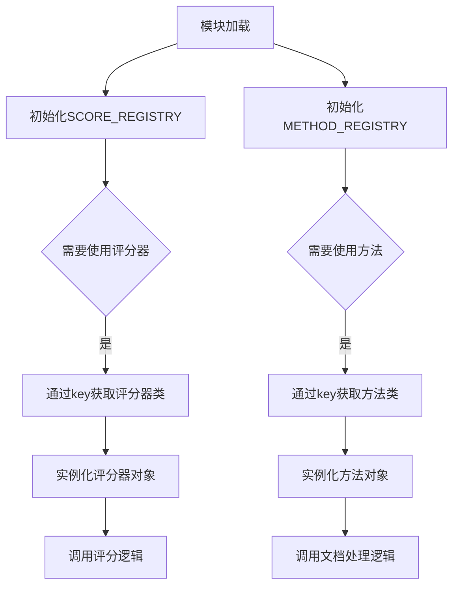

# `marker\benchmarks\overall\registry.py` 详细设计文档

该代码定义了一个基于注册表模式（Registry Pattern）的模块，用于动态管理和调度不同的文档解析方法和评分器。通过预定义的SCORE_REGISTRY和METHOD_REGISTRY两个字典，将字符串标识符映射到具体的实现类，支持在运行时根据配置灵活选择和加载不同的文档处理方法和评分策略。

## 整体流程



## 类结构

```
Registry (注册表模块)
├── Score Registry (评分器注册表)
│   ├── HeuristicScorer (启发式评分器)
│   └── LLMScorer (LLM评分器)
└── Method Registry (方法注册表)
    ├── MarkerMethod (Marker文档转换方法)
    ├── GTMethod (Ground Truth方法)
    ├── MathpixMethod (Mathpix文档解析方法)
    ├── LlamaParseMethod (LlamaParse文档解析方法)
    ├── DoclingMethod (Docling文档解析方法)
    ├── OlmOCRMethod (OlmOCR文档解析方法)
    └── MistralMethod (Mistral文档解析方法)
```

## 全局变量及字段


### `SCORE_REGISTRY`
    
评分器注册表，将字符串标识符映射到对应的评分器类，用于动态选择评分方法

类型：`dict[str, Type[BaseScorer]]`
    


### `METHOD_REGISTRY`
    
方法注册表，将字符串标识符映射到对应的文档解析方法类，用于动态选择文档解析实现

类型：`dict[str, Type[BaseMethod]]`
    


    

## 全局函数及方法


## 关键组件


### SCORE_REGISTRY

全局字典变量，用于注册和存储可用的评分器实现。通过键值对映射，将评分器名称映射到对应的评分器类，支持动态加载不同的评分策略。

### METHOD_REGISTRY

全局字典变量，用于注册和存储可用的文档处理方法实现。通过键值对映射，将方法名称映射到对应的方法类，支持动态加载不同的文档解析和转换方法。

### HeuristicScorer

基于启发式规则的评分器类，通过预定义的规则和指标对文档处理结果进行评估和打分。

### LLMScorer

基于大语言模型的评分器类，利用AI能力对文档处理结果进行语义理解和质量评估。

### MarkerMethod

文档处理方法之一，将PDF或图像文档转换为Markdown格式，支持表格、公式等复杂内容的识别与转换。

### GTMethod

Ground Truth方法，作为基准对照方法，用于提供标准答案或参考输出。

### MathpixMethod

文档处理方法之一，专注于数学公式和科学文档的识别与转换，具有高精度公式渲染能力。

### LlamaParseMethod

文档处理方法之一，基于LlamaParse引擎的文档解析实现，支持多格式文档的结构化提取。

### DoclingMethod

文档处理方法之一，Docling文档解析工具的封装实现，提供端到端的文档理解与转换能力。

### OlmOCRMethod

文档处理方法之一，OlmOCR引擎的实现，用于光学字符识别和文档数字化。

### MistralMethod

文档处理方法之一，Mistral文档处理方案的封装，支持多种文档格式的处理。


## 问题及建议


### 已知问题

-   **硬编码注册表**：所有方法和评分器都是硬编码导入并注册，添加新的方法或评分器需要修改源代码，不符合开闭原则
-   **缺乏类型注解**：全局字典和注册表缺少类型注解，降低了代码的可读性和静态检查能力
-   **无错误处理机制**：注册表未对重复键进行校验，若存在重复键会导致silent覆盖，缺乏显式错误提示
-   **无文档注释**：模块级别缺少文档字符串，未说明该注册表模块的用途和设计意图
-   **紧耦合导入**：导入路径写死在文件顶部，若项目结构调整，所有导入路径都需要修改
-   **全局可变状态**：SCORE_REGISTRY 和 METHOD_REGISTRY 作为全局可变字典，在多线程环境下可能存在竞态条件风险

### 优化建议

-   **引入动态注册机制**：可实现装饰器或自动发现机制，通过插件式架构动态注册方法和评分器，降低耦合
-   **添加类型注解**：为注册表添加泛型类型注解，如 `Dict[str, Type[BaseMethod]]`，增强类型安全
-   **增加注册校验**：在注册时检查键是否已存在，抛出重复注册异常；验证注册值是否为可调用类
-   **添加模块文档**：在文件开头添加 docstring 说明该模块负责方法和评分器的注册管理
-   **考虑线程安全**：若需要在多线程环境使用，可使用线程锁或不可变数据结构
-   **配置外部化**：将注册表内容迁移至配置文件或实现自动扫描包目录发现机制的方案


## 其它


### 设计目标与约束

该代码实现了一个基于注册表模式（Registry Pattern）的插件化架构系统，用于解耦文档处理方法（Method）和评分器（Scorer）的创建与使用过程。设计目标是支持在基准测试框架中动态注册、选择和实例化不同的文档解析方法和评分算法，实现高度的扩展性和模块化。约束包括：注册表键必须为字符串类型，值必须为对应的类对象，且在初始化前需要确保所有依赖的类已被正确导入。

### 错误处理与异常设计

当根据键名查找注册表项时，如果键不存在，应抛出 KeyError 异常，建议在调用处进行键的存在性检查或使用注册表对象的 get() 方法提供默认值。注册表不应阻止重复键的注册，后注册的键值会覆盖先前的定义，可能导致潜在的配置冲突风险，建议添加警告机制或锁定机制以防止运行时意外覆盖。

### 外部依赖与接口契约

该模块依赖于 benchmarks.overall.methods 包下的七个方法类（DoclingMethod、GTMethod、LlamaParseMethod、MarkerMethod、MathpixMethod、MistralMethod、OlmOCRMethod）以及 benchmarks.overall.scorers 包下的两个评分器类（HeuristicScorer、LLMScorer）。所有注册的方法类应继承自统一的基类或实现共同的接口协议，确保具备一致的方法签名（如 process、evaluate 等）。评分器类同样需要遵循统一的评分接口规范。

### 数据流与状态机

数据流从外部配置或用户输入获取方法名称和评分器名称字符串，通过字符串键在对应的注册表中查找并获取类对象，然后实例化该类并调用相应的处理或评分方法。状态转换过程为：初始化注册表（模块导入）→ 注册表填充（类映射）→ 查询注册表（字符串键定位）→ 类实例化 → 方法调用 → 结果返回。

### 模块职责边界

该模块作为注册中心，不直接执行业务逻辑，仅负责类的注册与查找。METHOD_REGISTRY 负责管理文档解析方法的生命周期，SCORE_REGISTRY 负责管理评分算法的选择。两者通过字符串键进行解耦，使上层调用者无需直接导入具体的实现类，降低了模块间的耦合度。

### 配置管理与扩展性

注册表采用字典数据结构，支持运行时的动态扩展，可通过直接赋值的方式添加新的方法或评分器。建议在大型项目中将注册表配置外部化至配置文件或使用装饰器模式实现自动注册，以便于管理和维护。

### 性能考量

注册表查询时间复杂度为 O(1)，适用于高频调用场景。类对象在注册表中为延迟实例化，仅在真正需要时才创建实例，避免了不必要的资源开销。建议在多线程环境下对注册表的写操作进行加锁保护，读操作可安全并发。

### 测试策略

应编写单元测试验证注册表的插入、查询和覆盖行为，以及异常抛出的正确性。集成测试应覆盖完整的方法调用链路，验证不同方法类能否通过注册表正确加载和执行。模拟测试可验证注册表在缺少依赖类时的错误处理能力。


    