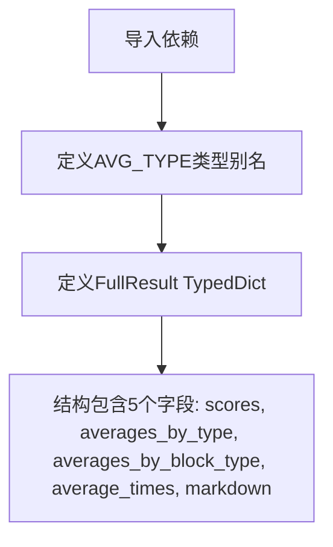

# `marker\benchmarks\overall\schema.py` 详细设计文档

该代码定义了一个用于存储LLM推理基准测试结果的类型架构，包含分数、平均值、时间统计和Markdown报告的嵌套字典结构。

## 整体流程



## 类结构

```
FullResult (TypedDict)
└── 字段: scores, averages_by_type, averages_by_block_type, average_times, markdown
```

## 全局变量及字段


### `AVG_TYPE`
    
Type alias for nested dictionaries storing average scores by category, subcategory and metric

类型：`Dict[str, Dict[str, Dict[str, List[float]]]]`
    


### `FullResult.scores`
    
Dictionary mapping block indices to score dictionaries containing test names and their corresponding BlockScores metrics

类型：`Dict[int, Dict[str, Dict[str, BlockScores]]]`
    


### `FullResult.averages_by_type`
    
Average scores aggregated and grouped by type (e.g., programming language or benchmark category)

类型：`AVG_TYPE`
    


### `FullResult.averages_by_block_type`
    
Average scores aggregated and grouped by block type (e.g., code block category or structure type)

类型：`AVG_TYPE`
    


### `FullResult.average_times`
    
Average execution times indexed by test or benchmark name, stored as a list of float values

类型：`Dict[str, List[float]]`
    


### `FullResult.markdown`
    
Markdown-formatted result strings indexed by block number and test name for reporting

类型：`Dict[int, Dict[str, str]]`
    
    

## 全局函数及方法


## 关键组件


### AVG_TYPE 类型别名

用于存储按类型分组的平均值数据的嵌套字典类型，支持多层级索引（类型名 -> 子类型 -> 指标名 -> 浮点数列表）

### FullResult TypedDict 类

包含基准测试完整结果的数据结构，聚合了分数、按类型平均值、按块类型平均值、平均执行时间和 Markdown 报告


## 问题及建议


### 已知问题

-   **嵌套层级过深**：`AVG_TYPE` 类型定义了4层嵌套字典（Dict[str, Dict[str, Dict[str, List[float]]]]），导致类型可读性差、维护困难、IDE提示不友好
-   **缺少文档注释**：整个代码块没有任何docstring或注释说明各类型的作用、使用场景和业务含义
-   **TypedDict字段无说明**：`FullResult` 的5个字段均无注释解释其含义和用途
-   **外部依赖无保护**：直接导入 `BlockScores` 类型，若该模块不存在会导致运行时ImportError，缺乏异常处理或可选依赖设计
-   **类型定义与业务强耦合**：将类型定义暴露在模块顶层，若业务逻辑变化可能影响多处引用
-   **无运行时验证**：仅定义静态类型声明，缺少运行时数据校验逻辑，无法保证数据结构的完整性

### 优化建议

-   **拆分复杂类型**：将 `AVG_TYPE` 拆分为多个中间类型定义，如 `ScoresByType`、`TypeBlockScores` 等，逐步替代深度嵌套
-   **使用数据类替代字典**：考虑使用 `@dataclass` 或 `Pydantic` 模型替代 TypedDict + 字典的组合，提供更好的类型安全和自动验证
-   **添加文档字符串**：为模块、类型定义、字段添加详细的docstring，说明业务含义、数据来源和用途
-   **封装类型别名**：使用 `TypeAlias` 和 `TypeVar` 配合 `Annotated` 添加元信息，提升类型可读性
-   **添加类型守卫或验证函数**：在模块中导出验证函数（如 `validate_full_result()`），确保运行时数据符合类型定义
-   **处理外部依赖**：对 `BlockScores` 的导入使用 try-except 包装，提供友好的错误信息或定义基础类型作为回退方案

## 其它


### 设计目标与约束

本代码定义了一个用于存储基准测试完整结果的数据结构，旨在为性能评估提供类型安全的统一数据模型。核心约束包括：必须与 BlockScores 类型兼容，支持多维度平均计算，以及支持 Markdown 格式的结果输出。

### 错误处理与异常设计

由于本代码仅包含类型定义，不涉及运行时逻辑，因此不存在运行时错误处理需求。在使用该数据结构时，调用方需确保：
- scores 字典的键（整数类型）符合预期的块编号范围
- averages_by_type 和 averages_by_block_type 的嵌套层级结构正确
- markdown 中的键与 scores 中的键保持一致

### 数据流与状态机

本代码不涉及状态机或复杂的数据流处理。数据流方向为：上游模块生成原始分数数据 → 组装为 FullResult 对象 → 下游模块消费该对象进行展示或进一步分析。

### 外部依赖与接口契约

外部依赖：benchmarks.overall.scorers.schema.BlockScores

接口契约：
- scores: 键为整数（块ID），值为嵌套字典，最终包含 BlockScores 对象
- averages_by_type: 键为类型字符串，值为嵌套字典结构，包含浮点数列表
- averages_by_block_type: 与 averages_by_type 结构相同，用于按块类型分组统计
- average_times: 键为时间类型字符串，值为浮点数列表
- markdown: 键为整数（块ID），值为按场景分类的 Markdown 字符串

### 性能考虑

由于仅为类型定义，无直接性能影响。但在实际使用中应注意：
- 大型基准测试场景下，scores 和 markdown 字典可能包含大量条目，考虑内存使用
- averages_by_type 和 averages_by_block_type 中的嵌套结构较深，访问时需注意遍历开销

### 安全性考虑

本代码为纯数据类型定义，不涉及安全敏感逻辑。输入数据由上游模块生成，应由上游负责数据验证。

### 可维护性与扩展性

扩展性设计：
- FullResult 为 TypedDict，支持动态键添加
- 若需新增结果类型，可直接在该 TypedDict 中扩展字段
- BlockScores 类型由外部定义，可独立演进而不影响本结构

### 测试策略

由于为类型定义代码，无需单元测试。集成测试应验证：
- FullResult 对象能正确序列化和反序列化
- 与 BlockScores 的类型兼容性
- 嵌套字典结构的深度和类型一致性

### 版本兼容性

当前版本为初始定义，后续演进应考虑：
- 保持 TypedDict 的向后兼容，避免删除已有字段
- 若需重大变更，考虑新增版本化类型或使用兼容性别名

### 部署与配置

本代码为纯 Python 模块，无特殊部署要求。依赖项 benchmarks.overall.scorers 需在项目构建时正确安装。


    