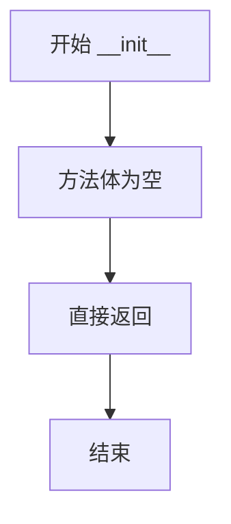
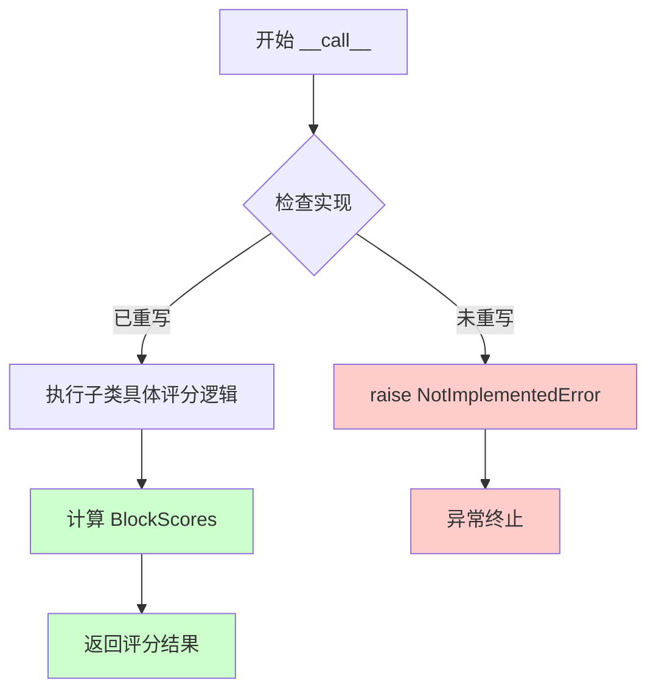

# `marker\benchmarks\overall\scorers\__init__.py` 详细设计文档

这是一个评分器抽象基类，定义了评估文本生成结果的标准接口，通过__call__方法接收样本、参考答案和生成方法描述，返回BlockScores类型的评分结果。

## 整体流程

```mermaid
graph TD
    A[实例化BaseScorer] --> B[调用实例 (sample, gt_markdown, method_markdown)]
    B --> C{是否实现具体逻辑?}
    C -- 否 --> D[raise NotImplementedError]
    C -- 是 --> E[执行子类具体评分逻辑]
    E --> F[返回 BlockScores 评分结果]
```

## 类结构

```
BaseScorer (抽象基类)
└── 潜在子类: 具体Scorer实现 (如LlamaScorer, GPTScorer等)
```

## 全局变量及字段


    

## 全局函数及方法


### `BaseScorer.__init__`

这是 `BaseScorer` 类的构造函数，用于初始化 BaseScorer 的实例。由于该方法目前仅包含 `pass` 语句，因此不执行任何实际操作，仅为子类提供初始化入口。

参数：

- `self`：`BaseScorer`，当前类的实例对象

返回值：`None`，构造函数不返回任何值

#### 流程图



#### 带注释源码

```python
def __init__(self):
    """
    BaseScorer 类的构造函数。
    
    初始化 BaseScorer 的实例。当前实现为空方法，
    主要用于定义接口规范，供子类重写扩展。
    
    参数:
        self: BaseScorer 的实例对象
    
    返回:
        None: 构造函数不返回任何值
    """
    pass  # 暂时不执行任何初始化操作，留给子类实现
```


### `BaseScorer.__call__`

该方法是 `BaseScorer` 类的核心方法，通过实现 `__call__` 使得实例可以像函数一样被调用，用于计算样本得分，接收样本数据、真实markdown列表和生成的markdown，返回 BlockScores 类型的评分结果。

参数：

- `self`：实例本身（隐式参数），无需额外描述
- `sample`：任意类型，待评分的样本数据
- `gt_markdown`：`List[str]`，真实的标准答案 markdown 列表
- `method_markdown`：`str`，待评分的方法生成的 markdown 内容

返回值：`BlockScores`，包含评分结果的块级分数对象

#### 流程图



#### 带注释源码

```python
def __call__(self, sample, gt_markdown: List[str], method_markdown: str) -> BlockScores:
    """
    使 BaseScorer 实例可被调用（类似函数）
    
    参数:
        sample: 待评分的样本数据，类型由具体子类决定
        gt_markdown: 标准答案的 markdown 列表，用于对比
        method_markdown: 待评分的方法生成的 markdown 字符串
    
    返回值:
        BlockScores: 包含各块评分结果的对象
    
    注意:
        该方法为抽象方法，子类必须重写实现具体的评分逻辑
    """
    raise NotImplementedError()
```

## 关键组件


### BaseScorer 类

评分器的抽象基类，定义了评分接口的规范，继承此类需要实现具体的评分逻辑。

### __init__ 方法

初始化方法，用于创建 BaseScorer 实例，目前为空实现，供子类扩展使用。

### __call__ 方法

抽象调用方法，接收样本、ground truth markdown 和方法生成的 markdown，返回 BlockScores 类型的评分结果。

### BlockScores 类型

从 benchmarks.overall.scorers.schema 模块导入的评分结果数据结构，用于存储代码块的评分信息。

### List 类型提示

从 typing 模块导入的列表类型提示，用于类型注解。


## 问题及建议


### 已知问题

-   **未使用 ABC 模块定义抽象基类**：该类作为基类使用 `NotImplementedError` 模拟抽象方法，而非继承 `abc.ABC` 并使用 `@abstractmethod` 装饰器，导致语义不明确
-   **空构造函数无实际意义**：`__init__` 方法体仅为 `pass`，没有任何初始化逻辑，属于冗余代码
-   **缺少类级别类型注解**：未定义类属性或类型提示，无法在静态分析时发现类型错误
-   **缺少文档注释**：类和方法均无 docstring，无法帮助使用者理解接口契约和预期行为

### 优化建议

-   引入 `abc` 模块，使 `BaseScorer` 继承 `ABC` 并使用 `@abstractmethod` 装饰器定义 `__call__` 方法，明确该类为抽象基类
-   若基类无需初始化逻辑，可直接删除 `__init__` 方法，或在其中添加必要的属性初始化（如日志记录器）
-   为类添加类型注解和 docstring，说明 `sample`、`gt_markdown`、`method_markdown` 的数据结构要求以及 `BlockScores` 的返回格式
-   考虑添加 `__init__` 方法的参数，使子类能够接收配置参数（如权重、阈值等），增强可扩展性

## 其它


### 设计目标与约束

设计目标：定义评分器的抽象基类，为具体的评分实现提供统一的接口规范，使得不同的评分方法可以通过相同的调用方式被使用。

设计约束：
1. 该类为抽象基类，具体实现需继承并实现 `__call__` 方法
2. 必须返回 `BlockScores` 类型的评分结果
3. 输入参数 `gt_markdown` 应为字符串列表，`method_markdown` 应为字符串

### 错误处理与异常设计

异常类型：
- `NotImplementedError`：当调用基类的 `__call__` 方法时抛出，表示子类未实现该方法

异常处理策略：
- 基类本身不处理异常，仅作为接口定义
- 子类实现时应处理可能的输入异常（如参数类型错误、参数为空等）
- 调用方应捕获 `NotImplementedError` 以识别未实现的评分器

### 数据流与状态机

数据输入流程：
1. 接收 `sample` 对象（待评分样本）
2. 接收 `gt_markdown: List[str]`（标准答案的 Markdown 列表）
3. 接收 `method_markdown: str`（待评分方法的 Markdown 表示）

数据处理流程：
1. 验证输入参数类型和合法性
2. 由子类实现具体的评分逻辑
3. 生成并返回 `BlockScores` 评分结果

状态机描述：
- 初始状态：对象创建完成
- 就绪状态：参数准备完毕
- 执行状态：调用 `__call__` 方法进行评分
- 结束状态：返回 `BlockScores` 结果

### 外部依赖与接口契约

外部依赖：
- `typing.List`：用于类型提示
- `benchmarks.overall.scorers.schema.BlockScores`：来自基准测试评分模式模块的返回类型

接口契约：
- 方法签名：`def __call__(self, sample, gt_markdown: List[str], method_markdown: str) -> BlockScores`
- 参数 `sample`：任意类型，表示待评分的样本
- 参数 `gt_markdown`：字符串列表，表示标准答案的 Markdown 格式
- 参数 `method_markdown`：字符串，表示待评分方法的 Markdown 格式
- 返回值：`BlockScores` 类型，表示评分结果

### 使用示例与调用模式

基本调用模式：
```python
scorer = ConcreteScorer()  # 子类实现
scores = scorer(sample, gt_markdown, method_markdown)
```

应用场景：
- 基准测试系统中的自动评分
- 不同评分方法的对比评估
- 批量样本的批量评分处理

### 继承设计建议

子类实现要点：
1. 必须实现 `__call__` 方法
2. 正确处理三类输入参数
3. 返回符合 `BlockScores` 规范的评分结果
4. 考虑性能优化（如果需要批量处理可添加批处理方法）

推荐子类类型：
- 精确匹配评分器
- 语义相似度评分器
- BLEU/ROUGE 等指标评分器
- 自定义规则评分器

### 版本兼容性考虑

Python 版本：支持 Python 3.6+（因使用类型提示）
类型提示：使用 `typing.List` 而非内置 `list` 以兼容旧版本
接口稳定性：基类方法签名应保持稳定，子类可扩展新方法

### 测试策略建议

单元测试：
- 测试子类继承正确性
- 测试接口方法签名
- 测试异常抛出机制

集成测试：
- 测试与 `BlockScores` 类型的兼容性
- 测试在不同评分场景下的行为


    