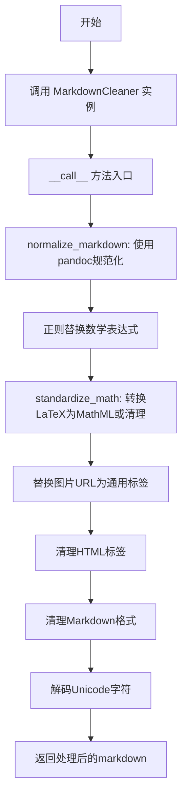
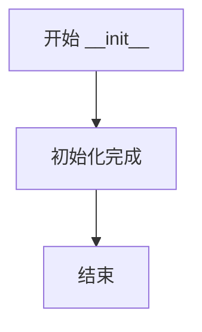
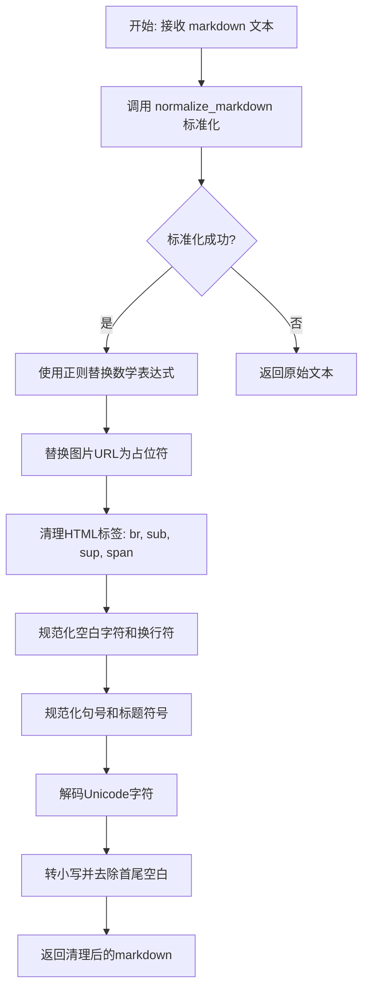
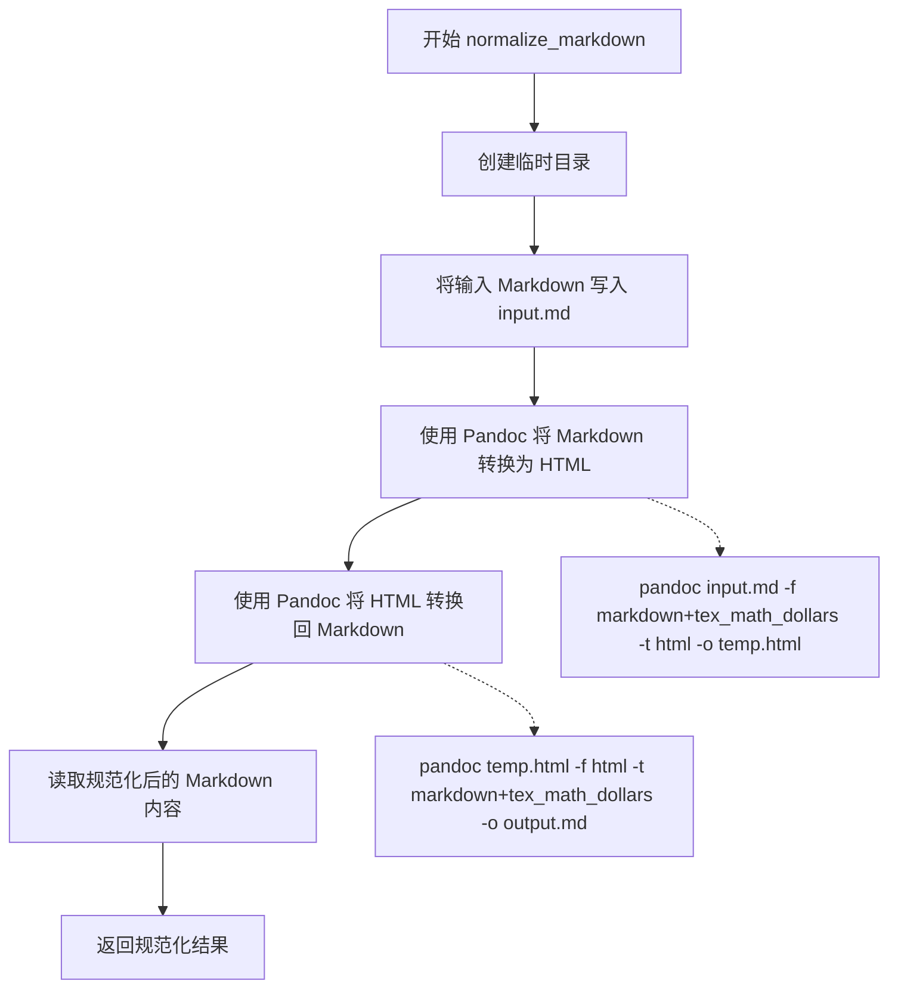

# `marker\benchmarks\overall\scorers\clean.py` 详细设计文档

该代码实现了一个MarkdownCleaner类，用于清理和标准化Markdown文档，包括使用pandoc进行规范化、处理数学表达式（LaTeX转MathML）、清理HTML标签、移除图片URL、统一空白字符等操作，最终输出规范化的markdown文本。

## 整体流程



## 类结构

```
MarkdownCleaner
```

## 全局变量及字段


### `re`
    
Python standard library module for regular expression operations

类型：`module`
    


### `subprocess`
    
Python standard library module for spawning and managing external processes

类型：`module`
    


### `tempfile`
    
Python standard library module for creating temporary files and directories

类型：`module`
    


### `Path`
    
Path class from pathlib for cross-platform path manipulation

类型：`class`
    


### `latex2mathml.converter`
    
Third-party library module for converting LaTeX math expressions to MathML format

类型：`module`
    


    

## 全局函数及方法


### `MarkdownCleaner.__init__`

这是 MarkdownCleaner 类的构造函数，用于初始化类的实例。在当前实现中，该构造函数暂未执行任何操作（仅有 `pass` 语句），类的核心功能主要由 `__call__` 方法和其他静态方法实现。该类主要用于清理和规范化 Markdown 文本，包括处理数学表达式、转换图片链接、清理 HTML 标签以及标准化 Markdown 格式。

参数：

- `self`：`object`，类的实例本身

返回值：无

#### 流程图



#### 带注释源码

```python
def __init__(self):
    """
    构造函数，初始化 MarkdownCleaner 类的实例。
    当前实现为空，未来可扩展以接受配置参数。
    """
    pass
```

---

#### 补充说明

由于 `__init__` 方法本身不包含复杂逻辑，以下是该类其他关键方法的概览信息：

| 方法名称 | 功能描述 |
|---------|---------|
| `__call__` | 使类的实例可调用，接收 Markdown 文本并返回清理后的文本 |
| `normalize_markdown` | 使用 pandoc 将 Markdown 转换为 HTML 再转回 Markdown，以规范化格式 |
| `standardize_math` | 将数学表达式转换为标准格式，支持 LaTeX 和 MathML |
| `clean_latex` | 清理 LaTeX 表达式中的特定命令和符号 |


### `MarkdownCleaner.__call__`

该方法是 `MarkdownCleaner` 类的主要调用入口，接收原始 Markdown 文本并执行多步清理操作：先通过 Pandoc 标准化文本，然后替换数学表达式为标准格式，替换图片 URL 为占位符，清理残留的 HTML 标签，最后规范化空白字符和标点符号，并转换为小写返回。

**参数：**

- `markdown`：`str`，待清理的原始 Markdown 文本

**返回值：** `str`，清理并标准化后的 Markdown 文本（已转为小写）

#### 流程图



#### 带注释源码

```python
def __call__(self, markdown):
    # 第一步：使用 pandoc 标准化 markdown 格式
    # 将 markdown 转为 HTML 再转回 markdown，消除方言差异
    markdown = self.normalize_markdown(markdown)

    # 第二步：替换数学表达式为标准格式
    # 匹配 $...$ 和 $$...$$ 两种数学表达式格式
    # (?<!\\)\$ 负向后瞻断言，排除转义的 $
    # \$\$([^$]+)\$\$ 匹配 $$...$$ 格式
    # \s*([^$\n]+?)\s* 匹配 $...$ 格式
    pattern = r'(?<!\\)\$(?:\$([^$]+)\$\$|\s*([^$\n]+?)\s*\$)'
    markdown = re.sub(pattern, self.standardize_math, markdown)

    # 第三步：替换图片 URL 为通用占位符
    # 匹配  格式的图片引用
    # 只保留 alt 文本，URL 替换为固定文本
    pattern = r'!\[(.*?)\]\((https?://[^\s\)]+)\)'
    markdown = re.sub(pattern, r'![link]', markdown)

    # 第四步：清理残留的 HTML 标签
    markdown = markdown.replace("<br>", "\n")  # br 转为换行
    markdown = re.sub(r"<sub>(.*?)</sub>", r"\1", markdown)  # 移除 sub 标签保留内容
    markdown = re.sub(r"<sup>(.*?)</sup>", r"\1", markdown)  # 移除 sup 标签保留内容
    markdown = re.sub(r"<span.*?>(.*?)</span>", r"\1", markdown)  # 移除 span 标签保留内容

    # 第五步：清理 Markdown 格式
    markdown = re.sub(r"\s+", " ", markdown)  # 多个空白符合并为一个
    markdown = re.sub(r"\n+", "\n", markdown)  # 多个换行符合并为一个
    markdown = re.sub("\\.+", ".", markdown)  # 多个句号合并为一个（如目录中的省略号）
    markdown = re.sub("#+", "#", markdown)  # 多个井号合并为一个（如多重标题）

    # 第六步：解码 Unicode 字符
    # 处理转义序列，如 \u00e9 -> é
    markdown = markdown.encode().decode('unicode-escape', errors="ignore")

    # 第七步：转小写并去除首尾空白
    return markdown.strip().lower()
```


### `MarkdownCleaner.normalize_markdown`

该方法使用 Pandoc 工具将 Markdown 文本先转换为 HTML，再转换回 Markdown，从而实现 Markdown 的规范化处理，确保不同来源的 Markdown 语法具有一致的格式。

参数：

-  `md_text`：`str`，需要规范化的原始 Markdown 文本内容

返回值：`str`，规范化处理后的 Markdown 文本

#### 流程图



#### 带注释源码

```python
@staticmethod
def normalize_markdown(md_text: str) -> str:
    """
    使用 Pandoc 将 Markdown 规范化
    通过 Markdown -> HTML -> Markdown 的转换流程,
    确保不同来源的 Markdown 语法具有一致的格式
    
    Args:
        md_text: 需要规范化的原始 Markdown 文本
        
    Returns:
        规范化处理后的 Markdown 文本
    """
    # 创建临时目录用于存放中间文件
    with tempfile.TemporaryDirectory() as tmp_dir:
        dirpath = Path(tmp_dir)
        
        # 将输入的 Markdown 文本写入临时输入文件
        input_file = dirpath / 'input.md'
        input_file.write_text(md_text, encoding='utf-8')

        # 第一步：使用 Pandoc 将 Markdown 转换为 HTML
        # 使用 markdown+tex_math_dollars 格式支持 LaTeX 数学公式
        html_file = dirpath / 'temp.html'
        subprocess.run(
            [
                'pandoc',
                str(input_file),
                '-f', 'markdown+tex_math_dollars',  # 输入格式：支持 LaTeX 数学公式的 Markdown
                '-t', 'html',                        # 输出格式：HTML
                '-o', str(html_file),
                '--quiet'                            # 安静模式，不输出警告信息
            ],
            check=True  # 如果 Pandoc 执行失败则抛出异常
        )

        # 第二步：使用 Pandoc 将 HTML 转换回 Markdown
        # 再次使用 markdown+tex_math_dollars 格式确保数学公式被正确保留
        output_file = dirpath / 'output.md'
        subprocess.run(
            [
                'pandoc',
                str(html_file),
                '-f', 'html',                        # 输入格式：HTML
                '-t', 'markdown+tex_math_dollars',  # 输出格式：支持 LaTeX 数学公式的 Markdown
                '-o', str(output_file),
                '--quiet'
            ],
            check=True
        )

        # 读取规范化后的 Markdown 内容
        normalized_md = output_file.read_text(encoding='utf-8')

    # 返回规范化后的 Markdown 文本
    return normalized_md
```


### `MarkdownCleaner.standardize_math`

该方法是一个正则表达式替换回调函数，用于将 Markdown 中的数学表达式（LaTeX 格式）标准化为统一格式。对于块级数学公式（$$...$$）使用 latex2mathml 转换为 MathML，对于行内数学公式（$...$）则进行 LaTeX 清理和转换，最终返回标准化后的数学表达式字符串。

参数：

- `match`：`re.Match`，正则表达式匹配对象，包含原始数学表达式及其分组信息

返回值：`str`，标准化处理后的数学表达式字符串，若处理失败则返回原始匹配内容

#### 流程图

```mermaid
flowchart TD
    A[开始 standardize_math] --> B{判断分隔符类型}
    B -->|$$ 块公式| C[设置 delim = "$$"]
    B -->|$ 行内公式| D[设置 delim = "$"]
    C --> E[获取 math_content]
    D --> E
    E --> F{判断分隔符}
    F -->|$$| G[调用 latex2mathml.converter.convert]
    F -->|$| H[调用 self.clean_latex]
    G --> I[构建返回值]
    H --> I
    I --> J[返回标准化后的字符串]
    
    K[异常处理] --> L[打印错误信息]
    L --> M[返回原始匹配内容 match.group(0)]
    
    J --> N[结束]
    M --> N
```

#### 带注释源码

```python
def standardize_math(self, match):
    """
    正则表达式替换回调函数，用于标准化数学表达式
    
    处理流程：
    1. 判断数学表达式使用的是哪种分隔符（$$ 或 $）
    2. 提取数学内容
    3. 根据分隔符类型选择转换方式
    4. 返回标准化后的表达式
    
    Args:
        match: re.Match 对象，包含正则匹配的完整结果
        
    Returns:
        str: 标准化后的数学表达式，格式为 {delimiter}{content}{delimiter}
             若处理失败则返回原始匹配内容
    """
    try:
        # 步骤1: 判断分隔符类型
        # 检查匹配文本是否以 $$ 开头，确定是块公式还是行内公式
        delim = "$$" if match.group(0).startswith('$$') else "$"
        
        # 步骤2: 提取数学内容
        # match.group(1) 对应 $$...$$ 格式的内容
        # match.group(2) 对应 $...$ 格式的内容
        # 使用 or 操作符确保即使某个分组为 None 也能获取到内容
        math_content = match.group(1) or match.group(2)
        
        # 步骤3: 根据分隔符类型选择转换方式
        if delim == "$$":
            # 块级公式使用 latex2mathml 转换为 MathML 格式
            # 例如: $$E=mc^2$$ 转换为 MathML 表示
            math_content = latex2mathml.converter.convert(math_content)
        else:
            # 行内公式使用 clean_latex 方法进行清理和转换
            # 处理常见的 LaTeX 符号转换为更通用的格式
            math_content = self.clean_latex(math_content)
        
        # 步骤4: 构建返回值
        # 将分隔符和转换后的内容重新组合
        return f'{delim}{math_content}{delim}'
        
    except Exception as e:
        # 异常处理: 打印错误信息并返回原始匹配内容
        # 这样可以保证即使转换失败，Markdown 也不会被破坏
        print(f"Failed to standardize math expression: {match.group(0)} with error: {e}")
        return match.group(0)
```


### `MarkdownCleaner.clean_latex`

该方法是一个静态方法，用于清理和标准化 LaTeX 数学表达式，将常见的 LaTeX 命令和符号转换为更通用的格式，以便后续处理。

参数：

- `latex_str`：`str`，需要清理的 LaTeX 字符串

返回值：`str`，清理后的 LaTeX 字符串

#### 流程图

```mermaid
flowchart TD
    A[开始 clean_latex] --> B[去除首尾空白并将连续空白替换为单个空格]
    B --> C{遍历标签列表}
    C -->|text| D[移除 \\text{...} 保留内容]
    C -->|mathrm| D
    C -->|mathbf| D
    C -->|textbf| D
    D --> E{遍历替换映射表}
    E -->|\\times| F[替换为 *]
    E -->|\\cdot| F
    E -->|\\div| F
    E -->|\\le| F
    E -->|\\ge| F
    E -->|\\neq| F
    E -->|\\to| F
    F --> E
    E --> G[返回清理后的字符串]
    G --> H[结束]
```

#### 带注释源码

```python
@staticmethod
def clean_latex(latex_str):
    """
    清理并标准化 LaTeX 数学表达式
    
    该方法执行以下转换:
    1. 规范化空白字符
    2. 移除文本格式化命令（如 \\text, \\mathrm 等）但保留其内容
    3. 将 LaTeX 符号转换为 ASCII 等价物
    """
    # 步骤1: 去除首尾空白，并将所有连续空白替换为单个空格
    latex_str = re.sub(r'\s+', ' ', latex_str.strip())
    
    # 步骤2: 定义需要移除的 LaTeX 文本格式化命令
    # 这些命令通常用于在数学模式中显示普通文本
    for tag in [r'\\text', r'\\mathrm', r'\\mathbf', r'\\textbf']:
        # 使用正则表达式匹配 tag{内容} 格式，替换为仅保留内容
        # 例如: \text{hello} -> hello
        latex_str = re.sub(tag + r'\{([^}]+)\}', r'\1', latex_str)

    # 步骤3: 定义 LaTeX 符号到 ASCII/Unicode 的替换映射
    replacements = {
        '\\times': '*',      # 乘号
        '\\cdot': '*',       # 点乘号
        '\\div': '/',        # 除号
        '\\le': '<=',        # 小于等于
        '\\ge': '>=',        # 大于等于
        '\\neq': '!=',       # 不等于
        '\\to': '\\rightarrow',  # 箭头
    }

    # 步骤4: 遍历替换映射表，将所有 LaTeX 符号替换为等价表示
    for old, new in replacements.items():
        latex_str = latex_str.replace(old, new)

    # 返回清理后的字符串
    return latex_str
```

## 关键组件


### MarkdownCleaner类

核心的清理和规范化类，负责处理Markdown文档的标准化流程。

### normalize_markdown方法

使用pandoc工具进行Markdown到HTML再回到Markdown的转换，实现文档规范化。

### standardize_math方法

将数学表达式标准化，根据定界符类型转换为MathML或清理LaTeX命令。

### clean_latex方法

清理和转换LaTeX数学符号为通用字符表示。

### 正则表达式模式匹配

用于识别和处理数学表达式、图像URL、HTML标签等特定模式的文本。

### 临时文件管理

使用tempfile模块创建临时目录进行pandoc转换操作。

### 错误处理机制

在数学表达式处理失败时打印错误信息并返回原始匹配内容。

### Unicode处理

使用unicode-escape编码解码处理特殊字符。

## 问题及建议


### 已知问题

-   **外部依赖风险**：`normalize_markdown`方法强依赖pandoc命令行工具，若pandoc未安装或路径不可访问，程序将直接崩溃，缺少优雅的错误处理和降级方案
-   **异常吞没**：`standardize_math`方法捕获异常后仅打印错误信息并返回原始匹配，可能导致部分数学表达式未被正确处理而不被察觉
-   **数据丢失风险**：使用`unicode-escape`解码时设置`errors="ignore"`，可能导致部分Unicode字符被静默丢弃
-   **正则表达式复杂脆弱**：数学表达式的正则模式`r'(?<!\\)\$(?:\$([^$]+)\$\$|\s*([^$\n]+?)\s*\$)'`极其复杂，边界情况处理可能不完善
-   **全局小写转换副作用**：最终将所有内容转为小写`return markdown.strip().lower()`会破坏代码示例、专有名词和URL等需要大小写敏感的内容
-   **重复正则编译**：多个`re.sub`调用每次都重新编译正则表达式，未预编译正则对象影响性能
-   **临时目录异常处理**：`tempfile.TemporaryDirectory`上下文管理器内若pandoc调用失败，可能导致临时文件句柄泄露

### 优化建议

-   添加pandoc可用性检查和友好的错误提示，考虑添加缓存机制避免重复调用pandoc
-   使用日志框架替代`print`输出错误，并考虑将处理失败的数学表达式记录到专门的文件供后续检查
-   审查`unicode-escape`解码逻辑，考虑使用更精确的编码处理方式，或允许调用方指定编码
-   将正则表达式预编译为模块级常量，避免重复编译开销
-   提供配置选项控制是否转换为小写，或仅对特定内容（如标题）应用小写转换
-   将`clean_latex`的替换规则外部化为配置或常量，便于扩展和维护
-   考虑为数学表达式处理添加单元测试，覆盖各种边界情况
-   评估使用`latex2mathml`失败时的备选方案或降级策略

## 其它


### 设计目标与约束
本代码旨在将各种格式的Markdown文档标准化为统一的格式，处理数学表达式、清理HTML标签、统一格式。约束条件包括依赖外部工具pandoc和Python库latex2mathml，需要系统安装这些依赖。

### 错误处理与异常设计
normalize_markdown方法使用subprocess.run的check=True参数，当pandoc执行失败时抛出CalledProcessError。standardize_math方法捕获所有Exception并打印错误信息，返回原始匹配内容作为降级方案。临时文件操作使用上下文管理器确保资源释放。

### 数据流与状态机
数据流：输入Markdown字符串 → normalize_markdown规范化 → 正则替换数学表达式 → 正则替换图片URL → 清理HTML标签 → 清理空白和格式 → Unicode解码 → 输出清理后的Markdown。无复杂状态机，为线性转换流程。

### 外部依赖与接口契约
外部依赖：pandoc（命令行工具）、latex2mathml库、Python标准库（re、subprocess、tempfile、pathlib）。接口契约：__call__方法接收str类型markdown参数，返回str类型清理后的markdown；normalize_markdown为静态方法接收str返回str；standardize_math为实例方法接收re.Match返回str；clean_latex为静态方法接收str返回str。

### 性能考虑
使用临时目录和文件进行pandoc转换会产生IO开销。多次正则表达式替换可考虑合并优化。tempfile.TemporaryDirectory确保临时文件及时清理但频繁创建销毁有开销。

### 安全性考虑
subprocess调用pandoc时输入来自write_text写入临时文件，pandoc处理外部输入存在潜在命令注入风险（虽然通过文件路径传递）。应验证输入内容避免恶意代码执行。临时文件在临时目录内，风险可控。

### 配置与参数说明
本类无显式配置参数。pandoc调用使用固定参数：markdown+tex_math_dollars输入格式、html中间格式、--quiet抑制输出。latex2mathml用于LaTeX到MathML转换。

### 使用示例
```python
cleaner = MarkdownCleaner()
result = cleaner("# Hello $x^2$")
# 输出: # hello $x^2$
```

### 测试策略建议
应测试：不同格式数学表达式（inline、display）、各种HTML标签清理、空白字符处理、Unicode字符处理、pandoc不可用时的错误处理、LaTeX符号转换正确性。

### 部署要求
部署环境需安装pandoc命令行工具（建议版本2.0+）和Python依赖：latex2mathml>=0.1.0。操作系统支持：Linux、macOS、Windows（需确保pandoc在PATH中）。

    