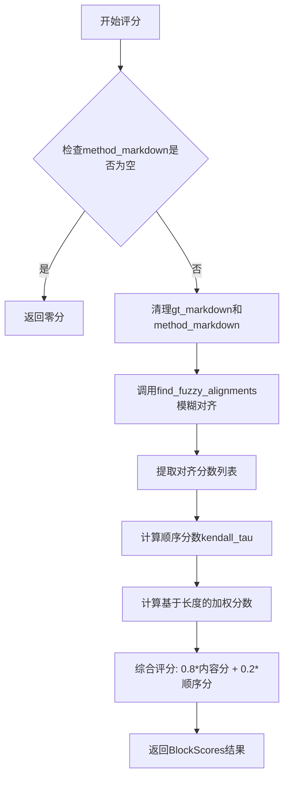
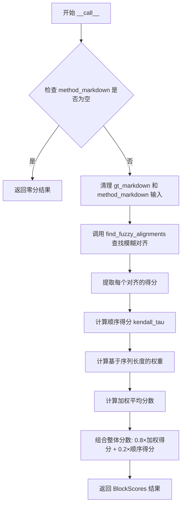
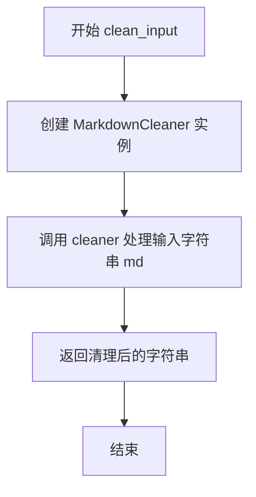

# `marker\benchmarks\overall\scorers\heuristic.py` 详细设计文档

一个启发式评分器实现，用于评估生成的Markdown与方法答案之间的相似度。它通过模糊匹配算法对齐文本块，计算内容相似度分数和顺序正确性分数，最终返回加权综合评分。

## 整体流程



## 类结构

```
BaseScorer (抽象基类)
└── HeuristicScorer (启发式评分器)
```

## 全局变量及字段


### `sample`
    
待评估的样本数据

类型：`Any`
    


### `gt_markdown`
    
ground truth的markdown块列表

类型：`List[str]`
    


### `method_markdown`
    
方法生成的markdown字符串

类型：`str`
    


### `correct_order`
    
正确的顺序列表

类型：`List[int]`
    


### `actual_order`
    
实际的顺序列表

类型：`List[int]`
    


### `main_string`
    
用于匹配的主字符串

类型：`str`
    


### `substrings`
    
需要匹配的子字符串列表

类型：`List[str]`
    


### `threshold`
    
模糊匹配的阈值，默认为70

类型：`int`
    


### `md`
    
待清理的markdown字符串

类型：`str`
    


### `HeuristicScorer.HeuristicScorer`
    
继承自BaseScorer的启发式评分器类，无显式定义实例字段

类型：`class`
    
    

## 全局函数及方法


### `HeuristicScorer.__call__`

该方法是 HeuristicScorer 类的核心调用接口，接收方法生成的 Markdown 内容与标准答案 Markdown 列表，通过模糊匹配算法计算相似度得分，并结合顺序正确性得分加权得到最终评估分数，用于衡量方法输出的质量。

参数：

- `self`：HeuristicScorer 实例，隐式参数
- `sample`：任意类型，参数签名中存在但方法体内未使用，可能是为保持接口一致性或预留参数
- `gt_markdown`：`List[str]`，标准答案（ground truth）的 Markdown 块列表，每个元素为一个 Markdown 字符串
- `method_markdown`：`str`，待评估方法生成的 Markdown 字符串

返回值：`BlockScores`，一个字典结构，包含 `score`（整体加权得分，0-100）和 `specific_scores`（具体得分，包含 `order` 顺序得分和 `by_block` 每个块的得分列表）

#### 流程图



#### 带注释源码

```python
def __call__(self, sample, gt_markdown: List[str], method_markdown: str) -> BlockScores:
    """
    评估方法生成的 Markdown 与标准答案之间的相似度
    
    Args:
        sample: 预留参数，当前未使用
        gt_markdown: 标准答案 Markdown 块列表
        method_markdown: 方法生成的 Markdown 字符串
    
    Returns:
        包含整体分数和具体分数的字典
    """
    # 如果方法生成的 markdown 为空，直接返回零分
    if not method_markdown:
        return {
            "score": 0,
            "specific_scores": {
                "order": 0,
                "by_block": [0] * len(gt_markdown)
            }
        }

    # 步骤1: 标准化输入 - 清理 markdown 内容
    # 对每个 ground truth 块和生成的 markdown 进行清理处理
    gt_markdown = [self.clean_input(block) for block in gt_markdown]
    method_markdown = self.clean_input(method_markdown)

    # 步骤2: 查找模糊对齐
    # 使用 rapidfuzz 库进行部分匹配，找到 method_markdown 中与各 gt_markdown 块最相似的部分
    alignments = self.find_fuzzy_alignments(method_markdown, gt_markdown)
    
    # 步骤3: 提取每个对齐的相似度得分
    scores = [alignment["score"] for alignment in alignments]

    # 步骤4: 计算顺序得分
    # 提取每个对齐在原文本中的起始位置
    orders = [alignment["start"] for alignment in alignments]
    # 正确的顺序应该是 0, 1, 2, ...
    correct_order = list(range(len(gt_markdown)))
    # 实际顺序：根据起始位置排序后的索引
    actual_order = sorted(range(len(gt_markdown)), key=lambda x: orders[x])
    # 使用 Kendall Tau 相关系数衡量顺序正确性
    order_score = self.kendall_tau(correct_order, actual_order)

    # 步骤5: 计算基于序列长度的权重
    # 较长的 ground truth 块权重更大，因为包含更多信息
    gt_weights = [len(g) for g in gt_markdown]
    weighted_scores = [score * weight for score, weight in zip(scores, gt_weights)]

    # 步骤6: 计算加权平均分数
    overall_score = sum(weighted_scores) / max(1, sum(gt_weights))
    
    # 步骤7: 组合最终分数
    # 80% 权重给相似度得分，20% 权重给顺序得分
    overall_score = overall_score * 0.8 + order_score * 0.2
    
    # 返回结果字典
    return {
        "score": overall_score,
        "specific_scores": {
            "order": order_score,
            "by_block": scores
        },
    }
```


### `HeuristicScorer.kendall_tau`

该方法是一个静态方法，用于计算两个排列之间的肯德尔τ（Kendall Tau）相关系数，并将结果从[-1, 1]归一化到[0, 100]的评分范围。它通过比较正确顺序和实际顺序中每对元素的相对顺序关系（一致或不协调）来评估排列的准确性。

参数：

- `correct_order`：`List[int]`，表示正确的排列顺序
- `actual_order`：`List[int]`，表示实际的排列顺序

返回值：`float`，返回0-100范围内的肯德尔τ相关系数评分

#### 流程图

```mermaid
flowchart TD
    A[开始 kendall_tau] --> B[获取列表长度 n]
    B --> C{n <= 1?}
    C -->|是| D[返回 100]
    C -->|否| E[初始化 concordant = 0, discordant = 0]
    E --> F[外层循环 i 从 0 到 n-1]
    F --> G[内层循环 j 从 i+1 到 n-1]
    G --> H[计算 correct_sign = correct_order[i] - correct_order[j]]
    G --> I[计算 actual_sign = actual_order[i] - actual_order[j]]
    H --> J{correct_sign 与 actual_sign 同号?}
    J -->|是| K[concordant += 1]
    J -->|否| L[discordant += 1]
    K --> M[j 循环结束?]
    L --> M
    M -->|否| G
    M -->|是| N[计算总对数 total_pairs = n*(n-1)//2]
    N --> O[计算 tau = (concordant - discordant) / total_pairs]
    O --> P[归一化 tau 到 0-1: tau = (tau + 1) / 2]
    P --> Q[缩放到 0-100: return tau * 100]
    Q --> R[结束]
    D --> R
```

#### 带注释源码

```python
@staticmethod
def kendall_tau(correct_order: List[int], actual_order: List[int]) -> float:
    """
    计算两个排列之间的肯德尔τ相关系数，并返回0-100范围的评分
    
    参数:
        correct_order: 正确的顺序列表（如 [0, 1, 2, 3]）
        actual_order:  实际的顺序列表（如 [0, 2, 1, 3]）
    
    返回:
        float: 0-100范围的评分，100表示完全一致
    """
    n = len(correct_order)  # 获取排列长度
    concordant = 0          # 记录一致的对数（相对顺序相同）
    discordant = 0          # 记录不一致的对数（相对顺序不同）

    # 边界情况：空列表或单元素列表返回满分
    if n <= 1:
        return 100

    # 遍历所有可能的元素对 (i, j)
    for i in range(n):
        for j in range(i + 1, n):
            # 计算正确顺序中 i 和 j 的相对顺序
            # 正值表示 i 在 j 前面，负值表示 i 在 j 后面
            correct_sign = correct_order[i] - correct_order[j]
            
            # 计算实际顺序中 i 和 j 的相对顺序
            actual_sign = actual_order[i] - actual_order[j]

            # 判断一致性：两者符号相同（都为正或都为负）表示一致
            if (correct_sign > 0 and actual_sign > 0) or (correct_sign < 0 and actual_sign < 0):
                concordant += 1
            # 符号相反表示不一致
            elif (correct_sign < 0 and actual_sign > 0) or (correct_sign > 0 and actual_sign < 0):
                discordant += 1
            # 如果差值为0（相等），不计入任何类别

    # 计算总对数：n*(n-1)/2
    total_pairs = (n * (n - 1)) // 2
    
    # 计算原始肯德尔τ值：-1（完全相反）到 1（完全一致）
    tau = (concordant - discordant) / total_pairs
    
    # 将τ从 [-1, 1] 归一化到 [0, 1]
    # τ = -1 → ( -1 + 1 ) / 2 = 0
    # τ =  1 → (  1 + 1 ) / 2 = 1
    tau = (tau + 1) / 2
    
    # 转换为0-100的评分范围
    return tau * 100
```


### `HeuristicScorer.find_fuzzy_alignments`

该方法用于在给定的 Markdown 文本（main_string）中模糊匹配多个块（substrings），返回一个包含每个块匹配位置和分数的列表。通过 rapidfuzz 库的 `partial_ratio_alignment` 函数实现模糊匹配，支持设置匹配阈值。

参数：

- `main_string`：`str`，要匹配的主字符串（通常是方法生成的 Markdown）
- `substrings`：`List[str]`，要匹配的子字符串列表（通常是标准答案的 Markdown 块列表）
- `threshold`：`int`，可选参数，默认值为 70，表示匹配的最低分数阈值，低于此阈值的匹配结果将被过滤

返回值：`List[dict]`，返回一个对齐结果列表，每个字典包含以下键值对：
- `string`：原始子字符串
- `start`：在主字符串中的起始位置
- `end`：在主字符串中的结束位置
- `score`：匹配分数（0-100）
- `idx`：原始子字符串的索引

#### 流程图

```mermaid
flowchart TD
    A[开始 find_fuzzy_alignments] --> B[初始化 alignments = []]
    B --> C[遍历 substrings 的每个元素]
    C --> D{idx, substr = enumerate(substrings)}
    D --> E[调用 fuzz.partial_ratio_alignment]
    E --> F{result 是否存在}
    F -->|是| G[提取 score, dest_start, dest_end]
    F -->|否| H[设置默认值为 0, 0, 0]
    G --> I[创建对齐字典]
    H --> I
    I --> J[将字典添加到 alignments 列表]
    J --> K{是否还有更多 substring}
    K -->|是| C
    K -->|否| L[返回 alignments 列表]
```

#### 带注释源码

```python
@staticmethod
def find_fuzzy_alignments(
        main_string: str,
        substrings: List[str],
        threshold: int = 70
) -> List[dict]:
    """
    在主字符串中模糊匹配多个子字符串，返回每个子字符串的对齐结果。
    
    Args:
        main_string: 要搜索匹配的主字符串
        substrings: 要匹配的子字符串列表
        threshold: 匹配分数阈值，低于此值的匹配结果将被忽略（默认为70）
    
    Returns:
        包含每个子字符串对齐信息的字典列表
    """
    # 初始化对齐结果列表
    alignments = []

    # 遍历每个要匹配的子字符串
    for idx, substr in enumerate(substrings):
        # 使用 rapidfuzz 的 partial_ratio_alignment 进行模糊匹配
        # 该函数计算子字符串与主字符串的最佳对齐及其相似度分数
        # score_cutoff 参数用于过滤低分匹配，提高性能
        result = fuzz.partial_ratio_alignment(substr, main_string, score_cutoff=threshold)

        # 初始化默认分数和位置（当无匹配或分数低于阈值时使用）
        score = 0
        dest_start = 0
        dest_end = 0
        
        # 如果找到有效匹配，提取匹配信息
        # result 对象包含：score（相似度分数）、dest_start（起始位置）、dest_end（结束位置）
        if result:
            score = result.score
            dest_start = result.dest_start
            dest_end = result.dest_end

        # 构建当前子字符串的对齐结果字典
        alignments.append({
            "string": substr,      # 原始子字符串
            "start": dest_start,   # 在主字符串中的起始位置
            "end": dest_end,       # 在主字符串中的结束位置
            "score": score,        # 匹配分数（0-100）
            "idx": idx             # 原始索引，用于保持顺序
        })
    
    # 返回所有子字符串的对齐结果列表
    return alignments
```


### `HeuristicScorer.clean_input`

该方法是一个静态工具方法，用于将输入的 Markdown 字符串通过 `MarkdownCleaner` 进行标准化清理处理，去除不必要的格式或干扰内容，以便后续的模糊匹配和评分计算。

参数：

- `md`：`str`，待清理的 Markdown 字符串输入

返回值：`str`，经过 `MarkdownCleaner` 清理和标准化后的 Markdown 字符串

#### 流程图



#### 带注释源码

```python
@staticmethod
def clean_input(md: str):
    """
    静态方法：清理并标准化 Markdown 字符串输入
    
    参数:
        md: str - 原始的 Markdown 字符串
    
    返回:
        str - 经过 MarkdownCleaner 处理后的标准化字符串
    """
    # 实例化 MarkdownCleaner 清理器
    cleaner = MarkdownCleaner()
    # 调用清理器处理输入的 Markdown 字符串并返回结果
    return cleaner(md)
```

## 关键组件


### 模糊对齐机制（fuzzy alignment）

使用 rapidfuzz 库的 `partial_ratio_alignment` 方法，将方法生成的 Markdown 与地面真值列表中的每个块进行模糊匹配，返回匹配分数和对齐位置（start, end）。支持阈值过滤，低于阈值的匹配返回零分。

### 顺序评分机制（order scoring）

通过肯德尔 tau 相关系数衡量预测顺序与正确顺序的一致性。将相关系数归一化到 0-100 范围：先计算 (tau+1)/2 转换到 0-1 区间，再乘以 100 得到最终顺序分数。

### 加权评分策略（weighted scoring）

根据地面真值中各 Markdown 块的长度作为权重，对模糊匹配分数进行加权平均。综合得分由加权匹配分数（权重 0.8）和顺序分数（权重 0.2）组成，鼓励模型生成内容准确且结构正确的 Markdown。

### Markdown 清理器（MarkdownCleaner）

调用外部 MarkdownCleaner 组件对输入进行标准化处理，移除格式噪声以便进行更准确的文本比对。该组件作为依赖被延迟实例化，每次调用 clean_input 时都会创建新实例。

### 评分结果结构

返回包含整体分数和细粒度分数的字典：整体分数为加权组合分数，specific_scores 包含 order（顺序分数）和 by_block（每个块的匹配分数列表），便于后续分析模型在不同维度上的表现。


## 问题及建议


### 已知问题

-   **性能问题**：`kendall_tau` 方法使用嵌套循环计算，时间复杂度为 O(n²)，在列表较长时性能较差
-   **性能问题**：`find_fuzzy_alignments` 方法中每次循环都调用 `fuzz.partial_ratio_alignment`，当列表很大时效率低下
-   **资源浪费**：`clean_input` 作为静态方法每次调用都创建新的 `MarkdownCleaner` 实例，应该复用或缓存
-   **硬编码问题**：权重因子（0.8 和 0.2）、阈值（70）等关键参数硬编码在代码中，缺乏可配置性
-   **重复注释**：代码中存在重复的注释 "// Weight score by sequence length" 和 "// Weight the score by sequence length"
-   **设计问题**：`find_fuzzy_alignments` 是静态方法，其默认阈值参数无法通过实例化配置，限制了灵活性
-   **边界处理**：`kendall_tau` 中当 n<=1 时直接返回 100，但在 n=0 时 `correct_order` 和 `actual_order` 可能导致问题
-   **匹配逻辑问题**：使用 `partial_ratio_alignment` 可能导致多个块匹配到相同区域，缺乏互斥性检查
-   **类型不一致**：方法返回类型注解缺失，IDE 无法进行类型检查和自动补全

### 优化建议

-   **性能优化**：使用 scipy 或 numpy 实现的 kendall tau 计算替代嵌套循环，或使用更高效的排序算法
-   **性能优化**：考虑使用 `fuzz.process.extract` 批量处理而非循环调用单次匹配
-   **代码优化**：将 `MarkdownCleaner` 作为类属性或全局单例，避免重复实例化
-   **配置优化**：将阈值、权重等参数提取为类的实例变量或配置对象，提供默认值和 setter
-   **代码清理**：删除重复的注释，统一注释风格
-   **添加类型注解**：为所有方法和变量添加完整的类型注解，提高代码可维护性
-   **边界处理**：在 `kendall_tau` 方法中增加对空列表的显式处理
-   **设计改进**：将 `find_fuzzy_alignments` 改为实例方法，允许通过实例配置阈值
-   **错误处理**：增加对异常输入的处理，如 `gt_markdown` 为 None 的情况


## 其它


### 设计目标与约束

本模块的设计目标是提供一个基于启发式的markdown评分系统，通过模糊匹配算法评估方法生成的markdown与标准markdown之间的相似度，同时考虑内容的准确性和顺序的正确性。设计约束包括：依赖rapidfuzz库进行模糊匹配，依赖MarkdownCleaner进行输入清洗，评分结果需要返回整体分数、顺序分数和按块分数。

### 错误处理与异常设计

代码中的错误处理主要体现在以下几个方面：1）当method_markdown为空时，直接返回零分和空分数，避免后续处理中的空指针异常；2）find_fuzzy_alignments方法使用score_cutoff参数过滤低分匹配，默认阈值为70；3）kendall_tau方法对n<=1的情况直接返回100分，避免除零错误；4）overall_score计算中使用max(1, sum(gt_weights))防止除零。当前潜在风险：未对gt_markdown为空列表的情况进行特殊处理，可能导致后续zip和len操作异常。

### 数据流与状态机

数据流主要分为三个阶段：第一阶段为输入标准化，对gt_markdown列表中的每个块和method_markdown字符串调用clean_input进行清洗；第二阶段为模糊对齐，使用find_fuzzy_alignments将method_markdown与每个gt_markdown块进行匹配，获取位置和分数；第三阶段为分数计算，先计算每个块的对齐分数，再计算顺序分数（kendall_tau），最后通过加权平均得到最终分数。没有复杂的状态机设计，属于单向数据流处理。

### 外部依赖与接口契约

本模块依赖以下外部组件：1）rapidfuzz.fuzz.partial_ratio_alignment函数，用于计算模糊匹配分数和对齐位置；2）MarkdownCleaner类，来自benchmarks.overall.scorers.clean模块，用于清洗markdown文本；3）BlockScores类型，来自benchmarks.overall.scorers.schema模块，定义返回分数的数据结构；4）BaseScorer类，来自benchmarks.overall.scorers模块，作为评分器的基类。接口契约方面，__call__方法接收sample对象、gt_markdown列表和method_markdown字符串，返回包含score和specific_scores的字典。

### 性能考虑与优化空间

当前实现存在以下性能优化空间：1）kendall_tau方法使用O(n²)的双重循环计算 concordance和discordant，当gt_markdown块数量较多时性能较差，可考虑使用numpy向量化操作或scipy的kendalltau函数替代；2）find_fuzzy_alignments方法中对每个substring调用partial_ratio_alignment，可考虑并行化处理；3）clean_input为每个输入创建新的MarkdownCleaner实例，可考虑缓存复用；4）weighted_scores计算可使用numpy的点积操作提高效率。

### 配置参数说明

代码中包含以下可配置参数：1）find_fuzzy_alignments的threshold参数，默认值为70，用于过滤低分匹配，可根据实际需求调整以平衡精确度和召回率；2）__call__方法中的权重分配，overall_score = overall_score * 0.8 + order_score * 0.2，当前内容分数占80%，顺序分数占20%，可根据业务需求调整两个维度的权重；3）kendall_tau返回的分数范围为0-100，通过最后的tau * 100实现。

### 使用示例与调用方式

典型的调用流程如下：首先实例化HeuristicScorer对象，然后调用其__call__方法。示例代码：scorer = HeuristicScorer(); gt_blocks = ["# Header\nContent1", "# Section\nContent2"]; method_output = "# Header\nContent1\n# Section\nContent2"; result = scorer.call(None, gt_blocks, method_output); 返回结果包含整体分数、顺序分数和按块分数。若需要调整fuzzy匹配阈值或权重，可通过继承或修改类实现。

    