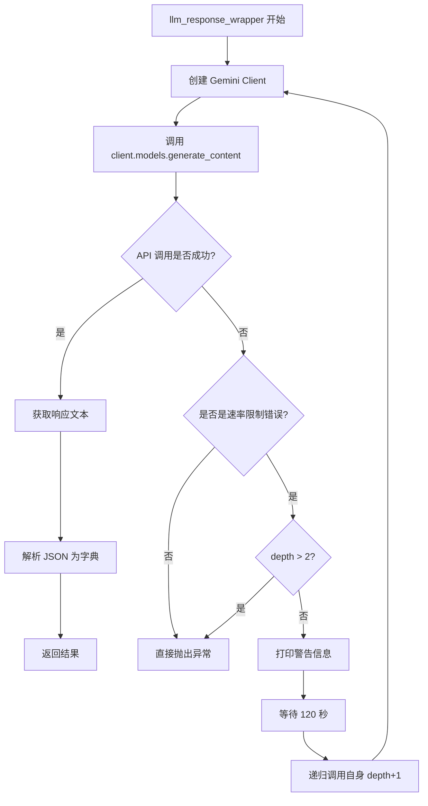

# `marker\benchmarks\overall\scorers\llm.py` 详细设计文档

这是一个基于Google Gemini大模型的文档评分系统，用于将PDF文档渲染为图像后与提取的Markdown进行对比评估，输出包含总体评分、文本质量、格式质量、表格/表单/公式/章节标题/列表/图像等维度的详细评分。

## 整体流程

```mermaid
graph TD
    A[开始: 调用LLMScorer] --> B[__call__方法]
    B --> C[读取PDF字节数据]
    C --> D[创建临时PDF文件]
    D --> E[使用pdfium渲染PDF第一页为图像]
    E --> F[调用llm_rater方法]
    F --> G{markdown是否为空?}
    G -- 是 --> H[返回默认低分评分]
    G -- 否 --> I[构建response_schema]
    I --> J[替换prompt中的{{markdown}}]
    J --> K[调用llm_response_wrapper]
    K --> L{API调用成功?}
    L -- 是 --> M[解析JSON响应]
    L -- 否 --> N[等待120秒后重试]
    N --> K
    M --> O[返回评分结果]
```

## 类结构

```
BaseScorer (基类，来自benchmarks.overall.scorers)
└── LLMScorer (文档评分器实现类)
```

## 全局变量及字段


### `rating_prompt`
    
用于评估markdown质量的LLM提示词模板，包含评分规则和示例输出格式

类型：`str`
    


### `comparison_keys`
    
包含'comparison'的列表，用于存储比较相关的JSON键

类型：`List[str]`
    


### `description_keys`
    
包含'image_description'和'markdown_description'的列表，用于存储描述相关的JSON键

类型：`List[str]`
    


### `text_keys`
    
由comparison_keys和description_keys合并而成的列表，包含所有文本相关的JSON键

类型：`List[str]`
    


### `score_keys`
    
包含所有评分维度的列表，如overall、text、formatting、tables等

类型：`List[str]`
    


    

## 全局函数及方法


### `LLMScorer.__call__`

该方法是 `LLMScorer` 类的核心调用入口，用于对提取的 Markdown 与原始 PDF 文档第一页进行对比评分。它首先将 PDF 的第一页渲染为图像，然后调用 `llm_rater` 方法利用 LLM（Gemini）分析图像与 Markdown 的匹配程度，最终返回包含总体评分和细项评分的字典。

参数：

- `self`：`LLMScorer`，LLMScorer 类的实例本身
- `sample`：`dict`，包含 PDF 字节数据的字典，预期包含键 "pdf"
- `gt_markdown`：`List[str]`，地面真值 Markdown 列表（当前实现中未使用，仅作为接口保留）
- `markdown`：`str`，需要被评分评估的提取后 Markdown 字符串

返回值：`BlockScores`，返回包含评分结果的字典。结构为 `{"score": int, "specific_scores": dict}`，其中 `score` 为整体评分（1-5），`specific_scores` 包含 text、formatting、overall、tables、forms、equations、lists、images 等细项评分及对比描述。

#### 流程图

```mermaid
flowchart TD
    A[开始 __call__] --> B[从 sample 提取 pdf_bytes]
    B --> C{创建临时 PDF 文件}
    C --> D[写入 pdf_bytes 并 flush]
    D --> E[使用 pdfium 打开 PDF]
    E --> F[渲染第一页为 PIL Image<br/>scale=96/72]
    F --> G[关闭 PDF 文档]
    G --> H[调用 llm_rater 方法]
    H --> I[返回 BlockScores 评分结果]
    
    subgraph llm_rater [llm_rater 方法]
        J[检查 markdown 是否为空] --> K{为空?}
        K -->|是| L[返回默认低分 1分]
        K -->|否| M[构建 response_schema]
        M --> N[替换 prompt 中的 {{markdown}}]
        N --> O[调用 llm_response_wrapper]
        O --> P[返回评分结果]
    end
    
    H -.-> |调用| J
```

#### 带注释源码

```python
def __call__(self, sample, gt_markdown: List[str], markdown: str) -> BlockScores:
    """
    评分器的主入口方法，对给定的 Markdown 与 PDF 文档第一页进行对比评分。
    
    参数:
        sample: 包含 PDF 字节数据的字典，预期结构 {"pdf": bytes}
        gt_markdown: 地面真值 Markdown 列表（当前版本未使用，保留接口兼容性）
        markdown: 待评分的提取后 Markdown 字符串
    
    返回:
        BlockScores: 包含整体评分和细项评分的字典
    """
    # 从 sample 字典中提取 PDF 字节数据
    pdf_bytes = sample["pdf"]
    
    # 创建临时 PDF 文件用于 pdfium 打开
    # 注意：pdfium 需要文件路径而非直接字节流
    with tempfile.NamedTemporaryFile(suffix=".pdf") as f:
        # 将 PDF 字节写入临时文件
        f.write(pdf_bytes)
        f.flush()
        f.seek(0)
        
        # 使用 pdfium 打开 PDF 文档
        doc = pdfium.PdfDocument(f.name)
        
        # 渲染第一页为 PIL Image 对象
        # scale=96/72 将 PDF 点转换为 96 DPI 图像
        img = doc[0].render(scale=96/72).to_pil()
        
        # 显式关闭文档释放资源
        doc.close()

    # 将渲染的图像和 Markdown 传递给 LLM 评分器
    return self.llm_rater(img, markdown)
```


### `LLMScorer.llm_rater`

该方法是 `LLMScorer` 类的核心评分方法，负责使用 Google Gemini 模型对 Markdown 文档进行质量评估。它接收 PDF 渲染的图像和对应的 Markdown 文本，通过 LLM 分析两者的匹配程度，返回包含总体评分和各项具体评分（文本质量、格式质量、表格、公式等）的评估结果。

参数：

- `img`：`Image.Image`，从 PDF 第一页渲染得到的图像对象，用于与 Markdown 进行对比
- `markdown`：`str`，从 PDF 提取的 Markdown 文本内容，待评估的输出结果

返回值：`BlockScores`，返回一个字典，包含 `score`（总体评分）和 `specific_scores`（各项详细评分）

#### 流程图

```mermaid
flowchart TD
    A[开始 llm_rater] --> B{markdown是否为空?}
    B -->|是| C[创建null_scores: 所有score_keys设为1]
    C --> D[创建text_scores: 所有text_keys设为空字符串]
    D --> E[合并null_scores和text_scores]
    E --> F[返回默认分数: score=1]
    B -->|否| G[构建req_keys列表]
    G --> H[遍历req_keys确定类型]
    H --> I[score_keys对应INTEGER, text_keys对应STRING]
    I --> J[构建properties字典]
    J --> K[创建response_schema对象]
    K --> L[替换rating_prompt中的{{markdown}}]
    L --> M[调用llm_response_wrapper]
    M --> N[获取LLM响应]
    N --> O{验证响应完整性}
    O -->|通过| P[提取overall分数]
    P --> Q[返回最终评分结果]
    O -->|失败| R[抛出断言错误]
    
    style A fill:#e1f5fe
    style F fill:#ffcdd2
    style Q fill:#c8e6c9
    style R fill:#ffcdd2
```

#### 带注释源码

```python
def llm_rater(self, img: Image.Image, markdown: str) -> BlockScores:
    """
    使用LLM评估Markdown与图像的匹配质量
    
    参数:
        img: Image.Image - PDF第一页渲染的图像
        markdown: str - 待评估的Markdown文本
    
    返回:
        BlockScores - 包含score和specific_scores的字典
    """
    
    # 检查markdown是否为空，如果为空则返回默认最低分
    if not markdown:
        # 创建默认分数：所有评分维度设为1分（最低有效分）
        null_scores = {k: 1 for k in score_keys}
        # 创建空描述：所有文本描述字段设为空字符串
        text_scores = {k: "" for k in text_keys}
        # 合并分数和描述
        null_scores.update(text_scores)
        # 返回默认评分结果（表示空markdown的低质量）
        return {
            "score": 1,
            "specific_scores": null_scores
        }
    
    # 构建需要请求的键列表：包含文本描述键和评分键
    req_keys = text_keys + score_keys
    
    # 初始化properties字典，用于定义JSON响应结构
    properties = {}
    for key in req_keys:
        # 评分键使用整数类型，描述键使用字符串类型
        content_type = "INTEGER" if key in score_keys else "STRING"
        properties[key] = {"type": content_type}
    
    # 构建完整的JSON响应模式定义
    response_schema = {
        "required": req_keys,  # 必需的键列表
        "properties": properties,  # 各键的类型定义
        "type": "OBJECT"  # 响应格式为对象
    }
    
    # 将markdown插入到评分提示模板中
    prompt = rating_prompt.replace("{{markdown}}", markdown)
    
    # 调用LLM包装器获取评分响应
    response = self.llm_response_wrapper([img, prompt], response_schema)
    
    # 验证响应包含所有必需的键，确保数据完整性
    assert all([k in response for k in req_keys]), f"Missing keys in response: {response}"
    
    # 返回最终评分结果，包含总体分数和详细评分
    return {
        "score": response["overall"],  # 提取总体评分
        "specific_scores": response,   # 包含所有具体评分项
    }
```


### `LLMScorer.llm_response_wrapper`

这是一个LLM评分器的响应封装方法，用于调用Google Gemini API生成结构化内容，并具有重试机制以处理速率限制。

参数：

- `prompt`：`Union[str, List]`，发送给LLM的提示内容，可以是字符串或包含图像和文本的列表
- `response_schema`：`Dict`，JSON Schema定义，指定API返回数据的结构和类型
- `depth`：`int`，递归深度计数器，用于控制重试次数，默认为0

返回值：`Dict`，解析后的JSON响应字典，包含根据response_schema生成的结构化数据

#### 流程图



#### 带注释源码

```python
def llm_response_wrapper(self, prompt, response_schema, depth=0):
    """
    封装对Google Gemini API的调用，带有重试机制处理速率限制
    
    参数:
        prompt: 发送给LLM的提示内容，可以是图像+文本的列表
        response_schema: 期望响应的JSON Schema定义
        depth: 当前重试深度，用于控制最大重试次数
    
    返回:
        解析后的JSON响应字典
    """
    # 初始化Gemini客户端，配置超时时间为60秒
    # 使用Vertex AI配置，从环境变量读取项目ID和位置
    client = genai.Client(
        http_options={"timeout": 60000},
        vertexai=True,
        project=os.getenv("VERTEX_PROJECT_ID"),
        location=os.getenv("VERTEX_LOCATION"),
    )
    
    try:
        # 调用Gemini API生成内容
        # temperature设为0以获得确定性结果
        # response_schema强制输出结构化JSON
        responses = client.models.generate_content(
            model="gemini-2.0-flash-001",
            contents=prompt,
            config={
                "temperature": 0,
                "response_schema": response_schema,
                "response_mime_type": "application/json",
            },
        )
        
        # 从响应中提取文本内容
        output = responses.candidates[0].content.parts[0].text
        
        # 解析JSON字符串为Python字典
        return json.loads(output)
    
    except APIError as e:
        # 捕获API错误，处理速率限制情况
        print(f"Hit Gemini rate limit, waiting 120 seconds")
        
        # 等待120秒后重试
        time.sleep(120)
        
        # 限制最大重试次数为3次（depth从0开始）
        if depth > 2:
            raise e
        
        # 递归重试，增加深度计数
        return self.llm_response_wrapper(prompt, response_schema, depth + 1)
```

## 关键组件


### PDF渲染组件

使用pdfium2库将PDF文档渲染为PIL图像对象，用于后续的LLM视觉评估。核心功能在于提取PDF第一页并转换为图像格式，支持不同的渲染缩放参数。

### LLM评估组件

集成Google GenAI SDK的gemini-2.0-flash-001模型，通过视觉理解能力比较图像与Markdown文本的匹配程度。实现了结构化的JSON响应schema，定义了评分维度和描述字段。

### 评分提示词工程组件

包含详细的评分标准和示例的prompt模板，定义了多个评估维度：overall（整体质量）、text（文本质量）、formatting（格式质量）、section_headers（章节标题）、tables（表格）、forms（表单）、equations（公式）、lists（列表）、images（图像）。

### API错误处理与重试机制

实现了指数退避的重试逻辑，当遇到Gemini API速率限制时自动等待120秒后重试，最多重试3次。捕获google.genai.errors.APIError异常并转化为可恢复的流程。

### 响应schema验证组件

动态构建JSON响应schema，根据评分键和描述键分别设置INTEGER和STRING类型。包含完整性断言，验证API返回结果是否包含所有必需字段。

### 零值处理组件

对空Markdown输入返回默认最低分（1分）和空描述，确保评分系统的鲁棒性。定义score_keys和text_keys集合用于结果结构化。


## 问题及建议


### 已知问题

- **不安全的配置获取**: 使用 `os.getenv()` 获取 `VERTEX_PROJECT_ID` 和 `VERTEX_LOCATION` 但未验证这些环境变量是否存在，可能导致运行时出现难以追踪的错误
- **不充分的错误处理**: `llm_response_wrapper` 仅捕获 `APIError` 处理速率限制，其他网络错误、认证失败、超时等异常未被捕获处理
- **资源泄漏风险**: PDF 文档在 `render()` 调用后立即调用 `close()`，但如果渲染或后续操作抛出异常，资源可能无法正确释放
- **硬编码配置**: 模型名称 `gemini-2.0-flash-001`、超时时间 `60000ms`、PDF 渲染缩放 `96/72` 等关键参数被硬编码，降低了可维护性和可测试性
- **重试机制简陋**: 遇到速率限制时仅固定等待 120 秒后重试，缺乏指数退避策略，可能加剧 API 限流问题
- **使用断言进行业务验证**: 使用 `assert` 验证 LLM 响应完整性，在生产环境中可能被 Python 优化选项（-O）禁用，导致程序继续运行并产生难以预测的行为
- **临时文件处理**: 临时文件依赖垃圾回收自动清理，缺乏显式管理
- **内存效率**: 将完整 PDF 字节加载到内存后再写入临时文件，对于大型 PDF 文件可能导致内存压力

### 优化建议

- 使用配置类或 Pydantic Settings 集中管理配置参数，为必需的环境变量提供默认值或显式验证
- 扩展异常处理逻辑，捕获更广泛的异常类型（网络错误、超时、认证错误等），并为每种异常提供适当的处理策略
- 使用上下文管理器（`with` 语句）确保 PDF 文档等资源正确释放
- 实现指数退避重试机制，并设置最大重试次数限制
- 使用结构化日志记录替代 `print` 语句，便于生产环境调试和监控
- 将响应验证逻辑从 `assert` 改为显式验证并返回默认值或抛出自定义异常
- 考虑使用 `tempfile.TemporaryDirectory` 或显式清理临时文件

## 其它


### 设计目标与约束

**设计目标**：实现一个基于LLM的文档质量评分系统，通过将PDF渲染为图像并使用Gemini模型评估Markdown提取结果的准确性和格式质量。

**约束条件**：
- 依赖Google Gemini API进行评分
- 仅支持PDF格式输入
- PDF处理限制为单页（取第一页）
- 使用Vertex AI进行Google认证
- 超时时间硬编码为60秒
- 重试机制仅针对API速率限制

### 错误处理与异常设计

**异常类型**：
- `APIError`：Google Genai库定义的API错误
- `json.JSONDecodeError`：JSON解析失败（隐式在`json.loads`中）
- `KeyError`：响应中缺少必需键（通过assert检查）
- `IOError`：PDF文件读写错误
- `PDFiumException`：PDF渲染错误

**错误处理策略**：
- API速率限制：打印警告信息，等待120秒后重试，最多重试3次
- 响应键缺失：使用assert断言抛出明确错误信息
- markdown为空：返回最低分数（1分）而非抛出异常

### 数据流与状态机

**数据输入流**：
1. 输入：`sample`（包含pdf字节）、`gt_markdown`（标准答案）、`markdown`（待评估内容）
2. PDF字节写入临时文件
3. 使用pdfium渲染PDF第一页为PIL Image
4. 构建包含图像和提示的prompt

**数据处理流**：
1. 检查markdown是否为空
2. 构建JSON响应schema（包含text_keys和score_keys）
3. 替换prompt模板中的占位符
4. 调用llm_response_wrapper获取LLM响应

**数据输出流**：
1. 解析LLM返回的JSON
2. 验证响应包含所有必需键
3. 返回BlockScores字典（包含overall score和specific_scores）

### 外部依赖与接口契约

**核心依赖**：
- `google.genai`：Gemini API客户端（必需）
- `pypdfium2`：PDF渲染库（必需）
- `PIL` (Pillow)：图像处理（必需）
- `tempfile`：临时文件管理（Python标准库）
- `json`：JSON序列化（Python标准库）

**环境变量依赖**：
- `VERTEX_PROJECT_ID`：Google Cloud项目ID（必需）
- `VERTEX_LOCATION`：Google Cloud区域（必需）

**接口契约**：
- 输入：`sample`字典需包含"pdf"键，值为PDF字节；`gt_markdown`为List[str]；`markdown`为str
- 输出：返回BlockScores字典，结构为`{"score": int, "specific_scores": dict}`
- BaseScorer基类要求实现`__call__`方法

### 性能考虑

**当前实现**：
- PDF临时文件使用后立即删除
- PDFium渲染scale为96/72
- 使用单页处理限制资源消耗

**潜在优化点**：
- 考虑使用内存缓冲区而非临时文件
- 添加请求超时和连接池管理
- 实现响应缓存机制避免重复评分
- 考虑异步调用提升吞吐量

### 安全性考虑

**当前实现**：
- 无敏感数据日志记录
- 使用环境变量管理API凭据

**潜在风险**：
- 临时文件可能包含敏感PDF内容
- prompt模板直接嵌入代码（难以审计）
- 错误信息可能泄露内部路径信息
- 未验证输入sample和markdown的类型

### 配置管理

**当前硬编码配置**：
- 模型名称：`gemini-2.0-flash-001`
- 超时时间：60000ms
- 温度：0（确定性输出）
- 响应MIME类型：`application/json`
- 重试等待时间：120秒
- 最大重试深度：3
- PDF渲染scale：96/72

**建议配置化**：
- 模型选择应可配置
- 超时和重试参数应支持环境变量覆盖
- 渲染scale应根据使用场景调整
</content>
    