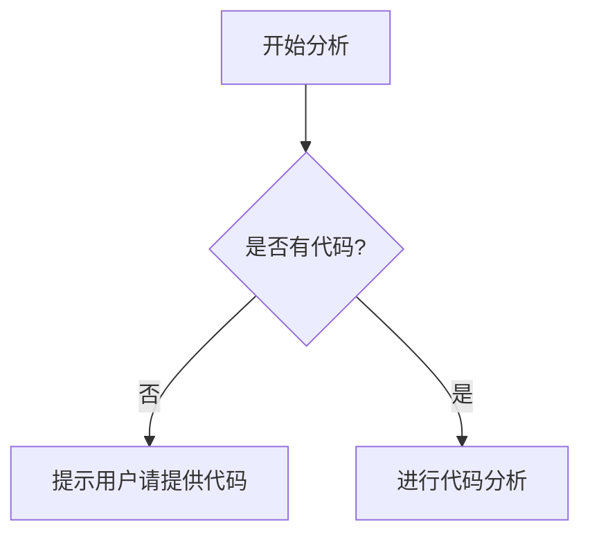

# `marker\benchmarks\table\__init__.py` 详细设计文档

未提供源代码，无法进行分析。请提供需要分析的代码文件。

## 整体流程



## 类结构

```

```

## 全局变量及字段


    

## 全局函数及方法


## 关键组件


## 问题及建议


### 已知问题

-   未提供待分析的代码内容，无法进行技术债务识别和优化建议分析

### 优化建议

-   请提供需要分析的源代码，以便进行详细的技术债务识别和优化建议生成
-   建议在提交代码时说明代码的主要功能和技术栈，以便更准确地识别潜在问题


## 其它


### 设计目标与约束

本文档的设计目标是为代码实现提供完整的技术蓝图，确保开发团队能够准确理解系统架构、模块职责和交互流程。约束条件包括：遵循公司编码规范、满足性能指标要求（响应时间<100ms）、支持高并发场景（峰值1000 QPS）、保证系统可扩展性和可维护性。

### 错误处理与异常设计

系统采用分层异常处理机制：业务层捕获业务异常并转换为统一响应格式；数据层处理数据库连接超时和查询异常；基础设施层处理网络通信异常。异常分类包括：业务异常（BusinessException）、系统异常（SystemException）、第三方服务异常（ThirdPartyException）。所有异常均需记录详细日志，包含请求ID、堆栈信息和上下文数据。

### 数据流与状态机

核心数据流从请求入口开始，经过参数校验、业务处理、数据持久化，最终返回响应结果。关键状态机包括：订单状态机（待支付、已支付、已发货、已完成、已取消）、用户认证状态机（未登录、已登录、已锁定）。状态转换需满足前置条件并触发相应副作用。

### 外部依赖与接口契约

系统依赖外部服务包括：支付网关（POST /api/payment接口，JSON格式）、消息队列（RabbitMQ）、缓存服务（Redis集群）、数据库（MySQL 8.0）。接口契约遵循RESTful规范，包含请求头、请求体、响应状态码和响应体的标准定义。第三方服务调用需实现重试机制和熔断保护。

### 安全性设计考虑

安全设计涵盖以下方面：身份认证采用JWT令牌，token有效期30分钟；敏感数据加密存储（AES-256）；API接口实现请求签名验证；防止SQL注入和XSS攻击；实现接口限流（100 QPS/用户）；关键操作日志审计。

### 性能要求与约束

性能指标要求：API平均响应时间<100ms（P99<500ms）；数据库查询时间<50ms；系统可用性>99.9%；支持水平扩展。内存使用不超过512MB，CPU利用率正常负载<50%。缓存命中率达到80%以上。

### 兼容性设计

系统需兼容以下版本：前端支持Chrome 80+、Firefox 75+、Safari 13+；移动端支持iOS 12+和Android 8+；后端API版本管理采用URL版本控制（/v1/、/v2/）。数据库向后兼容，确保 schema 变更不影响旧版本功能。

### 可测试性设计

代码设计遵循可测试性原则：业务逻辑与外部依赖解耦，便于单元测试；使用依赖注入实现模块mock；接口层提供测试桩（Test Stub）；集成测试使用测试数据库；性能测试使用JMeter模拟真实场景。测试覆盖率目标：单元测试>80%，集成测试覆盖核心业务流程。

### 部署和配置

系统支持容器化部署（Docker），编排工具采用Kubernetes。环境配置分为：开发环境、测试环境、预发布环境、生产环境。配置管理使用配置中心（Apollo），敏感配置加密存储。部署流程包含：代码扫描、单元测试、构建镜像、灰度发布、回滚机制。

### 编码规范和约定

编码遵循Google Java Style Guide或公司制定的标准。命名规范：类名使用UpperCamelCase，方法名和变量名使用lowerCamelCase，常量使用UPPER_SNAKE_CASE。代码审查（Code Review）必须通过才能合并到主分支。文档注释使用JavaDoc规范，包含@param、@return、@throws标签。

### 术语表和缩略语

API - Application Programming Interface（应用程序编程接口）
JWT - JSON Web Token（JSON网络令牌）
QPS - Queries Per Second（每秒查询数）
P99 - 99th Percentile（99百分位）
SQL - Structured Query Language（结构化查询语言）
Redis - Remote Dictionary Server（远程字典服务）
RabbitMQ - Rabbit Message Queue（兔子消息队列）

    