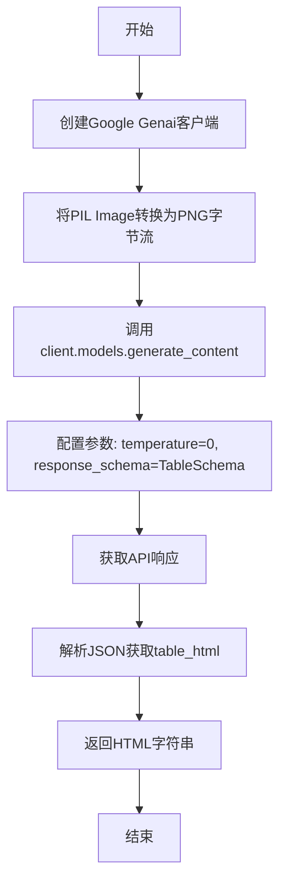
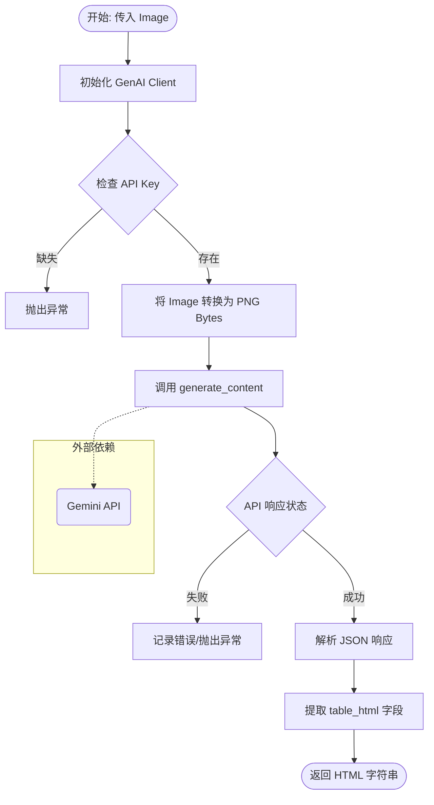

# `marker\benchmarks\table\gemini.py` 详细设计文档

使用Google Gemini 2.0 Flash模型识别图片中的表格，并将其转换为HTML表格表示的模块。通过PIL处理图片，调用Gemini API进行视觉分析，最终输出符合简单HTML规范的表格代码。

## 整体流程



## 类结构

```
模块级
└── TableSchema (Pydantic BaseModel)
    └── table_html: str
└── gemini_table_rec (主函数)
```

## 全局变量及字段


### `prompt`
    
用于指导Gemini模型将表格转换为HTML的系统提示词

类型：`str`
    


### `settings`
    
marker.settings中的配置对象，包含GOOGLE_API_KEY等配置

类型：`Settings`
    


### `image`
    
输入的表格图片对象

类型：`Image.Image`
    


### `client`
    
Gemini API客户端实例，用于调用大模型

类型：`genai.Client`
    


### `image_bytes`
    
图片的字节流缓冲区，用于存储PNG格式的图片数据

类型：`BytesIO`
    


### `responses`
    
Gemini模型生成内容的响应对象

类型：`GenerateContentResponse`
    


### `output`
    
模型返回的JSON格式文本，包含表格HTML

类型：`str`
    


### `TableSchema.table_html`
    
表格的HTML字符串表示

类型：`str`
    
    

## 全局函数及方法


### `gemini_table_rec`

该函数是表格识别的核心入口，接收一个PIL图像对象，将其转换为字节流后发送至Google Gemini 2.0 Flash模型，利用多模态能力解析图像中的表格结构，并依据预定义的JSON Schema返回标准化的HTML表格代码。

#### 参数

- `image`：`Image.Image`，待识别的PIL图像对象，通常为文档表格的截图或扫描件。

#### 返回值

- `str`，返回解析后的HTML表格字符串（仅包含`<table>`及其内部标签）。

#### 流程图



#### 带注释源码

```python
import json
from PIL import Image
from google import genai
from google.genai import types
from io import BytesIO
from pydantic import BaseModel

# 从项目配置中导入 Google API Key
from marker.settings import settings

# 定义发送给 Gemini 模型的系统提示词（System Prompt）
# 要求模型将图片中的表格转换为简洁的 HTML，仅使用 table, tr, td 等基础标签
prompt = """
You're an expert document analyst who is good at turning tables in documents into HTML.  Analyze the provided image, and convert it to a faithful HTML representation.
 
Guidelines:
- Keep the HTML simple and concise.
- Only include the <table> tag and contents.
- Only use <table>, <tr>, and <td> tags.  Only use the colspan and rowspan attributes if necessary.  Do not use <tbody>, <thead>, or <th> tags.
- Make sure the table is as faithful to the image as possible with the given tags.

**Instructions**
1. Analyze the image, and determine the table structure.
2. Convert the table image to HTML, following the guidelines above.
3. Output only the HTML for the table, starting with the <table> tag and ending with the </table> tag.
""".strip()

# 定义 Pydantic 数据模型，用于强制校验 API 返回的 JSON 结构
class TableSchema(BaseModel):
    # 期望 API 返回一个包含 table_html 字段的 JSON 对象
    table_html: str

def gemini_table_rec(image: Image.Image):
    """
    主识别函数：利用 Gemini Vision 模型识别表格图片并返回 HTML。
    
    参数:
        image (Image.Image): PIL 库读取的图片对象。
        
    返回:
        str: 转换后的 HTML 表格代码。
    """
    # 1. 初始化 Gemini 客户端
    # 配置超时时间为 60 秒 (60000ms)，因为图像处理可能耗时较长
    client = genai.Client(
        api_key=settings.GOOGLE_API_KEY,
        http_options={"timeout": 60000}
    )

    # 2. 图像预处理：将 PIL Image 对象转换为字节流 (PNG 格式)
    # BytesIO 用于在内存中操作二进制数据，避免写入磁盘
    image_bytes = BytesIO()
    image.save(image_bytes, format="PNG")

    # 3. 调用 Gemini API
    # model: 指定使用的模型 (gemini-2.0-flash)
    # contents: 内容列表，按照文档建议，图片放在第一位效果更好，后面跟提示词
    # config: 生成配置
    #   - temperature: 0，控制随机性，表格识别需要高准确性
    #   - response_schema: TableSchema，强制模型输出结构化 JSON
    #   - response_mime_type: "application/json"，指定输出格式
    responses = client.models.generate_content(
        model="gemini-2.0-flash",
        contents=[types.Part.from_bytes(data=image_bytes.getvalue(), mime_type="image/png"), prompt], 
        config={
            "temperature": 0,
            "response_schema": TableSchema,
            "response_mime_type": "application/json",
        },
    )

    # 4. 解析响应
    # 获取候选结果中的第一个候选，取其文本部分
    output = responses.candidates[0].content.parts[0].text
    
    # 5. 反序列化与提取
    # 使用 json.loads 将字符串转为字典，并根据 schema 提取 table_html
    return json.loads(output)["table_html"]
```

### 关键组件信息

1.  **`TableSchema` (类)**: 基于 Pydantic 的数据模型，定义了API返回数据的结构，强制包含 `table_html` 字段，确保后续解析的安全性。
2.  **`prompt` (全局变量)**: 字符串常量，封装了金山表格识别的具体业务规则（简化HTML、禁用特定标签等），是保证输出格式的关键。
3.  **`genai.Client`**: Google GenAI Python SDK 的客户端实例，负责与云端模型通信。

### 潜在的技术债务或优化空间

1.  **硬编码配置**:
    - 模型名称 `"gemini-2.0-flash"` 和超时时间 `60000` 被硬编码在函数内部，应提取至配置文件或构造函数参数中。
2.  **异常处理缺失**:
    - 代码直接使用 `responses.candidates[0]` 和 `json.loads(output)["table_html"]` 进行索引访问。如果 API 返回空结果、拒绝回答或格式不符，将直接抛出 `IndexError` 或 `KeyError`。缺乏 `try-except` 块和重试机制。
3.  **日志记录**:
    - 缺少日志打印（Logging），难以追踪 API 调用失败或识别错误的具体原因。
4.  **图像压缩**:
    - 直接将原图转为 PNG 传输，对于大幅面的扫描件或高清图片，可能会导致 API 请求体积过大或超时。可以在传输前增加图像压缩或降采样的步骤以提升性能。

### 其它项目

- **设计目标与约束**:
    - **目标**: 快速、准确地将文档图片中的表格转换为可编辑的 HTML。
    - **约束**: 严格限制 HTML 标签（仅允许 table/tr/td 及 colspan/rowspan），以保证前端渲染的兼容性和简洁性。
- **错误处理与异常设计**:
    - 当前对网络错误（超时）、认证错误（API Key 无效）及模型幻觉（返回非 JSON 格式）均无捕获处理。
- **外部依赖与接口契约**:
    - 强依赖 `google.genai` 库和 `settings.GOOGLE_API_KEY`。
    - 输入必须是 `PIL.Image` 对象。
    - 输出必须是标准的 HTML 字符串。


## 关键组件


### 表格识别提示词模板 (Prompt Template)

定义了一段详细的提示词，用于指导Gemini模型将表格图像转换为HTML格式。提示词包含分析步骤、HTML标签限制（仅使用table、tr、td、colspan、rowspan）和忠诚度要求。

### TableSchema 数据模型

使用Pydantic定义的输出结构模型，包含`table_html: str`字段，用于约束Gemini API返回的JSON响应格式，确保输出为有效的HTML表格字符串。

### gemini_table_rec 表格识别函数

核心函数，负责协调图像处理和AI模型调用。流程：1) 创建GenAI客户端 2) 将PIL图像转换为PNG字节流 3) 调用Gemini 2.0 Flash模型 4) 解析JSON响应提取HTML。返回值为表格HTML字符串。

### Google GenAI 客户端配置

使用`genai.Client`配置Google Gemini API调用，包含60秒超时设置、temperature=0（确定性输出）、response_schema约束和application/json mime类型配置。

### 图像字节处理模块

使用`BytesIO`将PIL Image对象转换为PNG格式的字节流，供Gemini API使用。图像作为contents数组的第一个元素以获得更好的识别效果。


## 问题及建议


### 已知问题

-   **错误处理不足**：未对 `settings.GOOGLE_API_KEY` 为空、API响应为空（`responses.candidates` 为空或无内容）、JSON 解析失败、图像转换异常等情况进行处理，可能导致运行时崩溃
-   **防御性编程缺失**：直接访问 `responses.candidates[0].content.parts[0].text`，未做空值检查
-   **超时配置不合理**：60 秒超时可能导致长时间阻塞，且超时时间硬编码，未从配置读取
-   **资源未复用**：每次调用都创建新的 `genai.Client` 实例，增加开销
-   **硬编码配置**：模型名称（`gemini-2.0-flash`）、温度（`0`）、超时等参数硬编码在函数内，扩展性差
-   **日志缺失**：无任何日志记录，难以追踪问题和调试
-   **类型注解缺失**：函数参数和返回值缺少类型注解，影响可读性和静态检查
-   **图像处理效率**：每次都将图像转为 PNG 字节流，可考虑复用或缓存

### 优化建议

-   添加完善的异常处理机制，使用 try-except 捕获并合理处理各类异常，提供有意义的错误信息
-   增加空值和边界检查，验证 API 响应完整性后再访问
-   将超时、模型名称等配置提取到 settings 或配置文件中
-   考虑将 `genai.Client` 改为单例模式或通过依赖注入复用
-   添加结构化日志，记录请求参数、响应状态、耗时等信息
-   为函数添加类型注解，提升代码可读性
-   可增加重试机制应对临时性 API 故障
-   考虑将 prompt 模板化，支持配置化

## 其它


### 设计目标与约束

本模块的设计目标是将文档图片中的表格内容自动识别并转换为HTML格式的表格代码。核心约束包括：依赖Google Gemini 2.0 Flash模型进行表格识别，要求输出严格遵循仅使用table、tr、td及colspan/rowspan属性的HTML规范，返回结果必须为JSON格式且包含table_html字段。

### 错误处理与异常设计

当API调用超时时，client初始化时设置的60000毫秒超时将触发超时异常，需在上层调用中捕获处理。当模型返回的响应格式不符合预期（如candidates为空、parts为空或text为空）时，json.loads(output)将抛出JSON解析异常。API密钥无效或权限不足时，genai.Client会抛出认证相关异常。此外，图片格式不支持导致image.save失败时会产生IO异常。建议在gemini_table_rec函数外层添加try-except块，捕获TimeoutError、JSONDecodeError、KeyError及genai相关异常，并返回有意义的错误信息或降级处理。

### 外部依赖与接口契约

本模块直接依赖五个外部包：PIL(Pillow)用于图像处理，google.genai用于调用Gemini API，pydantic用于数据校验，json为标准库，io.BytesIO为标准库。配置依赖marker.settings模块中的settings.GOOGLE_API_KEY配置项。函数入口为gemini_table_rec(image: Image.Image) -> str，承诺输入有效的PIL Image对象并返回HTML表格字符串。返回的HTML保证以`<table>`开始并以`</table>`结束，不包含thead/tbody/th标签。

### 性能考虑与优化空间

当前每次调用都会创建新的genai.Client实例，造成不必要的连接开销，建议将client实例化为模块级单例。图像转BytesIO时使用PNG格式，PNG为无损格式但体积较大，对于简单表格可考虑JPEG格式以减少传输时间。超时设置为60秒，对于复杂表格识别可能不足，但增加超时需权衡用户体验。当前配置temperature设为0保证确定性输出，符合表格识别场景需求。

### 安全性考虑

API密钥从settings配置获取，需确保settings实现安全的密钥管理机制（如环境变量），避免硬编码或泄露到日志。输入的Image.Image对象来源需验证，避免处理恶意构造的图像导致内存溢出或处理时间过长。输出的HTML应进行安全检查，防止XSS等安全问题，虽然当前为纯表格转换，但仍建议对返回的table_html进行基本校验。

### 配置管理

模块依赖外部配置项GOOGLE_API_KEY，该配置应在应用初始化阶段验证存在性。模型名称gemini-2.0-flash当前为硬编码，建议提取为配置项以支持模型版本升级。超时时间60000毫秒、temperature为0、response_mime_type为application/json等参数均为业务相关配置，可考虑通过参数化或配置中心统一管理。

### 日志与监控建议

建议在关键节点添加日志：函数入口记录日志级别INFO，记录图像尺寸以便排查问题；API调用前记录DEBUG级别日志；API调用异常时记录ERROR级别日志并包含异常堆栈；成功返回时记录返回HTML的长度而非内容本身。监控指标应包括函数调用成功率、平均处理耗时、API错误类型分布等。

### 单元测试策略

由于依赖外部Gemini API，单元测试应采用Mock方式：使用unittest.mock.patch模拟client.models.generate_content的返回值，验证不同响应格式下的函数行为。建议构造三个测试用例：正常响应时验证返回正确的table_html；响应格式异常时验证抛出预期异常；JSON解析失败时验证异常向上传播。还应测试PIL Image的各种格式支持及边界情况（如空图像、极大图像）。

### 并发与线程安全性

当前实现为同步函数，在多线程环境下使用是安全的，但需注意genai.Client的非线程安全可能性，建议每个线程创建独立client实例或使用线程本地存储。若需提升吞吐量，可考虑在函数外层添加异步封装或任务队列，但需注意Google API的速率限制。


    