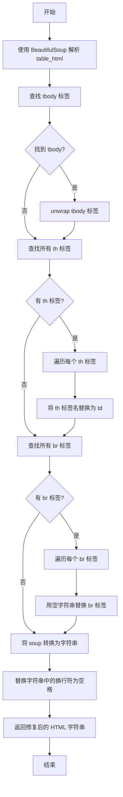
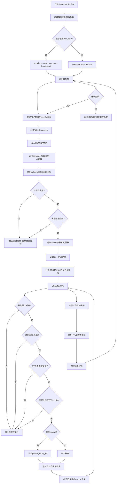

# `marker\benchmarks\table\inference.py` 详细设计文档

该代码是一个自动化基准测试流程，用于处理PDF数据集，提取表格，通过边界框匹配算法将Marker模型检测到的表格与地面真值（Ground Truth）对齐，并可选地调用Gemini API进行增强识别，最终生成用于评估的HTML结果。

## 整体流程

```mermaid
graph TD
    Start([开始]) --> LoadModels[加载模型: create_model_dict]
    LoadModels --> Config[初始化配置: ConfigParser]
    Config --> LoopData[遍历数据集 (tqdm)]
    LoopData --> Decode[Base64解码 PDF]
    Decode --> Convert[TableConverter 转换 PDF -> JSON]
    Convert --> Render[pdfium 渲染页面为图片]
    Render --> Extract[extract_tables 提取表格块]
    Extract --> CheckCount{表格数量 == GT数量?}
    CheckCount -- No --> Skip[跳过并记录 unaligned]
    CheckCount -- Yes --> Crop[裁剪表格图片]
    Crop --> Compute[计算交集面积与对齐矩阵]
    Compute --> AlignLoop{遍历对齐结果}
    AlignLoop --> CheckArea[检查面积比例 0.85-1.15]
    CheckArea -- Fail --> MarkUnaligned[标记为未对齐]
    CheckArea -- Pass --> GeminiCheck{use_gemini?}
    GeminiCheck -- Yes --> CallGemini[调用 gemini_table_rec]
    CallGemini --> Fix[fix_table_html 清理HTML]
    GeminiCheck -- No --> Fix
    Fix --> AppendResult[加入结果列表]
    AppendResult --> AlignLoop
    AlignLoop -.-> LoopData
    LoopData --> ReturnResults[返回 results, total_unaligned]
```

## 类结构

```
inference_tables.py (脚本根目录)
├── extract_tables (递归工具函数)
├── fix_table_html (HTML标准化工具函数)
└── inference_tables (主逻辑流程函数)
```

## 全局变量及字段


### `dataset`
    
输入的PDF与GT表格数据

类型：`List[Dict]`
    


### `use_llm`
    
是否启用LLM处理器

类型：`bool`
    


### `table_rec_batch_size`
    
表格识别批大小

类型：`int | None`
    


### `max_rows`
    
最大处理行数限制

类型：`int`
    


### `use_gemini`
    
是否启用Gemini识别

类型：`bool`
    


### `models`
    
加载的模型字典

类型：`Dict`
    


### `config_parser`
    
配置对象

类型：`ConfigParser`
    


### `total_unaligned`
    
累计未对齐计数

类型：`int`
    


### `results`
    
最终输出结果列表

类型：`List[Dict]`
    


    

## 全局函数及方法


### `extract_tables`

该函数是一个递归辅助函数，用于从嵌套的JSON块结构中提取所有类型为'Table'的块。它遍历给定的JSONBlockOutput列表，将所有顶层和嵌套的Table块收集并返回为一个列表。

参数：

- `children`：`List[JSONBlockOutput]`，包含JSONBlockOutput对象的列表，这些对象可能包含Table类型的块或其他嵌套的children

返回值：`List[JSONBlockOutput]`，返回所有提取出来的Table类型块组成的列表

#### 流程图

```mermaid
flowchart TD
    A[开始 extract_tables] --> B{children 是否为空?}
    B -->|是| C[返回空列表]
    B -->|否| D[遍历 children 中的每个 child]
    D --> E{child.block_type == 'Table'?}
    E -->|是| F[将 child 添加到 tables 列表]
    E -->|否| G{child.children 是否存在?}
    F --> H{是否还有更多 child?}
    G -->|是| I[递归调用 extract_tables(child.children)]
    G -->|否| H
    I --> J[将递归返回的 tables 扩展到当前 tables]
    H --> K{是否还有更多 child?}
    K -->|是| D
    K -->|否| L[返回 tables 列表]
```

#### 带注释源码

```python
def extract_tables(children: List[JSONBlockOutput]):
    """
    从嵌套的JSONBlockOutput结构中递归提取所有Table类型的块
    
    参数:
        children: JSONBlockOutput对象列表，可能包含Table块或其他嵌套块
        
    返回:
        所有提取到的Table类型块组成的列表
    """
    tables = []  # 初始化结果列表
    for child in children:  # 遍历每个子块
        if child.block_type == 'Table':  # 检查是否为Table类型
            tables.append(child)  # 如果是Table，添加到结果列表
        elif child.children:  # 如果不是Table但有子节点
            tables.extend(extract_tables(child.children))  # 递归处理子节点
    return tables  # 返回提取的所有Table块
```


### `fix_table_html`

该函数用于修复 Marker 生成的表格 HTML，移除不必要的 `<tbody>` 包装，将 `<th>` 标签替换为 `<td>` 标签，清除 `<br>` 换行符，并将换行符替换为空格，以适配 Fintabnet 数据格式的表格比较。

参数：

- `table_html`：`str`，待修复的 HTML 表格字符串

返回值：`str`，修复后的 HTML 表格字符串

#### 流程图



#### 带注释源码

```python
def fix_table_html(table_html: str) -> str:
    """
    修复 Marker 生成的表格 HTML 格式，以适配 Fintabnet 数据格式
    
    参数:
        table_html: str, 待修复的 HTML 表格字符串
        
    返回:
        str, 修复后的 HTML 表格字符串
    """
    # 使用 BeautifulSoup 解析 HTML 字符串，使用 html.parser 解析器
    marker_table_soup = BeautifulSoup(table_html, 'html.parser')
    
    # 查找 tbody 标签（Marker 会将表格内容包装在 tbody 中）
    tbody = marker_table_soup.find('tbody')
    if tbody:
        # unwrap 移除 tbody 标签但保留其子元素内容
        tbody.unwrap()
    
    # 查找所有 th（表头）标签并替换为 td（表格数据）标签
    # Fintabnet 数据不使用 th 标签，需要统一为 td 以便公平比较
    for th_tag in marker_table_soup.find_all('th'):
        th_tag.name = 'td'
    
    # 查找所有 br（换行）标签并替换为空字符串
    # 移除多余的换行符
    for br_tag in marker_table_soup.find_all('br'):
        br_tag.replace_with(marker_table_soup.new_string(''))
    
    # 将处理后的 soup 对象转换为字符串
    marker_table_html = str(marker_table_soup)
    
    # 将换行符替换为空格
    # Fintabnet 数据使用空格而不是换行符
    marker_table_html = marker_table_html.replace("\n", " ")
    
    # 返回修复后的 HTML 字符串
    return marker_table_html
```


### `inference_tables`

该函数是表格识别推理的核心函数，负责对PDF数据集中的表格进行识别、提取和ground truth对齐计算。它使用marker库进行表格提取，通过计算边界框的交并比来评估识别准确性，并在启用时调用gemini模型进行额外的表格识别。

参数：

- `dataset`：数据集对象，包含PDF数据和对应的ground truth表格信息
- `use_llm`：`bool`，是否使用LLM增强的表格处理
- `table_rec_batch_size`：`int | None`，表格识别的批量大小配置
- `max_rows`：`int`，最大处理行数限制
- `use_gemini`：`bool`，是否使用gemini模型进行表格识别

返回值：`Tuple[List, int]`，返回包含marker表格、ground truth表格和gemini表格的字典列表，以及未能对齐的表格总数

#### 流程图



#### 带注释源码

```python
def inference_tables(dataset, use_llm: bool, table_rec_batch_size: int | None, max_rows: int, use_gemini: bool):
    """
    表格识别推理函数
    
    参数:
        dataset: PDF数据集，包含pdf base64编码和ground truth表格
        use_llm: 是否使用LLM增强的表格处理
        table_rec_batch_size: 表格识别批量大小
        max_rows: 最大处理行数
        use_gemini: 是否使用gemini进行表格识别
    
    返回:
        Tuple[List, int]: 结果列表和未对齐表格数量
    """
    # 创建模型字典，包含OCR、布局识别等模型
    models = create_model_dict()
    # 配置解析器，设置输出格式和LLM使用选项
    config_parser = ConfigParser({
        'output_format': 'json', 
        "use_llm": use_llm, 
        "table_rec_batch_size": table_rec_batch_size, 
        "disable_tqdm": True
    })
    total_unaligned = 0  # 累计未对齐的表格数量
    results = []  # 存储最终的表格识别结果

    # 确定迭代次数
    iterations = len(dataset)
    if max_rows is not None:
        # 限制最大处理数量
        iterations = min(max_rows, len(dataset))

    # 遍历数据集中的每个PDF
    for i in tqdm(range(iterations), desc='Converting Tables'):
        try:
            row = dataset[i]
            # 从base64解码PDF二进制数据
            pdf_binary = base64.b64decode(row['pdf'])
            # 获取ground truth表格（已按阅读顺序排序）
            gt_tables = row['tables']

            # 创建表格转换器，使用基础表格处理器和LLM处理器
            converter = TableConverter(
                config=config_parser.generate_config_dict(),
                artifact_dict=models,
                processor_list=[
                    "marker.processors.table.TableProcessor",
                    "marker.processors.llm.llm_table.LLMTableProcessor",
                ],
                renderer=config_parser.get_renderer()
            )

            # 将PDF写入临时文件供marker处理
            with tempfile.NamedTemporaryFile(suffix=".pdf", mode="wb") as temp_pdf_file:
                temp_pdf_file.write(pdf_binary)
                temp_pdf_file.seek(0)
                # 调用转换器获取JSON格式的表格结构
                marker_json = converter(temp_pdf_file.name).children

                # 使用pdfium渲染PDF第一页为图片
                doc = pdfium.PdfDocument(temp_pdf_file.name)
                page_image = doc[0].render(scale=96/72).to_pil()
                doc.close()

            # 检查是否检测到表格
            if len(marker_json) == 0 or len(gt_tables) == 0:
                print(f'No tables detected, skipping...')
                total_unaligned += len(gt_tables)
                continue

            # 从JSON中提取所有表格块
            marker_tables = extract_tables(marker_json)
            # 获取每个表格的边界框
            marker_table_boxes = [table.bbox for table in marker_tables]
            # 获取页面边界框
            page_bbox = marker_json[0].bbox

            # 验证表格数量是否匹配
            if len(marker_tables) != len(gt_tables):
                print(f'Number of tables do not match, skipping...')
                total_unaligned += len(gt_tables)
                continue

            # 裁剪出每个表格对应的图片区域
            table_images = [
                page_image.crop(
                    PolygonBox.from_bbox(bbox)
                    .rescale(
                        (page_bbox[2], page_bbox[3]), (page_image.width, page_image.height)
                    ).bbox
                )
                for bbox
                in marker_table_boxes
            ]

            # 归一化边界框（转换为0-1范围的相对坐标）
            for bbox in marker_table_boxes:
                bbox[0] = bbox[0] / page_bbox[2]
                bbox[1] = bbox[1] / page_bbox[3]
                bbox[2] = bbox[2] / page_bbox[2]
                bbox[3] = bbox[3] / page_bbox[3]

            # 提取ground truth的归一化边界框
            gt_boxes = [table['normalized_bbox'] for table in gt_tables]
            # 计算GT和Marker表格的面积
            gt_areas = [(bbox[2] - bbox[0]) * (bbox[3] - bbox[1]) for bbox in gt_boxes]
            marker_areas = [(bbox[2] - bbox[0]) * (bbox[3] - bbox[1]) for bbox in marker_table_boxes]
            # 计算交并比矩阵
            table_alignments = matrix_intersection_area(gt_boxes, marker_table_boxes)

            aligned_tables = []  # 存储成功对齐的表格
            used_tables = set()  # 记录已匹配的marker表格
            unaligned_tables = set()  # 记录未对齐的表格

            # 遍历每个GT表格的对齐情况
            for table_idx, alignment in enumerate(table_alignments):
                try:
                    max_area = np.max(alignment)
                    aligned_idx = np.argmax(alignment)
                except ValueError:
                    # 没有找到对齐
                    unaligned_tables.add(table_idx)
                    continue

                # 对齐面积过小
                if max_area <= .01:
                    unaligned_tables.add(table_idx)
                    continue

                # 该marker表格已被其他GT表格使用
                if aligned_idx in used_tables:
                    unaligned_tables.add(table_idx)
                    continue

                # 检查GT表格与Marker表格的面积比例是否合理
                gt_table_pct = gt_areas[table_idx] / max_area
                if not .85 < gt_table_pct < 1.15:
                    unaligned_tables.add(table_idx)
                    continue

                # 检查Marker表格与GT表格的面积比例是否合理
                marker_table_pct = marker_areas[aligned_idx] / max_area
                if not .85 < marker_table_pct < 1.15:
                    unaligned_tables.add(table_idx)
                    continue

                # 如果启用gemini，调用gemini进行表格识别
                gemini_html = ""
                if use_gemini:
                    try:
                        gemini_html = gemini_table_rec(table_images[aligned_idx])
                    except Exception as e:
                        print(f'Gemini failed: {e}')

                # 添加到对齐表格列表
                aligned_tables.append(
                    (marker_tables[aligned_idx], gt_tables[table_idx], gemini_html)
                )
                used_tables.add(aligned_idx)

            # 累加未对齐表格数量
            total_unaligned += len(unaligned_tables)

            # 处理每个对齐的表格
            for marker_table, gt_table, gemini_table in aligned_tables:
                gt_table_html = gt_table['html']

                # 修复marker输出的HTML格式差异
                # marker在表格外包裹了<tbody>，需要移除
                # fintabnet不使用th标签，需要替换为td
                marker_table_html = fix_table_html(marker_table.html)
                gemini_table_html = fix_table_html(gemini_table)

                # 构建结果字典
                results.append({
                    "marker_table": marker_table_html,
                    "gt_table": gt_table_html,
                    "gemini_table": gemini_table_html
                })
        except pdfium.PdfiumError:
            print('Broken PDF, Skipping...')
            continue
    
    return results, total_unaligned
```

## 关键组件


### 表格提取组件 (extract_tables)

递归遍历 JSONBlockOutput 树，提取所有类型为 'Table' 的块。支持嵌套 children 的深度优先遍历，用于从 marker 输出的 JSON 结构中获取所有表格元素。

### HTML 修复组件 (fix_table_html)

将 marker 输出的表格 HTML 转换为与 fintabnet 数据集兼容的格式。移除 tbody 标签，将 th 标签替换为 td 标签，处理 br 标签，并将换行符替换为空格。

### 表格推理与对齐引擎 (inference_tables)

核心组件，协调整个表格识别和对齐流程。创建 TableConverter 处理 PDF，提取表格，计算边界框交集面积，进行双向面积比率校验，并可选调用 Gemini 进行表格识别增强。

### 边界框对齐算法

使用矩阵交集面积计算 gt_boxes 与 marker_table_boxes 之间的空间对齐关系。通过面积阈值（0.01）和双向面积比率校验（0.85-1.15）确保表格正确匹配，过滤未对齐的表格。

### PDF 渲染与裁剪

使用 pypium2 加载 PDF 并渲染第一页为 PIL 图像，根据表格边界框在页面图像上裁剪出对应的表格图像区域，用于后续 Gemini 识别或可视化对比。

### Gemini 表格识别集成

可选组件，通过 gemini_table_rec 函数对裁剪的表格图像进行 OCR 识别，生成 HTML 格式的表格内容，用于与 marker 输出和 ground truth 进行三方对比。

### 表格转换器 (TableConverter)

marker 库的核心组件，接收配置、模型字典、处理器列表和渲染器，将 PDF 文件转换为结构化的 JSON 输出，包含表格的位置信息和 HTML 内容。


## 问题及建议


### 已知问题

-   **模型和配置重复创建**：在每次迭代循环中都创建新的 `TableConverter`、`ConfigParser` 和 `create_model_dict()`，导致不必要的性能开销，这些应在循环外初始化一次。
-   **临时文件I/O开销**：使用 `tempfile.NamedTemporaryFile` 将 PDF 写入磁盘再读取，增加了 I/O 开销，应考虑使用内存缓冲区或流式处理。
-   **异常处理不完整**：仅捕获 `pdfium.PdfiumError`，其他异常（如 `KeyError`、`ValueError`、`IndexError`）可能导致程序意外终止。
-   **未使用的参数**：`use_llm` 参数传入后未被实际使用，配置已通过 `ConfigParser` 内部设置，造成接口冗余。
-   **魔法数字缺乏注释**：`.01`（面积阈值）、`.85` 和 `1.15`（面积比例范围）等关键阈值缺乏注释说明，影响代码可维护性。
-   **资源释放时机**：`doc` 和 `page_image` 虽然使用了 `with` 语句，但在循环内部频繁创建和销毁，PDF 渲染资源可能未及时释放。
-   **潜在空列表访问**：当 `table_alignments` 为空列表时，`np.max(alignment)` 会抛出 `ValueError`，尽管被 try-except 捕获但逻辑不够清晰。
-   **循环内重复计算**：对 `marker_table_boxes` 的归一化操作在每次循环迭代中执行，应在循环外统一处理。
- **函数职责过载**：`inference_tables` 函数同时处理模型初始化、数据加载、表格识别、对齐比较和结果生成，违反单一职责原则。

### 优化建议

-   将 `models`、`config_parser` 和 `config_dict` 的初始化移到循环外部，避免重复创建。
-   使用 `io.BytesIO` 或内存映射方式处理 PDF 二进制数据，减少磁盘 I/O 操作。
-   增加更细粒度的异常处理，例如分别捕获 `KeyError`、`ValueError`、`IndexError` 等，并记录具体错误信息。
-   移除冗余的 `use_llm` 参数，或明确其与 `ConfigParser` 配置的关系。
-   将魔法数字提取为命名常量（如 `MIN_ALIGNMENT_AREA`、`AREA_RATIO_LOWER`、`AREA_RATIO_UPPER`），并添加文档注释。
-   考虑将大函数拆分为多个独立函数：`initialize_models()`、`process_single_pdf()`、`align_tables()`、`format_results()`。
-   在循环开始前对所有 bbox 统一进行归一化处理，减少循环内的计算量。
-   使用上下文管理器或显式删除确保 PDF 渲染资源及时释放。

## 其它


### 设计目标与约束

本代码的核心设计目标是从PDF文档中提取表格结构，并将Marker模型的表格识别结果与Ground Truth进行对齐比较，同时可选地使用Gemini API进行表格识别以进行多模型对比评估。设计约束包括：依赖Marker框架的表格转换器、LLM处理器和渲染器；需要有效的PDF文件输入；表格对齐采用基于边界框的IOU匹配策略，要求面积重叠率在85%-115%之间视为有效对齐。

### 错误处理与异常设计

代码实现了多层次的错误处理机制：1) PDF解析层通过捕获`pdfium.PdfiumError`异常处理损坏或无效的PDF文件，跳过该样本继续处理；2) Gemini API调用层使用try-except捕获异常并打印错误信息，确保单个API失败不影响整体流程；3) 表格对齐层处理空列表、numpy计算异常等情况，将无法对齐的表格加入未对齐集合；4) 控制流层对表格数量不匹配、检测数量为0等边界情况直接跳过并打印日志。所有异常处理均保证程序不会中断运行。

### 数据流与状态机

数据流转过程如下：1) 输入阶段：从数据集加载base64编码的PDF和Ground Truth表格列表；2) PDF解析阶段：创建临时PDF文件，使用pypdfium2渲染页面为图像；3) 表格检测阶段：通过TableConverter处理PDF得到JSON格式的表格结构，使用递归函数extract_tables提取所有Table类型的块；4. 对齐阶段：计算Marker检测表格与Ground Truth表格的边界框交集矩阵，通过面积重叠率筛选最优匹配；5) 后处理阶段：对齐成功的表格调用fix_table_html修复HTML格式差异；6) Gemini增强阶段：可选地调用Gemini API重新识别表格图像；7) 输出阶段：组装结果字典包含marker_table、gt_table、gemini_table三个字段。

### 外部依赖与接口契约

主要外部依赖包括：marker框架提供的TableConverter、ConfigParser、create_model_dict、JSONBlockOutput、PolygonBox等核心组件；pypdfium2用于PDF解析和渲染；BeautifulSoup用于HTML解析和修复；numpy用于数值计算和矩阵操作；tqdm用于进度显示；base64和tempfile用于文件处理；gemini模块（本地benchmarks.table.gemini）提供Gemini表格识别接口。配置接口通过ConfigParser接收output_format、use_llm、table_rec_batch_size、disable_tqdm等参数。

### 性能考量与优化空间

性能方面主要考量：1) 表格转换使用单一PDF页面，每次迭代都重新创建converter实例，可考虑缓存converter；2) 图像裁剪和边界框计算涉及多次坐标转换，存在优化空间；3) Gemini API调用为串行执行，高频调用时可考虑异步或批量处理；4) 使用numpy矩阵运算进行表格对齐，效率较高但对大数量表格时可考虑更高效的匹配算法。当前实现支持max_rows参数限制处理数量便于调试，table_rec_batch_size参数可用于配置表格识别的批处理大小。

### 输入输出格式说明

输入数据格式：dataset为列表，每个元素为字典，包含base64编码的PDF数据（键名为'pdf'）和表格Ground Truth列表（键名为'tables'）。每个表格GT包含html字段（表格HTML字符串）和normalized_bbox字段（归一化后的边界框[x1,y1,x2,y2]）。输出结果格式：返回元组(results, total_unaligned)，其中results为列表，每个元素包含marker_table（Marker识别的表格HTML）、gt_table（Ground Truth表格HTML）、gemini_table（Gemini识别的表格HTML，可为空字符串）三个键；total_unaligned为未成功对齐的表格总数。

### 配置参数详解

关键配置参数说明：use_llm控制是否启用LLM增强的表格识别；table_rec_batch_size设置表格识别的批处理大小，None表示使用默认配置；max_rows限制处理的最大行数/样本数，用于调试或限制处理范围；use_gemini控制是否调用Gemini API进行额外的表格识别。ConfigParser配置output_format为'json'输出格式，disable_tqdm设为True禁用内部tqdm进度条以避免与外部进度条冲突。

### 使用示例与调用方式

基本调用方式：准备包含pdf和tables字段的数据集，调用inference_tables函数并传入所需参数。返回值results可直接用于后续的表格识别质量评估或HTML对比分析。示例：results, total_unaligned = inference_tables(dataset, use_llm=True, table_rec_batch_size=8, max_rows=100, use_gemini=True)

    