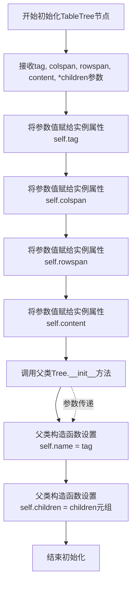
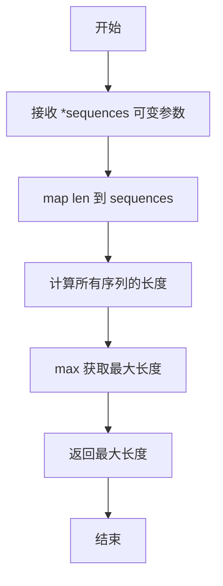
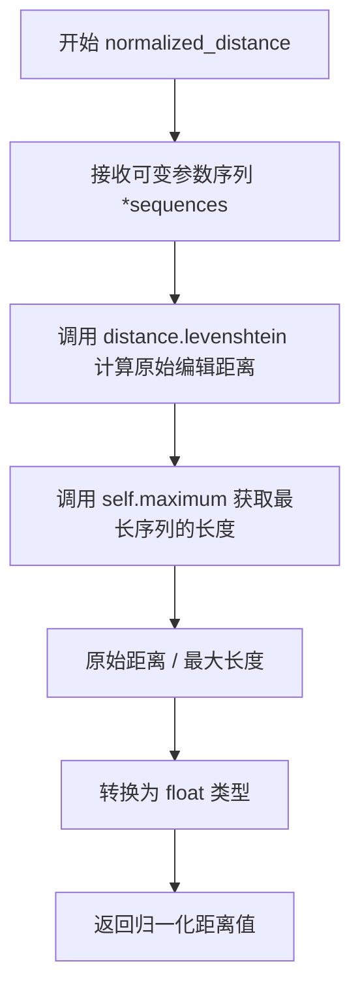
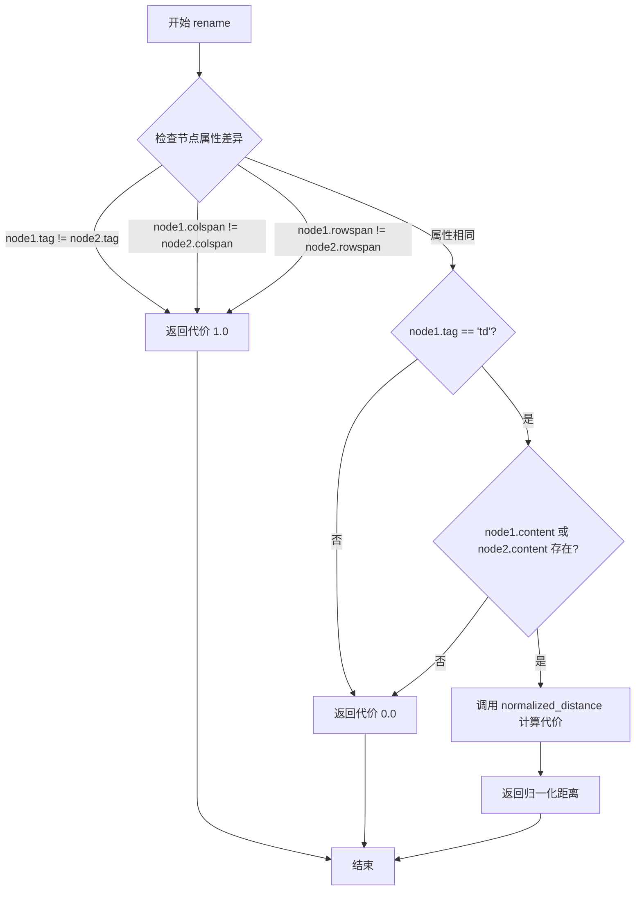

# `marker\benchmarks\table\scoring.py` 详细设计文档

该代码实现了TEDS（Tree Edit Distance based Similarity）算法，用于计算HTML表格结构之间的相似度评分。通过将HTML表格转换为树形结构，使用APTED库计算树编辑距离，从而评估预测表格与真实表格之间的相似程度。

## 整体流程

```mermaid
graph TD
    A[开始 similarity_eval_html] --> B[解析HTML: pred, true]
    B --> C{检查body/table是否存在?}
    C -- 否 --> D[返回0.0]
    C -- 是 --> E[提取table节点]
    E --> F[计算节点数: n_nodes_pred, n_nodes_true]
    F --> G[转换为树结构: tree_convert_html]
    G --> H[计算树编辑距离: APTED().compute_edit_distance()]
    H --> I[计算相似度: 1.0 - distance/n_nodes]
    I --> J[返回相似度分数]
    G --> G1[调用tokenize递归处理节点]
    G1 --> G2[构建TableTree对象]
```

## 类结构

```
Tree (apted.helpers.Tree)
└── TableTree (自定义实现)
Config (apted.Config)
└── CustomConfig (自定义实现)
```

## 全局变量及字段


### `__tokens__`
    
全局令牌列表，用于存储tokenize过程中的HTML标签和文本内容

类型：`list`
    


### `TableTree.tag`
    
HTML标签名

类型：`str`
    


### `TableTree.colspan`
    
单元格列跨度

类型：`int`
    


### `TableTree.rowspan`
    
单元格行跨度

类型：`int`
    


### `TableTree.content`
    
单元格内容

类型：`list`
    


### `TableTree.name`
    
树节点名称（继承自Tree）

类型：`str`
    


### `TableTree.children`
    
子节点列表（继承自Tree）

类型：`list`
    
    

## 全局函数及方法


### `wrap_table_html`

该函数接收一个HTML表格片段作为输入，并将其包装在标准的HTML文档结构中（包含 `<html>` 和 `<body>` 标签），确保输出是一个完整的HTML文档。

参数：
-  `table_html`：`str`，需要被包装的HTML表格片段字符串。

返回值：`str`，包装后的完整HTML文档字符串。

#### 流程图

```mermaid
graph LR
    A[开始] --> B[接收 table_html 字符串]
    B --> C[使用 f-string 拼接 HTML 结构]
    C --> D[返回 <html><body>{table_html}</body></html>]
    D --> E[结束]
```

#### 带注释源码

```python
def wrap_table_html(table_html:str)->str:
    """
    将输入的表格HTML字符串包装为完整的HTML文档。
    
    参数:
        table_html (str): 包含表格标签的HTML字符串。
        
    返回值:
        str: 包含标准HTML结构的字符串。
    """
    # 使用 f-string 将传入的 table_html 包裹在 <html> 和 <body> 标签中
    return f'<html><body>{table_html}</body></html>'
```


### `tokenize(node)`

该函数是一个递归函数，用于将HTML表格节点（特别是`td`单元格）转换为token序列。它遍历节点及其子节点，将标签和文本内容追加到全局列表`__tokens__`中，生成类似HTML源码的线性token表示。

参数：

- `node`：lxml.html.HtmlElement，要进行tokenize的HTML节点对象

返回值：`None`，该函数无返回值，通过修改全局变量`__tokens__`存储结果

#### 流程图

```mermaid
flowchart TD
    A[开始 tokenize] --> B{检查全局变量__tokens__}
    B --> C[追加开始标签<br/>如: <td>]
    D{node.text is not None?} -->|Yes| E[将text文本拆解为字符列表<br/>并追加到__tokens__]
    D -->|No| F[跳过]
    E --> G{遍历子节点}
    F --> G
    G -->|对每个子节点n| H[递归调用 tokenize(n)]
    H --> I{node.tag != 'unk'?}
    I -->|Yes| J[追加结束标签<br/>如: </td>]
    I -->|No| K{node.tag != 'td' 且<br/>node.tail is not None?}
    J --> K
    K -->|Yes| L[将tail文本拆解为字符列表<br/>并追加到__tokens__]
    K -->|No| M[结束]
    L --> M
```

#### 带注释源码

```python
def tokenize(node):
    """
    Tokenizes table cells
    """
    global __tokens__                                    # 声明使用全局token列表
    __tokens__.append('<%s>' % node.tag)                # 追加当前节点的开始标签
    if node.text is not None:                           # 如果节点有文本内容
        __tokens__ += list(node.text)                   # 将文本拆分为字符并追加到列表
    for n in node.getchildren():                        # 遍历所有子节点
        tokenize(n)                                     # 递归调用处理子节点
    if node.tag != 'unk':                               # 如果标签不是未知标记
        __tokens__.append('</%s>' % node.tag)           # 追加结束标签
    if node.tag != 'td' and node.tail is not None:     # 非td节点且有尾随文本时
            __tokens__ += list(node.tail)               # 将尾随文本追加到列表
```

#### 补充说明

| 项目 | 说明 |
|------|------|
| **调用场景** | 由 `tree_convert_html` 函数在 `convert_cell=True` 时调用 |
| **全局依赖** | 依赖外部定义的全局变量 `__tokens__`，该变量需要在调用前初始化为空列表 |
| **输出格式** | 生成类似 `['<td>', 'c', 'e', 'l', 'l', 'c', 'o', 'n', 't', 'e', 'n', 't', '</td>']` 的字符序列 |
| **特殊处理** | 对 `'unk'` 标签不输出结束标签；`td` 节点的 tail 文本被忽略 |


### `tree_convert_html`

该函数将HTML树节点递归转换为APTED库所需的`TableTree`格式，支持将表格单元格内容tokenize为token列表，并构建嵌套的树结构用于计算Tree Edit Distance。

参数：

- `node`：lxml html元素，待转换的HTML树节点（通常为`<table>`、`<tr>`、`<td>`等标签元素）
- `convert_cell`：布尔值，默认为`False`，是否将单元格`<td>`的内容进行tokenize处理；若为`True`则调用`tokenize`函数提取单元格内的token序列
- `parent`：TableTree对象或`None`，父节点引用，用于将当前节点添加到父节点的children列表中构建树结构

返回值：`TableTree`，返回转换后的树结构根节点（仅当`parent is None`时返回，即最顶层调用时返回整棵树）

#### 流程图

```mermaid
flowchart TD
    A[开始 tree_convert_html] --> B{node.tag == 'td'?}
    B -->|Yes| C{convert_cell == True?}
    C -->|Yes| D[清空__tokens__全局变量]
    D --> E[调用tokenize函数]
    E --> F[提取__tokens__[1:-1]作为cell]
    C -->|No| G[cell = 空列表]
    G --> H[创建TableTree: tag='td', colspan, rowspan, cell]
    B -->|No| I[创建TableTree: tag, None, None, None]
    H --> J{parent is not None?}
    I --> J
    J -->|Yes| K[parent.children.append(new_node)]
    J -->|No| L{node.tag != 'td'?]
    K --> L
    L -->|Yes| M[遍历node.getchildren]
    M --> N[递归调用tree_convert_html]
    N --> L
    L -->|No| O{parent is None?}
    O -->|Yes| P[返回new_node]
    O -->|No| Q[结束]
```

#### 带注释源码

```python
def tree_convert_html(node, convert_cell=False, parent=None):
    """
    将HTML树节点转换为APTED所需的TableTree格式
    
    参数:
        node: lxml HTML元素，待转换的HTML树节点
        convert_cell: bool，是否tokenize单元格内容
        parent: TableTree或None，父节点引用
    
    返回:
        TableTree: 转换后的树结构（仅根节点返回）
    """
    global __tokens__  # 全局token列表，用于tokenize时存储结果
    
    # 判断当前节点是否为表格单元格
    if node.tag == 'td':
        # 如果需要转换单元格内容
        if convert_cell:
            __tokens__ = []  # 重置全局token列表
            tokenize(node)   # 递归提取节点的所有token
            # 去掉首尾的标签token，保留内容token
            cell = __tokens__[1:-1].copy()
        else:
            cell = []  # 不转换时为空列表
        
        # 创建TableTree节点，包含colspan和rowspan属性
        new_node = TableTree(
            node.tag,
            int(node.attrib.get('colspan', '1')),  # 默认为1
            int(node.attrib.get('rowspan', '1')),  # 默认为1
            cell,  # tokenize后的内容或空
            *deque()  # 初始无子节点
        )
    else:
        # 非td节点，创建不带colspan/rowspan的TableTree
        new_node = TableTree(node.tag, None, None, None, *deque())
    
    # 如果存在父节点，将当前节点添加到父节点的children中
    if parent is not None:
        parent.children.append(new_node)
    
    # 非td节点需要递归处理子节点
    if node.tag != 'td':
        for n in node.getchildren():
            tree_convert_html(n, convert_cell, new_node)
    
    # 仅当为根节点时返回（parent为None表示顶层调用）
    if parent is None:
        return new_node
```


### `similarity_eval_html`

该函数用于计算预测HTML表格与真实HTML表格之间的TEDS（Tree Edit Distance based Similarity）相似度分数，支持仅比较表格结构或同时比较单元格内容。

参数：

- `pred`：`str`，预测的HTML表格字符串
- `true`：`str`，真实的（ground truth）HTML表格字符串
- `structure_only`：`bool`，是否仅比较表格结构而不比较单元格内容，默认为False

返回值：`float`，TEDS相似度分数，范围0到1，其中1表示完全匹配

#### 流程图

```mermaid
flowchart TD
    A[开始 similarity_eval_html] --> B[解析HTML: html.fromstring(pred)]
    C[解析HTML: html.fromstring(true)]
    B --> D{检查pred和true是否都包含body/table}
    C --> D
    D -->|是| E[提取table元素: pred.xpath body/table]
    F[提取table元素: true.xpath body/table]
    E --> G[计算节点数: n_nodes_pred = len(pred.xpath .//*)]
    F --> H[计算节点数: n_nodes_true = len(true.xpath .//*)]
    G --> I[转换HTML为树结构: tree_convert_html]
    H --> I
    I --> J[设置convert_cell = not structure_only]
    J --> K[创建APTED实例并计算编辑距离]
    K --> L[计算相似度: 1.0 - distance / max_nodes]
    L --> M[返回相似度分数]
    D -->|否| N[返回0.0]
    M --> O[结束]
    N --> O
```

#### 带注释源码

```python
def similarity_eval_html(pred, true, structure_only=False):
    """
    Computes TEDS score between the prediction and the ground truth of a given samples
    
    参数:
        pred: str, 预测的HTML表格字符串
        true: str, 真实的HTML表格字符串  
        structure_only: bool, 是否仅比较表格结构（不比较单元格内容）
    
    返回值:
        float, TEDS相似度分数，范围0-1
    """
    # 使用lxml解析HTML字符串为Element对象
    pred, true = html.fromstring(pred), html.fromstring(true)
    
    # 检查两个HTML是否都包含body/table元素
    if pred.xpath('body/table') and true.xpath('body/table'):
        # 提取第一个table元素
        pred = pred.xpath('body/table')[0]
        true = true.xpath('body/table')[0]
        
        # 计算HTML树中的节点总数
        n_nodes_pred = len(pred.xpath(".//*"))
        n_nodes_true = len(true.xpath(".//*"))
        
        # 将HTML表格转换为apted需要的树结构
        # convert_cell参数决定是否包含单元格文本内容
        tree_pred = tree_convert_html(pred, convert_cell=not structure_only)
        tree_true = tree_convert_html(true, convert_cell=not structure_only)
        
        # 取较大者作为标准化分母
        n_nodes = max(n_nodes_pred, n_nodes_true)
        
        # 使用APTED算法计算两棵树的编辑距离
        # CustomConfig定义了自定义的节点比较逻辑（标签、colspan、rowspan、内容）
        distance = APTED(tree_pred, tree_true, CustomConfig()).compute_edit_distance()
        
        # 将编辑距离转换为相似度分数
        # 距离越小，相似度越高（接近1）
        return 1.0 - (float(distance) / n_nodes)
    else:
        # 如果任一HTML没有table元素，返回0表示完全不匹配
        return 0.0
```


### `TableTree.__init__(tag, colspan, rowspan, content, *children)`

初始化TableTree节点，该节点继承自APTED库的Tree类，用于表示HTML表格的树形结构。通过接收HTML标签、colspan、rowspan和内容等参数，构建表格树节点，并调用父类构造函数完成节点的初始化。

#### 参数

- `tag`：`str`，HTML标签名称（如'table'、'tr'、'td'等），作为节点的标识符
- `colspan`：`int` 或 `None`，表示单元格跨越的列数，默认为None
- `rowspan`：`int` 或 `None`，表示单元格跨越的行数，默认为None
- `content`：`任意类型` 或 `None`，表格单元格的内容，默认为None
- `*children`：`TableTree`，可变数量的子节点，用于构建树形结构的层级关系

#### 返回值

`None`，构造函数无返回值（隐式返回None），通过修改实例属性完成对象的初始化

#### 流程图



#### 带注释源码

```python
def __init__(self, tag, colspan=None, rowspan=None, content=None, *children):
    """
    初始化TableTree节点的构造函数
    
    参数:
        tag: str - HTML标签名称，用于标识节点类型
        colspan: int or None - 表格单元格的列跨度，默认为None
        rowspan: int or None - 表格单元格的行跨度，默认为None
        content: 任意类型 or None - 单元格内容，默认为None
        *children: 可变数量的子节点参数
    """
    # 将tag参数存储为实例属性，记录节点类型
    self.tag = tag
    
    # 将colspan参数存储为实例属性，记录列跨度
    self.colspan = colspan
    
    # 将rowspan参数存储为实例属性，记录行跨度
    self.rowspan = rowspan
    
    # 将content参数存储为实例属性，记录单元格内容
    self.content = content

    # 调用父类Tree的构造函数，传递tag和children参数
    # 父类构造函数会自动设置:
    #   - self.name: 节点名称（设置为tag值）
    #   - self.children: 子节点列表（从*children元组转换）
    super().__init__(tag, *children)
```


### `TableTree.bracket()`

将 TableTree 树结构转换为括号表示法（bracket notation）的字符串形式，用于可视化或序列化表格树结构，递归处理节点及其子节点。

#### 参数

无显式参数（仅使用实例属性 `self`）

#### 流程图

```mermaid
flowchart TD
    A[开始 bracket] --> B{self.tag == 'td'?}
    B -->|是| C[构建td节点的JSON字符串<br/>包含tag, colspan, rowspan, text]
    B -->|否| D[构建普通节点的JSON字符串<br/>仅包含tag]
    C --> E[遍历所有children]
    D --> E
    E{还有child未处理?}
    -->|是| F[递归调用child.bracket]
    F --> E
    -->|否| G[用{{{}}}包裹结果]
    G --> H[返回括号表示法字符串]
```

#### 带注释源码

```python
def bracket(self):
    """Show tree using brackets notation"""
    # 判断当前节点是否为表格单元格td
    if self.tag == 'td':
        # 构建包含完整信息的JSON风格字符串：tag、colspan、rowspan和文本内容
        result = '"tag": %s, "colspan": %d, "rowspan": %d, "text": %s' % \
                 (self.tag, self.colspan, self.rowspan, self.content)
    else:
        # 非td节点仅包含tag信息
        result = '"tag": %s' % self.tag
    
    # 递归遍历所有子节点，拼接它们的括号表示法
    for child in self.children:
        result += child.bracket()
    
    # 用双重大括号包裹整个结果（外层用于转义，实际输出单层大括号）
    return "{{{}}}".format(result)
```

---

## 完整设计文档

### 一段话描述

该代码实现了**表格编辑距离（TEDS）**算法，用于评估HTML表格结构的相似度，通过将HTML表格转换为树结构并计算树编辑距离来衡量预测表格与真实表格之间的差异。

### 文件的整体运行流程

```
输入: 预测表格HTML + 真实表格HTML
    │
    ▼
wrap_table_html() [可选包装]
    │
    ▼
html.fromstring() [解析HTML]
    │
    ▼
tree_convert_html() [转换为TableTree树结构]
    │
    ▼
APTED(tree_pred, tree_true, CustomConfig()).compute_edit_distance() [计算树编辑距离]
    │
    ▼
1.0 - (distance / n_nodes) [归一化为相似度]
    │
输出: TEDS相似度分数 [0.0 - 1.0]
```

### 类的详细信息

#### TableTree 类

| 字段/方法 | 类型 | 描述 |
|-----------|------|------|
| `tag` | str | HTML标签名 |
| `colspan` | int/None | 表格单元格跨列数 |
| `rowspan` | int/None | 表格单元格跨行数 |
| `content` | str/list/None | 单元格内容或token列表 |
| `name` | str | 树节点名称（继承自Tree） |
| `children` | list | 子节点列表（继承自Tree） |
| `__init__()` | 构造方法 | 初始化节点属性 |
| `bracket()` | 方法 | 将树转为括号表示法 |

#### CustomConfig 类

| 字段/方法 | 类型 | 描述 |
|-----------|------|------|
| `maximum()` | 静态方法 | 返回序列最大长度 |
| `normalized_distance()` | 实例方法 | 计算归一化编辑距离 |
| `rename()` | 实例方法 | 计算节点重命名代价 |

#### 辅助全局函数

| 函数名 | 参数 | 返回值 | 描述 |
|--------|------|--------|------|
| `wrap_table_html()` | table_html: str | str | 包装HTML为完整文档 |
| `tokenize()` | node | None | 递归token化节点（修改全局__tokens__） |
| `tree_convert_html()` | node, convert_cell, parent | TableTree | HTML转树结构 |
| `similarity_eval_html()` | pred, true, structure_only | float | 计算TEDS分数 |

### 关键组件信息

- **APTED库**: 基于树编辑距离的算法实现
- **lxml.html**: HTML解析器
- **distance库**: 字符串编辑距离计算（Levenshtein）
- **TableTree**: 继承apted.helpers.Tree，扩展支持colspan/rowspan属性
- **CustomConfig**: 自定义树编辑距离计算配置

### 潜在的技术债务或优化空间

1. **全局变量 `__tokens__`**: 使用全局列表存储token，违反函数式编程原则，难以追踪和测试
2. **字符串拼接效率**: `result += child.bracket()` 在深层树时效率较低，应使用list或StringIO
3. **异常处理缺失**: `html.fromstring()` 可能抛出解析异常，`int()` 转换可能失败
4. **硬编码字符串**: 'td', 'unk' 等标签名应提取为常量
5. **XPath重复查询**: `pred.xpath()` 和 `true.xpath()` 被调用多次，可缓存结果

### 其它项目

#### 设计目标与约束
- **目标**: 计算HTML表格结构的语义相似度
- **约束**: 结构仅模式（structure_only=True）时不处理单元格内容

#### 错误处理与异常设计
- 当输入不含table时返回0.0
- 无try-except保护，依赖上游输入合法性

#### 数据流与状态机
- 解析阶段: HTML → lxml树
- 转换阶段: lxml树 → TableTree
- 计算阶段: 双树 → APTED编辑距离 → 归一化分数

#### 外部依赖与接口契约
- `distance.levenshtein()`: 字符串编辑距离
- `APTED.compute_edit_distance()`: 树编辑距离
- `html.fromstring()`: 接受字符串或字节，返回Element


### `CustomConfig.maximum`

该静态方法接收任意数量的序列作为可变参数，通过 `map(len, sequences)` 获取所有序列的长度，并返回其中的最大值，即最长序列的长度。

参数：

- `*sequences`：`任意类型`，可变数量的序列（可以是列表、元组、字符串等可迭代对象），用于比较长度的序列集合

返回值：`int`，返回所有传入序列中最长序列的长度

#### 流程图



#### 带注释源码

```python
@staticmethod
def maximum(*sequences):
    """
    返回序列最大长度
    
    参数:
        *sequences: 可变数量的序列（列表、元组、字符串等可迭代对象）
    
    返回:
        int: 所有序列中最长序列的长度
    """
    # 使用 map 函数将 len 作用于每个序列，获取所有序列的长度迭代器
    # 然后使用 max 函数获取最大长度
    return max(map(len, sequences))
```


### `CustomConfig.normalized_distance`

该方法是一个实例方法，用于计算两个序列之间的归一化编辑距离（Normalized Levenshtein Distance）。它通过将原始的莱文斯坦编辑距离除以两个序列的最大长度，实现距离的归一化，使得返回值落在 [0, 1] 区间内，便于在不同规模的序列间进行公平比较。

参数：

- `*sequences`：`可变长度参数（Sequence[Any]）`，接受一个或多个序列参数，用于计算它们之间的归一化编辑距离。通常传入两个序列（如字符串或列表）进行比较。

返回值：`float`，返回归一化后的编辑距离，值域为 [0, 1]。值为 0 表示两个序列完全相同，值越接近 1 表示差异越大。

#### 流程图



#### 带注释源码

```python
def normalized_distance(self, *sequences):
    """
    计算归一化编辑距离
    
    参数:
        self: CustomConfig 实例，提供了 maximum 方法用于计算序列最大长度
        *sequences: 可变数量的序列参数，通常为两个待比较的序列
    
    返回:
        float: 归一化后的编辑距离，范围 [0, 1]
               0 表示完全匹配，接近 1 表示差异很大
    """
    # Step 1: 调用 distance.levenshtein 计算两个序列之间的原始编辑距离
    # levenshtein 函数计算将一个字符串变成另一个字符串所需的最少单字符编辑操作数
    # （插入、删除或替换）
    raw_distance = distance.levenshtein(*sequences)
    
    # Step 2: 获取所有传入序列中的最大长度
    # 这里调用自定义的 maximum 静态方法，传入所有序列，返回最长序列的长度
    max_length = self.maximum(*sequences)
    
    # Step 3: 将原始距离除以最大长度进行归一化
    # 这样可以消除序列长度差异带来的影响，使得不同长度的序列可以公平比较
    # 使用 float() 确保返回浮点数类型
    normalized_result = float(raw_distance) / max_length
    
    # Step 4: 返回归一化结果
    return normalized_result
```

#### 与其他方法的关系

该方法在 `CustomConfig` 类中与以下方法协作：

- **`CustomConfig.maximum(*sequences)`**：静态方法，返回传入序列的最大长度，用于归一化计算的分母。
- **`CustomConfig.rename(node1, node2)`**：调用 `normalized_distance` 来计算两个表格节点（`<td>` 元素）内容之间的相似度。
- **`similarity_eval_html`**：通过 `APTED` 树编辑距离算法间接使用 `CustomConfig`，最终调用 `rename` 方法进行节点比较。


### `CustomConfig.rename`

该方法用于计算两个表格树节点之间的重命名代价（rename cost），判断节点是否需要重命名以及重命名所需代价，是 TEDS（Tree Edit Distance based Similarity）算法中树编辑距离计算的核心组成部分。

参数：
- `node1`：`TableTree`，第一个待比较的表格树节点，包含 tag、colspan、rowspan、content 等属性
- `node2`：`TableTree`，第二个待比较的表格树节点，包含 tag、colspan、rowspan、content 等属性

返回值：`float`，重命名代价。如果节点标签、colspan 或 rowspan 不同时返回 1.0（需要完全重命名）；如果是 td 节点且有内容时返回归一化编辑距离；否则返回 0.0（无需重命名）

#### 流程图



#### 带注释源码

```python
def rename(self, node1, node2):
    """
    判断两个节点是否需要重命名并计算重命名代价
    
    参数:
        node1: TableTree, 第一个节点
        node2: TableTree, 第二个节点
    
    返回:
        float: 重命名代价，范围 [0, 1]
    """
    # 第一步：检查节点的基础属性差异
    # 如果 tag、colspan、rowspan 任一不同，说明节点结构完全不同
    # 需要完全替换，代价设为 1.0
    if (node1.tag != node2.tag) or (node1.colspan != node2.colspan) or (node1.rowspan != node2.rowspan):
        return 1.
    
    # 第二步：如果是表格单元格 (td 标签)，检查内容差异
    if node1.tag == 'td':
        # 仅当至少有一个节点包含内容时才计算内容差异的代价
        # 使用归一化编辑距离计算内容相似度
        if node1.content or node2.content:
            return self.normalized_distance(node1.content, node2.content)
    
    # 第三步：其他情况（如同标签、无内容的 td 节点等）
    # 节点无需重命名，代价为 0
    return 0.
```

## 关键组件


### TableTree类

用于表示HTML表格元素的树结构节点，继承自apted.helpers.Tree，支持 colspan、rowspan 和内容存储，用于构建表格的树形表示以进行树编辑距离计算。

### CustomConfig类

自定义的APTED配置类，实现了树节点比较逻辑，用于计算两个表格树之间的归一化编辑距离，特别处理了td标签的内容比较。

### wrap_table_html函数

将输入的表格HTML片段包装成完整的HTML文档格式，便于后续使用lxml进行解析。

### tokenize函数

对HTML表格单元格内容进行分词处理，将节点标签、文本内容转换为token列表，支持递归遍历子节点。

### tree_convert_html函数

将lxml解析的HTML树转换为apted库所需的Tree对象格式，支持可选的单元格内容转换，保留表格的行列跨度信息。

### similarity_eval_html函数

计算预测表格与真实表格之间的TEDS（Tree Edit Distance based Similarity）分数，支持结构-only模式，可用于评估表格结构或内容的相似度。


## 问题及建议


### 已知问题

-   **全局状态依赖**：`__tokens__` 被用作全局变量，在 `tokenize` 和 `tree_convert_html` 函数间共享状态。这种设计在多线程环境下不安全，且增加了代码的耦合性，难以测试和调试。
-   **类型标注不完整**：部分函数（如 `tokenize`、`tree_convert_html`、`similarity_eval_html`）缺少返回类型注解，不利于静态类型检查和代码可读性。
-   **魔法数字和硬编码**：在多处直接使用字符串 `'1'` 作为 `colspan` 和 `rowspan` 的默认值，缺少常量定义。
-   **重复计算**：`similarity_eval_html` 中多次调用 `xpath` 查询（如 `pred.xpath('body/table')` 被调用两次），可以缓存结果以提高性能。
-   **异常处理缺失**：`tree_convert_html` 中将属性值转换为整数时（如 `int(node.attrib.get('colspan', '1'))`），如果属性值非法（如空字符串或非数字），会抛出 `ValueError`，但没有对应的异常捕获逻辑。
-   **边界条件处理不当**：`similarity_eval_html` 在 `pred` 或 `true` 为空或不存在 table 元素时直接返回 0.0，但这种处理方式可能掩盖实际的解析错误或数据问题。
-   **潜在的变量名冲突**：函数参数 `distance` 与 `import distance` 的模块名相同，虽然在当前作用域内不会出错，但容易造成混淆。
-   **重复代码模式**：`tree_convert_html` 中多次创建空的 `deque()` 对象，可以优化为单次创建。

### 优化建议

-   **消除全局变量**：将 `__tokens__` 作为参数在函数间传递，或封装到类中管理，提高线程安全性和可测试性。
-   **完善类型注解**：为所有函数添加完整的类型标注，包括返回类型。
-   **提取常量**：将 `'body/table'`、`'1'`、 `'colspan'`、`'rowspan'` 等硬编码值定义为模块级常量。
-   **缓存 XPath 查询结果**：将 `pred.xpath('body/table')` 和 `true.xpath('body/table')` 的结果缓存，避免重复查询。
-   **增加异常处理**：在属性值转换处添加 `try-except` 块，捕获并处理可能的 `ValueError` 或 `KeyError`。
-   **统一变量命名**：将函数参数 `distance` 重命名为 `edit_distance` 或类似名称，避免与模块名冲突。
-   **优化 deque 创建**：在 `tree_convert_html` 中预先创建 `deque` 对象并复用。
-   **添加输入验证**：在 `similarity_eval_html` 入口处增加对输入有效性的检查，明确区分"无法解析"和"相似度为0"的情况。

## 其它


### 设计目标与约束

该代码的核心设计目标是实现Tree Edit Distance based Similarity (TEDS)算法，用于评估HTML表格结构之间的相似度。支持两种评估模式：结构-only模式和包含单元格内容的完整比较。设计约束包括：输入必须是有效的HTML表格字符串，输出相似度范围为0到1，其中1表示完全匹配。

### 错误处理与异常设计

代码在以下场景缺乏异常处理：(1) `int(node.attrib.get('colspan', '1'))` 当colspan属性值不是有效整数时抛出ValueError；(2) `html.fromstring(pred)` 当输入不是有效HTML时会抛出lxml.etree.XMLSyntaxError；(3) 当输入HTML中没有table元素时，xpath返回空列表导致后续索引越界；(4) 当tree节点为None时访问其属性会抛出AttributeError。建议添加输入验证、默认值处理和try-except包装。

### 数据流与状态机

数据流如下：输入HTML字符串 → wrap_table_html包装 → html.fromstring解析 → xpath提取table元素 → tree_convert_html转换为Tree对象 → APTED计算编辑距离 → 归一化输出相似度分数。全局变量`__tokens__`在tokenize和tree_convert_html函数间共享，用于存储单元格token序列，状态依赖函数调用顺序。

### 外部依赖与接口契约

代码依赖三个外部库：(1) distance库 - 提供Levenshtein距离计算；(2) apted库 - 提供树编辑距离算法；(3) lxml库 - 提供HTML解析和xpath查询。接口契约：similarity_eval_html函数接受pred和true两个HTML字符串参数，可选structure_only布尔参数，返回float类型的相似度分数(0-1)，输入应为包含table元素的完整HTML或table片段。

### 性能考虑与优化空间

(1) 每次调用tree_convert_html都会创建新的deque对象，可考虑对象池化；(2) global `__tokens__` 的频繁append操作效率较低，可使用list comprehension优化；(3) xpath查询(".//*")会遍历整棵树获取节点数，可缓存或使用迭代器；(4) 对于大批量评估场景，建议批量处理和并行化；(5) normalized_distance中的maximum调用可预先计算。

### 安全性考虑

代码未对输入进行消毒处理，存在潜在安全风险：(1) 如果输入来自不可信来源，html.fromstring可能触发XML外部实体(XXE)攻击；(2) cell内容直接存储在Tree节点中，可能存储恶意脚本；(3) 建议在使用前对输入进行验证和清理，或配置lxml的安全解析选项。

### 使用示例

```python
# 基本用法
pred_html = '<table><tr><td>1</td><td>2</td></tr></table>'
true_html = '<table><tr><td>1</td><td>3</td></tr></table>'
score = similarity_eval_html(pred_html, true_html)
print(f"Similarity: {score}")

# 仅比较结构
score_structure = similarity_eval_html(pred_html, true_html, structure_only=True)
```

### 配置说明

CustomConfig类提供TEDS算法的可配置参数：(1) rename方法定义节点匹配规则，默认要求tag、colspan、rowspan完全匹配，td节点还需比较内容；(2) normalized_distance方法使用Levenshtein距离并除以最大序列长度进行归一化；(3) 可通过继承CustomConfig并重写方法来定制比较逻辑，如忽略特定属性或使用不同的距离度量。


    