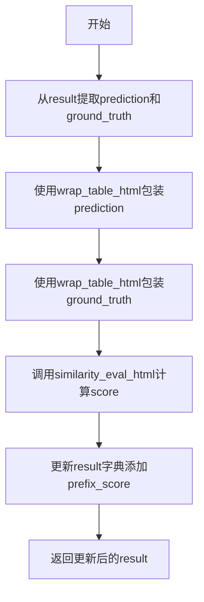
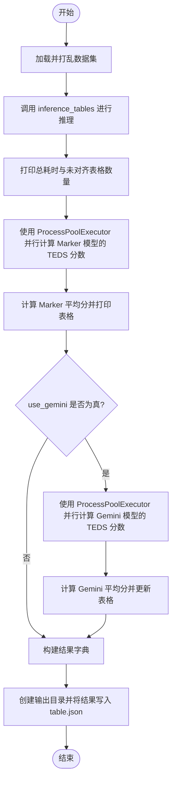

# `marker\benchmarks\table\table.py` 详细设计文档

这是一个基于命令行的基准测试工具，用于评估表格识别模型（如Marker和Gemini）在Fintabnet数据集上的HTML转换效果，通过计算结构化编辑距离（TEDS）来量化预测结果与真实值的相似度。

## 整体流程

```mermaid
graph TD
    A[Start: main] --> B[加载并打乱数据集]
    B --> C{use_gemini?}
    C -- Yes --> D[调用 inference_tables (含Gemini推理)]
    C -- No --> E[调用 inference_tables (仅Marker推理)]
    D --> F[多进程计算 Marker 分数]
    E --> F
    F --> G{use_gemini?}
    G -- Yes --> H[多进程计算 Gemini 分数]
    G -- No --> I[计算平均分数并打印表格]
    H --> I
    I --> J[保存结果 JSON 到文件]
    J --> K[End]
```

## 类结构

```
benchmark_table (脚本入口)
├── update_teds_score (评分函数)
└── main (主控制流)
    └── 外部依赖: inference_tables (推理模块)
    └── 外部依赖: scoring (评分模块)
```

## 全局变量及字段


### `result_path`
    
结果输出路径

类型：`str`
    


### `dataset`
    
数据集名称

类型：`str`
    


### `max_rows`
    
最大处理行数

类型：`int`
    


### `max_workers`
    
最大工作进程数

类型：`int`
    


### `use_llm`
    
是否使用LLM改进识别

类型：`bool`
    


### `table_rec_batch_size`
    
表格识别批次大小

类型：`int | None`
    


### `use_gemini`
    
是否评估Gemini模型

类型：`bool`
    


### `start`
    
记录开始时间

类型：`float`
    


### `results`
    
推理结果列表

类型：`list`
    


### `total_unaligned`
    
未对齐的表格数量

类型：`int`
    


### `marker_results`
    
Marker模型的评分结果

类型：`list`
    


### `avg_score`
    
平均分数

类型：`float`
    


### `gemini_results`
    
Gemini模型的评分结果

类型：`list | None`
    


    

## 全局函数及方法


### `update_teds_score`

该函数用于计算表格识别的 TEDS（Tree Edit Distance-based Similarity）评分，通过比较预测表格和真实表格的 HTML 表示来评估表格识别质量。

#### 参数

- `result`：`dict`，包含预测表格和真实表格的字典，必须包含 `{prefix}_table` 和 `gt_table` 键
- `prefix`：`str`，可选，默认值为 `"marker"`，指定要处理的表格类型前缀（如 `"marker"` 或 `"gemini"`）

#### 返回值

- `dict`，更新后的结果字典，包含计算出的 `{prefix}_score` 分数

#### 流程图



#### 带注释源码

```python
def update_teds_score(result, prefix: str = "marker"):
    """
    计算表格识别的 TEDS 评分
    
    参数:
        result: 包含预测表格和真实表格的字典
        prefix: 表格类型前缀，用于构建键名，默认为 "marker"
    
    返回:
        更新后的结果字典，包含计算出的分数
    """
    # 从结果字典中提取预测表格和真实表格
    # 根据 prefix 参数构建键名，例如 "marker_table" 或 "gemini_table"
    prediction, ground_truth = result[f'{prefix}_table'], result['gt_table']
    
    # 将表格数据包装为 HTML 格式，以便进行相似度评估
    prediction, ground_truth = wrap_table_html(prediction), wrap_table_html(ground_truth)
    
    # 计算预测 HTML 与真实 HTML 之间的相似度评分（TEDS）
    score = similarity_eval_html(prediction, ground_truth)
    
    # 将计算出的分数更新到结果字典中，键名为 "{prefix}_score"
    result.update({f'{prefix}_score': score})
    
    # 返回包含分数的结果字典
    return result
```


### `main`

这是一个基于 Click 框架的命令行基准测试工具，用于评估表格识别模型的性能（Marker 和 Gemini）。它负责加载数据集、执行表格转 HTML 的推理、并行计算预测结果与真实结果之间的 TEDS 分数，并最终将统计数据和详细结果保存为 JSON 文件。

参数：

- `result_path`：`str`，输出路径，用于存储生成的 JSON 结果文件。
- `dataset`：`str`，要加载的数据集名称（默认为 "datalab-to/fintabnet_bench_marker"）。
- `max_rows`：`int`，要处理的最大样本数量（默认为 None，表示处理全部）。
- `max_workers`：`int`，用于并行计算分数的最大工作进程数（默认为 16）。
- `use_llm`：`bool`，是否在表格识别过程中使用 LLM 来优化结果（作为标志位传递）。
- `table_rec_batch_size`：`int | None`，表格识别的批处理大小（默认为 None）。
- `use_gemini`：`bool`，是否额外运行 Gemini 模型进行评估并计算分数（默认为 False）。

返回值：`None`，该函数主要执行 I/O 操作（打印和文件写入），不返回任何数据对象。

#### 流程图



#### 带注释源码

```python
import os
# 设置环境变量以解决 Transformers 在 MPS 设备上的兼容性问题
os.environ["PYTORCH_ENABLE_MPS_FALLBACK"] = "1"

from pathlib import Path
from itertools import repeat
from typing import List

import time
import datasets
from tqdm import tqdm
import click
from tabulate import tabulate
import json
from concurrent.futures import ProcessPoolExecutor

from marker.settings import settings
# 假设 inference_tables 是核心推理模块
from benchmarks.table.inference import inference_tables

from scoring import wrap_table_html, similarity_eval_html


def update_teds_score(result, prefix: str = "marker"):
    """
    用于并行计算 TEDS 分数的辅助函数。
    它从结果字典中提取预测和真实 HTML，封装后计算相似度并更新结果。
    """
    prediction, ground_truth = result[f'{prefix}_table'], result['gt_table']
    prediction, ground_truth = wrap_table_html(prediction), wrap_table_html(ground_truth)
    score = similarity_eval_html(prediction, ground_truth)
    result.update({f'{prefix}_score': score})
    return result


@click.command(help="Benchmark Table to HTML Conversion")
# 定义命令行选项和参数
@click.option("--result_path", type=str, default=os.path.join(settings.OUTPUT_DIR, "benchmark", "table"), help="Output path for results.")
@click.option("--dataset", type=str, default="datalab-to/fintabnet_bench_marker", help="Dataset to use")
@click.option("--max_rows", type=int, default=None, help="Maximum number of PDFs to process")
@click.option("--max_workers", type=int, default=16, help="Maximum number of workers to use")
@click.option("--use_llm", is_flag=True, help="Use LLM for improving table recognition.")
@click.option("--table_rec_batch_size", type=int, default=None, help="Batch size for table recognition.")
@click.option("--use_gemini", is_flag=True, help="Evaluate Gemini for table recognition.")
def main(
        result_path: str,
        dataset: str,
        max_rows: int,
        max_workers: int,
        use_llm: bool,
        table_rec_batch_size: int | None,
        use_gemini: bool = False
):
    """
    主函数：执行表格识别基准测试的完整流程。
    """
    start = time.time()

    # 1. 加载数据集并打乱顺序
    dataset = datasets.load_dataset(dataset, split='train')
    dataset = dataset.shuffle(seed=0)

    # 2. 调用推理模块获取识别结果
    results, total_unaligned = inference_tables(dataset, use_llm, table_rec_batch_size, max_rows, use_gemini)

    print(f"Total time: {time.time() - start}.")
    print(f"Could not align {total_unaligned} tables from fintabnet.")

    # 3. 使用多进程并行计算 Marker 模型的分数
    with ProcessPoolExecutor(max_workers=max_workers) as executor:
        marker_results = list(
            tqdm(
                executor.map(update_teds_score, results), desc='Computing alignment scores', total=len(results)
            )
        )

    # 4. 统计 Marker 平均分
    avg_score = sum([r["marker_score"] for r in marker_results]) / len(marker_results)
    headers = ["Avg score", "Total tables"]
    data = [f"{avg_score:.3f}", len(marker_results)]
    
    gemini_results = None
    # 5. 如果启用 Gemini，则并行计算 Gemini 分数
    if use_gemini:
        with ProcessPoolExecutor(max_workers=max_workers) as executor:
            gemini_results = list(
                tqdm(
                    executor.map(update_teds_score, results, repeat("gemini")), desc='Computing Gemini scores',
                    total=len(results)
                )
            )
        avg_gemini_score = sum([r["gemini_score"] for r in gemini_results]) / len(gemini_results)
        headers.append("Avg Gemini score")
        data.append(f"{avg_gemini_score:.3f}")

    # 6. 打印格式化的结果表格
    table = tabulate([data], headers=headers, tablefmt="github")
    print(table)
    print("Avg score computed by comparing marker predicted HTML with original HTML")

    # 7. 准备输出数据并写入 JSON 文件
    results = {
        "marker": marker_results,
        "gemini": gemini_results
    }

    out_path = Path(result_path)
    out_path.mkdir(parents=True, exist_ok=True)
    with open(out_path / "table.json", "w+") as f:
        json.dump(results, f, indent=2)

    print(f"Results saved to {out_path}.")

if __name__ == '__main__':
    main()
```

## 关键组件


### 数据加载与 shuffling

通过 `datasets.load_dataset` 加载指定数据集，并使用 `dataset.shuffle(seed=0)` 对数据进行随机打乱，确保数据顺序的随机性和公平性。

### 表格推理引擎

调用 `inference_tables` 函数进行表格到HTML的转换推理，支持LLM增强、Gemini评估以及自定义批处理大小，返回预测结果和未对齐表格数量。

### TEDS 分数计算

`update_teds_score` 函数将预测和真实表格HTML包装后，使用 `similarity_eval_html` 计算树编辑距离相似度，返回包含分数的结果字典。

### 并行分数评估

使用 `ProcessPoolExecutor` 并行计算所有表格的TEDS分数，通过 `tqdm` 显示进度条，显著提升大规模评估的效率。

### 多模型评估支持

支持同时评估 Marker 和 Gemini 两个模型的表格转换效果，分别计算平均分数并通过 `tabulate` 格式化输出对比结果。

### 结果持久化

将评估结果以JSON格式保存到指定目录，包含每个表格的预测值、真实值和分数，便于后续分析和复现。

### 命令行接口

使用 `click` 库提供丰富的命令行选项，包括结果路径、数据集选择、并行工作线程数、LLM开关等参数配置。


## 问题及建议


### 已知问题

-   **环境变量设置位置不当**：`os.environ` 在文件顶部设置，这种全局副作用应在应用入口点或配置初始化模块中处理，而非模块导入时
-   **魔法数字/字符串**：多处硬编码值如 `seed=0`、`"marker"`, `"gemini"`、`"gt_table"` 等散落代码中，缺乏常量定义
-   **缺少异常处理**：文件 I/O 操作（`open`/`json.dump`）、数据集加载（`load_dataset`）以及 `inference_tables` 调用均无 try-except 保护
-   **重复代码模式**：两段 ProcessPoolExecutor 并行计算逻辑（marker 和 gemini）高度相似，可抽象为通用函数
-   **函数职责过载**：`main()` 函数承担了参数解析、数据加载、推理、评分计算、结果保存等过多职责，缺乏单一职责原则
-   **可变参数副作用**：`update_teds_score` 直接修改传入的 `result` 字典并返回，修改了调用者的数据结构
-   **类型标注不完整**：部分函数（如 `update_teds_score`）缺少返回类型注解
-   **进度条使用不当**：`executor.map` 是同步阻塞的，`tqdm` 无法真实反映并行任务的实际进度，应使用 `tqdm.contrib.concurrent.process_map`
-   **未使用的导入**：`Path` 已导入但未使用；`List` 从 typing 导入但 Python 3.9+ 可直接使用内置类型
-   **日志记录缺失**：仅使用 `print` 输出，无结构化日志，不利于生产环境调试和问题追踪

### 优化建议

-   将环境变量配置抽取到独立的配置模块或应用启动脚本中
-   定义常量类或配置文件，集中管理魔法值和字符串字面量
-   为所有外部调用添加异常处理和重试机制
-   提取并行计算逻辑为通用函数 `compute_scores(results, prefix, max_workers)`
-   拆分 `main()` 函数：创建 `load_dataset()`、`run_inference()`、`compute_scores()`、`save_results()` 等独立函数
-   避免修改输入参数，返回新的结果字典或使用 dataclass/命名元组
-   补充完整的类型注解（参数和返回值）
-   使用 `tqdm.contrib.concurrent.process_map` 或配置 `chunksize` 参数优化并行进度显示
-   清理未使用的导入，考虑使用 `__all__` 显式导出
-   引入标准日志模块（`logging`）替代 print，设置不同级别并添加上下文信息

## 其它


### 设计目标与约束

设计目标是提供一个标准化的基准测试框架，用于评估不同表格识别模型（marker、gemini）的性能，通过TEDS（Tree Edit Distance-based Similarity）分数衡量预测HTML与真实HTML的相似度。约束条件包括：数据集来源限制为datalab-to/fintabnet_bench_marker，最大工作线程数默认为16，且需要支持MPS设备回退。

### 错误处理与异常设计

代码中主要依赖datasets库加载数据集，若数据集加载失败会抛出异常。inference_tables函数返回结果和未对齐表格数量，若推理过程中出现异常应向上传递。ProcessPoolExecutor用于并行计算分数，若worker进程失败会导致主进程阻塞或崩溃。当前缺少对推理失败、分数计算异常、文件写入失败等情况的详细错误处理和重试机制。

### 数据流与状态机

数据流为：加载数据集 -> 打乱数据 -> 表格推理(inference_tables) -> 并行计算TEDS分数(update_teds_score) -> 聚合分数 -> 格式化输出 -> JSON持久化。状态机包含：初始化状态、推理状态、评分状态、完成状态。若启用gemini评估，流程会重复评分步骤。

### 外部依赖与接口契约

主要依赖包括：datasets（数据集加载）、tqdm（进度条）、click（命令行参数）、tabulate（表格格式化）、json（结果序列化）、concurrent.futures（并行计算）、marker模块（表格推理）、scoring模块（分数计算）。其中inference_tables函数接受dataset, use_llm, table_rec_batch_size, max_rows, use_gemini参数，返回results列表和total_unaligned整数。wrap_table_html和similarity_eval_html来自scoring模块，用于HTML封装和相似度评估。

### 性能优化考虑

当前使用ProcessPoolExecutor进行并行评分，但推理过程(inference_tables)可能为性能瓶颈。max_workers默认为16，可根据CPU核心数调整。dataset.shuffle会加载全部数据到内存，对大规模数据集可能有内存压力。TEDS计算为CPU密集型任务，当前已通过多进程并行化，但未实现批处理优化或缓存机制。

### 配置管理

配置通过命令行参数传递：result_path（输出路径）、dataset（数据集名称）、max_rows（最大处理行数）、max_workers（工作线程数）、use_llm（是否使用LLM）、table_rec_batch_size（批大小）、use_gemini（是否评估gemini）。settings来自marker.settings模块，提供OUTPUT_DIR等全局配置。缺少配置文件支持，所有参数需在运行时指定。

### 版本兼容性与平台特定

代码设置PYTORCH_ENABLE_MPS_FALLBACK=1环境变量，兼容Apple Silicon MPS设备。当前仅支持Linux/macOS环境（使用ProcessPoolExecutor），Windows平台需调整多进程实现。Python版本需支持type hint中的int | None语法（Python 3.10+）。

### 安全性考虑

代码直接执行JSON文件写入操作，未对输出路径进行严格校验，可能存在路径遍历风险。dataset参数直接传递给datasets.load_dataset，需确保数据源可信。ProcessPoolExecutor在Windows上需if __name__ == '__main__'保护（已实现）。

    