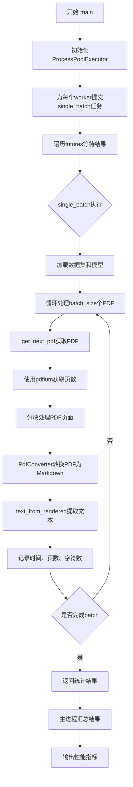
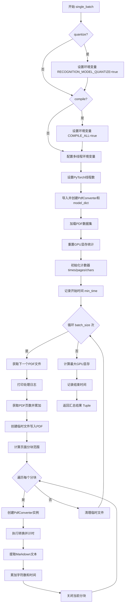
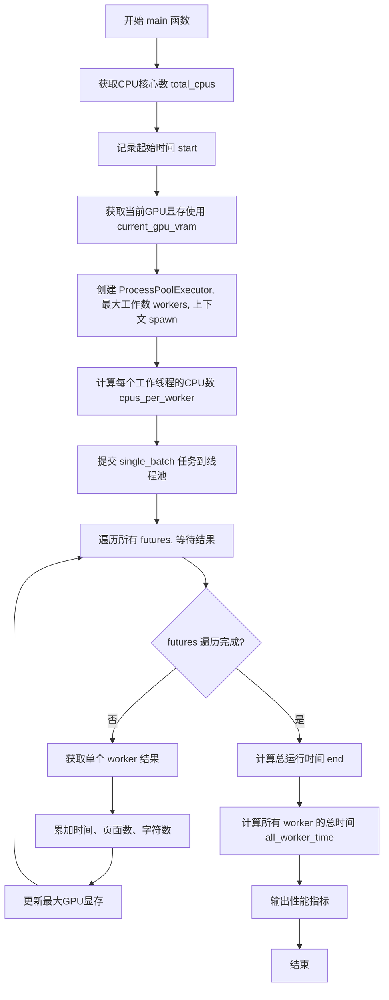

# `marker\benchmarks\throughput\main.py` 详细设计文档

这是一个PDF转Markdown转换性能的基准测试工具，通过多进程并行处理PDF文件，测量转换吞吐量、GPU显存占用、每页耗时等关键指标，用于评估marker库的PDF转换效率。

## 整体流程



## 类结构

```
该文件为脚本型代码，无类定义
所有逻辑由函数实现
主要依赖marker库的PdfConverter和create_model_dict
```

## 全局变量及字段


### `total_cpus`
    
系统CPU核心数

类型：`int`
    


### `start`
    
基准测试开始时间

类型：`float`
    


### `current_gpu_vram`
    
初始GPU显存占用

类型：`float`
    


### `cpus_per_worker`
    
每个worker分配的CPU核心数

类型：`int`
    


### `all_times`
    
所有worker的执行时间列表

类型：`list`
    


### `min_time`
    
最早开始时间

类型：`float`
    


### `max_time`
    
最晚结束时间

类型：`float`
    


### `vrams`
    
各worker的GPU显存增量列表

类型：`list`
    


### `page_count`
    
总处理的页面数

类型：`int`
    


### `char_count`
    
总生成的字符数

类型：`int`
    


### `times`
    
单个worker内每页转换耗时列表

类型：`list`
    


### `i`
    
数据集索引

类型：`int`
    


### `pages`
    
当前PDF页数

类型：`int`
    


### `chars`
    
累计字符数

类型：`int`
    


### `min_time`
    
单worker最早开始时间

类型：`float`
    


### `max_gpu_vram`
    
单worker最大GPU显存

类型：`float`
    


    

## 全局函数及方法


### `get_next_pdf`

该函数用于从数据集中循环遍历，查找满足条件（PDF内容非空且文件名以".pdf"结尾）的有效PDF文件，并返回PDF二进制内容、文件名以及下一个待检索的索引位置。若遍历至数据集末尾则循环回绕至开头，实现无限迭代器效果。

参数：

-  `ds`：`datasets.Dataset`，输入的数据集对象，包含多个样本，每个样本需包含"pdf"和"filename"字段
-  `i`：`int`，起始检索索引，从该位置开始向后遍历查找有效PDF

返回值：`Tuple[bytes, str, int]`，包含三个元素的元组——第一个为PDF文件的二进制内容（bytes），第二个为文件名（str），第三个为下一次调用时应传入的索引值（int）

#### 流程图

```mermaid
flowchart TD
    A[开始 get_next_pdf] --> B[设置 i 作为当前索引]
    B --> C[从数据集获取 ds[i] 的 pdf 和 filename]
    C --> D{检查 pdf 是否有内容且 filename 以 .pdf 结尾?}
    D -->|是| E[返回 pdf, filename, i + 1]
    D -->|否| F[i = i + 1]
    F --> G{判断 i >= len(ds)?}
    G -->|是| H[i = 0 循环回绕]
    G -->|否| I[继续下一个索引]
    H --> I
    I --> C
    E --> J[结束并返回结果]
```

#### 带注释源码

```python
def get_next_pdf(ds: datasets.Dataset, i: int):
    """
    从数据集中循环获取有效的PDF文件。
    
    该函数实现了一个无限迭代器逻辑，持续从数据集中筛选出有效的PDF文件。
    有效PDF的定义：pdf字段非空且filename以".pdf"结尾。
    当遍历至数据集末尾时，会自动循环回绕至开头，实现无限检索能力。
    
    Args:
        ds: Hugging Face datasets 库的数据集对象，需包含 'pdf' 和 'filename' 字段
        i: 起始检索索引，从该位置开始向后遍历
    
    Returns:
        Tuple[bytes, str, int]: 
            - pdf: PDF文件的二进制内容
            - filename: PDF文件的名称
            - i + 1: 下一次调用时应使用的索引值
    """
    while True:  # 无限循环，持续检索有效PDF
        pdf = ds[i]["pdf"]          # 获取当前索引位置的PDF二进制数据
        filename = ds[i]["filename"] # 获取当前索引位置的文件名
        
        # 检查PDF数据是否有效：内容非空且文件名以.pdf结尾
        if pdf and filename.endswith(".pdf"):
            # 找到有效PDF，返回内容、文件名以及下一个起始索引
            return pdf, filename, i + 1
        
        # 当前索引处无效，移动到下一个位置
        i += 1
        
        # 如果索引超出数据集范围，循环回绕至开头
        if i >= len(ds):
            i = 0
```


### `single_batch`

该函数是PDF批量转换的核心执行单元，在多进程PDF转Markdown基准测试中承担单worker的推理任务。它负责初始化环境变量、加载模型和数据集、遍历指定数量的PDF文件进行分块转换，并收集性能指标（时间、GPU显存、页数、字符数）最终返回汇总结果。

参数：

- `batch_size`：`int`，要处理的PDF文件数量
- `num_threads`：`int`，CPU线程数，用于配置各种并行处理参数
- `force_ocr`：`bool`，是否对所有页面强制执行OCR识别
- `quantize`：`bool`，是否使用量化模型以减少显存占用
- `compile`：`bool`，是否使用TorchScript编译模型以提升推理速度
- `worker_id`：`int`，当前工作进程的ID，用于日志输出和tqdm控制
- `chunksize`：`int`，每个PDF的页面分块大小，默认为100

返回值：`Tuple[float, float, float, float, int, int]`，返回 (总处理时间, 最早开始时间, 最晚结束时间, 最大GPU显存占用(GB), 总页面数, 总字符数)

#### 流程图



#### 带注释源码

```python
def single_batch(
    batch_size: int,           # 批处理大小：要处理的PDF文件数量
    num_threads: int,           # 线程数：用于配置CPU并行计算
    force_ocr: bool,           # 强制OCR标志：是否忽略文本直接OCR
    quantize: bool,            # 量化标志：是否使用INT8量化模型
    compile: bool,             # 编译标志：是否使用TorchScript编译
    worker_id: int,            # 工作进程ID：标识当前worker序号
    chunksize: int = 100,      # 分块大小：PDF页面分块处理的大小
):
    """
    执行单worker的PDF批量转换任务
    
    该函数在独立进程中运行，负责:
    1. 配置环境变量（量化、编译、线程数）
    2. 加载marker模型和PDF数据集
    3. 遍历指定数量的PDF进行分块转换
    4. 收集性能指标并返回
    """
    
    # 配置量化环境变量
    if quantize:
        os.environ["RECOGNITION_MODEL_QUANTIZE"] = "true"
    
    # 配置编译环境变量
    if compile:
        os.environ["COMPILE_ALL"] = "true"

    # 配置多线程环境变量（控制各种后端线程数）
    for item in [
        "DETECTOR_POSTPROCESSING_CPU_WORKERS",  # 检测器后处理线程数
        "OPENBLAS_NUM_THREADS",                  # OpenBLAS线程数
        "PDFTEXT_CPU_WORKERS",                   # PDF文本提取线程数
        "OMP_NUM_THREADS",                       # OpenMP线程数
    ]:
        os.environ[item] = f"{num_threads}"

    # 设置PyTorch的CPU线程数
    torch.set_num_threads(num_threads)

    # 延迟导入（避免主进程加载这些重型依赖）
    from marker.converters.pdf import PdfConverter
    from marker.models import create_model_dict
    from marker.output import text_from_rendered

    # 加载PDF数据集（HF datasets格式）
    ds = datasets.load_dataset("datalab-to/pdfs", split="train")
    
    # 创建模型字典（包含检测器、识别器等模型）
    model_dict = create_model_dict()
    
    # 重置GPU显存峰值统计
    torch.cuda.reset_peak_memory_stats()

    # 初始化性能统计变量
    times = []           # 记录每次转换的耗时
    i = 0                # 数据集索引
    pages = 0            # 总页面数
    chars = 0            # 总字符数

    # 记录批处理开始时间
    min_time = time.time()
    
    # 遍历处理指定数量的PDF文件
    for _ in range(batch_size):
        # 获取下一个有效的PDF文件
        pdf, fname, i = get_next_pdf(ds, i)
        
        # 打印处理进度日志
        print(f"Inferencing {fname} on worker {worker_id}...")

        # 使用pdfium获取PDF页数（不加载整个文档）
        pdf_doc = pdfium.PdfDocument(pdf)
        page_count = len(pdf_doc)
        pdf_doc.close()
        pages += page_count

        # 创建临时文件用于转换（marker需要文件路径）
        with tempfile.NamedTemporaryFile(suffix=".pdf") as f:
            f.write(pdf)
            f.flush()
            
            # 计算页面分块范围
            page_range_chunks = list(range(0, page_count, chunksize))
            
            # 逐块处理PDF页面
            for chunk_start in page_range_chunks:
                chunk_end = min(chunk_start + chunksize, page_count)
                page_range = list(range(chunk_start, chunk_end))

                # 创建PDF转换器实例
                block_converter = PdfConverter(
                    artifact_dict=model_dict,
                    config={
                        "disable_tqdm": worker_id > 0,  # 仅worker 0显示进度条
                        "page_range": page_range,        # 当前处理的页面范围
                        "force_ocr": force_ocr,          # 强制OCR配置
                    },
                )
                
                # 执行转换并计时
                start = time.time()
                rendered = block_converter(f.name)      # 执行PDF转Markdown
                markdown, _, _ = text_from_rendered(rendered)  # 提取文本
                chars += len(markdown)                  # 累加字符数

                # 记录本次转换耗时
                total = time.time() - start
                times.append(total)

    # 计算最大GPU显存占用（GB）
    max_gpu_vram = torch.cuda.max_memory_reserved() / 1024**3
    
    # 记录批处理结束时间
    max_time = time.time()
    
    # 返回性能指标元组
    return sum(times), min_time, max_time, max_gpu_vram, pages, chars
```

---

#### 关键组件信息

| 组件名称 | 一句话描述 |
|---------|-----------|
| `PdfConverter` | marker库的核心转换器，负责将PDF文件渲染并提取为Markdown文本 |
| `create_model_dict()` | 创建并返回包含检测器、识别器等模型的字典 |
| `text_from_rendered()` | 从渲染结果中提取Markdown文本内容 |
| `pdfium.PdfDocument` | 用于获取PDF元信息（如页数）的轻量级PDF解析库 |
| `datasets.load_dataset()` | Hugging Face datasets库加载PDF数据集 |
| `tempfile.NamedTemporaryFile` | 创建临时PDF文件供marker转换器使用 |

#### 潜在的技术债务或优化空间

1. **重复模型创建**：每个batch都会调用`create_model_dict()`创建新的模型实例，应考虑在worker初始化时创建一次并复用
2. **临时文件I/O**：每个PDF都写入临时文件再读取，可考虑使用内存管道或直接传递bytes给转换器
3. **串行分块处理**：当前逐个分块顺序处理，可考虑批量提交到转换器提升吞吐量
4. **硬编码数据集**：`datasets.load_dataset("datalab-to/pdfs")`固定了数据源，应通过参数注入
5. **环境变量副作用**：直接修改`os.environ`可能影响同一进程中的其他任务，建议使用上下文管理器或局部配置
6. **缺乏错误处理**：PDF解析或转换失败会导致整个worker崩溃，应添加try-except和重试机制
7. **GPU显存未及时释放**：临时对象未显式释放，可能影响后续batch的显存可用性

#### 其它项目

**设计目标与约束**：
- 目标：在多进程环境下高效执行PDF到Markdown的批量转换，并收集准确的性能指标
- 约束：依赖marker库的实现，需保证进程隔离（每个worker独立加载模型）

**错误处理与异常设计**：
- 当前实现无显式异常捕获，PDF解析失败或转换异常会导致进程终止
- 建议：添加异常捕获、错误日志记录和失败skip机制

**数据流与状态机**：
- 数据流：数据集 → PDF bytes → 临时文件 → PdfConverter → Rendered → Markdown
- 状态机：初始化 → 配置环境 → 加载模型 → 循环处理 → 指标收集 → 返回

**外部依赖与接口契约**：
- 依赖：`marker`库（PDF转换）、`torch`（GPU计算）、`datasets`（数据加载）、`pdfium2`（PDF解析）
- 接口：接受7个参数，返回6元素元组，与`ProcessPoolExecutor.submit()`配合使用


### `main`

CLI主函数，调度多进程执行PDF转Markdown基准测试，通过ProcessPoolExecutor创建多个工作进程，每个进程执行single_batch函数进行PDF转换，最后汇总各工作进程的耗时、内存使用、页面数和字符数等性能指标并输出。

参数：

- `workers`：`int`，工作进程数量，默认为1
- `batch_size`：`int`，推理批次大小，默认为1
- `force_ocr`：`bool`，是否强制对所有页面执行OCR，默认为False
- `quantize`：`bool`，是否使用量化模型，默认为False
- `compile`：`bool`，是否使用编译后的模型，默认为False

返回值：`None`，该函数无返回值，仅通过print输出基准测试结果

#### 流程图



#### 带注释源码

```python
@click.command(help="Benchmark PDF to MD conversion throughput.")
@click.option("--workers", default=1, help="Number of workers to use.")
@click.option("--batch_size", default=1, help="Batch size for inference.")
@click.option("--force_ocr", is_flag=True, help="Force OCR on all pages.")
@click.option("--quantize", is_flag=True, help="Use quantized model.")
@click.option("--compile", is_flag=True, help="Use compiled model.")
def main(
    workers: int,          # 工作进程数量
    batch_size: int,       # 推理批次大小
    force_ocr: bool,       # 是否强制OCR
    quantize: bool,        # 是否使用量化模型
    compile: bool,         # 是否使用编译模型
):
    """
    CLI主函数：调度多进程执行PDF转Markdown基准测试
    
    该函数执行以下步骤：
    1. 获取系统CPU核心数
    2. 创建进程池执行器
    3. 为每个worker分配CPU核心数
    4. 提交single_batch任务到进程池
    5. 收集并汇总所有worker的性能指标
    6. 输出基准测试结果
    """
    total_cpus = os.cpu_count()  # 获取系统CPU核心数
    start = time.time()          # 记录基准测试开始时间
    # 获取当前GPU已预留显存（GB）
    current_gpu_vram = torch.cuda.memory_reserved() / 1024**3
    
    # 使用spawn上下文创建进程池（避免fork带来的问题）
    with ProcessPoolExecutor(
        max_workers=workers, mp_context=get_context("spawn")
    ) as executor:
        # 计算每个worker分配的CPU核心数，限制在2-8之间
        cpus_per_worker = min(8, max(2, total_cpus // workers))
        
        # 为每个worker提交single_batch任务
        futures = [
            executor.submit(
                single_batch,
                batch_size,      # 批次大小
                cpus_per_worker, # 每个worker的CPU线程数
                force_ocr,       # 是否强制OCR
                quantize,        # 是否量化
                compile,         # 是否编译
                i,               # worker编号
            )
            for i in range(workers)
        ]
        
        # 初始化结果收集变量
        all_times = []           # 所有worker的耗时列表
        min_time = None          # 最小开始时间
        max_time = time.time()   # 最大结束时间
        vrams = []               # 每个worker的GPU显存增量
        page_count = 0           # 总页面数
        char_count = 0           # 总字符数
        
        # 使用tqdm进度条遍历所有future结果
        for future in tqdm(futures, desc="Running marker workers..."):
            # 获取单个worker返回的结果元组
            times, min_time_worker, max_time_worker, max_vram, pages, chars = (
                future.result()
            )
            # 累加GPU显存增量（当前worker最大显存 - 初始显存）
            vrams.append(max_vram - current_gpu_vram)
            all_times.append(times)      # 累加该worker的总处理时间
            page_count += pages           # 累加处理的页面数
            char_count += chars          # 累加生成的字符数
            
            # 更新最小开始时间
            min_time = (
                min(min_time_worker, min_time)
                if min_time is not None
                else min_time_worker
            )
            # 更新最大结束时间
            max_time = max(max_time, max_time_worker)

    # 计算总运行时间（包含模型加载时间）
    end = time.time() - start
    # 计算所有worker的实际工作时间（不含模型加载）
    all_worker_time = max_time - min_time

    # 输出各项性能指标
    print(f"Average time per worker: {sum(all_times) / len(all_times)}")
    print(f"Max time per worker: {max(all_times)}")
    print(f"End to end time (counting model loading), all processes: {end}")
    print(f"End to end time (no model loading), all processes: {all_worker_time}")
    print(f"Total pages: {page_count}")
    print(f"Total characters: {char_count}")
    print(f"Time per page: {all_worker_time / page_count:.2f}")
    print(f"Characters per second: {char_count / all_worker_time:.2f}")
    print(f"Max GPU VRAM: {max(vrams):.2f} GB")
    print(f"Average GPU VRAM: {sum(vrams) / len(vrams):.2f} GB")
```

## 关键组件


### 张量索引与惰性加载

代码通过`get_next_pdf`函数实现惰性加载：从数据集`ds`中按索引`i`获取PDF文件，只在需要时才读取`pdf`和`filename`字段，且通过循环确保获取到有效的PDF文件（以.pdf结尾）。这避免了一次性加载整个数据集到内存。

### 反量化支持

`single_batch`函数中通过`quantize`参数控制反量化：当`quantize为True`时，设置环境变量`"RECOGNITION_MODEL_QUANTIZE" = "true"`，这会触发模型的反量化操作以支持量化后的模型权重。

### 量化策略

代码提供两种量化策略控制方式：1) 通过`quantize`标志位设置环境变量`RECOGNITION_MODEL_QUANTIZE`；2) 通过`compile`标志位设置`COMPILE_ALL`环境变量。这些环境变量被传递给marker库以控制模型的量化行为。

### 多进程批处理框架

使用`ProcessPoolExecutor`实现多worker并行处理，通过`get_context("spawn")`创建独立进程。每个worker执行`single_batch`函数处理批量PDF转换，实现计算密集型任务的分布式执行。

### PDF渲染与分块处理

`single_batch`中使用`pypdfium2`获取PDF页数，然后按`chunksize`分块处理页面。每个chunk创建独立的`PdfConverter`实例，支持大文档的分页处理避免内存溢出。

### 性能监控与指标收集

代码收集多维度性能指标：GPU显存使用（`torch.cuda.max_memory_reserved()`）、处理时间（`time.time()`）、页面计数、字符计数，并计算每页耗时、字符吞吐量等关键指标。


## 问题及建议


### 已知问题

-   **模型重复加载**：每个worker进程在`single_batch`函数内部调用`create_model_dict()`加载模型，导致模型被重复加载多次，浪费内存和启动时间
-   **数据集重复下载**：每个worker独立调用`datasets.load_dataset("datalab-to/pdfs", split="train")`，导致数据集被重复下载和加载到内存多次
-   **环境变量全局污染**：在`single_batch`函数内部修改`os.environ`环境变量，可能影响同一进程内的其他线程或其他不相关的逻辑
-   **临时文件资源泄露风险**：使用`tempfile.NamedTemporaryFile`但在写入后未显式关闭，可能导致文件句柄未及时释放
-   **PDF文档重复打开**：每个chunk都通过`pdfium.PdfDocument(pdf)`打开一次获取page_count，实际上只需打开一次即可
-   **缺乏错误处理**：整个转换流程没有try-except捕获异常，任何一个PDF处理失败都可能导致整个worker崩溃
-   **进程内模块导入**：在循环内部`from marker.converters.pdf import PdfConverter`等导入语句，违反了Python的最佳实践，应该在模块级别导入
-   **GPU内存统计不准确**：`torch.cuda.max_memory_reserved()`在多进程spawn模式下，每个子进程的GPU内存统计是独立的，汇总时会产生混淆
-   **循环依赖设计**：`get_next_pdf`函数在单次调用时效率较低，每次只返回一个样本，且在数据集末尾会循环回绕

### 优化建议

-   **模型预加载**：在主进程创建模型字典，通过进程池的initializer参数将模型传递给每个worker，避免重复加载
-   **数据集缓存**：在主进程加载数据集并转换为可序列化格式，通过参数传递给worker，或使用`datasets`库的缓存机制
-   **配置对象化**：将环境变量设置封装为配置类或使用配置文件，避免直接修改os.environ
-   **上下文管理器**：使用`with`语句管理临时文件，确保资源正确释放
-   **提前获取页数**：在循环外部获取page_count，避免重复打开PDF文档
-   **异常捕获**：添加try-except块，捕获转换过程中的异常并记录错误，确保单个PDF失败不影响整体流程
-   **模块级导入**：将所有import语句移至文件顶部，提高代码可读性和加载性能
-   **结果聚合优化**：使用共享内存或队列机制收集子进程结果，减少主进程等待时间
-   **数据迭代器优化**：将`get_next_pdf`改为生成器模式或使用`itertools.cycle`提高迭代效率
-   **资源清理**：在worker结束时显式清理GPU缓存和释放模型资源

## 其它


### 设计目标与约束

设计目标：该工具用于基准测试marker库（PDF转Markdown）的性能，测量多进程并行处理下的吞吐量、GPU内存使用、每页处理时间等关键指标，旨在评估和优化PDF转换系统的性能。

设计约束：
- 仅支持Linux环境（因multiprocessing的spawn方法）
- 需要GPU支持（CUDA）
- 输入数据来自HuggingFace的datalab-to/pdfs数据集
- 每个worker进程独立加载模型，内存占用较高

### 错误处理与异常设计

错误处理机制：
- PDF加载失败：get_next_pdf函数通过循环跳过无效PDF，确保处理有效的.pdf文件
- CUDA内存不足：未显式处理，可能导致进程崩溃
- 模型加载失败：依赖marker库内部异常，未做额外捕获
- 文件操作异常：使用tempfile.NamedTemporaryFile，异常时自动清理

异常传播：
- single_batch中的异常会传播到main函数的任务结果中
- 使用tqdm遍历futures时，某个worker失败会导致整体中断

### 数据流与状态机

数据流：
1. CLI参数输入（workers, batch_size, force_ocr, quantize, compile）
2. 主进程创建ProcessPoolExecutor，分配任务到各worker
3. Worker进程加载数据集和模型
4. 循环处理batch_size个PDF：读取→转换→统计
5. 收集各worker的性能数据
6. 主进程汇总输出结果

状态机：
- 主进程状态：初始化→分发任务→收集结果→汇总输出
- Worker状态：加载模型→循环处理PDF→返回结果

### 外部依赖与接口契约

主要依赖：
- torch：GPU计算和内存统计
- pypdfium2：PDF页面计数
- marker.converters.pdf：PDF转Markdown核心转换器
- marker.models：模型字典创建
- marker.output：渲染结果解析
- datasets：HuggingFace数据集加载
- click：CLI框架
- tqdm：进度条显示

接口契约：
- single_batch函数：接收batch_size, num_threads, force_ocr, quantize, compile, worker_id参数，返回(times, min_time, max_time, max_gpu_vram, pages, chars)
- main函数：CLI入口，返回None，通过click输出结果

### 性能优化建议

潜在优化空间：
1. 模型共享：当前每个worker独立加载模型，可考虑使用共享内存或模型服务器
2. 批处理：当前逐个PDF处理，可增加批量PDF处理能力
3. GPU调度：多worker共享单一GPU时，可实现GPU资源动态分配
4. 数据预取：可预先下载数据集到本地，减少IO等待
5. 中间结果缓存：避免重复转换相同PDF

### 安全性考虑

安全措施：
- tempfile.NamedTemporaryFile使用后自动清理
- 环境变量设置在子进程内，不影响主进程
- 无用户输入的文件路径操作

潜在风险：
- 无输入验证，force_ocr等参数可能被滥用
- 数据集来源可信，但未验证PDF内容安全性

### 配置管理

配置方式：
- 环境变量：RECOGNITION_MODEL_QUANTIZE, COMPILE_ALL, DETECTOR_POSTPROCESSING_CPU_WORKERS, OPENBLAS_NUM_THREADS, PDFTEXT_CPU_WORKERS, OMP_NUM_THREADS
- CLI参数：--workers, --batch_size, --force_ocr, --quantize, --compile
- 代码内硬编码：chunksize=100, cpus_per_worker计算逻辑

### 日志与监控

日志输出：
- 控制台打印：正在处理的PDF文件名和worker ID
- tqdm进度条：显示worker任务完成进度
- 最终统计输出：平均时间、最大时间、端到端时间、总页数、字符数、每页时间、字符每秒、GPU显存使用

监控指标：
- GPU显存：torch.cuda.max_memory_reserved()和memory_reserved()
- 处理时间：time.time()差值计算
- 吞吐量：字符数/处理时间

### 资源清理

资源管理：
- PdfDocument使用后调用close()释放
- tempfile.NamedTemporaryFile在with块结束时自动删除
- torch.cuda.reset_peak_memory_stats()重置峰值统计
- ProcessPoolExecutor使用上下文管理器确保进程池正确关闭

### 可扩展性设计

扩展能力：
- 支持增加新的性能指标收集
- 可适配不同的数据集来源
- 支持添加新的模型量化或编译选项
- 预留了worker_id参数便于分布式扩展

    