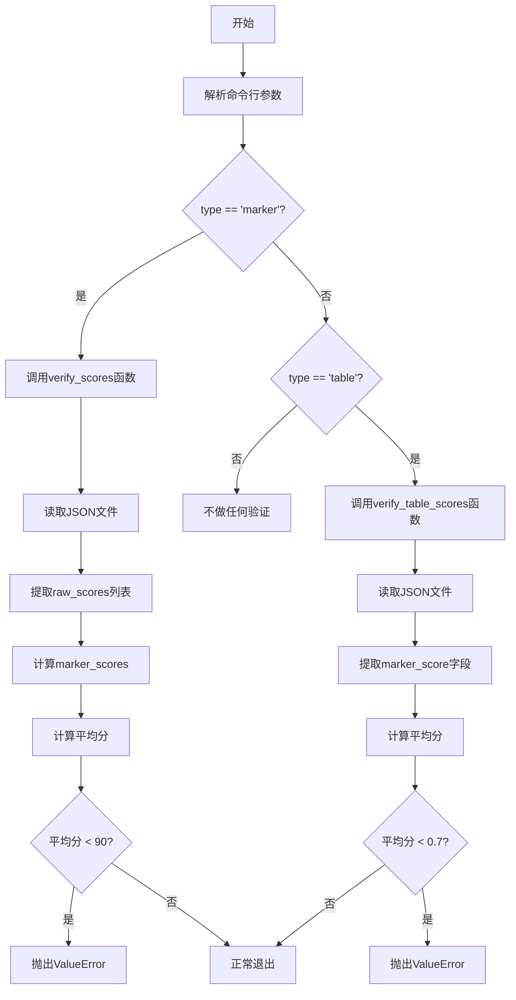
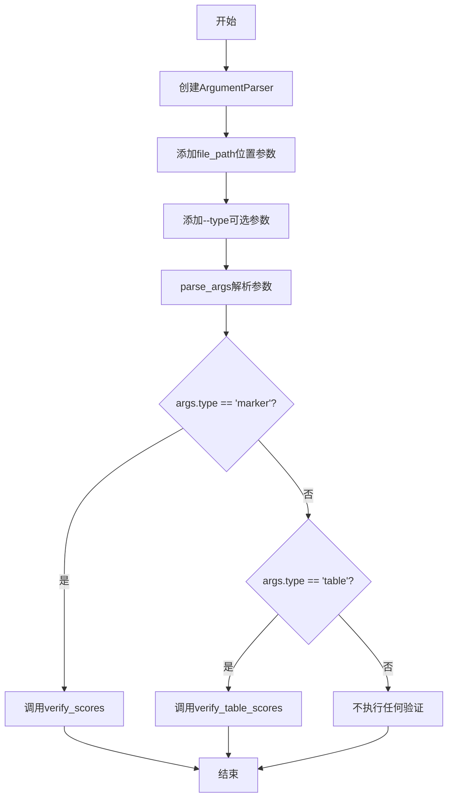

# `marker\benchmarks\verify_scores.py` 详细设计文档

一个命令行工具脚本，用于验证JSON格式的基准测试分数是否达到预设阈值，支持两种验证模式：marker模式验证分数≥90，table模式验证平均分≥0.7，不达标时抛出ValueError异常。

## 整体流程



## 类结构

```
无类结构 (纯函数式脚本)
└── 全局函数集合
    ├── verify_scores()
    ├── verify_table_scores()
    └── __main__入口
```

## 全局变量及字段


### `data`
    
JSON文件解析后的数据对象

类型：`dict`
    


### `raw_scores`
    
从data['scores']提取的原始分数列表

类型：`list`
    


### `marker_scores`
    
marker评分中的heuristic分数列表

类型：`list`
    


### `marker_score`
    
marker分数的平均值

类型：`float`
    


### `args`
    
解析后的命令行参数对象

类型：`Namespace`
    


### `parser`
    
命令行参数解析器对象

类型：`ArgumentParser`
    


### `file`
    
打开的JSON文件对象

类型：`TextIOWrapper`
    


### `avg`
    
table模式的平均分数

类型：`float`
    


    

## 全局函数及方法


### `verify_scores`

验证Marker类型文件的分数是否达到最低要求（平均分≥90），若不达标则抛出异常。

参数：

- `file_path`：`str`，待验证的JSON文件路径

返回值：`None`，该函数仅在验证通过时正常返回，否则抛出`ValueError`异常

#### 流程图

```mermaid
flowchart TD
    A[开始] --> B[打开JSON文件]
    B --> C[加载JSON数据]
    C --> D[提取所有原始分数: data['scores']]
    D --> E[遍历提取marker分数: r['marker']['heuristic']['score']]
    E --> F[计算平均分]
    F --> G{平均分 ≥ 90?}
    G -->|是| H[正常返回]
    G -->|否| I[抛出ValueError异常]
    I --> J[结束]
```

#### 带注释源码

```
def verify_scores(file_path):
    """
    验证marker类型文件的分数是否≥90
    
    参数:
        file_path: JSON文件路径
        
    异常:
        ValueError: 当平均分低于90时抛出
    """
    # 打开并读取JSON文件
    with open(file_path, 'r') as file:
        data = json.load(file)

    # 提取所有原始分数（从data["scores"]字典中获取所有值）
    raw_scores = [data["scores"][k] for k in data["scores"]]
    
    # 从每个原始分数中提取marker.heuristic.score
    marker_scores = [r["marker"]["heuristic"]["score"] for r in raw_scores]
    
    # 计算marker分数的平均值
    marker_score = sum(marker_scores) / len(marker_scores)
    
    # 验证平均分是否达到90分阈值
    if marker_score < 90:
        raise ValueError("Marker score below 90")
```


### `verify_table_scores`

该函数用于验证table类型文件的分数是否满足最低要求（平均分需≥0.7）。它读取指定的JSON文件，解析其中的分数数据，计算平均值，并在不符合阈值时抛出异常以表示验证失败。

参数：
-  `file_path`：`str`，需要验证的JSON文件路径。

返回值：`None`，该函数不返回任何值；验证失败时通过抛出`ValueError`异常来指示错误。

#### 流程图

```mermaid
flowchart TD
    A[开始] --> B[打开文件: file_path]
    B --> C[读取并解析 JSON 数据]
    C --> D[提取 data[\"marker\"] 列表中的 marker_score]
    D --> E[计算平均分 avg]
    E --> F{avg < 0.7?}
    F -- 是 --> G[抛出 ValueError 异常: 分数低于阈值]
    F -- 否 --> H[结束]
    G --> H
```

#### 带注释源码

```python
def verify_table_scores(file_path):
    """
    验证 table 类型文件的分数是否达到标准。
    
    参数:
        file_path (str): 待验证的 JSON 文件路径。
    """
    # 打开并读取文件
    with open(file_path, 'r') as file:
        data = json.load(file)

    # 计算平均分数: 
    # 提取 data["marker"] 列表中每个元素的 "marker_score" 字段并求和，
    # 然后除以 data 的长度（此处注意：若 data 为字典，len(data) 仅为键值对数量，结果可能不符合预期）
    avg = sum([r["marker_score"] for r in data["marker"]]) / len(data)
    
    # 阈值检查
    if avg < 0.7:
        raise ValueError("Average score is below the required threshold of 0.7")
```


### `__main__`

命令行入口函数，解析命令行参数并根据`type`参数分发到对应的验证函数（`verify_scores`或`verify_table_scores`）进行分数验证。

参数：

- `file_path`：`str`，位置参数，需要验证的JSON文件路径
- `type`：`str`，可选参数，指定验证文件类型，可选值为"marker"或"table"，默认为"marker"

返回值：`None`，执行验证逻辑后程序正常退出，或在验证失败时抛出`ValueError`异常

#### 流程图



#### 带注释源码

```python
if __name__ == "__main__":
    # 创建命令行参数解析器
    parser = argparse.ArgumentParser(description="Verify benchmark scores")
    
    # 添加位置参数：需要验证的JSON文件路径
    parser.add_argument("file_path", type=str, help="Path to the json file")
    
    # 添加可选参数：文件类型，默认值为"marker"
    parser.add_argument("--type", type=str, help="Type of file to verify", default="marker")
    
    # 解析命令行参数
    args = parser.parse_args()
    
    # 根据type参数值分发到对应的验证函数
    if args.type == "marker":
        # 调用verify_scores函数验证marker类型文件
        verify_scores(args.file_path)
    elif args.type == "table":
        # 调用verify_table_scores函数验证table类型文件
        verify_table_scores(args.file_path)
    # 注意：如果type既不是"marker"也不是"table"，程序不会执行任何验证操作
```


## 关键组件


### JSON配置文件读取

从JSON文件读取基准测试数据，支持两种格式（marker和table）

### 标记分数验证器

验证marker类型JSON文件中的标记分数，计算平均分并确保不低于90分

### 表格分数验证器

验证table类型JSON文件中的表格分数，计算平均分并确保不低于0.7阈值

### 命令行参数解析器

使用argparse解析命令行参数，包括文件路径和验证类型选择

### 分数阈值检查

内置阈值检查逻辑，marker类型要求90分以上，table类型要求0.7以上

### 异常抛出机制

当分数不满足要求时抛出ValueError异常，包含具体的阈值信息和实际分数


## 问题及建议


### 已知问题

-   **除零错误风险**：`verify_table_scores`函数中`len(data)`应改为`len(data["marker"])`，否则当JSON数据为单对象而非数组时会导致除零错误；同样当`data["marker"]`为空列表时也会崩溃
-   **异常处理缺失**：未捕获文件不存在、JSON解析错误、键不存在等异常情况，程序会直接崩溃
-   **重复代码**：两个验证函数都包含相同的文件打开和JSON加载逻辑
-   **参数校验不足**：`args.type`未验证是否为有效值（marker或table），无效值时程序静默退出
-   **硬编码阈值**：阈值(90和0.7)直接写在代码中，缺乏灵活性
-   **无日志输出**：缺少日志记录，调试和排查问题困难
-   **类型提示缺失**：函数参数和返回值缺少类型注解
-   **verify_scores函数逻辑缺陷**：遍历scores字典时未验证嵌套键是否存在，可能触发KeyError

### 优化建议

-   提取公共的文件读取和JSON解析逻辑到独立函数
-   添加try-except捕获FileNotFoundError、json.JSONDecodeError、KeyError等异常
-   对`args.type`进行校验，无效值时给出明确错误提示
-   将阈值参数化，支持命令行传入或配置文件指定
-   添加日志记录或verbose模式输出验证过程
-   为函数添加类型注解，提升代码可读性和可维护性
-   在访问嵌套字典前使用`.get()`方法或添加存在性检查

## 其它


### 设计目标与约束

设计目标：创建一个轻量级的命令行工具，用于验证基准测试结果文件（JSON格式）中的分数是否符合预设的阈值要求，确保数据质量。

约束条件：
- 输入文件必须为JSON格式
- 仅支持命令行调用，不支持模块导入作为库使用
- 阈值硬编码在代码中，不支持外部配置
- 支持两种文件类型验证：marker和table

### 错误处理与异常设计

异常类型及处理策略：

- FileNotFoundError：文件不存在或路径错误时抛出，程序终止并显示文件未找到错误
- json.JSONDecodeError：JSON格式解析失败时抛出，提示JSON格式错误
- ValueError：分数验证不通过时抛出，提示具体的阈值违规信息
- KeyError：JSON数据结构缺少必要字段时抛出

所有异常均未被捕获，由Python解释器自动输出堆栈信息，便于调试定位问题。

### 数据流与状态机

数据流处理流程：

1. 程序启动，解析命令行参数（file_path, type）
2. 根据type参数值选择验证路径：
   - type="marker" → 执行verify_scores函数
   - type="table" → 执行verify_table_scores函数
3. 打开并读取JSON文件
4. 解析JSON数据，提取分数字段
5. 计算平均值或汇总分数
6. 与阈值比较，满足条件则正常退出，不满足则抛出异常

状态转换：启动 → 参数解析 → 文件读取 → 数据解析 → 分数计算 → 阈值验证 → 结束

### 外部依赖与接口契约

外部依赖：
- Python标准库：json、argparse
- 无第三方依赖包

接口契约：
- 命令行接口：python script.py <file_path> [--type {marker|table}]
- file_path参数：必填，字符串类型，表示JSON文件的绝对或相对路径
- type参数：可选，默认值为"marker"，字符串类型，支持"marker"和"table"两种值

### 性能考虑

性能特点：
- 单线程顺序处理，无并发开销
- 内存占用与JSON文件大小成正比
- 时间复杂度O(n)，n为JSON中的记录数量

优化建议：
- 对于超大型JSON文件，可考虑流式处理或分块读取
- 可添加缓存机制避免重复读取

### 安全性考虑

潜在安全风险：
- 命令行参数未做输入验证，可能存在路径遍历风险
- 未限制可访问的文件路径范围
- JSON文件解析未设置深度限制，可能存在畸形数据攻击

建议措施：
- 对file_path进行路径规范化和安全检查
- 添加文件大小和复杂度限制
- 考虑使用json.loads配合max_depth参数（Python 3.9+）

### 配置管理

当前配置方式：所有阈值配置硬编码在代码中
- marker_score阈值：90
- table平均分阈值：0.7

不足之处：修改阈值需要修改源代码，不便于非技术人员使用

改进建议：
- 引入配置文件（YAML/JSON/INI）
- 支持命令行参数覆盖阈值
- 添加--config参数指定配置文件路径

### 测试策略

建议测试用例：
- 正常路径测试：验证符合阈值的有效文件
- 边界条件测试：分数恰好等于阈值临界值
- 异常路径测试：文件不存在、JSON格式错误、缺少字段
- 类型测试：验证type参数不同值的处理

测试覆盖重点：
- verify_scores函数对不同marker分数的处理
- verify_table_scores函数对不同table分数的处理
- 命令行参数解析的完整性

### 部署和运行环境

运行环境要求：
- Python 3.6+（支持argparse）
- 无需额外运行时依赖

部署方式：
- 直接运行Python脚本
- 可打包为可执行文件（PyInstaller等）
- 适合集成到CI/CD流水线中作为验证步骤

### 使用示例

基本用法：
```bash
# 验证marker类型文件（默认）
python verify.py result.json

# 验证table类型文件
python verify.py table_result.json --type table

# 查看帮助信息
python verify.py --help
```

成功场景示例：
- marker文件包含scores字段，每个score的marker.heuristic.score平均值≥90
- table文件包含marker字段，marker_score平均值≥0.7

失败场景示例：
```bash
$ python verify.py result.json
ValueError: Marker score below 90

$ python verify.py table_result.json --type table
ValueError: Average score is below the required threshold of 0.7
```

### 扩展性和未来改进

可扩展方向：
- 增加更多文件类型支持（如xml、csv格式）
- 支持自定义阈值配置
- 支持批量文件验证
- 支持详细输出模式（-v/--verbose）显示具体分数统计
- 支持阈值违规时的警告级别而非直接失败
- 添加日志记录功能
- 支持配置文件或环境变量配置


    