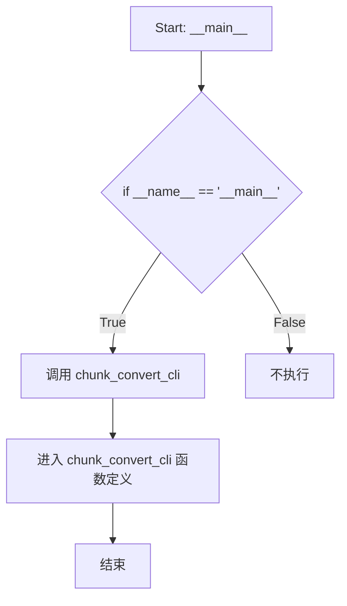

# `marker\chunk_convert.py` 详细设计文档

这是一个Marker项目的入口脚本，通过调用chunk_convert_cli()函数来执行文档分块转换的命令行操作。该脚本是整个Marker工具的启动入口，委托给chunk_convert模块完成具体的转换任务。

## 整体流程

```mermaid
graph TD
    A[程序启动 __main__] --> B[导入 chunk_convert_cli]
    B --> C[调用 chunk_convert_cli()]
    C --> D{chunk_convert_cli 执行分块转换}
    D --> E[返回结果或退出]
```

## 类结构

```
入口文件 (无类结构)
└── 调用外部模块 chunk_convert
```

## 全局变量及字段


    

## 全局函数及方法


根据提供的代码片段，仅包含对 `chunk_convert_cli` 函数的导入和调用，未包含该函数的实际定义。因此，无法提取其参数、返回值、内部逻辑和完整源码。以下是基于上下文的推断信息：


### `chunk_convert_cli`

该函数是 `marker.scripts.chunk_convert` 模块中定义的 CLI 入口点，用于执行文档分块转换任务。

参数：
- 无法从给定代码中提取详细信息（函数定义未提供）。通常 CLI 函数可能接受命令行参数（如 `sys.argv` 或通过 `argparse` 解析的参数）。

返回值：
- 无法从给定代码中提取详细信息。通常 CLI 函数无返回值或返回 `None`。

#### 流程图



#### 带注释源码

```python
# 从 marker.scripts.chunk_convert 模块导入 chunk_convert_cli 函数
from marker.scripts.chunk_convert import chunk_convert_cli

# 主入口点：确保代码作为脚本直接运行时执行
if __name__ == "__main__":
    # 调用 CLI 函数，启动文档分块转换流程
    chunk_convert_cli()
```

**注意**：要获取 `chunk_convert_cli` 的完整详细设计文档（包括参数、返回值、内部逻辑等），需要提供 `marker/scripts/chunk_convert.py` 文件的源代码。


## 关键组件


### chunk_convert_cli 导入

从 marker.scripts.chunk_convert 模块导入 chunk_convert_cli 函数，作为程序的主入口点

### __main__ 入口条件判断

使用 if __name__ == "__main__" 确保代码仅在直接运行时执行，而非被导入时执行

### chunk_convert_cli 函数调用

调用 chunk_convert_cli() 函数启动分块转换的 CLI 流程


## 问题及建议


### 已知问题

-   入口脚本缺少模块级文档字符串（docstring），无法快速了解脚本用途
-   缺少命令行参数解析（如 --help、--version），用户无法获取使用帮助
-   没有错误处理机制，若 `chunk_convert_cli` 导入失败或执行异常，程序将以原始异常堆栈终止，用户体验不佳
-   缺少日志配置或日志记录，无法追踪程序执行状态和调试问题
-   没有版本信息输出能力，不利于部署和运维场景
-   直接硬导入 `chunk_convert_cli`，若模块路径变更需要修改多处代码，缺乏灵活性

### 优化建议

-   添加模块级 docstring，说明脚本功能、用法和依赖环境
-   使用 `argparse` 或 `click` 封装入口，提供统一的命令行参数解析、帮助信息和版本输出
-   添加 `try-except` 块捕获异常，提供友好的错误提示和退出码
-   引入日志模块（如 `logging`），配置合理的日志级别和输出格式，便于问题排查
-   将导入语句放入 try-except，提供模块缺失的明确错误信息
-   考虑将入口逻辑抽象为可复用的函数，支持编程式调用
</think>

## 其它


### 核心功能概述

这是一个命令行程序入口点，用于调用 marker 库中的 chunk_convert_cli 函数，执行文档内容的分块转换任务。

### 整体运行流程

1. 程序启动，检查是否为主程序入口
2. 导入 marker.scripts.chunk_convert 模块中的 chunk_convert_cli 函数
3. 调用 chunk_convert_cli() 函数进入文档分块转换流程
4. 该函数内部通常包含：解析命令行参数、加载配置、读取输入文档、执行分块转换逻辑、输出转换结果

### 类的详细信息

由于当前代码仅为入口脚本，未定义任何类。实际的分块转换逻辑封装在 marker.scripts.chunk_convert 模块的类中。

### 类字段

无

### 类方法

无

### 全局变量

| 名称 | 类型 | 描述 |
|------|------|------|
| __name__ | str | Python 内置变量，表示当前模块的模块名 |

### 全局函数

| 名称 | 参数名称 | 参数类型 | 参数描述 | 返回值类型 | 返回值描述 |
|------|----------|----------|----------|------------|------------|
| chunk_convert_cli | 无 | - | CLI 入口函数，执行文档分块转换的核心逻辑 | None | 无返回值 |

### 关键组件信息

| 名称 | 一句话描述 |
|------|------------|
| chunk_convert_cli | CLI 入口函数，负责文档分块转换的主要业务流程 |

### 潜在的技术债务或优化空间

1. **错误处理不足**：入口代码未包含任何异常捕获机制
2. **缺少日志记录**：未实现日志输出，不利于问题排查
3. **无配置管理**：缺少配置文件或环境变量支持
4. **单点故障风险**：所有逻辑依赖于外部模块，无本地降级方案

### 设计目标与约束

- **设计目标**：提供简单的命令行入口，方便用户执行文档分块转换
- **技术约束**：依赖 marker 库的正确安装和配置

### 错误处理与异常设计

当前代码未实现显式的错误处理。实际运行时，异常将由 chunk_convert_cli 函数内部捕获和处理。建议添加顶层异常捕获以提供更友好的错误提示。

### 数据流与状态机

数据流：命令行参数 → chunk_convert_cli() → 文档读取 → 分块处理 → 结果输出

### 外部依赖与接口契约

- **外部依赖**：marker.scripts.chunk_convert 模块
- **接口契约**：chunk_convert_cli() 函数无参数输入，无返回值输出
- **依赖要求**：marker 库需正确安装且 chunk_convert_cli 函数可用

    