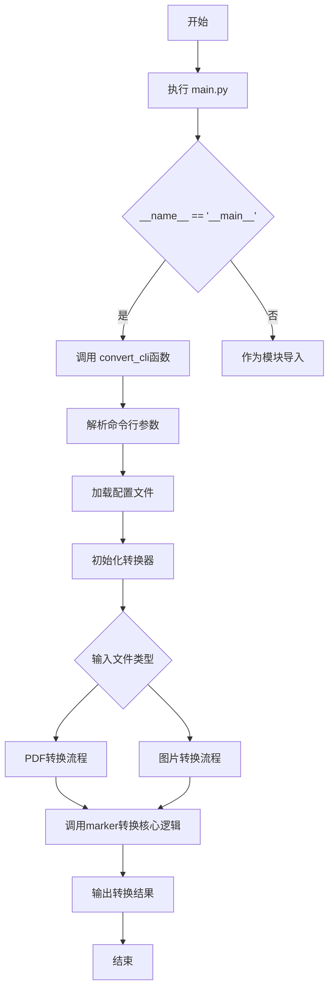
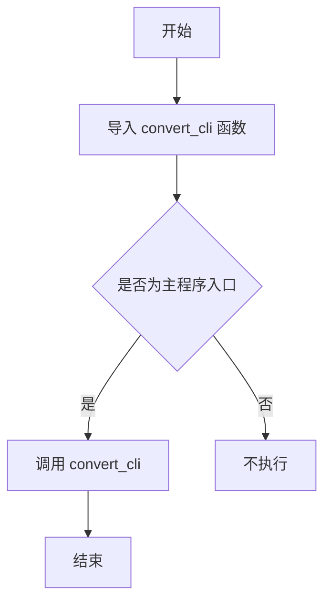

# `marker\convert.py` 详细设计文档

这是一个文档转换工具的入口脚本，通过调用marker.scripts.convert模块中的convert_cli函数来启动文档转换流程。该工具主要用于将PDF文档转换为其他格式（如Markdown、HTML等），是marker转换工具的命令行入口点。

## 整体流程



## 类结构

```
无类定义 (该脚本为纯入口文件)
└── convert_cli (从marker.scripts.convert模块导入的CLI函数)
```

## 全局变量及字段


    

## 全局函数及方法


### `convert_cli`

该函数是 marker 库的转换命令行接口入口点，负责协调文档转换的完整流程，将输入文档转换为指定格式输出。

参数：

- 该信息无法从给定代码片段中获取（函数定义位于外部模块 `marker.scripts.convert` 中）

返回值：

- 该信息无法从给定代码片段中获取（函数定义位于外部模块 `marker.scripts.convert` 中）

#### 流程图



#### 带注释源码

```python
# 从 marker.scripts.convert 模块导入 convert_cli 函数
# 这是一个外部定义的命令行接口转换函数
from marker.scripts.convert import convert_cli

# 程序入口点判断
if __name__ == "__main__":
    # 当脚本作为主程序运行时，调用 convert_cli 函数
    # 该函数通常会解析命令行参数并执行文档转换任务
    convert_cli()
```

#### 重要说明

**信息不完整性声明：**

给定的代码片段**仅包含函数的导入和调用**，未包含 `convert_cli` 函数的实际实现代码。该函数定义在外部模块 `marker.scripts.convert` 中，因此以下信息无法从此代码片段中提取：

1. 函数的具体参数列表
2. 函数的返回值类型和描述
3. 函数内部的详细逻辑流程
4. 完整的带注释源码

若需要完整的函数文档，需要查看 `marker/scripts/convert.py` 源文件。


## 关键组件


### 入口脚本模块

这是 marker 项目的命令行入口点，负责初始化并调用核心转换功能。

### convert_cli 函数

从 marker.scripts.convert 模块导入的命令行接口函数，作为转换流程的主控制器，负责协调整个文档转换过程。

### 文档转换管线

根据模块路径推断，这是 marker 项目的核心转换管线，负责处理文档格式转换、布局分析、内容提取等操作。

### 潜在技术债务与优化空间

由于提供的代码仅为入口脚本，未能展示具体的转换逻辑实现细节，无法完整评估张量索引、惰性加载、反量化支持和量化策略等技术组件的具体实现。建议提供 marker.scripts.convert 模块的完整源码以进行更深入的分析。


## 问题及建议


### 已知问题

-   **错误处理缺失**：直接调用 `convert_cli()` 未进行任何异常捕获，若该函数抛出异常会导致程序以原始堆栈信息终止，用户体验不佳
-   **参数传递不可控**：`convert_cli()` 调用时未传递任何参数，假设该函数支持命令行参数解析，但缺少自定义配置能力
-   **依赖验证缺失**：未检查 `marker` 库是否正确安装，导入失败时错误信息不够友好
-   **日志记录空白**：运行时没有任何日志输出，无法追踪程序执行状态和问题诊断
-   **文档注释缺失**：文件级别无 docstring 说明该脚本的用途和功能
-   **接口耦合度高**：完全依赖 `marker.scripts.convert` 模块的内部实现，若该模块重构或接口变更，当前脚本将失效
-   **配置能力受限**：作为程序入口点，缺乏命令行参数解析（如 `--help`、`--version` 或调试选项）

### 优化建议

-   添加 `try-except` 块捕获异常，并提供友好的错误提示和退出码
-   使用 `argparse` 模块封装命令行参数，支持灵活配置
-   导入时添加 `try-except` 捕获 `ImportError`，给出明确的依赖安装提示
-   集成 `logging` 模块记录程序运行状态和关键节点
-   添加文件级 docstring 说明脚本功能、用法和依赖
-   考虑将导入语句放在函数内部或使用延迟导入，提高启动速度
-   添加 `--version` 参数显示版本信息
-   考虑添加环境变量支持或配置文件加载能力


## 其它


### 1. 一段话描述

该代码是Marker文档转换工具的命令行入口点，通过导入并执行`convert_cli`函数来启动文档到PDF/HTML等格式的转换流程。

### 2. 文件的整体运行流程

该文件作为程序主入口点，当作为脚本直接运行时（`python main.py`），首先执行`if __name__ == "__main__"`条件判断，随后调用`convert_cli()`函数启动转换CLI界面。转换CLI会解析命令行参数，读取输入文档，进行格式转换，并输出结果文件。

### 3. 类的详细信息

本文件不包含任何类定义，仅作为模块导入和函数调用的入口文件。

### 4. 全局变量和全局函数

#### 4.1 全局变量

| 名称 | 类型 | 描述 |
|------|------|------|
| __name__ | str | Python内置变量，表示当前模块的执行上下文 |

#### 4.2 全局函数

| 名称 | 参数名称 | 参数类型 | 参数描述 | 返回值类型 | 返回值描述 |
|------|----------|----------|----------|------------|------------|
| convert_cli | 无 | - | - | None | 执行命令行转换任务，无返回值 |

### 5. 关键组件信息

| 名称 | 一句话描述 |
|------|------------|
| marker.scripts.convert | 文档转换核心模块，提供convert_cli命令行接口 |

### 6. 潜在的技术债务或优化空间

- 缺少命令行参数处理逻辑，依赖导入模块实现
- 错误处理机制未知，CLI层应该有异常捕获
- 缺少日志记录和进度显示
- 配置文件路径硬编码或缺失
- 没有单元测试覆盖这个入口点

### 7. 设计目标与约束

**设计目标**：
- 提供简洁的命令行入口，用户可通过单行命令启动文档转换
- 遵循Python入口脚本最佳实践，使用`if __name__ == "__main__"`保护

**约束**：
- 依赖marker库的正确安装和环境配置
- 必须在安装marker的环境下运行

### 8. 错误处理与异常设计

- 依赖convert_cli内部异常处理
- 可能异常：ModuleNotFoundError（marker未安装）、ImportError（convert模块不存在）
- 建议增加异常捕获和友好错误提示

### 9. 数据流与状态机

**数据流**：
1. 入口脚本 → convert_cli()调用
2. convert_cli解析命令行参数
3. 读取源文档
4. 执行格式转换
5. 输出目标文件

**状态机**：
- 初始化 → 参数解析 → 文档读取 → 转换处理 → 文件输出 → 结束

### 10. 外部依赖与接口契约

**外部依赖**：
- marker.scripts.convert模块（必须）
- Python运行环境（必须）

**接口契约**：
- convert_cli函数必须可调用
- 无参数传入
- 无返回值
- 通过sys.argv接收命令行参数

### 11. 配置信息

配置文件路径、转换参数等均依赖于marker.scripts.convert模块的默认配置或命令行参数。

### 12. 安全性考虑

- 无用户输入验证（依赖convert_cli）
- 无权限检查
- 无敏感数据处理

### 13. 测试建议

- 添加入口点的单元测试，验证函数可正常调用
- 添加集成测试验证完整转换流程


    