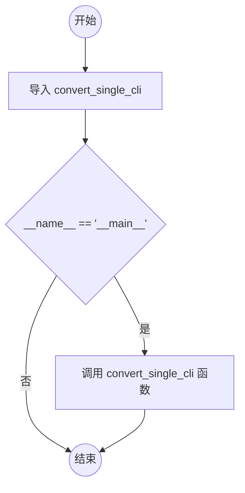

# `marker\convert_single.py` 详细设计文档

这是一个Python脚本的入口文件，它导入了marker.scripts.convert_single模块中的convert_single_cli函数，并在作为主程序运行时调用该函数，用于执行单文件转换任务。

## 整体流程



## 类结构

```

```

## 全局变量及字段


    

## 全局函数及方法


## 关键组件


### 入口模块与CLI调用

这是Marker PDF转换工具的命令行入口点，通过调用convert_single_cli函数启动单个文件的转换流程。

### 核心入口函数 convert_single_cli

这是Marker工具的核心CLI入口函数，负责执行单个PDF文档的转换操作。

### 模块导入机制

通过相对导入获取marker.scripts.convert_single模块中的转换功能。

### 程序执行入口点

标准的Python程序入口检测，确保代码只在直接执行时运行，而不是被导入时执行。


## 问题及建议


### 已知问题

-   **缺乏错误处理**：代码直接调用 `convert_single_cli()` 函数，没有任何 try-except 异常捕获机制，如果该函数抛出异常，用户将看到原始堆栈跟踪，缺乏友好的错误提示
-   **无日志记录**：整个文件没有任何日志输出，问题发生时难以追踪和调试
-   **无命令行参数支持**：代码直接硬编码调用函数，不支持通过命令行传递参数（如输入文件路径、输出路径、配置选项等），灵活性差
-   **无配置管理**：缺乏配置文件或环境变量支持，无法在不修改代码的情况下调整行为
-   **无文档说明**：文件级别缺少 docstring，无法快速了解该入口脚本的用途
-   **缺乏类型提示**：未使用类型注解，不利于静态分析和 IDE 支持
-   **直接依赖导入**：直接导入 `marker.scripts.convert_single` 模块，如果模块不存在会直接抛出 `ModuleNotFoundError`，缺乏优雅的错误提示

### 优化建议

-   **添加错误处理**：使用 try-except 捕获异常，提供友好的错误信息并返回适当的退出码（如 1）
-   **引入日志系统**：使用 Python `logging` 模块记录关键操作和错误信息，便于问题排查
-   **支持命令行参数**：引入 `argparse` 库，支持用户通过命令行传递参数（如输入输出路径、转换选项等），提升灵活性
-   **增加配置支持**：支持通过配置文件（如 JSON/YAML）或环境变量传递配置，配置与代码解耦
-   **添加文档字符串**：在文件开头添加模块级 docstring，说明脚本功能和用法
-   **考虑类型提示**：添加函数参数和返回值的类型注解，提高代码可维护性
-   **模块导入检查**：在导入前检查模块是否存在，或在 except 中捕获 ImportError 提供更友好的错误提示


## 其它


### 设计目标与约束
该模块的设计目标是提供命令行入口，使终端用户能够通过简单的命令将单个PDF文件转换为Markdown格式。设计约束包括：需在Python 3.8+环境中运行，依赖marker库及其模型文件，命令行参数需遵循特定格式，输出文件默认保存至指定目录且覆盖已存在的文件。

### 错误处理与异常设计
convert_single_cli函数应包含完善的异常捕获机制，处理以下异常场景：输入文件不存在或路径无效、文件格式非PDF、转换过程中模型推理失败、磁盘空间不足导致写入失败、系统内存不足等。异常发生时应向用户输出清晰的错误信息，并以非零退出码终止程序。

### 数据流与状态机
程序的状态转换流程如下：初始状态（等待命令行参数）→ 参数解析状态 → 输入验证状态（检查文件存在性和格式） → 模型加载状态 → 转换执行状态 → 输出保存状态 → 结束状态。任意状态发生异常则转入错误状态并输出错误信息。

### 外部依赖与接口契约
该模块依赖marker.scripts.convert_single模块中的convert_single_cli函数，需遵循其接口约定：接收命令行参数列表（sys.argv），返回整数退出码。外部依赖包括marker库、transformers库、torch库、pdf解析库等，这些依赖库的版本兼容性需在项目依赖文件中明确声明。

### 配置管理
配置文件应包含以下可调整项：模型存储路径、输出格式（Markdown/HTML）、转换选项（保留图片、保留表格布局）、GPU/CPU设备选择、批处理大小等。配置可通过命令行参数、环境变量或配置文件三种方式进行覆盖。

### 性能要求
单文件转换应在合理时间内完成，具体性能指标取决于PDF页数、图像数量及硬件配置。建议性能目标为：10页PDF在CPU模式下不超过60秒，在GPU模式下不超过15秒。程序应避免不必要的内存占用，峰值内存使用应控制在2GB以内。

### 安全性考虑
程序需对用户输入的文件路径进行安全校验，防止路径遍历攻击（如../../etc/passwd）。对命令行参数进行长度限制和字符过滤，避免注入攻击。下载模型时需验证文件完整性，防止供应链攻击。

### 可维护性与扩展性
代码结构遵循单一职责原则，入口脚本仅负责调用CLI函数，便于单元测试和模块替换。未来可扩展支持批量转换、输出格式自定义、转换模板等功能，而不影响现有代码结构。

### 测试策略
测试计划应包含：单元测试验证参数解析逻辑、集成测试验证完整转换流程、边界测试验证异常输入的处理、性能测试验证大文件的转换效率。建议使用pytest框架编写自动化测试用例。

### 部署与运维
部署方式为Python包发布，用户通过pip安装后可使用convert命令行工具。运维需关注模型文件的更新、依赖库的安全补丁、转换失败日志的收集与分析。建议提供健康检查接口供监控系统调用。

### 日志与监控
程序应在转换过程中输出关键日志，包括：输入文件信息、模型加载状态、转换进度、输出文件路径、耗时统计。日志级别默认设置为INFO，调试模式下可开启DEBUG级别。关键指标（转换成功率、平均耗时）建议上报至监控系统。

    