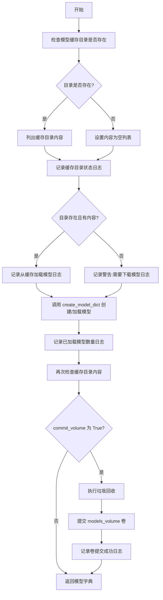
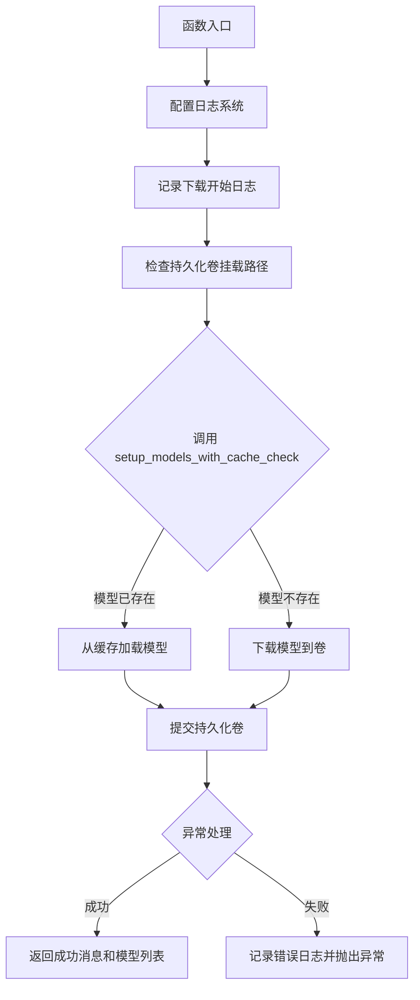
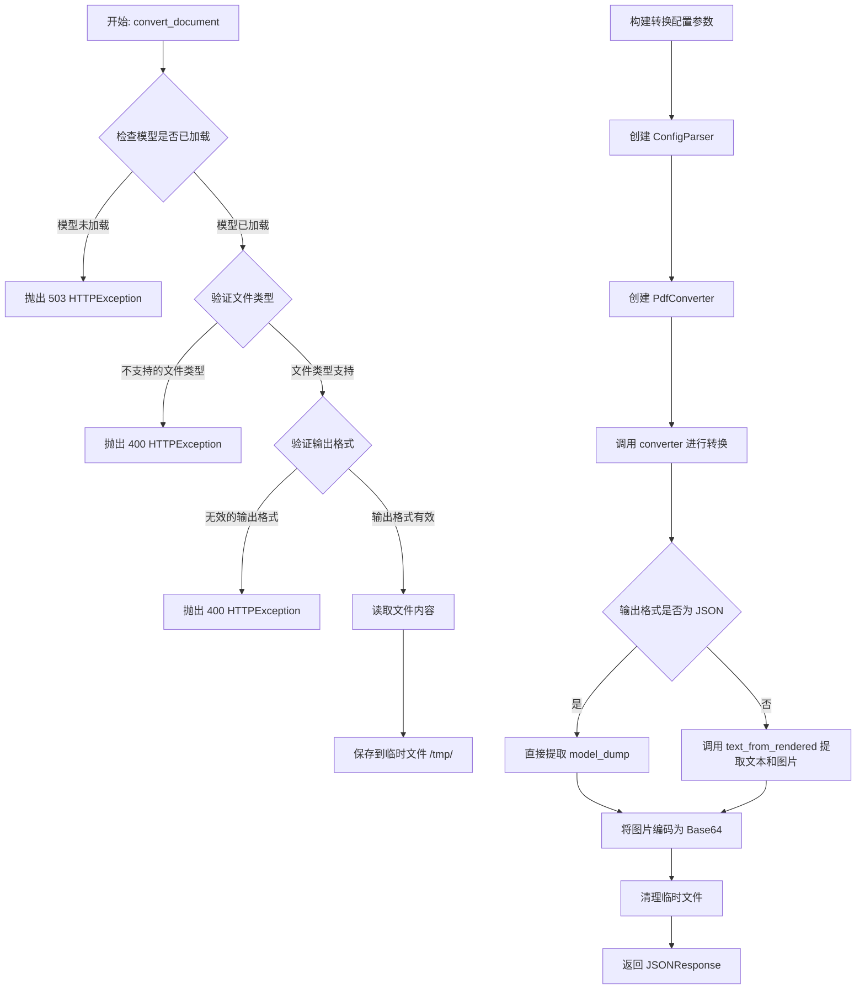
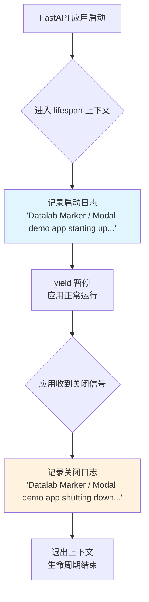
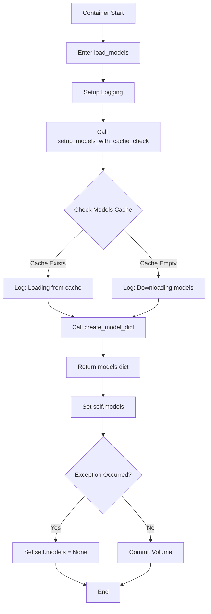
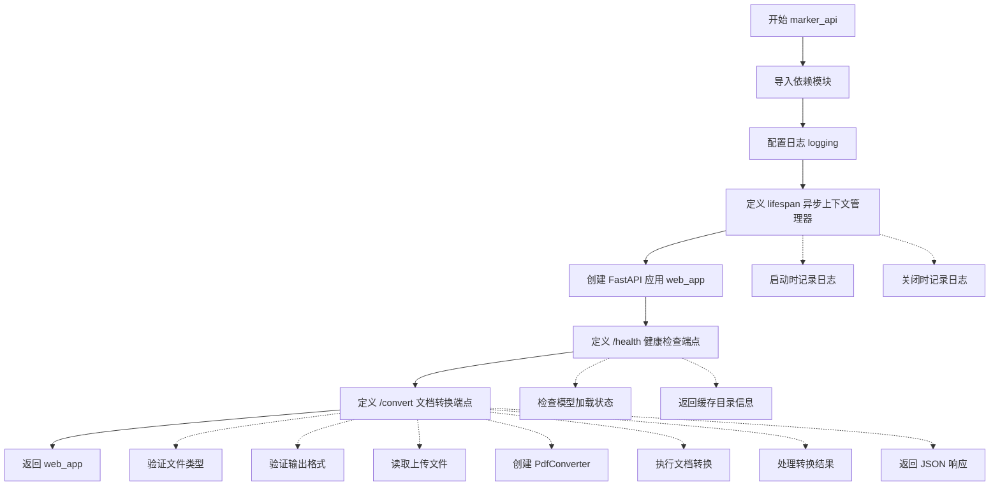

# `marker\examples\marker_modal_deployment.py` 详细设计文档

Modal部署脚本，用于将Datalab Marker PDF转换服务部署到Modal云平台，支持将PDF文档转换为markdown、JSON或HTML格式，并提供健康检查和本地测试入口。

## 整体流程

```mermaid
graph TD
    A[开始] --> B[初始化Modal App]
    B --> C[配置容器镜像和依赖]
    C --> D[创建持久化卷用于模型缓存]
    D --> E{执行环境}
    E -- 远程部署 --> F[download_models函数]
    E -- 容器启动 --> G[MarkerModalDemoService类]
    F --> H[下载模型到卷]
    H --> I[提交卷 commit]
    G --> J[@modal.enter加载模型]
    J --> K[启动FastAPI ASGI应用]
    K --> L[等待HTTP请求]
    L --> M{/health端点}
    L --> N{/convert端点}
    M --> O[返回模型加载状态]
    N --> P[验证文件和参数]
    P --> Q[创建PdfConverter]
    Q --> R[执行转换]
    R --> S[返回JSON/HTML/Markdown]
    T[Local Entrypoint] --> U[获取部署服务Web URL]
    U --> V[测试health端点]
    V --> W[发送convert请求]
    W --> X[保存响应到本地文件]
```

## 类结构

```
Modal App: datalab-marker-modal-demo
├── 全局配置
│   ├── GPU_TYPE = L40S
│   ├── MODEL_PATH_PREFIX
│   ├── image (容器镜像)
│   └── models_volume (持久化卷)
├── 工具函数
│   ├── setup_models_with_cache_check (共享模型加载函数)
│   └── download_models (下载模型到卷)
├── MarkerModalDemoService (主服务类)
│   ├── load_models (enter方法 - 容器启动时加载模型)
│   └── marker_api (ASGI应用 - FastAPI服务)
│       ├── /health (健康检查端点)
│       └── /convert (文档转换端点)
└── invoke_conversion (本地测试入口点)
```

## 全局变量及字段


### `app`
    
Modal应用实例，用于定义整个部署应用

类型：`modal.App`
    


### `GPU_TYPE`
    
GPU类型配置，指定用于模型推理的GPU类型为L40S

类型：`str`
    


### `MODEL_PATH_PREFIX`
    
模型缓存路径前缀，指定模型文件在容器中的存储位置

类型：`str`
    


### `image`
    
Modal容器镜像配置，包含Python 3.10和marker-pdf等依赖

类型：`modal.Image`
    


### `models_volume`
    
持久化卷对象，用于缓存模型文件避免重复下载

类型：`modal.Volume`
    


### `setup_models_with_cache_check`
    
共享函数，用于创建模型和处理缓存检查与日志记录

类型：`Callable`
    


### `MarkerModalDemoService.self.models`
    
存储加载的模型字典，包含PDF转换所需的各类型模型

类型：`Optional[dict]`
    
    

## 全局函数及方法


### `setup_models_with_cache_check`

该函数是 Modal 部署中用于检查模型缓存并加载模型的核心共享函数。它首先检查指定的模型缓存目录是否存在以及是否包含模型文件，然后通过日志记录缓存状态，最后调用 marker 库的 `create_model_dict()` 方法创建或加载模型，并在需要时提交持久化卷以保存下载的模型。

参数：

- `logger`：`logging.Logger`，用于记录缓存检查、模型加载和卷提交等操作信息的日志记录器实例
- `commit_volume`：`bool`，可选参数，默认为 `False`，指定是否在加载模型后提交持久化卷以保存缓存的模型文件

返回值：`dict`，返回由 marker 库的 `create_model_dict()` 方法创建模型字典，包含已加载的模型对象

#### 流程图



#### 带注释源码

```python
def setup_models_with_cache_check(logger, commit_volume=False):
    """
    Shared function to create models and handle cache checking/logging.
    """
    import os
    import gc
    from marker.models import create_model_dict

    # 检查模型缓存目录是否存在
    models_dir_exists = os.path.exists(MODEL_PATH_PREFIX)
    # 如果目录存在则列出内容，否则返回空列表
    models_dir_contents = os.listdir(MODEL_PATH_PREFIX) if models_dir_exists else []

    # 记录缓存目录状态信息
    logger.info(f"Models cache directory exists: {models_dir_exists}")
    logger.info(f"Models cache directory contents: {models_dir_contents}")

    # 根据缓存状态输出不同日志
    if models_dir_exists and models_dir_contents:
        logger.info("Found existing models in volume cache, loading from cache...")
    else:
        logger.warning("No models found in volume cache. Models will be downloaded now (this may take several minutes).")

    # 调用 marker 库的函数创建或加载模型
    models = create_model_dict()
    logger.info(f"Successfully loaded {len(models)} models")

    # 再次检查并记录最终缓存内容
    if os.path.exists(MODEL_PATH_PREFIX):
        contents = os.listdir(MODEL_PATH_PREFIX)
        logger.info(f"Models in cache: {contents}")

    # 如果请求提交卷（用于下载函数场景）
    if commit_volume:
        # 执行垃圾回收以释放内存
        gc.collect()
        logger.info("Attempting to commit volume...")
        # 提交持久化卷以保存模型缓存
        models_volume.commit()
        logger.info("Volume committed successfully")

    # 返回加载的模型字典
    return models
```


### `download_models`

该函数是 Modal 部署架构中的辅助函数，用于将 Marker PDF 转换服务所需的深度学习模型下载并缓存到 Modal 持久化卷中，确保模型在容器实例间共享，避免重复下载。

参数： 无

返回值： `str`，表示模型下载结果，包含成功下载的模型键列表

#### 流程图



#### 带注释源码

```python
@app.function(
    image=image,                              # 容器镜像配置
    volumes={MODEL_PATH_PREFIX: models_volume},  # 持久化卷挂载映射
    gpu=GPU_TYPE,                            # GPU 资源配置（L40S）
    timeout=600,                             # 函数超时时间（10分钟）
)
def download_models():
    """
    Helper function to download models used in marker into a Modal volume.
    
    该函数作为独立工具使用，将 Marker 所需的模型预加载到持久化卷中。
    主要用途：
    1. 首次部署时初始化模型缓存
    2. 手动刷新模型版本
    3. 在其他服务使用前确保模型可用
    """
    import logging

    # 配置日志级别和格式
    logging.basicConfig(level=logging.INFO)
    logger = logging.getLogger(__name__)

    # 记录下载任务开始
    logger.info("Downloading models to persistent volume...")
    # 记录持久化卷的挂载点路径
    logger.info(f"Volume mounted at: {MODEL_PATH_PREFIX}")

    try:
        # 调用共享模型加载函数，带缓存检查和卷提交标志
        # 参数 commit_volume=True 确保模型文件被写入持久化存储
        models = setup_models_with_cache_check(logger, commit_volume=True)
        
        # 返回成功消息，包含已加载的模型键列表
        return f"Models downloaded successfully: {list(models.keys())}"
    except Exception as e:
        # 捕获异常并记录详细错误信息
        logger.error(f"Failed to download models: {e}")
        # 重新抛出异常以便调用方处理
        raise
```


### `invoke_conversion`

本地测试入口函数，用于通过 Modal CLI 本地调用已部署的 Marker PDF 转换服务。该函数读取本地 PDF 文件，调用远程部署的 MarkerModalDemoService 的转换 API，将 PDF 转换为指定格式（markdown/json/html/chunks），并把 API 响应保存为本地 JSON 文件。

参数：

- `pdf_file`：`Optional[str]`，待转换的 PDF 文件路径，通过 CLI 的 `--pdf-file` 参数传入
- `output_format`：`str`，期望的输出格式，默认为 `"markdown"`，支持 `markdown`、`json`、`html`、`chunks`
- `env`：`str`，Modal 部署环境名称，默认为 `"main"`，用于定位部署的服务

返回值：`None`，该函数无显式返回值，结果通过控制台打印和写入本地文件 `{$pdf_file_stem}_response.json` 输出

#### 流程图

```mermaid
flowchart TD
    A[开始 invoke_conversion] --> B{检查 pdf_file 参数}
    B -->|未提供| C[打印提示信息并返回]
    B -->|已提供| D{检查文件是否存在}
    D -->|文件不存在| E[打印文件未找到错误并返回]
    D -->|文件存在| F[调用 modal.Cls.from_name 获取服务]
    F --> G[获取 marker_api 的 web_url]
    G --> H{获取 URL 成功?}
    H -->|失败| I[打印错误提示并返回]
    H -->|成功| J[打印服务地址]
    J --> K[测试 /health 健康检查端点]
    K --> L[打印健康状态和模型加载信息]
    L --> M[以二进制模式打开 PDF 文件]
    M --> N[构造 files 和 data 请求参数]
    N --> O[POST 请求到 /convert 端点]
    O --> P{响应状态码 200?}
    P -->|是| Q[解析 JSON 响应]
    P -->|否| R[打印错误信息和响应文本]
    Q --> S[打印转换成功信息]
    S --> T[提取文件名、格式、页数]
    T --> U[创建输出文件名: {stem}_response.json]
    U --> V[将完整响应写入 JSON 文件]
    V --> W[检查是否有图片提取]
    W -->|是| X[打印提取的图片数量]
    W -->|否| Y[结束]
    X --> Y
    R --> Y
    
    style A fill:#f9f,color:#000
    style Q fill:#9f9,color:#000
    style Y fill:#9f9,color:#000
```

#### 带注释源码

```python
@app.local_entrypoint()
async def invoke_conversion(
    pdf_file: Optional[str] = None,
    output_format: str = "markdown",
    env: str = 'main'
):
    """
    Local entrypoint to test your deployed Marker endpoint in Modal.

    Usage:
        modal run marker_modal_deployment.py::invoke_conversion --pdf-file /path/to/file.pdf --output-format markdown
    """
    import requests
    import json
    from pathlib import Path

    # 参数校验：检查是否提供了 PDF 文件路径
    if not pdf_file:
        print("No PDF file specified. Use --pdf-file /path/to/your.pdf")
        return

    # 参数校验：检查指定的 PDF 文件是否存在于本地文件系统
    pdf_path = Path(pdf_file)
    if not pdf_path.exists():
        print(f"File not found: {pdf_file}")
        return

    #
    # 获取已部署服务的 Web URL
    # 使用 modal.Cls.from_name 连接到远程部署的 Modal 服务
    #
    try:
        service = modal.Cls.from_name(
            "datalab-marker-modal-demo",  # Modal 应用名称
            "MarkerModalDemoService",      # 部署的类名
            environment_name=env           # 环境名称（默认 main）
        )
        # 获取服务的公开 Web URL（FastAPI ASGI 应用的路由）
        web_url = service().marker_api.get_web_url()
        print(f"Found deployed service at: {web_url}")
    except Exception as e:
        # 捕获获取 URL 失败的情况，可能服务尚未部署
        print(f"Error getting web URL: {e}")
        print("Make sure you've deployed the service first with: modal deploy marker_modal_deployment.py")
        return

    # 打印测试信息
    print(f"Testing conversion of: {pdf_path.name}")
    print(f"Output format: {output_format}")

    #
    # 健康检查：验证远程服务状态和模型加载情况
    #
    try:
        health_response = requests.get(f"{web_url}/health")
        health_data = health_response.json()
        print(f"Service health: {health_data['status']}")
        print(f"Models loaded: {health_data['models_loaded']} ({health_data['model_count']} models)")

        # 首次请求时模型可能尚未加载完成，给出提示
        if not health_data['models_loaded']:
            print("Warning: Models not loaded yet. First request may be slow.")

    except Exception as e:
        print(f"Health check failed: {e}")

    #
    # 发送转换请求到远程 /convert 端点
    #
    try:
        # 以二进制读取模式打开 PDF 文件
        with open(pdf_path, 'rb') as f:
            # 构造 multipart/form-data 请求
            files = {'file': (pdf_path.name, f, 'application/pdf')}
            data = {'output_format': output_format}

            print(f"Sending request to {web_url}/convert...")
            # POST 请求到转换端点
            response = requests.post(f"{web_url}/convert", files=files, data=data)

        # 处理响应
        if response.status_code == 200:
            # 转换成功，解析 JSON 响应
            result = response.json()
            print(f"✅ Conversion successful!")
            print(f"Filename: {result['filename']}")
            print(f"Format: {result['output_format']}")
            print(f"Pages: {result['page_count']}")

            # 将完整 API 响应保存到本地 JSON 文件
            output_file = f"{pdf_path.stem}_response.json"
            with open(output_file, 'w', encoding='utf-8') as f:
                json.dump(result, f, indent=2, ensure_ascii=False)
            print(f"Full API response saved to: {output_file}")

            # 如果响应包含图片，打印图片数量
            if result['images']:
                print(f"Images extracted: {len(result['images'])}")

        else:
            # 转换失败，打印 HTTP 状态码和错误响应
            print(f"❌ Conversion failed: {response.status_code}")
            print(f"Error: {response.text}")

    except Exception as e:
        # 网络请求层面的异常处理
        print(f"Request failed: {e}")
```


### `health_check`

这是一个用于检查服务健康状态的异步端点处理函数，属于 `MarkerModalDemoService` 类的 `marker_api` 方法内部定义的 FastAPI 路由。它通过检查模型是否已加载以及缓存目录状态来返回服务的当前运行状况。

参数：此函数无显式参数（隐式接收 `self` 引用以访问服务实例属性）

返回值：`dict`，返回一个包含服务健康状态、模型加载信息、模型数量以及缓存目录状态的 JSON 字典，用于客户端了解服务可用性。

#### 流程图

```mermaid
flowchart TD
    A[开始 health_check] --> B{检查 self.models 是否存在且不为 None}
    B -->|是| C[设置 models_loaded = True]
    B -->|否| D[设置 models_loaded = False]
    C --> E[获取 model_count = len(self.models)]
    D --> F[设置 model_count = 0]
    E --> G[检查缓存目录是否存在]
    F --> G
    G -->|存在| H[列出缓存目录内容]
    G -->|不存在| I[设置 cache_contents 为空列表]
    H --> J[返回包含健康状态的 JSON 响应]
    I --> J
```

#### 带注释源码

```python
@web_app.get("/health")  # 定义 GET 路由 /health
async def health_check():
    """
    健康检查端点，返回服务状态和模型加载信息
    """
    # 检查模型是否已加载（self 引用外部类的实例属性）
    models_loaded = hasattr(self, 'models') and self.models is not None
    # 获取已加载模型的数量，如果未加载则为 0
    model_count = len(self.models) if models_loaded else 0

    # 检查模型缓存目录是否存在（用于调试目的）
    cache_exists = os.path.exists(MODEL_PATH_PREFIX)
    # 如果目录存在，获取目录内容列表；否则返回空列表
    cache_contents = os.listdir(MODEL_PATH_PREFIX) if cache_exists else []

    # 返回包含服务健康状态的 JSON 响应
    return {
        "status": "healthy" if models_loaded else "loading",  # 状态：healthy 或 loading
        "models_loaded": models_loaded,  # 模型是否已加载的布尔值
        "model_count": model_count,  # 已加载模型的数量
        "cache_dir": MODEL_PATH_PREFIX,  # 缓存目录路径（全局常量）
        "cache_exists": cache_exists,  # 缓存目录是否存在
        "cache_contents": cache_contents[:10]  # 缓存目录内容（限制前10个，用于调试）
    }
```


### `MarkerModalDemoService.convert_document`

文档转换端点处理函数，负责接收用户上传的文档文件（PDF、图片等），调用 Marker 模型进行格式转换，并将转换结果（Markdown、JSON、HTML 等格式）以 JSON 响应返回。

参数：

- `file`：`UploadFile`，待转换的文档文件，支持 PDF、PNG、JPG、JPEG、TIFF、BMP 等格式
- `page_range`：`Optional[str]`，可选的页码范围指定，用于只转换文档的特定页面
- `force_ocr`：`bool`，是否强制使用 OCR 识别文本，默认为 False
- `paginate_output`：`bool`，是否对输出进行分页处理，默认为 False
- `output_format`：`str`，输出格式，可选值为 "markdown"、"json"、"html"、"chunks"，默认为 "markdown"
- `use_llm`：`bool`，是否使用 LLM 增强转换效果，默认为 False

返回值：`JSONResponse`，包含转换结果的 JSON 对象，字段包括 success、filename、output_format、json、html、markdown、images、metadata、page_count

#### 流程图



#### 带注释源码

```python
@web_app.post("/convert")
async def convert_document(
    file: UploadFile = File(..., description="Document to convert"),
    page_range: Optional[str] = Form(None),
    force_ocr: bool = Form(False),
    paginate_output: bool = Form(False),
    output_format: str = Form("markdown"),
    use_llm: bool = Form(False),
):
    """Convert uploaded document to specified format."""

    # 检查模型是否已加载，确保转换服务可用
    if not hasattr(self, 'models') or self.models is None:
        logger.error("Models not available for conversion")
        raise HTTPException(status_code=503, detail="Models not loaded yet. Please wait for model initialization.")

    # 验证文件类型，只允许支持的文档和图片格式
    allowed_extensions = {'.pdf', '.png', '.jpg', '.jpeg', '.tiff', '.bmp'}
    file_ext = Path(file.filename).suffix.lower()
    if file_ext not in allowed_extensions:
        raise HTTPException(
            status_code=400,
            detail=f"Unsupported file type: {file_ext}. Supported: {allowed_extensions}"
        )

    # 验证输出格式，确保是服务端支持的格式
    if output_format not in ["markdown", "json", "html", "chunks"]:
        raise HTTPException(
            status_code=400,
            detail="Output format must be one of: markdown, json, html, chunks"
        )

    try:
        # 读取上传的文件内容
        file_content = await file.read()

        # 将文件内容保存到临时路径，供转换器使用
        temp_path = f"/tmp/{file.filename}"
        with open(temp_path, "wb") as temp_file:
            temp_file.write(file_content)

        # 配置转换参数，构建配置字典
        config = {
            "filepath": temp_path,
            "page_range": page_range,
            "force_ocr": force_ocr,
            "paginate_output": paginate_output,
            "output_format": output_format,
            "use_llm": use_llm,
        }

        # 使用 ConfigParser 解析配置并生成配置字典
        config_parser = ConfigParser(config)
        config_dict = config_parser.generate_config_dict()
        config_dict["pdftext_workers"] = 1  # 限制 PDF 文本提取的工作线程数

        # 创建 PDF 转换器实例，传入模型、处理器和渲染器
        converter = PdfConverter(
            config=config_dict,
            artifact_dict=self.models,
            processor_list=config_parser.get_processors(),
            renderer=config_parser.get_renderer(),
            llm_service=config_parser.get_llm_service() if use_llm else None,
        )

        # 执行文档转换
        logger.info(f"Converting {file.filename} to {output_format}...")
        rendered_output = converter(temp_path)

        # 根据输出格式提取转换结果
        json_content = None
        html_content = None
        markdown_content = None
        encoded_images = {}

        if output_format == "json":
            # JSON 格式直接导出模型数据
            json_content = rendered_output.model_dump()
        else:
            # 其他格式使用 text_from_rendered 提取文本和图片
            from marker.output import text_from_rendered
            text, _, images = text_from_rendered(rendered_output)

            # 根据输出格式分配内容
            if output_format == "html":
                html_content = text
            else:
                markdown_content = text

            # 将提取的图片编码为 Base64 字符串
            for img_name, img_obj in images.items():
                byte_stream = io.BytesIO()
                img_obj.save(byte_stream, format=settings.OUTPUT_IMAGE_FORMAT)
                encoded_images[img_name] = base64.b64encode(byte_stream.getvalue()).decode('utf-8')

        # 获取转换元数据
        metadata = rendered_output.metadata

        logger.info(f"Conversion completed for {file.filename}")

        # 清理临时文件，释放磁盘空间
        os.unlink(temp_path)

        # 返回包含转换结果的 JSON 响应
        return JSONResponse({
            "success": True,
            "filename": file.filename,
            "output_format": output_format,
            "json": json_content,
            "html": html_content,
            "markdown": markdown_content,
            "images": encoded_images,
            "metadata": metadata,
            "page_count": len(metadata.get("page_stats", [])),
        })

    except Exception as e:
        # 异常处理：清理临时文件并返回错误信息
        if os.path.exists(temp_path):
            os.unlink(temp_path)

        logger.error(f"Conversion error for {file.filename}: {str(e)}")
        traceback.print_exc()

        raise HTTPException(
            status_code=500,
            detail=f"Conversion failed: {str(e)}"
        )
```


### `MarkerModalDemoService.marker_api.lifespan`

FastAPI 生命周期管理异步上下文管理器，用于在应用启动时记录日志并在应用关闭时执行清理工作。

参数：

-  `app`：`FastAPI`，FastAPI 应用实例，用于访问应用上下文

返回值：`AsyncIterator[None]`，异步上下文管理器，在应用启动时 yield 前执行初始化逻辑，在 yield 后执行清理逻辑

#### 流程图



#### 带注释源码

```python
@asynccontextmanager
async def lifespan(app: FastAPI):
    """
    FastAPI 生命周期管理异步上下文管理器。
    在应用启动时记录日志，在应用关闭时执行清理工作。
    
    注意：模型已在 @modal.enter() 阶段加载，此处仅负责生命周期日志记录。
    """
    # Models are already loaded in @modal.enter()
    logger.info("Datalab Marker / Modal demo app starting up...")
    yield  # 应用运行期间保持在此处
    logger.info("Datalab Marker / Modal demo app shutting down...")
```


### `MarkerModalDemoService.load_models`

该方法在 Modal 容器启动时自动调用一次，负责加载 Marker PDF 转换所需的深度学习模型（OCR、布局分析、文本提取等），并管理模型缓存。它通过 `@modal.enter()` 装饰器实现容器级别的单次初始化，确保模型在服务处理请求前已准备就绪，同时支持从持久化卷缓存加载以加速后续启动。

参数：

- `self`：实例方法隐含参数，表示类实例本身，无类型注解

返回值：`None`，该方法通过修改实例属性 `self.models` 来传递结果，不返回任何值

#### 流程图



#### 带注释源码

```python
@modal.enter()
def load_models(self):
    """Load models once per container using @modal.enter() for efficiency."""
    import logging
    import traceback

    # 配置日志格式，包含时间戳、级别和消息内容
    logging.basicConfig(level=logging.INFO, format='%(asctime)s - %(levelname)s - %(message)s')
    logger = logging.getLogger(__name__)

    # 记录模型加载开始日志
    logger.info("Loading Marker models using @modal.enter()...")
    
    try:
        # 调用共享函数加载模型，传入日志记录器和提交卷标志
        # 该函数会检查持久化卷中的模型缓存
        # commit_volume=True 确保新下载的模型被保存到卷中
        self.models = setup_models_with_cache_check(logger, commit_volume=True)
    except Exception as e:
        # 捕获加载过程中的任何异常
        logger.error(f"Error loading models: {e}")
        # 打印完整堆栈跟踪以便调试
        traceback.print_exc()
        # 将模型设置为 None，后续请求会收到服务不可用响应
        self.models = None
```


### `MarkerModalDemoService.marker_api`

该方法是一个 Modal ASGI 应用入口点，用于创建并返回 FastAPI 应用实例，提供 PDF 文档转换为 Markdown、JSON、HTML 或 chunks 格式的 RESTful API 服务。

参数：
- 无（仅包含 `self` 参数）

返回值：`FastAPI`，返回配置完整的 FastAPI 应用实例，包含健康检查和文档转换接口

#### 流程图



#### 带注释源码

```python
@modal.asgi_app()  # 装饰器：标记此方法为 Modal ASGI 应用入口点
def marker_api(self):
    """
    创建并返回 FastAPI ASGI 应用，用于处理 PDF 转换请求
    """
    import traceback
    import io
    import base64
    import logging
    from contextlib import asynccontextmanager
    from typing import Optional
    from pathlib import Path

    # 导入 FastAPI 及相关组件
    from fastapi import FastAPI, Form, File, UploadFile, HTTPException
    from fastapi.responses import JSONResponse

    # 导入 Marker 转换器相关模块
    from marker.converters.pdf import PdfConverter
    from marker.config.parser import ConfigParser
    from marker.settings import settings

    # 配置日志格式和级别
    logging.basicConfig(level=logging.INFO, format='%(asctime)s - %(levelname)s - %(message)s')
    logger = logging.getLogger(__name__)

    @asynccontextmanager
    async def lifespan(app: FastAPI):
        """
        异步上下文管理器，处理应用生命周期事件
        - 启动时：记录服务启动日志（模型已在 @modal.enter() 中加载）
        - 关闭时：记录服务关闭日志
        """
        # Models are already loaded in @modal.enter()
        logger.info("Datalab Marker / Modal demo app starting up...")
        yield
        logger.info("Datalab Marker / Modal demo app shutting down...")

    # 创建 FastAPI 应用实例，配置元数据和生命周期
    web_app = FastAPI(
        title="Datalab Marker PDF Conversion Service - Modal Demo",
        description="Convert PDFs and documents to markdown, JSON, or HTML using Marker, deployed on Modal",
        version="1.0.0",
        lifespan=lifespan
    )

    @web_app.get("/health")
    async def health_check():
        """
        健康检查端点，返回服务状态和模型加载信息
        """
        models_loaded = hasattr(self, 'models') and self.models is not None
        model_count = len(self.models) if models_loaded else 0

        # 检查卷内容用于调试
        cache_exists = os.path.exists(MODEL_PATH_PREFIX)
        cache_contents = os.listdir(MODEL_PATH_PREFIX) if cache_exists else []

        return {
            "status": "healthy" if models_loaded else "loading",
            "models_loaded": models_loaded,
            "model_count": model_count,
            "cache_dir": MODEL_PATH_PREFIX,
            "cache_exists": cache_exists,
            "cache_contents": cache_contents[:10]
        }

    @web_app.post("/convert")
    async def convert_document(
        file: UploadFile = File(..., description="Document to convert"),
        page_range: Optional[str] = Form(None),
        force_ocr: bool = Form(False),
        paginate_output: bool = Form(False),
        output_format: str = Form("markdown"),
        use_llm: bool = Form(False),
    ):
        """
        文档转换端点
        
        参数：
            - file: UploadFile，上传的要转换的文档
            - page_range: Optional[str]，要转换的页面范围（如 "1-10"）
            - force_ocr: bool，是否强制使用 OCR
            - paginate_output: bool，是否分页输出
            - output_format: str，输出格式（markdown/json/html/chunks）
            - use_llm: bool，是否使用 LLM 增强
        
        返回：
            JSONResponse：包含转换结果和元数据
        """
        # 检查模型是否可用
        if not hasattr(self, 'models') or self.models is None:
            logger.error("Models not available for conversion")
            raise HTTPException(status_code=503, detail="Models not loaded yet. Please wait for model initialization.")

        # 验证文件类型
        allowed_extensions = {'.pdf', '.png', '.jpg', '.jpeg', '.tiff', '.bmp'}
        file_ext = Path(file.filename).suffix.lower()
        if file_ext not in allowed_extensions:
            raise HTTPException(
                status_code=400,
                detail=f"Unsupported file type: {file_ext}. Supported: {allowed_extensions}"
            )

        # 验证输出格式
        if output_format not in ["markdown", "json", "html", "chunks"]:
            raise HTTPException(
                status_code=400,
                detail="Output format must be one of: markdown, json, html, chunks"
            )

        try:
            # 读取上传文件内容
            file_content = await file.read()

            # 保存到临时文件
            temp_path = f"/tmp/{file.filename}"
            with open(temp_path, "wb") as temp_file:
                temp_file.write(file_content)

            # 配置转换参数
            config = {
                "filepath": temp_path,
                "page_range": page_range,
                "force_ocr": force_ocr,
                "paginate_output": paginate_output,
                "output_format": output_format,
                "use_llm": use_llm,
            }

            # 创建配置解析器并生成配置字典
            config_parser = ConfigParser(config)
            config_dict = config_parser.generate_config_dict()
            config_dict["pdftext_workers"] = 1

            # 创建 PDF 转换器实例
            converter = PdfConverter(
                config=config_dict,
                artifact_dict=self.models,
                processor_list=config_parser.get_processors(),
                renderer=config_parser.get_renderer(),
                llm_service=config_parser.get_llm_service() if use_llm else None,
            )

            # 执行文档转换
            logger.info(f"Converting {file.filename} to {output_format}...")
            rendered_output = converter(temp_path)

            # 根据输出格式提取内容
            json_content = None
            html_content = None
            markdown_content = None
            encoded_images = {}

            if output_format == "json":
                # JSON 格式直接返回结构化数据
                json_content = rendered_output.model_dump()
            else:
                # 其他格式从渲染结果提取文本和图像
                from marker.output import text_from_rendered
                text, _, images = text_from_rendered(rendered_output)

                # 根据格式分配内容
                if output_format == "html":
                    html_content = text
                else:
                    markdown_content = text

                # 将图像编码为 base64
                for img_name, img_obj in images.items():
                    byte_stream = io.BytesIO()
                    img_obj.save(byte_stream, format=settings.OUTPUT_IMAGE_FORMAT)
                    encoded_images[img_name] = base64.b64encode(byte_stream.getvalue()).decode('utf-8')

            # 获取元数据
            metadata = rendered_output.metadata

            logger.info(f"Conversion completed for {file.filename}")

            # 清理临时文件
            os.unlink(temp_path)

            # 返回转换结果
            return JSONResponse({
                "success": True,
                "filename": file.filename,
                "output_format": output_format,
                "json": json_content,
                "html": html_content,
                "markdown": markdown_content,
                "images": encoded_images,
                "metadata": metadata,
                "page_count": len(metadata.get("page_stats", [])),
            })

        except Exception as e:
            # 异常处理：清理临时文件并返回错误
            if os.path.exists(temp_path):
                os.unlink(temp_path)

            logger.error(f"Conversion error for {file.filename}: {str(e)}")
            traceback.print_exc()

            raise HTTPException(
                status_code=500,
                detail=f"Conversion failed: {str(e)}"
            )

    # 返回配置完成的 FastAPI 应用
    return web_app
```

## 关键组件


### Modal 应用配置与部署定义

定义主 Modal 应用实例，配置 GPU 类型（L40S）和模型路径前缀，为整个服务提供基础运行环境。

### 容器镜像构建

通过 Modal 的链式 API 定义包含所有依赖项的容器镜像，包括 Python 3.10、Git、Wget、PyTorch 及 Marker-PDF 完整依赖。

### 模型缓存持久化卷

创建持久化卷用于存储预下载的机器学习模型，支持模型复用和容器重启后的缓存命中。

### 模型加载与缓存检查函数

封装模型加载逻辑，实现缓存目录检查、日志记录和模型下载状态追踪，支持可选的卷提交操作。

### 模型下载函数

独立的 Modal 函数，用于将 Marker 模型预下载到持久化卷，包含错误处理和日志记录。

### MarkerModalDemoService 服务类

核心服务类，整合模型加载和 FastAPI 应用，支持 GPU 加速和大内存配置，具备自动缩放窗口。

### /health 健康检查端点

返回服务健康状态、模型加载数量、缓存目录状态等调试信息，用于监控服务启动进度。

### /convert 文档转换端点

处理 PDF/Document 上传，支持页面范围、OCR 强制、输出格式（markdown/json/html/chunks）等参数，返回转换结果和提取的图片。

### Local Entrypoint 本地测试入口

提供本地 CLI 工具用于测试已部署的 Modal 服务，支持指定 PDF 文件和输出格式，保存 API 响应到本地文件。


## 问题及建议


### 已知问题

- **临时文件清理不完善**：在`convert_document`函数中，如果异常发生在`temp_path`创建之后但在`os.unlink`之前，临时文件可能不会被清理。
- **模型加载失败处理不充分**：当`setup_models_with_cache_check`失败时，只是设置`self.models = None`，请求会返回503，但没有重试机制或队列机制来等待模型加载完成。
- **文件路径安全风险**：直接使用`file.filename`创建临时路径（`temp_path = f"/tmp/{file.filename}"`），可能存在路径遍历攻击风险。
- **硬编码配置**：GPU类型、内存、超时时间、workers数量等都是硬编码，缺少通过环境变量或配置中心注入的灵活性。
- **日志安全风险**：在生产环境中使用`traceback.print_exc()`可能泄露敏感的系统信息和代码结构。
- **并发性能限制**：`pdftext_workers = 1`被硬编码，限制了并发处理能力，无法充分利用多核CPU。
- **资源重复初始化**：每个请求都创建新的`PdfConverter`实例，增加了内存开销和初始化时间。
- **缺乏请求限流**：没有对文件上传大小限制，可能导致大文件攻击或内存溢出。
- **异常信息泄露**：HTTP异常detail直接返回`str(e)`，可能暴露内部实现细节。

### 优化建议

- **改进临时文件管理**：使用`tempfile`模块的`NamedTemporaryFile`并结合上下文管理器，确保异常情况下也能自动清理。
- **增加健康检查深度**：健康检查应该能够区分"正在加载"、"加载失败"等状态，并提供具体的错误信息。
- **添加请求验证**：对`file.filename`进行安全校验，使用`secure_filename`或正则表达式过滤非法字符。
- **配置外部化**：将GPU类型、内存、超时等配置提取到环境变量或配置文件中，支持多环境部署。
- **日志脱敏**：在生产环境使用结构化日志，避免打印堆栈跟踪，改为记录日志ID供查询。
- **动态worker配置**：根据容器CPU核心数动态设置`pdftext_workers`，或将其作为可配置参数。
- **Converter实例复用**：考虑在类初始化时创建Converter实例并复用，减少每个请求的开销。
- **添加请求限制**：使用FastAPI的`UploadFile`参数或中间件限制上传文件大小（如最大50MB）。
- **统一错误处理**：创建自定义异常类，使用FastAPI的异常处理器统一返回格式，避免直接暴露异常信息。
- **增加重试机制**：在`download_models`函数中添加下载失败重试逻辑，特别是网络不稳定时。

## 其它


### 设计目标与约束

本项目旨在将Marker PDF文档转换服务部署到Modal Serverless平台，实现PDF到Markdown、JSON、HTML等格式的转换功能。设计约束包括：使用L40S GPU进行模型推理；容器内存限制为16GB；单个请求超时时间为600秒（10分钟），适用于大文档处理；使用持久化Volume缓存模型文件以减少冷启动时间；采用Modal的类部署模式实现长驻容器以复用已加载的模型。

### 错误处理与异常设计

代码采用分层异常处理策略。在`download_models`函数中，异常被捕获后重新抛出，由Modal运行时记录日志。在`MarkerModalDemoService.load_models`方法中，模型加载异常会被捕获并记录，同时将`self.models`设为None，使服务在模型未就绪时仍可响应请求（返回503状态）。在`convert_document`端点中，针对文件类型验证、模型可用性检查、转换过程、临时文件清理均设计了try-except块，确保任何异常都会触发临时文件清理并返回有意义的HTTP错误信息。当前设计缺少重试机制、断路器模式和降级策略，可考虑在后续迭代中添加。

### 数据流与状态机

系统数据流如下：客户端通过POST请求上传文件至`/convert`端点 → FastAPI验证文件类型和输出格式 → 创建临时文件到`/tmp`目录 → 构建ConfigParser配置字典 → 创建PdfConverter实例并传入已缓存的模型 → 调用converter执行转换 → 根据output_format提取结果（JSON直接dump或通过text_from_rendered解析） → 对提取的图像进行Base64编码 → 构建JSONResponse返回 → 清理临时文件。状态机方面，服务存在三种状态：初始化中（模型加载阶段）、就绪（模型已加载可处理请求）、错误（模型加载失败）。健康检查端点`/health`返回当前状态供负载均衡器使用。

### 外部依赖与接口契约

核心外部依赖包括：Modal平台及其SDK（`modal>=0.62`）、Marker库（`marker-pdf[full]`）用于PDF转换、FastAPI（`0.104.1`）用于Web服务、PyTorch（`>=2.2.2,<3.0.0`）用于深度学习推理。API接口契约如下：GET `/health`返回服务健康状态、模型加载情况、缓存目录信息；POST `/convert`接受file（UploadFile）、page_range（Optional[str]）、force_ocr（bool）、paginate_output（bool）、output_format（str）、use_llm（bool）参数，返回包含success、filename、output_format、json/html/markdown内容、images（Base64编码）、metadata、page_count的JSON对象。临时文件存储依赖本地文件系统（`/tmp`目录），模型缓存依赖Modal Volume（`marker-models-modal-demo`）。

### 安全性设计

当前实现存在以下安全考量点：文件上传验证已实现（检查文件扩展名白名单：.pdf/.png/.jpg/.jpeg/.tiff/.bmp）；输出格式验证已实现（限制为markdown/json/html/chunks）；临时文件在使用后被清理。潜在安全风险包括：未对上传文件大小进行限制，可能导致内存耗尽；临时文件使用固定路径`/tmp/{filename}`，存在路径注入风险（应使用`tempfile`模块生成安全随机文件名）；缺少请求速率限制和认证机制，当前部署为公开访问。建议后续添加：文件大小限制（如50MB）、安全的临时文件生成、API密钥认证、请求频率限制。

### 性能考虑与优化空间

性能优化措施包括：模型缓存在持久化Volume中，避免每次启动重复下载；使用`@modal.enter()`装饰器实现容器级模型单次加载；容器配置`scaledown_window=300`秒保持容器活跃。当前代码可优化的方面：`pdftext_workers`硬编码为1，未充分利用多核CPU；图像编码在主线程同步执行，大批量图像时可考虑异步处理；每次转换都创建新的ConfigParser和Converter实例，可考虑对象池化；缺少请求结果缓存机制，相同文件重复转换时会重复计算。GPU利用率监控尚未集成，建议添加GPU内存和计算利用率指标采集。

### 配置管理

系统配置通过以下方式管理：环境变量`TORCH_DEVICE`设置为"cuda"；GPU类型通过全局常量`GPU_TYPE = "L40S"`指定；模型路径前缀`MODEL_PATH_PREFIX = "/root/.cache/datalab/models"`；依赖版本通过`pip_install`列表固定。运行时配置通过`convert_document`端点的Form参数传递，包括page_range、force_ocr、paginate_output、output_format、use_llm。配置当前硬编码在代码中，建议后续迁移至独立的配置文件或环境变量，实现配置与代码解耦。

### 测试策略

当前代码包含本地入口点`@app.local_entrypoint()`用于CLI测试，可模拟完整部署流程进行端到端测试。测试覆盖场景包括：服务部署验证、健康检查端点测试、不同输出格式转换测试、错误情况处理验证。缺失的测试包括：单元测试（各函数独立功能测试）、集成测试（模拟Modal环境）、性能基准测试（大文件转换时间、并发处理能力）、混沌测试（模拟模型加载失败、网络超时等异常场景）。建议补充pytest测试套件，覆盖边界条件和异常分支。

### 监控与日志

日志实现采用Python标准库`logging`模块，配置为INFO级别，格式包含时间戳、级别和消息内容。日志记录点包括：模型缓存检查和加载过程、文档转换开始和完成、错误堆栈跟踪。健康检查端点返回的监控数据包括：模型加载状态、模型数量、缓存目录存在性和内容。缺失的监控能力：Modal平台级别指标（函数调用次数、冷启动频率、执行时长分布）、GPU利用率和内存使用、应用级业务指标（转换成功率、平均处理时间）。建议集成Modal的metrics或对接Prometheus实现可观测性。


    