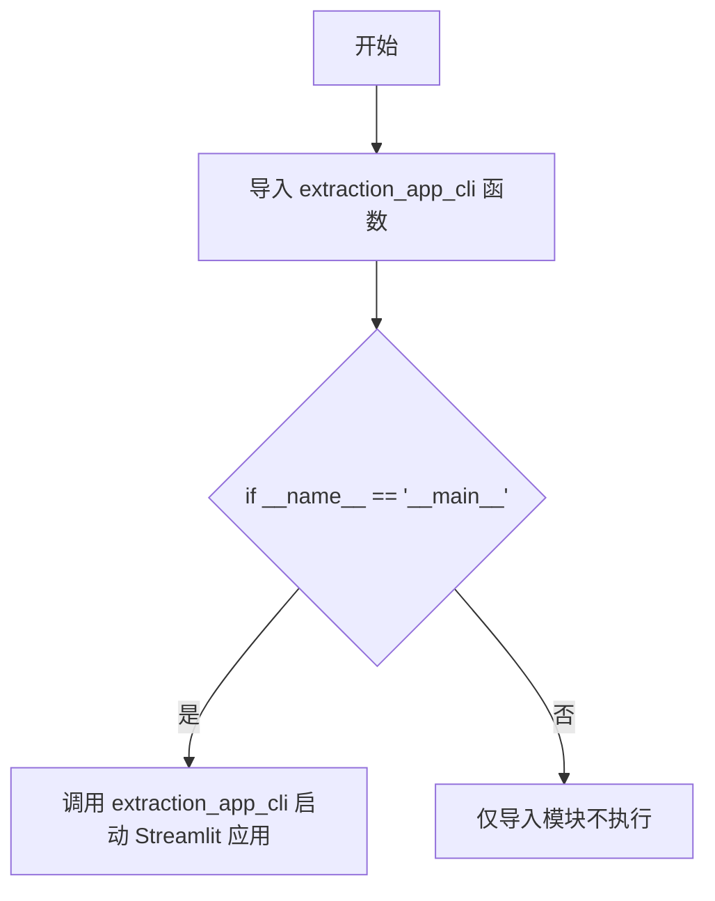
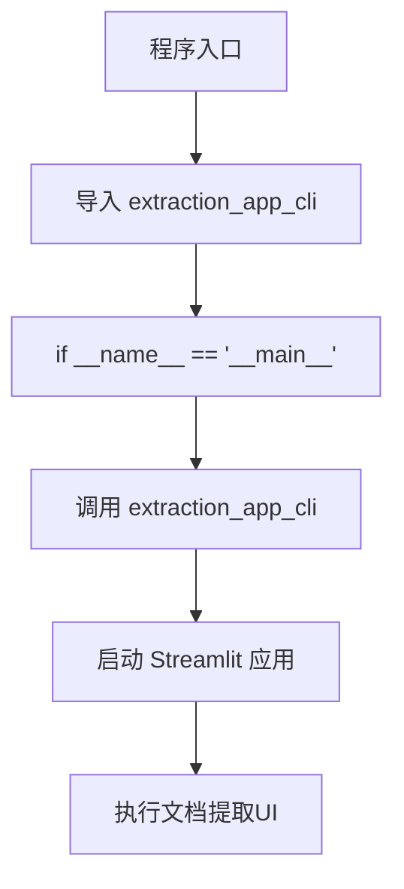

# `marker\extraction_app.py` 详细设计文档

这是 Marker 库的 Streamlit 应用入口点，通过导入并调用 extraction_app_cli 函数来启动文档提取的 Web 界面。

## 整体流程



## 类结构

```
无复杂类结构
该文件为纯入口文件，仅负责导入和调用外部模块的 CLI 函数
```

## 全局变量及字段


    

## 全局函数及方法


### `extraction_app_cli`

`extraction_app_cli` 是 Marker 库中的一个命令行接口启动函数，用于初始化并运行基于 Streamlit 的文档提取应用。

参数：

- 该函数在提供的代码中无显式参数传递（调用时为空）

返回值：`None`（根据代码分析，该函数直接执行 Streamlit 应用启动，无返回值）

#### 流程图



#### 带注释源码

```python
# 入口脚本：marker_cli.py

# 从 marker.scripts.run_streamlit_app 模块导入 extraction_app_cli 函数
# 该函数是 Marker 库提供的 CLI 入口点，用于启动 Streamlit Web 应用
from marker.scripts.run_streamlit_app import extraction_app_cli

# 标准 Python 入口点保护
# 确保此脚本作为主程序运行时才执行，而不是被导入时执行
if __name__ == "__main__":
    # 调用 extraction_app_cli 函数启动 Streamlit 应用
    # 该函数内部会：
    # 1. 配置 Streamlit 页面设置
    # 2. 加载文档提取模型
    # 3. 渲染提取 UI 界面
    # 4. 处理用户交互和文件上传
    extraction_app_cli()
```

---

### 补充说明

由于提供的代码仅包含函数调用而非定义，以上信息基于：
- 标准的 Streamlit CLI 应用模式
- 函数名的语义推断（`extraction_app_cli` → CLI 应用启动函数）
- `marker.scripts.run_streamlit_app` 模块的命名约定

如需获取完整的函数签名、详细参数和内部逻辑，请提供 `marker/scripts/run_streamlit_app.py` 文件的源码。


## 关键组件


### 入口脚本 (Entry Point)

该代码文件是 marker 项目的启动入口，通过调用 `extraction_app_cli()` 函数启动 Streamlit Web 应用界面，用于执行文档/图像的提取任务。

### extraction_app_cli 函数

这是从 `marker.scripts.run_streamlit_app` 模块导入的核心 CLI 函数，负责初始化和启动 Streamlit Web 应用界面，是整个文档提取工具的用户交互入口点。

### marker.scripts.run_streamlit_app 模块

该模块是 Streamlit 应用的实现模块，包含应用界面的构建、配置以及各个提取功能的 UI 组件和业务逻辑调度。


## 问题及建议


### 已知问题

-   **缺少错误处理**：主入口没有 `try-except` 块捕获异常，程序崩溃时用户体验差且难以排查
-   **缺少日志记录**：没有任何日志输出，无法追踪程序运行状态和问题诊断
-   **无命令行参数传递**：直接调用 `extraction_app_cli()` 而未传递任何参数，限制了运行时的可配置性
-   **缺少依赖验证**：未在启动前检查依赖项是否完整安装，可能导致运行时才报错
-   **无健康检查机制**：启动前未验证环境配置或关键依赖的可用性
-   **模块文档缺失**：入口文件缺少模块级文档字符串（docstring）
-   **硬编码调用**：直接导入并调用函数，未考虑未来可能的扩展（如多命令支持、插件化）

### 优化建议

-   添加 `try-except` 块捕获 `Exception` 并记录日志，提供友好的错误提示
-   集成标准日志模块（`logging`），支持配置日志级别和输出格式
-   使用 `argparse` 解析命令行参数，传递给 `extraction_app_cli()`，增加灵活性
-   在启动时检查关键依赖（如 `streamlit`、`marker` 包）是否可用，给出明确提示
-   添加模块级文档字符串，说明文件用途和入口逻辑
-   考虑将调用封装为可导出的 CLI 入口点，支持通过 `python -m` 或安装为可执行命令
-   添加环境变量或配置文件支持，用于非侵入式配置管理


## 其它


### 设计目标与约束

本项目旨在提供一个基于Streamlit的文档提取应用入口，通过marker库实现高效的文档内容提取功能。设计约束包括：必须使用Python 3.8+环境运行，依赖marker库及其相关依赖项，UI层采用Streamlit框架构建。核心目标是将marker库的文档提取能力以Web应用形式呈现给终端用户，实现一键式文档上传与内容提取。

### 错误处理与异常设计

入口脚本层面的错误处理主要依赖于extraction_app_cli函数的内部实现。当模块导入失败时，Python会抛出ModuleNotFoundError，提示用户检查marker库是否正确安装。若__name__条件判断失败，脚本不会执行，这是Python脚本的标准行为。详细的异常处理逻辑应在extraction_app_cli函数内部实现，包括网络异常、文件处理异常、Streamlit应用异常等的捕获与用户友好提示。

### 数据流与状态机

数据流从用户通过Streamlit界面上传文档开始，经过marker库的解析引擎处理，最终以结构化形式展示提取结果。入口脚本作为数据流的触发点，负责启动Streamlit应用并初始化提取流程。状态机方面，Streamlit应用本身维护UI状态，包括文件上传状态、处理进度状态、结果显示状态等。用户交互触发状态转换，如从"空闲"到"上传中"再到"处理中"最后到"完成"。

### 外部依赖与接口契约

主要外部依赖为marker.scripts.run_streamlit_app模块中的extraction_app_cli函数，该函数是整个应用的入口点，返回类型为None。依赖的外部库包括：marker（文档提取核心库）、streamlit（Web UI框架）、torch（深度学习框架，用于模型推理）。接口契约规定：extraction_app_cli不接受任何命令行参数，由Streamlit框架自动处理页面渲染；函数执行时启动本地Web服务器，默认端口8501。

### 性能要求与指标

由于入口脚本仅负责启动应用，性能要求主要体现在底层extraction_app_cli的实现上。预期指标包括：应用启动时间控制在5秒以内，文档处理速度根据文档复杂度而定，UI响应时间不超过200ms。内存占用应控制在合理范围内，避免因大文件处理导致内存溢出。Streamlit应用应支持并发访问，但考虑到文档处理是计算密集型任务，建议配置适当的资源限制。

### 安全性考虑

入口脚本本身不涉及敏感数据处理，但extraction_app_cli启动的Streamlit应用需要考虑：文件上传的安全验证，防止恶意文件类型；用户输入的消毒处理，防止注入攻击；临时文件的清理机制，防止信息泄露；API密钥和凭证的安全存储（如果底层实现涉及）。建议在生产环境中部署时启用Streamlit的认证机制，并配置HTTPS。

### 部署与运维

部署方式可采用Docker容器化部署，便于环境一致性管理。运维要点包括：日志存储位置配置、端口映射（默认8501）、资源限制（CPU、内存）、健康检查端点配置。建议使用systemd或Docker Compose进行服务管理，配合nginx反向代理实现域名访问。部署时应注意marker库的模型文件下载和缓存目录配置。

### 测试策略

入口脚本的测试相对简单，主要验证：模块导入成功、__name__条件正确触发、extraction_app_cli函数可调用。集成测试应覆盖完整的文档提取流程，包括文件上传、处理、结果展示。单元测试应针对extraction_app_cli内部的各个功能模块。测试数据应包含多种文档格式（PDF、DOCX、图片等）以验证兼容性。

### 监控与日志

监控指标应包括：应用启动成功率、请求处理时间、错误率、资源使用率（CPU、内存、网络）。日志方面，Python标准日志应配置合理的日志级别（建议INFO），日志格式应包含时间戳、级别、模块名、消息内容。Streamlit应用本身有内置的日志输出，应与业务日志整合。建议接入Prometheus或类似监控系统实现指标收集。

### 配置管理

配置项主要包括：Streamlit配置（页面标题、布局、主题等）、marker库配置（模型路径、输出格式等）、应用运行配置（端口、调试模式等）。配置文件建议采用YAML或TOML格式，与代码分离。敏感配置（如API密钥）应通过环境变量或密钥管理服务注入。配置变更应支持热加载或需要重启生效的明确标注。


    