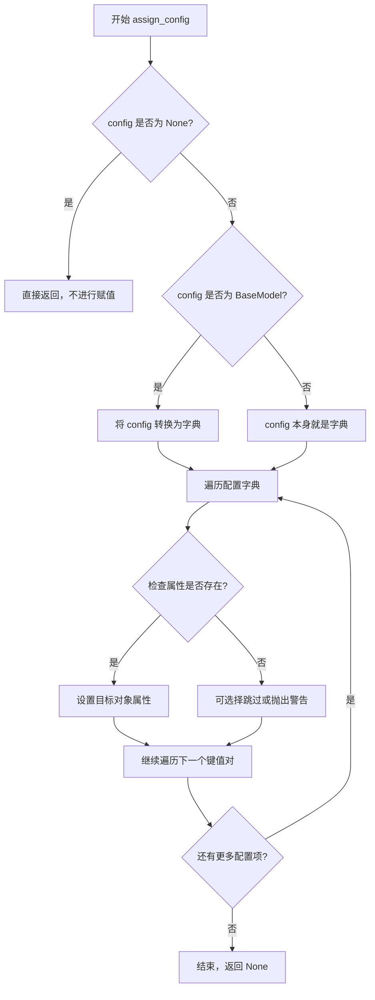
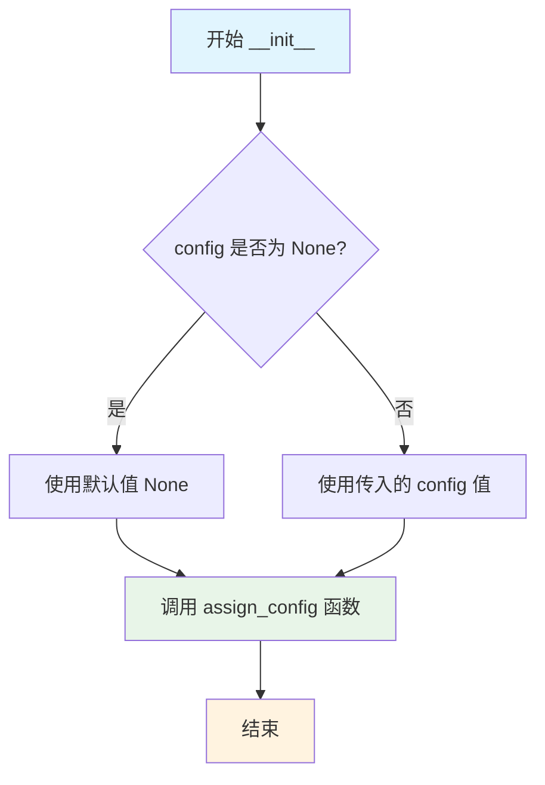
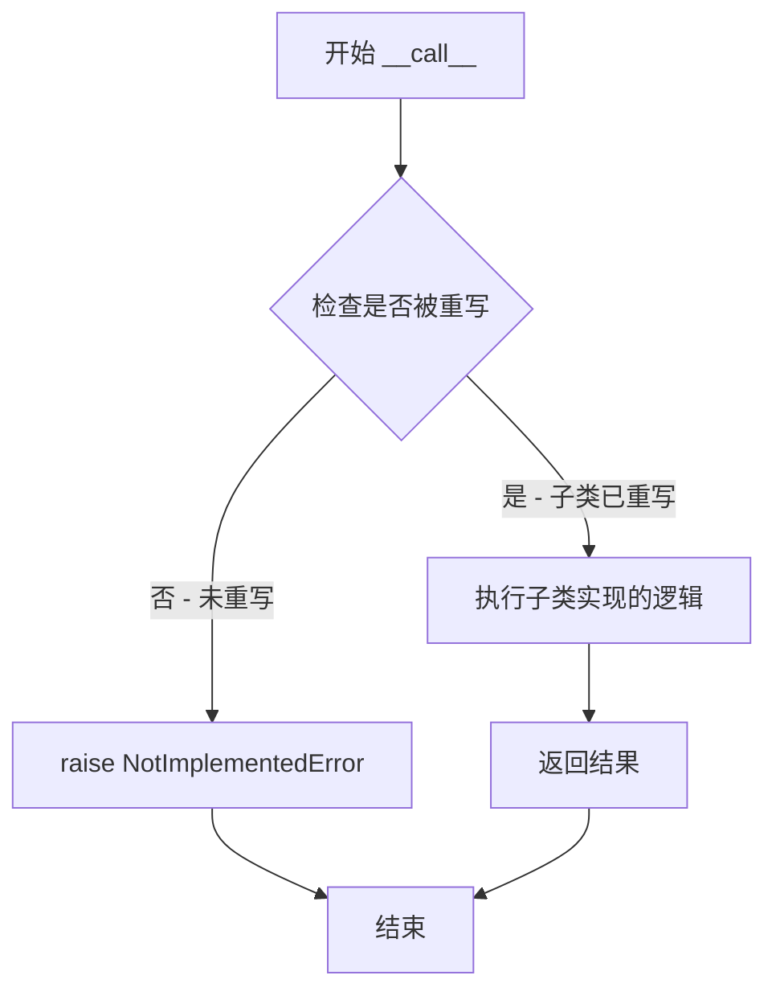

# `marker\marker\builders\__init__.py` 详细设计文档

这是一个基于Builder模式的抽象基类，通过配置初始化对象，并定义__call__方法作为子类的接口规范，用于统一构建流程。

## 整体流程

```mermaid
graph TD
    A[开始] --> B[创建BaseBuilder实例]
    B --> C{传入config?}
    C -- 是 --> D[调用assign_config配置实例]
    C -- 否 --> E[跳过配置]
    D --> F[实例化完成]
    E --> F
    F --> G{调用实例]
    G --> H{子类是否重写__call__?]
    H -- 否 --> I[抛出NotImplementedError]
    H -- 是 --> J[执行子类逻辑]
```

## 类结构

```
BaseBuilder (抽象基类)
    └── [子类实现，如: TextBuilder, ImageBuilder等]
```

## 全局变量及字段


### `BaseBuilder.config`
    
存储构建器的配置对象，可以是Pydantic BaseModel实例或字典类型

类型：`Optional[BaseModel | dict]`
    
    

## 全局函数及方法


### `assign_config`

该函数用于将配置对象（BaseModel实例或字典）安全地赋值给目标对象的配置属性，支持多种配置格式的自动处理和类型验证。

参数：

- `self`：任意对象，目标对象，用于接收配置属性
- `config`：`Optional[BaseModel | dict]`，配置对象，可以是Pydantic BaseModel实例、字典或None

返回值：`None`，该函数直接修改目标对象的属性，不返回任何值

#### 流程图



#### 带注释源码

```python
# 由于 marker.util 模块的源代码未提供，以下为基于使用方式的合理推断实现

def assign_config(self, config: Optional[BaseModel | dict] = None) -> None:
    """
    将配置对象赋值给目标对象的配置属性
    
    参数:
        self: 目标对象，通常是类的实例
        config: 配置对象，支持 BaseModel 实例或字典类型
    
    返回值:
        None: 直接修改对象属性，无返回值
    """
    # 如果配置为 None，直接返回，不进行任何操作
    if config is None:
        return
    
    # 如果配置是 BaseModel 实例，转换为字典
    if isinstance(config, BaseModel):
        config_dict = config.model_dump()
    # 如果配置已经是字典，直接使用
    elif isinstance(config, dict):
        config_dict = config
    else:
        # 处理其他不支持的类型
        raise TypeError(f"config must be BaseModel, dict, or None, got {type(config)}")
    
    # 遍历配置字典，将每个键值对设置为目标对象的属性
    for key, value in config_dict.items():
        # 使用 setattr 设置属性，允许动态属性赋值
        setattr(self, key, value)
    
    # 可选：保存原始配置对象供后续参考
    # self._config = config
```

#### 备注

由于源代码中仅提供了函数导入，未包含 `assign_config` 的实际实现，以上内容为基于该函数在 `BaseBuilder` 类中的使用方式进行的合理推断。实际实现可能包含更丰富的功能，如类型验证、属性存在性检查、配置默认值处理等。


### `BaseBuilder.__init__`

BaseBuilder 类的初始化方法，用于接收配置参数并通过 `assign_config` 函数将其分配给实例。

参数：

- `config`：`Optional[BaseModel | dict]`，可选的配置参数，可以是 Pydantic BaseModel 实例或字典对象，默认为 None

返回值：`None`，构造函数不返回值

#### 流程图



#### 带注释源码

```python
def __init__(self, config: Optional[BaseModel | dict] = None):
    """
    BaseBuilder 类的初始化方法。
    
    参数:
        config: 可选的配置参数，支持 Pydantic BaseModel 实例或字典类型。
                默认为 None，表示不传入任何配置。
    """
    # 调用 assign_config 函数将配置分配给当前实例
    # assign_config 函数负责解析 config 并将其属性绑定到 self
    assign_config(self, config)
```


### `BaseBuilder.__call__`

该方法是 `BaseBuilder` 类的可调用接口（`__call__` 魔术方法），允许类的实例像函数一样被调用。当前实现为抽象方法，仅抛出 `NotImplementedError` 异常，要求子类必须重写此方法以实现具体的业务逻辑。

参数：

- `data`：无类型标注，输入数据，表示调用时传递的主要数据对象
- `*args`：可变位置参数，用于接收任意数量的位置参数
- `**kwargs`：可变关键字参数，用于接收任意数量的关键字参数

返回值：`None`，无返回值（方法内部抛出异常）

#### 流程图



#### 带注释源码

```python
def __call__(self, data, *args, **kwargs):
    """
    使实例可调用的魔术方法。
    
    这是一个抽象方法声明，要求子类必须重写此方法。
    当前实现仅抛出 NotImplementedError，以强制子类实现具体逻辑。
    
    参数:
        data: 调用时传递的主要数据对象，具体类型取决于子类实现
        *args: 可变位置参数，传递额外的位置参数给子类方法
        **kwargs: 可变关键字参数，传递额外的关键字参数给子类方法
    
    返回:
        无返回值（隐式返回 None），但通常子类实现会返回相应结果
    
    异常:
        NotImplementedError: 当子类未重写此方法时抛出
    """
    raise NotImplementedError
```

## 关键组件


### BaseBuilder 类

核心构建器基类，定义了构建器的标准接口和配置管理机制。通过继承该类可以实现具体的构建逻辑，并支持通过 Pydantic 配置或字典进行参数配置。

### 配置管理机制

使用 `assign_config` 工具函数将配置对象（BaseModel 或字典）分配到构建器实例，支持灵活的配置注入和默认值处理。

### 抽象调用接口

通过 `__call__` 方法定义构建器的调用契约，所有子类必须实现具体的构建逻辑，当前实现抛出 NotImplementedError 表示抽象方法。

### 类型提示系统

使用 Python typing 模块的 Optional 泛型，支持 BaseModel 和 dict 两种配置类型，提供编译时类型检查和 IDE 自动补全。

### Pydantic 集成

依赖 pydantic 的 BaseModel 进行配置验证和类型转换，确保配置数据的有效性和类型安全。


## 问题及建议


### 已知问题

-   **抽象方法未使用装饰器**：`__call__` 方法抛出 `NotImplementedError`，应使用 `@abstractmethod` 装饰器明确为抽象方法
-   **类型注解不完整**：`__call__` 方法的参数 `data, *args, **kwargs` 缺少类型注解，返回值也缺少类型注解
-   **缺少文档字符串**：类和方法都缺少 docstring，代码可读性和可维护性差
-   **Python 版本兼容性问题**：使用 `BaseModel | dict` 语法（Python 3.10+），需考虑兼容更低版本
-   **config 参数类型处理**：虽然接受 `BaseModel | dict`，但未做类型校验或转换
-   **未定义 assign_config 依赖**：调用了 `marker.util.assign_config` 函数，但未在代码中体现其实现细节和潜在错误
-   **缺乏日志记录**：没有任何日志或调试信息，不利于生产环境排查问题

### 优化建议

-   使用 `@abstractmethod` 装饰 `__call__` 方法，强制子类实现
-   为所有方法和参数添加完整的类型注解，包括泛型支持
-   添加类和方法的 docstring，描述功能、参数和返回值
-   使用 `Union[BaseModel, dict]` 替代 `BaseModel | dict` 以兼容 Python 3.9
-   在 `__init__` 中添加 `config` 参数的类型校验和默认值处理
-   考虑添加日志记录或回调机制
-   可选实现 `__repr__`、`__eq__` 等基类方法增强调试能力


## 其它


### 设计目标与约束

BaseBuilder作为构建器模式的基础抽象类，旨在为子类提供统一的配置管理和调用接口。其核心约束包括：config参数必须是BaseModel实例或字典类型；子类必须实现__call__方法以实现具体的构建逻辑；该类采用混入模式，通过assign_config工具函数实现配置注入。

### 错误处理与异常设计

BaseBuilder的__call__方法默认抛出NotImplementedError，表示该方法为抽象方法，需由子类重写实现。当子类未重写该方法而直接调用实例时，会触发此异常，提示开发者需要在子类中实现具体的业务逻辑。

### 外部依赖与接口契约

该类依赖两个外部模块：1）pydantic.BaseModel，用于配置数据模型定义和验证；2）marker.util.assign_config函数，用于将配置对象绑定到类实例。调用方需确保config参数符合BaseModel结构或为有效的字典类型，否则可能导致配置注入失败。

### 配置管理机制

BaseBuilder通过构造方法接收可选的config参数，并调用assign_config进行配置分配。该机制允许在实例化时动态注入配置，支持BaseModel和dict两种配置格式，提供了灵活的配置管理方式。

### 扩展性与子类设计

该类为抽象基类，设计上要求子类继承并实现__call__方法。子类应遵循Liskov替换原则，确保实现后的方法签名兼容父类。配置管理机制会被自动继承，子类可通过self访问已注入的配置对象。

### 类型安全与泛型设计

类字段config声明为Optional[BaseModel | dict]类型，采用了Python 3.10+的联合类型语法。__call__方法参数使用*args和**kwargs实现泛化，允许子类自定义参数签名，提供了最大的扩展灵活性。


    