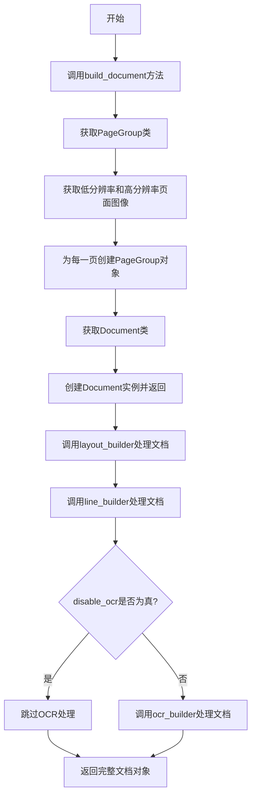
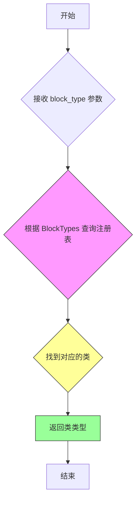
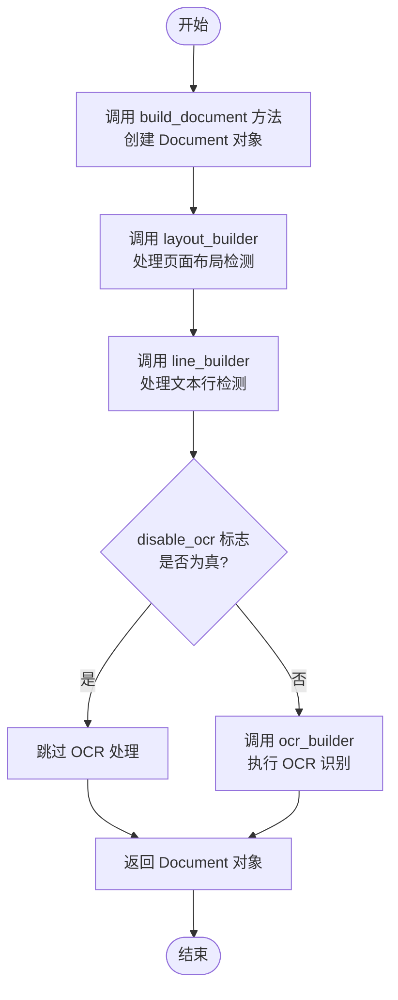
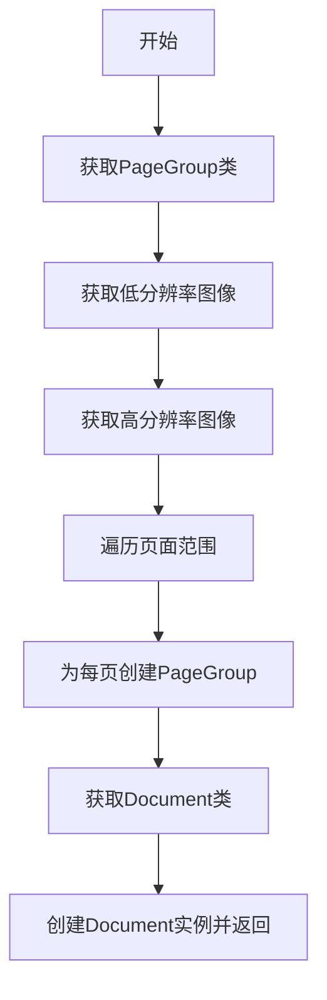

# `marker\marker\builders\document.py` 详细设计文档

DocumentBuilder类是一个文档构建器，用于从PDF提供商获取页面图像（高低分辨率），并通过布局构建器、线条构建器和OCR构建器处理文档，最终返回完整的Document对象。

## 整体流程



## 类结构

```
BaseBuilder (基类)
└── DocumentBuilder (文档构建器类)
```

## 全局变量及字段


### `BaseBuilder`
    
构建器基类，提供基础构建功能

类型：`class`
    


### `LayoutBuilder`
    
布局构建器，用于检测页面布局结构

类型：`class`
    


### `LineBuilder`
    
线条构建器，用于检测文本行

类型：`class`
    


### `OcrBuilder`
    
OCR构建器，用于光学字符识别

类型：`class`
    


### `PdfProvider`
    
PDF文档提供者，负责读取和处理PDF文件

类型：`class`
    


### `BlockTypes`
    
块类型枚举，定义文档中各种块的类型

类型：`enum`
    


### `Document`
    
文档类，表示完整的PDF文档结构

类型：`class`
    


### `PageGroup`
    
页面组类，表示PDF中的单个页面

类型：`class`
    


### `get_block_class`
    
根据块类型获取对应类的函数

类型：`function`
    


### `DocumentBuilder.lowres_image_dpi`
    
低分辨率页面图像的DPI设置，用于布局和线条检测

类型：`Annotated[int, 'DPI setting for low-resolution page images used for Layout and Line Detection.']`
    


### `DocumentBuilder.highres_image_dpi`
    
高分辨率页面图像的DPI设置，用于OCR识别

类型：`Annotated[int, 'DPI setting for high-resolution page images used for OCR.']`
    


### `DocumentBuilder.disable_ocr`
    
是否禁用OCR处理的标志

类型：`Annotated[bool, 'Disable OCR processing.']`
    
    

## 全局函数及方法


### `get_block_class`

根据给定的 `BlockTypes` 枚举值返回对应的类类型，用于在运行时动态获取 schema 中定义的各种 Block 元素类（如 Document、Page、Line 等）。

参数：

- `block_type`：`BlockTypes`，表示要获取的 Block 类型枚举值

返回值：`Type[Block]`，返回与给定 `BlockTypes` 对应的类类型

#### 流程图



#### 带注释源码

```python
# marker/schema/registry.py 中的函数原型
# （此函数在提供代码中被导入使用，但实现位于 marker/schema/registry.py 模块中）

def get_block_class(block_type: BlockTypes) -> Type[Block]:
    """
    根据 BlockTypes 枚举值获取对应的类类型。
    
    参数:
        block_type: BlockTypes 枚举值，指定要获取的 Block 类型
        
    返回值:
        对应的类类型，可用于实例化相应的 Block 对象
    """
    # 注册表映射逻辑，示例：
    # return _BLOCK_CLASS_REGISTRY[block_type]
    pass
```

#### 在 `DocumentBuilder` 中的实际使用示例

```python
# 在 DocumentBuilder.build_document() 方法中的调用

def build_document(self, provider: PdfProvider):
    # 根据 BlockTypes.Page 获取 PageGroup 类类型
    PageGroupClass: PageGroup = get_block_class(BlockTypes.Page)
    
    # 根据 BlockTypes.Document 获取 Document 类类型
    DocumentClass: Document = get_block_class(BlockTypes.Document)
    
    # 使用返回的类类型动态创建实例
    # ...
```

> **注意**：由于 `get_block_class` 函数的完整源码未在提供代码中显示，上述源码为基于导入路径 `from marker.schema.registry import get_block_class` 的合理推断。该函数采用注册表模式（Registry Pattern），根据传入的 `BlockTypes` 枚举值从内部映射表中返回对应的类类型。


### `DocumentBuilder.__call__`

该方法是 `DocumentBuilder` 类的核心调用入口，接收 PDF 提供者、布局构建器、线条构建器和 OCR 构建器作为参数，依次执行文档初始化、布局检测、线条检测和 OCR 识别（如未禁用），最终返回处理完成的 Document 对象。

参数：

- `provider`：`PdfProvider`，PDF 文档提供者，负责提供 PDF 文件的页面图像、边界框和元数据
- `layout_builder`：`LayoutBuilder`，布局构建器，用于检测页面的布局结构（如文本块、图像块等）
- `line_builder`：`LineBuilder`，线条构建器，用于检测文本行和排序
- `ocr_builder`：`OcrBuilder`，OCR 构建器，用于执行光学字符识别（如果未禁用）

返回值：`Document`，处理完成的文档对象，包含完整的页面结构、布局信息和识别文本

#### 流程图



#### 带注释源码

```python
def __call__(self, provider: PdfProvider, layout_builder: LayoutBuilder, line_builder: LineBuilder, ocr_builder: OcrBuilder):
    """
    执行完整的文档处理流程。
    
    处理流程包括：
    1. 创建初始文档对象
    2. 检测页面布局结构
    3. 检测并排序文本行
    4. 执行 OCR 识别（可选）
    
    参数:
        provider: PDF 文档提供者，提供页面图像和元数据
        layout_builder: 布局构建器，检测页面布局结构
        line_builder: 线条构建器，检测文本行
        ocr_builder: OCR 构建器，执行光学字符识别
    
    返回:
        处理完成的 Document 对象
    """
    # 第一步：创建初始文档对象，初始化页面信息
    document = self.build_document(provider)
    
    # 第二步：使用布局构建器检测页面布局结构
    layout_builder(document, provider)
    
    # 第三步：使用线条构建器检测文本行并进行排序
    line_builder(document, provider)
    
    # 第四步：根据配置决定是否执行 OCR 识别
    if not self.disable_ocr:
        # 执行 OCR 识别以提取文本内容
        ocr_builder(document, provider)
    
    # 返回处理完成的文档对象
    return document
```


### `DocumentBuilder.build_document`

该方法负责从PDF提供者处获取页面信息，生成低分辨率和高分辨率图像，并为每个页面创建PageGroup对象，最终组合成包含完整页面组的Document对象返回。

参数：

- `provider`：`PdfProvider`，PDF文档提供者

返回值：`Document`，初始化的文档对象（包含页面组）

#### 流程图



#### 带注释源码

```python
def build_document(self, provider: PdfProvider):
    # 从块类注册表中获取PageGroup类
    PageGroupClass: PageGroup = get_block_class(BlockTypes.Page)
    # 获取低分辨率图像，用于布局和线条检测
    lowres_images = provider.get_images(provider.page_range, self.lowres_image_dpi)
    # 获取高分辨率图像，用于OCR识别
    highres_images = provider.get_images(provider.page_range, self.highres_image_dpi)
    # 遍历页面范围，为每页创建PageGroup对象
    initial_pages = [
        PageGroupClass(
            page_id=p,                  # 页面ID
            lowres_image=lowres_images[i],    # 低分辨率图像
            highres_image=highres_images[i],  # 高分辨率图像
            polygon=provider.get_page_bbox(p),  # 页面边界框
            refs=provider.get_page_refs(p)       # 页面引用
        ) for i, p in enumerate(provider.page_range)
    ]
    # 从块类注册表中获取Document类
    DocumentClass: Document = get_block_class(BlockTypes.Document)
    # 创建Document实例并返回，包含文件路径和初始页面组
    return DocumentClass(filepath=provider.filepath, pages=initial_pages)
```

## 关键组件


### 低分辨率与高分辨率图像管理

该组件负责管理PDF页面的两种分辨率图像。代码中通过`lowres_image_dpi`和`highres_image_dpi`两个配置参数（分别为96和192 DPI）分别获取低分辨率用于布局和线条检测，高分辨率用于OCR识别。在`build_document`方法中通过`provider.get_images()`并行获取两组图像，并在PageGroup初始化时同时传入，实现图像资源的预加载和统一管理。

### 文档构建流水线

该组件实现了DocumentBuilder的核心业务流程，采用流水线模式依次调用三个构建器。首先通过`build_document`创建初始文档结构（包含页面组和图像），然后依次执行layout_builder（布局检测）、line_builder（线条检测）、ocr_builder（OCR识别，可选禁用），最终返回完整的Document对象。这种设计实现了构建逻辑的解耦和可扩展性。

### 页面组初始化

该组件负责在`build_document`方法中创建初始页面组。通过`get_block_class(BlockTypes.Page)`获取PageGroup类，并使用列表推导式遍历`provider.page_range`，为每个页面创建包含page_id、低分辨率图像、高分辨率图像、多边形边界框（polygon）和页面引用（refs）的PageGroup对象。这一过程实现了PDF页面信息到内部文档结构的转换。

### 构建器调度机制

该组件通过`__call__`方法实现统一的构建器调度接口。接收provider和三个builder实例作为参数，按照固定顺序依次调用各构建器处理文档，其中OCR构建器可根据`disable_ocr`标志位动态跳过。这种设计允许灵活配置构建流程，支持只进行布局和线条检测而不执行OCR的场景。


## 问题及建议


### 已知问题

- **内存占用风险**：在 `build_document` 方法中同时加载低分辨率和高分辨率图像，对于大型 PDF 文件可能导致内存溢出
- **缺乏错误处理**：所有 builder 调用和 provider 方法均未捕获异常，缺乏必要的容错机制
- **图像资源未释放**：获取的图像对象缺少显式的资源释放或上下文管理，可能导致内存泄漏
- **类型注解不精确**：多处使用 `PageGroup` 和 `Document` 作为类型注解但实际赋值的是类对象（如 `PageGroupClass`），语义不清晰
- **硬编码调用顺序**：`__call__` 方法中三个 builder 的调用顺序固定，缺乏灵活配置能力
- **缺少日志记录**：没有任何日志输出，难以追踪调试和问题排查

### 优化建议

- **实现图像懒加载**：采用生成器模式或按需加载，避免一次性将所有页面图像加载到内存
- **添加异常处理**：为关键操作添加 try-except 块，实现合理的降级策略或重试机制
- **使用上下文管理器**：通过 `with` 语句或 `__enter__/__exit__` 管理图像资源生命周期
- **优化类型注解**：使用 `type` 关键字创建类型别名，或直接使用 `type[PageGroup]` 而非运行时类对象
- **解耦 builder 调用**：将 builder 列表化或配置化，支持通过参数调整处理流程和顺序
- **引入日志框架**：使用 `logging` 模块记录关键节点和异常信息，提升可观测性
- **考虑增量处理**：对于多页文档，可考虑流式处理模式，分批构建页面而非全量加载

## 其它


### 设计目标与约束

本模块的设计目标是构建一个可扩展的PDF文档处理流水线，支持布局检测、文本行识别和OCR光学字符识别功能。核心约束包括：1) 必须依赖PdfProvider提供PDF页面数据；2) 图像分辨率必须在合理范围内（lowres 96dpi，highres 192dpi）；3) OCR功能可选择性禁用以提升性能；4) 支持通过page_range进行页面过滤处理。

### 错误处理与异常设计

代码中未显式处理异常，主要依赖底层组件的错误传播。潜在异常包括：provider.get_images()可能抛出文件读取异常或图像格式不支持异常；get_block_class()在BlockTypes.Page或BlockTypes.Document不存在时抛出KeyError；provider.get_page_bbox()和get_page_refs()可能返回空值导致初始化失败。建议增加异常捕获机制，特别是对图像获取失败和页面数据缺失的情况进行容错处理。

### 数据流与状态机

数据流如下：Provider提供原始PDF数据 → build_document()创建初始Document对象（含PageGroup列表）→ layout_builder检测布局 → line_builder检测文本行 → ocr_builder执行光学字符识别。状态转换顺序固定，无分支状态机设计。Document对象从空pages列表逐步填充layout、lines、ocr_results等数据。

### 外部依赖与接口契约

主要外部依赖包括：PdfProvider（提供PDF文件路径、页面范围、图像和元数据）；LayoutBuilder（接收Document和Provider，输出布局数据）；LineBuilder（接收Document和Provider，输出行数据）；OcrBuilder（接收Document和Provider，输出OCR文本）；get_block_class()函数（根据BlockTypes枚举获取具体类）。接口契约要求Provider必须实现get_images()、page_range属性、filepath属性、get_page_bbox()、get_page_refs()方法。

### 性能考虑

性能优化点：低分辨率图像（96dpi）用于快速布局检测；高分辨率图像（192dpi）仅用于OCR；可通过disable_ocr标志完全跳过OCR处理。建议增加批处理图像获取、优化PageGroup列表推导式的惰性计算、以及考虑使用生成器模式处理大量页面。

### 资源管理

图像内存管理：lowres_images和highres_images在build_document()中同时加载到内存，大型PDF可能导致内存峰值。建议实现图像的惰性加载或流式处理。Provider的生命周期管理由调用方控制，DocumentBuilder不负责资源释放。

### 并发和线程安全

当前实现为同步单线程处理，无并发保护。若在多线程环境使用，需确保Provider、Builder实例的线程隔离。当前设计未考虑并发访问Document对象的线程安全性。

### 配置管理

配置通过类属性定义：lowres_image_dpi、highres_image_dpi、disable_ocr。使用了Annotated进行类型提示和描述注释。建议将DPI值提取为可配置的常量类，并增加更多可配置参数如并发处理数、内存限制等。

### 测试策略

建议测试场景：1) 正常流程构建完整文档；2) disable_ocr=True跳过OCR；3) 空page_range处理；4) Provider异常情况模拟；5) 不同DPI设置下的图像质量验证；6) 大型PDF文件的内存使用测试。

### 监控和日志

当前代码无日志记录和监控埋点。建议增加：构建各阶段的耗时日志；图像获取失败和OCR跳过的警告日志；处理页面数量的统计指标。

### 版本兼容性

依赖marker包的版本兼容性：需要确保marker.schema.BlockTypes枚举包含Page和Document；marker.providers.pdf.PdfProvider接口稳定；get_block_class()函数签名一致。建议在文档中明确标记依赖版本要求。

### 可扩展性设计

设计模式采用Builder模式，便于扩展新的处理阶段。增加新功能只需创建新的Builder类并调用。BlockTypes枚举可扩展支持新的块类型。当前架构支持流水线式的处理器添加，具有良好的可扩展性。

    