# `marker\marker\builders\layout.py` 详细设计文档

一个PDF布局检测构建器，通过Surya布局模型检测PDF页面布局并将结果合并到文档中，同时支持强制布局类型和布局块扩展功能。

## 整体流程

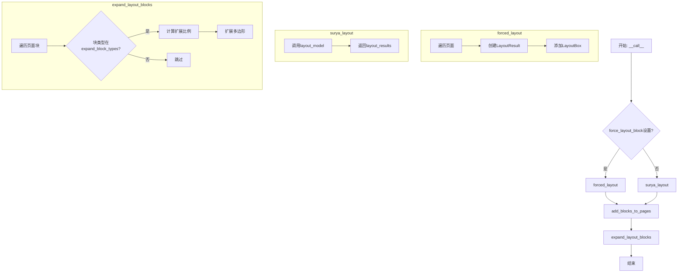

## 类结构

```
BaseBuilder (基类)
└── LayoutBuilder
```

## 全局变量及字段


### `settings`
    
全局配置对象，提供应用级别的设置和配置参数

类型：`object`
    


### `LayoutBuilder.layout_model`
    
布局预测器实例，用于执行PDF页面布局检测

类型：`LayoutPredictor`
    


### `LayoutBuilder.layout_batch_size`
    
布局模型批次大小，默认为None使用模型默认批次大小

类型：`Annotated[int, str]`
    


### `LayoutBuilder.force_layout_block`
    
强制布局块类型，设置后跳过布局检测并将每页作为指定块类型处理

类型：`Annotated[str, str]`
    


### `LayoutBuilder.disable_tqdm`
    
禁用进度条，控制是否显示tqdm进度条

类型：`Annotated[bool, str]`
    


### `LayoutBuilder.expand_block_types`
    
需要扩展的块类型列表，用于扩展边界以容纳缺失区域

类型：`Annotated[List[BlockTypes], str]`
    


### `LayoutBuilder.max_expand_frac`
    
最大扩展比例，布局框边界扩展的最大分数值

类型：`Annotated[float, str]`
    
    

## 全局函数及方法


### `get_block_class`

该函数是注册表查找函数，根据传入的 BlockTypes 枚举值返回对应的块类（Block Class），用于在布局检测后将 LayoutBox 转换为具体的文档块对象。

参数：

- `block_type`：`BlockTypes`（枚举类型），表示要获取的块类型，如 `BlockTypes.Picture`、`BlockTypes.Text`、`BlockTypes.Table` 等

返回值：`type`（类类型），返回与给定 BlockType 关联的具体块类，用于实例化块对象

#### 流程图

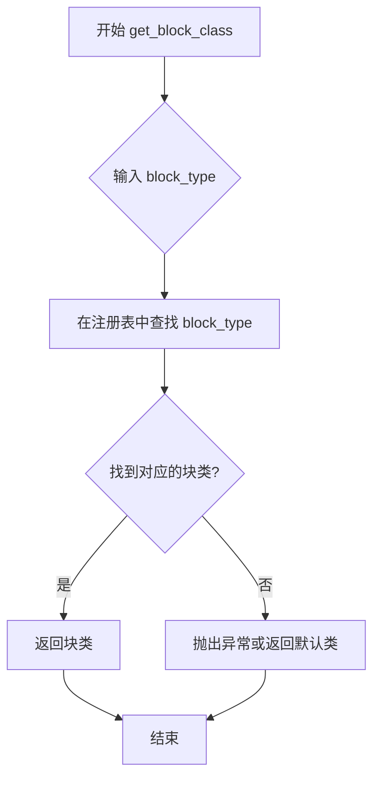

#### 带注释源码

```python
# 从 marker.schema.registry 模块导入的全局注册函数
# 使用方式如下：

# 在 LayoutBuilder.add_blocks_to_pages 方法中调用
block_cls = get_block_class(BlockTypes[bbox.label])

# 这里的 BlockTypes[bbox.label] 是从布局结果中获取标签
# 然后将其转换为 BlockTypes 枚举值
# 最后通过 get_block_class 获取对应的块类

# 示例调用流程：
# 1. bbox.label = "Picture"  # 从布局模型返回的标签
# 2. BlockTypes["Picture"]   # 转换为 BlockTypes.Picture 枚举
# 3. get_block_class(BlockTypes.Picture)  # 获取 PictureBlock 类
# 4. block_cls = <class 'marker.schema.blocks.PictureBlock'>  # 返回类对象

# 随后使用返回的类创建块实例：
# layout_block = page.add_block(block_cls, PolygonBox(polygon=bbox.polygon))
```

#### 补充说明

| 项目 | 详情 |
|------|------|
| **函数位置** | `marker/schema/registry.py`（导入来源） |
| **调用场景** | 在 `LayoutBuilder.add_blocks_to_pages` 中，将布局检测结果（LayoutBox）转换为文档块对象 |
| **注册机制** | 块类通常通过装饰器或显式注册方式将 BlockTypes 枚举值映射到具体类 |
| **相关枚举** | `BlockTypes` 定义了支持的块类型：Text、Picture、Table、Figure、Title、Formula、ComplexRegion 等 |
| **设计模式** | 注册表模式（Registry Pattern）/ 工厂模式（Factory Pattern） |


### `LayoutBuilder.surya_layout`

该方法使用 Surya 布局预测模型对 PDF 页面进行布局检测，将页面图像传递给布局模型并获取预测的布局结果（包含文本块、图像、表格等元素的边界框和类型信息）。

参数：

- `pages`：`List[PageGroup]`，需要检测布局的页面列表，每个页面元素包含页面图像和元数据

返回值：`List[LayoutResult]`，布局检测结果列表，每个结果包含页面图像边界框、布局框列表以及页面是否被切割的标志

#### 流程图

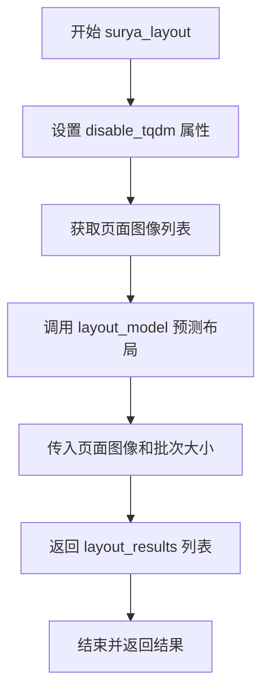

#### 带注释源码

```python
def surya_layout(self, pages: List[PageGroup]) -> List[LayoutResult]:
    """
    使用 Surya 布局模型对页面进行布局检测
    
    参数:
        pages: 页面组列表，每个 PageGroup 包含页面的图像和元数据
        
    返回:
        LayoutResult 列表，每个结果包含检测到的布局框信息
    """
    # 根据 disable_tqdm 设置禁用或启用进度条
    self.layout_model.disable_tqdm = self.disable_tqdm
    
    # 将页面转换为图像列表
    # get_image(highres=False) 获取低分辨率图像用于布局检测
    page_images = [p.get_image(highres=False) for p in pages]
    
    # 调用 Surya 布局预测器的 __call__ 方法
    # batch_size 控制每批处理的页面数量，提高推理效率
    layout_results = self.layout_model(
        page_images,
        batch_size=int(self.get_batch_size()),
    )
    
    # 返回布局检测结果
    return layout_results
```

---

### `LayoutBuilder.__init__`

构造函数，初始化布局构建器，接收 Surya 布局预测器模型实例并调用基类初始化方法。

参数：

- `layout_model`：`LayoutPredictor`，Surya 布局预测器模型实例，用于对 PDF 页面进行布局检测
- `config`：`可选参数`，配置字典，传递给基类 BaseBuilder 的配置参数，默认为 None

返回值：无（构造函数）

#### 流程图

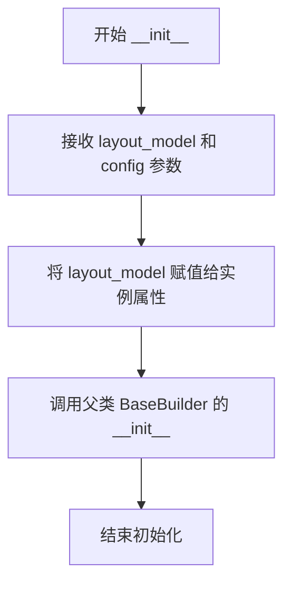

#### 带注释源码

```python
def __init__(self, layout_model: LayoutPredictor, config=None):
    """
    初始化布局构建器
    
    参数:
        layout_model: Surya LayoutPredictor 模型实例
                     用于执行页面布局检测（识别文本、图像、表格等区域）
        config: 可选的配置字典，会传递给父类 BaseBuilder
    """
    # 存储布局预测器模型引用
    self.layout_model = layout_model
    
    # 调用父类构造函数进行基类初始化
    # BaseBuilder 可能包含共享的配置逻辑
    super().__init__(config)
```

---

### `LayoutBuilder.get_batch_size`

根据配置和硬件设备返回适合的布局模型批处理大小，用于优化推理性能和内存使用。

参数：无（仅使用实例属性和设置）

返回值：`int`，批处理大小数值

#### 流程图

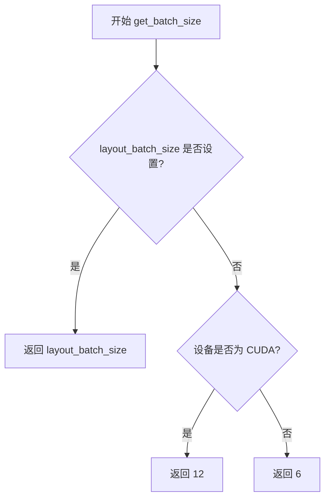

#### 带注释源码

```python
def get_batch_size(self):
    """
    获取布局模型推理的批处理大小
    
    批处理大小的选择策略:
    - 如果显式设置 layout_batch_size，使用该值
    - CUDA 设备使用较大的批次(12)以提高吞吐量
    - CPU 或其他设备使用较小的批次(6)避免内存不足
    
    返回:
        int: 推荐的批处理大小
    """
    # 优先使用用户配置的批处理大小
    if self.layout_batch_size is not None:
        return self.layout_batch_size
    # CUDA 设备优化：使用更大的批次
    elif settings.TORCH_DEVICE_MODEL == "cuda":
        return 12
    # CPU 默认：使用较小的批次确保稳定性
    return 6
```


### `PolygonBox.from_bbox`

从给定的边界框（bbox）创建一个多边形框（PolygonBox）对象。

参数：

- `bbox`：参数类型取决于 `LayoutResult.image_bbox` 的类型（通常是列表或元组），表示用于创建多边形框的边界框数据

返回值：`PolygonBox`，返回创建的多边形框对象

#### 流程图

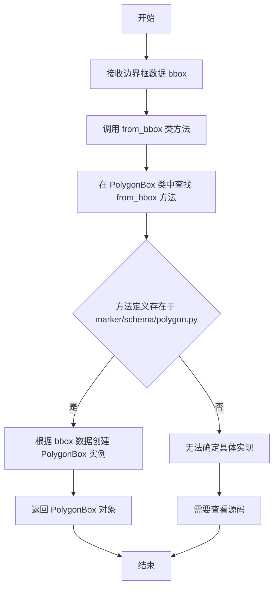

#### 带注释源码

```python
# 该方法的实际定义在 marker/schema/polygon.py 文件中
# 根据代码中的使用方式推断的调用方式：

# 用法示例（来自 LayoutBuilder.add_blocks_to_pages 方法）：
layout_page_size = PolygonBox.from_bbox(layout_result.image_bbox).size

# 参数说明：
# layout_result: LayoutResult 对象，来自 surya.layout 的布局检测结果
# layout_result.image_bbox: 图像边界框，用于表示整个页面的边界
# from_bbox: 类方法，用于从边界框创建 PolygonBox 对象
# .size: 访问创建的多边形框的尺寸属性

# 返回的 PolygonBox 对象支持以下操作（根据代码推断）：
# - .size: 获取多边形框的尺寸
# - .width: 获取宽度
# - .height: 获取高度
# - .expand(): 扩展多边形框
# - .rescale(): 重新缩放
# - .fit_to_bounds(): 适应边界
# - .minimum_gap(): 计算最小间隙
```

> **注意**：提供的代码片段中没有包含 `PolygonBox` 类的完整定义（该类定义在 `marker/schema/polygon.py` 中）。从代码中的使用方式来看，`from_bbox` 是一个类方法（class method），接受边界框数据作为输入，返回一个 `PolygonBox` 对象实例。如需获取更详细的实现信息，建议查看 `marker/schema/polygon.py` 源文件。


### `BlockTypes`

BlockTypes 是一个枚举类，定义了 PDF 文档中不同类型的布局块（如图片、图表、表格、文本等），用于在布局检测结果中标识每个块的类型。

#### 流程图

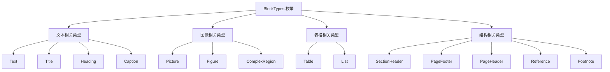

#### 带注释源码

```python
# 从 marker.schema 模块导入的枚举类
# 定义了 PDF 文档中所有可能的布局块类型
from marker.schema import BlockTypes

# BlockTypes 枚举的典型成员（根据代码使用推断）:
# - BlockTypes.Picture: 图片块
# - BlockTypes.Figure: 图表/图形块
# - BlockTypes.ComplexRegion: 复杂区域块
# - BlockTypes.Text: 文本块
# - BlockTypes.Title: 标题块
# - BlockTypes.Heading: 标题（章节标题）
# - BlockTypes.Caption: 标题/说明
# - BlockTypes.Table: 表格块
# - BlockTypes.List: 列表块
# - BlockTypes.SectionHeader: 章节标题
# - BlockTypes.PageFooter: 页脚
# - BlockTypes.PageHeader: 页眉
# - BlockTypes.Reference: 引用
# - BlockTypes.Footnote: 脚注

# 代码中使用示例：
expand_block_types: Annotated[
    List[BlockTypes],
    "需要扩展边界的块类型列表",
] = [
    BlockTypes.Picture,      # 图片块
    BlockTypes.Figure,       # 图表块
    BlockTypes.ComplexRegion, # 复杂区域块
]

# 通过字符串名称访问枚举成员
block_cls = get_block_class(BlockTypes[bbox.label])

# 获取所有有效的枚举成员名称
layout_block.top_k = {
    BlockTypes[label]: prob
    for (label, prob) in bbox.top_k.items()
    if label in BlockTypes.__members__
}
```


### `LayoutBuilder.__init__`

该方法是`LayoutBuilder`类的构造函数，负责初始化布局检测构建器。它接收布局检测模型和可选配置参数，将模型赋值给实例变量，并调用父类的初始化方法完成整体初始化流程。

参数：

- `layout_model`：`LayoutPredictor`， Surya布局检测模型实例，用于对PDF页面进行布局分析
- `config`：可选的配置对象，传递给父类`BaseBuilder`的初始化参数，默认为`None`

返回值：`None`，该方法不返回任何值，仅完成对象状态的初始化

#### 流程图

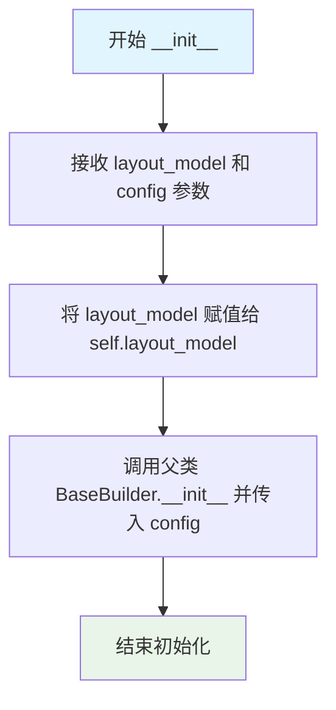

#### 带注释源码

```python
def __init__(self, layout_model: LayoutPredictor, config=None):
    """
    初始化 LayoutBuilder 实例。
    
    参数:
        layout_model: LayoutPredictor 类型，Surya布局检测模型，用于识别PDF页面的布局结构
        config: 可选参数，传递给父类 BaseBuilder 的配置对象，默认值为 None
    """
    # 将传入的布局模型赋值给实例变量，供后续方法使用
    self.layout_model = layout_model

    # 调用父类 BaseBuilder 的 __init__ 方法，完成继承的初始化逻辑
    super().__init__(config)
```


### `LayoutBuilder.__call__`

该方法是`LayoutBuilder`类的核心调用入口，用于对PDF页面执行布局检测并将结果合并到文档中。它根据配置选择强制布局或使用Surya布局模型进行检测，然后调用相关方法将布局块添加到页面并扩展布局块。

参数：

- `self`：`LayoutBuilder`，LayoutBuilder类的实例，包含布局模型配置和参数
- `document`：`Document`，待处理的PDF文档对象，包含页面信息和结构
- `provider`：`PdfProvider`，PDF提供者，用于获取页面内容（当前方法中未直接使用）

返回值：`None`，该方法直接修改document对象，不返回任何值

#### 流程图

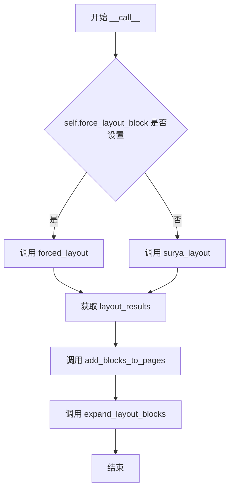

#### 带注释源码

```python
def __call__(self, document: Document, provider: PdfProvider):
    """
    执行布局检测并将结果合并到文档中。
    
    参数:
        document: Document对象，包含待处理的PDF页面
        provider: PdfProvider对象，提供PDF内容（当前未直接使用）
    
    返回:
        None，直接修改document对象的内部结构
    """
    # 判断是否使用强制布局模式
    if self.force_layout_block is not None:
        # 强制布局模式：将每页的全部内容分配为单一的布局类型
        layout_results = self.forced_layout(document.pages)
    else:
        # 正常布局模式：使用Surya布局模型进行检测
        layout_results = self.surya_layout(document.pages)
    
    # 将检测到的布局块添加到页面的文档结构中
    self.add_blocks_to_pages(document.pages, layout_results)
    
    # 扩展特定类型的布局块边界（如图片、图表等）
    self.expand_layout_blocks(document)
```


### `LayoutBuilder.get_batch_size`

该方法用于动态确定布局模型推理时的批次大小，优先使用用户配置的批处理大小，若未配置则根据当前计算设备类型返回默认值（CUDA 设备返回 12，CPU 设备返回 6）。

参数：
- 无

返回值：`int`，返回布局模型推理时使用的批次大小

#### 流程图

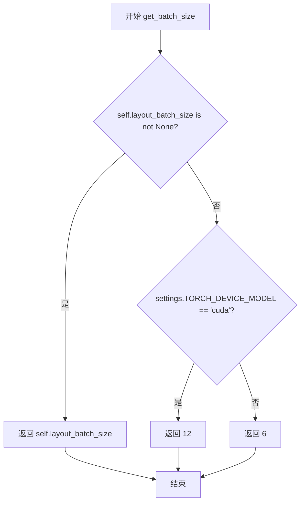

#### 带注释源码

```python
def get_batch_size(self):
    """
    获取布局模型的批次大小。
    
    优先级：
    1. 如果实例属性 layout_batch_size 已配置，直接返回该值
    2. 如果当前设备是 CUDA（GPU），返回 12
    3. 否则（CPU 设备），返回 6
    
    Returns:
        int: 布局模型推理时的批次大小
    """
    # 检查用户是否显式配置了批次大小
    if self.layout_batch_size is not None:
        return self.layout_batch_size
    # CUDA 设备可以使用更大的批次大小以提高吞吐量
    elif settings.TORCH_DEVICE_MODEL == "cuda":
        return 12
    # CPU 设备使用较小的默认值以避免内存问题
    return 6
```

#### 关键组件信息

| 组件名称 | 描述 |
|---------|------|
| `layout_batch_size` | 实例属性，用户配置的批处理大小，可覆盖默认值 |
| `settings.TORCH_DEVICE_MODEL` | 全局设置项，用于判断当前运行环境是 CUDA 还是 CPU |

#### 潜在的技术债务或优化空间

1. **硬编码的批次大小数值**：12 和 6 是硬编码的默认值，缺乏配置灵活性。建议将这些值提取到配置文件或构造函数参数中，使其可通过外部配置调整。

2. **设备判断逻辑简单**：仅通过字符串 `"cuda"` 判断设备类型，无法覆盖更多场景（如 Apple Silicon 的 MPS、CPU 推理等）。可考虑使用更健壮的设备检测逻辑。

3. **缺乏自适应批次大小机制**：当前实现是静态的，无法根据实际运行时内存使用情况或性能动态调整批次大小。可考虑引入启发式算法或运行时探测来优化批次大小。


### `LayoutBuilder.forced_layout`

该方法用于在强制布局模式下，为每个页面生成一个统一的布局结果。它将整个页面的多边形区域作为一个单一的布局框（LayoutBox）处理，标签由 `force_layout_block` 指定，适用于需要跳过实际布局检测、直接将所有页面归类为特定类型的场景。

参数：

- `pages`：`List[PageGroup]`，需要处理的页面列表，每个元素为一个 PageGroup 对象

返回值：`List[LayoutResult]`，布局结果列表，每个元素对应一个页面的布局信息

#### 流程图

```mermaid
flowchart TD
    A[开始 forced_layout] --> B[初始化空列表 layout_results]
    B --> C{遍历 pages 中的每个 page}
    C -->|是| D[创建 LayoutResult]
    D --> E[设置 image_bbox = page.polygon.bbox]
    E --> F[创建 LayoutBox]
    F --> G[设置 label = self.force_layout_block]
    G --> H[设置 position = 0]
    H --> I[设置 top_k = {self.force_layout_block: 1}]
    I --> J[设置 polygon = page.polygon.polygon]
    J --> K[设置 sliced = False]
    K --> L[将 LayoutResult 添加到 layout_results]
    L --> C
    C -->|否| M[返回 layout_results]
```

#### 带注释源码

```python
def forced_layout(self, pages: List[PageGroup]) -> List[LayoutResult]:
    """
    强制布局方法，用于在 force_layout_block 被设置时为每个页面生成统一的布局结果。
    
    参数:
        pages: PageGroup 对象列表，代表要处理的页面
    
    返回:
        LayoutResult 列表，每个元素包含一个页面的布局信息
    """
    layout_results = []  # 初始化结果列表
    for page in pages:  # 遍历每个页面
        layout_results.append(
            LayoutResult(
                image_bbox=page.polygon.bbox,  # 使用页面的边界框作为图像边界框
                bboxes=[
                    LayoutBox(
                        label=self.force_layout_block,  # 使用强制指定的布局类型作为标签
                        position=0,  # 位置为0，表示第一个/主要块
                        top_k={self.force_layout_block: 1},  # 最高置信度为1.0
                        polygon=page.polygon.polygon,  # 使用页面的完整多边形区域
                    ),
                ],
                sliced=False,  # 标记为未切片，因为整个页面作为一个块
            )
        )
    return layout_results  # 返回布局结果列表
```


### `LayoutBuilder.surya_layout`

使用 Surya 布局模型对传入的页面列表进行布局检测，将页面图像传递给模型并返回布局结果列表。

参数：

- `pages`：`List[PageGroup]` - 需要进行布局检测的页面列表，每个元素为 `PageGroup` 类型

返回值：`List[LayoutResult]` - 布局检测结果列表，包含每个页面的布局框、标签等信息

#### 流程图

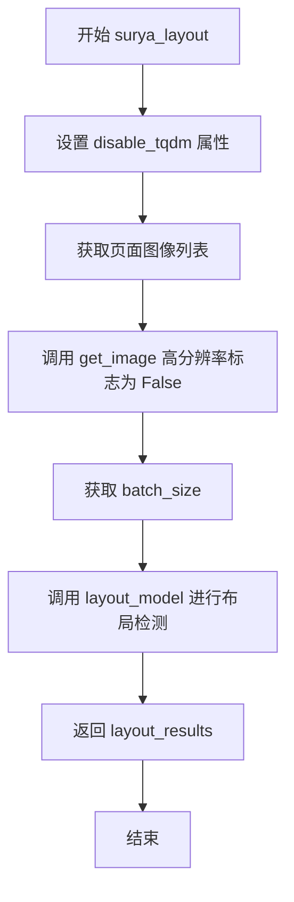

#### 带注释源码

```python
def surya_layout(self, pages: List[PageGroup]) -> List[LayoutResult]:
    """
    使用 Surya 布局模型对页面进行布局检测
    
    参数:
        pages: 页面组列表，每个 PageGroup 代表一个 PDF 页面
        
    返回值:
        LayoutResult 列表，包含每个页面的布局检测结果
    """
    # 设置布局模型的 tqdm 进度条显示状态
    self.layout_model.disable_tqdm = self.disable_tqdm
    
    # 准备页面图像：将每个页面转换为图像
    # get_image(highres=False) 获取低分辨率图像用于布局检测
    page_images = [p.get_image(highres=False) for p in pages]
    
    # 获取批处理大小：根据配置或设备类型确定
    batch_size = int(self.get_batch_size())
    
    # 调用布局预测模型进行布局检测
    # LayoutPredictor 会分析图像中的文本、表格、图像等区域
    layout_results = self.layout_model(page_images, batch_size=batch_size)
    
    # 返回布局结果列表
    return layout_results
```


### `LayoutBuilder.expand_layout_blocks`

该方法用于扩展特定布局块（如图片、图表和复杂区域）的边界，使其能够容纳可能遗漏的内容区域，通过计算与周围块的最小间距来动态调整扩展比例。

参数：

- `document`：`Document`，包含所有页面和块的文档对象，用于访问页面结构和块信息

返回值：`None`，该方法直接修改文档中块的polygon属性，不返回任何值

#### 流程图

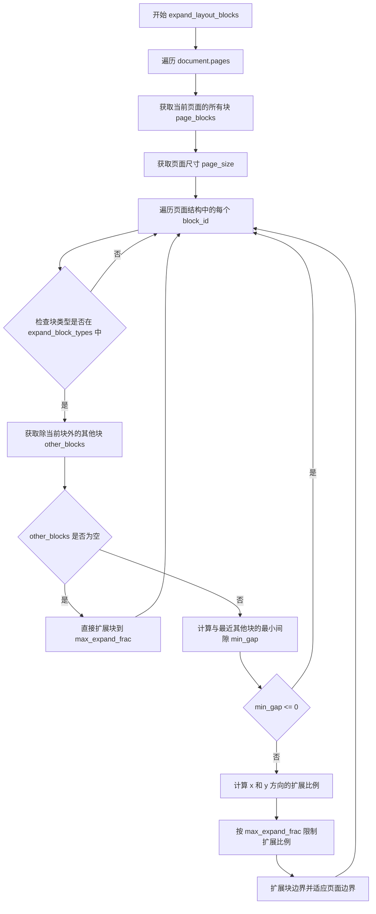

#### 带注释源码

```python
def expand_layout_blocks(self, document: Document):
    """
    扩展特定布局块的边界以容纳可能遗漏的内容区域。
    
    该方法遍历文档中的每个页面，对指定类型的块（如图片、图表、复杂区域）
    进行边界扩展。扩展幅度基于与周围块的最小间距，同时受最大扩展比例限制。
    
    参数:
        document: Document对象，包含所有页面和块的完整文档结构
    """
    # 遍历文档中的所有页面
    for page in document.pages:
        # 收集当前页面上的所有块为PolygonBox列表，便于后续访问
        # page.structure 包含该页面所有块的ID列表
        page_blocks = [document.get_block(bid) for bid in page.structure]
        
        # 获取页面的尺寸，用于边界限制
        page_size = page.polygon.size

        # 遍历页面结构中的每个块ID
        for block_id in page.structure:
            # 从文档中获取具体的块对象
            block = document.get_block(block_id)
            
            # 检查当前块的类型是否在需要扩展的类型列表中
            # expand_block_types 包含: Picture, Figure, ComplexRegion
            if block.block_type in self.expand_block_types:
                # 过滤获取除当前块之外的其他所有块
                other_blocks = [b for b in page_blocks if b != block]
                
                # 如果页面上没有其他块，则直接将当前块扩展到最大比例
                if not other_blocks:
                    block.polygon = block.polygon.expand(
                        self.max_expand_frac, self.max_expand_frac
                    ).fit_to_bounds((0, 0, *page_size))
                    continue

                # 计算当前块与所有其他块的最小间距
                # minimum_gap 方法计算两个多边形之间的最小距离
                min_gap = min(
                    block.polygon.minimum_gap(other.polygon)
                    for other in other_blocks
                )
                
                # 如果最小间距小于等于0，说明块之间重叠或接触，不需要扩展
                if min_gap <= 0:
                    continue

                # 计算x方向的扩展比例（基于块宽度）
                x_expand_frac = (
                    min_gap / block.polygon.width if block.polygon.width > 0 else 0
                )
                
                # 计算y方向的扩展比例（基于块高度）
                y_expand_frac = (
                    min_gap / block.polygon.height
                    if block.polygon.height > 0
                    else 0
                )

                # 应用扩展：取实际计算比例和最大扩展比例中的较小值
                # 这样既填满了空白区域，又不会过度扩展
                block.polygon = block.polygon.expand(
                    min(self.max_expand_frac, x_expand_frac),
                    min(self.max_expand_frac, y_expand_frac),
                # 确保扩展后的边界不超过页面范围
                ).fit_to_bounds((0, 0, *page_size))
```


### `LayoutBuilder.add_blocks_to_pages`

该方法负责将布局检测结果转换为文档中的实际块。它遍历每个页面的布局结果，对检测到的布局框进行排序，实例化相应的块类，将块添加到页面中，并调整块的多边形边界以适应页面尺寸，同时保留布局模型的分类置信度。

参数：

- `self`：`LayoutBuilder`，当前 LayoutBuilder 实例
- `pages`：`List[PageGroup]`，PDF 文档的页面列表，每个元素代表一个页面
- `layout_results`：`List[LayoutResult]`， Surya 布局模型产生的布局检测结果列表，与页面一一对应

返回值：`None`，该方法直接修改传入的页面对象，不返回任何值

#### 流程图

```mermaid
flowchart TD
    A[开始 add_blocks_to_pages] --> B[遍历 pages 和 layout_results 的配对]
    B --> C[获取 layout_page_size 和 provider_page_size]
    C --> D[设置 page.layout_sliced = layout_result.sliced]
    D --> E[对 layout_result.bboxes 按 position 排序]
    E --> F{遍历排序后的每个 bbox}
    F -->|下一个 bbox| G[block_cls = get_block_class(BlockTypes[bbox.label])]
    G --> H[layout_block = page.add_block]
    H --> I[layout_block.polygon.rescale 并 fit_to_bounds]
    I --> J[设置 layout_block.top_k 概率]
    J --> K[page.add_structure 添加到结构]
    K --> F
    F -->|遍历结束| L{page.structure 是否为空?}
    L -->|是| M[page.structure = []]
    L -->|否| N{page.children 是否为空?}
    M --> N
    N -->|是| O[page.children = []]
    N -->|否| P[处理下一页或结束]
    O --> P
```

#### 带注释源码

```python
def add_blocks_to_pages(
    self, pages: List[PageGroup], layout_results: List[LayoutResult]
):
    """
    将布局检测结果添加到页面中，创建对应的文档块
    
    参数:
        pages: PDF 文档的页面列表
        layout_results: 布局模型检测结果列表，与页面一一对应
    """
    # 遍历每个页面及其对应的布局结果
    for page, layout_result in zip(pages, layout_results):
        # 从布局结果的图像边界框创建多边形，获取布局检测时的页面尺寸
        layout_page_size = PolygonBox.from_bbox(layout_result.image_bbox).size
        # 获取当前 PDF 提供者的实际页面尺寸
        provider_page_size = page.polygon.size
        
        # 记录布局模型是否对页面进行了切片处理
        page.layout_sliced = (
            layout_result.sliced
        )  # This indicates if the page was sliced by the layout model
        
        # 遍历该页面的所有布局边界框，按位置排序确保按从上到下的顺序处理
        for bbox in sorted(layout_result.bboxes, key=lambda x: x.position):
            # 根据布局框的标签（如 Text、Image 等）从注册表获取对应的块类
            block_cls = get_block_class(BlockTypes[bbox.label])
            
            # 在页面上创建新的块，使用布局框的多边形作为初始几何信息
            layout_block = page.add_block(
                block_cls, PolygonBox(polygon=bbox.polygon)
            )
            
            # 将布局检测时的多边形尺寸缩放到实际 PDF 页面尺寸，并限制在页面边界内
            layout_block.polygon = layout_block.polygon.rescale(
                layout_page_size, provider_page_size
            ).fit_to_bounds((0, 0, *provider_page_size))
            
            # 从布局结果中复制每种块类型的置信度概率，过滤掉不在 BlockTypes 枚举中的类型
            layout_block.top_k = {
                BlockTypes[label]: prob
                for (label, prob) in bbox.top_k.items()
                if label in BlockTypes.__members__
            }
            
            # 将新创建的块添加到页面的结构列表中
            page.add_structure(layout_block)

        # 确保页面结构列表已初始化（避免后续访问空列表）
        if page.structure is None:
            page.structure = []

        # 确保页面子元素列表已初始化
        if page.children is None:
            page.children = []
```

## 关键组件


### 布局检测 (Layout Detection)

使用 Surya 的 LayoutPredictor 对 PDF 页面进行布局检测，识别页面中的不同区域类型（如文本、图像、表格等），并将结果转换为布局块添加到文档中。

### 惰性图像加载 (Lazy Image Loading)

通过 `page.get_image(highres=False)` 方法实现惰性加载，只在需要时才加载页面图像，避免一次性加载所有高分辨率图像导致的内存压力。

### 布局块扩展 (Layout Block Expansion)

针对图片、图表、复杂区域等块类型，根据与周围块的最小间距动态扩展其边界，确保这些视觉元素不会被裁剪。

### 强制布局模式 (Forced Layout Mode)

通过 `force_layout_block` 参数跳过实际的布局检测，强制将整个页面作为指定的块类型处理，适用于已知布局结构的场景。

### 批次大小管理 (Batch Size Management)

根据设备类型（CUDA vs CPU）自动调整布局模型的批次大小，CUDA 设备使用 12 的批次大小，CPU 使用 6，以提高推理效率。

### 块类型识别与映射 (Block Type Recognition)

通过 `get_block_class` 函数将布局模型的标签映射为内部块类型，并使用 `top_k` 字典存储各类型置信度分数。

### 多页面处理流程 (Multi-page Processing)

支持批量处理多个页面，将布局结果逐页添加到文档中，同时处理页面被切片（sliced）的特殊情况。

### 多边形边界处理 (Polygon Boundary Handling)

使用 `PolygonBox` 类进行多边形操作，包括缩放、边界拟合、最小间隙计算等功能，确保布局块精确贴合页面坐标。


## 问题及建议


### 已知问题

- **硬编码的批次大小**：在 `get_batch_size` 方法中，CUDA 设备使用 12，其他使用 6，这些魔数未通过配置参数化，降低了灵活性。
- **重复计算性能开销**：在 `expand_layout_blocks` 方法的循环中，每次迭代都重新计算 `page_blocks`（第67行获取页面所有块的列表），应在循环外预先计算一次。
- **低效的列表过滤**：第71行每次循环都通过列表推导式创建新的 `other_blocks` 列表，可使用生成器或预先构建集合优化。
- **边界条件处理不完整**：`expand_layout_blocks` 中对宽度或高度为 0 的块进行除法计算时，虽然有 `> 0` 检查，但 `minimum_gap` 返回值的边界情况未明确处理。
- **错误处理不足**：`add_blocks_to_pages` 中通过 `BlockTypes[bbox.label]` 访问枚举时，若 label 不存在会抛出 `KeyError`，缺乏优雅的错误处理或日志记录。
- **重复的边界检查**：第101和104行对 `page.structure` 和 `page.children` 的 `None` 检查可在更高层级统一处理，避免在每次页面处理时重复执行。

### 优化建议

- 将 `get_batch_size` 中的硬编码值提取为 `BaseBuilder` 配置参数或环境变量。
- 将 `page_blocks` 的计算移至 `expand_layout_blocks` 外层循环，只在处理每个页面时计算一次。
- 使用 `filter` 或预计算的方式减少 `other_blocks` 的重复创建开销。
- 为 `BlockTypes` 访问添加 try-except 包装或预先验证 label 有效性，并记录无法识别的布局标签。
- 将页面结构初始化的空值检查移至 `PageGroup` 构造函数或统一的初始化逻辑中。
- 考虑为 `expand_layout_blocks` 中的几何计算添加更详细的日志，便于调试边界扩展行为。

## 其它


### 设计目标与约束

**设计目标**：
1. 实现PDF页面的自动化布局检测，识别页面中的不同内容区域（如文本、图像、表格等）
2. 提供灵活的布局检测策略，支持使用Surya模型检测或强制指定布局类型
3. 将布局检测结果转换为文档中的块结构，并支持块的边界扩展以容纳缺失区域

**设计约束**：
1. 依赖外部Surya布局模型（LayoutPredictor），模型的可用性和准确性直接影响本模块功能
2. expand_block_types默认仅包含Picture、Figure、ComplexRegion，不包括组类型（因为它们是后续注入的）
3. max_expand_frac最大扩展比例限制为0.05（5%），防止过度扩展导致块重叠
4. 批量处理大小受设备类型限制：CUDA设备默认12，CPU设备默认6

### 错误处理与异常设计

**异常处理机制**：
1. **模型调用异常**：在surya_layout方法中，如果布局模型调用失败，异常会向上传播调用者处理
2. **块类型不存在**：使用get_block_class根据BlockTypes获取块类，如果标签不在BlockTypes.__members__中会被过滤掉
3. **空页面处理**：在add_blocks_to_pages中，如果page.structure或page.children为None，会初始化为空列表
4. **几何计算异常**：在expand_layout_blocks中，当block.polygon.width或height为0时，扩展分数设为0避免除零错误
5. **最小间隙为0**：当min_gap <= 0时，跳过该块的扩展操作

**边界条件处理**：
1. 强制布局模式下，即使页面为空也会创建一个覆盖整个页面的LayoutBox
2. 布局结果为空的页面仍会确保structure和children被初始化

### 数据流与状态机

**数据流**：
```
Document + PdfProvider
    │
    ▼
┌─────────────────────────────────────┐
│  __call__                          │
│  (判断force_layout_block是否设置)   │
└─────────────────────────────────────┘
    │
    ├──▶ forced_layout() ──▶ List<LayoutResult>
    │                          (每个页面一个强制布局结果)
    │
    └──▶ surya_layout() ──▶ List<LayoutResult>
                               (调用模型预测布局)
    │
    ▼
┌─────────────────────────────────────┐
│  add_blocks_to_pages()              │
│  (将LayoutResult转换为Block并       │
│   添加到PageGroup的structure中)     │
└─────────────────────────────────────┘
    │
    ▼
┌─────────────────────────────────────┐
│  expand_layout_blocks()             │
│  (根据min_gap扩展特定类型块的边界)  │
└─────────────────────────────────────┘
    │
    ▼
   Document (已更新)
```

**状态转换**：
- 初始状态：Document.pages包含PageGroup，但structure和children可能为空
- 布局检测后：每个PageGroup的structure填充了Block对象
- 块扩展后：特定类型块的polygon边界被扩展

### 外部依赖与接口契约

**外部依赖**：
1. **surya.layout.LayoutPredictor**：布局检测模型，负责分析页面图像并返回布局结果
2. **surya.layout.schema.LayoutResult**：布局结果数据结构，包含图像边界框和检测到的布局框列表
3. **surya.layout.schema.LayoutBox**：单个布局块的数据结构，包含标签、位置、多边形和top_k概率
4. **marker.builders.BaseBuilder**：构建器基类，提供基础配置管理功能
5. **marker.providers.pdf.PdfProvider**：PDF提供者，负责提供PDF页面内容
6. **marker.schema.document.Document**：文档模型，包含页面集合和块管理功能
7. **marker.schema.groups.page.PageGroup**：页面组，表示单个PDF页面
8. **marker.schema.polygon.PolygonBox**：多边形边界框，用于表示页面和块的几何形状
9. **marker.schema.registry.get_block_class**：根据BlockTypes获取对应块类的注册函数
10. **marker.settings.settings**：全局设置，包含TORCH_DEVICE_MODEL等配置

**接口契约**：
1. **__call__(document: Document, provider: PdfProvider)**：主入口方法，接收文档和PDF提供者，执行完整布局流程
2. **get_batch_size()**：返回模型批量处理大小，根据设备类型动态调整
3. **forced_layout(pages: List[PageGroup])**：强制布局方法，返回指定类型的布局结果列表
4. **surya_layout(pages: List[PageGroup])**：模型布局方法，调用Surya模型进行布局检测
5. **expand_layout_blocks(document: Document)**：扩展布局块方法，根据间隙调整块边界
6. **add_blocks_to_pages(pages, layout_results)**：将布局结果转换为块并添加到页面

### 性能考虑

1. **批量处理**：布局模型支持批量处理，batch_size根据设备类型动态调整（CUDA: 12, CPU: 6）
2. **图像分辨率**：在surya_layout中使用get_image(highres=False)获取低分辨率图像，减少模型推理时间
3. **进度条控制**：通过disable_tqdm控制是否显示tqdm进度条，减少I/O开销
4. **几何计算优化**：在expand_layout_blocks中使用列表推导式和生成器表达式减少内存占用

### 配置管理

1. **layout_batch_size**：可选配置，覆盖默认批量大小
2. **force_layout_block**：可选配置，强制所有页面使用指定布局类型
3. **disable_tqdm**：可选配置，控制进度条显示
4. **expand_block_types**：可配置的可扩展块类型列表
5. **max_expand_frac**：可配置的最大扩展比例

### 并发与线程安全

1. **模型线程安全**：LayoutPredictor的实例化在__init__中完成，调用时可能被多线程共享，需确保模型本身是线程安全的
2. **文档修改**：add_blocks_to_pages和expand_layout_blocks会修改Document对象的状态，不支持并发调用

### 测试策略建议

1. **单元测试**：针对forced_layout、surya_layout、expand_layout_blocks、add_blocks_to_pages等方法编写独立测试
2. **集成测试**：测试完整的__call__流程，验证布局结果正确添加到文档
3. **边界测试**：测试空页面、单个块、极小/极大页面尺寸等边界情况
4. **配置测试**：测试不同配置组合（如force_layout_block与expand_block_types的交互）

### 监控与日志

1. **tqdm进度条**：在模型推理过程中显示进度（可通过disable_tqdm禁用）
2. **page.layout_sliced标志**：记录页面是否被布局模型切片，供后续处理参考
3. **top_k概率**：存储每个布局块的分类概率，供下游任务使用

    