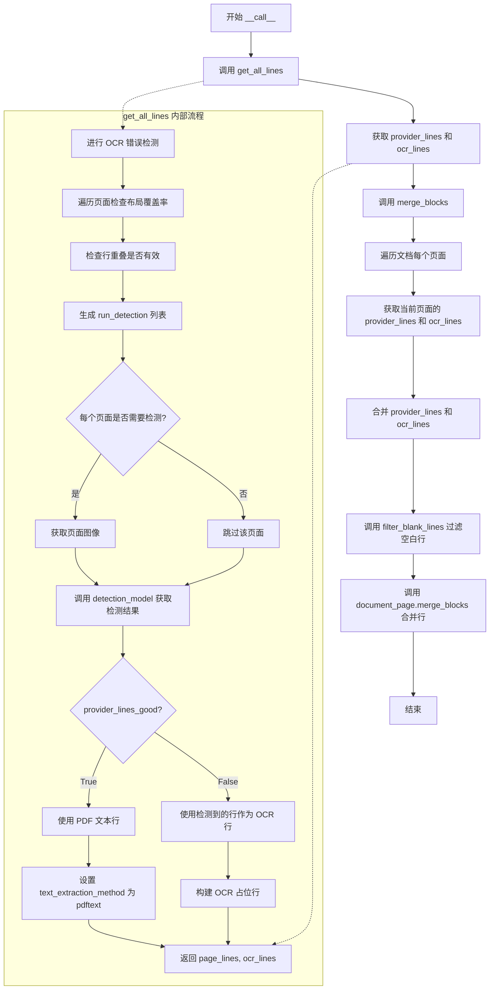
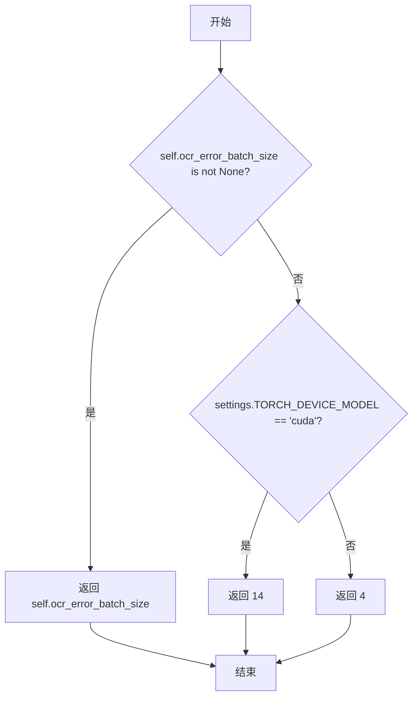
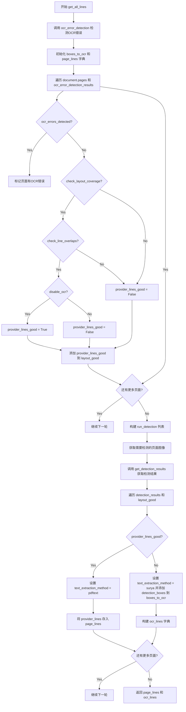
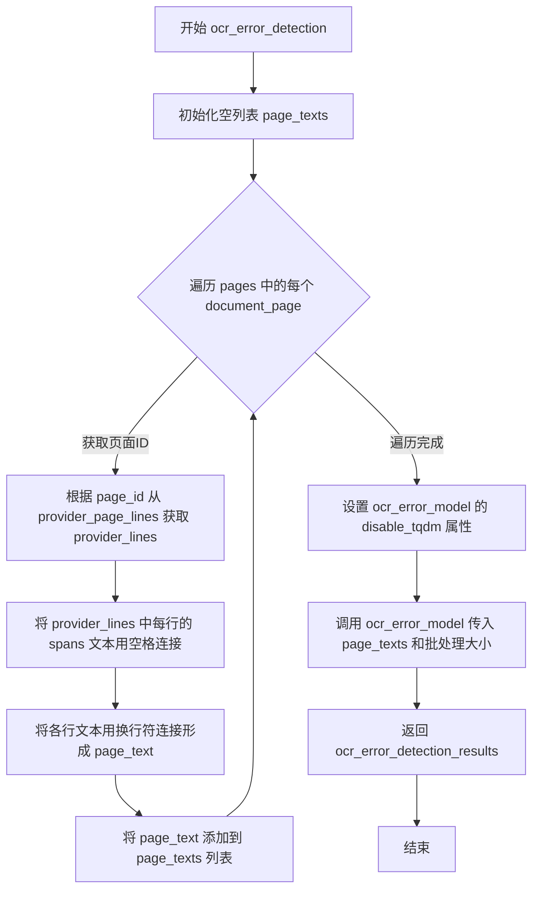
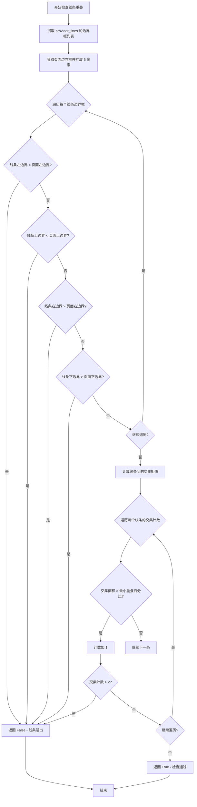
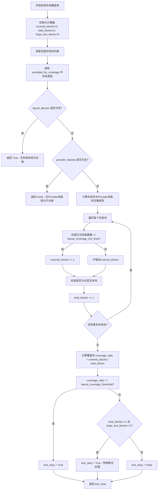
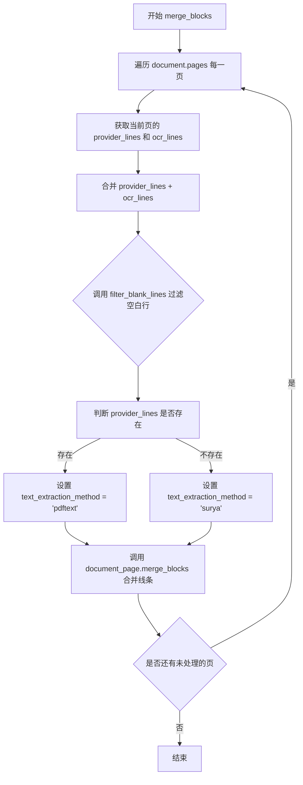

# `marker\marker\builders\line.py` 详细设计文档

LineBuilder是文档处理管道中的文本行检测构建器。它负责整合来自PDF解析器(Provider)的布局文本行和来自Surya OCR模型的检测文本行。核心逻辑是通过布局覆盖率检查和OCR错误检测来决定使用何种文本源，最终将合并后的文本行注入到Document对象中。

## 整体流程

```mermaid
graph TD
    Start[接收 Document 和 PdfProvider] --> OCRError[运行 OCRErrorPredictor 检查文本质量]
    OCRError --> LoopPages{遍历页面}
    LoopPages --> CheckLayout[检查布局覆盖率和线条重叠]
    CheckLayout --> IsGood{布局是否有效?}
    IsGood -- 是 --> MarkPDF[标记为 PDFText]
    IsGood -- 否 --> MarkSurya[标记为 Surya OCR]
    MarkPDF --> NextPage1[下一页]
    MarkSurya --> NextPage1
    NextPage1 --> DetectPages{还有页面?}
    DetectPages -- 是 --> GetImg[获取需OCR的页面图片]
    DetectPages -- 否 --> RunDetection[运行 DetectionPredictor (Surya)]
    GetImg --> RunDetection
    RunDetection --> ConvertBoxes[将检测框转换为OCR线条]
    ConvertBoxes --> FilterBlank[过滤空白行]
    FilterBlank --> Merge[调用 merge_blocks 合并到 Document]
    Merge --> End
```

## 类结构

```
BaseBuilder (抽象基类)
└── LineBuilder (文本行检测与合并)
```

## 全局变量及字段


### `LineBuilder.detection_batch_size`
    
检测模型批大小，用于控制每次推理的图像数量，提升性能与内存管理

类型：`Annotated[int, "The batch size to use for the detection model.", "Default is None, which will use the default batch size for the model."]`
    


### `LineBuilder.ocr_error_batch_size`
    
OCR错误检测模型批大小，控制OCR错误检测时的批量处理数量

类型：`Annotated[int, "The batch size to use for the ocr error detection model.", "Default is None, which will use the default batch size for the model."]`
    


### `LineBuilder.layout_coverage_min_lines`
    
布局覆盖的最少行数，定义Provider线条需要覆盖的最小布局块数量

类型：`Annotated[int, "The minimum number of PdfProvider lines that must be covered by the layout model", "to consider the lines from the PdfProvider valid."]`
    


### `LineBuilder.layout_coverage_threshold`
    
布局覆盖率阈值，用于判断Provider线条是否满足布局覆盖率要求

类型：`Annotated[float, "The minimum coverage ratio required for the layout model to consider", "the lines from the PdfProvider valid."]`
    


### `LineBuilder.min_document_ocr_threshold`
    
文档级OCR触发阈值，低于此比例的好页面数将触发全文OCR

类型：`Annotated[float, "If less pages than this threshold are good, OCR will happen in the document. Otherwise it will not."]`
    


### `LineBuilder.provider_line_provider_line_min_overlap_pct`
    
Provider线条最小重叠百分比，用于检测线条之间的重叠程度

类型：`Annotated[float, "The percentage of a provider line that has to be covered by a detected line"]`
    


### `LineBuilder.excluded_for_coverage`
    
排除在布局检查外的块类型列表，用于过滤不参与覆盖率计算的块类型

类型：`Annotated[Tuple[BlockTypes], "A list of block types to exclude from the layout coverage check."]`
    


### `LineBuilder.ocr_remove_blocks`
    
OCR前需移除的块类型，指定在进行OCR检测前要从页面图像中去除的块

类型：`Tuple[BlockTypes, ...]`
    


### `LineBuilder.disable_tqdm`
    
是否禁用进度条，控制是否显示模型推理过程中的进度条

类型：`Annotated[bool, "Disable tqdm progress bars."]`
    


### `LineBuilder.disable_ocr`
    
是否禁用OCR，设置为True时仅使用Provider提供的线条

类型：`Annotated[bool, "Disable OCR for the document. This will only use the lines from the provider."]`
    


### `LineBuilder.keep_chars`
    
是否保留单字符，控制是否在输出中保留字符级别的信息

类型：`Annotated[bool, "Keep individual characters."]`
    


### `LineBuilder.detection_line_min_confidence`
    
检测线条最低置信度，用于过滤低置信度的检测结果

类型：`Annotated[float, "Minimum confidence for a detected line to be included"]`
    


### `LineBuilder.detection_model`
    
Surya检测模型实例，用于检测页面文本行

类型：`DetectionPredictor`
    


### `LineBuilder.ocr_error_model`
    
Surya OCR错误检测模型实例，用于判断Provider提取的文本是否存在OCR错误

类型：`OCRErrorPredictor`
    
    

## 全局函数及方法


### `LineBuilder.__init__`

构造函数，初始化检测模型和OCR错误检测模型，并调用父类构造函数进行配置设置。

参数：

- `self`：隐式参数，LineBuilder实例本身
- `detection_model`：`DetectionPredictor`，用于检测文本行的模型
- `ocr_error_model`：`OCRErrorPredictor`，用于检测OCR错误的模型
- `config`：任意类型，配置参数，默认为None

返回值：`None`，构造函数无返回值

#### 流程图

```mermaid
flowchart TD
    A[开始 __init__] --> B[调用父类BaseBuilder.__init__(config)]
    B --> C[设置self.detection_model = detection_model]
    C --> D[设置self.ocr_error_model = ocr_error_model]
    D --> E[结束 __init__]
```

#### 带注释源码

```python
def __init__(
    self,
    detection_model: DetectionPredictor,
    ocr_error_model: OCRErrorPredictor,
    config=None,
):
    """
    初始化LineBuilder实例
    
    参数:
        detection_model: 用于文本行检测的模型
        ocr_error_model: 用于检测OCR错误的模型
        config: 可选的配置参数
    """
    # 调用父类BaseBuilder的构造函数，传递配置参数
    # 父类会处理配置的初始化工作
    super().__init__(config)

    # 将传入的检测模型赋值给实例变量
    # 该模型用于检测PDF页面中的文本行
    self.detection_model = detection_model
    
    # 将传入的OCR错误检测模型赋值给实例变量
    # 该模型用于判断PDF提供商提供的文本是否存在OCR错误
    self.ocr_error_model = ocr_error_model
```


### `LineBuilder.__call__`

主入口方法，执行文本行检测与合并。通过检测模型识别文本行，并与PDF提供商的行进行合并，最终输出包含完整文本行的文档结构。

参数：

- `document`：`Document`，待处理的文档对象，包含页面信息和结构
- `provider`：`PdfProvider`，PDF提供者，提供页面行信息和页面数据

返回值：`None`，无直接返回值，结果通过修改 `document` 对象的页面内容实现

#### 流程图



#### 带注释源码

```python
def __call__(self, document: Document, provider: PdfProvider):
    """
    主入口方法，执行文本行检测与合并
    
    工作流程：
    1. 获取所有行（provider_lines 来自PDF文本，ocr_lines 来自OCR/检测模型）
    2. 合并这些行到文档的页面中
    
    参数:
        document: Document对象，包含要处理的文档结构
        provider: PdfProvider对象，提供PDF文本行和页面信息
    
    返回:
        None，结果通过修改document对象实现
    """
    
    # 禁用内联检测（当布局模型未检测到任何公式时）
    # 同时当不使用内联检测时（不使用LLM时）也禁用
    # 获取所有行：provider_lines（PDF文本行）和 ocr_lines（OCR/检测识别的行）
    provider_lines, ocr_lines = self.get_all_lines(document, provider)
    
    # 将获取的行合并到文档的页面块结构中
    # provider_lines: 来自PDF提供商的文本行
    # ocr_lines: 来自OCR或检测模型的行
    self.merge_blocks(document, provider_lines, ocr_lines)
```

#### 详细说明

**核心逻辑**：

1. **行获取阶段** (`get_all_lines`)：
   - 首先进行OCR错误检测，判断页面文本质量
   - 对每个页面检查布局覆盖率（layout_coverage）和行重叠有效性
   - 根据检查结果决定是否需要运行检测模型
   - 如果PDF文本行质量好（通过覆盖率检查），则使用PDF文本；否则使用检测模型识别的行

2. **行合并阶段** (`merge_blocks`)：
   - 遍历文档的每个页面
   - 合并来自PDF和OCR的行
   - 过滤空白行（可能来自无效的检测框或不可见文本）
   - 调用页面块的 `merge_blocks` 方法完成最终合并

**设计决策**：

- **双重行源**：同时支持PDF文本提取和OCR检测，优先使用高质量的PDF文本
- **质量检查**：通过OCR错误检测和布局覆盖率检查确保使用高质量的文本源
- **空白过滤**：过滤无效的检测结果，提高最终输出质量


### `LineBuilder.get_detection_batch_size`

获取检测模型批大小，根据设备调整。如果用户没有指定批大小，则根据设备类型返回默认批大小：CUDA设备返回10，CPU设备返回4。

参数：

- `self`：`LineBuilder`，隐式参数，指向当前LineBuilder实例

返回值：`int`，返回检测模型的批大小

#### 流程图


#### 带注释源码

```python
def get_detection_batch_size(self):
    """
    获取检测模型的批大小，根据设备自动调整
    
    Returns:
        int: 检测模型的批大小
    """
    # 如果用户已显式设置批大小，则返回用户设置的值
    if self.detection_batch_size is not None:
        return self.detection_batch_size
    # 如果使用CUDA设备，返回较大的批大小10以提高吞吐量
    elif settings.TORCH_DEVICE_MODEL == "cuda":
        return 10
    # CPU设备使用较小的批大小4以避免内存问题
    return 4
```

#### 相关配置信息

- **类字段 `detection_batch_size`**：`Annotated[int, "The batch size to use for the detection model.", "Default is None, which will use the default batch size for the model."]`，用户可配置的检测模型批大小，默认为None

- **全局设置 `settings.TORCH_DEVICE_MODEL`**：来自marker.settings模块，表示当前设备类型（"cuda"或"cpu"）


### `LineBuilder.get_ocr_error_batch_size`

获取 OCR 错误模型的批大小。如果已配置了 `ocr_error_batch_size`，则使用该值；否则根据设备类型返回默认批大小（CUDA 设备为 14，其他设备为 4）。

参数： 无（仅包含 `self` 参数）

返回值：`int`，OCR 错误模型的批大小

#### 流程图



#### 带注释源码

```python
def get_ocr_error_batch_size(self):
    # 检查是否在类初始化时显式设置了 ocr_error_batch_size
    if self.ocr_error_batch_size is not None:
        # 如果已设置，直接返回配置的批大小
        return self.ocr_error_batch_size
    # 检查当前设备是否为 CUDA（GPU）
    elif settings.TORCH_DEVICE_MODEL == "cuda":
        # CUDA 设备使用较大的默认批大小 14 以提高吞吐量
        return 14
    # CPU 设备使用较小的默认批大小 4 以节省内存
    return 4
```


### `LineBuilder.get_detection_results`

该方法负责调度文本行检测模型。它接收需要检测的页面图像列表和一个布尔标志位列表，根据标志位调用 `detection_model` 对图像进行推理，并将原始检测结果（包含文本框位置和置信度）按照文档页码顺序组装成最终结果列表返回，其中不需要检测的页面位置填充为 `None`。

参数：
- `page_images`：`List[Image.Image]`，需要运行检测模型进行文本行检测的页面图像列表。
- `run_detection`：`List[bool]`，布尔标志位列表，其长度对应文档总页数，`True` 表示对应页面需要运行检测，`False` 表示使用 Provider 提供的文本行（无需检测）。

返回值：`List[Optional[DetectionResult]]`，检测结果列表。其长度与 `run_detection` 列表长度一致。对于 `run_detection` 中为 `True` 的索引位置，保存模型输出的检测结果（文本框坐标、置信度等）；对于 `False` 的位置，保存 `None`。

#### 流程图

```mermaid
flowchart TD
    A[开始 get_detection_results] --> B[设置 detection_model.disable_tqdm]
    B --> C[调用 detection_model 预测 page_images]
    C --> D[初始化空列表 detection_results 和索引 idx]
    E{遍历 run_detection} -->|good == True| F[从 page_detection_results 取结果]
    F --> G[detection_results.append(结果)]
    G --> H[idx += 1]
    H --> E
    E -->|good == False| I[detection_results.append(None)]
    I --> E
    E --> J{遍历结束?}
    J -->|是| K[断言 idx == len(page_images)]
    K --> L[返回 detection_results]
```

#### 带注释源码

```python
def get_detection_results(
    self, page_images: List[Image.Image], run_detection: List[bool]
):
    # 1. 配置检测模型：控制是否显示进度条
    self.detection_model.disable_tqdm = self.disable_tqdm
    
    # 2. 执行检测推理：仅对需要检测的页面（run_detection 为 True）调用模型
    # 返回的列表长度等于 page_images 的长度，即 sum(run_detection)
    page_detection_results = self.detection_model(
        images=page_images, batch_size=self.get_detection_batch_size()
    )

    # 3. 断言：验证模型返回的结果数量与请求检测的页面数量一致
    assert len(page_detection_results) == sum(run_detection)
    
    # 4. 准备结果容器：用于存放最终结果，长度需与文档总页数一致
    detection_results = []
    idx = 0
    
    # 5. 重建结果列表：根据 run_detection 标志位，将检测结果映射回原页面位置
    for good in run_detection:
        if good:
            # 如果该页面需要检测，则取出对应的检测结果
            detection_results.append(page_detection_results[idx])
            idx += 1
        else:
            # 如果该页面不需要检测（使用 Provider Lines），则填充 None 占位
            detection_results.append(None)
            
    # 6. 断言：确保所有检测结果都已消费
    assert idx == len(page_images)

    # 7. 断言：确保最终列表长度与页面列表长度一致
    assert len(run_detection) == len(detection_results)
    return detection_results
```


### `LineBuilder.get_all_lines`

获取所有页面线条（Provider或OCR），核心决策逻辑是判断是否使用Provider的线条，还是需要通过OCR检测来获取线条。如果Provider的线条通过布局覆盖率和重叠检查，则使用Provider的线条；否则使用OCR检测的线条。

参数：

- `self`：`LineBuilder`，LineBuilder实例本身
- `document`：`Document`，文档对象，包含所有页面信息
- `provider`：`PdfProvider`，PDF提供者，包含页面线条信息

返回值：`(Dict[str, List[ProviderOutput]], Dict[str, List[ProviderOutput]])`，返回两个字典——page_lines是Provider提供的线条（或空），ocr_lines是OCR需要的线条框

#### 流程图



#### 带注释源码

```python
def get_all_lines(self, document: Document, provider: PdfProvider):
    """
    获取所有页面线条。
    核心逻辑：判断是否使用Provider的线条，还是需要OCR检测。
    
    返回:
        page_lines: Provider提供的线条（通过检查的）
        ocr_lines: 需要OCR的线条框（未通过检查的）
    """
    # 步骤1: 对所有页面进行OCR错误检测
    # 检查Provider提供的文本是否存在OCR错误
    ocr_error_detection_results = self.ocr_error_detection(
        document.pages, provider.page_lines
    )

    # 初始化用于存储结果的字典
    # boxes_to_ocr: 存储需要OCR的检测框
    # page_lines: 存储最终的页面线条
    boxes_to_ocr = {page.page_id: [] for page in document.pages}
    page_lines = {page.page_id: [] for page in document.pages}

    # 获取Line类用于后续创建Line对象
    LineClass: Line = get_block_class(BlockTypes.Line)

    # 用于标记每个页面的provider lines是否good
    layout_good = []
    
    # 步骤2: 遍历每个页面，检查provider lines的质量
    for document_page, ocr_error_detection_label in zip(
        document.pages, ocr_error_detection_results.labels
    ):
        # 标记页面是否检测到OCR错误
        document_page.ocr_errors_detected = ocr_error_detection_label == "bad"
        
        # 获取该页面的provider lines
        provider_lines: List[ProviderOutput] = provider.page_lines.get(
            document_page.page_id, []
        )
        
        # 核心判断逻辑：provider_lines是否good
        # 条件：
        # 1. provider_lines存在
        # 2. 没有检测到OCR错误
        # 3. 布局覆盖率检查通过
        # 4. 线条重叠检查通过（不溢出页面且不互相重叠）
        provider_lines_good = all(
            [
                bool(provider_lines),  # 有provider lines
                not document_page.ocr_errors_detected,  # 无OCR错误
                self.check_layout_coverage(document_page, provider_lines),  # 布局覆盖足够
                self.check_line_overlaps(
                    document_page, provider_lines
                ),  # 线条不溢出/不重叠
            ]
        )
        
        # 如果禁用OCR，则强制使用provider lines
        if self.disable_ocr:
            provider_lines_good = True

        layout_good.append(provider_lines_good)

    # 步骤3: 确定哪些页面需要运行检测（不good的页面）
    run_detection = [not good for good in layout_good]
    
    # 获取需要检测的页面图像（排除remove_blocks中的块）
    page_images = [
        page.get_image(highres=False, remove_blocks=self.ocr_remove_blocks)
        for page, bad in zip(document.pages, run_detection)
        if bad
    ]

    # 步骤4: 运行检测模型获取结果
    # 注意: run_detection长度等于页面数，但page_images只是需要检测的页面
    detection_results = self.get_detection_results(page_images, run_detection)

    # 步骤5: 遍历结果，构建page_lines和boxes_to_ocr
    assert len(detection_results) == len(layout_good) == len(document.pages)
    for document_page, detection_result, provider_lines_good in zip(
        document.pages, detection_results, layout_good
    ):
        provider_lines: List[ProviderOutput] = provider.page_lines.get(
            document_page.page_id, []
        )

        # 设置检测结果
        detection_boxes = []
        if detection_result:
            # 过滤低置信度的检测框
            detection_boxes = [
                PolygonBox(polygon=box.polygon) 
                for box in detection_result.bboxes 
                if box.confidence > self.detection_line_min_confidence
            ]

        # 对检测框进行排序
        detection_boxes = sort_text_lines(detection_boxes)

        if provider_lines_good:
            # 使用provider lines
            document_page.text_extraction_method = "pdftext"

            # 标记所有provider line的提取方法
            for provider_line in provider_lines:
                provider_line.line.text_extraction_method = "pdftext"

            page_lines[document_page.page_id] = provider_lines
        else:
            # 使用OCR检测的线条
            document_page.text_extraction_method = "surya"
            # 将检测框添加到需要OCR的列表
            boxes_to_ocr[document_page.page_id].extend(detection_boxes)

    # 步骤6: 构建OCR需要的dummy lines
    # 这些是空壳，后续由OCRBuilder填充内容
    ocr_lines = {document_page.page_id: [] for document_page in document.pages}
    for page_id, page_ocr_boxes in boxes_to_ocr.items():
        # 获取页面尺寸信息
        page_size = provider.get_page_bbox(page_id).size
        image_size = document.get_page(page_id).get_image(highres=False).size
        
        # 为每个需要OCR的框创建dummy line
        for box_to_ocr in page_ocr_boxes:
            # 调整框的大小以匹配页面尺寸
            line_polygon = PolygonBox(polygon=box_to_ocr.polygon).rescale(
                image_size, page_size
            )
            # 创建ProviderOutput对象（包含空spans和chars，由OCR填充）
            ocr_lines[page_id].append(
                ProviderOutput(
                    line=LineClass(
                        polygon=line_polygon,
                        page_id=page_id,
                        text_extraction_method="surya",
                    ),
                    spans=[],
                    chars=[],
                )
            )

    return page_lines, ocr_lines
```


### `LineBuilder.ocr_error_detection`

该方法用于对文档页面进行OCR错误检测。它从Provider提供的文本行中提取页面文本，然后使用OCR错误检测模型来判断是否存在OCR识别错误，以便决定后续是使用Provider的文本还是需要进行OCR处理。

参数：

- `self`：LineBuilder 实例本身
- `pages`：`List[PageGroup]`，文档页面列表，每个元素包含页面的结构化信息
- `provider_page_lines`：`ProviderPageLines`，Provider输出的页面行数据字典，键为页面ID，值为该页面的ProviderOutput行列表

返回值：`OCRErrorDetectionResults`，OCR错误检测模型的结果对象，包含每个页面的错误检测标签（通常为"good"或"bad"）

#### 流程图



#### 带注释源码

```python
def ocr_error_detection(
    self, pages: List[PageGroup], provider_page_lines: ProviderPageLines
):
    """
    对文档页面进行OCR错误检测
    
    参数:
        pages: 文档页面列表
        provider_page_lines: Provider输出的页面行数据
    
    返回:
        OCR错误检测结果
    """
    # 用于存储每个页面的文本内容
    page_texts = []
    
    # 遍历文档中的每个页面
    for document_page in pages:
        # 根据页面ID获取该页的Provider行数据，如果不存在则返回空列表
        provider_lines = provider_page_lines.get(document_page.page_id, [])
        
        # 构建该页面的文本内容：
        # 1. 内层join：将每行的所有span文本用空格连接
        # 2. 外层join：将各行文本用换行符连接
        page_text = "\n".join(
            " ".join(s.text for s in line.spans) for line in provider_lines
        )
        
        # 将处理后的页面文本添加到列表中
        page_texts.append(page_text)

    # 设置OCR错误检测模型的tqdm进度条显示状态
    self.ocr_error_model.disable_tqdm = self.disable_tqdm
    
    # 调用OCR错误检测模型进行批量预测
    # 获取批处理大小并转换为整数类型
    ocr_error_detection_results = self.ocr_error_model(
        page_texts, batch_size=int(self.get_ocr_error_batch_size())
    )
    
    # 返回检测结果
    return ocr_error_detection_results
```


### `LineBuilder.check_line_overlaps`

检查 Provider 线条是否溢出页面边界或存在过度重叠，用于确保来自 PDF 提供商的线条数据有效。

参数：

- `self`：LineBuilder 类实例（隐式参数）
- `document_page`：`PageGroup`，文档页面对象，包含页面的多边形信息和边界框
- `provider_lines`：`List[ProviderOutput]`，Provider 输出列表，每项包含线条的 polygon 和 spans 信息

返回值：`bool`，如果线条没有溢出且重叠度在允许范围内返回 True，否则返回 False

#### 流程图



#### 带注释源码

```python
def check_line_overlaps(
    self, document_page: PageGroup, provider_lines: List[ProviderOutput]
) -> bool:
    """
    检查 Provider 线条是否溢出页面边界或存在过度重叠
    
    Args:
        document_page: 文档页面对象
        provider_lines: Provider 输出列表，包含待检查的线条
    
    Returns:
        bool: 如果线条没有溢出且重叠度在允许范围内返回 True
    """
    # 提取所有 provider lines 的边界框
    provider_bboxes = [line.line.polygon.bbox for line in provider_lines]
    
    # 获取页面边界框并扩展 5 像素边距，以容纳细微的溢出情况
    page_bbox = document_page.polygon.expand(5, 5).bbox

    # 检查每条线条是否超出页面边界
    for bbox in provider_bboxes:
        # bbox 格式为 (x_min, y_min, x_max, y_max)
        if bbox[0] < page_bbox[0]:  # 左边界溢出
            return False
        if bbox[1] < page_bbox[1]:  # 上边界溢出
            return False
        if bbox[2] > page_bbox[2]:  # 右边界溢出
            return False
        if bbox[3] > page_bbox[3]:  # 下边界溢出
            return False

    # 计算所有线条边界框之间的交集矩阵
    intersection_matrix = matrix_intersection_area(provider_bboxes, provider_bboxes)
    
    # 检查线条之间的重叠情况
    for i, line in enumerate(provider_lines):
        # 统计与当前线条重叠的线条数量（交集面积超过阈值的数量）
        intersect_counts = np.sum(
            intersection_matrix[i]
            > self.provider_line_provider_line_min_overlap_pct  # 默认为 0.1 (10%)
        )

        # 理论上只应该与自身有一个交集（对角线元素）
        # 如果超过 2 个交集，说明存在过度重叠
        if intersect_counts > 2:
            return False

    return True
```


### `LineBuilder.check_layout_coverage`

检查Provider线条对布局的覆盖率，判断布局模型检测到的文本块是否被足够数量的Provider线条覆盖，用于决定是否使用Provider的线条还是进行OCR识别。

参数：

- `document_page`：`PageGroup`，文档页面对象，包含页面布局结构信息
- `provider_lines`：`List[ProviderOutput]`，Provider输出的线条列表，包含从PDF提取的文本线条

返回值：`bool`，返回True表示布局覆盖率满足要求（可使用Provider线条），返回False表示需要OCR识别

#### 流程图



#### 带注释源码

```python
def check_layout_coverage(
    self,
    document_page: PageGroup,
    provider_lines: List[ProviderOutput],
):
    # 初始化计数器：已覆盖的块总数、布局块总数、大型文本块数量
    covered_blocks = 0
    total_blocks = 0
    large_text_blocks = 0

    # 获取页面所有布局块（从页面结构中获取）
    layout_blocks = [
        document_page.get_block(block) for block in document_page.structure
    ]
    
    # 过滤掉需要排除的块类型（如图形、图片、表格等）
    layout_blocks = [
        b for b in layout_blocks if b.block_type not in self.excluded_for_coverage
    ]

    # 提取布局块的边界框列表
    layout_bboxes = [block.polygon.bbox for block in layout_blocks]
    # 提取Provider线条的边界框列表
    provider_bboxes = [line.line.polygon.bbox for line in provider_lines]

    # 如果没有布局块，直接返回True（视为合格）
    if len(layout_bboxes) == 0:
        return True

    # 如果没有Provider线条，返回False（需要OCR）
    if len(provider_bboxes) == 0:
        return False

    # 计算布局块与Provider线条之间的交集面积矩阵
    # matrix_intersection_area 返回一个二维数组，行表示布局块，列表示Provider线条
    intersection_matrix = matrix_intersection_area(layout_bboxes, provider_bboxes)

    # 遍历每个布局块，检查覆盖率
    for idx, layout_block in enumerate(layout_blocks):
        total_blocks += 1  # 总布局块数+1
        
        # 统计与该布局块相交的Provider线条数量（交集面积>0）
        intersecting_lines = np.count_nonzero(intersection_matrix[idx] > 0)

        # 如果相交的线条数量 >= 最小要求，则该布局块被覆盖
        if intersecting_lines >= self.layout_coverage_min_lines:
            covered_blocks += 1

        # 检查是否为大型文本块（占据页面80%以上区域且类型为Text）
        if (
            layout_block.polygon.intersection_pct(document_page.polygon) > 0.8
            and layout_block.block_type == BlockTypes.Text
        ):
            large_text_blocks += 1

    # 计算覆盖率：被覆盖的块数 / 总块数
    coverage_ratio = covered_blocks / total_blocks if total_blocks > 0 else 1
    
    # 判断覆盖率是否满足阈值要求
    text_okay = coverage_ratio >= self.layout_coverage_threshold

    # 特殊情况处理：当布局模型认为页面是单个大型文本块时（可能是空白页）
    # 这种情况不视为错误，允许使用Provider线条
    if not text_okay and (total_blocks == 1 and large_text_blocks == 1):
        text_okay = True
    
    return text_okay
```


### `LineBuilder.filter_blank_lines`

该方法用于过滤掉图像内容为空的线条。它获取页面的完整图像，对每条线条的多边形进行图像坐标系的转换和边界拟合，然后裁剪出对应区域的图像，通过 `is_blank_image` 函数判断是否为空白图像，将非空白的有效线条保留下来。

参数：

- `page`：`PageGroup`，页面对象，用于获取页面尺寸和页面图像
- `lines`：`List[ProviderOutput]，需要过滤的线条列表，每个元素包含线条和对应的文本跨度信息

返回值：`List[ProviderOutput]`，过滤后的有效线条列表，只保留图像区域非空的线条

#### 流程图

```mermaid
flowchart TD
    A[开始 filter_blank_lines] --> B[获取 page_size = page.polygon.width, height]
    B --> C[获取 page_image = page.get_image]
    C --> D[获取 image_size = page_image.size]
    D --> E[初始化 good_lines = []]
    E --> F{遍历 lines 中的每条 line}
    F -->|是| G[line_polygon_rescaled = deepcopy.line.polygon.rescale page_size to image_size]
    G --> H[line_bbox = line_polygon_rescaled.fit_to_bounds 0,0,image_size.bbox]
    H --> I[cropped_image = page_image.crop line_bbox]
    I --> J{is_blank_image cropped_image}
    J -->|是空白| K[跳过当前线条]
    J -->|非空白| L[good_lines.append line]
    K --> F
    L --> F
    F -->|否| M[返回 good_lines]
```

#### 带注释源码

```python
def filter_blank_lines(self, page: PageGroup, lines: List[ProviderOutput]):
    """
    过滤掉图像为空的线条
    
    参数:
        page: 页面对象，包含页面多边形信息
        lines: 需要过滤的线条列表
    
    返回:
        过滤后的有效线条列表
    """
    # 获取页面的物理尺寸（PDF坐标系）
    page_size = (page.polygon.width, page.polygon.height)
    # 获取页面对应的图像（图像坐标系）
    page_image = page.get_image()
    # 获取图像的尺寸
    image_size = page_image.size

    # 存储过滤后的有效线条
    good_lines = []
    for line in lines:
        # 1. 深拷贝线条多边形，避免修改原始数据
        # 2. 将多边形从页面坐标系转换到图像坐标系
        line_polygon_rescaled = deepcopy(line.line.polygon).rescale(
            page_size, image_size
        )
        
        # 将多边形边界框限制在图像范围内，防止越界
        line_bbox = line_polygon_rescaled.fit_to_bounds((0, 0, *image_size)).bbox

        # 裁剪出线条对应的图像区域
        # 判断该区域是否为空白图像（可能是PDF解析错误或不可见文本）
        if not is_blank_image(page_image.crop(line_bbox)):
            good_lines.append(line)

    return good_lines
```


### `LineBuilder.merge_blocks`

将Provider线条（PDF文本提取）和OCR线条（ Surya OCR识别）合并到文档的每一页中，过滤掉空白行后调用页面的merge_blocks方法完成最终合并。

参数：

- `self`：`LineBuilder`，方法所属类的实例，包含过滤空白行的工具方法
- `document`：`Document`，文档对象，包含多页（`document.pages`）
- `page_provider_lines`：`ProviderPageLines`，提供商（PDF文本提取）的线条字典，键为page_id，值为`List[ProviderOutput]`
- `page_ocr_lines`：`ProviderPageLines`，OCR识别产生的线条字典，键为page_id，值为`List[ProviderOutput]`

返回值：`None`，无返回值，直接修改传入的`document`对象

#### 流程图



#### 带注释源码

```python
def merge_blocks(
    self,
    document: Document,
    page_provider_lines: ProviderPageLines,
    page_ocr_lines: ProviderPageLines,
):
    """
    将Provider线条和OCR线条合并入文档
    
    参数:
        document: 文档对象，包含多个页面
        page_provider_lines: 提供商提取的线条，按page_id索引
        page_ocr_lines: OCR识别的线条，按page_id索引
    """
    # 遍历文档中的每一页
    for document_page in document.pages:
        # 获取当前页的提供商线条
        provider_lines: List[ProviderOutput] = page_provider_lines[
            document_page.page_id
        ]
        # 获取当前页的OCR线条
        ocr_lines: List[ProviderOutput] = page_ocr_lines[document_page.page_id]

        # Only one or the other will have lines
        # 合并提供商线条和OCR线条（两者不会同时有值）
        # Filter out blank lines which come from bad provider boxes, or invisible text
        # 过滤掉空白行，这些可能来自错误的provider框或不可见文本
        merged_lines = self.filter_blank_lines(
            document_page, provider_lines + ocr_lines
        )

        # Text extraction method is overridden later for OCRed documents
        # 根据是否有provider_lines决定文本提取方法
        # 调用页面对象的merge_blocks方法完成合并
        # keep_chars参数控制是否保留单个字符
        document_page.merge_blocks(
            merged_lines,
            text_extraction_method="pdftext" if provider_lines else "surya",
            keep_chars=self.keep_chars,
        )
```

## 关键组件


### 张量索引与惰性加载

代码使用 `run_detection` 列表来实现惰性加载机制，只有当 layout 模型检测结果不佳或存在 OCR 错误时才执行检测模型，避免对所有页面进行不必要的计算。

### OCR 错误检测

使用 `OCRErrorPredictor` 模型对每个页面的文本进行错误检测，通过判断 `ocr_errors_detected` 标志来决定是否使用 provider 提供的文本或进行 OCR 识别。

### 布局覆盖率检查

`check_layout_coverage` 方法计算 layout 模型检测到的文本块与 provider 提供的行之间的覆盖率，只有当覆盖率超过 `layout_coverage_threshold` 时才认为 provider 的行有效。

### 行重叠检测

`check_line_overlaps` 方法验证 provider 的行不会溢出页面边界，且行与行之间没有过多的重叠，确保文本行的有效性。

### 空白行过滤

`filter_blank_lines` 方法使用图像分析技术检测并过滤掉空白或无效的行，提高最终输出的质量。

### 检测结果处理

`get_detection_results` 方法根据 `run_detection` 标志将检测结果与页面索引对应，返回与页面数量一致的结果列表，支持灵活的批处理大小配置。

### 行合并机制

`merge_blocks` 方法将 provider 提供的行和 OCR 识别的行合并到文档页面中，根据是否有 provider 行来决定文本提取方法（pdftext 或 surya）。

### 批量大小自适应

`get_detection_batch_size` 和 `get_ocr_error_batch_size` 方法根据设备类型（CUDA 或 CPU）动态调整批处理大小，CUDA 设备使用更大的批处理以提高吞吐量。


## 问题及建议


### 已知问题

-   **硬编码的设备判断**：在 `get_detection_batch_size()` 和 `get_ocr_error_batch_size()` 方法中使用 `settings.TORCH_DEVICE_MODEL == "cuda"` 判断设备，这种字符串比较方式不够健壮，应使用更可靠的方式检测计算设备。
-   **重复的矩阵交集计算**：`check_line_overlaps()` 和 `check_layout_coverage()` 方法都调用了 `matrix_intersection_area()` 函数，可能存在重复计算问题，尤其在大型文档中影响性能。
-   **魔法数字**：代码中存在多个硬编码数值，如 `expand(5, 5)`、`< 0.8` 的置信度阈值、`intersection_pct > 0.8` 等，缺乏统一的常量定义，降低了可维护性。
-   **冗余的列表包装**：在 `all([...])` 中使用列表而非生成器或元组是不必要的包装，增加内存开销。
-   **图像重复获取**：在 `get_all_lines()` 和 `filter_blank_lines()` 中都调用了 `page.get_image()`，导致同一页图像被重复加载和处理。
-   **过度使用断言**：代码中大量使用 `assert` 进行验证，在 Python 中 `-O` 模式下会被跳过，应使用适当的异常处理或验证逻辑。
-   **缺乏错误处理**：`__call__` 方法和核心逻辑中没有任何异常捕获和处理机制，模型调用失败将导致整个流程中断。
-   **循环内对象创建**：在 `get_all_lines()` 的循环中反复创建 `PolygonBox`、`ProviderOutput` 等对象，未进行复用或缓存。
-   **OCR错误检测的内存问题**：`ocr_error_detection()` 方法将所有页面文本拼接成大字符串传递给模型，当文档页数非常多时可能导致内存问题。

### 优化建议

-   **提取公共方法**：将 `get_detection_batch_size()` 和 `get_ocr_error_batch_size()` 中的公共逻辑抽取为私有方法，减少代码重复。
-   **引入配置常量**：将所有魔法数字提取为类级别常量或配置文件参数，提高可维护性和可测试性。
-   **优化矩阵计算**：将 `matrix_intersection_area()` 的调用结果缓存或共享，避免重复计算。
-   **缓存图像对象**：使用字典缓存已获取的页面图像，确保同一页面只加载一次。
-   **使用生成器表达式**：将 `all([...])` 改为 `all(...)` 使用生成器，提高内存效率。
-   **添加异常处理**：为关键操作添加 try-except 块，提供有意义的错误信息和降级策略。
-   **对象池或复用**：对于频繁创建的对象（如 PolygonBox），考虑使用对象池或预创建实例。
-   **分批处理OCR错误检测**：将大规模文本分割为批次处理，避免单次传递过多数据导致内存溢出。
-   **添加输入验证**：在 `__init__` 方法中验证配置参数的有效性，确保业务逻辑的健壮性。

## 其它


### 设计目标与约束

**设计目标**：实现一个高效的文本行检测和合并系统，能够智能选择PDF提供者文本或OCR检测文本，优先使用高质量的PDF文本，必要时降级到OCR检测。

**设计约束**：
- 依赖Surya的detection模型进行文本行检测
- 依赖Surya的OCR错误预测器判断文本质量
- 必须与marker框架的Document、PageGroup、ProviderOutput等数据结构兼容
- 处理流程需支持批量操作以提高吞吐量

### 错误处理与异常设计

**异常处理策略**：
- 使用断言（assert）验证模型输出数量与输入页面数量匹配
- 对检测结果为None的情况进行显式处理
- 通过`ocr_errors_detected`标志位标记OCR错误的页面
- 当布局覆盖率为空或提供者行数为空时返回布尔值而非抛出异常

**边界条件处理**：
- `run_detection`列表长度与`page_images`长度不同，需要通过索引映射
- 检测结果可能包含低于置信度阈值的框，需要过滤
- 空白图像检测用于过滤无效的提供行

### 数据流与状态机

**主数据流**：
1. 获取所有行（provider行 + OCR行）
2. 对每页进行OCR错误检测
3. 评估布局覆盖率决定使用provider行还是OCR检测行
4. 合并块到文档中

**状态转移**：
- `layout_good`状态：每页初始为False，通过`check_layout_coverage`和`check_line_overlaps`验证后转为True
- `run_detection`状态：根据`layout_good`取反得到，True表示需要运行检测
- `text_extraction_method`状态：可取"pdftext"或"surya"，决定文本提取方法

### 外部依赖与接口契约

**核心依赖**：
- `marker.builders.BaseBuilder`：基类，提供配置管理
- `marker.providers.pdf.PdfProvider`：PDF提供者，输出ProviderOutput列表
- `marker.schema.document.Document`：文档对象模型
- `marker.schema.groups.page.PageGroup`：页面组
- `surya.detection.DetectionPredictor`：文本行检测模型
- `surya.ocr_error.OCRErrorPredictor`：OCR错误预测模型
- `marker.util.matrix_intersection_area`：矩阵交集面积计算

**接口契约**：
- `__call__`方法：接收Document和PdfProvider，执行行检测与合并
- `get_detection_results`方法：接收页面图像列表和检测标志列表，返回检测结果列表
- `ocr_error_detection`方法：接收页面列表和提供者行，返回OCR错误检测结果
- `merge_blocks`方法：接收文档、提供者行和OCR行，执行块合并

### 性能考虑与优化建议

**批量处理**：
- detection_batch_size和ocr_error_batch_size可配置
- CUDA设备使用更大的批量（detection: 10, OCR error: 14）
- CPU设备使用较小批量（均为4）

**计算优化**：
- 使用矩阵运算（numpy）处理交集检测，避免嵌套循环
- 只对需要检测的页面提取图像
- 检测结果按需延迟加载

### 并发与线程安全性

**当前实现**：无显式并发控制，属于顺序执行
**潜在改进**：
- 多页面检测可并行化
- OCR错误检测可批量并行处理
- 需要注意模型推理的线程安全性

### 日志与监控

**当前实现**：通过`tqdm`显示进度，可通过`disable_tqdm`禁用
**建议添加**：
- 记录每页使用的文本提取方法
- 记录布局覆盖率检测结果
- 记录OCR错误检测结果统计

### 配置管理

**配置来源**：
- 构造函数传入的config字典
- marker.settings模块的全局设置
-  Annotated类型提示用于文档化配置项

**关键配置项**：
- `detection_batch_size`：检测模型批量大小
- `ocr_error_batch_size`：OCR错误检测批量大小
- `layout_coverage_threshold`：布局覆盖率阈值（默认0.25）
- `min_document_ocr_threshold`：文档OCR阈值（默认0.85）
- `detection_line_min_confidence`：检测行最小置信度（默认0.8）

### 测试策略建议

**单元测试**：
- `check_layout_coverage`方法的覆盖率计算逻辑
- `check_line_overlaps`方法的边界检测
- `filter_blank_lines`方法的空白行过滤

**集成测试**：
- 端到端的文档处理流程
- 不同配置下的行为验证

### 可扩展性设计

**扩展点**：
- 可通过继承BaseBuilder添加新的Builder
- 可通过修改`excluded_for_coverage`配置排除更多块类型
- 可通过修改`ocr_remove_blocks`配置控制OCR移除的块类型


    