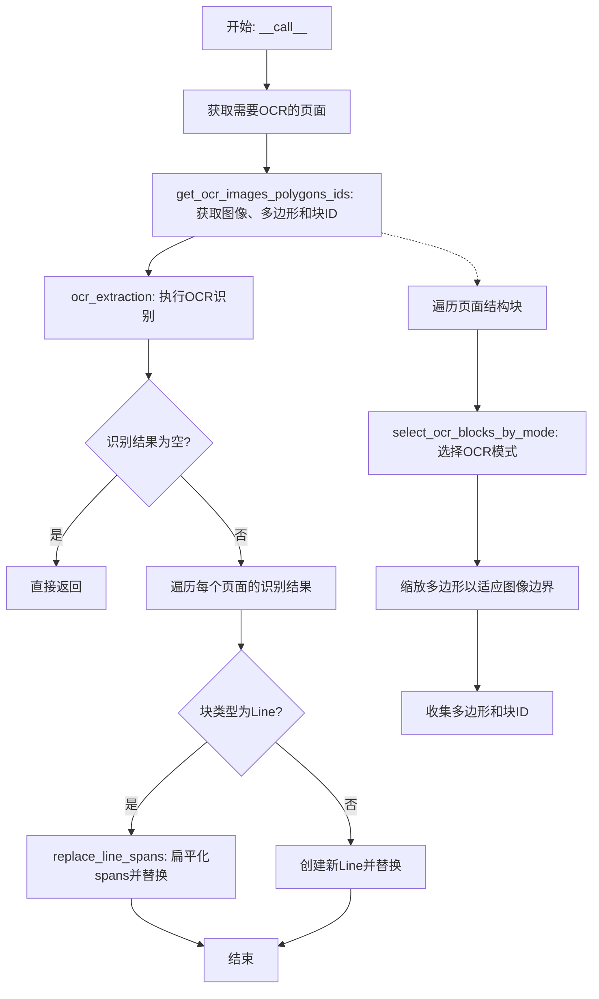
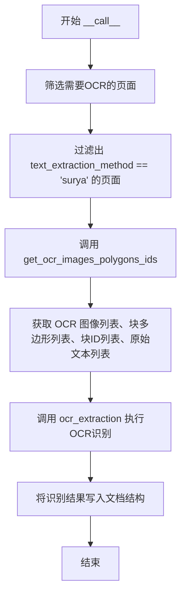
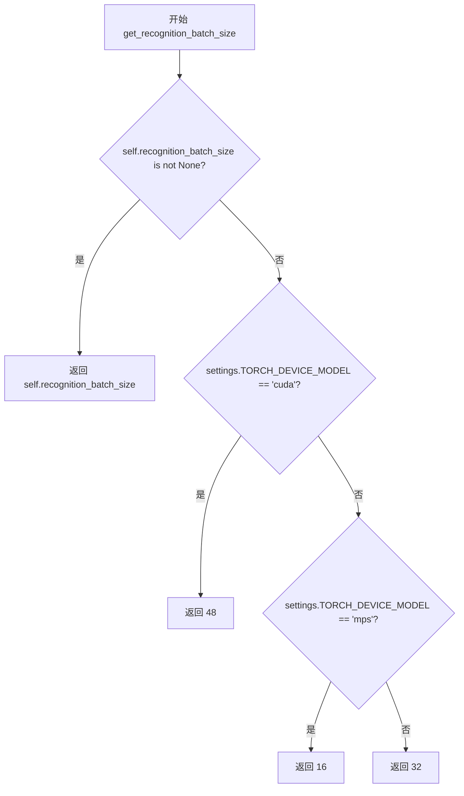
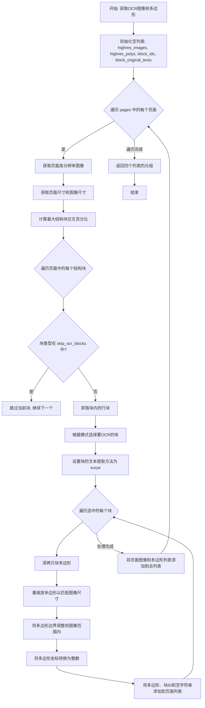
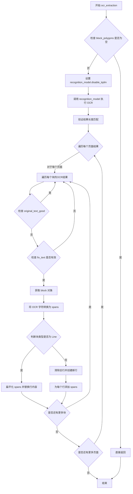
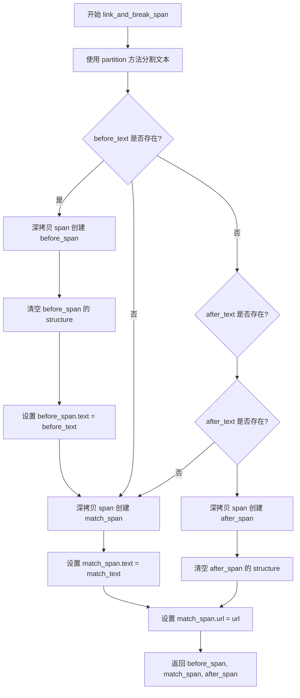
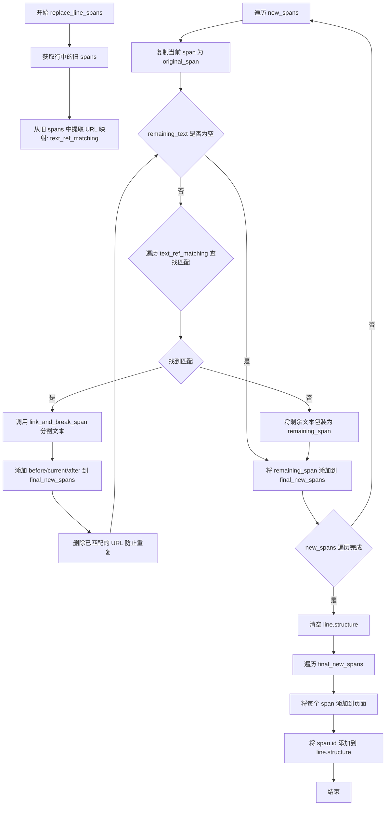
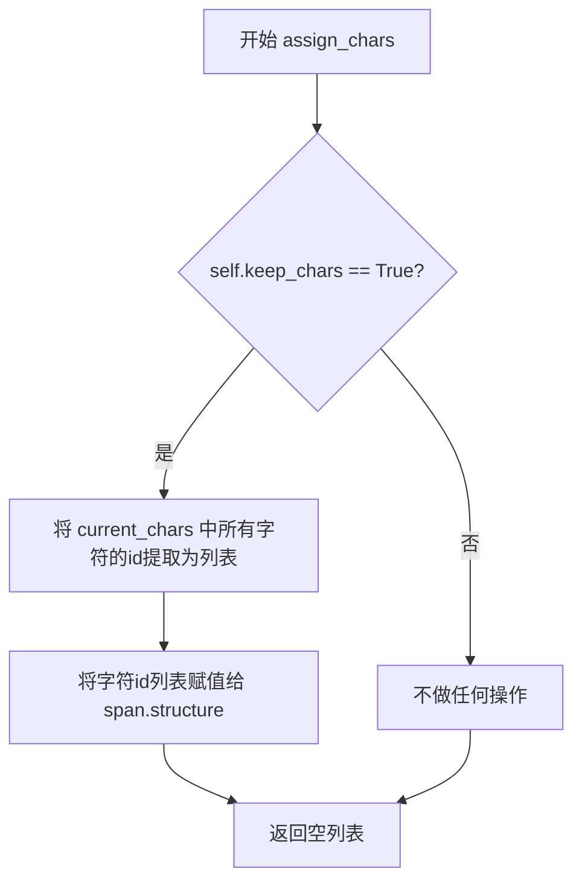
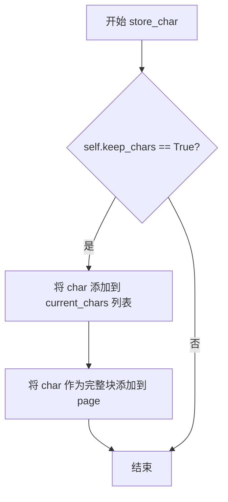

# `marker\marker\builders\ocr.py` 详细设计文档

这是一个PDF文档OCR构建器，用于使用Surya OCR引擎对PDF页面进行文本识别，将识别结果转换为文档中的结构化元素（Span、Line、Char），并支持多种OCR模式（行级和块级）和格式处理。

## 整体流程



## 类结构

```
OcrBuilder (继承自BaseBuilder)
```

## 全局变量及字段


### `OcrBuilder.recognition_batch_size`
    
OCR识别批大小，用于控制每次传递给识别模型的样本数量，默认为None时会使用模型默认批大小

类型：`Annotated[int | None, "The batch size to use for the recognition model.", "Default is None, which will use the default batch size for the model."]`
    


### `OcrBuilder.disable_tqdm`
    
禁用tqdm进度条，控制是否显示OCR处理进度

类型：`Annotated[bool, "Disable tqdm progress bars."]`
    


### `OcrBuilder.skip_ocr_blocks`
    
跳过OCR的块类型列表，用于跳过方程、表格、图形、图片等块的OCR处理

类型：`Annotated[List[BlockTypes], "Blocktypes to skip OCRing by the model in this stage. By default, this avoids recognizing lines inside equations/tables (handled later), figures, and pictures"]`
    


### `OcrBuilder.full_ocr_block_types`
    
块级OCR的块类型列表，在块级别而非行级别执行OCR的块类型

类型：`Annotated[List[BlockTypes], "Blocktypes for which OCR is done at the **block level** instead of line-level."]`
    


### `OcrBuilder.ocr_task_name`
    
OCR任务名称，指定使用的OCR模式

类型：`Annotated[str, "The OCR mode to use, see surya for details. Set to 'ocr_without_boxes' for potentially better performance, at the expense of formatting."]`
    


### `OcrBuilder.keep_chars`
    
保留单个字符，控制是否在span中保留识别出的单个字符

类型：`Annotated[bool, "Keep individual characters."]`
    


### `OcrBuilder.disable_ocr_math`
    
禁用内联数学识别，控制OCR是否识别行内数学公式

类型：`Annotated[bool, "Disable inline math recognition in OCR"]`
    


### `OcrBuilder.drop_repeated_text`
    
删除重复文本，控制是否去除OCR结果中的重复文本

类型：`Annotated[bool, "Drop repeated text in OCR results."]`
    


### `OcrBuilder.block_mode_intersection_thresh`
    
块模式交叉阈值，用于判断是否回退到行模式的交叉面积阈值

类型：`Annotated[float, "Max intersection before falling back to line mode"]`
    


### `OcrBuilder.block_mode_max_lines`
    
块模式最大行数，用于判断是否回退到行模式的最大行数阈值

类型：`Annotated[int, "Max lines within a block before falling back to line mode"]`
    


### `OcrBuilder.block_mode_max_height_frac`
    
块模式最大高度比例，用于判断是否回退到行模式的块高度占页面高度的比例阈值

类型：`Annotated[float, "Max height of a block as a percentage of the page before falling back to line mode"]`
    


### `OcrBuilder.recognition_model`
    
OCR识别模型，用于执行实际的文本识别工作

类型：`RecognitionPredictor`
    
    

## 全局函数及方法


### `OcrBuilder.__init__`

这是 `OcrBuilder` 类的构造函数，负责初始化OCR构建器实例，接收识别模型和可选配置参数，并将其存储为实例属性以供后续OCR处理使用。

参数：

- `self`：`OcrBuilder`，类的实例本身
- `recognition_model`：`RecognitionPredictor`，Surya识别模型实例，用于执行OCR文本识别任务
- `config`：`任意类型`（默认为None），可选配置对象，将传递给父类BaseBuilder进行初始化

返回值：`None`，构造函数不返回任何值，仅初始化实例状态

#### 流程图

```mermaid
flowchart TD
    A[开始 __init__] --> B[调用父类构造器 super().__init__config]
    B --> C[将 recognition_model 赋值给 self.recognition_model]
    C --> D[结束 __init__]
```

#### 带注释源码

```python
def __init__(self, recognition_model: RecognitionPredictor, config=None):
    """
    初始化OcrBuilder实例。
    
    参数:
        recognition_model: RecognitionPredictor类型，用于执行OCR识别的模型实例
        config: 任意类型，可选配置对象，默认为None
    """
    # 调用父类BaseBuilder的构造函数，传递config参数进行基类初始化
    super().__init__(config)

    # 将传入的识别模型保存为实例属性，供后续__call__方法中使用
    self.recognition_model = recognition_model
```


### `OcrBuilder.__call__`

该方法是 OCR 构建器的主入口，负责协调整个 OCR 流程：筛选使用 surya 方法的页面、提取页面中的多边形和块信息、调用 OCR 模型进行文字识别，并将识别结果合并到文档结构中。

参数：

- `self`：类的实例方法隐式参数
- `document`：`Document`，待处理的文档对象，包含所有页面和结构块
- `provider`：`PdfProvider`，PDF 提供者，用于获取页面尺寸等元信息

返回值：`None`，该方法直接修改 document 对象，无返回值

#### 流程图



#### 带注释源码

```python
def __call__(self, document: Document, provider: PdfProvider):
    """
    执行 OCR 流程的主入口方法。
    
    该方法协调整个 OCR 处理过程：
    1. 筛选出使用 surya 方法进行文本提取的页面
    2. 提取这些页面的图像、多边形和块信息
    3. 调用 OCR 模型进行识别并将结果合并到文档中
    
    参数:
        document: Document 对象，包含待处理的页面和结构块
        provider: PdfProvider 对象，用于获取页面尺寸等PDF相关信息
    
    返回:
        None: 直接修改 document 对象，无返回值
    """
    # 第一步：筛选需要 OCR 的页面
    # 过滤出 text_extraction_method == 'surya' 的页面
    # 这些页面使用 surya OCR 引擎进行文本识别
    pages_to_ocr = [page for page in document.pages if page.text_extraction_method == 'surya']
    
    # 第二步：获取 OCR 所需的图像、多边形、块ID和原始文本
    # 调用 get_ocr_images_polygons_ids 方法：
    # - 获取每个页面的高分辨率图像
    # - 提取需要 OCR 的结构块的多边形坐标
    # - 收集块的 ID 和原始文本（初始为空字符串）
    ocr_page_images, block_polygons, block_ids, block_original_texts = (
        self.get_ocr_images_polygons_ids(document, pages_to_ocr, provider)
    )
    
    # 第三步：执行 OCR 识别并提取结果
    # 调用 ocr_extraction 方法：
    # - 将图像和多边形传递给 recognition_model 进行 OCR
    # - 处理识别结果，将其转换为 Span/Line 等结构块
    # - 将识别出的文本结构写入 document 对象
    self.ocr_extraction(
        document,
        pages_to_ocr,
        ocr_page_images,
        block_polygons,
        block_ids,
        block_original_texts,
    )
```


### `OcrBuilder.get_recognition_batch_size`

该方法用于获取 OCR 识别模型的批处理大小。如果类属性 `recognition_batch_size` 已设置，则直接返回；否则根据运行环境（CUDA/MPS/CPU）返回对应的默认批处理大小。

参数：无需参数

返回值：`int`，返回适合当前设备的 OCR 识别批处理大小。

#### 流程图



#### 带注释源码

```python
def get_recognition_batch_size(self):
    """
    获取 OCR 识别模型的批处理大小。
    
    优先级：
    1. 如果类属性 recognition_batch_size 已设置（不为 None），则使用该值
    2. 否则根据运行设备返回默认批处理大小：
       - CUDA 设备: 48
       - MPS 设备: 16
       - 其他设备（CPU）: 32
    
    Returns:
        int: 适合当前硬件配置的批处理大小
    """
    # 检查用户是否显式设置了批处理大小
    if self.recognition_batch_size is not None:
        return self.recognition_batch_size
    # CUDA 设备通常具有较大显存，可以使用更大的批处理大小
    elif settings.TORCH_DEVICE_MODEL == "cuda":
        return 48
    # MPS 设备（Apple Silicon）显存相对有限，使用中等批处理大小
    elif settings.TORCH_DEVICE_MODEL == "mps":
        return 16
    # CPU 或其他设备使用默认批处理大小
    return 32
```


### `OcrBuilder.select_ocr_blocks_by_mode`

该方法根据页面和块的属性智能选择OCR模式（行级OCR或块级OCR）。它通过检查页面最大交叉百分比、块类型、块内行数以及块高度占比等因素，决定是使用行模式（逐行OCR）还是块模式（整个块一次性OCR），从而优化OCR处理的效率和准确性。

参数：

- `self`：`OcrBuilder`，OcrBuilder类的实例本身
- `page`：`PageGroup`，当前处理的页面组对象，用于获取页面属性（如页面高度）进行判断
- `block`：`Block`，当前需要决定OCR模式的块，可以是文本块、标题块等各种类型的块
- `block_lines`：`List[Block]`，该块内部包含的行块列表，用于行模式OCR
- `page_max_intersection_pct`：`float`，页面中结构块的最大交叉百分比，用于判断页面布局复杂度

返回值：`List[Block]`，返回需要进行OCR的块列表。如果采用行模式，返回原始的`block_lines`列表；如果采用块模式，返回包含单个`block`的列表。

#### 流程图

```mermaid
flowchart TD
    A[开始 select_ocr_blocks_by_mode] --> B{检查条件任意一项为真?}
    B -->|是| C[采用行模式]
    B -->|否| D[采用块模式]
    C --> E[返回 block_lines]
    D --> F[返回 [block]]
    
    B --> B1[page_max_intersection_pct > block_mode_intersection_thresh]
    B --> B2[block.block_type 不在 full_ocr_block_types 中]
    B --> B3[len(block_lines) > block_mode_max_lines]
    B --> B4[block.polygon.height >= block_mode_max_height_frac * page.polygon.height]
    
    style C fill:#f9f,color:#000
    style D fill:#9f9,color:#000
```

#### 带注释源码

```python
def select_ocr_blocks_by_mode(
    self, page: PageGroup, block: Block, block_lines: List[Block], page_max_intersection_pct: float
):
    """
    根据页面和块的属性选择OCR模式（行级或块级）
    
    参数:
        page: PageGroup - 页面组对象
        block: Block - 当前块
        block_lines: List[Block] - 块内包含的行列表
        page_max_intersection_pct: float - 页面最大结构块交叉百分比
    
    返回:
        List[Block] - 要进行OCR的块列表
    """
    # 检查是否需要使用行模式OCR
    # 条件包括：页面交叉百分比过高、块类型不支持块级OCR、行数过多、块高度占比过大
    if any([
        page_max_intersection_pct > self.block_mode_intersection_thresh,  # 页面布局复杂度过高
        block.block_type not in self.full_ocr_block_types,  # 块类型不支持块级OCR
        len(block_lines) > self.block_mode_max_lines,  # 行数超过最大限制
        block.polygon.height >= self.block_mode_max_height_frac * page.polygon.height  # 块高度占比过大
    ]):
        # Line mode: 返回块内的所有行，逐行进行OCR处理
        return block_lines

    # Block mode: 整个块作为一个整体进行OCR处理
    # 这种模式更适合处理完整的段落、标题等结构化内容
    return [block]
```


### `OcrBuilder.get_ocr_images_polygons_ids`

该方法用于从文档页面中提取OCR所需的图像、多边形边界框和块ID信息，为后续的光学字符识别过程准备数据。

参数：

- `self`：`OcrBuilder`，OcrBuilder类的实例本身
- `document`：`Document`，包含完整文档数据的对象，用于访问文档页面和块结构
- `pages`：`List[PageGroup]`（PageGroup列表），需要进行OCR处理的页面组列表，这些页面的文本提取方法被设置为'surya'
- `provider`：`PdfProvider`，PDF提供者对象，用于获取页面的边界框信息

返回值：`Tuple[List[Image.Image], List[List[List[List[int]]]], List[List[BlockId]], List[List[str]]]`，返回包含四个元素的元组：
- 高分辨率页面图像列表
- 每个页面的块多边形列表（整数坐标）
- 每个页面的块ID列表
- 每个页面的原始文本列表（初始为空字符串）

#### 流程图



#### 带注释源码

```python
def get_ocr_images_polygons_ids(
    self, document: Document, pages: List[PageGroup], provider: PdfProvider
):
    # 初始化结果列表：存储所有页面的高分辨率图像、多边形、块ID和原始文本
    highres_images, highres_polys, block_ids, block_original_texts = [], [], [], []
    
    # 遍历每个需要OCR的页面
    for document_page in pages:
        # 获取当前页面的高分辨率图像
        page_highres_image = document_page.get_image(highres=True)
        
        # 初始化当前页面的存储列表
        page_highres_polys = []
        page_block_ids = []
        page_block_original_texts = []

        # 从provider获取页面的边界框尺寸
        page_size = provider.get_page_bbox(document_page.page_id).size
        # 获取高分辨率图像的尺寸
        image_size = page_highres_image.size
        # 计算页面最大结构块交叉百分比，用于决定OCR模式
        max_intersection_pct = document_page.compute_max_structure_block_intersection_pct()
        
        # 遍历文档页面中的所有结构块
        for block in document_page.structure_blocks(document):
            # 如果块类型在跳过列表中，则跳过OCR处理
            if block.block_type in self.skip_ocr_blocks:
                # 跳过OCR
                continue

            # 获取块内包含的行块
            block_lines = block.contained_blocks(document, [BlockTypes.Line])
            # 根据模式选择要OCR的块（块模式或行模式）
            blocks_to_ocr = self.select_ocr_blocks_by_mode(document_page, block, block_lines, max_intersection_pct)

            # 设置块的文本提取方法为surya
            block.text_extraction_method = "surya"
            
            # 遍历选中的每个要OCR的块
            for block in blocks_to_ocr:
                # 由于PIL图像裁剪默认会扩展，创建可能对OCR模型不利的图像
                # 因此将多边形调整到图像边界内
                block_polygon_rescaled = (
                    copy.deepcopy(block.polygon)
                    .rescale(page_size, image_size)  # 将多边形从页面尺寸重缩放到图像尺寸
                    .fit_to_bounds((0, 0, *image_size))  # 确保多边形在图像边界内
                )
                # 获取重缩放后的多边形边界框
                block_bbox_rescaled = block_polygon_rescaled.polygon
                # 将多边形坐标转换为整数列表
                block_bbox_rescaled = [
                    [int(x) for x in point] for point in block_bbox_rescaled
                ]

                # 将当前块的多边形、ID和空原始文本添加到页面列表
                page_highres_polys.append(block_bbox_rescaled)
                page_block_ids.append(block.id)
                page_block_original_texts.append("")

        # 将当前页面的数据添加到总列表
        highres_images.append(page_highres_image)
        highres_polys.append(page_highres_polys)
        block_ids.append(page_block_ids)
        block_original_texts.append(page_block_original_texts)

    # 返回所有页面的OCR准备数据
    return highres_images, highres_polys, block_ids, block_original_texts
```


### `OcrBuilder.ocr_extraction`

该方法负责执行OCR识别并将结果合并到文档中。它首先检查是否存在待OCR的块，然后调用识别模型对图像进行OCR处理，最后遍历识别结果并根据块类型（行级别或块级别）将OCR文本转换为文档中的结构化span元素。

参数：

- `self`：`OcrBuilder`，OcrBuilder类的实例
- `document`：`Document`，PDF文档对象，包含所有页面和块的结构化数据
- `pages`：`List[PageGroup]`，需要执行OCR的页面组列表
- `images`：`List[any]`，每个页面对应的高分辨率图像列表
- `block_polygons`：`List[List[List[List[int]]]]`，每个页面中待OCR块的多边形坐标列表
- `block_ids`：`List[List[BlockId]]`，每个页面中待OCR块的ID列表
- `block_original_texts`：`List[List[str]]`，每个页面中块的原始文本列表（用于OCR参考）

返回值：`None`，该方法直接修改document对象中的块内容，不返回任何值

#### 流程图



#### 带注释源码

```python
def ocr_extraction(
    self,
    document: Document,
    pages: List[PageGroup],
    images: List[any],
    block_polygons: List[List[List[List[int]]]],  # 多边形坐标列表，四维列表
    block_ids: List[List[BlockId]],  # 块ID列表，二维列表
    block_original_texts: List[List[str]],  # 原始文本列表，二维列表
):
    # 检查是否有待OCR的块，如果没有则直接返回，避免不必要的计算
    if sum(len(b) for b in block_polygons) == 0:
        return

    # 配置识别模型：设置是否禁用tqdm进度条
    self.recognition_model.disable_tqdm = self.disable_tqdm
    
    # 调用OCR识别模型，传入图像、多边形、原始文本等参数
    # 返回OCRResult列表，包含识别出的文本和字符信息
    recognition_results: List[OCRResult] = self.recognition_model(
        images=images,
        # 为每个图像设置相同的OCR任务名称
        task_names=[self.ocr_task_name] * len(images),
        # 传入待识别的多边形区域
        polygons=block_polygons,
        # 传入原始文本（可能有参考价值）
        input_text=block_original_texts,
        # 设置批处理大小
        recognition_batch_size=int(self.get_recognition_batch_size()),
        # 不对识别结果进行排序
        sort_lines=False,
        # 根据配置决定是否启用数学模式
        math_mode=not self.disable_ocr_math,
        # 根据配置决定是否丢弃重复文本
        drop_repeated_text=self.drop_repeated_text,
        # 设置滑动窗口最大尺寸
        max_sliding_window=2148,
        # 设置最大token数
        max_tokens=2048
    )

    # 验证OCR结果数量与输入数据数量一致，确保数据完整性
    assert len(recognition_results) == len(images) == len(pages) == len(block_ids), (
        f"Mismatch in OCR lengths: {len(recognition_results)}, {len(images)}, {len(pages)}, {len(block_ids)}"
    )
    
    # 遍历每个页面的OCR结果、块ID和图像
    for document_page, page_recognition_result, page_block_ids, image in zip(
        pages, recognition_results, block_ids, images
    ):
        # 遍历页面中每个块的OCR结果
        for block_id, block_ocr_result in zip(
            page_block_ids, page_recognition_result.text_lines
        ):
            # 如果原始文本质量良好，则跳过此块（保留原始文本）
            if block_ocr_result.original_text_good:
                continue
            
            # 使用ftfy修复文本编码问题，如果修复失败则跳过
            if not fix_text(block_ocr_result.text):
                continue
            
            # 获取文档页面中的块对象
            block = document_page.get_block(block_id)
            
            # 将OCR返回的字符信息转换为HTML spans（支持多行）
            all_line_spans = self.spans_from_html_chars(
                block_ocr_result.chars, document_page, image
            )
            
            # 判断块类型是否为行级别
            if block.block_type == BlockTypes.Line:
                # 对于行类型：扁平化所有行中的spans
                flat_spans = [s for line_spans in all_line_spans for s in line_spans]
                # 替换行中的spans内容
                self.replace_line_spans(document, document_page, block, flat_spans)
            else:
                # 对于其他块类型（如段落、标题等）
                # 标记旧行为已移除，清理旧结构
                for line in block.contained_blocks(document_page, block_types=[BlockTypes.Line]):
                    line.removed = True
                block.structure = []  # 清空块的结构

                # 为每行OCR结果创建新的行块
                for line_spans in all_line_spans:
                    # 创建新行，使用原块的polygon（TODO: 需要改进为每个行使用正确的polygon）
                    new_line = Line(
                        polygon=block.polygon,
                        page_id=block.page_id,
                        text_extraction_method="surya"
                    )
                    # 将新行添加到页面
                    document_page.add_full_block(new_line)
                    # 将新行添加到块的结构中
                    block.add_structure(new_line)
                    # 替换新行中的spans
                    self.replace_line_spans(document, document_page, new_line, line_spans)
```


### `OcrBuilder.link_and_break_span`

该方法用于在 OCR 识别结果中，将包含链接的文本片段分割成三个部分：匹配文本之前的内容、匹配到的链接文本（带 URL）、以及匹配文本之后的内容。它通过深拷贝原始 Span 对象并分别设置文本和 URL 属性来实现文本与超链接的关联。

参数：

- `self`：`OcrBuilder`，OcrBuilder 实例本身
- `span`：`Span`，原始的 Span 对象，包含基础属性如格式、位置等
- `text`：`str`，完整的文本内容，需要在此文本中查找并分割
- `match_text`：未指定（取决于调用时的实际类型），需要在 text 中匹配的文本内容
- `url`：`str`，要分配给匹配文本的 URL 链接

返回值：`(Union[Span, None], Span, Union[Span, None])`，返回一个元组，包含：
- 匹配文本之前的 Span（如果存在）
- 匹配到的文本 Span（带 URL）
- 匹配文本之后的 Span（如果存在）

#### 流程图



#### 带注释源码

```python
def link_and_break_span(self, span: Span, text: str, match_text, url: str):
    """
    将包含链接的文本分割成三个部分：链接前、链接、链接后
    
    参数:
        span: 原始 Span 对象，提供基础属性
        text: 完整文本内容
        match_text: 要匹配的文本
        url: 要设置的链接 URL
    """
    # 使用 partition 方法分割文本，返回 (之前, 分隔符, 之后) 三部分
    # 如果 match_text 不在 text 中，_ 为空字符串，after_text 为空
    before_text, _, after_text = text.partition(match_text)
    
    before_span, after_span = None, None
    
    # 如果匹配文本之前有内容，创建新的 before_span
    if before_text:
        before_span = copy.deepcopy(span)  # 深拷贝保持原始格式属性
        before_span.structure = []  # 清空结构避免重复字符
        before_span.text = before_text
    
    # 如果匹配文本之后有内容，创建新的 after_span
    if after_text:
        after_span = copy.deepcopy(span)
        after_span.text = after_text
        after_span.structure = []  # 清空结构避免重复字符
    
    # 创建 match_span，设置匹配的文本和 URL
    match_span = copy.deepcopy(span)
    match_span.text = match_text
    match_span.url = url
    
    # 返回三个部分，可能包含 None
    return before_span, match_span, after_span
```


### `OcrBuilder.replace_line_spans`

该方法用于将 OCR 识别的新文本跨度（spans）替换文档中现有的行跨度，同时尝试恢复原始文档中的 URL 引用信息。

参数：

- `self`：`OcrBuilder`，OcrBuilder 实例本身
- `document`：`Document`，文档对象，用于访问文档结构和块信息
- `page`：`PageGroup`，当前处理的页面组，用于将新创建的 span 添加到页面中
- `line`：`Line`，需要替换跨度的目标行对象
- `new_spans`：`List[Span]`：OCR 识别得到的新跨度列表

返回值：`None`，该方法直接修改 `line` 和 `page` 对象，不返回任何值

#### 流程图



#### 带注释源码

```python
def replace_line_spans(
    self, document: Document, page: PageGroup, line: Line, new_spans: List[Span]
):
    """
    替换行中的文本跨度，并尝试恢复原始文档中的 URL 引用
    
    参数:
        document: 文档对象，用于访问文档结构
        page: 当前页面组，用于添加新创建的块
        line: 需要替换跨度的目标行
        new_spans: OCR 识别得到的新跨度列表
    """
    # 1. 获取当前行中已有的所有 span 块
    old_spans = line.contained_blocks(document, [BlockTypes.Span])
    
    # 2. 从旧 spans 中提取 URL 映射，用于后续恢复链接引用
    # key: span 文本内容, value: URL
    text_ref_matching = {span.text: span.url for span in old_spans if span.url}

    # 3. 初始化最终的新 spans 列表
    final_new_spans = []
    
    # 4. 遍历 OCR 识别出的每个新 span
    for span in new_spans:
        # 复制原始 span 用于属性拷贝
        original_span = copy.deepcopy(span)
        
        # 待处理的剩余文本
        remaining_text = span.text
        
        # 5. 循环处理文本，尝试匹配并插入 URL 引用
        while remaining_text:
            matched = False
            
            # 遍历已有的 URL 映射，查找匹配文本
            for match_text, url in text_ref_matching.items():
                if match_text in remaining_text:
                    matched = True
                    
                    # 调用 link_and_break_span 将文本分割为前中后三部分
                    before, current, after = self.link_and_break_span(
                        original_span, remaining_text, match_text, url
                    )
                    
                    # 添加匹配前的文本块（如果有）
                    if before:
                        final_new_spans.append(before)
                    
                    # 添加带有 URL 的当前匹配块
                    final_new_spans.append(current)
                    
                    # 处理匹配后的剩余文本
                    if after:
                        remaining_text = after.text
                    else:
                        remaining_text = ""  # 文本已处理完毕
                    
                    # 删除已匹配的 URL，防止重复匹配
                    del text_ref_matching[match_text]
                    break
            
            # 6. 如果没有找到匹配，直接添加剩余文本
            if not matched:
                remaining_span = copy.deepcopy(original_span)
                remaining_span.text = remaining_text
                final_new_spans.append(remaining_span)
                break

    # 7. 清空行的原有结构
    line.structure = []
    
    # 8. 将新的 spans 添加到页面并更新行的结构引用
    for span in final_new_spans:
        # 将 span 添加到页面作为完整块
        page.add_full_block(span)
        # 将 span 的 id 添加到行的结构中
        line.structure.append(span.id)
```


### `OcrBuilder.assign_chars`

该方法用于将当前字符列表分配给指定的文本跨度（Span），并在启用保留字符功能时将字符ID列表关联到跨度的结构中。

参数：

- `self`：隐式的 `OcrBuilder` 实例，表示当前构建器对象
- `span`：`Span` 类型，需要分配字符的目标文本跨度对象
- `current_chars`：`List[Char]` 类型，包含需要分配给跨度的字符对象列表

返回值：`List[Char]`，返回空列表，用于在调用处重置当前字符状态

#### 流程图



#### 带注释源码

```python
def assign_chars(self, span: Span, current_chars: List[Char]):
    """
    将当前字符列表分配给指定的文本跨度
    
    Args:
        span: 目标文本跨度对象
        current_chars: 需要分配的字符列表
    
    Returns:
        返回空列表，用于调用方重置字符状态
    """
    # 检查是否启用了保留字符功能
    if self.keep_chars:
        # 将当前字符列表中每个字符的id提取出来组成列表
        # 并赋值给span的structure属性，建立字符与跨度的关联
        span.structure = [c.id for c in current_chars]

    # 返回空列表，供调用者清空current_chars
    return []
```


### `OcrBuilder.store_char`

该方法用于在 OCR 字符处理过程中有条件地存储单个字符。当 `keep_chars` 配置启用时，将当前字符追加到字符列表中，同时将其作为完整块添加到页面文档结构中。

参数：

- `self`：`OcrBuilder`，OcrBuilder 类的实例，调用此方法的对象本身
- `char`：`Char`，从 OCR 模型返回的单个字符对象，包含文本内容和几何信息
- `current_chars`：`List[Char]`，当前行/-span 中已收集的字符列表，用于维护字符的顺序和关联
- `page`：`PageGroup`，页面组对象，表示当前处理的页面，用于将字符添加为文档的完整块

返回值：`None`，该方法无返回值，执行副作用操作（修改 current_chars 列表和 page 页面对象）

#### 流程图



#### 带注释源码

```python
def store_char(self, char: Char, current_chars: List[Char], page: PageGroup):
    """
    存储单个字符到字符列表和页面中。
    
    该方法仅在 keep_chars 属性为 True 时执行实际存储操作。
    当启用时，会同时完成两件事：
    1. 将字符追加到 current_chars 列表（维护字符顺序）
    2. 将字符作为完整块添加到页面（持久化到文档结构）
    
    参数:
        char: 从 OCR 模型识别出的字符对象，包含文本和几何信息
        current_chars: 当前累积的字符列表，用于构建 Span/Line 结构
        page: 页面组对象，用于添加字符作为文档块
    
    返回:
        None: 无返回值，通过修改输入参数完成操作
    """
    # 检查是否需要保留单个字符
    if self.keep_chars:
        # 将当前字符追加到字符列表中
        current_chars.append(char)
        # 将字符作为完整块添加到页面文档结构中
        # 这使得字符可以在后续被引用或渲染
        page.add_full_block(char)
```


### `OcrBuilder.spans_from_html_chars`

该方法将Surya OCR模型返回的HTML格式字符转换为文档结构中的Span对象列表，处理HTML标签（如换行符、格式标签）、数学公式span、字符存储和多边形合并等逻辑。

参数：

- `self`：`OcrBuilder`，OcrBuilder类的实例
- `chars`：`List[TextChar]`，Surya OCR模型返回的字符列表，每个字符包含文本和多边形信息
- `page`：`PageGroup`，页面组对象，用于获取页面ID和多边形信息
- `image`：`Image.Image`，PIL图像对象，用于将字符多边形从图像坐标转换到页面坐标

返回值：`List[List[Span]]`，返回嵌套的Span列表，外层列表代表多行，内层列表代表每行中的多个span

#### 流程图

```mermaid
flowchart TD
    A[开始: spans_from_html_chars] --> B[初始化变量: SpanClass, CharClass, all_line_spans, current_line_spans, formats={'plain'}, current_span=None, current_chars=[]]
    B --> C{遍历 chars 中的每个 char}
    C -->|是| D[创建 char_box: 从图像坐标转换到页面坐标]
    D --> E[创建 marker_char: CharClass 对象]
    E --> F{char.text == '<br>'?}
    F -->|是| G[关闭当前span添加到当前行]
    G --> H[当前行末尾加换行符]
    H --> I[将当前行添加到all_line_spans并重置]
    I --> C
    F -->|否| J{是opening tag?}
    J -->|是| K[添加format到formats集合]
    K --> L{format == 'math'?}
    L -->|是| M[创建math类型的SpanClass]
    L -->|否| N[关闭当前span并添加到当前行]
    M --> O[存储marker_char到current_chars]
    O --> C
    N --> O
    J -->|否| P{是closing tag?}
    P -->|是| Q[从formats移除format]
    Q --> R[关闭当前span并添加到当前行]
    R --> C
    P -->|否| S{current_span存在?}
    S -->|否| T[创建新的SpanClass]
    T --> U[存储marker_char到current_chars]
    U --> C
    S -->|是| V[追加文本到current_span]
    V --> W[存储marker_char到current_chars]
    W --> X{formats中无'math'?}
    X -->|是| Y[合并current_span.polygon与char_box]
    X -->|否| C
    Y --> C
    C -->|否| Z{current_span存在?}
    Z -->|是| AA[assign_chars并添加到current_line_spans]
    Z -->|否| AB[跳过]
    AA --> AC[最后一行末尾加换行符]
    AC --> AD[添加到all_line_spans]
    AD --> AE[返回 all_line_spans]
```

#### 带注释源码

```python
def spans_from_html_chars(
    self, chars: List[TextChar], page: PageGroup, image: Image.Image
) -> List[List[Span]]:
    # 获取Span和Char的类类型，用于后续创建对象
    SpanClass: Span = get_block_class(BlockTypes.Span)
    CharClass: Char = get_block_class(BlockTypes.Char)

    # 初始化变量
    # all_line_spans: 存储所有行的span列表（外层列表为多行）
    all_line_spans = []
    # current_line_spans: 当前正在处理的行的span列表
    current_line_spans = []
    # formats: 当前span的格式集合，初始为纯文本
    formats = {"plain"}
    # current_span: 当前正在处理的span对象
    current_span = None
    # current_chars: 当前span包含的字符列表
    current_chars = []
    # 获取图像尺寸用于坐标转换
    image_size = image.size

    # 遍历OCR模型返回的每个字符
    for idx, char in enumerate(chars):
        # 将字符多边形从图像坐标转换到页面坐标
        # PolygonBox用于处理多边形，rescale方法进行坐标缩放
        char_box = PolygonBox(polygon=char.polygon).rescale(
            image_size, page.polygon.size
        )
        
        # 创建Char对象，表示文档中的一个字符
        marker_char = CharClass(
            text=char.text,
            idx=idx,
            page_id=page.page_id,
            polygon=char_box,
        )

        # 处理HTML换行符<br>
        if char.text == "<br>":
            # 如果有当前span，先关闭它并添加到当前行
            if current_span:
                # assign_chars处理字符存储逻辑
                current_chars = self.assign_chars(current_span, current_chars)
                current_line_spans.append(current_span)
                current_span = None
            
            # 当前行末尾添加换行符
            if current_line_spans:
                current_line_spans[-1].text += "\n"
                # 将当前行添加到所有行列表
                all_line_spans.append(current_line_spans)
                # 重置当前行
                current_line_spans = []
            continue

        # 检查是否是HTML格式标签的开始（如<b>, <i>, <math>等）
        is_opening_tag, format = get_opening_tag_type(char.text)
        if is_opening_tag and format not in formats:
            # 添加新格式到格式集合
            formats.add(format)
            
            # 如果有当前span，先关闭它
            if current_span:
                current_chars = self.assign_chars(current_span, current_chars)
                current_line_spans.append(current_span)
                current_span = None

            # 如果是数学公式格式，创建math类型的span
            if format == "math":
                current_span = SpanClass(
                    text="",
                    formats=list(formats),
                    page_id=page.page_id,
                    polygon=char_box,
                    minimum_position=0,
                    maximum_position=0,
                    font="Unknown",
                    font_weight=0,
                    font_size=0,
                )
                # 存储数学公式的字符
                self.store_char(marker_char, current_chars, page)
            continue

        # 检查是否是HTML格式标签的结束（如</b>, </i>, </math>等）
        is_closing_tag, format = get_closing_tag_type(char.text)
        if is_closing_tag:
            # 尝试移除格式（OCR模型可能返回没有开标签的闭标签，用try-except处理）
            try:
                formats.remove(format)
            except Exception:
                continue
            
            # 关闭当前span
            if current_span:
                current_chars = self.assign_chars(current_span, current_chars)
                current_line_spans.append(current_span)
                current_span = None
            continue

        # 如果没有当前span，创建新的span
        if not current_span:
            current_span = SpanClass(
                text=fix_text(char.text),  # 使用ftfy修复文本编码问题
                formats=list(formats),
                page_id=page.page_id,
                polygon=char_box,
                minimum_position=0,
                maximum_position=0,
                font="Unknown",
                font_weight=0,
                font_size=0,
            )
            # 存储字符
            self.store_char(marker_char, current_chars, page)
            continue

        # 已有当前span，追加文本并存储字符
        current_span.text = fix_text(current_span.text + char.text)
        self.store_char(marker_char, current_chars, page)

        # 数学公式内部的token没有有效的box，所以跳过合并
        # 对于非数学公式的span，合并多边形以获得更大的包围盒
        if "math" not in formats:
            current_span.polygon = current_span.polygon.merge([char_box])

    # 循环结束后，处理最后一个span
    # 添加最后的span到当前行
    if current_span:
        self.assign_chars(current_span, current_chars)
        current_line_spans.append(current_span)

    # 处理最后一行
    if current_line_spans:
        current_line_spans[-1].text += "\n"
        all_line_spans.append(current_line_spans)

    # 返回所有行的span列表
    return all_line_spans
```

## 关键组件


### OcrBuilder类

负责对PDF页面执行OCR并将结果合并到文档中的构建器类，集成surya OCR模型进行文本识别。

### recognition_batch_size字段

识别模型的批处理大小，用于控制OCR模型每次处理的图像数量，默认值为None（使用模型默认批处理大小）。

### skip_ocr_blocks字段

需要跳过OCR的块类型列表，包括公式、图形、图片、表格、表格of内容等，避免重复识别和处理。

### full_ocr_block_types字段

需要执行块级OCR而非行级OCR的块类型列表，包括章节标题、脚注、文本、内联数学、代码和标题。

### get_ocr_images_polygons_ids方法

获取OCR所需的图像、多边形边界框和块ID，遍历文档页面提取需要OCR的结构块，并将多边形坐标从页面坐标缩放到图像坐标。

### ocr_extraction方法

执行实际的OCR识别，调用surya recognition_model对图像进行文本识别，将识别结果转换为span并更新文档结构。

### select_ocr_blocks_by_mode方法

根据块的最大交叉百分比、块类型、行数和高度选择OCR模式（行模式或块模式），决定是逐行OCR还是整个块一起OCR。

### spans_from_html_chars方法

将OCR模型返回的字符转换为span列表，处理HTML标签（开始标签和结束标签），管理格式状态，合并相邻字符的多边形。

### replace_line_spans方法

替换行中的span，将旧的span替换为新的OCR识别结果，同时保留原有span中的URL引用信息。

### link_and_break_span方法

在span中链接和分割文本与URL，处理文本匹配和分割逻辑，支持在文本中插入超链接。

### assign_chars方法

将当前字符分配给span，当启用keep_chars时将字符ID添加到span的结构中。

### store_char方法

存储字符到页面，当启用keep_chars时将字符添加到当前字符列表和页面中。

### get_recognition_batch_size方法

获取识别模型的批处理大小，根据设备类型（cuda、mps或cpu）返回不同的默认值。


## 问题及建议


### 已知问题

-   **硬编码的配置值**：方法 `ocr_extraction` 中 `max_sliding_window=2148` 和 `max_tokens=2048` 被硬编码，无法通过配置灵活调整。
-   **TODO 任务未完成**：存在两处 TODO 注释标记了待完成的功能——多行时使用每个 span 的 polygon 构造，以及切割 span 时修复 polygon。
-   **类型注解不精确**：`ocr_extraction` 方法的参数 `images: List[any]` 应使用更具体的类型（如 `List[Image.Image]`）。
-   **异常处理过于宽泛**：在 `spans_from_html_chars` 方法中使用 `try...except Exception` 捕获所有异常来移除 format，这种做法会隐藏潜在的真实错误。
-   **代码重复**：`assign_chars` 和 `store_char` 方法中都有对 `self.keep_chars` 的条件判断，可以提取为通用逻辑。
-   **深层拷贝性能问题**：在 `link_and_break_span` 和 `replace_line_spans` 方法中多次使用 `copy.deepcopy`，在处理大量文本时可能导致性能瓶颈。
-   **使用 assert 进行生产验证**：`ocr_extraction` 中使用 assert 语句验证数据一致性，应该使用正式的异常处理。

### 优化建议

-   将 `max_sliding_window` 和 `max_tokens` 提取为类属性或配置项，允许外部注入。
-   优先处理或规划 TODO 标记的功能需求，以提升 OCR 结果的准确性。
-   修正类型注解，使用 `PIL.Image.Image` 替代 `any`。
-   改用更具体的异常类型（如 `KeyError`）进行捕获，或重构逻辑以避免异常捕获。
-   将 `self.keep_chars` 检查逻辑提取为私有方法，减少重复代码。
-   考虑使用原型模式或更高效的深拷贝策略，减少 `copy.deepcopy` 调用次数。
-   将 assert 语句替换为 `if` 条件判断并抛出自定义异常，确保生产环境的健壮性。

## 其它


### 设计目标与约束

**设计目标**：
1. 实现PDF文档的OCR文本识别，将识别结果无缝合并到文档结构中
2. 支持行级和块级两种OCR模式，根据实际场景自动选择最优模式
3. 保留文本格式信息（粗体、斜体、数学公式等）和超链接引用
4. 支持批量处理多个页面的OCR任务，提高处理效率

**设计约束**：
1. 仅对使用'surya'文本提取方法的页面进行OCR处理
2. 跳过表格、公式、图形等特殊块类型，由专门的处理器负责
3. OCR模型输入图像需与原始页面尺寸匹配，避免PIL裁剪导致的边界问题
4. 字符级坐标需从图像坐标转换回页面坐标系统

### 错误处理与异常设计

**异常处理策略**：
1. **格式标签不匹配**：在`get_closing_tag_type`处理中，使用try-except捕获formats.remove异常，防止关闭标签无对应开始标签时崩溃
2. **OCR结果长度校验**：使用assert验证recognition_results、images、pages、block_ids四个列表长度一致，不一致时抛出详细错误信息
3. **文本修复失败处理**：当`fix_text`返回空值时，跳过该OCR结果
4. **空块处理**：在`ocr_extraction`开始时检查polygons总长度，若为0则直接返回，避免无效的模型调用

**边界条件处理**：
1. 跳过OCR块类型列表外的块
2. 原始文本质量良好的块直接跳过OCR
3. 处理最后一个span和最后一行时进行flush操作

### 数据流与状态机

**主数据流**：
```
Document + PdfProvider 
    → get_ocr_images_polygons_ids() 提取需要OCR的图像和多边形
    → recognition_model() 调用Surya OCR模型
    → ocr_extraction() 处理OCR结果并更新文档结构
    → spans_from_html_chars() 将字符转换为Span对象
    → replace_line_spans() 替换文档中的原有文本
```

**Span格式化状态机**：
```
初始状态: formats = {"plain"}, current_span = None, current_line_spans = []
    ↓
遇到开始标签 → 将format加入formats栈，创建新Span
    ↓
遇到普通字符 → 添加到current_span，合并多边形
    ↓
遇到<br> → 标记行结束，将current_span加入current_line_spans
    ↓
遇到结束标签 → 从formats栈移除format，重置current_span
    ↓
遍历结束 → flush最后一个span和最后一行
```

**块模式选择逻辑**：
```
select_ocr_blocks_by_mode(page, block, block_lines, max_intersection_pct)
    ↓
任一条件满足则使用行模式：
  - 交集百分比 > block_mode_intersection_thresh (0.5)
  - 块类型不在full_ocr_block_types中
  - 行数 > block_mode_max_lines (15)
  - 块高度 > 页面高度 * block_mode_max_height_frac (0.5)
    ↓
否则使用块模式 → 返回整个block
```

### 外部依赖与接口契约

**外部依赖**：
1. **Surya OCR** (`surya.recognition.RecognitionPredictor`)：核心OCR识别模型
   - 输入：图像列表、任务名称、多边形、原始文本
   - 输出：OCRResult列表
2. **PIL (Pillow)**：图像处理，用于获取页面图像和裁剪
3. **ftfy**：文本编码修复，处理OCR结果中的乱码
4. **marker框架内部模块**：
   - `marker.builders.BaseBuilder`：构建器基类
   - `marker.providers.pdf.PdfProvider`：PDF页面提供者
   - `marker.schema.*`：文档结构模式定义
   - `marker.util.get_opening_tag_type/get_closing_tag_type`：HTML标签解析

**接口契约**：
1. **OcrBuilder.__call__(document: Document, provider: PdfProvider)**：
   - 职责：对文档中指定页面执行OCR
   - 前置条件：document已包含页面结构和多边形
   - 后置条件：document的文本内容被OCR结果填充

2. **get_ocr_images_polygons_ids()**：
   - 返回：四元组(高分辨率图像列表, 多边形列表, 块ID列表, 原始文本列表)
   - 每个列表元素对应一个页面

3. **spans_from_html_chars()**：
   - 输入：Surya字符列表、页面对象、图像
   - 输出：嵌套Span列表 `List[List[Span]]`，外层为行，内层为Span

### 关键组件信息

| 组件名称 | 类型 | 描述 |
|---------|------|------|
| RecognitionPredictor | 类 (Surya) | Surya OCR模型包装器，负责执行实际文本识别 |
| Document | 类 | 文档对象，包含pages和全文结构 |
| PageGroup | 类 | 页面组，包含页面级结构和文本提取方法 |
| Block | 类 | 文档块基类，包含多边形、类型和结构 |
| Line | 类 (Block子类) | 行块，包含多个Span |
| Span | 类 (Block子类) | 文本跨度，包含格式信息 |
| Char | 类 (Block子类) | 字符对象，OCR识别的最小单位 |
| PolygonBox | 类 | 多边形包围盒，用于坐标表示和转换 |
| PdfProvider | 类 | PDF提供器，负责页面图像获取和尺寸查询 |

### 潜在的技术债务与优化空间

1. **TODO: 多边形切割问题**：
   - 当前位置：`replace_line_spans`中创建新行时使用整块polygon
   - 建议：应为每行使用span构建精确的polygon，需等待OCR模型bbox预测改进

2. **硬编码参数**：
   - `max_sliding_window=2148`和`max_tokens=2048`硬编码在`ocr_extraction`中
   - 建议：提取为配置参数或从settings读取

3. **块模式回退逻辑**：
   - 当块模式条件不满足时回退到行模式，但具体阈值可能需根据实际文档调整
   - 建议：提供更灵活的阈值配置机制

4. **文本引用匹配算法**：
   - 当前使用简单的字典键匹配，可能无法处理复杂情况
   - 建议：考虑更健壮的引用匹配策略

5. **异常处理过于简单**：
   - 某些异常被静默跳过（如格式标签不匹配）
   - 建议：添加日志记录以便调试

### 性能考量

1. **批处理优化**：根据设备类型动态调整batch size（CUDA: 48, MPS: 16, CPU: 32）
2. **图像复用**：同一页面的高分辨率图像在处理多个块时复用
3. **提前退出**：无OCR块时直接返回，避免不必要的模型调用
4. **内存管理**：使用深拷贝避免修改原始多边形，使用引用传递减少内存开销

### 配置参数汇总

| 参数名 | 类型 | 默认值 | 描述 |
|--------|------|--------|------|
| recognition_batch_size | int | None | OCR批处理大小，None时根据设备自动选择 |
| disable_tqdm | bool | False | 是否禁用进度条 |
| skip_ocr_blocks | List[BlockTypes] | [Equation, Figure, Picture, Table, Form, TableOfContents] | 跳过OCR的块类型 |
| full_ocr_block_types | List[BlockTypes] | [SectionHeader, ListItem, Footnote, Text, TextInlineMath, Code, Caption] | 块级OCR的块类型 |
| ocr_task_name | str | TaskNames.ocr_with_boxes | OCR模式 |
| keep_chars | bool | False | 是否保留字符级对象 |
| disable_ocr_math | bool | False | 是否禁用内联数学识别 |
| drop_repeated_text | bool | False | 是否删除重复文本 |
| block_mode_intersection_thresh | float | 0.5 | 块模式最大交集阈值 |
| block_mode_max_lines | int | 15 | 块模式最大行数 |
| block_mode_max_height_frac | float | 0.5 | 块模式最大高度百分比 |

    