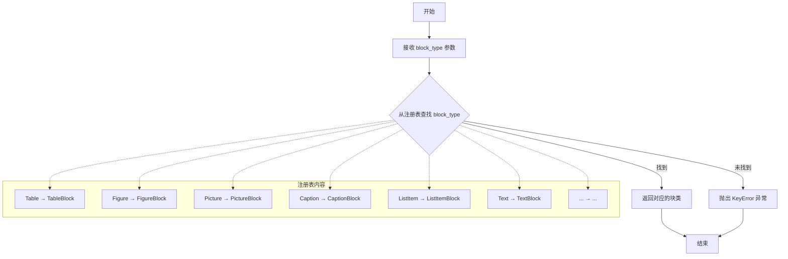
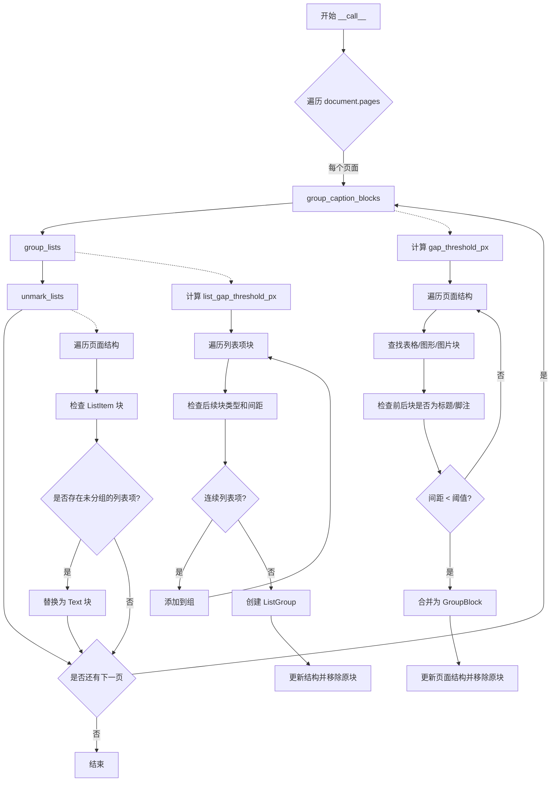
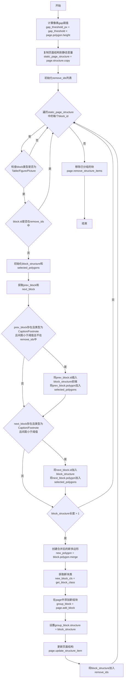
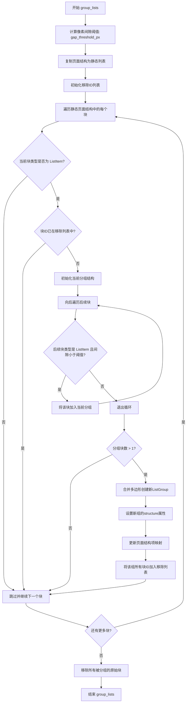
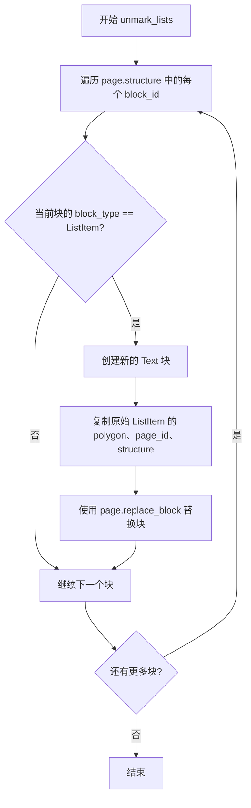

# `marker\marker\builders\structure.py` 详细设计文档

StructureBuilder是一个文档结构构建器，用于将PDF或文档中的相关块（blocks）根据空间位置进行语义分组，包括将表格/图片/图形的标题（caption）与对应的内容块分组，以及将相邻的列表项（list items）分组为列表组（ListGroup），从而重建文档的逻辑结构。

## 整体流程

```mermaid
graph TD
    A[开始: 遍历文档页面] --> B[对每个页面调用StructureBuilder]
    B --> C[group_caption_blocks: 分组标题块]
    C --> D[遍历页面结构中的块]
    D --> E{块类型是Table/Figure/Picture?}
    E -- 否 --> F[跳过当前块]
    E -- 是 --> G{查找前后标题块}
    G --> H{标题块间距<gap_threshold?}
    H -- 是 --> I[创建合并块GroupBlock]
    H -- 否 --> J[不创建组]
    I --> K[更新页面结构]
    C --> L[group_lists: 分组列表项]
    L --> M[遍历列表项块]
    M --> N{相邻列表项间距<list_gap_threshold?}
    N -- 是 --> O[加入当前组]
    N -- 否 --> P[创建新的ListGroup]
    O --> P
    P --> Q[更新页面结构]
    C --> R[unmark_lists: 取消标记未分组的列表]
    R --> S{列表项未被分组?]
    S -- 是 --> T[替换为普通Text块]
    S -- 否 --> U[保持不变]
    T --> V[结束]
```

## 类结构

```
BaseBuilder (基类)
└── StructureBuilder (结构构建器)
```

## 全局变量及字段


### `gap_threshold_px`
    
将百分比阈值转换为像素值，用于实际距离计算

类型：`float`
    


### `static_page_structure`
    
页面结构的静态副本，用于遍历

类型：`list`
    


### `remove_ids`
    
需要移除的块ID列表

类型：`list`
    


### `block_structure`
    
当前组的块ID列表

类型：`list`
    


### `selected_polygons`
    
当前组中所有块的多边形用于合并

类型：`list`
    


### `caption_types`
    
标题类型的列表（Caption, Footnote）

类型：`list`
    


### `StructureBuilder.gap_threshold`
    
块之间的最小间距阈值，用于判断是否属于同一组

类型：`Annotated[float, str]`
    


### `StructureBuilder.list_gap_threshold`
    
列表项之间的最小间距阈值，用于判断是否属于同一列表组

类型：`Annotated[float, str]`
    
    

## 全局函数及方法


### `get_block_class(block_type)`

根据块类型（BlockType）从注册表中获取对应的块类，用于动态创建文档块实例。

参数：

- `block_type`：`BlockTypes`，要获取的块类型枚举值

返回值：`type`，返回对应的块类类型，用于实例化块对象

#### 流程图



#### 带注释源码

```python
# 从 marker.schema.registry 模块导入的函数
# 该函数根据传入的 BlockTypes 枚举值，从块类注册表中获取对应的类

# 使用示例（在 StructureBuilder.group_caption_blocks 方法中）:
# block_type.name + "Group" 将 'Table' 转换为 'TableGroup'
# BlockTypes['TableGroup'] 创建一个新的 BlockTypes 枚举值
# get_block_class(...) 返回用于创建组块的类

new_block_cls = get_block_class(BlockTypes[block.block_type.name + "Group"])
# 例如: block.block_type.name = "Figure"
#       block.block_type.name + "Group" = "FigureGroup"
#       BlockTypes["FigureGroup"] → 获取 FigureGroup 枚举值
#       get_block_class(...) → 返回 FigureGroupBlock 类
```


### `StructureBuilder.__init__`

构造函数，用于初始化 StructureBuilder 实例，接受配置参数并传递给父类进行初始化。

参数：

- `config`：任意类型或 `None`，配置参数，用于初始化父类 Builder 的配置

返回值：`None`，无返回值（构造函数）

#### 流程图

```mermaid
flowchart TD
    A[开始 __init__] --> B{config 参数}
    B -->|传入 config| C[调用父类 super().__init__]
    B -->|config 为 None| C
    C --> D[结束]
    
    style A fill:#f9f,stroke:#333
    style D fill:#9f9,stroke:#333
```

#### 带注释源码

```python
def __init__(self, config=None):
    """
    构造函数，初始化 StructureBuilder 实例。
    
    参数:
        config: 可选的配置参数，会传递给父类 BaseBuilder 的构造函数
    """
    # 调用父类 BaseBuilder 的构造函数，传入配置参数
    # 如果 config 为 None，则传入 None 给父类
    super().__init__(config)
```


### StructureBuilder.__call__

该方法是 StructureBuilder 类的主入口方法，接收 Document 对象作为输入，遍历文档的每个页面并依次执行三个核心处理操作：分组标题块（将表格/图形/图片与其标题合并）、分组列表项（将连续的列表项合并为列表组）、以及取消标记未分组的列表项，最终输出结构化的文档内容。

参数：

- `self`：StructureBuilder，当前类的实例
- `document`：`Document`，待处理的文档对象，包含多个页面（pages）

返回值：`None`，该方法直接修改 Document 对象的内部结构，不返回任何值

#### 流程图



#### 带注释源码

```python
def __call__(self, document: Document):
    """
    主入口方法，遍历文档的每个页面进行分组处理
    
    参数:
        document: Document对象，包含多个页面需要进行结构化处理
    
    返回:
        None: 直接修改document对象内部结构
    """
    # 遍历文档中的所有页面
    for page in document.pages:
        # 1. 将表格/图形/图片与其标题/脚注合并为GroupBlock
        self.group_caption_blocks(page)
        # 2. 将连续的列表项合并为ListGroup
        self.group_lists(page)
        # 3. 将未分组的列表项标记替换为普通文本块
        self.unmark_lists(page)
```

---

## StructureBuilder 类详细信息

### 类字段

| 字段名称 | 类型 | 描述 |
|---------|------|------|
| `gap_threshold` | `Annotated[float, "The minimum gap between blocks to consider them part of the same group."]` | 块之间的最小间距阈值，用于判断标题块是否属于同一组 |
| `list_gap_threshold` | `Annotated[float, "The minimum gap between list items to consider them part of the same group."]` | 列表项之间的最小间距阈值，用于判断列表项是否属于同一组 |

### 类方法

| 方法名称 | 功能描述 |
|---------|---------|
| `__init__` | 构造函数，初始化 StructureBuilder |
| `__call__` | 主入口方法，遍历文档页面进行分组处理 |
| `group_caption_blocks` | 将表格/图形/图片与其标题/脚注合并为 GroupBlock |
| `group_lists` | 将连续的列表项合并为 ListGroup |
| `unmark_lists` | 将未分组的列表项替换为普通文本块 |

---

## 文件整体运行流程

1. **初始化阶段**：创建 StructureBuilder 实例，可传入 config 配置
2. **文档处理入口**：调用 `__call__(document)` 方法
3. **页面遍历循环**：对文档中的每个页面依次执行三个处理步骤
   - 步骤一：处理标题块（group_caption_blocks）
   - 步骤二：处理列表块（group_lists）
   - 步骤三：清理未分组列表（unmark_lists）
4. **内部块操作**：每个方法内部会进行块的创建、合并、替换、删除等操作

---

## 关键组件信息

| 组件名称 | 描述 |
|---------|------|
| `BaseBuilder` | 基础构建器类，提供通用构建功能 |
| `Document` | 文档对象，包含多个页面（pages） |
| `PageGroup` | 页面组，包含页面结构和块操作方法 |
| `BlockTypes` | 块类型枚举（Table, Figure, Picture, Caption, Footnote, ListItem 等） |
| `ListGroup` | 列表组块类型，用于合并多个列表项 |
| `Text` | 文本块类型，用于替换未分组的列表项 |
| `get_block_class` | 块类型类获取函数，根据块类型获取对应的类 |

---

## 潜在技术债务与优化空间

1. **硬编码的块类型检查**：在 `group_caption_blocks` 中使用列表 `[BlockTypes.Table, BlockTypes.Figure, BlockTypes.Picture]` 判断，可考虑配置化
2. **重复的静态结构复制**：`static_page_structure = page.structure.copy()` 在多个方法中重复执行
3. **线性遍历效率**：使用 `for i, block_id in enumerate(static_page_structure)` 嵌套循环可能导致 O(n²) 时间复杂度
4. **缺少缓存机制**：对于频繁访问的块对象，未使用缓存可能造成重复查询
5. **类型转换冗余**：`BlockTypes[block.block_type.name + "Group"]` 使用字符串拼接动态获取类型，可预先定义映射

---

## 其它项目

### 设计目标与约束
- **目标**：将文档中相关的块（标题与内容、连续列表项）进行语义分组，形成更高级的结构化表示
- **约束**：分组的判断依据是块之间的间距，需根据页面高度动态计算阈值（gap_threshold * page.polygon.height）

### 错误处理与异常设计
- 代码中未显式处理异常情况，如块对象为 None、索引越界等
- 假设 `page.get_prev_block()` 和 `page.get_next_block()` 返回的结果已经过有效性检查

### 数据流与状态机
- 数据流：Document → PageGroup → 块操作（创建/合并/删除）
- 状态变更：原始块结构 → 添加新块 → 更新页面结构引用 → 移除原始块

### 外部依赖与接口契约
- 依赖 `marker.builders.BaseBuilder` 基类
- 依赖 `marker.schema` 模块中的各种类型定义和枚举
- 依赖 `PageGroup` 对象提供的方法：`get_block()`, `get_prev_block()`, `get_next_block()`, `add_block()`, `update_structure_item()`, `remove_structure_items()`, `replace_block()`


### `StructureBuilder.group_caption_blocks`

该方法用于将表格（Table）、图形（Figure）和图片（Picture）的标题块（Caption）与对应的内容块进行分组，形成新的组块（GroupBlock），以便更好地组织文档结构。

参数：

- `self`：`StructureBuilder`，方法的宿主对象，包含配置参数 `gap_threshold`
- `page`：`PageGroup`，页面组对象，表示一个页面的结构，包含块（blocks）和结构（structure）信息

返回值：`None`，该方法直接修改 `page` 对象，将标题块与对应的内容块合并为新的组块

#### 流程图



#### 带注释源码

```python
def group_caption_blocks(self, page: PageGroup):
    """
    将表格/图形/图片的标题块与对应内容块分组
    
    参数:
        page: PageGroup对象，代表一个页面的结构和内容
    """
    # 计算像素单位的间距阈值（基于页面高度）
    gap_threshold_px = self.gap_threshold * page.polygon.height
    
    # 复制页面结构以避免在迭代过程中修改原始结构
    static_page_structure = page.structure.copy()
    
    # 用于存储需要移除的块ID列表
    remove_ids = list()

    # 遍历页面中的每个块
    for i, block_id in enumerate(static_page_structure):
        # 获取当前块对象
        block = page.get_block(block_id)
        
        # 只处理表格、图形和图片类型的块
        if block.block_type not in [BlockTypes.Table, BlockTypes.Figure, BlockTypes.Picture]:
            continue

        # 如果块已被处理过（已在分组中），则跳过
        if block.id in remove_ids:
            continue

        # 初始化当前块的分组结构，包含块自身
        block_structure = [block_id]
        selected_polygons = [block.polygon]
        
        # 定义标题类型（Caption用于一般标题，Footnote用于脚注）
        caption_types = [BlockTypes.Caption, BlockTypes.Footnote]

        # 获取当前块的前一个块和后一个块
        prev_block = page.get_prev_block(block)
        next_block = page.get_next_block(block)

        # 检查前一个块是否是标题/脚注，且距离在阈值内
        if prev_block and \
            prev_block.block_type in caption_types and \
            prev_block.polygon.minimum_gap(block.polygon) < gap_threshold_px and \
                prev_block.id not in remove_ids:
            # 将前一个标题块加入到当前分组的前面
            block_structure.insert(0, prev_block.id)
            selected_polygons.append(prev_block.polygon)

        # 检查后一个块是否是标题/脚注，且距离在阈值内
        if next_block and \
                next_block.block_type in caption_types and \
                next_block.polygon.minimum_gap(block.polygon) < gap_threshold_px:
            # 将后一个标题块加入到当前分组的后面
            block_structure.append(next_block.id)
            selected_polygons.append(next_block.polygon)

        # 如果分组中包含多个块（即找到了关联的标题）
        if len(block_structure) > 1:
            # 创建合并后的新块类（如TableGroup、FigureGroup等）
            new_block_cls = get_block_class(BlockTypes[block.block_type.name + "Group"])
            
            # 合并所有相关块的多边形，形成新的包围盒
            new_polygon = block.polygon.merge(selected_polygons)
            
            # 在页面中添加新的组块
            group_block = page.add_block(new_block_cls, new_polygon)
            
            # 设置组块的结构，包含所有被分组的块ID
            group_block.structure = block_structure

            # 更新页面结构，将原块替换为新组块
            page.update_structure_item(block_id, group_block.id)
            
            # 将所有已分组的块ID加入到待移除列表
            remove_ids.extend(block_structure)
    
    # 移除所有已分组的原始块
    page.remove_structure_items(remove_ids)
```


### `StructureBuilder.group_lists`

该方法将页面中相邻的列表项块（ListItem）根据垂直间隙阈值分组为ListGroup，以便将连续的列表项识别为一个完整的列表结构。

参数：

- `page`：`PageGroup`，页面对象，包含待处理的块结构和多边形信息

返回值：`None`，该方法直接修改传入的`page`对象，将相邻的列表项合并为ListGroup并更新页面结构。

#### 流程图



#### 带注释源码

```python
def group_lists(self, page: PageGroup):
    """
    将相邻的列表项块分组为ListGroup。
    
    参数:
        page: PageGroup, 页面对象，包含待处理的块结构
    """
    # 根据页面高度计算像素级间隙阈值
    gap_threshold_px = self.list_gap_threshold * page.polygon.height
    
    # 复制页面结构为静态列表，避免遍历时修改集合
    static_page_structure = page.structure.copy()
    
    # 初始化待移除的块ID列表（已被分组的原始ListItem）
    remove_ids = list()
    
    # 遍历页面中的每个块
    for i, block_id in enumerate(static_page_structure):
        # 获取当前块对象
        block = page.get_block(block_id)
        
        # 只处理列表项类型的块
        if block.block_type not in [BlockTypes.ListItem]:
            continue

        # 如果该块已被分组则跳过
        if block.id in remove_ids:
            continue

        # 初始化当前分组的结构列表和多边形列表
        block_structure = [block_id]
        selected_polygons = [block.polygon]

        # 从当前块之后开始，查找连续的ListItem块
        for j, next_block_id in enumerate(page.structure[i + 1:]):
            next_block = page.get_block(next_block_id)
            
            # 检查下一个块是否满足分组条件：
            # 1. 类型为ListItem
            # 2. 与前一个块（组中最后一个块）的垂直间隙小于阈值
            if all([
                next_block.block_type == BlockTypes.ListItem,
                next_block.polygon.minimum_gap(selected_polygons[-1]) < gap_threshold_px
            ]):
                # 将满足条件的块加入当前分组
                block_structure.append(next_block_id)
                selected_polygons.append(next_block.polygon)
            else:
                # 遇到不满足条件的块，退出当前分组的搜索
                break

        # 如果分组中包含多个块（即存在连续的列表项）
        if len(block_structure) > 1:
            # 合并所有列表项的多边形创建一个新的多边形
            new_polygon = block.polygon.merge(selected_polygons)
            
            # 创建ListGroup块并将新多边形关联到该组
            group_block = page.add_block(ListGroup, new_polygon)
            
            # 设置Group块的结构属性，包含所有原始ListItem的ID
            group_block.structure = block_structure

            # 更新页面结构：用新Group块的ID替换起始ListItem的ID
            page.update_structure_item(block_id, group_block.id)
            
            # 将所有被分组的原始ListItem ID加入移除列表
            remove_ids.extend(block_structure)

    # 从页面结构中移除所有已被分组到ListGroup的原始ListItem块
    page.remove_structure_items(remove_ids)
```


### `StructureBuilder.unmark_lists`

该方法用于将页面中未被分组的列表项块（`BlockTypes.ListItem`）转换为普通文本块（`Text`），以确保所有列表项要么被组合成 `ListGroup`，要么被还原为普通文本，从而保持文档结构的一致性。

参数：

-  `page`：`PageGroup`，表示页面组对象，包含当前页面的所有块结构和块元素，用于遍历和修改页面中的块。

返回值：`None`，该方法直接修改传入的 `page` 对象，不返回任何值。

#### 流程图



#### 带注释源码

```python
def unmark_lists(self, page: PageGroup):
    # 如果列表项未被分组，则将其取消标记为列表项
    # 遍历页面结构中的每个块ID
    for block_id in page.structure:
        # 获取当前块对象
        block = page.get_block(block_id)
        
        # 检查当前块是否为列表项类型
        if block.block_type == BlockTypes.ListItem:
            # 创建一个新的普通文本块来替代列表项块
            generated_block = Text(
                polygon=block.polygon,           # 复制原始块的多边形区域
                page_id=block.page_id,           # 复制原始块的页面ID
                structure=block.structure,       # 复制原始块的结构信息
            )
            # 在页面中用新的Text块替换原来的ListItem块
            page.replace_block(block, generated_block)
```

## 关键组件


### StructureBuilder 类

用于根据文档结构将相关块（如图表与标题、列表项）分组在一起的构建器类，通过间隙阈值判断块之间的关联性。

### gap_threshold 属性

浮点数类型，表示将块视为同一组的最小间隙阈值，用于标题/图表/表格的分组的判定。

### list_gap_threshold 属性

浮点数类型，表示列表项之间被视为同一列表的最小间隙阈值，用于列表分组的判定。

### group_caption_blocks 方法

将图表（Table、Figure、Picture）与其对应的 Caption 或 Footnote 标题块分组。通过计算相对像素间隙阈值，判断前后块是否属于同一组，若满足条件则创建合并块并更新页面结构。

### group_lists 方法

将相邻的 ListItem 列表项块分组在一起。通过遍历页面结构，比较列表项之间的间隙是否小于 list_gap_threshold，满足条件则创建 ListGroup 合并块。

### unmark_lists 方法

对于未被分组的列表项，将其从 ListItem 类型转换为普通 Text 块，保留原有的多边形、页面ID和内部结构信息。

### 关键组件：块类型识别与分组策略

通过 BlockTypes 枚举识别表格、图表、图片、标题、列表项等不同块类型，采用基于间隙阈值的分组策略判断块之间的语义关联性。


## 问题及建议


### 已知问题

-   **重复代码**：方法`group_caption_blocks`和`group_lists`包含大量重复逻辑（遍历结构、创建组块、更新页面结构），违反DRY原则，可提取公共方法
-   **算法效率低下**：`group_lists`中使用`for j, next_block_id in enumerate(page.structure[i + 1:])`会在每次外层迭代时创建新列表切片，对于大型文档会造成不必要的内存开销
-   **循环变量未使用**：遍历`static_page_structure`时使用`enumerate`获取索引`i`，但仅在切片`page.structure[i + 1:]`中使用，可优化为直接迭代
-   **逻辑不一致**：`group_caption_blocks`中对`prev_block`检查了`prev_block.id not in remove_ids`，但对`next_block`缺少相同检查，可能导致已标记移除的块被重复处理
-   **硬编码块类型**：`caption_types = [BlockTypes.Caption, BlockTypes.Footnote]`和`if block.block_type not in [...]`使用硬编码列表，扩展性差
-   **缺少错误处理**：`get_block_class`、`page.add_block`、`block.polygon.merge`等关键操作未做异常处理，可能在边界情况下崩溃
-   **类型注解不完整**：`config`参数使用`config=None`，类型为`any`，应使用`Optional[Dict[str, Any]]`
-   **文档缺失**：公开方法缺少docstring，参数和返回值无说明
-   **可变默认参数风险**：虽然当前未使用，但类设计存在潜在的可变参数风险

### 优化建议

-   提取`group_caption_blocks`和`group_lists`的公共逻辑为私有方法`_group_blocks_by_gap()`，接受块类型和阈值作为参数
-   使用索引而非切片：`range(i + 1, len(page.structure))`替代`page.structure[i + 1:]`，避免重复创建列表
-   统一逻辑检查：在`group_caption_blocks`中对`next_block`添加`next_block.id not in remove_ids`检查，与`prev_block`保持一致
-   将块类型列表提取为类常量或配置项，提高可维护性
-   添加try-except块处理可能的异常，如`KeyError`（块类型不存在）、`AttributeError`（polygon相关操作）
-   完善类型注解：`def __init__(self, config: Optional[Dict[str, Any]] = None):`
-   为所有公开方法添加详细的docstring，说明参数、返回值和可能的异常
-   考虑使用`logging`模块添加调试和监控日志
-   将阈值参数从类常量改为可配置的初始化参数，提高灵活性

## 其它


### 设计目标与约束

本模块的设计目标是将文档中的相关块（如图表与其标题、连续列表项）进行语义分组，形成更高级的结构单元，以便后续处理流程能够以组为单位进行操作，提高文档结构识别的准确性和效率。设计约束包括：仅处理PageGroup级别的块分组，不跨页操作；分组操作基于几何距离阈值（gap_threshold和list_gap_threshold），不支持基于语义理解的智能分组；分组后的块将替换原块在页面结构中的位置。

### 错误处理与异常设计

代码中的异常处理主要依赖Python内置异常机制。关键风险点包括：get_block_class返回无效的块类时可能抛出KeyError；page.add_block、page.replace_block等方法可能因无效的多边形或块结构而失败；page.get_prev_block和page.get_next_block返回None时需进行空值检查。建议添加更完善的异常捕获机制，对无效的块类型、坐标范围异常、块操作失败等情况进行显式处理，并提供有意义的错误日志。

### 数据流与状态机

StructureBuilder的数据流如下：输入Document对象 → 遍历所有PageGroup → 对每个页面依次执行group_caption_blocks（标题块分组）、group_lists（列表块分组）、unmark_lists（未分组列表项降级为普通文本块）→ 输出修改后的Document对象。状态转换包括：原始块 → 分组块（当多个块满足分组条件时）；列表项 → 普通文本块（当列表未成功分组时）；页面结构数组的动态更新（remove_ids标识待移除的块，update_structure_item更新分组后的块引用）。

### 外部依赖与接口契约

本模块依赖以下外部组件：BaseBuilder（marker.builders）作为父类，提供了配置管理的基本接口；Document、PageGroup（marker.schema.document、marker.schema.groups.page）提供了文档和页面的结构化表示；BlockTypes（marker.schema）定义了所有块类型的枚举；Text、ListGroup（marker.schema.blocks、marker.schema.groups）表示具体的目标块类型；get_block_class（marker.schema.registry）根据块类型名称返回对应的块类；Block.get_prev_block、Block.get_next_block、PageGroup.get_block等方法提供了块导航能力；page.add_block、page.replace_block、page.update_structure_item、page.remove_structure_items等方法提供了块结构修改能力。

### 性能考虑与优化空间

当前实现使用static_page_structure = page.structure.copy()创建页面结构的快照，避免了迭代过程中修改集合的问题。但group_lists方法中内层循环每次都从i+1位置开始遍历，复杂度为O(n²)。可以考虑使用双向链表或索引映射优化列表项分组过程。另外，group_caption_blocks和group_lists都创建了remove_ids列表，可以合并这两个方法的结构修改逻辑，减少对页面结构的多次遍历。

### 并发与线程安全性

该代码未实现任何线程安全机制。如果Document对象在多线程环境中被共享和修改，可能出现竞态条件。建议在并发场景下对Document对象加锁，或者在单线程批处理流程中使用。

### 边界条件与特殊场景处理

需要考虑的边界条件包括：页面结构为空时的处理；块的多边形（polygon）高度为零或无效时的处理；分组阈值为零时的行为（可能导致所有相邻块被合并为一个组）；单个块同时满足多个分组条件时的优先级处理；嵌套分组（如列表中的表格）的处理。目前代码对空页面和空结构有基本的容错能力，但对异常几何数据的处理可能不足。

### 配置管理与可扩展性

StructureBuilder通过gap_threshold和list_gap_threshold两个参数控制分组行为，这些参数通过config传入。建议将这些阈值参数化到配置文件中，使非技术人员也能调整分组策略。另外，可以考虑将分组逻辑抽象为策略模式，允许通过配置选择不同的分组算法（如基于机器学习的智能分组）。


    