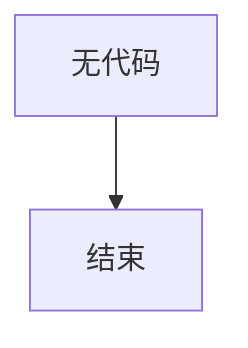

# `marker\marker\config\__init__.py` 详细设计文档

未提供源代码，当前无可分析的内容。

## 整体流程



## 类结构

```

```

## 全局变量及字段


    

## 全局函数及方法


## 关键组件


# 代码设计文档

## 1. 核心功能概述

由于未提供源代码，无法进行核心功能分析。

## 2. 文件运行流程

由于未提供源代码，无法分析运行流程。

## 3. 类详细信息

由于未提供源代码，无法提供类的详细信息。

## 4. 关键组件信息

由于未提供源代码，无法识别关键组件。

## 5. 潜在技术债务与优化空间

由于未提供源代码，无法分析技术债务。

## 6. 其它项目

由于未提供源代码，无法提供额外分析。


## 问题及建议


### 已知问题

-   未提供具体代码，无法进行技术债务或优化空间分析

### 优化建议

-   请提供需要分析的代码，以便进行详细的技术债务识别和优化建议


## 其它


### 设计目标与约束

本文档旨在详细阐述代码的核心功能、架构设计及实现细节。由于未提供具体代码文本，本部分将提供详细设计文档的标准内容框架。设计目标应明确系统需要实现的功能性需求和非功能性需求，如性能、安全性、可用性等。约束条件包括技术约束（如编程语言版本、框架依赖）、业务约束（如预算、时间节点）、法律合规约束（如数据隐私法规）等。

### 错误处理与异常设计

详细设计文档应包含异常分类体系，定义系统可能遇到的各类异常及其处理策略。需要明确错误码与错误信息的映射关系，确保错误可追溯。异常传播机制应说明异常如何在不同层次间传递和处理。日志记录策略需规定日志级别、记录内容和保留周期，便于问题诊断和审计。

### 数据流与状态机

数据流部分应使用数据流图（DFD）描述数据在系统中的流动路径、转换过程和存储方式。状态机部分应针对具有多种状态转换的对象或流程，使用状态图（State Diagram）明确状态定义、触发条件、转换动作和守卫条件。数据一致性保证机制需说明如何维护数据的完整性和一致性。

### 外部依赖与接口契约

外部依赖部分应列出所有第三方库、服务和系统组件，说明依赖关系、版本要求和获取方式。接口契约部分应详细定义模块间或系统间交互的API接口，包括请求/响应格式、参数说明、返回值定义、错误处理方式等。契约测试（Contract Testing）策略应说明如何验证接口实现的正确性。

### 安全性设计

安全性设计部分应包含身份验证（Authentication）机制，说明用户身份验证方式（如JWT、OAuth等）。授权（Authorization）机制应定义基于角色的访问控制（RBAC）或基于属性的访问控制（ABAC）策略。数据加密部分应说明敏感数据的加密算法和密钥管理方案。安全漏洞防护部分应列举常见安全威胁（如SQL注入、XSS、CSRF）的防护措施。

### 性能与可扩展性

性能部分应定义关键性能指标（KPI），如响应时间、吞吐量、并发用户数等，并设定目标值。瓶颈分析应识别系统潜在的性能瓶颈点，提出优化方案。扩展性设计应说明系统如何支持水平扩展和垂直扩展，包括负载均衡、数据分片、缓存策略等。

### 兼容性设计

兼容性部分应说明系统对不同平台、浏览器、设备的支持策略。向前兼容和向后兼容策略应规定如何处理新旧版本间的数据格式和接口变更。跨平台支持应说明系统在不同操作系统和环境下的运行要求。

### 部署架构

部署部分应包含系统部署拓扑图，说明各组件的部署位置和相互连接关系。环境配置应区分开发、测试、生产环境的差异配置。容器化方案（如Docker）和编排工具（如Kubernetes）的使用应在此部分说明。

### 监控与日志设计

监控部分应定义需要监控的关键指标（如CPU使用率、内存占用、请求延迟等）和告警阈值。日志设计应规定日志级别（DEBUG、INFO、WARN、ERROR、FATAL）、日志格式和记录内容。分布式追踪（如OpenTelemetry）方案应说明如何实现请求的全链路追踪。

### 测试策略

测试部分应说明单元测试、集成测试、系统测试、验收测试的覆盖范围和执行策略。测试自动化框架和工具应在此部分列出。性能测试和安全测试策略也应包含在内。

### 配置管理

配置管理部分应说明配置文件（如JSON、YAML、Properties）的结构和加载机制。环境变量和密钥管理方案应确保敏感信息的安全存储。配置变更的版本控制和发布流程应在此说明。

### 版本控制与发布策略

版本控制部分应定义版本号命名规则（如语义化版本控制）。发布流程应说明从代码提交到生产环境的完整流程。回滚计划应规定如何应对发布失败的情况，包括回滚触发条件和操作步骤。

### 附录与参考资料

附录部分应包含术语表，解释文档中使用的专业术语。参考资料应列出设计过程中引用的文档、标准、规范和工具链接。变更日志应记录文档的版本变更历史。

    