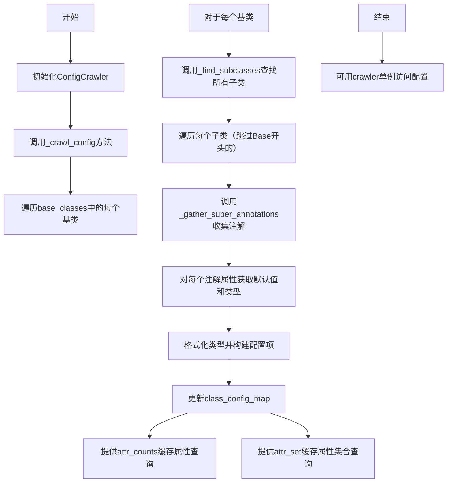
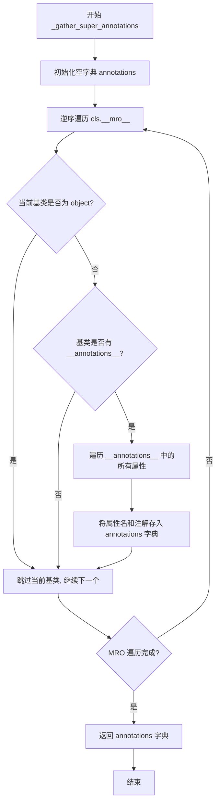
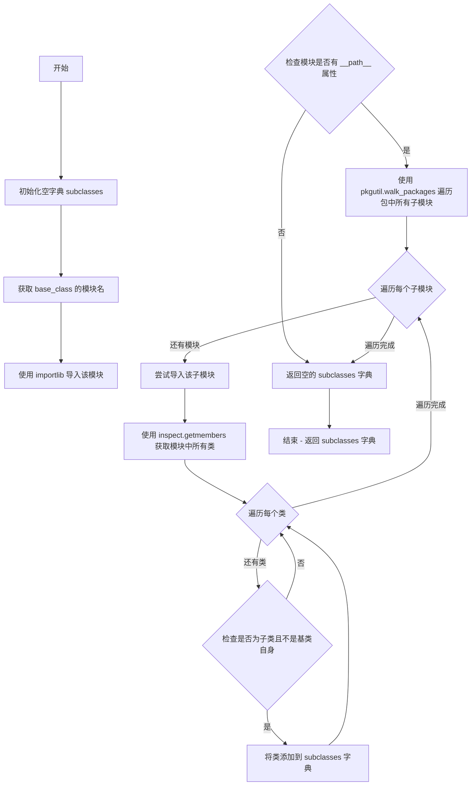

# `marker\marker\config\crawler.py` 详细设计文档

该代码实现了一个配置爬虫(ConfigCrawler)，通过动态扫描marker库中的多个基类(BaseBuilder, BaseProcessor, BaseConverter, BaseProvider, BaseRenderer, BaseService, BaseExtractor)的子类，自动收集并整理这些子类的配置属性、类型注解和默认值，生成统一的类配置映射表，供配置管理或动态实例化使用。

## 整体流程



## 类结构

```
ConfigCrawler (配置爬虫类)
├── base_classes (基类元组)
├── class_config_map (类配置映射字典)
├── _crawl_config (爬取配置方法)
├── _gather_super_annotations (收集父类注解)
├── _find_subclasses (查找子类)
├── _format_type (格式化类型)
├── attr_counts (属性计数缓存)
└── attr_set (属性集合缓存)
└── crawler (全局单例实例)
```

## 全局变量及字段


### `crawler`
    
全局配置爬虫单例实例

类型：`ConfigCrawler`
    


### `ConfigCrawler.base_classes`
    
基础类元组，包含所有待扫描的基类

类型：`Tuple[Type, ...]`
    


### `ConfigCrawler.class_config_map`
    
类配置映射表，键为基类类型名，值为子类配置字典

类型：`Dict[str, dict]`
    
    

## 全局函数及方法


### `ConfigCrawler.__init__`

该方法是 `ConfigCrawler` 类的构造函数，用于初始化配置爬虫实例。它接收一组基础类作为可选参数，实例化类配置映射字典，并触发配置爬取流程以扫描所有继承自指定基类的子类，收集其带注解的配置属性。

参数：

- `self`：`ConfigCrawler`，隐式的实例引用，无需显式传递
- `base_classes`：`Tuple[Type[BaseBuilder], Type[BaseProcessor], Type[BaseConverter], Type[BaseProvider], Type[BaseRenderer], Type[BaseService], Type[BaseExtractor]]`，可选参数（带默认值），指定要扫描的基类集合，默认为 marker 框架中的7种基础组件类型（元组）

返回值：`None`，`__init__` 方法不返回值，仅用于初始化对象状态

#### 流程图

```mermaid
flowchart TD
    A[开始 __init__] --> B{base_classes 参数是否显式传入?}
    B -->|否 - 使用默认值| C[使用默认的7个基类元组]
    B -->|是 - 显式传入| D[使用传入的 base_classes]
    C --> E[self.base_classes = base_classes]
    D --> E
    E --> F[初始化 self.class_config_map = {}]
    F --> G[调用 self._crawl_config]
    G --> H[遍历 base_classes 中的每个基类]
    H --> I[调用 _find_subclasses 查找子类]
    I --> J[遍历每个子类]
    J --> K[_gather_super_annotations 收集注解属性]
    K --> L[格式化类型并提取默认值]
    L --> M[存储到 class_config_map]
    M --> N[结束 __init__]
```

#### 带注释源码

```python
def __init__(
    self,
    base_classes=(
        BaseBuilder,
        BaseProcessor,
        BaseConverter,
        BaseProvider,
        BaseRenderer,
        BaseService,
        BaseExtractor,
    ),
):
    """
    初始化 ConfigCrawler 实例。

    参数:
        base_classes: 可选的基类元组，指定要扫描的组件类型。
                      默认为 marker 框架的7种核心组件类型。

    返回:
        None (构造函数无返回值)
    """
    # 将传入的基类元组存储为实例属性，供后续方法使用
    self.base_classes = base_classes
    
    # 初始化类配置映射字典，结构为:
    # {base_class_type: {class_name: {"class_type": class, "config": {attr: (raw_type, formatted_type, default, metadata)}}}}
    self.class_config_map: Dict[str, dict] = {}

    # 触发配置爬取流程，扫描所有基类的子类并收集配置信息
    self._crawl_config()
```


### `ConfigCrawler._crawl_config`

该方法通过遍历预定义的基类（如Builder、Processor、Converter等），使用pkgutil和importlib动态发现这些基类的所有非Base前缀子类，然后递归收集每个子类及其父类的类型注解，解析Annotated元数据和默认值，最终将所有配置信息存储到self.class_config_map字典中，供后续的attr_counts和attr_set属性使用。

参数：

- `self`：实例方法隐含的self参数，无需显式传入

返回值：`None`，该方法直接修改实例属性`self.class_config_map`，不返回任何值

#### 流程图

```mermaid
flowchart TD
    A[开始 _crawl_config] --> B[遍历 self.base_classes]
    B --> C[获取base类名, 去除Base前缀]
    C --> D[初始化class_config_map[base_class_type]为空字典]
    D --> E[调用_find_subclasses查找base的所有子类]
    E --> F{子类名称是否以Base开头?}
    F -->|是| G[跳过该子类]
    F -->|否| H[初始化class_config_map[base_class_type][class_name]]
    H --> I[调用_gather_super_annotations收集类的注解属性]
    I --> J{遍历每个attr, attr_type}
    J --> K[获取attr的默认值: getattr(class_type, attr)]
    K --> L[构建默认metadata: 'Default is {default}']
    L --> M{attr_type是Annotated?}
    M -->|否| N[直接格式化类型]
    M -->|是| O{metadata中已有Default描述?}
    O -->|是| P[保持原有metadata]
    O -->|否| Q[追加默认metadata到原有metadata后面]
    P --> R[提取Annotated的实际类型]
    Q --> R
    N --> S[调用_format_type格式化类型]
    R --> S
    S --> T[存储配置到class_config_map]
    T --> J
    J --> U{还有更多子类?}
    U -->|是| E
    U -->|否| V{还有更多base类?}
    V -->|是| B
    V -->|否| W[结束]
    G --> U
```

#### 带注释源码

```python
def _crawl_config(self):
    """
    爬取所有基类的子类配置信息，并存储到class_config_map中。
    该方法遍历预定义的base_classes，查找每个基类的所有非Base前缀子类，
    然后收集这些子类的类型注解、默认值和元数据，构建配置映射表。
    """
    # 遍历所有预定义的基类（Builder, Processor, Converter等）
    for base in self.base_classes:
        # 获取基类名称并移除"Base"前缀，例如BaseBuilder -> Builder
        base_class_type = base.__name__.removeprefix("Base")
        
        # 在class_config_map中为该基类类型初始化空字典
        self.class_config_map.setdefault(base_class_type, {})
        
        # 查找该基类的所有子类
        for class_name, class_type in self._find_subclasses(base).items():
            # 跳过以Base开头的类（排除BaseBuilder等抽象基类本身）
            if class_name.startswith("Base"):
                continue

            # 初始化该类的配置结构
            # 存储class_type和空的config字典
            self.class_config_map[base_class_type].setdefault(
                class_name, {"class_type": class_type, "config": {}}
            )
            
            # 收集该类及其父类的所有带注解的属性
            for attr, attr_type in self._gather_super_annotations(
                class_type
            ).items():
                # 获取该属性的默认值
                default = getattr(class_type, attr)
                
                # 构建默认的元数据描述
                metadata = (f"Default is {default}.",)

                # 检查类型注解是否为Annotated类型
                if get_origin(attr_type) is Annotated:
                    # 如果元数据中已包含"Default"描述，则保持原元数据
                    if any("Default" in desc for desc in attr_type.__metadata__):
                        metadata = attr_type.__metadata__
                    else:
                        # 否则将默认描述追加到现有元数据后面
                        metadata = attr_type.__metadata__ + metadata
                    
                    # 提取Annotated中的实际类型（第一个参数）
                    attr_type = get_args(attr_type)[0]

                # 格式化类型为可读字符串
                formatted_type = self._format_type(attr_type)
                
                # 将该属性的配置信息存储到class_config_map中
                # 配置信息包含：(原始类型, 格式化类型, 默认值, 元数据)
                self.class_config_map[base_class_type][class_name]["config"][
                    attr
                ] = (attr_type, formatted_type, default, metadata)
```


### ConfigCrawler._gather_super_annotations

该方法是一个静态方法，用于收集指定类及其所有超类中通过类型注解（`__annotations__`）声明的属性。它采用从基类到派生类的顺序遍历MRO（方法解析顺序），确保子类属性会覆盖超类的同名属性，最终返回一个属性名到类型注解的字典。

参数：

- `cls`：`Type`，要收集注解的目标类

返回值：`Dict[str, Type]`，返回属性名到类型注解的映射字典

#### 流程图



#### 带注释源码

```python
@staticmethod
def _gather_super_annotations(cls: Type) -> Dict[str, Type]:
    """
    Collect all annotated attributes from `cls` and its superclasses, bottom-up.
    Subclass attributes overwrite superclass attributes with the same name.
    """
    # 初始化结果字典，用于存储收集到的属性注解
    annotations = {}
    
    # 逆序遍历 MRO（方法解析顺序），从基类到派生类
    # 这样确保派生类的属性会覆盖超类的同名属性
    for base in reversed(cls.__mro__):
        # 跳过 Python 内置的 object 基类
        if base is object:
            continue
        
        # 检查当前基类是否具有 __annotations__ 属性
        # __annotations__ 存储了类中所有类型注解
        if hasattr(base, "__annotations__"):
            # 遍历当前基类的所有注解属性
            for name, annotation in base.__annotations__.items():
                # 将属性名和类型注解存入字典
                # 由于是逆序遍历，后续的派生类属性会覆盖先前的超类属性
                annotations[name] = annotation
    
    # 返回收集完成的注解字典
    return annotations
```


### `ConfigCrawler._find_subclasses`

该方法用于动态发现并返回给定基类的所有子类。它通过遍历基类所在模块包中的所有子模块，使用 Python 的 `importlib` 和 `pkgutil` 来探索模块层次结构，并使用 `inspect` 模块检查每个模块中的类，找出继承自指定基类的所有类（排除基类自身）。

参数：

- `base_class`：`Type`，要查找子类的基类类型

返回值：`Dict[str, Type]`，一个字典，键为类名，值为对应的类类型，表示该基类的所有子类

#### 流程图



#### 带注释源码

```python
def _find_subclasses(self, base_class):
    """
    Find all subclasses of a given base class by walking through the module package.
    
    This method dynamically discovers subclasses by:
    1. Getting the module where the base class is defined
    2. Walking through all modules in that package
    3. Inspecting each module for classes that inherit from the base class
    
    Args:
        base_class: The base class type to find subclasses of
        
    Returns:
        Dict[str, Type]: A dictionary mapping class names to class types
    """
    # 初始化一个空字典用于存储子类
    subclasses = {}
    
    # 获取基类所在的模块名称
    module_name = base_class.__module__
    
    # 动态导入基类所在的模块
    package = importlib.import_module(module_name)
    
    # 检查该模块是否是一个包（有 __path__ 属性）
    if hasattr(package, "__path__"):
        # 遍历该包下的所有子模块
        # pkgutil.walk_packages 会递归遍历所有子包和子模块
        for _, module_name, _ in pkgutil.walk_packages(
            package.__path__, module_name + "."  # 添加前缀形成完整模块名
        ):
            try:
                # 动态导入子模块
                module = importlib.import_module(module_name)
                
                # 使用 inspect.getmembers 获取模块中所有类
                # inspect.isclass 作为过滤函数，只返回类对象
                for name, obj in inspect.getmembers(module, inspect.isclass):
                    # 检查 obj 是否是 base_class 的子类
                    # 并且排除 base_class 本身（避免将基类也包含进来）
                    if issubclass(obj, base_class) and obj is not base_class:
                        subclasses[name] = obj
            except ImportError:
                # 如果导入失败（比如模块有语法错误或缺少依赖），跳过该模块
                pass
    
    # 返回包含所有子类的字典
    return subclasses
```


### `ConfigCrawler._format_type`

该方法负责将 Python 类型对象格式化为可读的字符串形式，能够处理带泛型参数的类型（如 `Optional[int]`）和普通类型（如 `int`、`str`）。

参数：

- `t`：`Type`，需要格式化的 Python 类型对象，支持普通类型和带泛型的类型

返回值：`str`，格式化后的类型字符串，例如 `"int"` 或 `"Optional[int]"`

#### 流程图

```mermaid
graph TD
    A[开始 _format_type] --> B{get_origin(t) 是否有值?}
    B -->|有 origin<br/>处理 Optional/List 等类型| C[返回 f"{t}".removeprefix<br/>去掉 typing. 前缀]
    B -->|无 origin<br/>处理 int/str 等普通类型| D[返回 t.__name__]
    C --> E[结束]
    D --> E[结束]
```

#### 带注释源码

```python
def _format_type(self, t: Type) -> str:
    """
    Format a typing type like Optional[int] into a readable string.
    
    Args:
        t: Python 类型对象，可以是普通类型（如 int, str）或带泛型的类型（如 Optional[int], List[str]）
    
    Returns:
        格式化后的字符串形式，例如 "int" 或 "Optional[int]"
    """
    # 检查类型是否有 origin（即是否是泛型类型如 Optional, List, Union 等）
    # get_origin() 对于 Optional[int] 返回 Optional，对于 int 返回 None
    if get_origin(t):
        # 处理带泛型的类型，将 typing.Optional[int] 转换为 Optional[int]
        return f"{t}".removeprefix("typing.")
    else:
        # 处理普通类型（如 int, str, bool 等），直接获取类型名称
        return t.__name__
```


### `ConfigCrawler.attr_counts`

该方法是一个缓存属性，用于统计所有配置类中各个属性（配置项）出现的次数，返回一个字典，其中键为属性名称，值为该属性在所有类中出现的次数。

参数：

- `self`：隐式参数，`ConfigCrawler` 实例本身，无需显式传递

返回值：`Dict[str, int]`，返回一个字典，键为属性名称（字符串），值为该属性在所有类配置中出现的次数（整数）

#### 流程图

```mermaid
flowchart TD
    A[开始 attr_counts] --> B[初始化空字典 counts]
    B --> C[遍历 class_config_map 的所有值 base_type_dict]
    C --> D[遍历每个 base_type_dict 的值 class_map]
    D --> E[遍历 class_map['config'] 的所有键 attr]
    E --> F{attr 是否已在 counts 中}
    F -->|是| G[counts[attr] += 1]
    F -->|否| H[counts[attr] = 1]
    G --> I[继续遍历下一个 attr]
    H --> I
    I --> J{是否还有更多 attr}
    J -->|是| E
    J -->|否| K{是否还有更多 class_map}
    K -->|是| D
    K -->|否| L{是否还有更多 base_type_dict}
    L -->|是| C
    L -->|否| M[返回 counts 字典]
    M --> N[结束]
```

#### 带注释源码

```python
@cached_property
def attr_counts(self) -> Dict[str, int]:
    """
    统计所有配置类中每个属性出现的次数。
    
    这是一个缓存属性（cached_property），首次访问时会计算结果并缓存，
    后续访问直接返回缓存值，避免重复计算。
    
    返回值是一个字典，键为属性名，值为该属性在所有类中出现的总次数。
    这有助于了解哪些配置项是最常用的，或者识别可能需要重构的重复配置。
    
    Returns:
        Dict[str, int]: 属性名到出现次数的映射字典
    """
    # 初始化一个空字典用于存储计数结果
    counts: Dict[str, int] = {}
    
    # 遍历所有基础类型（如 Builder, Converter, Provider 等）的配置映射
    for base_type_dict in self.class_config_map.values():
        # 遍历每个基础类型下的所有具体类（如 PDFConverter, TextConverter 等）
        for class_map in base_type_dict.values():
            # 遍历该类中所有的配置属性（从 config 字典中获取键）
            for attr in class_map["config"].keys():
                # 使用 get 方法获取当前计数，如果不存在则默认为 0，然后加 1
                # 这样可以统计每个属性在所有类中出现的总次数
                counts[attr] = counts.get(attr, 0) + 1
    
    # 返回包含所有属性及其出现次数的字典
    return counts
```


### `ConfigCrawler.attr_set`

该属性用于收集并返回项目中共存在的所有配置属性名称集合，包括单独的属性名（如 `provider`）和带类名前缀的属性名（如 `PdfReaderProvider_provider`），以便于配置管理和验证。

参数：

- `self`：`ConfigCrawler`，隐式参数，表示类的实例本身

返回值：`Set[str]`，返回一个包含所有唯一配置属性名称的集合，其中包含两种格式：纯属性名（如 `provider`）和带类名前缀的组合名（如 `PdfReaderProvider_provider`）。

#### 流程图

```mermaid
flowchart TD
    A[开始 attr_set] --> B[初始化空集合 attr_set: Set[str]]
    B --> C[遍历 class_config_map 的所有 base_type_dict]
    C --> D{遍历完毕?}
    D -->|否| E[获取 class_name 和 class_map]
    E --> F[遍历 class_map['config'] 的所有属性键]
    F --> G{属性遍历完毕?}
    G -->|否| H[将属性名 attr 添加到 attr_set]
    H --> I[将 {class_name}_{attr} 格式字符串添加到 attr_set]
    I --> F
    G -->|是| C
    D -->|是| J[返回 attr_set 集合]
    J --> K[结束]
```

#### 带注释源码

```python
@cached_property
def attr_set(self) -> Set[str]:
    """
    收集所有配置属性的唯一名称集合。
    
    返回两种格式的属性名：
    1. 纯属性名（如 'provider'）
    2. 带类名前缀的组合名（如 'PdfReaderProvider_provider'）
    
    Returns:
        Set[str]: 包含所有唯一配置属性名称的集合
    """
    # 1. 初始化空集合，用于存储所有属性名
    attr_set: Set[str] = set()
    
    # 2. 遍历 class_config_map 中的所有基础类型字典
    #    class_config_map 结构: {base_type: {class_name: {'class_type': ..., 'config': {...}}}}
    for base_type_dict in self.class_config_map.values():
        
        # 3. 遍历每个基础类型下的所有类映射
        for class_name, class_map in base_type_dict.items():
            
            # 4. 遍历每个类的所有配置属性
            #    config 结构: {attr_name: (attr_type, formatted_type, default, metadata)}
            for attr in class_map["config"].keys():
                
                # 5. 添加纯属性名到集合
                attr_set.add(attr)
                
                # 6. 添加带类名前缀的组合属性名到集合
                #    格式: {类名}_{属性名}
                attr_set.add(f"{class_name}_{attr}")
    
    # 7. 返回包含所有属性名的集合
    return attr_set
```

## 关键组件


### ConfigCrawler

核心爬虫类，通过静态分析自动扫描marker库中所有BaseBuilder、BaseProcessor、BaseConverter、BaseProvider、BaseRenderer、BaseService、BaseExtractor的子类，收集其带类型注解的配置属性及其默认值，构建配置映射表供外部使用。

### 类型注解处理机制

利用Python的`Annotated`、`get_origin`和`get_args`从类型注解中提取元数据（包括默认值描述），支持 Optional、List 等泛型类型解析，将复杂类型格式化为可读字符串。

### 类继承层次遍历

通过`__mro__`（方法解析顺序）自底向上遍历类的继承链，收集所有基类的`__annotations__`，子类属性会覆盖同名父类属性，实现配置属性的聚合与继承。

### 动态模块发现与子类扫描

使用`importlib`和`pkgutil.walk_packages`递归扫描base_class所在包的所有子模块，通过`inspect.getmembers`过滤出真实的子类，排除抽象基类本身。

### 配置映射表结构

`class_config_map`字典按基类类型（如"Builder"、"Converter"）分组，每类下存储子类名到配置对象的映射，配置对象包含`class_type`和`config`字段，config字段进一步映射属性名到(原始类型、格式化类型、默认值、元数据)的元组。

### 属性统计与去重

通过`cached_property`缓存`attr_counts`（统计各属性在所有类中的出现频次）和`attr_set`（收集所有属性名及带类名前缀的完整属性名），用于配置冲突检测或UI展示。


## 问题及建议


### 已知问题

- **缺少异常处理和日志记录**：`_crawl_config` 和 `_find_subclasses` 方法中缺乏异常捕获和日志记录，特别是 `except ImportError: pass` 会静默忽略导入错误，可能隐藏潜在问题
- **重复导入模块**：`_find_subclasses` 方法中先通过 `importlib.import_module(module_name)` 导入包，之后在循环内又再次导入同一模块，导致重复导入性能开销
- **类型格式化不完善**：`_format_type` 方法对复杂泛型类型（如 `List[int]`、`Dict[str, Any]`、`Union[int, str]`）的处理不够完善，仅简单移除 `typing.` 前缀
- **可变默认参数风险**：`__init__` 中的 `base_classes` 默认参数使用可变对象 tuple，虽然当前未被修改，但不符合最佳实践
- **`attr_set` 冗余存储**：`attr_set` 同时存储 `attr` 和 `{class_name}_{attr}`，造成数据冗余，增加内存消耗
- **缺乏抽象类过滤**：代码通过 `class_name.startswith("Base")` 过滤基类，但未检查类的抽象性质，可能将抽象类或接口类纳入配置
- **元组使用不当**：`metadata` 变量使用单元素元组 `(f"Default is {default}.",)` 而非列表或字符串，后续却按列表操作（`+ metadata`），语义不清晰
- **`_gather_super_annotations` 每次重新遍历 MRO**：每次调用都完整遍历类的 MRO 链，未做缓存优化

### 优化建议

- 添加详细的异常处理和日志记录机制，对 ImportError 进行分类处理和报告
- 使用 `sys.modules` 检查或缓存已导入模块，避免重复导入
- 增强 `_format_type` 方法，处理 `List`、`Dict`、`Union` 等复杂泛型类型，使用 `typing.get_origin` 和 `get_args` 递归格式化
- 将默认 base_classes 设为 `None`，在方法内部进行检查和初始化
- 移除 `attr_set` 中的冗余存储，或仅保留必要的唯一属性集合
- 增加 `inspect.isabstract()` 检查，过滤抽象基类
- 统一 `metadata` 数据结构，建议使用列表便于后续操作
- 考虑为 `_gather_super_annotations` 添加缓存机制，或在类级别缓存注解结果
- 添加类型注解完善代码可维护性，特别是 `self.class_config_map` 的结构定义

## 其它


### 设计目标与约束

该代码的核心目标是通过动态扫描marker库中所有继承自BaseBuilder、BaseProcessor、BaseConverter、BaseProvider、BaseRenderer、BaseService、BaseExtractor的子类，自动收集它们的配置属性（通过Annotated类型注解），生成一个统一的配置映射表。主要约束包括：仅处理以"Base"开头的基类会被跳过；仅扫描base_class所在模块的包路径；使用cached_property缓存结果以避免重复计算。

### 错误处理与异常设计

代码中的异常处理主要体现在两个方面：1) 在_walk_packages遍历模块时，使用try-except捕获ImportError，防止单个模块导入失败导致整个爬取过程中断；2) 使用hasattr和getattr进行安全属性访问，避免属性不存在时抛出异常。没有显式的自定义异常类，失败时采用静默跳过策略。

### 数据流与状态机

数据流为：初始化ConfigCrawler → 自动调用_crawl_config() → 遍历base_classes列表 → 对每个base找到所有子类 → 遍历子类的注解属性 → 格式化类型并提取默认值和元数据 → 存储到class_config_map字典。状态机较为简单，仅存在"爬取完成"一种稳定状态，attr_counts和attr_set为派生缓存属性。

### 外部依赖与接口契约

依赖的外部模块包括：importlib用于动态导入模块、inspect用于获取类成员、pkgutil用于遍历包路径、functools.cached_property用于缓存、typing模块用于处理类型注解。接口契约方面，爬取的类需满足：1) 继承自指定的Base类；2) 使用Annotated类型注解定义配置属性；3) 配置属性需有默认值；4) 基类模块需有__path__属性以便遍历。

### 性能考虑

代码使用@cached_property装饰器缓存attr_counts和attr_set，避免重复遍历配置映射表。_find_subclasses方法使用pkgutil.walk_packages进行模块遍历，在大型包结构下可能存在性能瓶颈。类型格式化使用简单的字符串操作，效率较高。整体设计适合一次性初始化后多次查询的场景。

### 安全性考虑

代码主要涉及运行时自省，安全性风险较低。潜在风险包括：1) 动态导入模块可能执行模块级代码；2) getattr获取默认值时假设属性存在，虽有get_origin检查但仍需确保配置属性都有默认值；3) 未对导入的类进行白名单验证。建议在生产环境中对模块导入进行限制。

### 可扩展性设计

扩展点包括：1) 可通过传入不同的base_classes元组来爬取其他类型的组件；2) 可在class_config_map结构中扩展更多配置项；3) 可在_format_type中添加更多类型格式化逻辑；4) 可继承ConfigCrawler并重写特定方法以定制行为。当前设计通过字典存储配置，支持后续添加新的配置属性。

### 配置管理

配置信息存储在self.class_config_map中，结构为{base_class_type: {class_name: {class_type, config: {attr: (原始类型, 格式化类型, 默认值, 元数据)}}}}。通过attr_counts可统计各配置属性的使用频率，通过attr_set可获取所有配置属性名（含前缀形式）。配置信息为只读生成，无运行时修改接口。

### 模块依赖关系

该代码依赖于marker库中的以下基类：BaseBuilder、BaseProcessor、BaseConverter、BaseProvider、BaseRenderer、BaseService、BaseExtractor。这些基类定义在marker.builders、marker.converters、marker.extractors、marker.processors、marker.providers、marker.renderers、marker.services模块中。爬虫代码本身位于marker目录下的某个模块中（未明确显示文件名）。

### 使用示例

```python
# 创建爬虫实例并自动爬取配置
crawler = ConfigCrawler()

# 获取所有配置映射
print(crawler.class_config_map)

# 获取特定类型的配置
print(crawler.class_config_map.get("Converter", {}))

# 获取配置属性使用统计
print(crawler.attr_counts)

# 获取所有配置属性集合
print(crawler.attr_set)
```

    