# `marker\marker\config\parser.py` 详细设计文档

配置文件解析器类，用于解析CLI选项并生成配置字典，支持多种输出格式（markdown/json/html/chunks）、处理器加载、LLM服务配置以及PDF转换器选择，为marker工具提供灵活的命令行配置能力。

## 整体流程

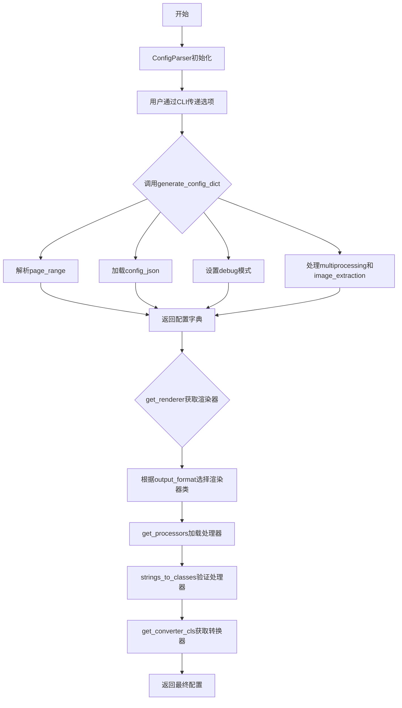

## 类结构

```
ConfigParser (配置解析器类)
├── __init__ (构造函数)
├── common_options (静态方法装饰器)
├── generate_config_dict (生成配置字典)
├── get_llm_service (获取LLM服务)
├── get_renderer (获取渲染器)
├── get_processors (获取处理器列表)
├── get_converter_cls (获取转换器类)
├── get_output_folder (获取输出文件夹)
└── get_base_filename (获取基础文件名)
```

## 全局变量及字段


### `logger`
    
日志记录器实例，用于记录程序运行过程中的日志信息

类型：`Logger`
    


### `ConfigParser.cli_options`
    
CLI选项字典，存储从命令行传入的配置参数

类型：`dict`
    
    

## 全局函数及方法


### `classes_to_strings`

这是一个工具函数，导入自 `marker.util` 模块。该函数接收一个类列表作为输入，将其转换为对应的完全限定名称字符串列表，常用于配置处理中类与字符串表示之间的相互转换。

#### 参数

- `classes`：`List[Type]` 或 `List[type]`，待转换的类对象列表

#### 返回值

`List[str]`，返回与输入类对应的完全限定名称字符串列表

#### 流程图


#### 带注释源码

```
# 注意：此函数的实际源码未在本文件中提供
# 以下为基于函数调用方式推断的实现逻辑

def classes_to_strings(classes: List[type]) -> List[str]:
    """
    将类对象转换为完全限定名称字符串
    
    参数:
        classes: 类对象列表，如 [PDFConverter, JSONRenderer]
    
    返回值:
        字符串列表，如 ['marker.converters.pdf.PdfConverter', 'marker.renderers.json.JSONRenderer']
    """
    result = []
    for cls in classes:
        # 获取类的模块名和类名，拼接为完全限定名称
        module = cls.__module__
        name = cls.__name__
        full_name = f"{module}.{name}"
        result.append(full_name)
    return result
```

---

**备注**：由于 `classes_to_strings` 函数定义在外部模块 `marker.util` 中，本文件仅提供了该函数的导入和使用示例。该函数的实际源码位于 `marker/util.py` 文件中，建议查看该文件以获取完整的实现细节。


### `parse_range_str`

解析页码范围字符串，将用户输入的页码范围（如 "0,5-10,20"）转换为程序内部可用的格式。

参数：

-  `page_str`：`str`，需要解析的页码范围字符串，格式为逗号分隔的数字或范围（如 "0,5-10,20"）

返回值：`list[int]` 或 `list[tuple[int, int]]`，解析后的页码列表或范围列表

#### 流程图

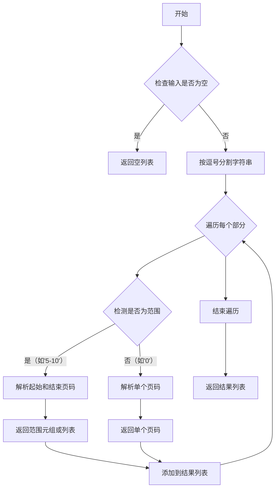

#### 带注释源码

注意：`parse_range_str` 函数是从 `marker.util` 模块导入的，其实现不在当前代码文件中。以下源码基于其使用方式推断：

```
# 假设的实现方式（从marker.util导入，实际定义不在此文件中）
def parse_range_str(page_str: str):
    """
    解析页码范围字符串
    
    参数:
        page_str: 形如 "0,5-10,20" 的字符串
    
    返回:
        解析后的页码列表，如 [0, 5, 6, 7, 8, 9, 10, 20]
    """
    if not page_str:
        return []
    
    pages = []
    parts = page_str.split(',')
    
    for part in parts:
        part = part.strip()
        if '-' in part:
            # 处理范围，如 "5-10"
            start, end = part.split('-')
            start, end = int(start.strip()), int(end.strip())
            pages.extend(range(start, end + 1))
        else:
            # 处理单个页码，如 "0"
            pages.append(int(part))
    
    return pages

# 在ConfigParser中的使用方式
case "page_range":
    config["page_range"] = parse_range_str(v)  # v 是 CLI 传入的字符串参数
```

#### 备注

- **函数来源**：`parse_range_str` 是在 `marker.util` 模块中定义的，从该模块导入到当前文件
- **使用场景**：在 `ConfigParser.generate_config_dict()` 方法中，当 CLI 参数包含 `page_range` 时调用
- **输入示例**：`"0,5-10,20"`
- **输出示例**：`[0, 5, 6, 7, 8, 9, 10, 20]`（具体格式取决于实际实现）


### `strings_to_classes`

将类的字符串路径（模块路径）转换为实际的类对象。主要用于动态加载类，支持从配置文件或命令行传入的类路径字符串。

参数：
- `class_paths`：`List[str]`，需要转换的类路径字符串列表，例如 `["marker.services.gemini.GoogleGeminiService"]`

返回值：`List[type]`，转换后的类对象列表

#### 流程图

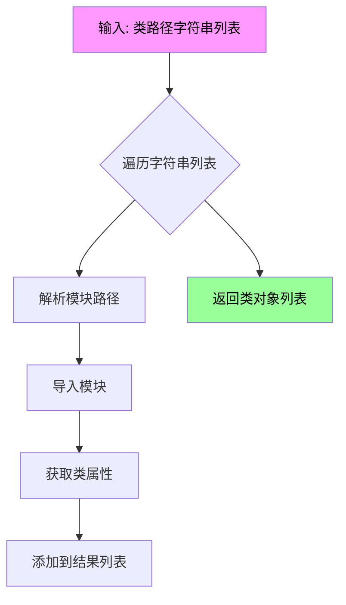

#### 带注释源码

```python
# 注：以下源码为基于使用方式推断的实现逻辑，
# 实际源码位于 marker.util 模块中，当前代码文件仅引用了该函数

def strings_to_classes(class_paths: List[str]) -> List[type]:
    """
    将类路径字符串转换为类对象
    
    参数:
        class_paths: 类路径字符串列表，如 ["module.submodule.ClassName"]
        
    返回:
        类对象列表
    """
    classes = []
    for class_path in class_paths:
        # 导入模块并获取类
        module_path, class_name = class_path.rsplit('.', 1)
        module = importlib.import_module(module_path)
        cls = getattr(module, class_name)
        classes.append(cls)
    return classes
```

#### 在 ConfigParser 中的调用示例

```python
# 在 get_converter_cls 方法中调用
converter_cls = self.cli_options.get("converter_cls", None)
if converter_cls is not None:
    try:
        return strings_to_classes([converter_cls])[0]  # 返回 PdfConverter 类
    except Exception as e:
        logger.error(f"Error loading converter: {converter_cls} with error: {e}")
        raise

# 在 get_processors 方法中调用
processors = self.cli_options.get("processors", None)
if processors is not None:
    processors = processors.split(",")
    for p in processors:
        try:
            strings_to_classes([p])  # 验证类是否可加载
        except Exception as e:
            logger.error(f"Error loading processor: {p} with error: {e}")
            raise
```


### PdfConverter

PdfConverter 是 marker 库的核心 PDF 转换器类，负责将 PDF 文档转换为多种输出格式（如 Markdown、JSON、HTML 或 chunks）。该类从外部模块 `marker.converters.pdf` 导入，在 `ConfigParser.get_converter_cls()` 方法中作为默认转换器被引用。

#### 流程图

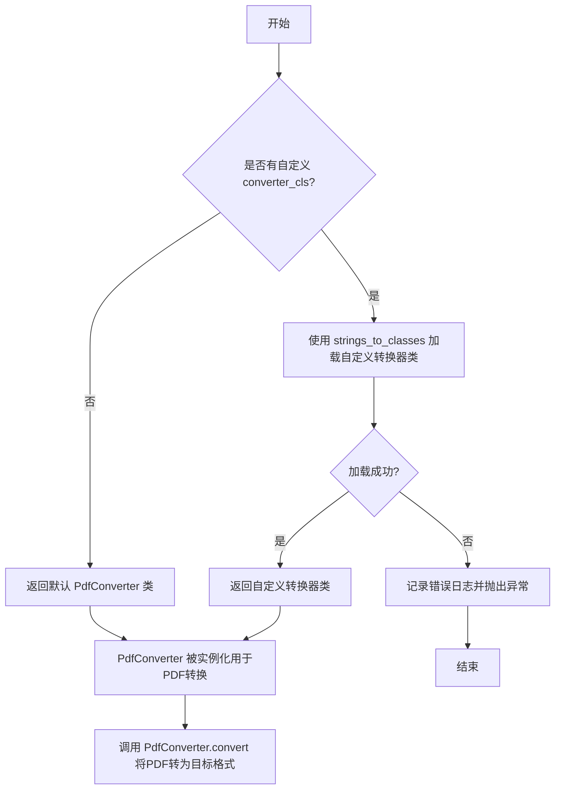

#### 带注释源码

```python
# 从 marker.converters.pdf 模块导入 PdfConverter 类
# 注意：PdfConverter 类的完整定义在 marker.converters.pdf 模块中
# 此处仅为导入语句，实际类定义不在本代码文件中
from marker.converters.pdf import PdfConverter

# 在 ConfigParser 类中使用 PdfConverter
def get_converter_cls(self):
    """
    获取转换器类
    
    如果 cli_options 中指定了自定义 converter_cls，则尝试加载自定义转换器；
    否则返回默认的 PdfConverter 类。
    """
    converter_cls = self.cli_options.get("converter_cls", None)
    if converter_cls is not None:
        try:
            # 使用字符串转换工具加载自定义转换器类
            return strings_to_classes([converter_cls])[0]
        except Exception as e:
            logger.error(
                f"Error loading converter: {converter_cls} with error: {e}"
            )
            raise

    # 返回默认的 PdfConverter 类
    return PdfConverter
```

#### 补充说明

由于 `PdfConverter` 类的完整定义在外部模块 `marker.converters.pdf` 中，以下是基于代码上下文推断的类接口信息：

**推断的类接口：**

- **类名**：PdfConverter
- **模块来源**：marker.converters.pdf
- **主要用途**：将 PDF 文档转换为 Markdown、JSON、HTML 或 chunks 格式
- **典型用法**：在转换流程中实例化并调用 `convert()` 方法处理 PDF 文件

**潜在的技术债务或优化空间：**

1. **外部依赖透明度**：PdfConverter 的具体实现不在当前代码仓库中，建议在项目中维护该类的完整文档或接口定义
2. **错误处理**：建议为 converter_cls 加载失败提供更友好的错误信息，包括可能的解决方案
3. **类型提示缺失**：当前导入语句缺少完整的类型注解，建议在项目内部使用时添加类型检查

**设计目标与约束：**

- 默认转换器必须支持 PDF 到多种格式的转换
- 支持通过配置动态替换转换器实现
- 转换器类必须与 renderer 系统兼容


# 文档分析结果

## 注意事项

从提供的代码中，我只能提取到 **ChunkRenderer 类的导入和使用方式**，但**没有找到 ChunkRenderer 类的实际实现代码**。

代码中仅包含以下与 ChunkRenderer 相关的内容：

1. **导入语句**：`from marker.renderers.chunk import ChunkRenderer`
2. **使用方式**：在 `ConfigParser.get_renderer()` 方法中作为输出格式选项之一

---

## 提取到的 ChunkRenderer 相关信息

### `ChunkRenderer`

#### 基本信息

- **模块来源**：`marker.renderers.chunk`
- **类型**：类（Class）
- **用途**：作为渲染器选项，用于将文档转换为 "chunks" 格式

#### 在代码中的使用方式

```python
case "chunks":
    r = ChunkRenderer
```

---

## 建议

由于提供的代码片段中**不包含 ChunkRenderer 类的完整实现**（只有导入语句），若需要生成完整的详细设计文档，请提供以下任一信息：

1. **`marker/renderers/chunk.py`** 文件的完整源代码
2. ChunkRenderer 类的具体实现代码

---

## 已完整分析的代码：ConfigParser 类

如果您需要，我可以提供当前代码中 **ConfigParser 类的详细设计文档**，它完整展示了配置解析器的工作流程和各项方法。

---

如需补充 ChunkRenderer 的源代码，请提供该类的实现，我会为您生成完整的详细设计文档，包括：
- 类的字段和方法详细信息
- Mermaid 流程图
- 带注释的源代码
- 潜在技术债务和优化建议


### `HTMLRenderer`

该类是一个HTML渲染器，用于将PDF文档内容转换为HTML格式。它在`ConfigParser.get_renderer()`方法中被引用，根据输出格式选项返回对应的渲染器类。

**注意**：提供的代码片段中仅包含对`HTMLRenderer`的导入语句，类定义位于`marker/renderers.html`模块中，未在当前代码中显示。以下信息基于导入上下文和`ConfigParser`类的使用方式推断。

#### 参数

由于未找到类的完整定义，无法提供确切参数信息。根据代码用途推测：
- **document**: 文档对象，需要转换为HTML的输入数据
- **config**: 配置字典，包含渲染选项

#### 返回值

- `str`，返回渲染后的HTML字符串

#### 流程图

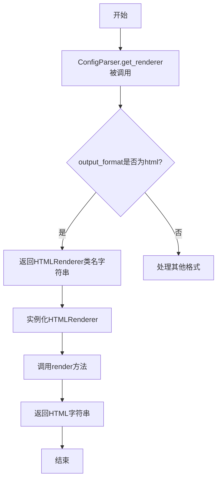

#### 带注释源码

```python
# 从 marker.renderers.html 模块导入 HTMLRenderer 类
from marker.renderers.html import HTMLRenderer

# 在 ConfigParser 类中使用 HTMLRenderer
def get_renderer(self):
    match self.cli_options["output_format"]:
        case "json":
            r = JSONRenderer
        case "markdown":
            r = MarkdownRenderer
        case "html":
            r = HTMLRenderer  # 当输出格式为html时使用
        case "chunks":
            r = ChunkRenderer
        case _:
            raise ValueError("Invalid output format")
    return classes_to_strings([r])[0]
```

**说明**：由于`HTMLRenderer`类的具体实现未在提供的代码中，建议查看`marker/renderers/html.py`文件以获取完整的类定义、方法说明和字段信息。


### JSONRenderer

JSONRenderer 是 marker 库中的一个渲染器类，负责将文档转换为 JSON 格式输出。从代码中使用方式来看，该类被 ConfigParser.get_renderer() 方法引用，当用户指定 `--output_format json` 时会选择该渲染器进行文档转换。

#### 流程图

```mermaid
graph TD
    A[ConfigParser.get_renderer] --> B{output_format == 'json'}
    B -->|是| C[JSONRenderer]
    B -->|否| D[其他渲染器]
    C --> E[classes_to_strings([JSONRenderer])]
    E --> F[返回类的字符串表示]
```

#### 带注释源码

```python
# 在给定代码片段中的引用方式（ConfigParser.get_renderer 方法中）:

def get_renderer(self):
    """
    根据 output_format 配置返回对应的渲染器类
    """
    match self.cli_options["output_format"]:
        case "json":
            # 当输出格式为 json 时，选择 JSONRenderer 类
            r = JSONRenderer
        case "markdown":
            r = MarkdownRenderer
        case "html":
            r = HTMLRenderer
        case "chunks":
            r = ChunkRenderer
        case _:
            raise ValueError("Invalid output format")
    
    # 将类转换为字符串形式返回
    # classes_to_strings 函数来自 marker.util 模块
    return classes_to_strings([r])[0]


# JSONRenderer 的导入（在文件头部）
from marker.renderers.json import JSONRenderer

# 注意：JSONRenderer 类的具体实现在当前代码片段中不可见
# 该类应该定义在 marker/renderers/json.py 文件中
```

---

### 补充说明

**无法获取的详细信息：**

根据提供的代码片段，`JSONRenderer` 类的具体实现代码（包括类字段、类方法等）并未包含在当前文件中。该类的定义应该在 `marker/renderers/json.py` 模块中。

**基于上下文的推断：**

1. **类类型**：JSONRenderer 是一个渲染器类（Renderer）
2. **主要功能**：将 PDF 文档内容转换为 JSON 格式
3. **使用方式**：作为配置选项被实例化或直接使用

**建议：**

如需获取 JSONRenderer 的完整类定义（字段、方法详情），请查看 `marker/renderers/json.py` 源文件。


### MarkdownRenderer

这是从 `marker.renderers.markdown` 模块导入的 Markdown 渲染器类，用于将 PDF 文档内容渲染为 Markdown 格式。该类在 `ConfigParser.get_renderer()` 方法中被引用，根据用户指定的 `output_format` 参数进行选择。

参数：

- 无直接参数（类级别引用）

返回值：`str`，返回 MarkdownRenderer 类的字符串表示形式（通过 `classes_to_strings` 转换）

#### 流程图

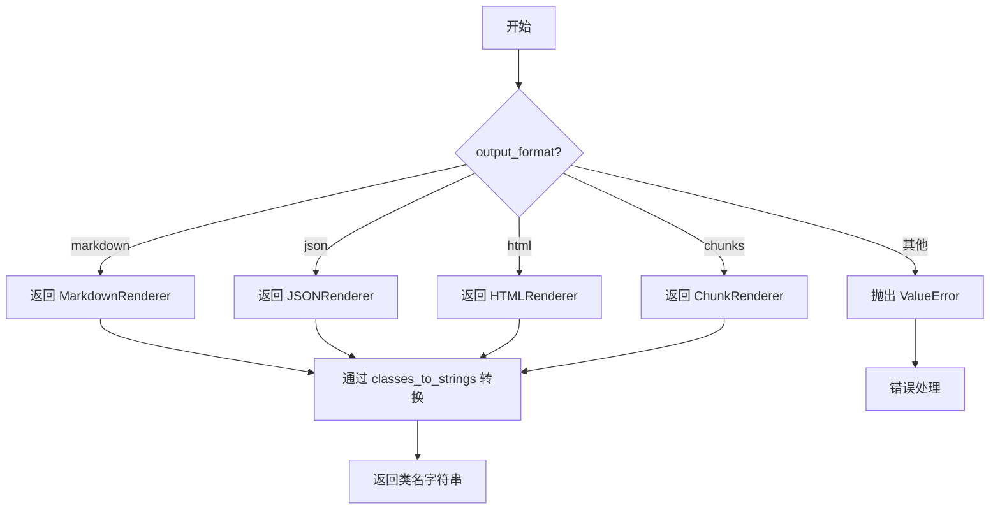

#### 带注释源码

```python
# 在 ConfigParser 类中使用 MarkdownRenderer
def get_renderer(self):
    """
    根据 output_format 配置选择对应的渲染器类
    """
    match self.cli_options["output_format"]:
        case "json":
            r = JSONRenderer      # JSON 渲染器
        case "markdown":
            r = MarkdownRenderer  # Markdown 渲染器 - 从 marker.renderers.markdown 导入
        case "html":
            r = HTMLRenderer      # HTML 渲染器
        case "chunks":
            r = ChunkRenderer     # 分块渲染器
        case _:
            raise ValueError("Invalid output format")
    
    # 将类转换为字符串形式返回
    return classes_to_strings([r])[0]
```

---

**注意**：提供的代码片段仅包含 `MarkdownRenderer` 的导入语句和其在 `ConfigParser` 类中的使用方式。完整的 `MarkdownRenderer` 类定义（包括其字段和方法）需要在 `marker/renderers/markdown.py` 源文件中查看。


### `settings`

`settings` 是从 `marker.settings` 模块导入的配置设置对象，提供了应用程序的全局配置选项，包括输出目录路径和 API 密钥等关键参数。该对象作为默认值来源，被 `ConfigParser` 类的多个方法用于初始化配置。

参数：

- 无（这是一个从模块导入的配置对象，不是函数/方法）

返回值：`settings` 对象（类型为配置对象），包含应用程序的全局配置属性

#### 流程图

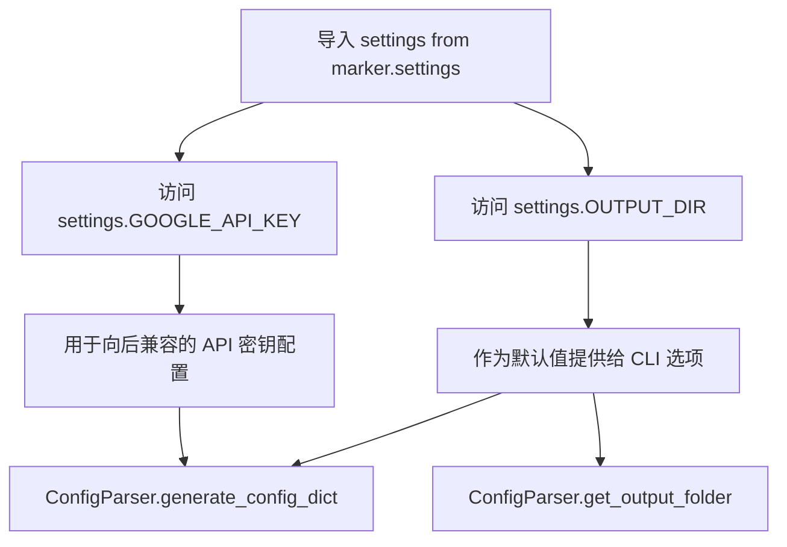

#### 带注释源码

```python
# 从 marker.settings 模块导入 settings 配置对象
# 该对象包含了应用程序的全局默认配置
from marker.settings import settings

# settings 对象的核心属性：
# - settings.OUTPUT_DIR: 默认输出目录路径
# - settings.GOOGLE_API_KEY: Google API 密钥（用于 LLM 服务）

# 使用示例 1: 在 ConfigParser.common_options 中作为默认值
fn = click.option(
    "--output_dir",
    type=click.Path(exists=False),
    required=False,
    default=settings.OUTPUT_DIR,  # 使用 settings 的默认输出目录
    help="Directory to save output.",
)(fn)

# 使用示例 2: 在 generate_config_dict 中获取配置
def generate_config_dict(self) -> Dict[str, any]:
    config = {}
    # 从 CLI 选项或 settings 获取输出目录
    output_dir = self.cli_options.get("output_dir", settings.OUTPUT_DIR)
    # ... 其他配置逻辑
    
    # 使用 settings 中的 GOOGLE_API_KEY 进行向后兼容
    if settings.GOOGLE_API_KEY:
        config["gemini_api_key"] = settings.GOOGLE_API_KEY
    
    return config

# 使用示例 3: 在 get_output_folder 中获取输出目录
def get_output_folder(self, filepath: str):
    output_dir = self.cli_options.get("output_dir", settings.OUTPUT_DIR)
    # ... 后续逻辑
```

#### settings 对象属性详情

| 属性名称 | 类型 | 描述 |
|---------|------|------|
| `settings.OUTPUT_DIR` | `str` | 默认的输出目录路径，用于保存转换后的文件 |
| `settings.GOOGLE_API_KEY` | `str` | Google API 密钥，用于调用 Gemini LLM 服务 |

#### 关键组件信息

- **ConfigParser**：配置解析类，使用 `settings` 对象提供默认值
- **common_options**：装饰器方法，使用 `settings.OUTPUT_DIR` 作为 `--output_dir` 选项的默认值
- **generate_config_dict**：配置字典生成方法，读取 `settings.GOOGLE_API_KEY` 用于向后兼容

#### 潜在的技术债务或优化空间

1. **硬编码的服务类名**：在 `get_llm_service` 方法中，`GoogleGeminiService` 是硬编码的默认服务类，应该考虑从 `settings` 中读取
2. **魔法字符串**：多处使用字符串字面量（如 `"gemini_api_key"`），可以提取为常量或配置项
3. **向后兼容性处理**：`GOOGLE_API_KEY` 到 `gemini_api_key` 的映射逻辑可以更清晰地组织

#### 其它项目

- **设计目标**：提供可配置的全局设置，允许 CLI 选项覆盖默认值
- **错误处理**：`settings` 相关的错误处理主要在调用方（如文件不存在、权限问题）
- **数据流**：`settings` 作为只读配置源，提供了应用程序级别的默认参数
- **外部依赖**：`marker.settings` 模块本身定义了配置结构和默认值


### `ConfigParser.__init__`

该方法是`ConfigParser`类的构造函数，用于初始化配置解析器实例。它接收命令行选项字典并将其存储为实例变量，供类的其他方法使用。

参数：

- `cli_options`：`dict`，命令行选项字典，包含输出目录、调试模式、输出格式、处理器等配置信息

返回值：`None`，构造函数不返回任何值

#### 流程图

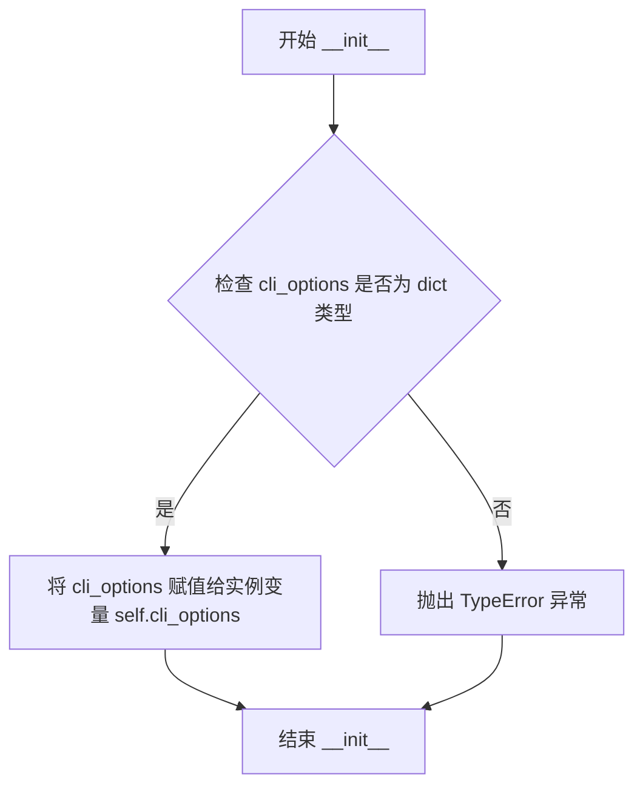

#### 带注释源码

```python
def __init__(self, cli_options: dict):
    """
    初始化 ConfigParser 实例。

    该构造函数接收命令行选项字典，并将其存储为实例变量。
    其他方法将通过 self.cli_options 访问这些配置选项。

    参数:
        cli_options: dict - 包含命令行选项和值的字典，
                         例如 {'output_dir': '/output', 'debug': True, ...}

    返回值:
        None
    """
    self.cli_options = cli_options  # 将传入的cli选项字典存储为实例变量
```


### `ConfigParser.common_options`

这是一个静态方法装饰器，用于为 CLI 命令添加一组通用配置选项。它接收一个函数作为参数，并通过 `click.option` 装饰器为其添加多个命令行选项（如输出目录、调试模式、输出格式、处理器配置等），最后返回装饰后的函数。

参数：

- `fn`：`function`，需要装饰的 CLI 命令函数

返回值：`function`，添加了通用选项后的装饰函数

#### 流程图

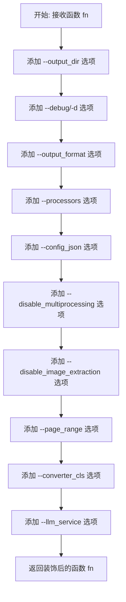

#### 带注释源码

```python
@staticmethod
def common_options(fn):
    """
    静态方法装饰器：为 CLI 命令添加通用配置选项
    
    该方法使用 click.option 装饰器为传入的函数添加一系列命令行选项，
    包括输出目录、调试模式、输出格式、处理器配置等通用参数。
    """
    # 添加输出目录选项，默认值为 settings.OUTPUT_DIR
    fn = click.option(
        "--output_dir",
        type=click.Path(exists=False),
        required=False,
        default=settings.OUTPUT_DIR,
        help="Directory to save output.",
    )(fn)
    
    # 添加调试模式选项，简写为 -d
    fn = click.option("--debug", "-d", is_flag=True, help="Enable debug mode.")(fn)
    
    # 添加输出格式选项，可选值：markdown, json, html, chunks
    fn = click.option(
        "--output_format",
        type=click.Choice(["markdown", "json", "html", "chunks"]),
        default="markdown",
        help="Format to output results in.",
    )(fn)
    
    # 添加处理器选项，需使用完整的模块路径
    fn = click.option(
        "--processors",
        type=str,
        default=None,
        help="Comma separated list of processors to use.  Must use full module path.",
    )(fn)
    
    # 添加 JSON 配置文件路径选项
    fn = click.option(
        "--config_json",
        type=str,
        default=None,
        help="Path to JSON file with additional configuration.",
    )(fn)
    
    # 添加禁用多进程选项
    fn = click.option(
        "--disable_multiprocessing",
        is_flag=True,
        default=False,
        help="Disable multiprocessing.",
    )(fn)
    
    # 添加禁用图片提取选项
    fn = click.option(
        "--disable_image_extraction",
        is_flag=True,
        default=False,
        help="Disable image extraction.",
    )(fn)
    
    # 添加页面范围选项，支持逗号分隔的页码和范围
    # 例如：0,5-10,20
    fn = click.option(
        "--page_range",
        type=str,
        default=None,
        help="Page range to convert, specify comma separated page numbers or ranges.  Example: 0,5-10,20",
    )(fn)

    # 添加转换器类选项，默认为 PDF 转换器
    fn = click.option(
        "--converter_cls",
        type=str,
        default=None,
        help="Converter class to use.  Defaults to PDF converter.",
    )(fn)
    
    # 添加 LLM 服务选项，需使用完整的导入路径
    fn = click.option(
        "--llm_service",
        type=str,
        default=None,
        help="LLM service to use - should be full import path, like marker.services.gemini.GoogleGeminiService",
    )(fn)
    
    # 返回装饰后的函数
    return fn
```


### `ConfigParser.generate_config_dict`

该方法将 CLI 选项解析为配置字典，根据不同的选项键值对设置相应的配置项，并处理向后兼容性。

参数：
- 该方法无显式参数，通过 `self.cli_options` 访问实例属性

返回值：`Dict[str, any]`，返回一个包含所有配置项的字典，供后续转换器或渲染器使用

#### 流程图

```mermaid
flowchart TD
    A[开始] --> B[初始化空配置字典 config]
    B --> C[获取 output_dir 默认值]
    C --> D{遍历 cli_options 项}
    D -->|k, v| E{v 是否为空}
    E -->|是| D
    E -->|否| F{根据 k 进行匹配}
    F -->|debug| G[设置 debug_pdf_images<br/>debug_layout_images<br/>debug_json<br/>debug_data_folder]
    F -->|page_range| H[调用 parse_range_str 解析页面范围]
    F -->|config_json| I[打开 JSON 文件<br/>读取并更新配置]
    F -->|disable_multiprocessing| J[设置 pdftext_workers = 1]
    F -->|disable_image_extraction| K[设置 extract_images = False]
    F -->|其他| L[直接 config[k] = v]
    G --> M
    H --> M
    I --> M
    J --> M
    K --> M
    L --> M
    M{检查 GOOGLE_API_KEY<br/>向后兼容性}
    M -->|存在| N[添加 gemini_api_key]
    M -->|不存在| O[返回 config 字典]
    N --> O
```

#### 带注释源码

```python
def generate_config_dict(self) -> Dict[str, any]:
    """
    将 CLI 选项转换为配置字典
    """
    config = {}
    
    # 获取输出目录，优先使用 CLI 选项，否则使用默认设置
    output_dir = self.cli_options.get("output_dir", settings.OUTPUT_DIR)
    
    # 遍历所有 CLI 选项
    for k, v in self.cli_options.items():
        # 跳过空值选项
        if not v:
            continue

        # 根据选项名称匹配并设置对应配置
        match k:
            case "debug":
                # 启用调试模式时，配置多个调试选项
                config["debug_pdf_images"] = True
                config["debug_layout_images"] = True
                config["debug_json"] = True
                config["debug_data_folder"] = output_dir
            case "page_range":
                # 解析页面范围字符串为列表
                config["page_range"] = parse_range_str(v)
            case "config_json":
                # 从 JSON 文件加载额外配置
                with open(v, "r", encoding="utf-8") as f:
                    config.update(json.load(f))
            case "disable_multiprocessing":
                # 禁用多进程时设置单工作线程
                config["pdftext_workers"] = 1
            case "disable_image_extraction":
                # 禁用图片提取
                config["extract_images"] = False
            case _:
                # 其他选项直接传递
                config[k] = v

    # 向后兼容旧版的 Google API Key 配置
    if settings.GOOGLE_API_KEY:
        config["gemini_api_key"] = settings.GOOGLE_API_KEY

    return config
```


### `ConfigParser.get_llm_service`

该方法用于获取配置中指定的LLM服务类。首先检查是否启用了LLM功能（`use_llm`选项），若未启用则返回None；若启用了LLM功能，则从CLI选项中获取`llm_service`参数指定的完整导入路径，若未指定则返回默认的GoogleGeminiService服务类。

参数：

- `self`：`ConfigParser` 实例，代表当前配置解析器对象本身

返回值：`str | None`，返回LLM服务的完整导入路径字符串，或在未启用LLM时返回None

#### 流程图

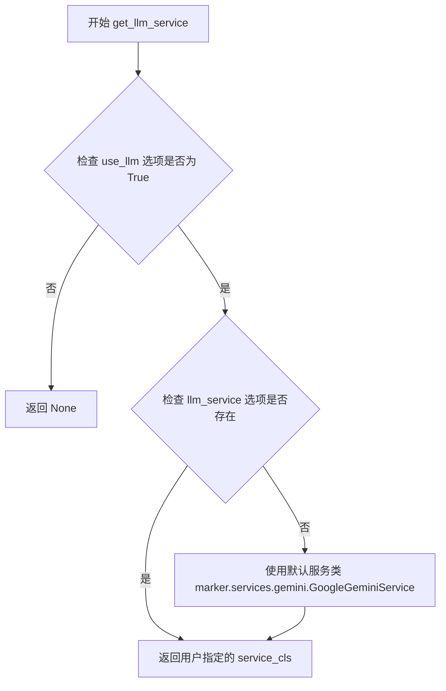

#### 带注释源码

```python
def get_llm_service(self):
    # Only return an LLM service when use_llm is enabled
    # 首先检查用户是否启用了 LLM 功能，如果未启用则直接返回 None
    if not self.cli_options.get("use_llm", False):
        return None

    # 从 CLI 选项中获取 llm_service 参数，默认为 None
    service_cls = self.cli_options.get("llm_service", None)
    
    # 如果用户没有指定 LLM 服务类，则使用默认的 Google Gemini 服务
    if service_cls is None:
        service_cls = "marker.services.gemini.GoogleGeminiService"
    
    # 返回服务类的完整导入路径字符串
    return service_cls
```


### `ConfigParser.get_renderer`

该方法根据 CLI 选项中的 `output_format` 值，返回对应的渲染器类的字符串表示，用于确定输出文件的渲染方式。

参数：

- `self`：`ConfigParser` 实例，隐式参数，包含 CLI 选项配置

返回值：`str`，返回渲染器类的完整路径字符串（如 `"marker.renderers.markdown.MarkdownRenderer"`）

#### 流程图

```mermaid
flowchart TD
    A[开始 get_renderer] --> B[读取 self.cli_options['output_format']]
    B --> C{匹配 output_format}
    C -->|json| D[JSONRenderer]
    C -->|markdown| E[MarkdownRenderer]
    C -->|html| F[HTMLRenderer]
    C -->|chunks| G[ChunkRenderer]
    C -->|_| H[抛出 ValueError: Invalid output format]
    D --> I[调用 classes_to_strings([r])]
    E --> I
    F --> I
    G --> I
    I --> J[返回字符串的第一个元素]
    J --> K[结束]
    H --> K
```

#### 带注释源码

```python
def get_renderer(self):
    """
    根据 output_format 配置返回对应的渲染器类字符串表示
    
    Returns:
        str: 渲染器类的完整路径字符串，例如 "marker.renderers.markdown.MarkdownRenderer"
    """
    # 使用 match-case 语句根据 output_format 值匹配对应的渲染器类
    match self.cli_options["output_format"]:
        case "json":
            # JSON 格式输出使用 JSONRenderer
            r = JSONRenderer
        case "markdown":
            # Markdown 格式输出使用 MarkdownRenderer
            r = MarkdownRenderer
        case "html":
            # HTML 格式输出使用 HTMLRenderer
            r = HTMLRenderer
        case "chunks":
            # 分块输出使用 ChunkRenderer
            r = ChunkRenderer
        case _:
            # 无效的输出格式，抛出异常
            raise ValueError("Invalid output format")
    
    # 将类对象转换为字符串表示形式（完整路径）
    # classes_to_strings 返回类似 ['marker.renderers.markdown.MarkdownRenderer'] 的列表
    return classes_to_strings([r])[0]
```


### `ConfigParser.get_processors`

该方法用于获取并验证配置的处理器列表。它从CLI选项中读取processors参数，将其从逗号分隔的字符串转换为列表，并验证每个处理器类是否可以成功加载。如果加载失败，会记录错误并抛出异常。

参数：

- 无（除隐式参数 `self`）

返回值：`Optional[List[str]]`，返回处理器模块路径的列表，如果未配置processors则返回`None`

#### 流程图


#### 带注释源码

```python
def get_processors(self):
    """
    获取并验证配置的处理器列表
    
    从CLI选项中获取processors参数，验证每个处理器类是否可以成功加载。
    如果未配置processors，返回None。
    
    Returns:
        Optional[List[str]]: 处理器模块路径列表，如果未配置则返回None
    """
    # 从cli_options字典中获取processors参数，默认为None
    processors = self.cli_options.get("processors", None)
    
    # 如果processors不为None，说明用户指定了自定义处理器
    if processors is not None:
        # 将逗号分隔的字符串转换为列表
        processors = processors.split(",")
        
        # 遍历每个processor进行验证
        for p in processors:
            try:
                # 尝试将字符串转换为类对象，验证该类是否存在且可导入
                strings_to_classes([p])
            except Exception as e:
                # 如果加载失败，记录错误日志
                logger.error(f"Error loading processor: {p} with error: {e}")
                # 重新抛出异常以通知调用者
                raise

    # 返回processors列表（可能为None）
    return processors
```


### `ConfigParser.get_converter_cls`

该方法用于获取PDF转换器类。如果用户在CLI选项中指定了自定义转换器类，则尝试动态加载该类；如果未指定或加载失败，则返回默认的`PdfConverter`类。

参数：

- `self`：`ConfigParser`，隐式参数，当前 ConfigParser 实例

返回值：`type`，返回转换器类（如果指定了自定义转换器且加载成功，则返回该自定义类；否则返回默认的 `PdfConverter` 类）

#### 流程图

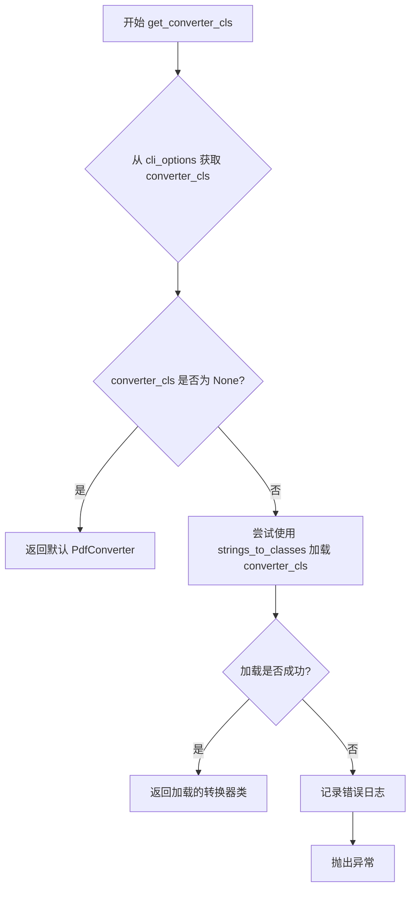

#### 带注释源码

```python
def get_converter_cls(self):
    """
    获取PDF转换器类。
    
    如果用户通过 CLI 选项指定了自定义转换器类，则尝试动态加载；
    如果未指定或加载失败，则返回默认的 PdfConverter 类。
    
    Returns:
        type: 转换器类（PdfConverter 或用户自定义的转换器类）
    """
    # 从 cli_options 获取用户指定的 converter_cls（字符串形式的完整模块路径）
    converter_cls = self.cli_options.get("converter_cls", None)
    
    # 如果用户指定了自定义转换器类
    if converter_cls is not None:
        try:
            # 使用 strings_to_classes 将字符串路径转换为实际的类对象
            # strings_to_classes 返回一个类列表，取第一个元素
            return strings_to_classes([converter_cls])[0]
        except Exception as e:
            # 加载失败时记录错误日志
            logger.error(
                f"Error loading converter: {converter_cls} with error: {e}"
            )
            # 重新抛出异常以便调用者处理
            raise
    
    # 如果用户未指定转换器类，返回默认的 PdfConverter
    return PdfConverter
```


### `ConfigParser.get_output_folder`

该方法用于根据输入文件的路径生成对应的输出文件夹路径。如果输出目录不存在，则自动创建该目录。

参数：

- `filepath`：`str`，输入文件的完整路径，用于提取文件名作为输出子目录名称

返回值：`str`，生成的输出目录的完整路径

#### 流程图


#### 带注释源码

```python
def get_output_folder(self, filepath: str):
    """
    根据输入文件路径生成对应的输出文件夹路径。
    
    参数:
        filepath: 输入文件的完整路径
        
    返回:
        生成的输出目录完整路径
    """
    # 从cli_options获取output_dir，若不存在则使用settings中的默认值
    output_dir = self.cli_options.get("output_dir", settings.OUTPUT_DIR)
    
    # 获取文件名（不含路径和扩展名）作为输出子目录名
    fname_base = os.path.splitext(os.path.basename(filepath))[0]
    
    # 拼接output_dir和fname_base形成完整的输出目录路径
    output_dir = os.path.join(output_dir, fname_base)
    
    # 确保输出目录存在，如果不存在则创建（exist_ok=True避免已存在时报错）
    os.makedirs(output_dir, exist_ok=True)
    
    # 返回生成的输出目录路径
    return output_dir
```


### `ConfigParser.get_base_filename`

该方法用于从完整的文件路径中提取不含扩展名的基本文件名（base filename），常用于生成输出文件夹名称或构建输出文件路径。

参数：

-  `filepath`：`str`，需要提取基本文件名的文件路径

返回值：`str`，不含扩展名的基本文件名

#### 流程图

```mermaid
flowchart TD
    A[开始 get_base_filename] --> B[调用 os.path.basename filepath 获取文件名]
    B --> C[调用 os.path.splitext basename 分离扩展名]
    C --> D[取 [0] 获取不含扩展名的部分]
    D --> E[返回基本文件名]
    E --> F[结束]
```

#### 带注释源码

```python
def get_base_filename(self, filepath: str):
    """
    从给定文件路径中提取不含扩展名的基本文件名。
    
    该方法常用于：
    - 为转换后的输出创建以原文件名命名的子目录
    - 生成输出文件的基准名称
    
    参数：
        filepath: str - 输入文件的完整路径，可以包含目录
        
    返回：
        str - 不含扩展名的文件名（base name）
        
    示例：
        输入: "/path/to/document.pdf"
        输出: "document"
        
        输入: "/path/to/my_file.tar.gz"
        输出: "my_file.tar" (只移除最后一个扩展名)
    """
    # 使用 os.path.basename 获取路径中的文件名部分（不含目录）
    # 例如: "/path/to/document.pdf" -> "document.pdf"
    basename = os.path.basename(filepath)
    
    # 使用 os.path.splitext 分离文件名和扩展名
    # os.path.splitext 返回 tuple: (文件名, 扩展名)
    # [0] 取第一个元素，即不含扩展名的文件名
    # 例如: "document.pdf" -> ("document", ".pdf") -> "document"
    return os.path.splitext(basename)[0]
```

## 关键组件


### ConfigParser

配置解析器类，负责解析CLI命令行选项并生成配置字典，支持多种输出格式（markdown/json/html/chunks）、处理器配置、转换器类选择和LLM服务集成。

### common_options

CLI通用选项装饰器方法，定义了项目运行所需的各类命令行参数，包括输出目录、调试模式、输出格式、处理器列表、配置文件路径、多进程开关、图像提取开关、页面范围、转换器类和LLM服务等。

### generate_config_dict

配置字典生成方法，将CLI选项转换为运行时配置字典，处理特殊选项如debug模式映射、page_range解析、config_json合并、多进程和图像提取开关，并提供Google API Key的向后兼容支持。

### get_llm_service

LLM服务获取方法，根据use_llm开关和llm_service配置返回对应的LLM服务类路径，默认为GoogleGeminiService。

### get_renderer

渲染器获取方法，根据output_format返回对应的渲染器类（JSONRenderer/MarkdownRenderer/HTMLRenderer/ChunkRenderer），将类转换为字符串路径。

### get_processors

处理器获取方法，解析processors字符串选项，验证处理器类的可用性，返回处理器列表或None。

### get_converter_cls

转换器类获取方法，根据converter_cls配置返回对应的转换器类，默认使用PdfConverter，支持自定义转换器并提供错误处理。

### get_output_folder

输出文件夹管理方法，根据输入文件路径和output_dir配置创建输出子目录，返回完整的输出文件夹路径。

### get_base_filename

基础文件名提取方法，从完整文件路径中提取不带扩展名的文件名，用于命名输出文件。


## 问题及建议


### 已知问题

-   **硬编码默认值**：在`get_llm_service`方法中硬编码了默认的LLM服务类名 `"marker.services.gemini.GoogleGeminiService"`，不易于扩展和维护
-   **类型提示错误**：`generate_config_dict`方法的返回类型标注为`Dict[str, any]`，应为`Dict[str, Any]`
-   **配置文件加载缺乏细粒度错误处理**：`generate_config_dict`中打开JSON配置文件时捕获异常后会直接抛出，若文件格式错误会导致程序崩溃
-   **配置验证缺失**：加载JSON配置文件后没有进行任何校验，无效配置可能在后续执行中才暴露问题
-   **不一致的异常处理策略**：部分方法（如`get_processors`、`get_converter_cls`）捕获异常后记录日志并重新抛出，可能导致用户体验不佳
-   **match-case使用不一致**：`generate_config_dict`使用if-elif结构，而`get_renderer`使用match-case，代码风格不统一
-   **潜在的副作用**：`generate_config_dict`中debug模式会隐式创建目录（通过设置`debug_data_folder`），违反函数纯功能性原则

### 优化建议

-   将默认LLM服务类名提取为配置常量或settings属性，便于扩展支持其他LLM服务
-   修正类型提示为`Dict[str, Any]`，并添加`from typing import Any`导入
-   为配置文件加载添加更友好的错误提示，明确告知用户JSON格式错误的具体位置
-   在加载JSON配置后添加配置Schema验证，确保必要字段存在且类型正确
-   统一异常处理策略，考虑在CLI入口层捕获异常并提供友好的错误信息
-   统一使用match-case或if-elif，提高代码可读性和一致性
-   将debug模式下的目录创建逻辑移至配置应用阶段，保持配置生成函数的纯粹性


## 其它


### 设计目标与约束

该类的设计目标是提供一个统一的配置解析层，将命令行选项转换为应用程序内部配置字典。主要约束包括：1) 必须兼容现有marker.settings中的默认配置；2) 支持多种输出格式（markdown、json、html、chunks）；3) 支持自定义处理器和转换器；4) 需要保持向后兼容性（如对google_api_key的处理）。

### 错误处理与异常设计

ConfigParser类采用以下错误处理策略：1) 处理器和转换器加载失败时，使用logger.error记录错误并重新抛出异常；2) 不存在的配置文件路径会导致FileNotFoundError向上传播；3) JSON配置文件格式错误会导致json.JSONDecodeError向上传播；4) 无效的输出格式会抛出ValueError。当前设计缺少对文件读取权限的检查和对非法配置值的预验证。

### 数据流与状态机

数据流如下：用户通过CLI传入选项 → ConfigParser.__init__接收cli_options字典 → generate_config_dict()遍历选项并进行类型转换和映射 → get_renderer()、get_processors()、get_converter_cls()根据配置动态加载相应类 → get_output_folder()创建输出目录。状态机表现为：初始状态（空配置）→ 配置解析状态（生成config字典）→ 配置验证状态（加载类）→ 最终状态（返回完整配置）。

### 外部依赖与接口契约

主要外部依赖包括：1) click库用于CLI选项定义；2) marker.converters.pdf.PdfConverter作为默认转换器；3) marker.renderers.*系列渲染器类；4) marker.util中的classes_to_strings、parse_range_str、strings_to_classes工具函数；5) marker.settings提供默认配置。接口契约：generate_config_dict()返回Dict[str, any]；get_renderer()返回渲染器类名字符串；get_processors()返回处理器列表或None；get_converter_cls()返回转换器类。

### 配置管理机制

配置采用分层管理策略：第一层为marker.settings中的默认配置（OUTPUT_DIR等）；第二层为config_json文件中的配置；第三层为命令行选项。第三层选项会覆盖前两层。特殊映射逻辑：debug选项会同时设置多个debug相关配置；disable_multiprocessing会将pdftext_workers设为1；page_range字符串会被parse_range_str解析为列表。

### 命令行接口设计

CLI选项分为几类：输出控制类（--output_dir、--output_format）；调试类（--debug）；功能控制类（--disable_multiprocessing、--disable_image_extraction）；自定义扩展类（--processors、--converter_cls、--llm_service）；范围控制类（--page_range）；配置加载类（--config_json）。使用@common_options装饰器模式实现选项复用。

### 向后兼容性设计

代码中显式处理向后兼容性：当settings.GOOGLE_API_KEY存在时，自动将其映射到config["gemini_api_key"]，确保使用旧API密钥格式的代码仍能正常工作。此映射在generate_config_dict()方法末尾执行，意味着命令行传入的gemini_api_key会覆盖自动映射的值。

### 性能考虑与优化空间

潜在性能问题：1) generate_config_dict()中每次调用都会打开并读取config_json文件，建议缓存已读取的配置；2) strings_to_classes()在get_processors()和get_converter_cls()中可能被多次调用，可考虑缓存类加载结果；3) os.makedirs()每次调用get_output_folder()都会执行，可结合缓存机制。优化方向：添加配置缓存、类加载结果缓存、使用__slots__减少内存占用。

### 安全性考虑

当前代码存在以下安全风险：1) config_json文件路径未进行路径遍历检查，恶意路径可能导致任意文件读取；2) 动态加载的处理器和转换器类未进行白名单验证，可能加载任意模块；3) output_dir路径未进行安全验证。建议添加：文件路径规范化与验证、动态加载类的白名单机制、输出目录的权限检查。

### 测试策略建议

建议为ConfigParser编写以下测试用例：1) 测试各CLI选项到配置字典的正确映射；2) 测试默认配置的回退行为；3) 测试无效输出格式抛出ValueError；4) 测试处理器/转换器加载失败时的异常传播；5) 测试向后兼容性映射；6) 测试page_range解析；7) 集成测试验证完整的配置生成流程。


    