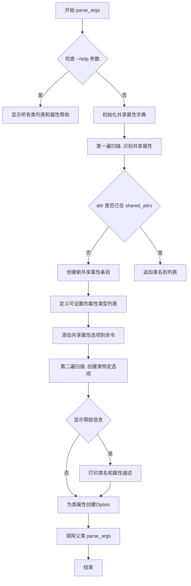
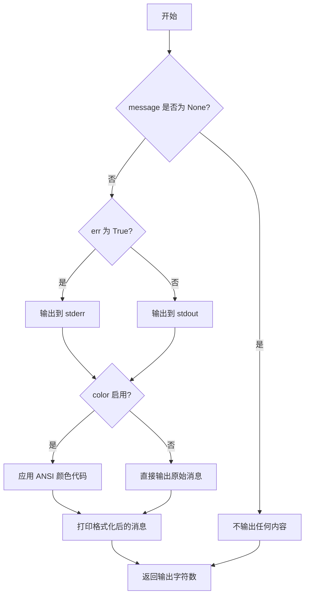
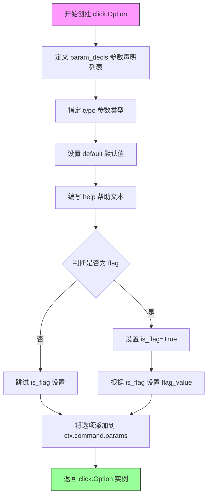

# `marker\marker\config\printer.py` 详细设计文档

这是一个自定义的Click命令类，用于动态生成Marker项目中所有Builder、Processor、Converter、Provider和Renderer的命令行配置选项。它通过扫描crawler.class_config_map中的类配置信息，自动识别共享属性和类特定属性，并为每个属性生成对应的CLI参数，支持用户通过命令行灵活配置各组件的行为。

## 整体流程



## 类结构

```
click.Command (基类)
└── CustomClickPrinter (自定义命令类)
```

## 全局变量及字段


### `crawler`
    
从marker.config.crawler导入的模块对象，包含Marker项目中所有Builder、Processor、Converter、Provider和Renderer的类配置映射

类型：`module`
    


### `CustomClickPrinter.CustomClickPrinter`
    
继承自click.Command的自定义命令类，用于动态生成CLI选项，无显式实例字段，所有字段继承自父类click.Command

类型：`click.Command subclass`
    
    

## 全局函数及方法


### `click.echo`

`click.echo` 是 Click 框架提供的 CLI 输出函数，用于将文本消息打印到标准输出（stdout），支持彩色输出和样式格式化。

参数：

-  `message`：`str | None`，要输出的消息内容，可以为 None
-  `err`：`bool`，是否输出到标准错误（stderr），默认为 False
-  `color`：`bool`，是否启用颜色输出，默认为 None（自动检测）

返回值：`int`，输出的字符数

#### 流程图



#### 带注释源码

```python
def echo(message: str | None = None, file: IO[str] | None = None, nl: bool = True, err: bool = False, color: bool | None = None) -> int:
    """
    输出消息到指定的文件流（stdout 或 stderr）。
    
    参数:
        message: 要输出的消息内容。如果为 None，则不输出任何内容。
        file: 输出目标文件流，默认为 stdout（除非 err=True）
        nl: 是否在消息末尾换行，默认为 True
        err: 是否输出到 stderr 而不是 stdout，默认为 False
        color: 是否强制启用/禁用颜色，默认为 None（自动检测终端支持情况）
    
    返回:
        输出的字符数
    """
    # 如果消息为 None，直接返回 0，不输出任何内容
    if message is None:
        return 0
    
    # 确定输出目标：stderr 或 stdout
    if file is None:
        file = sys.stderr if err else sys.stdout
    
    # 处理颜色输出
    if color is None:
        color = file.isatty()  # 仅在终端支持颜色时启用颜色
    
    # 如果启用颜色且消息包含样式标记，则处理样式
    if color:
        message = style(message)
    
    # 写入消息到指定文件流
    file.write(message)
    
    # 根据 nl 参数决定是否换行
    if nl:
        file.write("\n")
    
    # 刷新文件流确保立即输出
    file.flush()
    
    # 返回输出的字符数（不包含换行符）
    return len(message)
```

#### 在目标代码中的使用示例

```python
# 用法1: 输出帮助信息头部
click.echo("Here is a list of all the Builders, Processors, Converters, Providers and Renderers in Marker along with their attributes:")

# 用法2: 输出类别名称（如 "Converters:"）
click.echo(f"{base_type}s:")

# 用法3: 输出类名及其文档字符串
click.echo(f"\n  {class_name}: {class_map['class_type'].__doc__ or ''}")

# 用法4: 输出属性标题（带缩进）
click.echo(" " * 4 + "Attributes:")

# 用法5: 输出单个属性信息（类型）
click.echo(" " * 8 + f"{attr} ({formatted_type}):")

# 用法6: 输出属性的详细描述（多行）
click.echo("\n".join([f"{' ' * 12}" + desc for desc in metadata]))
```


### `click.Option`

`click.Option` 是 Click 库中的类，用于定义命令行程序的选项（parameters）。在 `CustomClickPrinter` 类中，该类被用于动态生成两类命令行选项：一类是适用于多个类的共享属性选项，另一类是特定于单个类的属性选项。

参数：

- `param_decls`：`List[str]`，命令行参数声明列表，通常以 `-` 或 `--` 开头，用于在命令行中引用该选项
- `type`：`click.ParamType`，参数的数据类型（如 str、int、float、bool 等），用于参数验证和转换
- `help`：`str`，帮助文本，描述选项的用途及适用类名等信息
- `default`：`Any`，选项的默认值，代码中设置为 `None` 以避免重复设置配置键
- `is_flag`：`bool`，标识该选项是否为布尔标志（flag），如果是则不需要提供额外值
- `flag_value`：`Any`，当 `is_flag` 为 `True` 时，指定 flag 被激活时的值
- `multiple`：`bool`（可选），标识该选项是否可以在命令行中多次指定
- `required`：`bool`（可选），标识该选项是否为必需的

返回值：`click.Option`，返回一个 `Option` 实例，用于定义命令行选项并将其添加到命令参数列表中。

#### 流程图



#### 带注释源码

```python
# 第一次使用：创建共享属性选项（适用于多个类）
click.Option(
    ["--" + attr],                           # param_decls: 参数声明列表，以"--"开头
    type=info["type"],                       # type: 参数类型（如 str, int, bool 等）
    help=" ".join(info["metadata"])          # help: 帮助文本，包含元数据描述
        + f" (Applies to: {', '.join(info['classes'])})",  # 帮助文本还包含适用类名
    default=None,                            # default: 默认值为 None，避免重复设置配置键
    is_flag=info["is_flag"],                # is_flag: 标识是否为布尔标志
    flag_value=True if info["is_flag"] else None,  # flag_value: flag 激活时的值
)

# 第二次使用：创建类特定属性选项（仅适用于单个类）
click.Option(
    ["--" + class_name_attr, class_name_attr],  # param_decls: 包含长选项和短选项名
    type=attr_type,                              # type: 参数类型
    help=" ".join(metadata),                     # help: 帮助文本，仅包含元数据描述
    is_flag=is_flag,                             # is_flag: 标识是否为布尔标志
    default=None,                                # default: 默认值为 None
)
```


### `CustomClickPrinter.parse_args`

该方法重写了 `click.Command` 的参数解析逻辑，用于动态生成 CLI 命令选项。它从 `crawler.class_config_map` 中读取所有类（Builders、Processors、Converters、Providers、Renderers）的配置信息，为每个类生成对应的命令行参数选项，并在用户使用 `--help` 时展示所有组件及其属性的详细文档。

参数：

- `self`：隐式的 `CustomClickPrinter` 实例，代表当前命令对象
- `ctx`：`click.Context`，Click 框架的上下文对象，用于访问命令参数和配置
- `args`：`list[str]`，原始命令行参数列表

返回值：`tuple`，返回解析后的参数元组（继承自 `click.Command.parse_args` 的返回值）

#### 流程图

```mermaid
flowchart TD
    A[开始 parse_args] --> B{检查是否显示帮助<br/>'config' in args and '--help' in args}
    B -->|是| C[输出提示信息：列出所有Builders等组件]
    B -->|否| D[初始化 shared_attrs 字典]
    
    D --> E[首次遍历 class_config_map]
    E --> F[提取每个类的配置属性]
    F --> G{属性是否已在 shared_attrs 中}
    G -->|否| H[创建属性条目<br/>包含类型、默认值、元数据、所属类列表]
    G -->|是| I[更新属性条目，追加类名]
    H --> J[继续遍历]
    I --> J
    
    J --> K[定义支持的属性类型列表<br/>str, int, float, bool, Optional类型]
    K --> L[为每个共享属性创建 click.Option]
    L --> M[添加到 ctx.command.params]
    
    M --> N[第二次遍历 class_config_map]
    N --> O{display_help 为真?}
    O -->|是| P[输出 {base_type}s: 标题]
    O -->|否| R[跳过标题输出]
    
    P --> Q[遍历每个类]
    R --> Q
    Q --> S[如果 display_help 且有配置<br/>输出类名和文档字符串]
    S --> T[为每个属性输出详细信息]
    T --> U{属性类型在 attr_types 中?}
    U -->|是| V[创建类特定的 click.Option<br/>使用 class_name_attr 作为参数名]
    V --> W[添加到 ctx.command.params]
    U -->|否| X[跳过不支持的类型]
    
    X --> Y{还有更多属性?}
    Y -->|是| T
    Y -->|否| Z{还有更多类?}
    Z -->|是| Q
    Z -->|否| AA{display_help 为真?}
    
    AA -->|是| BB[ctx.exit 退出帮助显示]
    AA -->|否| CC[调用父类 parse_args]
    BB --> CC
    CC --> DD[返回解析后的参数]
    
    style A fill:#f9f,stroke:#333
    style BB fill:#ff9,stroke:#333
    style DD fill:#9f9,stroke:#333
```

#### 带注释源码

```python
def parse_args(self, ctx, args):
    """
    重写 click.Command 的参数解析方法，
    动态生成所有类配置属性的命令行选项
    """
    # 检查是否是帮助信息显示请求：需要同时包含 'config' 和 '--help'
    display_help = "config" in args and "--help" in args
    
    # 如果显示帮助，输出所有组件类型的提示信息
    if display_help:
        click.echo(
            "Here is a list of all the Builders, Processors, Converters, Providers and Renderers in Marker along with their attributes:"
        )

    # 用于存储跨类共享的属性及其类型信息
    # 键：属性名，值：包含类型、默认值的字典
    shared_attrs = {}

    # ========== 第一次遍历：识别共享属性并验证兼容性 ==========
    # 遍历所有基类型（builder, processor, converter, provider, renderer）
    for base_type, base_type_dict in crawler.class_config_map.items():
        # 遍历每个基类型下的所有类
        for class_name, class_map in base_type_dict.items():
            # 遍历类的所有配置属性
            for attr, (attr_type, formatted_type, default, metadata) in class_map[
                "config"
            ].items():
                # 如果属性尚未记录，初始化条目
                if attr not in shared_attrs:
                    shared_attrs[attr] = {
                        "classes": [],           # 使用该属性的类列表
                        "type": attr_type,       # 属性类型
                        "is_flag": attr_type in [bool, Optional[bool]]
                        and not default,        # 是否为布尔标志（无默认值时）
                        "metadata": metadata,    # 属性描述元数据
                        "default": default,      # 默认值
                    }
                # 将当前类添加到使用该属性的类列表中
                shared_attrs[attr]["classes"].append(class_name)

    # 定义可以从命令行设置的属性类型
    # 不支持复杂类型如 list, dict 等
    attr_types = [
        str,
        int,
        float,
        bool,
        Optional[int],
        Optional[float],
        Optional[str],
    ]

    # ========== 为共享属性创建命令行选项 ==========
    for attr, info in shared_attrs.items():
        # 只处理支持的类型
        if info["type"] in attr_types:
            ctx.command.params.append(
                click.Option(
                    ["--" + attr],                    # 命令行参数名
                    type=info["type"],                # 参数类型
                    # 合并元数据描述并显示适用的类名
                    help=" ".join(info["metadata"])
                    + f" (Applies to: {', '.join(info['classes'])})",
                    default=None,                     # 必须为 None，避免重复设置默认键
                    is_flag=info["is_flag"],         # 是否为布尔标志
                    flag_value=True if info["is_flag"] else None,  # 标志的值
                )
            )

    # ========== 第二次遍历：创建类特定的选项 ==========
    for base_type, base_type_dict in crawler.class_config_map.items():
        # 如果显示帮助，输出类型标题（如 "Builders:"）
        if display_help:
            click.echo(f"{base_type}s:")
        
        # 遍历每个类
        for class_name, class_map in base_type_dict.items():
            # 显示帮助时，输出类名和文档字符串
            if display_help and class_map["config"]:
                click.echo(
                    f"\n  {class_name}: {class_map['class_type'].__doc__ or ''}"
                )
                click.echo(" " * 4 + "Attributes:")
            
            # 遍历类的配置属性
            for attr, (attr_type, formatted_type, default, metadata) in class_map[
                "config"
            ].items():
                # 构建类特定的属性名：class_name + "_" + attr
                class_name_attr = class_name + "_" + attr

                # 显示帮助时，输出属性的详细信息
                if display_help:
                    click.echo(" " * 8 + f"{attr} ({formatted_type}):")
                    click.echo(
                        "\n".join([f"{' ' * 12}" + desc for desc in metadata])
                    )

                # 只为支持的类型创建选项
                if attr_type in attr_types:
                    # 判断是否为布尔标志
                    is_flag = attr_type in [bool, Optional[bool]] and not default

                    # 创建类特定的选项（使用双参数名支持两种调用方式）
                    ctx.command.params.append(
                        click.Option(
                            ["--" + class_name_attr, class_name_attr],
                            type=attr_type,
                            help=" ".join(metadata),
                            is_flag=is_flag,
                            default=None,  # 必须为 None，避免覆盖默认配置键
                        )
                    )

    # 如果是帮助显示，退出命令执行
    if display_help:
        ctx.exit()

    # 调用父类的参数解析方法完成解析
    super().parse_args(ctx, args)
```


### `CustomClickPrinter.parse_args`

该方法是一个自定义的 Click 命令参数解析器，用于在命令行中动态添加配置选项。它首先遍历全局类配置映射，识别所有类的共享属性和类特定属性，然后为每个属性生成对应的 CLI 选项（如 `--attr` 用于共享属性，`--ClassName_attr` 用于类特定属性），并在帮助模式下显示所有可用组件及其属性的详细信息。

参数：

- `self`：`CustomClickPrinter`，Click 命令类的实例，继承自 `click.Command`
- `ctx`：`click.Context`，Click 的上下文对象，用于管理命令状态和参数
- `args`：`List[str]`，原始命令行参数列表

返回值：`Tuple[List[str], List[str]]`，解析后的位置参数和选项参数元组（继承自 `click.Command.parse_args`）

#### 流程图

```mermaid
flowchart TD
    A[开始 parse_args] --> B{检查帮助标志}
    B -->|"config" in args<br/>且 "--help" in args| C[设置 display_help = True]
    B -->|否| D[设置 display_help = False]
    C --> E[输出组件列表标题]
    D --> F[初始化 shared_attrs 字典]
    
    F --> G[第一遍扫描: 遍历 class_config_map]
    G --> H[提取共享属性]
    H --> I{属性是否已存在}
    I -->|否| J[创建属性条目]
    I -->|是| K[追加类名到列表]
    J --> L[设置类型、默认值、元数据]
    K --> L
    
    L --> M[定义可设置的属性类型列表]
    M --> N[为共享属性添加 CLI 选项]
    N --> O{属性类型在允许列表中}
    O -->|是| P[创建 click.Option]
    O -->|否| Q[跳过]
    P --> R[追加到 ctx.command.params]
    
    R --> S[第二遍扫描: 创建类特定选项]
    S --> T{display_help 为真}
    T -->|是| U[输出基础类型名称]
    T -->|否| V[遍历类映射]
    
    U --> V
    V --> W{属性类型在允许列表中}
    W -->|是| X[创建类名_属性名选项]
    W -->|否| Y[跳过]
    X --> Z[追加到 ctx.command.params]
    
    Y --> AA{还有更多属性}
    AA -->|是| V
    AA -->|否| BB{还有更多类}
    BB -->|是| V
    BB -->|否| CC{display_help 为真}
    
    CC -->|是| DD[调用 ctx.exit 退出]
    CC -->|否| EE[调用 super.parse_args]
    EE --> FF[返回解析结果]
    DD --> FF
    
    Q --> AA
```

#### 带注释源码

```python
def parse_args(self, ctx, args):
    # 检查是否请求显示特定帮助信息（config 相关的帮助）
    # 只有当 args 同时包含 "config" 和 "--help" 时才显示详细配置信息
    display_help = "config" in args and "--help" in args
    
    if display_help:
        # 输出所有可用的 Builders, Processors, Converters, Providers 和 Renderers 的标题
        click.echo(
            "Here is a list of all the Builders, Processors, Converters, Providers and Renderers in Marker along with their attributes:"
        )

    # 初始化字典，用于跟踪所有类的共享属性及其类型信息
    # 共享属性指的是多个类都具有的相同名称的配置项
    shared_attrs = {}

    # 第一遍扫描：从 crawler.class_config_map 中识别共享属性并验证兼容性
    # class_config_map 结构: {base_type: {class_name: {config: {attr: (attr_type, formatted_type, default, metadata)}}}}
    for base_type, base_type_dict in crawler.class_config_map.items():
        for class_name, class_map in base_type_dict.items():
            # 遍历每个类的配置属性
            for attr, (attr_type, formatted_type, default, metadata) in class_map[
                "config"
            ].items():
                # 如果属性尚未记录，初始化属性条目
                if attr not in shared_attrs:
                    shared_attrs[attr] = {
                        "classes": [],           # 拥有此属性的类名列表
                        "type": attr_type,        # 属性类型
                        # 判断是否为布尔标志（flag）：类型为 bool 且默认值为 None/False
                        "is_flag": attr_type in [bool, Optional[bool]]
                        and not default,
                        "metadata": metadata,    # 属性描述元数据
                        "default": default,       # 默认值
                    }
                # 将当前类名添加到该属性的类列表中
                shared_attrs[attr]["classes"].append(class_name)

    # 定义可以从命令行设置的属性类型列表
    # 只支持这些基本类型和 Optional 类型
    attr_types = [
        str,
        int,
        float,
        bool,
        Optional[int],
        Optional[float],
        Optional[str],
    ]

    # 为共享属性添加 CLI 选项（第一遍扫描后）
    # 共享属性选项格式: --attr_name
    for attr, info in shared_attrs.items():
        # 只有在允许的类型列表中的属性才添加命令行选项
        if info["type"] in attr_types:
            ctx.command.params.append(
                click.Option(
                    ["--" + attr],              # 选项名称
                    type=info["type"],          # 参数类型
                    # 帮助文本：包含元数据描述和适用的类名
                    help=" ".join(info["metadata"])
                    + f" (Applies to: {', '.join(info['classes'])})",
                    default=None,              # 重要：设为 None 避免在配置中重新设置所有默认键
                    is_flag=info["is_flag"],   # 是否为布尔标志
                    flag_value=True if info["is_flag"] else None,  # 标志的值
                )
            )

    # 第二遍扫描：为每个类创建特定的选项
    # 类特定属性选项格式: --ClassName_attr_name
    for base_type, base_type_dict in crawler.class_config_map.items():
        # 在帮助模式下输出基础类型名称（如 "Converters:"）
        if display_help:
            click.echo(f"{base_type}s:")
        
        for class_name, class_map in base_type_dict.items():
            # 在帮助模式下输出类名和类的文档字符串
            if display_help and class_map["config"]:
                click.echo(
                    f"\n  {class_name}: {class_map['class_type'].__doc__ or ''}"
                )
                click.echo(" " * 4 + "Attributes:")
            
            # 遍历类的配置属性
            for attr, (attr_type, formatted_type, default, metadata) in class_map[
                "config"
            ].items():
                # 创建类名_属性名的选项名（避免选项冲突）
                class_name_attr = class_name + "_" + attr

                # 在帮助模式下输出属性详细信息
                if display_help:
                    click.echo(" " * 8 + f"{attr} ({formatted_type}):")
                    click.echo(
                        "\n".join([f"{' ' * 12}" + desc for desc in metadata])
                    )

                # 只为允许类型列表中的属性创建 CLI 选项
                if attr_type in attr_types:
                    # 判断是否为布尔标志
                    is_flag = attr_type in [bool, Optional[bool]] and not default

                    # 添加类特定的选项（仅限当前类）
                    ctx.command.params.append(
                        click.Option(
                            ["--" + class_name_attr, class_name_attr],  # 短选项和长选项
                            type=attr_type,
                            help=" ".join(metadata),
                            is_flag=is_flag,
                            default=None,  # 重要：设为 None 避免在配置中重新设置所有默认键
                        )
                    )

    # 如果是帮助模式，退出命令（不再继续解析）
    if display_help:
        ctx.exit()

    # 调用父类的 parse_args 方法完成标准参数解析
    super().parse_args(ctx, args)
```

## 关键组件


### CustomClickPrinter

自定义 Click 命令类，继承自 click.Command，用于动态生成 CLI 参数选项。它通过解析 crawler.class_config_map 中的配置信息，为 Marker 项目中的所有 Builders、Processors、Converters、Providers 和 Renderers 动态生成命令行参数选项。

### CLI 参数解析器

负责解析命令行参数，检测是否需要显示帮助信息。当检测到 "config" 和 "--help" 同时出现时，会显示所有可用组件及其属性的完整列表。

### 配置映射处理器

从 crawler.class_config_map 中读取所有类的配置信息，包括共享属性和类特定属性。它首先进行第一遍扫描识别所有共享属性，然后进行第二遍处理类特定的选项。

### 共享属性管理器

管理跨多个类共享的属性配置。它收集所有类中都存在的属性，记录其类型、默认值、元数据和所属的类列表，用于生成通用的 CLI 选项。

### 属性类型过滤器

定义了可以从命令行设置的属性类型白名单，包括：str、int、float、bool、Optional[int]、Optional[float]、Optional[str]。非白名单类型的属性不会生成 CLI 选项。

### 动态选项生成器

根据属性信息动态创建 click.Option 对象。它区分共享属性和类特定属性，分别生成不同格式的参数名称（如 --attr 或 --ClassName_attr），并处理标志类型（is_flag）属性的特殊逻辑。

### 标志属性检测器

判断属性是否为布尔类型且没有默认值，只有满足这两个条件时才将属性识别为标志（flag）类型，用于 CLI 的 is_flag 参数设置。


## 问题及建议


### 已知问题

-   **硬编码的属性类型列表**：`attr_types`列表是硬编码的，不够灵活，新增类型时需要手动修改，降低了可扩展性
-   **重复的选项创建逻辑**：共享属性和类特定属性的选项创建逻辑高度相似，存在代码重复
-   **缺乏输入验证**：未对`crawler.class_config_map`的结构进行验证，假设其始终存在且格式正确，可能导致运行时错误
-   **魔法字符串**：`"config"`字符串在代码中多次出现，应提取为常量以提高可维护性
-   **变量类型注解缺失**：多个关键变量（如`shared_attrs`、`class_map`等）缺少类型注解，影响代码可读性和IDE支持
-   **嵌套循环性能问题**：三层嵌套循环遍历配置结构，在配置项较多时可能影响性能
-   **flag值处理逻辑隐晦**：`flag_value=True if info["is_flag"] else None`的写法不够直观，可读性较差
-   **help信息生成在循环中**：在双重循环中重复调用`click.echo`输出help信息，效率较低
-   **文档字符串缺失**：类和方法均无文档字符串，他人难以理解设计意图
-   **作用域污染**：在方法内部定义了较深的嵌套层级，部分变量作用域过大

### 优化建议

-   将`attr_types`列表改为从配置动态获取，或使用更灵活的判断逻辑
-   提取选项创建的重复逻辑到私有方法，如`_create_option()`
-   在方法开头添加配置结构验证，不符合预期时抛出明确的异常
-   定义常量`CONFIG_KEY = "config"`替代多处魔法字符串
-   为所有关键变量添加类型注解，特别是`shared_attrs`的字典结构
-   考虑将两层遍历合并为单次遍历，或使用列表推导式优化
-   简化flag处理逻辑，可使用`flag_value=True if is_flag else None`或更清晰的写法
-   将help信息收集到列表中，最后一次性输出，避免频繁IO
-   为类添加类级文档字符串，为方法添加方法文档说明参数和返回值
-   考虑将深度嵌套的逻辑提取为私有方法以降低复杂度


## 其它


### 设计目标与约束

该代码的核心设计目标是动态生成CLI命令的命令行参数选项，从 crawler.class_config_map 中读取配置信息，为所有 Builders、Processors、Converters、Providers 和 Renderers 自动生成命令行接口。主要约束包括：只能处理特定类型的属性（str、int、float、bool及其Optional版本），属性必须存在于 crawler.class_config_map 中，且默认值为None以避免覆盖配置文件中的默认值。

### 错误处理与异常设计

代码中主要通过 ctx.exit() 在显示帮助信息后正常退出，未进行显式的异常捕获。如果 crawler.class_config_map 为空或结构不符合预期，可能导致 KeyError 或 AttributeError。改进建议：添加对 crawler.class_config_map 结构的基本验证，在访问不存在的键时提供有意义的错误信息。

### 数据流与状态机

数据流主要分为三个阶段：第一阶段（第一轮循环）遍历所有类配置，识别共享属性并收集类型、默认值、元数据等信息；第二阶段（第二轮循环）遍历所有类配置，为每个类生成特定的属性选项；最后调用父类的 parse_args 方法完成标准参数解析。状态机相对简单，主要是根据 display_help 标志决定是否显示帮助信息并提前退出。

### 外部依赖与接口契约

主要依赖包括：click 库（用于CLI命令和选项生成），marker.config.crawler 模块（提供 crawler.class_config_map 配置数据）。crawler.class_config_map 的预期结构为：{base_type: {class_name: {"config": {attr: (attr_type, formatted_type, default, metadata)}, "class_type": class_type}}}。对 crawler.class_config_map 的依赖为隐式接口 contract，如果配置结构变化代码将失效。

### 性能考虑

代码存在两轮嵌套循环遍历 class_config_map，当配置类数量和属性较多时可能存在性能问题。建议：可以在初始化时缓存 shared_attrs 避免重复计算，或者在第一轮遍历时同时生成选项以减少循环次数。另外，每次调用 parse_args 时都会重新构建选项列表，对于重复调用的场景可以考虑缓存机制。

### 安全性考虑

代码主要涉及命令行参数处理，安全性风险较低。主要关注点：help信息中会显示所有类名和属性名，可能泄露内部实现细节；属性类型直接来自配置映射，恶意配置可能导致类型混淆。建议对显示的帮助信息进行适当脱敏处理，并验证 attr_type 来自可信来源。

### 测试策略

建议测试场景包括：正常情况下的选项生成和解析、--help 参数的显示功能、空配置和缺失配置的处理、共享属性和类特定属性的正确区分、bool 类型属性的flag处理、Optional类型的处理。建议编写单元测试覆盖不同配置结构和属性类型的组合场景。

### 配置管理

该模块本身不管理配置，而是消费 crawler.class_config_map 中的配置数据。配置来源于 marker.config.crawler 模块。关键配置项包括：attr_types 白名单定义了哪些属性类型可以从命令行设置，shared_attrs 字典记录了跨类共享的属性信息。配置变更时需要保证 class_config_map 的结构稳定性。

### 版本兼容性

代码依赖 click 库的具体API（包括 Command、Option、echo、exit 等），需要兼容 click 7.x 和 8.x 版本。Python 类型注解使用了 typing.Optional，需要 Python 3.5+。与 marker 项目其他模块的兼容性取决于 crawler.class_config_map 的结构定义是否保持稳定。

### 部署相关

该代码作为 marker 项目的一部分进行部署，没有独立的部署流程。运行时依赖：Python 3.5+、click 库、marker.config.crawler 模块。建议通过 marker 的入口点或 CLI 工具调用该自定义命令类。


    