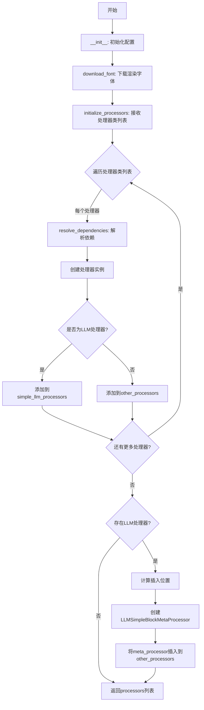
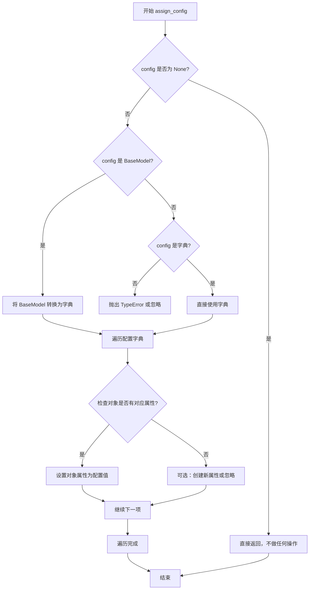
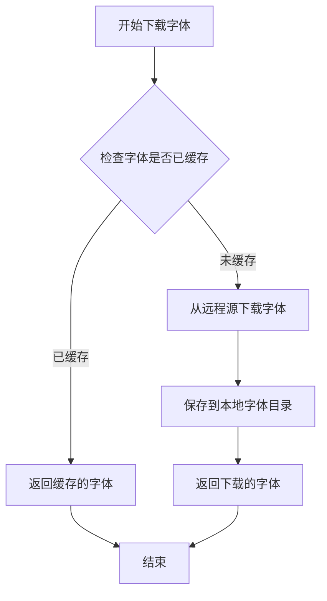
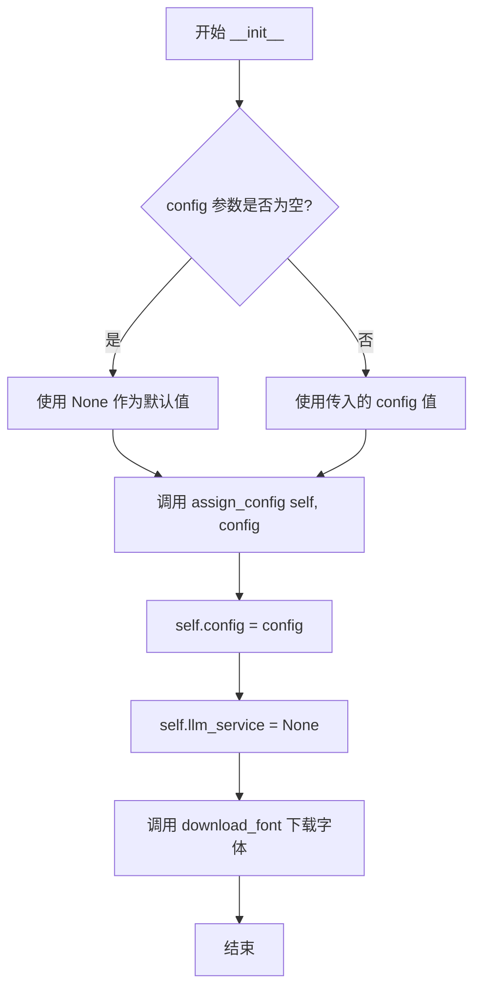
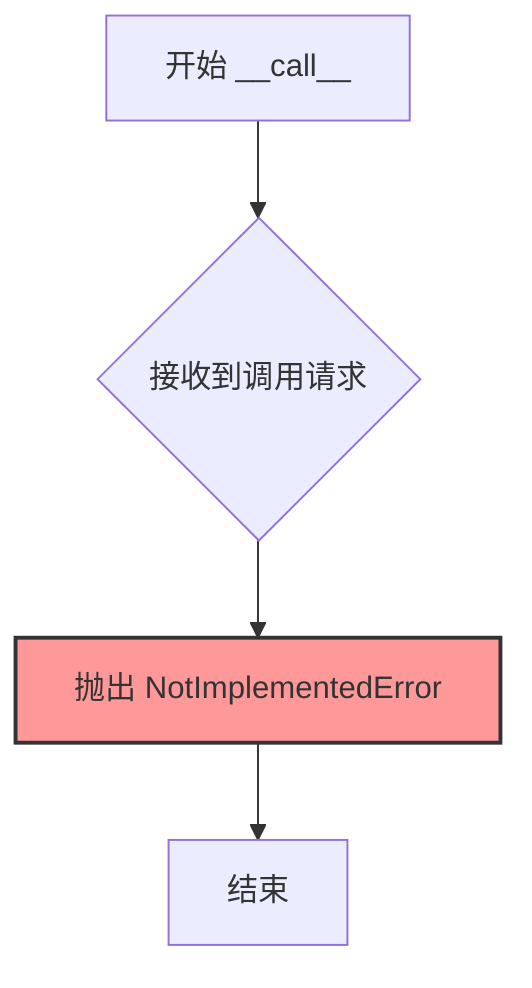
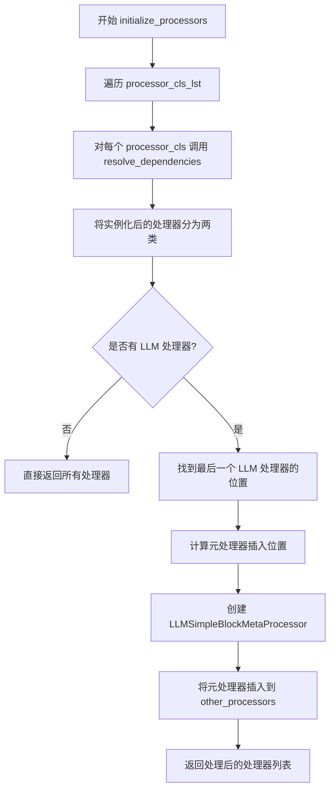

# `marker\marker\converters\__init__.py` 详细设计文档

这是marker项目中的基础转换器类，负责初始化配置、下载渲染字体、解析类依赖关系以及初始化处理器列表。特别地，它对LLM处理器进行特殊处理，将元处理器插入到处理器链中以优化处理流程。

## 整体流程



## 类结构

```
BaseConverter (基础转换器抽象类)
└── 派生类: TextConverter, PDFConverter 等 (在子类中实现)
```

## 全局变量及字段


### `self.config`
    
当前配置对象，用于存储转换器的配置信息

类型：`Optional[BaseModel | dict]`
    


### `self.llm_service`
    
LLM服务引用，用于处理基于LLM的文档转换逻辑

类型：`Optional[Any]`
    


### `self.artifact_dict`
    
产物字典，存储依赖注入所需的外部资源或对象

类型：`Dict[str, Any]`
    


### `init_signature`
    
类的__init__方法签名，用于反射获取构造函数参数信息

类型：`inspect.Signature`
    


### `parameters`
    
方法参数字典，存储构造函数的所有参数及其元数据

类型：`dict[str, inspect.Parameter]`
    


### `resolved_kwargs`
    
解析后的关键字参数，包含已 resolved 的依赖对象

类型：`dict[str, Any]`
    


### `processors`
    
处理器实例列表，包含所有已初始化的处理器对象

类型：`List[BaseProcessor]`
    


### `simple_llm_processors`
    
简单LLM处理器列表，用于过滤和单独处理基于LLM的简单块处理器

类型：`List[BaseLLMSimpleBlockProcessor]`
    


### `other_processors`
    
其他处理器列表，包含非LLM类型的处理器

类型：`List[BaseProcessor]`
    


### `llm_positions`
    
LLM处理器位置索引，记录所有LLM处理器在列表中的位置

类型：`List[int]`
    


### `insert_position`
    
插入位置索引，确定元处理器应该插入到处理器列表中的位置

类型：`int`
    


### `BaseConverter.config`
    
配置对象或字典，用于初始化转换器的配置参数

类型：`Optional[BaseModel | dict]`
    


### `BaseConverter.llm_service`
    
LLM服务实例，提供大语言模型调用能力

类型：`Optional[Any]`
    
    

## 全局函数及方法


### `assign_config`

将配置对象（BaseModel 或字典）的属性分配到目标对象的属性中，实现配置到对象的映射。

参数：

- `obj`：任意 Python 对象（这里传入的是 `self`，即 `BaseConverter` 实例），需要接收配置属性的目标对象
- `config`：`Optional[BaseModel | dict]`，配置对象，可以是 Pydantic BaseModel 实例或普通字典

返回值：`None`，该函数直接修改传入的对象，不返回任何值

#### 流程图



#### 带注释源码

```
# 假设的实现（基于 marker.util 模块）
def assign_config(obj, config):
    """
    将配置对象的属性分配到目标对象上
    
    参数:
        obj: 目标对象，需要接收配置属性的实例
        config: 配置对象，BaseModel 或字典类型
    
    示例用法（在 BaseConverter.__init__ 中）:
        class BaseConverter:
            def __init__(self, config: Optional[BaseModel | dict] = None):
                assign_config(self, config)  # 将 config 的属性展开到 self
                self.config = config
    """
    if config is None:
        return
    
    # 如果是 Pydantic BaseModel，转换为字典
    if isinstance(config, BaseModel):
        config_dict = config.model_dump()
    elif isinstance(config, dict):
        config_dict = config
    else:
        raise TypeError(f"config must be BaseModel or dict, got {type(config)}")
    
    # 将配置字典的键值对设置为对象的属性
    for key, value in config_dict.items():
        setattr(obj, key, value)
```


### `download_font`

该函数用于下载渲染所需的字体文件，供某些渲染服务提供商使用。这是 `BaseConverter` 初始化过程中的一部分，确保在转换文档时具备必要的字体资源。

参数：

- 该函数无显式参数

返回值：`None` 或 `字体对象`，根据实现可能下载并返回字体对象或直接下载到本地

#### 流程图



#### 带注释源码

```python
def download_font():
    """
    下载渲染字体， needed for some providers
    
    该函数在 BaseConverter 初始化时调用，确保渲染引擎
    具备必要的字体资源来正确生成文档输出。
    
    注意：由于该函数定义在 marker.util 模块中，
    以下为基于调用上下文的推断实现：
    """
    # 1. 检查字体缓存目录
    # 2. 如果字体不存在，则从远程服务器下载
    # 3. 将字体保存到本地缓存目录
    # 4. 返回字体路径或字体对象
    
    pass  # 具体实现依赖于 marker.util 模块
```


### `BaseConverter.resolve_dependencies`

该方法通过 `inspect.signature` 动态获取传入类的 `__init__` 参数签名，并根据一定的规则（config、artifact_dict、默认值）解析并注入依赖，最终实例化并返回该类的对象。

参数：

- `cls`：`Type`，需要实例化的类对象

返回值：`Any`，返回传入类的实例化对象

#### 流程图

```mermaid
flowchart TD
    A[开始 resolve_dependencies] --> B[获取 cls.__init__ 的签名]
    B --> C[遍历参数列表]
    C --> D{参数名是 'self'?}
    D -->|是| C
    D -->|否| E{参数名是 'config'?}
    E -->|是| F[使用 self.config 作为参数值]
    E -->|否| G{参数名在 artifact_dict 中?}
    G -->|是| H[使用 artifact_dict[参数名] 作为参数值]
    G -->|否| I{参数有默认值?}
    I -->|是| J[使用参数的默认值]
    I -->|否| K[抛出 ValueError 异常]
    F --> L[添加到 resolved_kwargs]
    H --> L
    J --> L
    K --> M[结束]
    L --> N{还有更多参数?}
    N -->|是| C
    N -->|否| O[调用 cls(**resolved_kwargs) 实例化]
    O --> P[返回实例]
```

#### 带注释源码

```python
def resolve_dependencies(self, cls):
    """
    解析类的依赖关系并实例化该类
    
    通过 inspect 获取传入类的 __init__ 方法签名，
    然后根据规则解析每个参数（从 config、artifact_dict 或默认值中获取），
    最后实例化并返回该类。
    
    Args:
        cls: 需要实例化的类对象
        
    Returns:
        cls 的实例化对象
        
    Raises:
        ValueError: 当无法解析某个必需参数时
    """
    # 使用 inspect.signature 获取类的 __init__ 方法签名
    init_signature = inspect.signature(cls.__init__)
    # 获取参数字典 {参数名: Parameter对象}
    parameters = init_signature.parameters

    # 存储解析后的关键字参数
    resolved_kwargs = {}
    
    # 遍历所有参数
    for param_name, param in parameters.items():
        # 跳过 self 参数
        if param_name == 'self':
            continue
        # 如果参数名是 'config'，使用当前实例的 config
        elif param_name == 'config':
            resolved_kwargs[param_name] = self.config
        # 如果参数名在 artifact_dict 中，使用 artifact_dict 的值
        # 注意：这里用的是 param.name 而不是 param_name，可能存在不一致性
        elif param.name in self.artifact_dict:
            resolved_kwargs[param_name] = self.artifact_dict[param_name]
        # 如果参数有默认值，使用默认值
        elif param.default != inspect.Parameter.empty:
            resolved_kwargs[param_name] = param.default
        # 无法解析，抛出异常
        else:
            raise ValueError(f"Cannot resolve dependency for parameter: {param_name}")

    # 使用解析后的参数实例化类并返回
    return cls(**resolved_kwargs)
```


### `issubclass`

`issubclass` 是 Python 的内置函数，用于检查第一个参数（类）是否是第二个参数（类或元组） 的子类。在 `BaseConverter.initialize_processors` 方法中，该函数用于区分 LLM 处理器和非 LLM 处理器，以便为 LLM 处理器插入元处理器。

参数：

- `class`：任意类，要检查的类
- `classinfo`：类或由类组成的元组，要检查的父类或父类元组

返回值：`bool`，如果 `class` 是 `classinfo` 的子类则返回 `True`，否则返回 `False`

#### 流程图

```mermaid
flowchart TD
    A[开始检查类继承关系] --> B{输入: class, classinfo}
    B --> C{class 是否为类?}
    C -->|否| D[抛出 TypeError: issubclass() 的第一个参数必须是类]
    C -->|是| E{classinfo 是否为类或类元组?}
    E -->|否| F[抛出 TypeError: issubclass() 的第二个参数必须是类或由类组成的元组]
    E -->|是| G{class 是 classinfo 的子类?}
    G -->|是| H[返回 True]
    G -->|否| I[返回 False]
    
    style H fill:#90EE90
    style I fill:#FFB6C1
```

#### 带注释源码

```python
# 在 BaseConverter.initialize_processors 方法中的使用示例

def initialize_processors(self, processor_cls_lst: List[Type[BaseProcessor]]) -> List[BaseProcessor]:
    processors = []
    for processor_cls in processor_cls_lst:
        processors.append(self.resolve_dependencies(processor_cls))

    # 使用 issubclass 检查每个处理器是否是 LLM 简单块处理器的子类
    # type(p) 获取实例 p 的类型，然后与 BaseLLMSimpleBlockProcessor 比较
    # 第一次筛选：收集所有 LLM 处理器
    simple_llm_processors = [p for p in processors if issubclass(type(p), BaseLLMSimpleBlockProcessor)]
    
    # 第二次筛选：收集所有非 LLM 处理器
    other_processors = [p for p in processors if not issubclass(type(p), BaseLLMSimpleBlockProcessor)]

    if not simple_llm_processors:
        return processors

    # 第三次使用：找出所有 LLM 处理器在列表中的位置
    llm_positions = [i for i, p in enumerate(processors) if issubclass(type(p), BaseLLMSimpleBlockProcessor)]
    insert_position = max(0, llm_positions[-1] - len(simple_llm_processors) + 1)

    # 创建元处理器并插入到适当位置
    meta_processor = LLMSimpleBlockMetaProcessor(
        processor_lst=simple_llm_processors,
        llm_service=self.llm_service,
        config=self.config,
    )
    other_processors.insert(insert_position, meta_processor)
    return other_processors
```


### `BaseConverter.__init__`

该方法是 `BaseConverter` 类的构造函数，用于初始化转换器实例。它接收可选的配置参数，将其赋值给实例属性，初始化 LLM 服务为 None，并下载渲染所需的字体资源。

参数：

- `config`：`Optional[BaseModel | dict]`，可选的配置参数，可以是 Pydantic BaseModel 实例或字典。如果为 None，则使用默认配置。

返回值：`None`，构造函数不返回任何值（隐式返回 None）。

#### 流程图



#### 带注释源码

```python
def __init__(self, config: Optional[BaseModel | dict] = None):
    """
    初始化 BaseConverter 实例。
    
    参数:
        config: 可选的配置参数，可以是 Pydantic BaseModel 实例或字典。
                默认为 None，使用系统默认配置。
    """
    # 调用 assign_config 函数将配置应用到当前实例
    # 该函数可能用于解析和验证配置，或将配置属性绑定到实例
    assign_config(self, config)
    
    # 将配置保存到实例属性中，供后续方法使用
    self.config = config
    
    # 初始化 LLM 服务为 None，表示当前没有配置 LLM 服务
    # 后续可以通过其他方法设置具体的 LLM 服务实现
    self.llm_service = None

    # 下载渲染字体，该字体是某些 provider 所需要的资源
    # 这个操作在初始化时执行，确保后续渲染操作可以正常运行
    download_font()
```


### `BaseConverter.__call__`

该方法是 `BaseConverter` 类的抽象方法，用于将转换器实例作为可调用对象使用。当前实现仅为占位符，抛出 `NotImplementedError` 异常，要求子类必须重写此方法以实现具体的文档转换逻辑。

参数：

- `*args`：`任意`，可变位置参数，用于接收任意数量的位置参数
- `**kwargs`：`任意`，可变关键字参数，用于接收任意数量的关键字参数

返回值：`None`，当前实现不返回任何值，仅抛出 `NotImplementedError` 异常

#### 流程图



#### 带注释源码

```python
def __call__(self, *args, **kwargs):
    """
    使 BaseConverter 实例可以像函数一样被调用。
    
    这是一个抽象方法，当前实现仅抛出 NotImplementedError 异常。
    子类必须重写此方法以实现具体的文档转换逻辑。
    
    参数:
        *args: 可变位置参数，接收任意数量的位置参数
        **kwargs: 可变关键字参数，接收任意数量的关键字参数
    
    返回值:
        None 此方法不返回值，仅抛出异常
    
    异常:
        NotImplementedError: 当方法未被重写时抛出
    """
    raise NotImplementedError
```


### `BaseConverter.resolve_dependencies`

该方法通过检查给定类的 `__init__` 方法签名，自动解析并填充构造函数所需的依赖参数，包括 config、artifact_dict 中的值或默认参数，最终返回该类的实例化对象。

参数：

- `cls`：`Type`，需要实例化并解析依赖的类

返回值：`Any`，已解析依赖并实例化的类对象

#### 流程图

```mermaid
flowchart TD
    A[开始 resolve_dependencies] --> B[获取 cls.__init__ 的签名]
    B --> C[遍历所有参数]
    C --> D{参数名是否为 'self'?}
    D -->|是| E[跳过, 继续下一个参数]
    D -->|否| F{参数名是否为 'config'?}
    F -->|是| G[使用 self.config 作为值]
    F -->|否| H{参数名是否在 self.artifact_dict 中?}
    H -->|是| I[使用 self.artifact_dict[param_name] 作为值]
    H -->|否| J{参数是否有默认值?}
    J -->|是| K[使用 param.default 作为值]
    J -->|否| L[抛出 ValueError 异常]
    G --> M[将参数添加到 resolved_kwargs]
    I --> M
    K --> M
    E --> N{是否还有更多参数?}
    L --> O[结束 - 抛出异常]
    M --> N
    N -->|是| C
    N -->|否| P[调用 cls(**resolved_kwargs) 实例化]
    P --> Q[返回实例化的对象]
```

#### 带注释源码

```python
def resolve_dependencies(self, cls):
    """
    解析并实例化给定类的依赖
    
    通过检查类的构造函数签名，自动解析所需的参数：
    - config: 使用当前converter的config
    - artifact_dict中的键: 使用artifact_dict中存储的值
    - 有默认值的参数: 使用默认值
    - 其他必需参数: 抛出异常
    
    Args:
        cls: 需要实例化的类
        
    Returns:
        cls的实例，已解析所有依赖参数
        
    Raises:
        ValueError: 当无法解析必需参数时
    """
    # 获取传入类的__init__方法的签名
    init_signature = inspect.signature(cls.__init__)
    # 获取所有参数字典
    parameters = init_signature.parameters

    # 存储解析后的参数
    resolved_kwargs = {}
    
    # 遍历所有参数
    for param_name, param in parameters.items():
        # 跳过self参数
        if param_name == 'self':
            continue
        # 如果是config参数，使用当前converter的config
        elif param_name == 'config':
            resolved_kwargs[param_name] = self.config
        # 如果参数名在artifact_dict中，使用artifact_dict的值
        # 注意：这里有个潜在的bug，应该是 param.name 而不是 param_name
        # 但代码中使用的是 param_name
        elif param.name in self.artifact_dict:
            resolved_kwargs[param_name] = self.artifact_dict[param_name]
        # 如果参数有默认值，使用默认值
        elif param.default != inspect.Parameter.empty:
            resolved_kwargs[param_name] = param.default
        # 无法解析，抛出异常
        else:
            raise ValueError(f"Cannot resolve dependency for parameter: {param_name}")

    # 使用解析后的参数实例化类并返回
    return cls(**resolved_kwargs)
```


### `BaseConverter.initialize_processors`

该方法接收处理器类列表，实例化所有处理器，并处理 LLM 处理器的特殊逻辑——如果存在 LLM 处理器，会在它们之前插入一个元处理器（LLMSimpleBlockMetaProcessor）来协调管理。

参数：

- `processor_cls_lst`：`List[Type[BaseProcessor]]`，需要实例化的处理器类列表

返回值：`List[BaseProcessor]`，实例化并处理后的处理器列表

#### 流程图



#### 带注释源码

```
def initialize_processors(self, processor_cls_lst: List[Type[BaseProcessor]]) -> List[BaseProcessor]:
    # 第一步：实例化所有处理器类
    processors = []
    for processor_cls in processor_cls_lst:
        # 通过 resolve_dependencies 方法解析并注入依赖，创建处理器实例
        processors.append(self.resolve_dependencies(processor_cls))

    # 第二步：将处理器分为 LLM 处理器和非 LLM 处理器两类
    simple_llm_processors = [p for p in processors if issubclass(type(p), BaseLLMSimpleBlockProcessor)]
    other_processors = [p for p in processors if not issubclass(type(p), BaseLLMSimpleBlockProcessor)]

    # 第三步：如果没有 LLM 处理器，直接返回所有处理器
    if not simple_llm_processors:
        return processors

    # 第四步：计算元处理器的插入位置
    # 找到所有 LLM 处理器在原列表中的位置索引
    llm_positions = [i for i, p in enumerate(processors) if issubclass(type(p), BaseLLMSimpleBlockProcessor)]
    # 计算插入位置：最后一个 LLM 处理器位置 - LLM 处理器数量 + 1
    insert_position = max(0, llm_positions[-1] - len(simple_llm_processors) + 1)

    # 第五步：创建元处理器，用于管理所有 LLM 处理器
    meta_processor = LLMSimpleBlockMetaProcessor(
        processor_lst=simple_llm_processors,
        llm_service=self.llm_service,
        config=self.config,
    )

    # 第六步：将元处理器插入到正确位置，并返回结果
    other_processors.insert(insert_position, meta_processor)
    return other_processors
```

## 关键组件


### BaseConverter 基础转换器类

核心转换器基类，负责管理和初始化处理器集合，通过依赖注入机制解析处理器所需的配置参数，并提供字体下载等基础资源初始化功能。

### resolve_dependencies 依赖解析方法

通过Python inspect模块检查类的`__init__`方法签名，自动解析并注入config、artifact_dict中的工件以及默认参数，实现灵活的依赖注入机制。

### initialize_processors 处理器初始化方法

管理和初始化处理器列表的核心方法，支持普通处理器和LLM简单块处理器的分类处理，自动在LLM处理器之前插入元处理器以协调多处理器协作。

### LLMSimpleBlockMetaProcessor 元处理器

专门用于协调多个LLM简单块处理器的元处理器，负责聚合LLM处理器的输出并提供统一的处理接口。

### assign_config 配置分配工具函数

来自marker.util模块的配置分配工具，用于将配置对象赋值给转换器实例的属性。

### download_font 字体下载工具函数

来自marker.util模块的字体下载工具，在转换器初始化时自动调用，确保渲染所需的字体资源可用。

### BaseLLMSimpleBlockProcessor LLM简单块处理器基类

继承自BaseProcessor的LLM处理基类，initialize_processors方法通过类型检查识别该类及其子类以进行特殊处理。

### artifact_dict 工件字典

存储预定义工件的字典对象，resolve_dependencies方法通过参数名匹配其中的工件并注入到处理器构造中。

### llm_service LLM服务实例

在BaseConverter初始化时设置为None的属性，用于注入外部LLM服务供处理器使用。


## 问题及建议


### 已知问题

-   **Bug: `resolve_dependencies` 方法中的属性访问错误**：代码中 `param.name in self.artifact_dict` 应改为 `param_name in self.artifact_dict`。`param` 是 `inspect.Parameter` 对象，`param.name` 返回的是参数名称字符串，与 `param_name` 等价，但这里使用 `param.name` 不够直观且容易混淆。
-   **未初始化属性 `self.artifact_dict`**：代码引用了 `self.artifact_dict`，但在 `__init__` 方法中未进行初始化。如果该属性不存在，会在运行时抛出 `AttributeError`。
-   **不完整的抽象方法设计**：`__call__` 方法抛出 `NotImplementedError`，但未使用 `abc` 模块的 `@abstractmethod` 装饰器标记为抽象方法，导致类的使用者可能忽略需要实现该方法。
-   **重复的类型检查逻辑**：`initialize_processors` 方法中多次使用 `issubclass(type(p), BaseLLMSimpleBlockProcessor)` 进行类型检查，代码重复且可读性较差。
-   **冗余的 `config` 赋值**：`assign_config(self, config)` 已经处理了 `config` 的赋值，后续的 `self.config = config` 显得冗余，可能导致配置不一致。
-   **硬编码的依赖关系**：`download_font()` 在构造函数中被无条件调用，即使当前转换器不需要字体渲染功能，这会增加不必要的初始化开销。

### 优化建议

-   **修复属性访问和初始化**：将 `param.name` 改为 `param_name`，并在 `__init__` 中初始化 `self.artifact_dict = {}` 或从配置中读取。
-   **使用抽象方法装饰器**：导入 `abc` 模块，为 `__call__` 方法添加 `@abstractmethod` 装饰器，确保子类必须实现该方法。
-   **提取类型检查逻辑**：定义辅助方法或使用 `isinstance` 配合类型注解，减少重复的类型检查代码。
-   **移除冗余赋值**：删除 `self.config = config` 这一行，保留 `assign_config` 的调用即可。
-   **优化字体下载逻辑**：将 `download_font()` 调用移至需要时（如实际渲染操作前），或提供配置选项以控制是否下载字体。
-   **添加类型注解**：为 `self.llm_service`、`self.artifact_dict` 等属性添加类型注解，提高代码的可维护性和 IDE 支持。

## 其它


### 设计目标与约束

BaseConverter作为marker转换器框架的基类，设计目标是为文档转换提供统一的处理器生命周期管理框架。核心约束包括：(1) 支持依赖注入模式，通过`resolve_dependencies`方法自动解析处理器构造函数所需的参数；(2) 支持LLM处理器的特殊编排，需要将LLMSimpleBlockMetaProcessor插入到处理器链的特定位置；(3) 配置通过Pydantic BaseModel或dict传递，由`assign_config`统一处理；(4) 所有处理器依赖的字体资源需要预先下载。

### 错误处理与异常设计

代码中涉及两类主要异常：`NotImplementedError`表示子类必须实现`__call__`方法，这是模板方法模式的体现；`ValueError`在`resolve_dependencies`中当无法解析参数时抛出，提示缺少必需的依赖项。建议补充：(1) 处理器初始化失败时应捕获异常并提供具体处理器名称；(2) LLM服务未配置时应在`initialize_processors`前进行显式检查；(3) 可考虑定义自定义异常类如`ConverterError`、`DependencyResolutionError`以区分不同错误场景。

### 数据流与状态机

BaseConverter本身不维护复杂状态，其数据流如下：初始化阶段接收config并下载字体资源；调用`initialize_processors`时，输入处理器类列表，输出已实例化并排序的处理器实例列表。状态转换主要体现在处理器链的重排：普通处理器保持相对顺序，LLM处理器被提取并通过元处理器包装后重新插入到链中。转换执行阶段由子类实现`__call__`方法驱动，处理器按顺序执行。

### 外部依赖与接口契约

代码依赖以下外部组件：(1) `pydantic.BaseModel`用于配置模型定义；(2) `marker.processors.BaseProcessor`处理器基类，所有自定义处理器需继承该类；(3) `marker.processors.llm.BaseLLMSimpleBlockProcessor`LLM块处理器基类，用于识别LLM相关处理器；(4) `marker.processors.llm.llm_meta.LLMSimpleBlockMetaProcessor`元处理器，负责协调多个LLM处理器；(5) `marker.util.assign_config`和`download_font`工具函数。接口契约要求：传入的processor_cls必须有可解析的`__init__`签名，所有必需参数必须能在config、artifact_dict或默认参数中找到。

### 配置管理机制

配置通过构造函数`__init__`的config参数传入，支持两种形式：Pydantic BaseModel实例或Python dict。`assign_config`函数负责将配置属性绑定到self。config被用于：(1) 传递给resolve_dependencies作为参数解析来源；(2) 传递给LLMSimpleBlockMetaProcessor；(3) 存储在self.config供子类访问。设计建议：应在__init__中增加config非空检查或提供默认配置模板。

### 处理器初始化策略

`initialize_processors`方法实现了处理器实例化的核心策略：先逐个实例化处理器，然后区分LLM处理器和非LLM处理器。关键逻辑是将多个连续的LLM处理器提取出来，用LLMSimpleBlockMetaProcessor包装后插入到链中。插入位置计算公式为`max(0, llm_positions[-1] - len(simple_llm_processors) + 1)`，确保元处理器位于最后一个LLM处理器之前。设计约束：至少需要一个LLM处理器才会触发元处理器插入逻辑。

### 并发与线程安全性

代码本身不包含线程同步机制，属于非线程安全设计。在多线程环境下需注意：(1) config对象如果是共享的可变dict，可能存在竞态条件；(2) artifact_dict的访问需要外部同步；(3) 建议每个线程/请求创建独立的Converter实例，或在更高层进行线程局部存储(TLS)管理。

### 资源管理与生命周期

资源管理体现在两个方面：(1) 字体资源通过`download_font()`在初始化时下载，属于应用级全局资源；(2) 处理器实例在`initialize_processors`中创建，生命周期与Converter实例一致。设计建议：可考虑实现`__del__`方法或上下文管理器协议以支持资源清理。

### 版本兼容性

代码使用了Python 3.10+的联合类型语法`BaseModel | dict`，需要Python 3.10及以上版本。`inspect.signature`从Python 3.3引入，兼容性良好。依赖库版本要求需参考marker项目整体依赖声明。

### 性能考量

`resolve_dependencies`方法在每次实例化处理器时都会调用`inspect.signature`，这是相对昂贵的操作。可考虑缓存签名结果或使用`__init__`参数的元数据注解。处理器链排序算法时间复杂度为O(n)，n为处理器数量，性能可接受。

### 可扩展性设计

框架支持以下扩展点：(1) 通过继承BaseConverter实现自定义转换逻辑；(2) 通过继承BaseProcessor添加新的处理器类型；(3) 通过实现BaseLLMSimpleBlockProcessor接口添加LLM处理能力；(4) artifact_dict机制允许注入任意依赖对象。设计模式：模板方法模式(__call__)、依赖注入模式(resolve_dependencies)、策略模式(处理器链)。


    