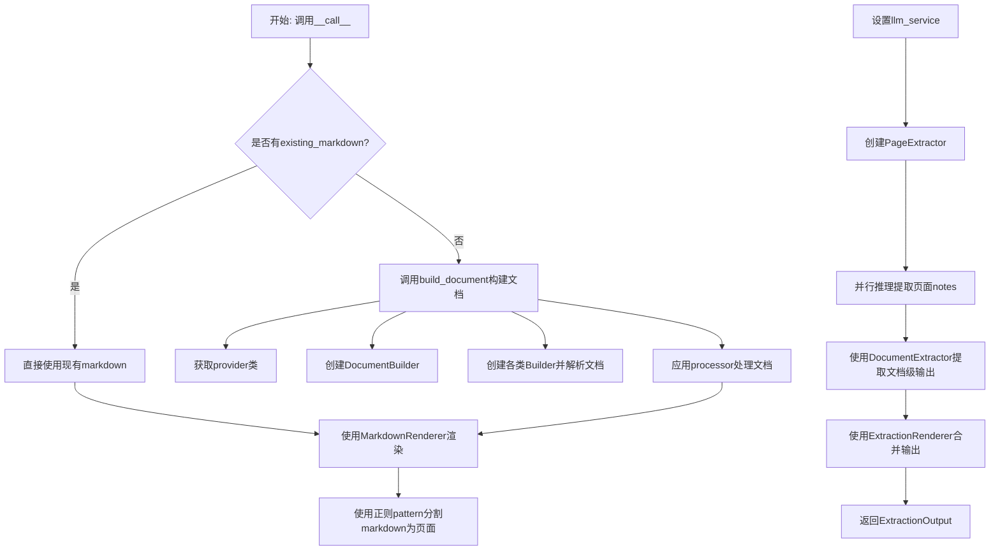
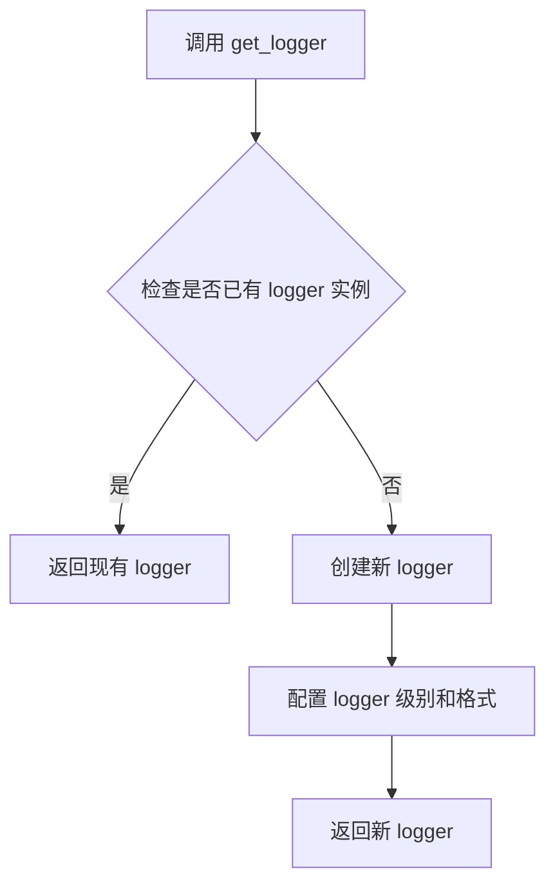
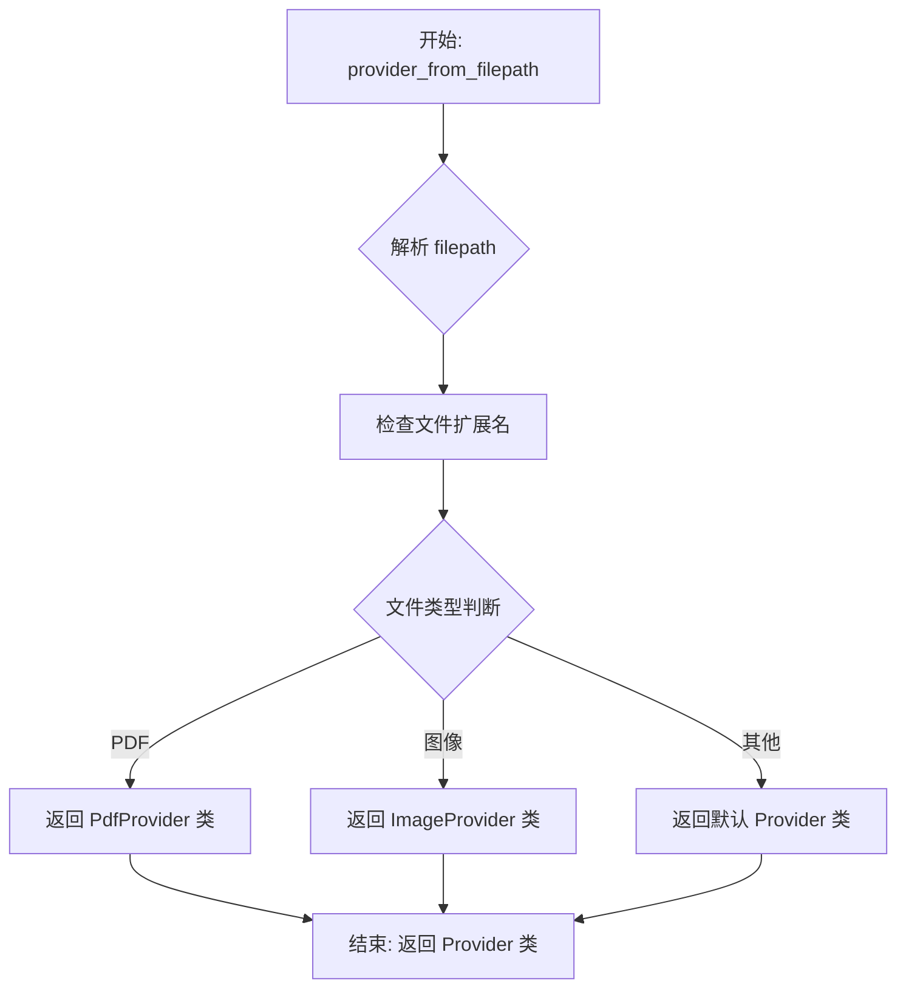
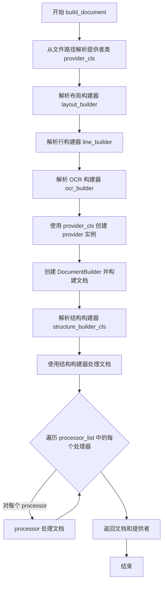
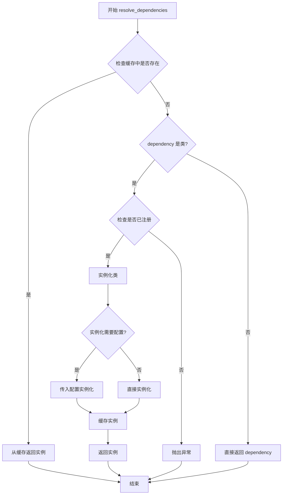

# `marker\marker\converters\extraction.py` 详细设计文档

这是一个PDF转Markdown的转换器，专门用于从PDF文档中提取结构化信息。它继承自PdfConverter，通过layout、line、OCR等构建器解析PDF文档，然后利用LLM服务进行语义提取，最终输出Markdown格式的结构化内容。

## 整体流程



## 类结构

```
PdfConverter (基类)
└── ExtractionConverter (继承自PdfConverter)
```

## 全局变量及字段


### `logger`
    
用于记录日志的全局日志对象

类型：`Logger`
    


### `ExtractionConverter.pattern`
    
用于分割页面输出的正则表达式

类型：`str`
    


### `ExtractionConverter.existing_markdown`
    
已转换的markdown内容

类型：`Annotated[str, 'Markdown that was already converted for extraction.']`
    


### `PdfConverter.layout_builder_class`
    
布局构建器类，用于解析PDF的布局结构

类型：`Type[LayoutBuilder]`
    


### `PdfConverter.processor_list`
    
处理器列表，用于对文档进行后处理

类型：`List[Processor]`
    


### `PdfConverter.artifact_dict`
    
产物字典，存储提取过程中的中间结果和配置

类型：`Dict[str, Any]`
    


### `PdfConverter.default_llm_service`
    
默认LLM服务，用于文档内容提取和语义分析

类型：`Type[LLMService]`
    


### `PdfConverter.config`
    
配置字典，存储转换器和渲染器的配置参数

类型：`Dict[str, Any]`
    


### `PdfConverter.page_count`
    
PDF文档的总页数

类型：`int`
    
    

## 全局函数及方法


### `get_logger`

获取日志记录器实例，用于在模块中记录日志信息。

参数：

- 无参数

返回值：`Logger`，返回配置的日志记录器实例

#### 流程图



#### 带注释源码

```
# 从 marker.logger 模块导入 get_logger 函数
# 注意: 该函数定义不在当前代码文件中，位于 marker/logger.py 模块中
from marker.logger import get_logger

# 调用 get_logger 获取模块级 logger 实例
# 用于在 ExtractionConverter 类中记录日志
logger = get_logger()
```

---

**注意**：根据提供的代码，`get_logger` 函数的实际定义并不在当前文件中，而是从 `marker.logger` 模块导入的。上述信息是基于代码使用方式的推断：
- 函数无参数
- 返回一个 Logger 对象
- 功能是获取或创建一个日志记录器实例供模块使用

如需获取完整的 `get_logger` 函数实现细节，需要查看 `marker/logger.py` 源文件。


### `provider_from_filepath`

根据文件路径自动识别并返回对应的文档处理 Provider 类，用于支持不同格式文档（如 PDF、图像等）的转换处理。

参数：

- `filepath`：`str`，输入文件的路径，用于识别文件类型并选择合适的 Provider

返回值：`Type[BaseProvider]` 或类似的 Provider 类类型，返回一个 Provider 类供后续实例化使用

#### 流程图



#### 带注释源码

```python
# 从 marker.providers.registry 模块导入 provider_from_filepath 函数
# 该模块负责管理不同文件类型对应的 Provider 类注册

from marker.providers.registry import provider_from_filepath

# 在 ExtractionConverter.build_document 方法中的使用示例：
def build_document(self, filepath: str):
    # 根据文件路径获取对应的 Provider 类
    # 例如：filepath 为 .pdf 文件路径时，返回 PdfProvider 类
    #      filepath 为 .png/.jpg 等图像路径时，返回 ImageProvider 类
    provider_cls = provider_from_filepath(filepath)
    
    # 使用返回的类来实例化 Provider 对象
    # Provider 类的构造函数通常接受 filepath 和 config 参数
    provider = provider_cls(filepath, self.config)
    
    # 后续使用 provider 进行文档处理...
```

> **注意**：由于 `provider_from_filepath` 函数的实现源码未在当前代码片段中提供，以上信息基于其使用方式和模块名称 `marker.providers.registry`（注册表模式）的功能推断得出。该函数通常采用工厂模式或注册表模式实现，根据文件扩展名或 MIME 类型动态映射到对应的 Provider 类。


### `ExtractionConverter.build_document`

该方法是 `ExtractionConverter` 类的核心文档构建方法，负责将 PDF 文件转换为内部文档表示。它通过解析文件路径获取合适的提供者，依次构建布局、行、OCR 和结构信息，并应用处理器列表进行进一步处理，最终返回完整的文档对象和对应的数据提供者。

参数：

- `filepath`：`str`，要转换的 PDF 文件路径

返回值：`tuple[Document, Any]`，返回构建完成的文档对象和对应的数据提供者对象

#### 流程图



#### 带注释源码

```python
def build_document(self, filepath: str):
    # 根据文件路径获取对应的提供者类（如 PDF 提供者）
    provider_cls = provider_from_filepath(filepath)
    
    # 解析并获取布局构建器依赖
    layout_builder = self.resolve_dependencies(self.layout_builder_class)
    
    # 解析并获取行构建器依赖
    line_builder = self.resolve_dependencies(LineBuilder)
    
    # 解析并获取 OCR 构建器依赖
    ocr_builder = self.resolve_dependencies(OcrBuilder)
    
    # 使用提供者和配置创建提供者实例
    provider = provider_cls(filepath, self.config)
    
    # 创建文档构建器并调用，传入提供者及各类构建器
    # 构建文档的布局、行和 OCR 层次结构
    document = DocumentBuilder(self.config)(
        provider, layout_builder, line_builder, ocr_builder
    )
    
    # 解析并获取结构构建器依赖
    structure_builder_cls = self.resolve_dependencies(StructureBuilder)
    
    # 使用结构构建器处理文档，添加文档的语义结构信息
    structure_builder_cls(document)

    # 遍历处理器列表，对文档进行进一步处理
    # 例如：表格处理、公式处理等后处理步骤
    for processor in self.processor_list:
        processor(document)

    # 返回构建完成的文档对象和提供者对象
    return document, provider
```


### `ExtractionConverter.__call__`

该方法是将PDF文件转换为结构化提取输出的核心方法。它首先确保输出格式为markdown，然后检查是否已有markdown内容，如果没有则构建文档并渲染为markdown。接着使用正则表达式将markdown按页面分割，解析LLM服务依赖，最后通过页面提取器、文档提取器和渲染器进行并行推理和结果合并，返回完整的提取输出。

参数：

- `filepath`：`str`，需要转换的PDF文件的路径

返回值：`ExtractionOutput`，包含合并后的结构化提取输出

#### 流程图

```mermaid
flowchart TD
    A[开始 __call__] --> B[设置配置: paginate_output=True]
    B --> C[设置配置: output_format='markdown']
    C --> D{existing_markdown是否存在?}
    D -->|否| E[调用build_document构建文档]
    D -->|是| F[使用已有的markdown]
    E --> G[获取页面数量: self.page_count = len(document.pages)]
    G --> H[解析MarkdownRenderer依赖]
    H --> I[渲染文档获取markdown]
    F --> I
    I --> J[使用正则表达式分割markdown为页面列表]
    J --> K{artifact_dict中llm_service是否存在?}
    K -->|否| L[解析default_llm_service并设置到artifact_dict]
    K -->|是| M
    L --> M[解析PageExtractor依赖]
    M --> N[调用page_extractor并行推理提取页面笔记]
    N --> O[调用document_extractor处理笔记得到文档输出]
    O --> P[解析ExtractionRenderer依赖]
    P --> Q[调用renderer合并文档输出和markdown]
    Q --> R[返回merged结果]
```

#### 带注释源码

```python
def __call__(self, filepath: str) -> ExtractionOutput:
    # 1. 设置配置，确保输出可以正确分页
    self.config["paginate_output"] = True  # Enable pagination for output splitting
    
    # 2. 设置输出格式为markdown，因为提取器需要markdown格式
    self.config["output_format"] = (
        "markdown"  # Output must be markdown for extraction
    )
    
    # 3. 获取已有的markdown内容（如果已经转换过）
    markdown = self.existing_markdown

    # 4. 如果没有已有markdown，则构建文档并渲染
    if not markdown:
        # 调用build_document构建完整的文档对象
        document, provider = self.build_document(filepath)
        
        # 记录文档的页数
        self.page_count = len(document.pages)
        
        # 解析MarkdownRenderer并渲染文档为markdown
        renderer = self.resolve_dependencies(MarkdownRenderer)
        output = renderer(document)
        markdown = output.markdown

    # 5. 使用正则表达式按页面分割markdown输出
    # pattern匹配形如 "{页码}-" 后面跟48个横杠的模式
    output_pages = re.split(self.pattern, markdown)[1:]  # Split output into pages

    # 6. 检查并设置LLM服务（提取需要LLM服务）
    if self.artifact_dict.get("llm_service") is None:
        # 解析默认的LLM服务依赖并设置到artifact_dict
        self.artifact_dict["llm_service"] = self.resolve_dependencies(
            self.default_llm_service
        )

    # 7. 解析各种提取和渲染所需的依赖
    page_extractor = self.resolve_dependencies(PageExtractor)      # 页面级提取器
    document_extractor = self.resolve_dependencies(DocumentExtractor)  # 文档级提取器
    renderer = self.resolve_dependencies(ExtractionRenderer)       # 提取结果渲染器

    # 8. 并行推理：首先提取每个页面的笔记/关键信息
    notes = page_extractor(output_pages)
    
    # 9. 然后对提取的笔记进行文档级整合处理
    document_output = document_extractor(notes)

    # 10. 最后使用提取渲染器合并文档输出和原始markdown
    merged = renderer(document_output, markdown)
    
    # 11. 返回合并后的提取输出
    return merged
```


### `PdfConverter.resolve_dependencies`

该方法是一个依赖注入（Dependency Injection）方法，用于根据传入的类或配置解析并实例化相应的构建器、渲染器或提取器组件。

参数：

- `dependency`：任意类型，需要解析的依赖类或配置对象

返回值：`Any`，返回解析后的依赖实例对象

#### 流程图



#### 带注释源码

```python
# 该方法定义在 PdfConverter 基类中
# 以下为基于调用方式的推断源码

def resolve_dependencies(self, dependency):
    """
    解析并返回依赖实例。
    
    参数:
        dependency: 需要解析的依赖类或配置对象。
                   可以是 Builder 类、Renderer 类、Extractor 类等。
    
    返回值:
        解析后的依赖实例对象。
    """
    # 1. 检查缓存中是否已存在该依赖的实例
    if dependency in self._dependency_cache:
        return self._dependency_cache[dependency]
    
    # 2. 如果是类而非实例，则尝试实例化
    if isinstance(dependency, type):
        # 从注册表中获取或直接实例化
        instance = self._instantiate_dependency(dependency)
    else:
        # 如果已经是实例，直接返回
        instance = dependency
    
    # 3. 缓存实例以供后续使用
    self._dependency_cache[dependency] = instance
    
    return instance

def _instantiate_dependency(self, dependency_cls):
    """
    实例化依赖类。
    
    参数:
        dependency_cls: 需要实例化的类。
    
    返回值:
        类实例。
    """
    # 检查是否有配置需要传入
    if hasattr(dependency_cls, '__init__'):
        # 尝试使用配置实例化
        return dependency_cls(self.config)
    return dependency_cls()
```

#### 使用示例

在 `ExtractionConverter` 中的调用方式：

```python
# 解析布局构建器
layout_builder = self.resolve_dependencies(self.layout_builder_class)

# 解析行构建器
line_builder = self.resolve_dependencies(LineBuilder)

# 解析 OCR 构建器
ocr_builder = self.resolve_dependencies(OcrBuilder)

# 解析 Markdown 渲染器
renderer = self.resolve_dependencies(MarkdownRenderer)

# 解析 LLM 服务
llm_service = self.resolve_dependencies(self.default_llm_service)

# 解析页面提取器
page_extractor = self.resolve_dependencies(PageExtractor)

# 解析文档提取器
document_extractor = self.resolve_dependencies(DocumentExtractor)

# 解析提取渲染器
renderer = self.resolve_dependencies(ExtractionRenderer)
```

## 关键组件


### ExtractionConverter

核心转换器类，继承自PdfConverter，负责将PDF文件转换为markdown并进行内容提取。整合了文档构建、OCR、结构解析和LLM提取的完整流程。

### pattern (正则表达式)

用于分割markdown输出的正则表达式模式，匹配页码标记格式`{\d+}-{48}\n\n`，将连续的markdown按页拆分。

### existing_markdown (已转换的Markdown)

存储已转换的markdown内容，支持惰性加载模式，避免重复转换已处理过的文档。

### build_document (文档构建方法)

构建完整文档对象的方法，协调布局构建器、线条构建器、OCR构建器和结构构建器，通过依赖注入解析各组件。

### __call__ (主调用方法)

实现可调用接口的主方法，负责任务调度：配置设置、文档构建/复用、页面分割、LLM服务集成、并行推理和最终渲染输出。

### DocumentBuilder & StructureBuilder (文档与结构构建)

DocumentBuilder负责从PDF provider构建文档对象，StructureBuilder进一步处理文档结构，两者通过依赖注入解析协作。

### OcrBuilder & LineBuilder (OCR与线条构建)

OcrBuilder处理光学字符识别，LineBuilder处理文本行检测，两者共同为文档提供视觉和文本层面的解析能力。

### PageExtractor (页面提取器)

并行处理分割后的页面markdown，提取每页的笔记内容，返回页面级别的提取结果列表。

### DocumentExtractor (文档提取器)

接收页面提取结果，进行文档级别的整合和语义分析，生成结构化的文档输出。

### ExtractionRenderer (提取渲染器)

将文档提取结果与原始markdown合并，生成最终的ExtractionOutput对象。

### MarkdownRenderer (Markdown渲染器)

将文档对象转换为markdown格式字符串，作为中间表示供后续页面分割使用。

### LLM服务集成

通过artifact_dict注入LLM服务，为内容提取提供语言模型支持，默认服务通过default_llm_service类解析。


## 问题及建议


### 已知问题

-   **正则表达式模式语法错误**: `pattern: str = r"{\d+\}-{48}\n\n"` 中 `{48}` 没有作用在任何字符上，实际只会匹配字面的48个破折号，而非预想的48个破折号，这可能导致页面分割失败。
-   **运行时修改配置副作用**: 在 `__call__` 方法中直接修改 `self.config["paginate_output"]` 和 `self.config["output_format"]`，可能在复用 converter 实例时产生意外副作用。
-   **缺乏错误处理**: 代码没有对以下情况进行处理：`filepath` 无效、`provider` 加载失败、markdown 为空、`re.split` 返回单元素列表等情况。
-   **状态突变风险**: 类中多处修改实例状态（`self.page_count`、`self.existing_markdown`、`self.artifact_dict`），在并发场景下可能导致竞态条件。
-   **重复依赖解析**: `self.resolve_dependencies()` 在 `__call__` 中多次调用相同类（`PageExtractor`、`DocumentExtractor`、`ExtractionRenderer`），没有缓存结果。
-   **资源未释放**: `build_document` 返回的 `provider` 未被显式关闭或释放，可能导致文件句柄泄漏。
-   **魔法字符串**: 配置键 `"paginate_output"`、`"output_format"`、`"llm_service"` 以硬编码字符串形式出现，缺乏常量定义。

### 优化建议

-   **修复正则表达式**: 将 pattern 修改为 `r"{\d+}-" + "-" * 48 + r"\n\n"`，或使用 `r"{\d+}-{48}\n\n".format(dashes="-" * 48)` 的形式确保匹配48个破折号。
-   **配置隔离**: 在 `__call__` 开始时复制配置或使用上下文管理器，避免修改原始配置；或接受配置参数传入。
-   **添加异常处理**: 对文件路径有效性、解析结果进行验证，并添加 try-except 块捕获潜在异常。
-   **依赖缓存**: 在 `__init__` 或首次调用时缓存解析的依赖，避免重复解析。
-   **引入资源管理**: 使用 context manager 或显式的 `close()` 方法管理 provider 生命周期。
-   **提取常量**: 将配置键提取为类常量或枚举，提高可维护性。
-   **状态不可变性**: 考虑将状态管理移至独立类或使用不可变数据结构，减少并发问题。

## 其它


### 设计目标与约束

本代码的设计目标是将PDF文档转换为Markdown格式，并支持内容提取功能。核心约束包括：1) 输出格式必须为Markdown；2) 需要LLM服务进行内容提取；3) 支持分页输出；4) 支持已有的Markdown进行转换。主要应用于文档数字化和内容分析场景。

### 错误处理与异常设计

代码中的错误处理主要体现在：1) provider_from_filepath根据文件路径获取provider时可能抛出异常；2) resolve_dependencies在解析依赖时可能失败；3) re.split在处理markdown时可能返回空列表；4) LLM服务未配置时的处理。当llm_service为None时，会通过resolve_dependencies自动注入默认服务。建议增加对文件不存在、PDF解析失败、LLM服务调用超时的异常捕获。

### 数据流与状态机

数据流如下：1) 输入PDF文件路径；2) 通过provider加载PDF；3) 使用DocumentBuilder构建文档对象；4) 应用StructureBuilder处理结构；5) 遍历processor_list处理文档；6) 使用MarkdownRenderer渲染为Markdown；7) 使用PageExtractor并行提取页面内容；8) 使用DocumentExtractor合并为文档级输出；9) 使用ExtractionRenderer合并输出。无复杂状态机，主要状态为"待处理"和"已处理"。

### 外部依赖与接口契约

主要外部依赖包括：1) marker.builders下的DocumentBuilder、LineBuilder、OcrBuilder、StructureBuilder；2) marker.converters.pdf.PdfConverter基类；3) marker.extractors下的PageExtractor、DocumentExtractor；4) marker.renderers下的ExtractionRenderer、MarkdownRenderer；5) marker.providers.registry.provider_from_filepath；6) marker.logger.get_logger。接口契约：build_document返回(document, provider)元组，__call__返回ExtractionOutput对象。

### 性能考虑与优化空间

性能优化点：1) PageExtractor使用并行推理处理页面；2) 可以增加缓存机制避免重复转换相同文件；3) 可以添加批处理支持一次处理多个文件；4) LLM服务调用可以考虑异步化。当前潜在问题：每次调用都会重新构建document，可以考虑增量更新；pattern正则匹配可以预编译以提高性能。

### 安全性考虑

当前代码未包含显式的安全检查。潜在安全风险：1) 文件路径未验证，可能存在路径遍历攻击；2) LLM服务调用未验证输入输出；3) 正则表达式可能存在ReDoS风险（虽然当前pattern较简单）。建议增加：文件路径白名单验证、输入内容长度限制、LLM服务调用超时设置。

### 配置参数说明

主要配置参数：1) paginate_output: 设为True启用分页输出；2) output_format: 设为"markdown"指定输出格式；3) artifact_dict["llm_service"]: LLM服务实例，用于内容提取；4) pattern: 正则表达式用于分割页面；5) existing_markdown: 已转换的Markdown内容，支持增量转换。

### 使用示例

```python
# 基本使用
converter = ExtractionConverter(config)
result = converter("document.pdf")
print(result.markdown)

# 使用已有的Markdown
converter = ExtractionConverter(config, existing_markdown="# 已有的Markdown")
result = converter("document.pdf")
print(result.markdown)

# 注入自定义LLM服务
config = {"llm_service": CustomLLMService()}
converter = ExtractionConverter(config)
result = converter("document.pdf")
```


    