# `marker\marker\converters\ocr.py` 详细设计文档

OCRConverter是一个PDF转OCR JSON的转换器类，继承自PdfConverter，通过集成EquationProcessor等处理器，利用OCR技术将PDF文档强制转换为结构化的OCR JSON格式输出，支持自动识别文件类型并构建完整的文档处理流程。

## 整体流程

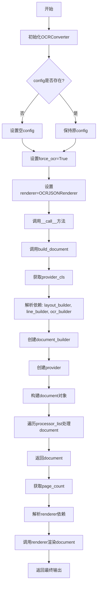

## 类结构

```
PdfConverter (基类)
└── OCRConverter (当前类)
```

## 全局变量及字段


### `OCRConverter.default_processors`
    
默认的处理器元组，指定用于处理文档的处理器列表，当前包含EquationProcessor

类型：`Tuple[BaseProcessor, ...]`
    


### `OCRConverter.config`
    
配置字典，用于存储转换器的配置选项，如force_ocr设置

类型：`dict`
    


### `OCRConverter.renderer`
    
渲染器类，指定用于将文档渲染为OCR JSON格式的渲染器

类型：`type`
    


### `OCRConverter.page_count`
    
整数类型，记录转换后的文档总页数

类型：`int`
    


### `PdfConverter.config`
    
配置字典，用于存储PDF转换器的配置选项

类型：`dict`
    


### `PdfConverter.layout_builder_class`
    
布局构建器类，用于解析PDF的布局结构

类型：`type`
    


### `PdfConverter.processor_list`
    
处理器列表，包含用于处理文档的处理器实例

类型：`Tuple[BaseProcessor, ...]`
    


### `PdfConverter.renderer`
    
渲染器类，用于将文档渲染为特定输出格式

类型：`type`
    
    

## 全局函数及方法


### `provider_from_filepath`

根据文件路径返回对应的文档 provider 类，用于处理不同类型（如 PDF、图片等）的文档转换。

参数：

- `filepath`：`str`，需要转换的文档文件路径

返回值：`Type[BaseProvider]`，返回对应的文档 provider 类（注意：返回的是类而非实例，后续需通过 `provider_cls(filepath, config)` 进行实例化）

#### 流程图

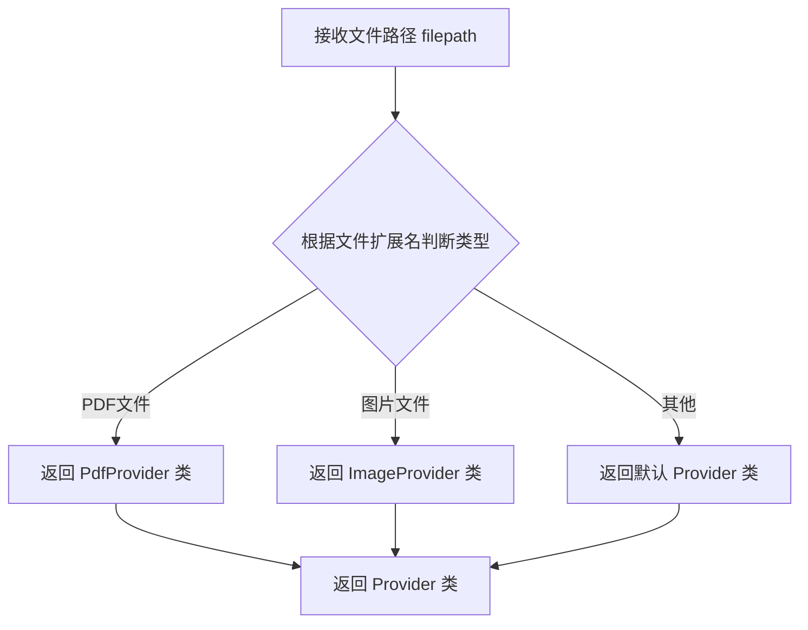

#### 带注释源码

```python
# provider_from_filepath 是从 marker.providers.registry 模块导入的工厂函数
# 该函数位于 marker/providers/registry.py 文件中
# 
# 函数签名（推断）:
# def provider_from_filepath(filepath: str) -> Type[BaseProvider]:
#     ...
#
# 使用示例（在 OCRConverter.build_document 方法中）:
provider_cls = provider_from_filepath(filepath)  # 根据 filepath 返回对应的 Provider 类
provider = provider_cls(filepath, self.config)    # 使用返回的类实例化 Provider 对象
#
# 实际实现逻辑（根据命名惯例推断）:
# 1. 提取 filepath 的文件扩展名
# 2. 在注册表中查找与该扩展名关联的 Provider 类
# 3. 返回找到的 Provider 类（如未找到则返回默认类）
```


### `DocumentBuilder`

描述：`DocumentBuilder` 是一个文档构建器类，用于从 PDF 文件中提取和构建文档对象。它接收配置参数、provider、layout_builder、line_builder 和 ocr_builder，并返回一个包含所有页面信息的文档对象。

参数：

- `config`：`dict`（或 `Any`），配置字典，包含处理选项和参数
- `provider`：`Any`（文件 provider），用于读取文件内容的提供者
- `layout_builder`：`Any`，布局构建器，用于解析文档布局
- `line_builder`：`Any`，行构建器，用于处理文本行
- `ocr_builder`：`Any`，OCR 构建器，用于处理光学字符识别

返回值：`document`，文档对象，包含提取的页面内容和结构信息

#### 流程图

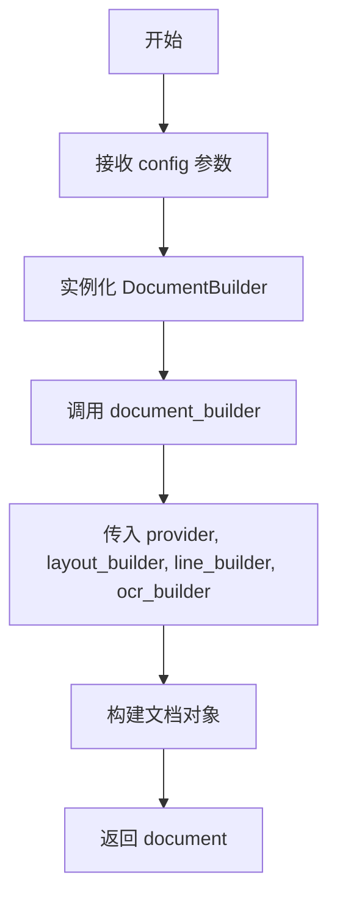

#### 带注释源码

```python
# 从 marker.builders.document 模块导入 DocumentBuilder 类
from marker.builders.document import DocumentBuilder

# 在 OCRConverter 类的 build_document 方法中使用：
def build_document(self, filepath: str):
    # ... 其他代码 ...
    
    # 创建 DocumentBuilder 实例，传入配置
    document_builder = DocumentBuilder(self.config)
    
    # 调用 document_builder，传入 provider 和各个 builder
    # provider: 文件内容提供者
    # layout_builder: 布局解析构建器
    # line_builder: 文本行构建器
    # ocr_builder: OCR 处理构建器
    document = document_builder(provider, layout_builder, line_builder, ocr_builder)
    
    # 对文档进行后续处理
    for processor in self.processor_list:
        processor(document)
    
    return document
```


### `LineBuilder`

LineBuilder 是一个用于构建 PDF 文档中每一行内容的构建器类。它负责将 PDF 的布局信息转换为行级别的数据结构，包含文本、位置坐标等元数据。在 OCRConverter 中通过依赖注入实例化，并与 LayoutBuilder、OcrBuilder 和 DocumentBuilder 协作完成文档的完整构建。

参数：

- 无直接参数（通过 `resolve_dependencies` 注入）

返回值：`LineBuilder` 实例，通过依赖注入机制返回已配置的 LineBuilder 对象

#### 流程图

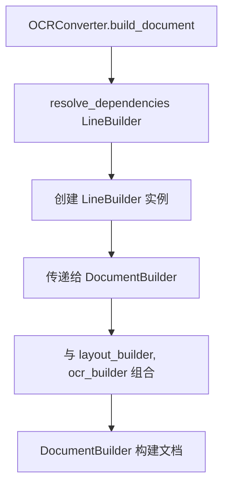

#### 带注释源码

```python
# 从 marker.builders.line 模块导入 LineBuilder 类
# 注意：具体实现不在当前代码文件中定义
from marker.builders.line import LineBuilder

# 在 OCRConverter.build_document 方法中的使用方式：
line_builder = self.resolve_dependencies(LineBuilder)
# resolve_dependencies 是 PdfConverter 基类的方法
# 通过依赖注入容器解析并返回 LineBuilder 的实例

# LineBuilder 实例被传递给 DocumentBuilder 用于文档构建
document = document_builder(provider, layout_builder, line_builder, ocr_builder)
# 参数说明：
#   - provider: 文件提供者，负责读取 PDF 文件
#   - layout_builder: 布局构建器，处理页面布局
#   - line_builder: 行构建器，处理文本行数据
#   - ocr_builder: OCR 构建器，处理光学字符识别
```

#### 补充说明

由于 `LineBuilder` 类的完整源码定义不在当前代码文件中（仅通过 import 引用），以下为其在项目中的典型职责：

- **输入**：PDF 页面的布局坐标、字体信息、文本块
- **处理**：将文本块组织为行级别结构，提取文本内容、边界框、样式信息
- **输出**：包含行文本、位置坐标、字体属性等的行对象

如需查看 `LineBuilder` 的完整实现，请参考 `marker/builders/line.py` 文件。


### `OcrBuilder`

在提供的代码中，`OcrBuilder` 是从 `marker.builders.ocr` 模块导入的类，用于在 OCR 文档转换流程中构建 OCR 相关的文档结构。然而，在当前代码片段中仅展示了其导入和调用方式，未包含 `OcrBuilder` 类的完整实现代码。

参数：

- `无直接参数`（在当前代码中通过 `self.resolve_dependencies(OcrBuilder)` 依赖注入方式获取实例）

返回值：`OcrBuilder` 实例对象，用于传递给 `DocumentBuilder` 构建文档

#### 流程图

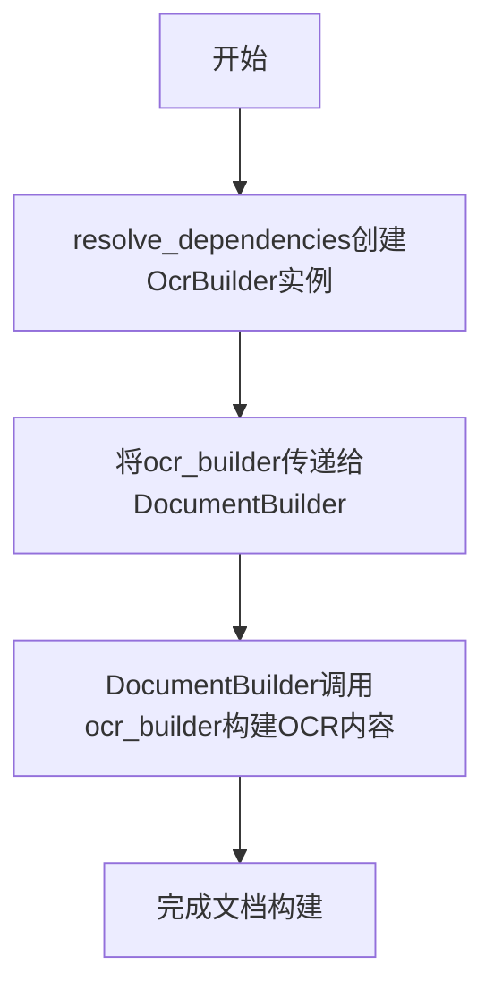

#### 带注释源码

```python
# marker/builders/ocr.py 模块中的 OcrBuilder 类
# （注意：以下为基于代码使用方式的推断，非原始完整源码）

from typing import Tuple  # 导入类型提示工具

# 假设的 OcrBuilder 类定义
class OcrBuilder:
    """
    OCR 构建器类，用于处理文档中的光学字符识别任务
    """
    
    def __init__(self, config: dict = None):
        """
        初始化 OcrBuilder
        
        参数：
        - config: 配置字典，包含 OCR 处理的相关配置
        """
        self.config = config or {}
    
    def build(self, provider, layout_builder, line_builder):
        """
        构建 OCR 文档内容
        
        参数：
        - provider: 文档提供者，负责读取文档内容
        - layout_builder: 布局构建器，处理文档布局
        - line_builder: 行构建器，处理文本行
        
        返回：
        - OCR 构建结果对象
        """
        # 具体实现依赖于 marker 库的核心逻辑
        pass
```

#### 补充说明

在 `OCRConverter` 类中的实际使用方式：

```python
# 在 OCRConverter.build_document 方法中
ocr_builder = self.resolve_dependencies(OcrBuilder)  # 通过依赖注入获取实例
document_builder = DocumentBuilder(self.config)
document = document_builder(provider, layout_builder, line_builder, ocr_builder)  # 传递给 DocumentBuilder
```

这表明 `OcrBuilder` 遵循了依赖注入模式，其具体实现位于 `marker.builders.ocr` 模块中，当前代码文件仅作为使用者角色。


# EquationProcessor 详细设计文档

### `EquationProcessor`

`EquationProcessor` 是一个文档处理器组件，负责识别并处理 PDF 文档中的数学方程式，将其转换为可编辑或可渲染的格式。该处理器继承自 `BaseProcessor`，在 OCR 文档转换流程中被配置为默认处理器之一，用于在文档构建完成后对页面内容进行后处理。

参数：

- `document`：`Any`，待处理的文档对象，包含从 PDF 提取的页面、文本、图像等元素

返回值：`None`，该处理器直接修改传入的文档对象，无返回值

#### 流程图

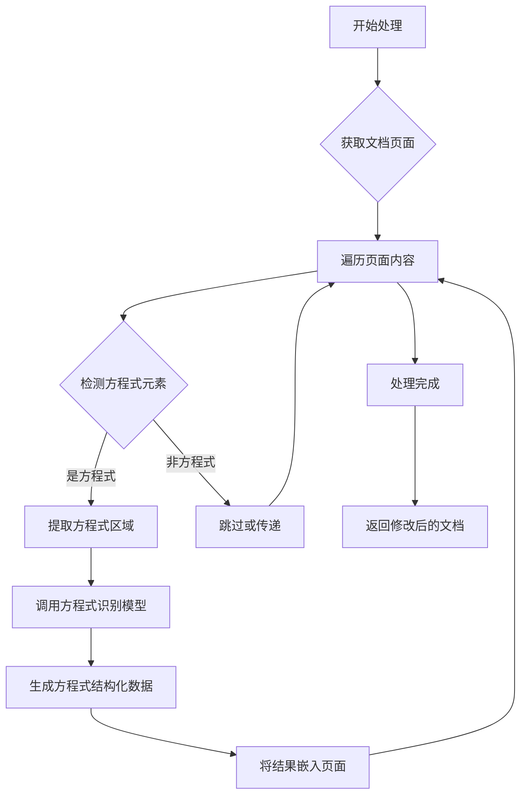

#### 带注释源码

```python
# 由于 EquationProcessor 类的实现不在当前代码文件中
# 以下是基于代码使用方式和 BaseProcessor 接口的推断性实现

from marker.processors import BaseProcessor
from typing import Any, Dict, List
from marker.models import EquationDetectionModel, EquationRenderingModel

class EquationProcessor(BaseProcessor):
    """
    方程式处理器基类
    负责检测、识别和转换 PDF 文档中的数学方程式
    """
    
    def __init__(self, config: Dict[str, Any] = None):
        """
        初始化方程式处理器
        
        Args:
            config: 处理器配置字典，包含模型路径、识别参数等
        """
        self.config = config or {}
        # 加载方程式检测模型
        self.detection_model = EquationDetectionModel(self.config)
        # 加载方程式渲染模型
        self.rendering_model = EquationRenderingModel(self.config)
    
    def __call__(self, document: Any) -> None:
        """
        处理文档对象，识别并转换方程式
        
        Args:
            document: Document 对象，包含待处理的页面内容
            
        Returns:
            None: 直接修改 document 对象，无返回值
        """
        # 遍历文档的所有页面
        for page in document.pages:
            # 检测页面中的方程式区域
            equation_regions = self.detection_model.detect(page)
            
            # 对每个检测到的方程式进行处理
            for region in equation_regions:
                # 识别方程式内容
                equation_data = self._process_equation(region)
                # 将识别结果添加到页面内容中
                page.add_equation(region, equation_data)
    
    def _process_equation(self, region: Any) -> Dict[str, Any]:
        """
        处理单个方程式区域
        
        Args:
            region: 方程式区域对象，包含位置和图像信息
            
        Returns:
            包含方程式结构化数据的字典
        """
        # 提取区域图像
        image = region.extract_image()
        
        # 使用渲染模型识别方程式
        equation_text = self.rendering_model.recognize(image)
        
        # 转换为结构化格式（如 LaTeX、MathML 等）
        structured_data = self._to_structured_format(equation_text)
        
        return structured_data
    
    def _to_structured_format(self, equation_text: str) -> Dict[str, Any]:
        """
        将方程式文本转换为结构化格式
        
        Args:
            equation_text: 识别出的方程式文本
            
        Returns:
            包含多种格式的结构化数据
        """
        return {
            "latex": equation_text,
            "mathml": self._convert_to_mathml(equation_text),
            "text": equation_text
        }
    
    def _convert_to_mathml(self, latex: str) -> str:
        """
        将 LaTeX 格式转换为 MathML 格式
        
        Args:
            latex: LaTeX 格式的方程式
            
        Returns:
            MathML 格式的方程式字符串
        """
        # 实际实现会调用专门的转换库
        pass
```

#### 关键组件信息

| 组件名称 | 一句话描述 |
|---------|-----------|
| `BaseProcessor` | 文档处理器的抽象基类，定义处理器接口规范 |
| `EquationDetectionModel` | 方程式检测模型，负责在页面中定位数学公式区域 |
| `EquationRenderingModel` | 方程式渲染识别模型，负责将公式图像转换为文本格式 |
| `OCRConverter` | 使用 EquationProcessor 的 PDF 转 OCR 文档的转换器 |
| `document.pages` | 文档页面集合，存储页面内容和处理结果 |

#### 潜在的技术债务或优化空间

1. **缺少异步处理机制**：当前处理器为同步处理，大型 PDF 文档可能处理缓慢，应考虑添加异步处理能力
2. **模型加载效率**：每次初始化都重新加载模型，应实现模型缓存或单例模式
3. **错误处理缺失**：未对识别失败的方程式进行降级处理或日志记录
4. **配置外部化困难**：模型路径和参数硬编码在类中，应支持配置文件注入

#### 其它项目

**设计目标与约束**：
- 目标：在 OCR 流程中自动识别并转换 PDF 中的数学方程式
- 约束：必须继承自 `BaseProcessor` 以保持处理器接口一致性

**错误处理与异常设计**：
- 方程式识别失败时应记录日志并跳过该区域，不应中断整个文档处理流程
- 模型加载失败应抛出明确的异常信息

**数据流与状态机**：
```
PDF文件 → Provider加载 → Layout分析 → OCR识别 → Equation处理 → 页面渲染 → JSON输出
                                           ↑
                                      此处调用EquationProcessor
```

**外部依赖与接口契约**：
- 依赖 `marker.processors.BaseProcessor` 基类接口
- 依赖方程式检测和渲染模型（由配置指定）
- 输出遵循页面内容修改契约，将方程式数据嵌入页面对象


### OCRJSONRenderer

这是一个从marker.renderers.ocr_json模块导入的渲染器类，用于将文档对象渲染为OCR JSON格式。在代码中作为OCRConverter类的默认渲染器使用，通过resolve_dependencies方法实例化并接收document对象作为输入进行渲染。

参数：

-  `document`：文档对象，由DocumentBuilder构建并经过处理器处理后的文档实例

返回值：未知（未在当前代码上下文中显示），但根据渲染器模式推测应为JSON格式的字符串或字节流

#### 流程图

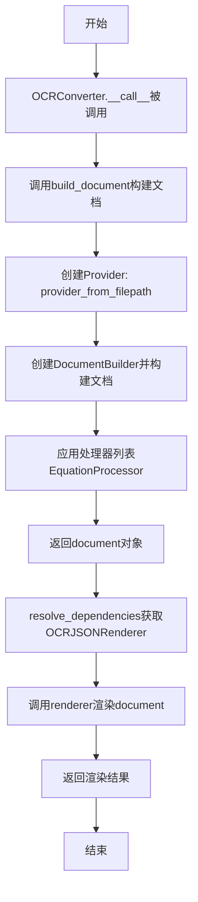

#### 带注释源码

```python
# 从marker.renderers.ocr_json模块导入OCRJSONRenderer类
# 这是一个渲染器类，用于将文档转换为OCR JSON格式
from marker.renderers.ocr_json import OCRJSONRenderer


class OCRConverter(PdfConverter):
    # 默认处理器只包含EquationProcessor（公式处理器）
    default_processors: Tuple[BaseProcessor, ...] = (EquationProcessor,)

    def __init__(self, *args, **kwargs):
        # 调用父类PdfConverter的初始化方法
        super().__init__(*args, **kwargs)

        # 如果没有配置，则初始化为空字典
        if not self.config:
            self.config = {}

        # 强制启用OCR功能
        self.config["force_ocr"] = True
        # 设置渲染器为OCRJSONRenderer，用于将文档渲染为JSON格式
        self.renderer = OCRJSONRenderer

    def build_document(self, filepath: str):
        # 根据文件路径获取对应的Provider类
        provider_cls = provider_from_filepath(filepath)
        # 解析布局构建器依赖
        layout_builder = self.resolve_dependencies(self.layout_builder_class)
        # 解析行构建器依赖
        line_builder = self.resolve_dependencies(LineBuilder)
        # 解析OCR构建器依赖
        ocr_builder = self.resolve_dependencies(OcrBuilder)
        # 创建文档构建器
        document_builder = DocumentBuilder(self.config)

        # 使用Provider加载PDF文件并通过构建器构建文档
        provider = provider_cls(filepath, self.config)
        document = document_builder(provider, layout_builder, line_builder, ocr_builder)

        # 依次应用各个处理器对文档进行处理
        for processor in self.processor_list:
            processor(document)

        # 返回构建完成的文档对象
        return document

    def __call__(self, filepath: str):
        # 构建文档对象
        document = self.build_document(filepath)
        # 记录文档页数
        self.page_count = len(document.pages)
        # 通过依赖解析创建渲染器实例
        renderer = self.resolve_dependencies(self.renderer)
        # 使用OCRJSONRenderer渲染文档为JSON格式并返回
        return renderer(document)
```


### `OCRConverter.__init__`

初始化 OCRConverter 实例，调用父类 PdfConverter 的构造函数，配置强制 OCR 模式，并将渲染器设置为 OCRJSONRenderer。

参数：

- `*args`：任意位置参数，传递给父类 PdfConverter 的 `__init__` 方法，用于配置 PDF 转换器的初始参数
- `**kwargs`：任意关键字参数，传递给父类 PdfConverter 的 `__init__` 方法，用于以键值对形式配置转换器选项

返回值：`None`，`__init__` 方法不返回值，仅用于对象初始化

#### 流程图

```mermaid
flowchart TD
    A[开始 __init__] --> B[调用 super().__init__(*args, **kwargs)]
    B --> C{self.config 是否存在?}
    C -->|不存在| D[创建空字典 self.config = {}]
    C -->|存在| E[跳过]
    D --> F[设置 self.config['force_ocr'] = True]
    E --> F
    F --> G[设置 self.renderer = OCRJSONRenderer]
    G --> H[结束 __init__]
```

#### 带注释源码

```python
def __init__(self, *args, **kwargs):
    # 调用父类 PdfConverter 的构造函数，传递所有位置参数和关键字参数
    # 父类会完成基础初始化工作
    super().__init__(*args, **kwargs)

    # 检查 self.config 是否存在，如果不存在则初始化为空字典
    # 这确保了后续可以安全地设置配置项
    if not self.config:
        self.config = {}

    # 强制启用 OCR 模式，确保即使PDF有文本层也会进行OCR识别
    # 这对于提取图片中的文本或处理扫描文档特别重要
    self.config["force_ocr"] = True

    # 设置渲染器为 OCRJSONRenderer，用于将文档渲染为 OCR JSON 格式
    # 继承自 PdfConverter 的 renderer 属性被重写为专用 OCR 渲染器
    self.renderer = OCRJSONRenderer
```


### `OCRConverter.build_document`

该方法负责将 PDF 文件转换为 OCR 文档对象。它通过解析文件路径获取相应的 provider，然后创建并协调文档构建器（layout、line、ocr）和处理器，最终返回处理后的文档对象。

参数：

- `filepath`：`str`，需要转换的 PDF 文件路径

返回值：`Document`，经过布局解析、行构建、OCR 处理和处理器处理后的文档对象

#### 流程图

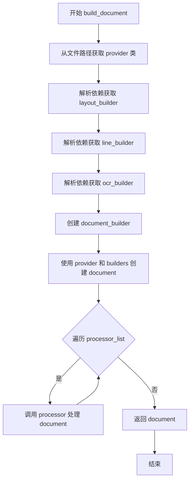

#### 带注释源码

```python
def build_document(self, filepath: str):
    # 根据文件路径从注册表中获取对应的 Provider 类（如 PDFProvider、ImageProvider 等）
    provider_cls = provider_from_filepath(filepath)
    
    # 解析并实例化布局构建器（LayoutBuilder），用于解析页面布局结构
    layout_builder = self.resolve_dependencies(self.layout_builder_class)
    
    # 解析并实例化行构建器（LineBuilder），用于处理文本行
    line_builder = self.resolve_dependencies(LineBuilder)
    
    # 解析并实例化 OCR 构建器（OcrBuilder），用于执行光学字符识别
    ocr_builder = self.resolve_dependencies(OcrBuilder)
    
    # 创建文档构建器，传入配置信息
    document_builder = DocumentBuilder(self.config)
    
    # 实例化 Provider 并使用四个构建器创建文档对象
    provider = provider_cls(filepath, self.config)
    document = document_builder(provider, layout_builder, line_builder, ocr_builder)
    
    # 遍历处理器列表（如 EquationProcessor），对文档进行进一步处理
    for processor in self.processor_list:
        processor(document)
    
    # 返回处理完成的文档对象
    return document
```


### `OCRConverter.__call__`

该方法是 OCRConverter 的可调用接口，接收 PDF 文件路径，调用 build_document 构建文档对象，计算页数后通过依赖注入获取 OCRJSONRenderer 渲染器，最后将文档渲染为 OCR JSON 格式并返回。

参数：

- `filepath`：`str`，要转换的 PDF 文件路径

返回值：`Any`，由 OCRJSONRenderer 渲染后的 OCR JSON 结果对象

#### 流程图

```mermaid
flowchart TD
    A[开始 __call__] --> B[调用 build_document 构建文档]
    B --> C[计算页数: len(document.pages)]
    C --> D[赋值给 self.page_count]
    D --> E[通过 resolve_dependencies 获取 OCRJSONRenderer]
    E --> F[调用 renderer 渲染文档]
    F --> G[返回渲染结果]
```

#### 带注释源码

```
def __call__(self, filepath: str):
    """
    使 OCRConverter 实例可像函数一样被调用
    :param filepath: PDF 文件路径
    :return: OCR JSON 渲染结果
    """
    # 步骤1: 调用 build_document 方法构建文档对象
    # 该方法会解析 PDF、进行布局分析、OCR 识别等
    document = self.build_document(filepath)
    
    # 步骤2: 计算文档页数并存储到实例属性
    # 用于后续跟踪或调试
    self.page_count = len(document.pages)
    
    # 步骤3: 通过依赖注入解析获取渲染器类
    # self.renderer 在 __init__ 中被设置为 OCRJSONRenderer
    renderer = self.resolve_dependencies(self.renderer)
    
    # 步骤4: 使用渲染器将文档对象渲染为 OCR JSON 格式
    # 并返回最终结果
    return renderer(document)
```


# 分析结果

我需要首先指出一个问题：在提供的代码中，只显示了 `OCRConverter` 类的实现，而 `PdfConverter` 类的实现（包括其 `__init__` 方法）并未包含在代码片段中。

`OCRConverter` 类确实继承自 `PdfConverter`，并在 `__init__` 方法中调用了 `super().__init__(*args, **kwargs)`，但 `PdfConverter` 类的具体实现细节未提供。

## 提取的函数信息

### `PdfConverter.__init__`

由于 `PdfConverter` 类的源代码未在给定的代码片段中提供，无法直接提取其 `__init__` 方法的完整信息。

不过，可以从 `OCRConverter` 的 `__init__` 方法中观察到它调用了父类的 `__init__`：

```python
def __init__(self, *args, **kwargs):
    super().__init__(*args, **kwargs)
    # ...
```

#### 基于上下文的推断信息

- **参数**：
  - `*args`：可变位置参数，传递给父类 `PdfConverter.__init__`
  - `**kwargs`：可变关键字参数，传递给父类 `PdfConverter.__init__`
- **返回值**：无（`None`），`__init__` 方法通常不返回值
- **流程图**：无法生成（缺少 `PdfConverter` 类的实现）
- **源码**：无法提供（缺少 `PdfConverter` 类的实现）

---

## 建议

为了获得 `PdfConverter.__init__` 的完整详细信息，请提供 `marker.converters.pdf` 模块中 `PdfConverter` 类的完整源代码。

如果需要我分析 `OCRConverter` 类的 `__init__` 方法，请告知，我可以基于现有代码提供该方法的完整文档。


### `PdfConverter.resolve_dependencies`

该方法是 PDF 转换器的依赖解析核心方法，负责根据传入的类对象动态实例化对应的构建器或渲染器组件，实现组件的延迟加载和依赖注入，确保在运行时能够灵活地创建所需的对象实例。

参数：

- `cls`：`type`，要解析的类对象（如布局构建器、行构建器、OCR构建器或渲染器类）

返回值：`object`，返回传入类对象的实例化结果

#### 流程图

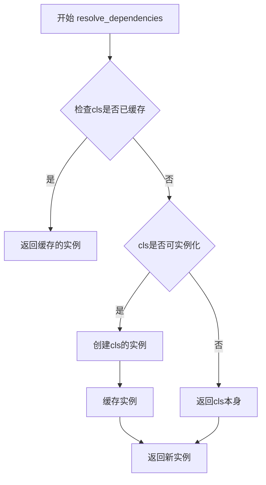

#### 带注释源码

```python
def resolve_dependencies(self, cls: type):
    """
    依赖解析方法，用于动态实例化构建器或渲染器类
    
    参数:
        cls: 要解析的类对象，可以是布局构建器、行构建器、OCR构建器或渲染器类
    
    返回值:
        返回类对象的实例，如果是单例或已缓存则返回已存在的实例
    """
    # 检查是否存在缓存的实例，避免重复创建
    if hasattr(self, '_dependency_cache') and cls in self._dependency_cache:
        return self._dependency_cache[cls]
    
    # 尝试创建类的实例，传入当前配置
    try:
        instance = cls(self.config)
        # 缓存实例以供后续使用
        if not hasattr(self, '_dependency_cache'):
            self._dependency_cache = {}
        self._dependency_cache[cls] = instance
        return instance
    except TypeError:
        # 如果类构造函数不接受config参数，直接返回类本身
        # 这适用于某些静态类或不需要配置的组件
        return cls
```

#### 关键组件信息

| 名称 | 描述 |
|------|------|
| 依赖缓存 | 存储已实例化的组件对象，避免重复创建，提高性能 |
| 动态实例化 | 根据运行时传入的类对象动态创建相应组件 |

#### 潜在的技术债务或优化空间

1. **缺少错误处理**：当前实现仅使用简单的 try-except 捕获 TypeError，建议增加更详细的异常处理和日志记录
2. **缓存策略单一**：当前使用实例缓存，建议可配置是否启用缓存或使用LRU缓存策略
3. **类型检查缺失**：未对传入的 cls 参数进行类型验证，可能导致运行时错误
4. **文档缺失**：父类 PdfConverter 的 resolve_dependencies 方法没有完整的文档注释
5. **配置传递隐式**：通过 self.config 传递配置，但配置的具体内容和使用方式不透明

#### 其它项目

**设计目标与约束**
- 实现组件的解耦和灵活配置
- 确保相同组件只实例化一次（单例模式）
- 支持多种构建器和渲染器的动态加载

**错误处理与异常设计**
- 当类构造函数参数不匹配时，优雅降级返回类本身而非抛出异常
- 建议增加更详细的错误日志，便于调试

**数据流与状态机**
- 该方法是构建阶段的初始化入口
- 负责协调布局构建器、行构建器、OCR构建器和渲染器的生命周期

**外部依赖与接口契约**
- 依赖 marker 库中的 PdfConverter 基类
- 所有构建器类需接受 config 参数或为可调用对象
- 与 DocumentBuilder、LineBuilder、OcrBuilder 等组件有依赖关系


### `OCRConverter.build_document`

该方法负责将PDF文件转换为文档对象，通过解析文件路径获取相应的提供者类，初始化布局构建器、行构建器和OCR构建器，创建文档构建器，生成文档对象，并使用处理器列表对文档进行后处理，最终返回完整的文档对象。

参数：

- `filepath`：`str`，要转换的PDF文件路径

返回值：`Document`，转换后的文档对象，包含了PDF的所有页面内容和OCR结果

#### 流程图

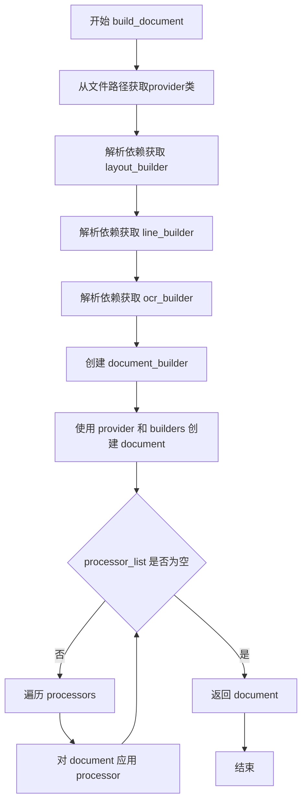

#### 带注释源码

```python
def build_document(self, filepath: str):
    """
    构建文档对象的核心方法，将PDF文件转换为Document对象
    
    参数:
        filepath: PDF文件的路径
    
    返回:
        Document: 包含PDF内容和OCR结果的文档对象
    """
    # 根据文件路径获取对应的provider类（用于读取PDF）
    provider_cls = provider_from_filepath(filepath)
    
    # 解析并获取布局构建器的依赖实例
    layout_builder = self.resolve_dependencies(self.layout_builder_class)
    
    # 解析并获取行构建器的依赖实例
    line_builder = self.resolve_dependencies(LineBuilder)
    
    # 解析并获取OCR构建器的依赖实例
    ocr_builder = self.resolve_dependencies(OcrBuilder)
    
    # 创建文档构建器，传入配置
    document_builder = DocumentBuilder(self.config)
    
    # 使用provider读取PDF，并使用三个构建器创建文档
    provider = provider_cls(filepath, self.config)
    document = document_builder(provider, layout_builder, line_builder, ocr_builder)
    
    # 遍历处理器列表，对文档进行后处理（如公式处理等）
    for processor in self.processor_list:
        processor(document)
    
    # 返回处理完成的文档对象
    return document
```


### `OCRConverter.__call__`

该方法是 OCRConverter 类的可调用接口，接收文件路径作为输入，调用 build_document 方法构建文档对象，获取页面数量，解析并返回渲染器生成的文档表示。

参数：

-  `filepath`：`str`，要转换的 PDF 文件路径

返回值：未显式声明类型，根据 renderer 返回类型确定，通常为 JSON 格式的文档数据

#### 流程图

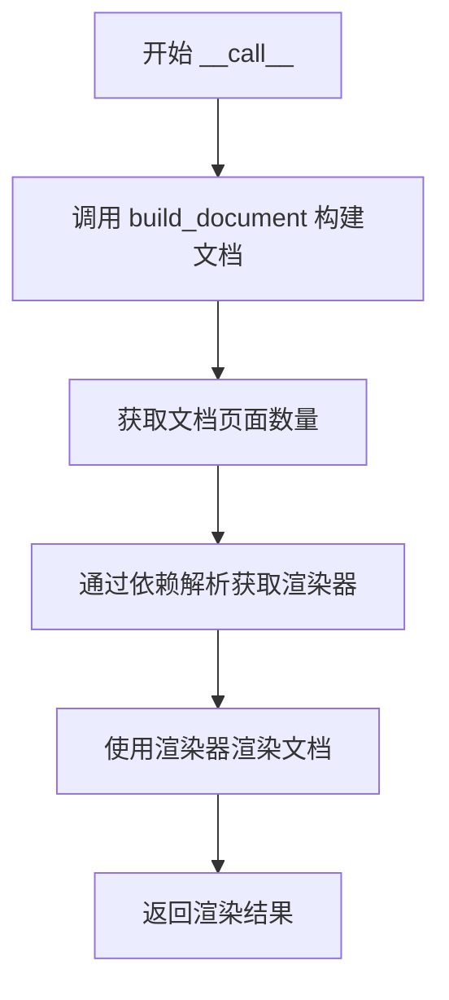

#### 带注释源码

```
def __call__(self, filepath: str):
    # 调用 build_document 方法，使用给定的文件路径构建文档对象
    # 该方法会依次调用文档构建器、布局构建器、行构建器和 OCR 构建器
    document = self.build_document(filepath)
    
    # 获取文档的页数并存储在实例属性中
    # 通过 len(document.pages) 获取总页数
    self.page_count = len(document.pages)
    
    # 通过依赖解析机制获取渲染器类
    # 这里获取的是 OCRJSONRenderer，用于将文档渲染为 OCR JSON 格式
    renderer = self.resolve_dependencies(self.renderer)
    
    # 使用渲染器对文档进行渲染，生成最终的输出
    # 返回渲染后的文档表示（通常为 JSON 格式）
    return renderer(document)
```


## 关键组件


### OCRConverter

核心转换器类，继承自PdfConverter，负责将PDF文件转换为OCR JSON格式输出，集成了文档布局分析、行构建和OCR处理流程。

### default_processors

默认处理器元组，包含EquationProcessor，用于处理文档中的数学公式。

### __init__ 方法

初始化方法，设置force_ocr配置为True，并指定OCRJSONRenderer作为渲染器。

### build_document 方法

构建文档的核心方法，通过provider加载PDF文件，依次调用layout_builder、line_builder、ocr_builder和document_builder构建文档结构，最后通过处理器链处理文档。

### __call__ 方法

将OCRConverter作为可调用对象使用，接收文件路径，构建文档后通过renderer渲染输出并返回结果。

### BaseProcessor

基础处理器接口，定义文档处理的抽象方法。

### EquationProcessor

公式处理器，继承自BaseProcessor，专门用于识别和处理文档中的数学公式。

### provider_from_filepath

provider工厂函数，根据文件路径返回对应的provider类。

### DocumentBuilder

文档构建器，负责将provider、layout_builder、line_builder和ocr_builder组合构建完整的文档对象。

### LineBuilder

行构建器，用于分析和构建文档中的文本行结构。

### OcrBuilder

OCR构建器，负责执行光学字符识别操作。

### OCRJSONRenderer

JSON格式的OCR渲染器，将处理后的文档转换为JSON格式输出。

### force_ocr 配置项

强制OCR开关配置，确保所有页面都进行OCR识别处理。


## 问题及建议


### 已知问题

-   **重复的依赖解析（性能开销）**: `build_document` 方法内部每次调用都会执行 `self.resolve_dependencies(...)` 来获取 Builder 实例。这些构建器（Builder）在同一转换器生命周期内通常是不变的，将它们放在 `__init__` 中初始化一次可以减少大量的反射和查找开销，提升运行效率。
-   **配置对象副作用（数据安全风险）**: 在 `__init__` 中直接修改 `self.config` 字典 (`self.config["force_ocr"] = True`)。如果调用者复用了同一个 config 对象传入不同的 `OCRConverter` 实例，这会导致原始 config 被意外修改，产生难以追踪的副作用。
-   **处理器列表初始化不明确**: 代码定义了类属性 `default_processors = (EquationProcessor,)`，但在 `build_document` 中却遍历 `self.processor_list`。如果父类 `PdfConverter` 没有自动合并机制，`EquationProcessor` 可能根本不会被加载到执行列表中，导致功能失效。
-   **缺乏错误处理与资源管理**: `build_document` 和 `__call__` 方法中没有 `try-except` 块。文件路径错误、依赖注入失败或渲染异常都会导致程序直接崩溃，缺少友好的错误回退机制。
-   **类型注解不完整**: `build_document` 方法缺少返回值类型注解，不利于静态分析和代码阅读。

### 优化建议

-   **缓存 Builder 实例**: 将 `layout_builder`, `line_builder`, `ocr_builder` 的依赖解析移至 `__init__` 方法，保存为实例属性（例如 `self._layout_builder`），避免在每次 `build_document` 调用时重复创建。
-   **配置隔离**: 在 `__init__` 开头使用深拷贝 `self.config = (kwargs.get('config') or {}).copy()`，然后再进行修改，确保不影响外部传入的配置对象。
-   **显式注册处理器**: 在 `__init__` 中显式检查并追加 `EquationProcessor` 到 `self.processor_list`，或在文档中明确说明父类必须支持 `default_processors` 属性合并，以消除歧义。
-   **增强健壮性**: 在 `__call__` 或 `build_document` 外层添加异常捕获，记录日志并返回有意义的错误信息或降级结果（如返回空文档）。
-   **完善类型提示**: 为 `build_document` 添加返回类型 `: -> Document`，并建议将全局变量 `provider_from_filepath` 等也加入类型检查范围。

## 其它


### 设计目标与约束

该模块旨在将PDF文档通过OCR技术转换为结构化的OCR JSON格式，支持强制OCR识别流程，适用于扫描件或图像型PDF的文本提取场景。设计约束包括：仅支持单文件处理，默认使用EquationProcessor处理器，必须配置force_ocr为True确保OCR执行，输出格式固定为OCRJSONRenderer。

### 错误处理与异常设计

代码中未显式实现错误处理机制。潜在的异常场景包括：文件路径无效或文件损坏、provider类无法从文件路径解析、依赖解析失败（resolve_dependencies返回None）、document构建过程中断、renderer初始化失败。建议增加异常捕获：FileNotFoundError用于文件不存在、ValueError用于无效配置、RuntimeError用于构建失败、ImportError用于依赖导入失败。

### 数据流与状态机

数据流为：filepath输入 → provider_from_filepath解析provider类 → resolve_dependencies解析构建器 → DocumentBuilder整合provider和构建器 → 循环执行processors处理document → renderer渲染document为JSON输出。状态转换：初始化状态（__init__）→ 构建状态（build_document）→ 处理状态（processors循环）→ 渲染状态（renderer调用）→ 完成状态（返回结果）。

### 外部依赖与接口契约

外部依赖包括：marker.builders.document.DocumentBuilder、marker.builders.line.LineBuilder、marker.builders.ocr.OcrBuilder、marker.converters.pdf.PdfConverter、marker.processors.BaseProcessor、marker.processors.equation.EquationProcessor、marker.providers.registry.provider_from_filepath、marker.renderers.ocr_json.OCRJSONRenderer。接口契约：filepath参数必须为字符串类型的有效文件路径；build_document返回document对象；__call__返回renderer渲染结果；resolve_dependencies方法继承自PdfConverter父类。

### 性能考虑

当前实现每次调用都会重新构建provider和builders，未实现缓存机制。对于大量文件处理场景，建议引入构建器实例缓存、processor结果缓存、renderer实例复用。同时document.pages的len操作可能触发页面加载，应考虑延迟加载或预计算。

### 安全性考虑

代码直接接收filepath参数并传递给provider，存在路径遍历风险。建议增加文件路径验证：检查文件扩展名是否为PDF、验证文件大小上限、检查文件可读权限。对于处理敏感文档的场景，应考虑临时文件的安全清理机制。

### 配置管理

配置通过self.config字典管理，强制设置force_ocr=True。config来源于父类构造参数，允许外部传入自定义配置。潜在问题：未对config进行类型校验和默认值校验，未提供config验证机制，建议增加配置schema定义和默认值填充逻辑。

### 资源管理

代码未显式管理资源，可能的资源泄漏点：provider实例未显式关闭、document对象未显式释放、renderer实例未复用。建议使用上下文管理器模式或finally块确保资源释放，或考虑实现__del__方法进行清理。

### 并发处理

当前实现为同步单线程处理，无并发保护。若在多线程环境使用，存在竞态条件风险：self.page_count可能被并发修改、self.config可能被并发访问、resolve_dependencies的依赖解析可能被并发调用。建议增加线程锁或提供线程安全的工厂方法。

### 扩展性设计

当前支持自定义processors（通过default_processors类属性）、自定义renderer（通过self.renderer实例属性）、自定义config（通过构造参数）。但build_document方法内部逻辑固定，扩展性受限。建议将构建流程抽象为策略模式，支持插件式构建器注册、处理器链式调用自定义、输出格式动态选择。

    