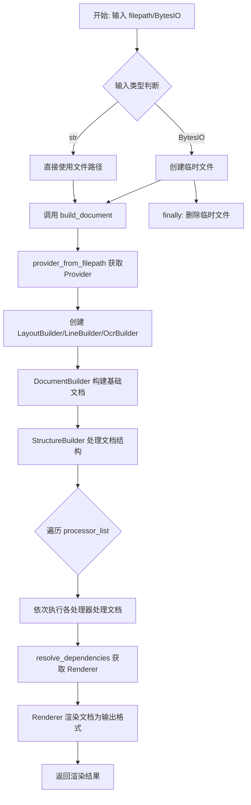
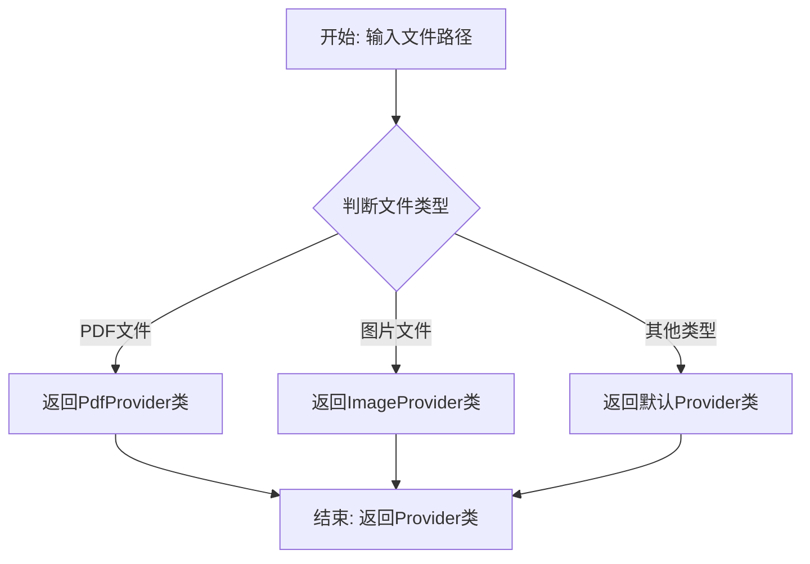
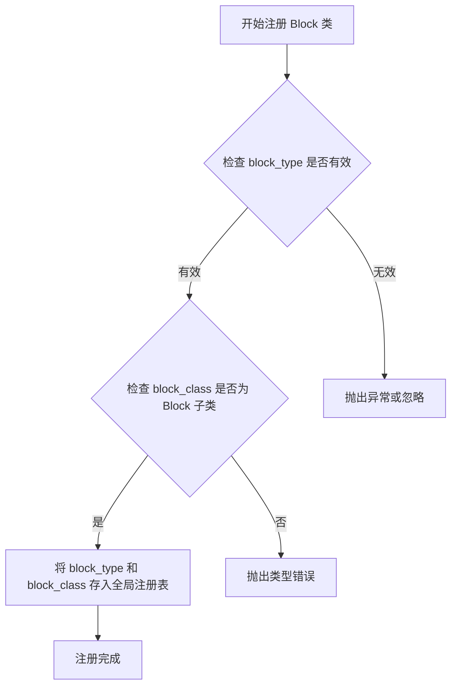
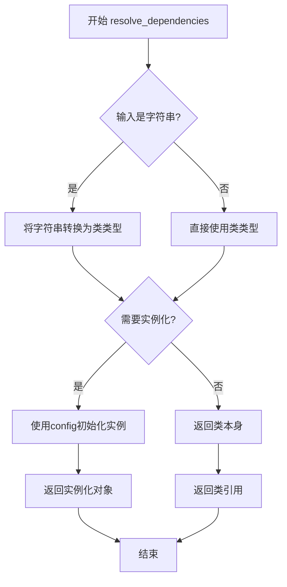
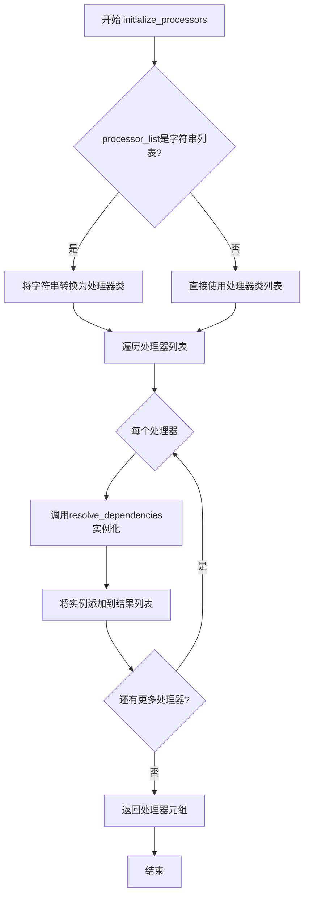
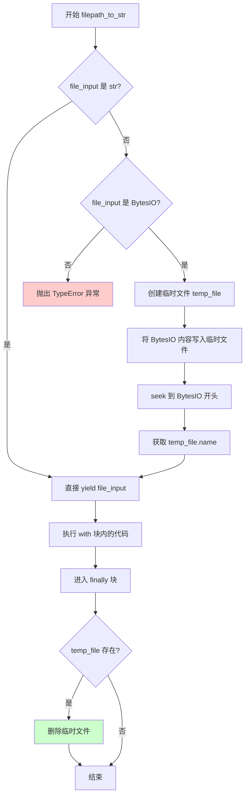
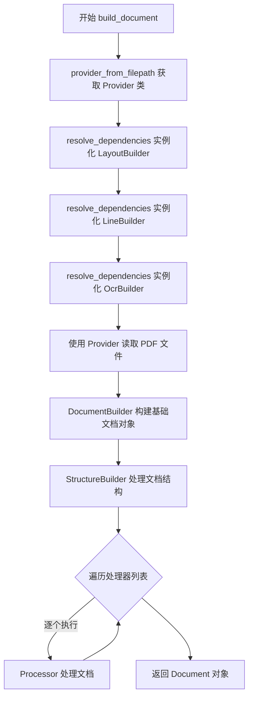
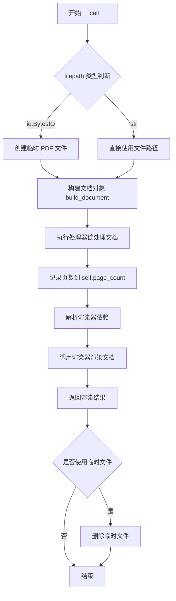

# `marker\marker\converters\pdf.py` 详细设计文档

PdfConverter是一个PDF到Markdown/JSON/HTML的多格式转换器，通过可配置的处理管道和可选的LLM服务实现高质量的文档结构提取、布局分析、文本识别和内容渲染。

## 整体流程



## 类结构

```
BaseConverter (基类)
└── PdfConverter (主转换器类)
```

## 全局变量及字段


### `TOKENIZERS_PARALLELISM`
    
环境变量,设置为'false'以禁用tokenizers并行警告

类型：`str`
    


### `PdfConverter.override_map`
    
覆盖默认Block类型的映射字典

类型：`Dict[BlockTypes, Type[Block]]`
    


### `PdfConverter.use_llm`
    
是否启用LLM处理的标志

类型：`bool`
    


### `PdfConverter.default_processors`
    
默认处理器元组,包含所有标准处理器

类型：`Tuple[BaseProcessor, ...]`
    


### `PdfConverter.default_llm_service`
    
默认LLM服务类,指向GoogleGeminiService

类型：`BaseService`
    


### `PdfConverter.artifact_dict`
    
工件字典,用于在组件间存储和传递共享数据

类型：`Dict[str, Any]`
    


### `PdfConverter.llm_service`
    
当前初始化并使用的LLM服务实例

类型：`BaseService`
    


### `PdfConverter.renderer`
    
渲染器类,默认使用MarkdownRenderer

类型：`type`
    


### `PdfConverter.processor_list`
    
已初始化的处理器实例列表

类型：`List[BaseProcessor]`
    


### `PdfConverter.layout_builder_class`
    
布局构建器类,用于解析PDF布局结构

类型：`type`
    


### `PdfConverter.page_count`
    
记录已转换的PDF页数

类型：`int`
    
    

## 全局函数及方法


### `provider_from_filepath`

根据文件路径获取对应的Provider类，用于处理不同类型的PDF文件。

参数：

-  `filepath`：`str`，待处理的PDF文件路径

返回值：`Type[BaseProvider]`，返回对应的Provider类（一个继承自BaseProvider的类），该类随后可用于实例化Provider对象来处理文件

#### 流程图



*注：实际的类型判断逻辑需要查看`marker/providers/registry.py`源码确认，上述流程为基于函数功能的合理推断。*

#### 带注释源码

```
# 此函数定义在 marker/providers/registry.py 中
# 由于源代码未提供，此处为基于调用方式的推断

def provider_from_filepath(filepath: str) -> Type[BaseProvider]:
    """
    根据文件路径返回对应的Provider类
    
    参数:
        filepath: 文件路径，用于判断文件类型
        
    返回值:
        对应的Provider类，用于实例化Provider对象
    """
    # 获取文件扩展名
    file_ext = os.path.splitext(filepath)[1].lower()
    
    # 根据扩展名映射到对应的Provider类
    # 例如: .pdf -> PdfProvider, .jpg/.png -> ImageProvider
    provider_class = EXTENSION_TO_PROVIDER.get(file_ext, DefaultProvider)
    
    return provider_class
```

#### 说明

由于提供的代码片段中只包含对此函数的导入（`from marker.providers.registry import provider_from_filepath`）和使用，并未包含该函数的具体实现，以上信息基于以下代码调用推断：

```python
# 在 PdfConverter.build_document 方法中的调用
provider_cls = provider_from_filepath(filepath)  # 获取Provider类
provider = provider_cls(filepath, self.config)   # 实例化Provider对象
```

如需获取准确的函数实现源码，请参考 `marker/providers/registry.py` 文件。


### `strings_to_classes`

该函数是一个工具函数，用于将字符串形式的类名字符串列表转换为对应的类对象。它在系统中承担着动态类加载的职责，使得可以通过配置文件或字符串参数来指定要使用的处理器、渲染器和服务类，而无需硬编码类引用。

参数：

-  `class_strings`：`List[str]`，需要转换的类名字符串列表，如 `["TextProcessor", "MarkdownRenderer"]`

返回值：`List[Type]`，转换后的类对象列表

#### 流程图

```mermaid
flowchart TD
    A[输入: 字符串列表<br/>class_strings: List[str]] --> B{遍历字符串列表}
    B --> C[获取当前字符串]
    C --> D[从marker模块导入路径解析类]
    D --> E{解析成功?}
    E -->|是| F[返回类对象]
    E -->|否| G[抛出ImportError或ValueError]
    F --> B
    G --> H[错误处理]
    B --> I{遍历完成?}
    I -->|否| C
    I -->|是| J[返回类对象列表<br/>List[Type]]
    
    style F fill:#90EE90
    style G fill:#FFB6C1
    style J fill:#87CEEB
```

#### 带注释源码

```python
# 注：该函数源码不在当前代码文件中
# 以下为基于使用方式推断的实现逻辑

def strings_to_classes(class_strings: List[str]) -> List[Type]:
    """
    将类名字符串列表转换为类对象列表
    
    参数:
        class_strings: 包含类名的字符串列表，例如 ["TextProcessor", "MarkdownRenderer"]
    
    返回:
        对应的类对象列表
    """
    from marker.util import import_string  # 假设存在导入工具
    
    classes = []
    for class_str in class_strings:
        # 根据字符串动态导入类
        # 例如: "marker.processors.text.TextProcessor" -> TextProcessor类
        cls = import_string(class_str)
        classes.append(cls)
    
    return classes
```

#### 使用示例

在 `PdfConverter` 类中的实际调用方式：

```python
# 场景1: 转换处理器列表字符串
if processor_list is not None:
    processor_list = strings_to_classes(processor_list)  # ["OrderProcessor", "TextProcessor"] -> [OrderProcessor类, TextProcessor类]
else:
    processor_list = self.default_processors

# 场景2: 转换渲染器字符串
if renderer:
    renderer = strings_to_classes([renderer])[0]  # "MarkdownRenderer" -> MarkdownRenderer类
else:
    renderer = MarkdownRenderer

# 场景3: 转换LLM服务字符串
if llm_service:
    llm_service_cls = strings_to_classes([llm_service])[0]  # "GoogleGeminiService" -> GoogleGeminiService类
    llm_service = self.resolve_dependencies(llm_service_cls)
```


### `register_block_class`

将自定义的 Block 实现类注册到全局注册表中，以替代特定 BlockTypes 的默认实现。用于在 PdfConverter 初始化时根据 override_map 将自定义块类型映射到对应的 Block 实现类。

参数：

-  `block_type`：`BlockTypes`，要注册的块类型枚举值（如文本、表格、图像等）
-  `block_class`：`Type[Block]`，用于处理该块类型的 Block 实现类

返回值：`None`，无返回值

#### 流程图



#### 带注释源码

```
# 源码位于 marker/schema/registry.py（推断位置）
# 以下为基于导入和使用方式的推断实现

from typing import Type, Dict
from marker.schema.blocks import Block
from marker.schema import BlockTypes

# 全局注册表：存储 BlockTypes 到 Block 类的映射
_block_class_registry: Dict[BlockTypes, Type[Block]] = {}

def register_block_class(block_type: BlockTypes, block_class: Type[Block]) -> None:
    """
    注册 Block 类型与实现类的映射关系。
    
    Args:
        block_type: BlockTypes 枚举值，表示要注册的块类型
        block_class: 继承自 Block 的类，用于处理该类型的块
    
    Returns:
        None
    
    Raises:
        TypeError: 如果 block_class 不是 Block 的子类
        ValueError: 如果 block_type 已存在覆盖映射
    """
    # 验证 block_class 是 Block 的子类
    if not issubclass(block_class, Block):
        raise TypeError(f"{block_class} must be a subclass of Block")
    
    # 将映射关系存入全局注册表
    _block_class_registry[block_type] = block_class
```

#### 在 PdfConverter 中的调用

```python
# 在 PdfConverter.__init__ 方法中
def __init__(self, ...):
    # override_map 是可选的块类型覆盖映射
    # 例如：{BlockTypes.Table: CustomTableBlock}
    for block_type, override_block_type in self.override_map.items():
        # 将自定义的 Block 类注册到全局注册表
        # 后续处理器在创建块时会查询此注册表
        register_block_class(block_type, override_block_type)
```


### `BaseConverter.resolve_dependencies`

该方法负责实例化依赖的类或服务，将类类型转换为具体的实例对象，支持依赖注入功能。

参数：

-  `cls_or_str`：待解析的依赖，可以是类类型（Type）或者字符串（str），如果是字符串则先转换为类类型
-  `**kwargs`：可选的关键字参数，用于传递给目标类的构造函数

返回值：返回解析后的类实例对象（Any），即传入类的实例化结果

#### 流程图



#### 带注释源码

```python
def resolve_dependencies(self, cls_or_str: Type | str, **kwargs):
    """
    Resolves a class or service dependency.
    
    This method handles dependency injection for the converter, converting
    string references to class types and instantiating them with the 
    current configuration.
    
    Args:
        cls_or_str: The class or string identifier to resolve
        **kwargs: Additional arguments passed to the class constructor
        
    Returns:
        An instance of the requested class, or the class itself if 
        no instantiation is needed
    """
    # If a string is provided, convert it to a class
    if isinstance(cls_or_str, str):
        cls_or_str = strings_to_classes([cls_or_str])[0]
    
    # Instantiate with config and any additional kwargs
    return cls_or_str(self.config, **kwargs)
```

---

### `BaseConverter.initialize_processors`

该方法负责初始化处理器列表，对处理器进行实例化、排序和依赖解析，确保处理器按照正确的顺序执行。

参数：

-  `processor_list`：处理器类列表（List[Type[BaseProcessor]]），可以是处理器类名称的字符串列表或者直接的处理器类类型列表

返回值：返回实例化后的处理器列表（Tuple[BaseProcessor, ...]），每个处理器都被正确实例化

#### 流程图



#### 带注释源码

```python
def initialize_processors(self, processor_list: List[str | Type[BaseProcessor]]) -> Tuple[BaseProcessor, ...]:
    """
    Initialize and instantiate the list of processors.
    
    This method converts processor specifications (strings or classes) into
    fully instantiated processor objects that can be applied to documents.
    Processors are resolved through the dependency injection system.
    
    Args:
        processor_list: A list of processor classes or string identifiers
        
    Returns:
        A tuple of instantiated processor objects ready to process documents
    """
    # Convert string identifiers to classes if necessary
    if processor_list and isinstance(processor_list[0], str):
        processor_list = strings_to_classes(processor_list)
    
    # Instantiate each processor
    initialized = []
    for processor_cls in processor_list:
        # Use resolve_dependencies to properly instantiate with config
        processor = self.resolve_dependencies(processor_cls)
        initialized.append(processor)
    
    return tuple(initialized)
```


### `PdfConverter.__init__`

初始化 `PdfConverter` 转换器实例，配置处理器列表、渲染器类型、LLM 服务以及工件字典，并注册自定义块类型以支持 PDF 到 Markdown、JSON、HTML 等格式的转换。

参数：

- `artifact_dict`：`Dict[str, Any]` - 工件字典，用于在处理器和服务之间共享数据（如 LLM 服务实例）
- `processor_list`：`Optional[List[str]]` - 处理器类名字符串列表，若为 None 则使用默认处理器列表
- `renderer`：`str | None` - 渲染器类名字符串，若为 None 则默认使用 MarkdownRenderer
- `llm_service`：`str | None` - LLM 服务类名字符串，若提供则实例化对应服务；若为 None 但 config 中 use_llm 为 True，则使用默认 LLM 服务
- `config`：`Any` - 配置字典，用于传递全局配置参数，若为 None 则初始化为空字典

返回值：`None` - 该方法为构造函数，不返回任何值，仅初始化实例属性

#### 流程图

```mermaid
flowchart TD
    A[__init__ 开始] --> B{config is None?}
    B -->|是| C[config = {}]
    B -->|否| D[使用传入的 config]
    C --> E[遍历 override_map 注册自定义块类型]
    E --> F{processor_list is not None?}
    F -->|是| G[strings_to_classes 转换为类列表]
    F -->|否| H[使用 default_processors]
    G --> I{renderer is not None?}
    H --> I
    I -->|是| J[strings_to_classes 转换渲染器类]
    I -->|否| K[使用 MarkdownRenderer]
    J --> L[设置 self.artifact_dict]
    K --> L
    L --> M{llm_service is not None?}
    M -->|是| N[解析并实例化 LLM 服务类]
    M -->|否| O{config.get use_llm?}
    O -->|是| P[解析并实例化默认 LLM 服务]
    O -->|否| Q[llm_service = None]
    N --> R[注入 llm_service 到 artifact_dict]
    P --> R
    Q --> R
    R --> S[设置 self.renderer]
    S --> T[initialize_processors 初始化处理器列表]
    T --> U[设置 self.processor_list]
    U --> V[设置 self.layout_builder_class 和 self.page_count]
    V --> Z[__init__ 结束]
```

#### 带注释源码

```python
def __init__(
    self,
    artifact_dict: Dict[str, Any],
    processor_list: Optional[List[str]] = None,
    renderer: str | None = None,
    llm_service: str | None = None,
    config=None,
):
    """
    初始化 PdfConverter 实例
    
    参数:
        artifact_dict: 工件字典，用于存储共享数据和 LLM 服务实例
        processor_list: 可选的处理器类名字符串列表
        renderer: 可选的渲染器类名字符串
        llm_service: 可选的 LLM 服务类名字符串
        config: 可选的配置字典
    """
    # 调用父类 BaseConverter 的构造函数进行基类初始化
    super().__init__(config)

    # 如果没有传入配置，则使用空字典作为默认配置
    if config is None:
        config = {}

    # 遍历 override_map 注册自定义块类型覆盖
    # override_map 允许用户指定自定义的 Block 类来替代默认实现
    for block_type, override_block_type in self.override_map.items():
        register_block_class(block_type, override_block_type)

    # 处理处理器列表：如果提供了字符串列表则转换为类列表
    # 否则使用默认的处理器列表 default_processors
    if processor_list is not None:
        processor_list = strings_to_classes(processor_list)
    else:
        processor_list = self.default_processors

    # 处理渲染器：如果提供了渲染器字符串则转换为类
    # 否则默认使用 MarkdownRenderer
    if renderer:
        renderer = strings_to_classes([renderer])[0]
    else:
        renderer = MarkdownRenderer

    # 将 artifact_dict 保存到实例属性
    # 这样 resolve_dependencies 可以访问它
    self.artifact_dict = artifact_dict

    # 处理 LLM 服务：
    # 1. 如果直接指定了 llm_service 字符串，则解析并实例化
    # 2. 否则检查 config 中是否启用了 use_llm，若启用则使用默认 LLM 服务
    if llm_service:
        llm_service_cls = strings_to_classes([llm_service])[0]
        llm_service = self.resolve_dependencies(llm_service_cls)
    elif config.get("use_llm", False):
        llm_service = self.resolve_dependencies(self.default_llm_service)

    # 将 llm_service 注入到 artifact_dict 中
    # 这样处理器和其他组件可以通过 artifact_dict 获取 LLM 服务
    self.artifact_dict["llm_service"] = llm_service
    self.llm_service = llm_service

    # 保存渲染器实例到实例属性
    self.renderer = renderer

    # 通过 initialize_processors 方法初始化处理器列表
    # 该方法会解析处理器的依赖关系并进行实例化
    processor_list = self.initialize_processors(processor_list)
    self.processor_list = processor_list

    # 设置布局构建器类为 LayoutBuilder
    self.layout_builder_class = LayoutBuilder
    # 初始化页面计数为 None，待转换后更新
    self.page_count = None  # Track how many pages were converted
```


### `PdfConverter.filepath_to_str`

这是一个上下文管理器方法，用于将文件输入（字符串路径或 BytesIO 对象）统一转换为字符串路径，并在操作完成后自动清理临时文件。

参数：

- `self`：`PdfConverter`，PdfConverter 类的实例，上下文管理器的持有者
- `file_input`：`Union[str, io.BytesIO]`，输入文件，可以是字符串形式的文件路径或 BytesIO 字节流对象

返回值：`str`，文件路径字符串。如果是字符串输入则直接返回原路径；如果是 BytesIO 则返回临时文件的路径

#### 流程图



#### 带注释源码

```python
@contextmanager
def filepath_to_str(self, file_input: Union[str, io.BytesIO]):
    """
    上下文管理器：将文件输入转换为字符串路径
    - 如果输入是 str，直接返回
    - 如果输入是 BytesIO，创建临时文件并写入内容，返回临时文件路径
    - 使用完毕后自动清理临时文件
    """
    temp_file = None
    try:
        # 判断输入类型
        if isinstance(file_input, str):
            # 字符串路径直接返回，无需处理
            yield file_input
        else:
            # BytesIO 对象需要写入临时文件
            with tempfile.NamedTemporaryFile(
                delete=False, suffix=".pdf"  # 创建临时 PDF 文件，不自动删除
            ) as temp_file:
                if isinstance(file_input, io.BytesIO):
                    # 将 BytesIO 指针移到开头
                    file_input.seek(0)
                    # 将内容写入临时文件
                    temp_file.write(file_input.getvalue())
                else:
                    # 不支持的类型，抛出异常
                    raise TypeError(
                        f"Expected str or BytesIO, got {type(file_input)}"
                    )

            # 返回临时文件路径供调用者使用
            yield temp_file.name
    finally:
        # 无论是否发生异常，最后都清理临时文件
        if temp_file is not None and os.path.exists(temp_file.name):
            os.unlink(temp_file.name)
```


### `PdfConverter.build_document`

构建完整文档对象并经过所有处理器处理，返回处理后的 Document 对象。

参数：

- `filepath`：`str`，PDF 文件的路径

返回值：`Document`，经过布局构建、行构建、OCR 识别、结构分析和所有处理器处理后的文档对象

#### 流程图



#### 带注释源码

```python
def build_document(self, filepath: str) -> Document:
    """
    构建完整文档对象并经过所有处理器处理
    
    Args:
        filepath: PDF 文件的路径
        
    Returns:
        Document: 经过完整处理流程的文档对象
    """
    # 1. 根据文件路径获取对应的 Provider 类（用于读取不同类型的 PDF）
    provider_cls = provider_from_filepath(filepath)
    
    # 2. 通过依赖注入实例化布局构建器（LayoutBuilder）
    layout_builder = self.resolve_dependencies(self.layout_builder_class)
    
    # 3. 通过依赖注入实例化行构建器（LineBuilder）
    line_builder = self.resolve_dependencies(LineBuilder)
    
    # 4. 通过依赖注入实例化 OCR 构建器（OcrBuilder）
    ocr_builder = self.resolve_dependencies(OcrBuilder)
    
    # 5. 使用 Provider 类和配置信息初始化 Provider 实例
    provider = provider_cls(filepath, self.config)
    
    # 6. 使用 DocumentBuilder 构建基础文档对象
    # 传入 provider、layout_builder、line_builder、ocr_builder
    document = DocumentBuilder(self.config)(
        provider, layout_builder, line_builder, ocr_builder
    )
    
    # 7. 通过依赖注入获取 StructureBuilder 并处理文档结构
    structure_builder_cls = self.resolve_dependencies(StructureBuilder)
    structure_builder_cls(document)
    
    # 8. 遍历处理器列表，依次对文档进行处理
    # 处理器包括：OrderProcessor, BlockRelabelProcessor, LineMergeProcessor 等
    for processor in self.processor_list:
        processor(document)
    
    # 9. 返回经过所有处理器处理后的文档对象
    return document
```


### `PdfConverter.__call__`

这是 `PdfConverter` 类的主入口方法，接收文件路径或字节流，将其转换为文档对象，经过一系列处理器处理后，使用渲染器将文档渲染为指定格式（如 Markdown）并返回。

参数：

- `filepath`：`str | io.BytesIO`，要转换的 PDF 文件路径（字符串）或字节流对象

返回值：`Any`，渲染后的文档结果（通常为 Markdown、JSON 或 HTML 格式，取决于使用的渲染器）

#### 流程图



#### 带注释源码

```python
def __call__(self, filepath: str | io.BytesIO):
    """
    主入口方法，将 PDF 文件转换为渲染后的文档格式
    
    参数:
        filepath: PDF 文件路径（字符串）或字节流对象
        
    返回:
        渲染后的文档对象（Markdown/JSON/HTML 等格式）
    """
    # 使用上下文管理器处理文件输入
    # 如果是 BytesIO，会创建临时文件；如果是字符串路径，直接使用
    with self.filepath_to_str(filepath) as temp_path:
        # 1. 构建文档对象：解析 PDF、布局分析、OCR 识别、结构化处理
        document = self.build_document(temp_path)
        
        # 2. 记录转换的页数，用于统计和调试
        self.page_count = len(document.pages)
        
        # 3. 解析渲染器依赖（默认使用 MarkdownRenderer）
        renderer = self.resolve_dependencies(self.renderer)
        
        # 4. 使用渲染器将文档对象渲染为目标格式
        rendered = renderer(document)
    
    # 5. 返回渲染结果
    # 临时文件会在上下文管理器退出时自动清理
    return rendered
```

## 关键组件


### PdfConverter

PDF转Markdown/JSON/HTML的主转换器类，协调整个文档转换流程

### override_map

块类型到自定义块类的映射字典，用于覆盖默认块类型实现

### use_llm

布尔标志，控制是否启用LLM增强的高质量处理

### default_processors

包含25个处理器的元组，定义了PDF文档的标准处理流程，包括订单处理、块重标签、行合并、引用、代码、目录、公式、脚注、忽略文本、行号、列表、页眉、章节标题、表格、LLM表格、LLM表单、文本、复杂区域处理、图像描述、公式、手写、数学块、章节标题、页面校正、引用、空白页和调试处理器

### default_llm_service

默认的LLM服务类，指定为GoogleGeminiService

### __init__

初始化方法，负责配置转换器、注册块类、初始化处理器列表、设置渲染器和LLM服务

### filepath_to_str

上下文管理器方法，将文件输入转换为字符串路径，支持str和BytesIO输入，并处理临时文件清理

### build_document

文档构建方法，负责创建文档提供器、布局构建器、行构建器、OCR构建器、结构构建器，并依次执行所有处理器

### __call__

可调用方法，作为转换器的主入口点，调用filepath_to_str处理输入，然后调用build_document构建文档，最后使用渲染器渲染并返回结果

### 处理器链架构

由25个BaseProcessor子类组成的有序处理管道，每个处理器负责特定的文档处理任务，如文本提取、表格识别、公式解析、页眉页脚处理等

### LLM服务集成

通过llm_service注入机制将LLM服务传递给处理器，支持Gemini等大语言模型服务，用于高级文档理解任务

### 依赖解析机制

resolve_dependencies方法用于动态实例化构建器和服务类，实现依赖注入和延迟加载

### 渲染器系统

支持可插拔的渲染器架构，默认使用MarkdownRenderer，支持将文档转换为多种输出格式


## 问题及建议


### 已知问题

- **全局环境变量修改**：在模块顶层直接设置 `os.environ["TOKENIZERS_PARALLELISM"] = "false"`，会影响整个进程行为，缺乏灵活性且无法动态控制。
- **临时文件管理风险**：`filepath_to_str` 方法中，如果 `temp_file.write()` 成功但后续发生异常，临时文件可能不会被清理（虽然有 finally 块，但写入过程中发生异常可能导致问题）。
- **硬编码的处理器顺序**：`default_processors` 中的处理器顺序是固定的，`DebugProcessor` 被放在最后，可能不适合所有场景。
- **重复状态存储**：`llm_service` 同时存储在 `artifact_dict["llm_service"]` 和 `self.llm_service` 中，造成状态冗余。
- **配置验证缺失**：配置字典 (`config`) 传入后没有进行任何验证或模式检查，可能导致运行时错误。
- **类型注解不完整**：`override_map` 使用 `defaultdict()` 但未指定默认值类型，可能导致 `TypeError`。
- **隐藏的依赖注入**：`resolve_dependencies` 方法的实现不可见，调试困难，且依赖关系不透明。
- **错误处理不足**：缺少对常见异常（如文件路径不存在、PDF 解析失败、LLM 服务连接失败）的捕获和处理。

### 优化建议

- **将环境变量设置移入配置**：通过配置参数控制 `TOKENIZERS_PARALLELISM`，而非全局修改。
- **改进临时文件管理**：使用 `tempfile.NamedTemporaryFile(delete=False)` 并结合上下文管理器，或使用 `tempfile.TemporaryDirectory()`。
- **支持处理器链配置**：允许用户在初始化时自定义处理器列表和顺序，而非依赖硬编码的元组。
- **统一状态管理**：只在一处存储 `llm_service`，避免冗余。
- **添加配置验证**：在 `__init__` 中对配置参数进行校验，提供清晰的错误提示。
- **完善类型注解**：为 `override_map` 提供完整的类型定义和默认值初始化。
- **增强错误处理**：为关键方法添加 try-except 块，特别是文件读取和构建文档的过程中。
- **文档完善**：为类和方法添加更详细的文档字符串，说明参数、返回值和可能的异常。

## 其它


### 设计目标与约束

该代码的核心目标是将PDF文档转换为多种格式（Markdown、JSON、HTML等），支持文本、表格、公式、代码块等多种元素的处理，并可通过LLM服务提升处理质量。约束条件包括：输入仅支持PDF格式（str或io.BytesIO），依赖Google Gemini作为默认LLM服务，处理器执行顺序影响最终输出效果。

### 错误处理与异常设计

主要异常处理包括：TypeError用于处理不支持的输入类型（如非str/BytesIO），通过os.unlink确保临时文件在异常情况下也能被清理，config为空的默认处理，以及provider解析失败、依赖注入失败、渲染失败等潜在错误的隐式传播。代码中未实现显式的异常捕获和日志记录机制。

### 数据流与状态机

数据流转过程为：输入文件 → filepath_to_str转换为路径 → provider解析PDF → DocumentBuilder构建文档对象 → LayoutBuilder/LineBuilder/OcrBuilder处理布局 → StructureBuilder处理结构 → 逐个Processor处理各类元素 → Renderer渲染输出。状态主要包括：初始态、文档构建态、处理器处理态、渲染完成态。

### 外部依赖与接口契约

核心依赖包括：marker.schema（Document、Block、BlockTypes），marker.processors（多种Processor类），marker.builders（DocumentBuilder、LayoutBuilder等），marker.services（BaseService、GoogleGeminiService），marker.converters（BaseConverter），marker.renderers（MarkdownRenderer）。接口契约方面，processor需继承BaseProcessor并实现__call__方法，service需继承BaseService，renderer需实现__call__方法返回渲染结果。

### 性能考虑与优化空间

当前实现中每个processor串行执行，LLM服务为单例注入，大型文档可能存在性能瓶颈。优化方向包括：支持processor并行处理、实现渲染结果缓存、考虑流式输出处理大型PDF、支持批量文档转换。

### 安全性考量

临时文件处理使用tempfile.NamedTemporaryFile并设置delete=False手动管理，存在临时文件泄露风险。LLM服务依赖外部API，需考虑API密钥管理和请求频率限制。未对输入PDF进行恶意内容检测和大小限制。

### 配置管理

config字典作为全局配置载体，支持use_llm开关和自定义LLM服务。processor_list和renderer可通过字符串或类形式传入，支持运行时动态配置。但缺少配置验证机制和默认值说明文档。

### 可扩展性设计

通过override_map支持自定义Block类型，通过processor_list支持自定义处理器，通过llm_service支持自定义LLM服务，通过renderer支持自定义渲染器。strings_to_classes实现字符串到类的动态映射。但扩展点缺乏明确的接口规范和插件机制。

### 并发与资源管理

当前无并发处理机制，LLM服务为单例可能导致请求排队。临时文件在contextmanager中管理，但未限制并发转换任务数。缺乏资源池管理和超时控制机制。

### 兼容性考虑

依赖TOKENIZERS_PARALLELISM环境变量设置以避免警告。Python版本兼容性未明确声明。不同版本的marker库和LLM服务可能影响转换结果一致性。

### 日志与监控

代码中未实现日志记录功能。DebugProcessor的存在表明需要调试支持，但缺乏生产级日志。page_count作为简单统计指标被追踪，但无完整监控体系。

### 测试覆盖建议

应覆盖：正常PDF转换流程、各种输入类型处理、临时文件清理、LLM服务启用/禁用场景、处理器列表自定义、渲染器切换、异常输入处理、内存使用监控。
    