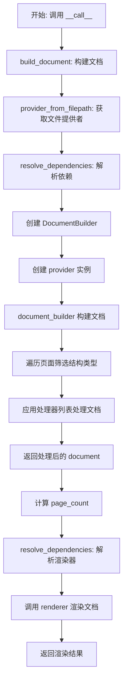
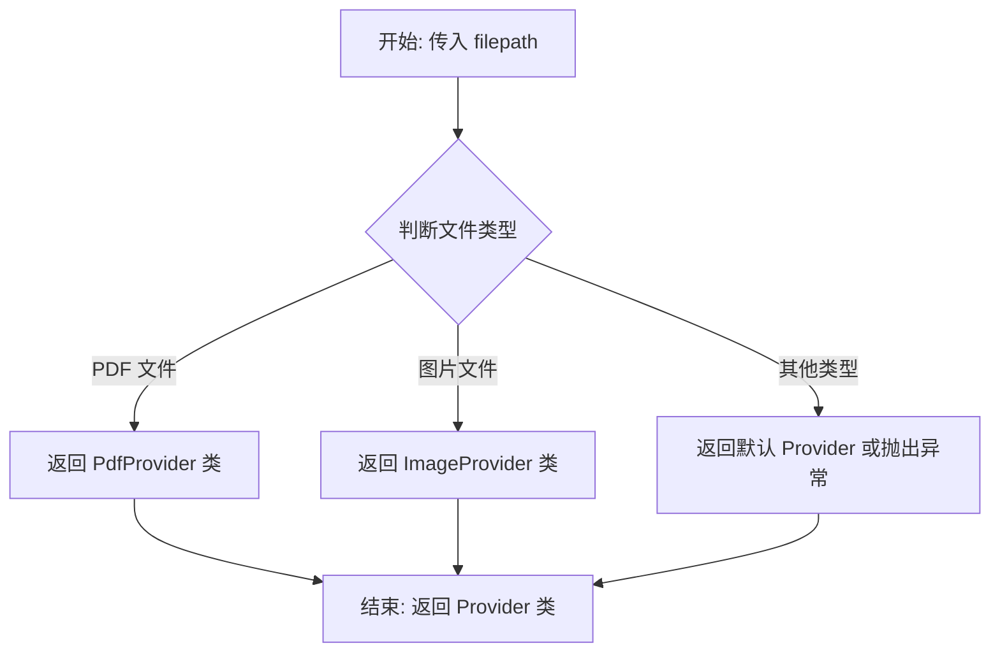
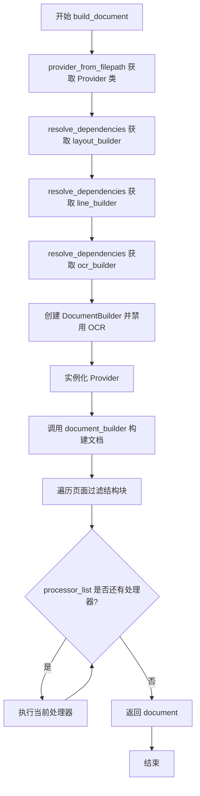
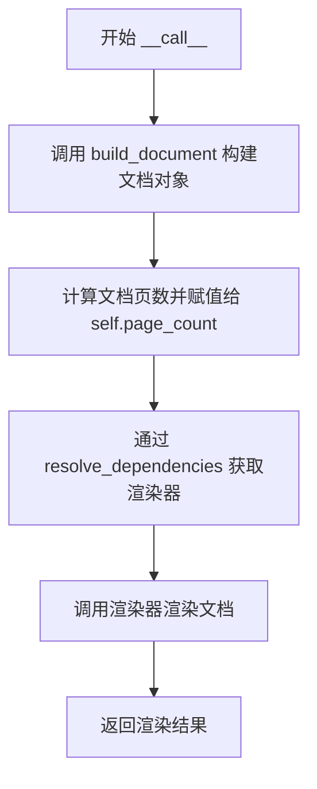

# `marker\marker\converters\table.py` 详细设计文档

TableConverter是一个PDF转表格的转换器类，继承自PdfConverter，通过组合多种专业处理器（表格处理器、LLM表格处理器、LLM表格合并处理器、LLM表单处理器、LLM复杂区域处理器）来识别和提取PDF文档中的表格、表单和目录内容，并将这些结构化数据渲染输出。

## 整体流程



## 类结构

```
PdfConverter (基类)
└── TableConverter
```

## 全局变量及字段


### `TableConverter.default_processors`
    
定义表格转换的默认处理器列表，包含TableProcessor、LLMTableProcessor、LLMTableMergeProcessor、LLMFormProcessor和LLMComplexRegionProcessor，用于按顺序处理文档中的表格、表单和复杂区域

类型：`Tuple[BaseProcessor, ...]`
    


### `TableConverter.converter_block_types`
    
指定转换器处理的文档块类型列表，包括Table（表格）、Form（表单）和TableOfContents（目录），用于过滤需要转换的页面元素

类型：`List[BlockTypes]`
    
    

## 全局函数及方法


### `provider_from_filepath`

该函数是 Provider 注册表的核心功能，根据传入的文件路径自动识别文件类型并返回对应的 Provider 类的工厂函数。它使得 TableConverter 能够处理不同类型的 PDF 文件，而无需手动指定具体的 Provider 实现。

参数：

- `filepath`：`str`，待处理的 PDF 文件路径，用于根据文件扩展名或内容特征匹配对应的 Provider 类

返回值：返回对应的 Provider 类（type），该类通常接收 `filepath` 和 `config` 两个参数进行实例化，用于解析和转换特定类型的 PDF 文档

#### 流程图



#### 带注释源码

```python
# 从 marker.providers.registry 模块导入 provider_from_filepath 函数
# 该函数根据文件路径自动推断文件类型并返回相应的 Provider 类
from marker.providers.registry import provider_from_filepath

# 在 TableConverter.build_document 方法中的使用示例：
def build_document(self, filepath: str):
    # 调用 provider_from_filepath 获取适合该文件类型的 Provider 类
    provider_cls = provider_from_filepath(filepath)
    
    # ... 省略其他代码 ...
    
    # 根据返回的类实例化 Provider 对象，传入文件路径和配置
    provider = provider_cls(filepath, self.config)
    
    # ... 后续处理 ...
    
    return document
```

#### 详细说明

`provider_from_filepath` 函数是实现文件类型自动识别和 Provider 动态加载的关键组件。它遵循工厂模式的设计理念，将文件类型映射与 Provider 创建逻辑解耦。该函数通常通过文件扩展名（如 .pdf、.png、.jpg）来识别文件类型，并从注册表中查找对应的 Provider 类。这种设计允许系统轻松扩展对新文件类型的支持，只需在注册表中添加新的映射关系即可。

**使用场景：**
- 在 `TableConverter.build_document` 方法中，根据输入的 PDF 文件路径动态选择合适的 Provider
- 使得同一个 Converter 类可以处理多种不同来源或格式的文档

**设计优势：**
- **松耦合**：调用方无需知道具体使用哪个 Provider 类
- **可扩展性**：新增文件类型支持时，只需在注册表中添加映射，无需修改调用代码
- **灵活性**：可以根据文件内容（而非仅扩展名）来决定使用哪个 Provider


### `TableConverter.build_document`

该方法负责将 PDF 文件转换为文档对象，核心流程包括：初始化各类构建器（布局、行、OCR）、创建文档构建器、根据文件路径实例化相应的 Provider，过滤页面结构只保留表格/表单/目录等目标块类型，最后通过处理器链对文档进行深度处理并返回完整文档对象。

参数：

- `filepath`：`str`，需要转换的 PDF 文件路径，用于确定合适的 Provider 类并提供原始文件数据

返回值：`Document`，返回处理完成的文档对象，包含解析后的页面结构和内容

#### 流程图



#### 带注释源码

```python
def build_document(self, filepath: str):
    """
    构建文档对象的核心方法
    
    参数:
        filepath: PDF 文件路径，用于确定 Provider 类型
        
    返回:
        Document: 处理完成的文档对象
    """
    # 1. 根据文件路径从注册表获取对应的 Provider 类
    #    (如 PDFProvider、DjVuProvider 等)
    provider_cls = provider_from_filepath(filepath)
    
    # 2. 通过依赖解析获取布局构建器实例
    #    负责识别文档的布局结构(段落、标题、表格等)
    layout_builder = self.resolve_dependencies(self.layout_builder_class)
    
    # 3. 通过依赖解析获取行构建器实例
    #    负责将文本内容组织为行结构
    line_builder = self.resolve_dependencies(LineBuilder)
    
    # 4. 通过依赖解析获取 OCR 构建器实例
    #    负责图像文本识别(此处被禁用)
    ocr_builder = self.resolve_dependencies(OcrBuilder)
    
    # 5. 创建文档构建器，传入配置对象
    document_builder = DocumentBuilder(self.config)
    
    # 6. 禁用 OCR 功能以提高性能
    #    (因为此 Converter 主要处理结构化内容)
    document_builder.disable_ocr = True
    
    # 7. 使用文件路径和配置实例化 Provider
    #    Provider 负责读取和解析源文件
    provider = provider_cls(filepath, self.config)
    
    # 8. 调用文档构建器生成初始文档对象
    #    包含页面、块结构、文本内容等
    document = document_builder(provider, layout_builder, line_builder, ocr_builder)
    
    # 9. 遍历所有页面，过滤页面结构
    #    只保留 converter_block_types 指定的块类型:
    #    - BlockTypes.Table (表格)
    #    - BlockTypes.Form (表单)
    #    - BlockTypes.TableOfContents (目录)
    #    这样可以减少后续处理器的计算量
    for page in document.pages:
        page.structure = [
            p for p in page.structure if p.block_type in self.converter_block_types
        ]
    
    # 10. 依次调用处理器链处理文档
    #     处理器列表: TableProcessor, LLMTableProcessor, 
    #                 LLMTableMergeProcessor, LLMFormProcessor, 
    #                 LLMComplexRegionProcessor
    #     每个处理器会对文档进行特定的增强或转换
    for processor in self.processor_list:
        processor(document)
    
    # 11. 返回处理完成的文档对象
    return document
```


### `TableConverter.__call__`

该方法是 `TableConverter` 类的可调用接口，接收 PDF 文件路径作为输入，通过构建文档对象、计算页数并使用渲染器将文档渲染为最终输出。

参数：

- `filepath`：`str`，需要转换的 PDF 文件路径

返回值：未明确标注类型（取决于 `self.renderer` 的返回类型），渲染后的文档内容

#### 流程图



#### 带注释源码

```
def __call__(self, filepath: str):
    """
    将 PDF 文件转换为指定的文档表示形式
    
    参数:
        filepath: str - 输入的 PDF 文件路径
    
    返回:
        渲染后的文档对象（类型取决于具体渲染器实现）
    """
    # 步骤1: 调用 build_document 方法构建文档对象
    # 该方法会解析 PDF、提取布局、识别表格/表单等元素
    document = self.build_document(filepath)

    # 步骤2: 获取文档页数并存储到实例属性
    # 用于后续跟踪或显示转换进度
    self.page_count = len(document.pages)

    # 步骤3: 通过依赖注入解析获取渲染器实例
    # 渲染器负责将文档对象转换为最终输出格式
    renderer = self.resolve_dependencies(self.renderer)
    
    # 步骤4: 使用渲染器处理文档并返回结果
    # 返回值类型取决于具体渲染器实现
    return renderer(document)
```

## 关键组件


### TableConverter

核心转换器类，继承自 PdfConverter，专门用于处理 PDF 文档中的表格、表单和目录内容，通过多个专用处理器链式处理文档并渲染输出。

### default_processors

默认处理器元组，包含 TableProcessor、LLMTableProcessor、LLMTableMergeProcessor、LLMFormProcessor 和 LLMComplexRegionProcessor，用于不同阶段的文档处理。

### converter_block_types

目标块类型列表，指定仅处理 Table（表格）、Form（表单）和 TableOfContents（目录）类型的块，实现内容的过滤和聚焦处理。

### build_document

文档构建方法，通过 provider 获取 PDF 文件、初始化各类 Builder、构建文档对象，然后根据 converter_block_types 过滤页面结构，最后依次调用处理器处理文档并返回。

### __call__

入口调用方法，接受文件路径参数，调用 build_document 构建文档，获取页面数量，解析渲染器依赖，最后返回渲染后的文档结果。

### BaseProcessor

处理器基类，定义了文档处理的接口规范，各类处理器均继承该基类实现具体的处理逻辑。

### provider_from_filepath

provider 解析函数，根据文件路径自动识别并返回对应的 PDF provider 类，用于文件的读取和解析。

### DocumentBuilder

文档构建器，负责组装布局、行和 OCR 构建器来生成完整的文档对象，包含 disable_ocr 属性控制是否启用 OCR。


## 问题及建议


### 已知问题

-   **异常处理缺失**：`build_document` 和 `__call__` 方法均未包含任何异常处理逻辑，文件不存在、解析失败或处理器异常时会导致程序直接崩溃
-   **硬编码的处理器列表**：`default_processors` 和 `converter_block_types` 作为类变量固定，无法根据不同文档类型动态调整处理器链
-   **资源未显式释放**：`provider`、`document`、`renderer` 等资源在使用后没有显式的清理或上下文管理机制，可能导致内存泄漏
-   **OCR 功能被硬禁用**：`document_builder.disable_ocr = True` 写死，调用方无法根据需求动态启用 OCR
-   **缺少日志记录**：代码中没有任何日志输出，难以进行运行时监控、调试和问题排查
-   **page_count 未返回**：`__call__` 方法计算了 `self.page_count` 但未将其暴露给调用方，使用不便
-   **依赖注入使用字符串**：`resolve_dependencies` 依赖类名字符串而非直接引用类，增加了维护成本且无法获得 IDE 静态检查支持
-   **类型注解不完整**：部分变量如 `renderer`、`provider` 缺少类型注解，`processor` 循环中的变量也缺少类型信息

### 优化建议

-   **添加异常处理**：在 `build_document` 和 `__call__` 中捕获 `FileNotFoundError`、`Exception` 等异常，并提供有意义的错误信息或降级策略
-   **配置化处理器链**：将处理器列表和块类型转为构造函数参数，支持通过配置文件或初始化参数动态注入
-   **实现上下文管理器**：使 `TableConverter` 支持 `with` 语句，或提供 `close()`/`cleanup()` 方法确保资源释放
-   **支持动态 OCR 配置**：添加 `enable_ocr` 参数，允许调用方根据需求启用或禁用 OCR 功能
-   **引入日志框架**：使用 `logging` 模块记录关键步骤（文件加载、处理器执行、渲染完成等），便于生产环境监控
-   **返回 page_count**：修改 `__call__` 方法签名使其返回 `page_count` 或将其包含在返回结果中
-   **使用类型安全的依赖注入**：考虑直接传递类引用而非字符串，或使用 `TypeVar`/`Generic` 强化类型检查
-   **完善类型注解**：为所有函数参数、返回值和关键变量添加完整的类型注解，提升代码可维护性
-   **考虑异步支持**：对于大文件处理，可考虑添加异步版本的方法以提高并发处理能力

## 其它


### 设计目标与约束

本转换器的设计目标是高效地从PDF文档中提取表格、表单和目录等复杂结构，并将它们渲染为目标格式。约束条件包括：仅支持PDF格式输入，默认禁用OCR功能，仅处理指定的块类型（Table、Form、TableOfContents），处理器按固定顺序执行。

### 错误处理与异常设计

代码中未显式实现错误处理机制。在build_document方法中，依赖resolve_dependencies方法进行依赖解析和实例化，provider_from_filepath根据文件路径获取provider类时可能抛出异常。渲染阶段同样依赖注入的renderer组件。建议添加异常捕获逻辑处理文件读取失败、依赖解析失败、处理器执行异常等情况，并向上传递有意义的错误信息。

### 数据流与状态机

数据流遵循以下路径：输入文件路径 → provider加载PDF → DocumentBuilder构建文档对象 → 页面结构过滤（仅保留目标块类型） → 依次经过5个处理器处理 → renderer渲染输出。状态转换包括：初始状态（文件输入）→ 文档构建状态 → 处理器处理状态 → 最终渲染状态。每个处理器都会修改document对象的状态。

### 外部依赖与接口契约

主要外部依赖包括：marker.builders包下的DocumentBuilder、LineBuilder、OcrBuilder；marker.converters.pdf.PdfConverter基类；marker.processors包下的多个处理器类；marker.providers.registry.provider_from_filepath函数；marker.schema.BlockTypes枚举。接口契约要求传入有效的PDF文件路径，返回渲染后的文档结果。类字段default_processors和converter_block_types定义了可扩展的处理器列表和目标块类型集合。

### 性能考虑

当前实现中，所有页面在build_document阶段被完整加载到内存。对于大型PDF文件可能导致内存压力。处理器采用串行执行方式，未利用并发。表格合并处理器(LLMTableMergeProcessor)和复杂区域处理器(LLMComplexRegionProcessor)可能涉及LLM调用，存在较高延迟。建议考虑分页处理和处理器并行化优化。

### 配置说明

通过继承PdfConverter类获取配置管理能力。document_builder.disable_ocr = True禁用了OCR功能，这是一个关键配置项。default_processors元组定义了处理管线，可以通过子类化重写该属性来扩展或修改处理器链。converter_block_types列表定义了需要处理的块类型，可根据需求调整。

### 使用示例

```python
converter = TableConverter(config)
output = converter("input.pdf")
```

转换器实例化后传入PDF文件路径即可执行转换。转换结果取决于注入的renderer实现。

### 并发与线程安全性

代码本身不包含并发控制机制。resolve_dependencies方法创建处理器实例时未发现共享状态，但document对象在多个处理器间共享传递，存在潜在的状态竞争风险。如果在多线程环境下使用同一个converter实例，需要考虑添加锁保护或使用线程本地存储。

    