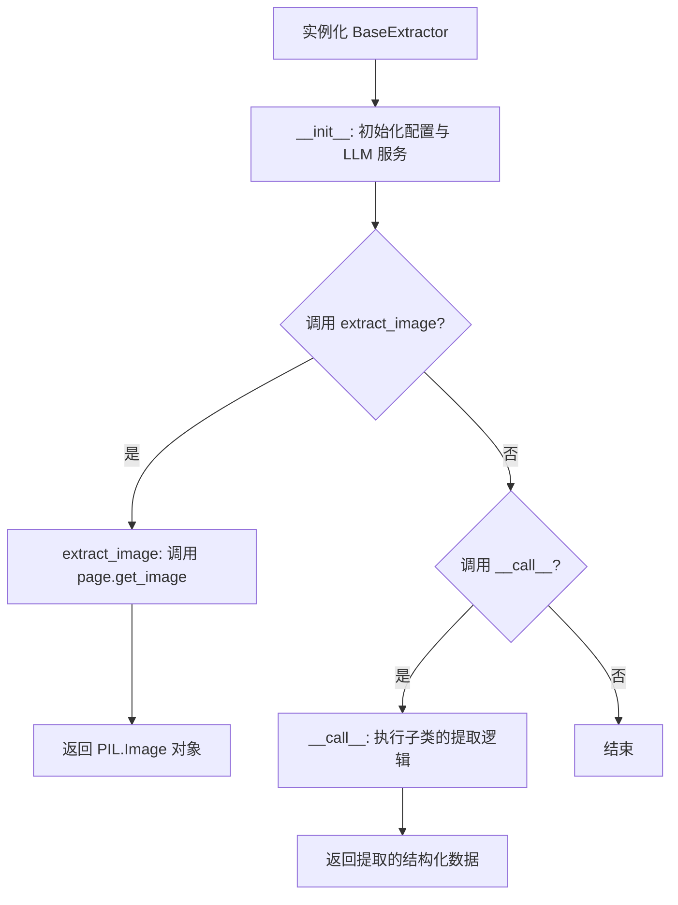
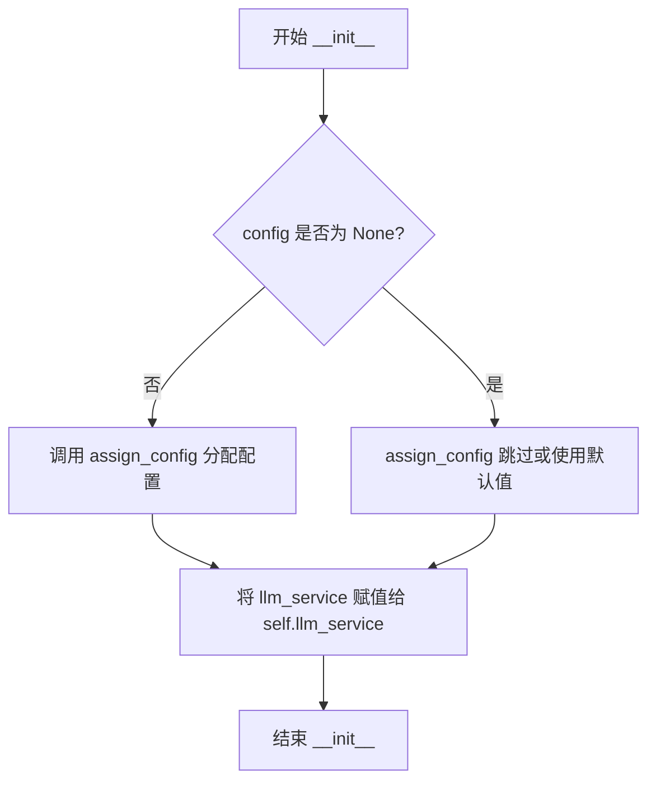
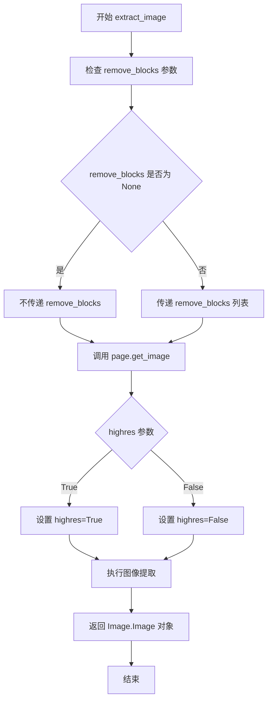
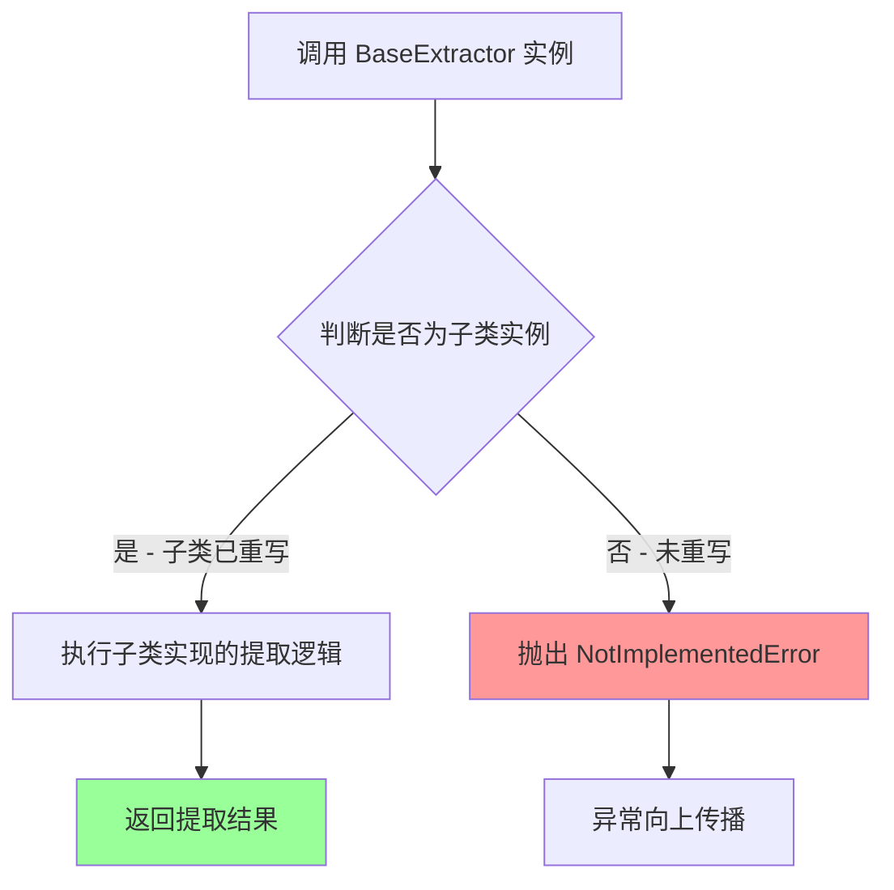

# `marker\marker\extractors\__init__.py` 详细设计文档

定义了一个用于从文档中提取结构化数据的基类提取器（BaseExtractor），该类封装了与LLM服务（BaseService）的交互，并提供了从文档页面提取图像的通用方法，旨在通过继承和多态实现具体的文档数据提取逻辑。

## 整体流程



## 类结构

```
BaseExtractor (基类)
```

## 全局变量及字段


### `BaseExtractor.max_concurrency`
    
最大并发请求数

类型：`int`
    


### `BaseExtractor.disable_tqdm`
    
是否禁用 tqdm 进度条

类型：`bool`
    


### `BaseExtractor.llm_service`
    
LLM 服务实例，用于执行提取任务

类型：`BaseService`
    
    

## 全局函数及方法


### `BaseExtractor.__init__`

初始化提取器实例，设置语言模型服务并应用配置。

参数：

- `llm_service`：`BaseService`，用于从文档中提取结构化数据的服务实例
- `config`：`Any`，可选配置对象，用于分配给提取器的配置属性，默认为 None

返回值：`None`，构造函数不返回任何值

#### 流程图



#### 带注释源码

```python
def __init__(self, llm_service: BaseService, config=None):
    """
    初始化 BaseExtractor 实例。
    
    Args:
        llm_service: BaseService 类型，用于处理文档提取的服务实例。
                     该服务负责执行实际的数据提取逻辑。
        config: 可选的配置对象，会被 assign_config 函数处理以设置
                类的各种配置属性。默认为 None。
    """
    # 调用 assign_config 工具函数，将 config 中的属性分配到当前实例
    # 这允许通过配置对象动态设置类的属性（如 max_concurrency, disable_tqdm）
    assign_config(self, config)
    
    # 将传入的 LLM 服务实例保存为实例属性，供其他方法使用
    self.llm_service = llm_service
```


### `BaseExtractor.extract_image`

从指定页面提取图像，可选移除特定块或使用高清模式。该方法是一个委托包装器，实际图像提取逻辑由 `PageGroup.get_image()` 方法实现。

参数：

- `self`：隐式参数，BaseExtractor 实例自身
- `document`：`Document`，文档对象，包含需要提取图像的完整文档数据
- `page`：`PageGroup`，页面组对象，表示需要提取图像的特定页面
- `remove_blocks`：`Sequence[BlockTypes] | None`，可选参数，要从图像中移除的块类型序列，默认为 None 表示不移除任何块
- `highres`：`bool`，可选参数，是否使用高清模式提取图像，默认为 False（节省 tokens）

返回值：`Image.Image`，返回提取出的 PIL 图像对象

#### 流程图



#### 带注释源码

```python
def extract_image(
    self,
    document: Document,
    page: PageGroup,
    remove_blocks: Sequence[BlockTypes] | None = None,
    highres: bool = False,  # Default False to save tokens
) -> Image.Image:
    """
    从指定页面提取图像，可选移除特定块或使用高清模式。
    
    参数:
        document: 文档对象，包含需要提取图像的完整文档数据
        page: 页面组对象，表示需要提取图像的特定页面
        remove_blocks: 要从图像中移除的块类型序列，None 表示不移除任何块
        highres: 是否使用高清模式，默认为 False 以节省 tokens
    
    返回:
        提取出的 PIL 图像对象
    """
    # 委托调用 page 对象的 get_image 方法进行实际图像提取
    # 参数 highres 控制图像分辨率：True 为高清，False 为标准分辨率
    # 参数 remove_blocks 用于在提取图像前过滤掉不需要的页面块（如页眉、页脚等）
    return page.get_image(
        document,
        highres=highres,
        remove_blocks=remove_blocks,
    )
```


### `BaseExtractor.__call__`

抽象方法，执行实际的文档提取逻辑，由子类实现。该方法是 Python 的魔术方法，使实例可以像函数一样被调用。

参数：

- `self`：BaseExtractor 实例，当前提取器对象
- `document`：`Document`，待提取的文档对象，包含页面、布局等结构化信息
- `*args`：可变位置参数，用于传递额外的位置参数（由子类具体实现决定）
- `**kwargs`：可变关键字参数，用于传递额外的关键字参数（由子类具体实现决定）

返回值：`None`，该方法在基类中抛出 `NotImplementedError` 异常，由子类重写实现具体的文档提取逻辑

#### 流程图



#### 带注释源码

```python
def __call__(self, document: Document, *args, **kwargs):
    """
    抽象方法：执行实际的文档提取逻辑，由子类实现。
    
    这是一个 Python 魔术方法 (__call__)，使得 BaseExtractor 的实例
    可以像函数一样被调用。例如：extractor(document)
    
    Args:
        document: Document 对象，包含待提取的文档内容
        *args: 可变位置参数，子类实现时可传入额外参数
        **kwargs: 可变关键字参数，子类实现时可传入额外关键字参数
    
    Returns:
        由子类实现的具体提取结果
    
    Raises:
        NotImplementedError: 当基类方法被直接调用而非子类重写时抛出
    """
    raise NotImplementedError
```

#### 备注说明

该方法设计为抽象方法，体现了**模板方法模式**的运用：

- 基类 `BaseExtractor` 定义了调用接口和通用逻辑（如 `extract_image` 方法）
- 子类通过重写 `__call__` 方法实现具体的文档提取策略
- 直接调用基类实例会抛出 `NotImplementedError`，确保子类必须实现该方法

## 关键组件


### BaseExtractor（基础提取器类）

核心提取器基类，定义了从文档中提取结构化数据的接口规范。通过依赖注入的LLM服务实现文档内容解析，支持并发控制和进度条管理。

### llm_service（LLM服务依赖）

注入的BaseService实例，负责执行实际的文档解析和内容提取逻辑。采用依赖注入模式，便于替换不同的LLM实现。

### extract_image（图像提取方法）

从文档的特定页面提取图像，支持高分辨率模式和块类型过滤。实现了惰性加载机制，根据highres参数决定图像分辨率。

### Document/PageGroup（文档结构）

分别代表完整文档和页面组的领域对象，提供了get_image方法用于渲染页面内容。支持按BlockTypes过滤页面元素。

### max_concurrency（最大并发数）

类级别配置字段，定义并发请求上限，默认为3。用于控制对LLM服务的并发调用频率。

### disable_tqdm（进度条控制）

布尔类型配置项，控制是否显示处理进度条。默认启用以便用户监控提取进度。

### assign_config（配置赋值工具）

导入的配置管理函数，用于将配置对象中的参数批量赋值给类属性。实现配置与业务逻辑的解耦。

### BlockTypes（块类型枚举）

定义了文档中可识别的不同内容块类型（如段落、表格、图像等），用于过滤提取内容。

### remove_blocks（块过滤参数）

可选的块类型序列参数，允许调用方排除特定类型的页面元素，实现精细化的内容筛选。

### highres（高分辨率标志）

布尔类型参数，控制图像提取的分辨率。默认低分辨率以节省token消耗，可选高分辨率获取更清晰输出。


## 问题及建议


### 已知问题

-   **抽象类实现不完整**: `BaseExtractor` 作为基类，`__call__` 方法仅抛出 `NotImplementedError`，但未使用 `@abstractmethod` 装饰器或继承 `ABC` 类，导致类可被实例化但调用时出错
-   **类型注解兼容性**: 使用了 Python 3.10+ 的 `|` 联合类型语法，但未添加 `from __future__ import annotations`，降低了对 Python 3.9 及以下版本的兼容性
-   **配置参数未使用**: 类中定义的 `max_concurrency` 和 `disable_tqdm` 类属性在代码中未被实际使用，配置参数形同虚设
-   **配置参数缺少验证**: `assign_config` 调用时未对 `config` 参数进行类型校验和空值处理，可能导致隐藏的错误
-   **异常处理缺失**: `extract_image` 方法调用 `page.get_image()` 时未进行异常捕获和处理，文档解析失败时会导致程序直接崩溃
-   **资源管理不完善**: 作为提取器类，未实现任何资源清理机制（如上下文管理器 `__enter__`/`__exit__`），无法确保资源正确释放
-   **日志记录缺失**: 整个类没有任何日志输出，无法追踪执行状态和问题排查

### 优化建议

-   引入 `ABC` 和 `abstractmethod`，将 `BaseExtractor` 正确设计为抽象基类，强制子类实现 `__call__` 方法
-   在文件开头添加 `from __future__ import annotations` 以支持统一的类型注解语法，或改用 `Optional` 和 `Union` 以兼容旧版本
-   移除未使用的类属性 `max_concurrency` 和 `disable_tqdm`，或实现其对应的并发控制和进度条显示逻辑
-   在 `__init__` 中添加对 `llm_service` 和 `config` 的类型检查和空值校验，提供有意义的错误信息
-   为 `extract_image` 方法添加 `try-except` 异常处理，捕获可能的图像提取错误并提供友好的错误信息或降级处理
-   可选实现 `__enter__` 和 `__exit__` 方法，支持上下文管理器协议，便于资源管理
-   引入日志记录功能，使用 `logging` 模块记录关键操作和错误信息

## 其它


### 设计目标与约束

**设计目标**：
- 提供一个可扩展的文档结构化数据提取框架
- 支持从文档页面中提取图像内容
- 支持并发控制以优化资源使用
- 提供灵活的配置管理机制

**设计约束**：
- 必须使用BaseService作为LLM服务接口
- 依赖marker库提供的Document、PageGroup等数据模型
- max_concurrency默认值为3，限制最大并发请求数
- highres参数默认为False以节省token资源

### 错误处理与异常设计

**异常类型**：
- `NotImplementedError`：当extract方法未被实现时抛出
- `TypeError`：当参数类型不匹配时由Python自动抛出
- `ValueError`：当传入无效参数值时由底层组件抛出

**错误处理策略**：
- 基类中`__call__`方法抛出`NotImplementedError`，强制子类实现
- 参数类型使用Python类型注解进行约束
- 可选的`remove_blocks`参数允许传入None或序列类型

### 数据流与状态机

**数据输入流程**：
1. 外部调用者传入Document对象和PageGroup对象
2. 可选传入BlockTypes序列用于过滤blocks
3. 可选传入highres标志控制图像分辨率

**数据处理流程**：
1. 通过`extract_image`方法调用`page.get_image()`获取图像
2. 图像经过remove_blocks过滤（如果指定）
3. 根据highres参数决定是否获取高分辨率图像
4. 返回PIL.Image对象

**数据输出**：
- 返回`PIL.Image.Image`类型的图像对象

### 外部依赖与接口契约

**核心依赖**：
- `marker.schema.BlockTypes`：文档块类型枚举
- `marker.schema.document.Document`：文档数据模型
- `marker.schema.groups.PageGroup`：页面组数据模型
- `PIL.Image`：Pillow图像库
- `marker.services.BaseService`：基础服务抽象类
- `marker.util.assign_config`：配置分配工具函数

**接口契约**：
- `llm_service`参数必须为BaseService或其子类的实例
- `document`参数必须为Document类型
- `page`参数必须为PageGroup类型
- `remove_blocks`必须为BlockTypes序列类型或None
- `highres`必须为布尔类型

### 配置管理机制

**配置来源**：
- 通过`assign_config`函数从外部config对象分配配置
- 支持类型注解的配置参数（Annotated）

**可配置项**：
- `max_concurrency`：最大并发数（默认3）
- `disable_tqdm`：是否禁用进度条（默认False）

### 扩展点与子类实现指南

**必须实现的接口**：
- 子类必须实现`__call__`方法以提供具体提取逻辑
- 可选重写`extract_image`方法以自定义图像提取行为

**设计模式**：
- 模板方法模式：基类定义骨架，子类实现具体逻辑
- 依赖注入：LLM服务通过构造函数注入

### 性能考量

- max_concurrency限制并发数量，防止资源耗尽
- highres默认为False，避免不必要的token消耗
- 使用Sequence类型提示而非List，提供更好的类型兼容性
- 支持可选的remove_blocks参数，减少不必要的图像处理

    