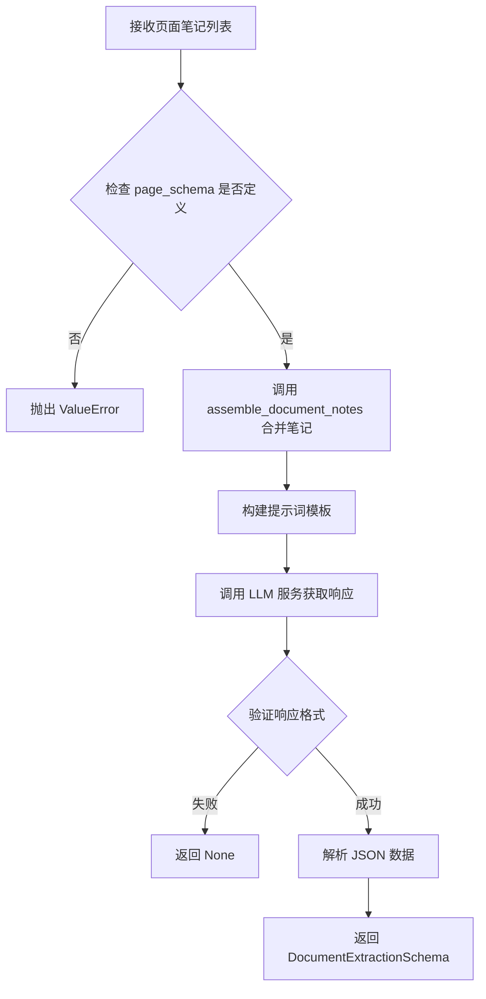
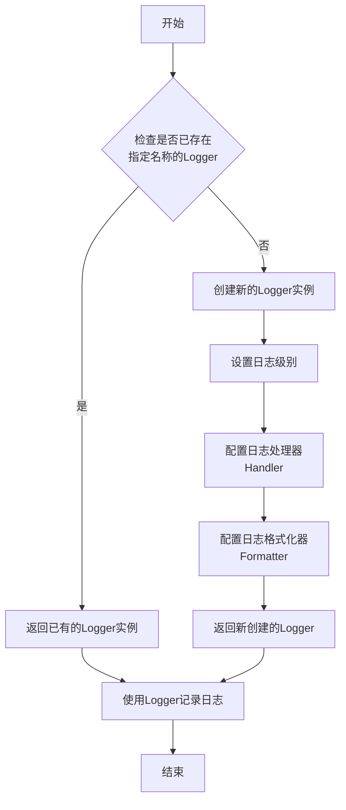
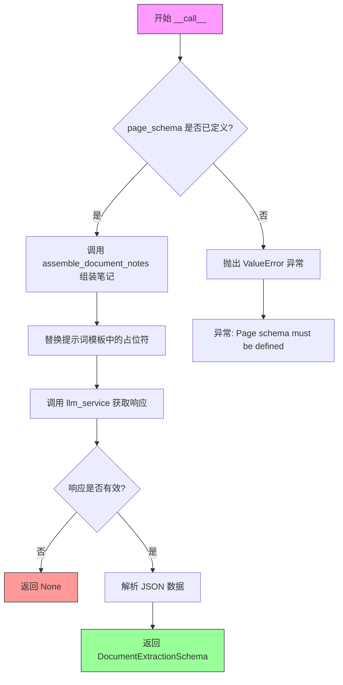

# `marker\marker\extractors\document.py` 详细设计文档

A document extraction component that combines data from multiple pages using an LLM service to extract structured JSON data based on a provided JSON schema, with detailed analysis and cross-page entity resolution.

## 整体流程



## 类结构

```
BaseExtractor (基类)
└── DocumentExtractor
    └── DocumentExtractionSchema (Pydantic 模型)
```

## 全局变量及字段


### `logger`
    
日志记录器，用于记录提取过程中的调试信息

类型：`Logger`
    


### `page_extraction_prompt`
    
用于指导语言模型从文档笔记中提取JSON数据的提示模板

类型：`str`
    


### `DocumentExtractionSchema.analysis`
    
分析文本，描述从文档中提取信息的过程和推理

类型：`str`
    


### `DocumentExtractionSchema.document_json`
    
提取的 JSON 格式的文档数据字符串

类型：`str`
    


### `DocumentExtractor.page_schema`
    
要从页面中提取的 JSON schema 定义

类型：`Annotated[str, description]`
    


### `DocumentExtractor.assemble_document_notes`
    
将多个页面的笔记合并为格式化字符串的方法

类型：`method`
    


### `DocumentExtractor.__call__`
    
主提取方法，接受页面笔记列表并返回文档提取结果

类型：`method`
    
    

## 全局函数及方法


### `get_logger`

获取一个配置好的日志记录器实例，用于在应用中记录不同级别的日志信息。

参数：

- （无参数）或 `name`：`str`（可选），日志记录器的名称，默认为根日志记录器

返回值：`logging.Logger`，返回配置好的日志记录器实例，可用于 debug、info、warning、error、critical 等日志记录操作

#### 流程图



#### 带注释源码

```python
# marker/logger.py

import logging
import sys
from typing import Optional


def get_logger(name: Optional[str] = None) -> logging.Logger:
    """
    获取或创建一个配置好的日志记录器实例。
    
    参数:
        name: 日志记录器的名称，通常使用 __name__ 来标识模块。
              如果为 None，则返回根日志记录器。
    
    返回值:
        配置好的 logging.Logger 实例
    """
    # 如果未指定名称，使用根日志记录器
    if name is None:
        logger = logging.getLogger()
    else:
        logger = logging.getLogger(name)
    
    # 避免重复配置（当多次调用 get_logger 时）
    if logger.handlers:
        return logger
    
    # 设置日志级别为 DEBUG（从代码中使用 logger.debug 可知）
    logger.setLevel(logging.DEBUG)
    
    # 创建控制台处理器
    console_handler = logging.StreamHandler(sys.stdout)
    console_handler.setLevel(logging.DEBUG)
    
    # 设置日志格式：时间戳 - 模块名 - 日志级别 - 消息
    formatter = logging.Formatter(
        '%(asctime)s - %(name)s - %(levelname)s - %(message)s',
        datefmt='%Y-%m-%d %H:%M:%S'
    )
    console_handler.setFormatter(formatter)
    
    # 将处理器添加到日志记录器
    logger.addHandler(console_handler)
    
    return logger
```

> **注意**：由于 `get_logger` 函数的实际实现位于 `marker/logger` 模块中（通过 `from marker.logger import get_logger` 导入），并未在当前代码文件中直接给出。以上源码是基于该函数在代码中的使用方式（`logger.debug(f"Document extraction response: {response}")`）和 Python logging 模块的标准模式推断的典型实现。


### `DocumentExtractor.assemble_document_notes`

该方法用于将多个页面的详细笔记合并成一个格式化的字符串，每个页面标记为"Page N"并附加其详细笔记内容。

参数：

-  `page_notes`：`List[PageExtractionSchema]`，页面提取模式列表，包含每个页面的提取结果

返回值：`str`，格式化合并后的页面笔记字符串

#### 流程图

```mermaid
flowchart TD
    A([开始]) --> B[初始化空字符串 notes]
    B --> C{遍历 page_notes}
    C -->|for i, page_schema in enumerate| D[检查 page_notes 是否为空]
    D -->|否| E[格式化页面编号和详细笔记<br/>notes += f"Page {i + 1}\n{page_schema.detailed_notes}\n\n"]
    D -->|是| F[继续下一次循环]
    E --> C
    C -->|遍历完成| G[去除首尾空白字符]
    G --> H([返回合并后的笔记字符串])
```

#### 带注释源码

```python
def assemble_document_notes(self, page_notes: List[PageExtractionSchema]) -> str:
    """
    将多个页面的提取笔记合并成一个格式化的字符串。
    
    参数:
        page_notes: 页面提取模式列表，每个元素包含该页面的详细笔记
        
    返回:
        格式化后的笔记字符串，每个页面标记为"Page N"
    """
    notes = ""  # 初始化空字符串用于累积笔记
    for i, page_schema in enumerate(page_notes):  # 遍历所有页面笔记
        if not page_notes:  # 检查列表是否为空（注意：此检查在循环内逻辑上有误）
            continue  # 如果为空则跳过
        # 格式化输出：页面编号 + 详细笔记
        notes += f"Page {i + 1}\n{page_schema.detailed_notes}\n\n"
    return notes.strip()  # 去除首尾空白字符后返回
```

---

#### 潜在技术债务与优化空间

1. **逻辑错误**：方法内的 `if not page_notes:` 检查位于循环内部，当执行到循环内部时 `page_notes` 必然不为空（否则不会进入循环），该检查无实际意义且可能造成混淆。正确的检查应为 `if not page_schema.detailed_notes:` 或类似逻辑。

2. **字符串拼接效率**：在循环中使用 `+=` 进行字符串拼接，当页面数量较多时会产生多个中间字符串对象，影响性能。建议使用 `io.StringIO` 或 `list` 收集后使用 `join()` 合并。

3. **缺少输入验证**：未对 `page_notes` 参数进行 `None` 检查，若传入 `None` 会导致异常。

4. **文档字符串不完整**：参数和返回值描述可更加详细，例如说明 `PageExtractionSchema` 的结构。


### `DocumentExtractor.__call__`

该方法是 `DocumentExtractor` 类的核心调用方法，负责整合所有页面的笔记数据，通过 LLM 服务根据预定义的 JSON Schema 提取结构化的文档信息。它首先验证页面模式是否已定义，然后组装页面笔记为提示词，调用 LLM 进行提取，最后解析并返回包含分析和 JSON 数据的文档模式，若提取失败则返回 `None`。

参数：

- `page_notes`：`List[PageExtractionSchema]`，所有页面的笔记数据
- `kwargs`：`**kwargs`，其他可选参数

返回值：`Optional[DocumentExtractionSchema]`，提取后的文档模式或 None

#### 流程图



#### 带注释源码

```python
def __call__(
    self,
    page_notes: List[PageExtractionSchema],
    **kwargs,
) -> Optional[DocumentExtractionSchema]:
    """
    执行文档级提取，整合所有页面的笔记数据并提取结构化信息。
    
    参数:
        page_notes: 包含所有页面笔记和提取结果的列表
        **kwargs: 其他可选参数
    
    返回:
        DocumentExtractionSchema 对象或 None（提取失败时）
    """
    # 验证 page_schema 是否已定义，这是结构化提取的前提条件
    if not self.page_schema:
        raise ValueError(
            "Page schema must be defined for structured extraction to work."
        )

    # 组装所有页面的详细笔记为一个完整的文档字符串
    prompt = self.page_extraction_prompt.replace(
        "{{document_notes}}", self.assemble_document_notes(page_notes)
    ).replace("{{schema}}", json.dumps(self.page_schema))
    
    # 调用 LLM 服务进行文档级提取，传入提示词和响应模式
    response = self.llm_service(prompt, None, None, DocumentExtractionSchema)

    # 记录调试日志，方便追踪提取结果
    logger.debug(f"Document extraction response: {response}")

    # 验证响应是否包含必需的字段（analysis 和 document_json）
    if not response or any(
        [
            key not in response
            for key in [
                "analysis",
                "document_json",
            ]
        ]
    ):
        return None

    # 清理 JSON 字符串，移除可能的 markdown 代码块标记
    json_data = response["document_json"].strip().lstrip("```json").rstrip("```")

    # 构建并返回最终的文档提取模式对象
    return DocumentExtractionSchema(
        analysis=response["analysis"], document_json=json_data
    )
```

## 关键组件


### DocumentExtractionSchema

基于Pydantic的响应模型，定义了文档提取输出的结构，包含analysis（分析文本）和document_json（提取的JSON数据字符串）两个字段，用于标准化LLM返回的提取结果。

### DocumentExtractor

核心文档提取器类，继承自BaseExtractor，负责协调多页面数据的整合与结构化提取。通过LLM分析跨页面的笔记内容，按照指定的JSON Schema提取完整信息。

### page_schema (类字段)

类型：Annotated[str, "The JSON schema to be extracted from the page."]

描述：存储要提取的JSON Schema，定义了需要从文档中提取的数据结构，支持单对象、数组、嵌套对象等复杂结构。

### page_extraction_prompt (类字段)

类型：str

描述：包含详细指令的LLM提示模板，定义了提取规则、多页处理策略、冲突解决方式和输出格式要求，使用占位符{{document_notes}}和{{schema}}动态插入内容。

### assemble_document_notes (类方法)

参数：page_notes: List[PageExtractionSchema] - 页面提取结果的列表

返回值：str - 格式化后的页面笔记字符串

描述：将多个PageExtractionSchema对象的detailed_notes字段组装成连续的文本，每个页面标记为"Page N"格式，便于LLM进行跨页面分析。

### __call__ (类方法)

参数：page_notes: List[PageExtractionSchema] - 页面笔记列表；**kwargs - 其他可选参数

返回值：Optional[DocumentExtractionSchema] - 提取结果或None

描述：主执行方法，验证schema存在性，组装提示词并调用LLM服务，解析响应返回结构化数据。包含响应格式验证和JSON清理逻辑。

### BaseExtractor (父类依赖)

描述：提供基础提取器功能的抽象基类，定义了llm_service等通用接口，是DocumentExtractor的继承基础。

### PageExtractionSchema (依赖类型)

描述：来自marker.extractors.page模块的Pydantic模型，用于存储单个页面的提取结果，包含detailed_notes字段记录详细笔记。

### llm_service (服务依赖)

描述：继承自BaseExtractor的LLM服务接口，用于调用大语言模型执行提示词并返回结构化响应。


## 问题及建议


### 已知问题

-   `assemble_document_notes` 方法中存在逻辑错误：使用 `if not page_notes:` 检查，但实际迭代的是 `page_schema`，应改为 `if not page_schema:`
-   JSON解析使用字符串操作（`lstrip`/`rstrip`）而非使用 `json.loads()`，不够健壮，可能因格式变化导致解析失败
-   字符串替换 `replace` 方式替换占位符不安全，如果 `self.page_schema` JSON中包含 `{{document_notes}}` 或 `{{schema}}` 字符串，会被意外替换
-   `self.llm_service` 调用没有异常处理，如果LLM服务调用失败会直接抛出异常向上传播
-   `page_extraction_prompt` 作为大型字符串常量硬编码在类中，不利于维护、国际化或动态调整
-   缺少对 `self.page_schema` 是否为有效JSON schema的验证
-   `DocumentExtractionSchema` 的 `document_json` 字段定义为 `str` 类型，但实际存储的是JSON字符串，调用方需要再次解析，增加复杂度

### 优化建议

-   修复 `assemble_document_notes` 方法的检查逻辑，或添加类型检查确保 `page_notes` 元素有效
-   使用 `json.loads()` 或 `json.loads(json_data)` 替代字符串操作解析JSON，增强错误处理
-   使用更安全的模板渲染方式（如 `str.format` 或专门的模板引擎）进行占位符替换，或使用正则表达式精确匹配
-   为 `self.llm_service` 调用添加 try-except 异常处理，捕获可能的网络错误、API错误等
-   将 `page_extraction_prompt` 抽取为外部配置文件或单独的常量类，提高可维护性
-   添加 `self.page_schema` 的预验证逻辑，确保其为有效的JSON schema
-   考虑将 `document_json` 字段类型改为 `dict`，在类内部处理序列化/反序列化，对外提供更友好的接口
-   增加错误日志记录（error/warning级别），记录提取失败的原因和上下文
-   考虑将LLM调用抽象为独立的策略类或接口，提高可测试性

## 其它


### 设计目标与约束

本代码的设计目标是从多页文档中提取结构化数据，通过LLM服务将分散在多个页面的信息整合到统一的JSON schema中。约束包括：必须提供有效的page_schema才能执行提取，依赖外部LLM服务返回特定格式的响应。

### 错误处理与异常设计

当page_schema未定义时抛出ValueError异常，提示"Page schema must be defined for structured extraction to work."。当LLM响应为空或缺少必需字段(analysis和document_json)时返回None。JSON解析过程中假设LLM返回的document_json是有效的JSON字符串，但未做额外的异常捕获。

### 数据流与状态机

数据流：输入List[PageExtractionSchema] -> assemble_document_notes拼接页面笔记 -> 替换prompt模板中的占位符 -> 调用llm_service获取响应 -> 验证响应格式 -> 解析document_json字段 -> 返回DocumentExtractionSchema对象。无复杂状态机，主要为线性处理流程。

### 外部依赖与接口契约

依赖：pydantic(BaseModel)、marker.extractors.BaseExtractor、marker.extractors.page.PageExtractionSchema、marker.logger.get_logger、json和typing模块。接口契约：__call__方法接收page_notes(List[PageExtractionSchema])和kwargs，返回Optional[DocumentExtractionSchema]。llm_service(prompt, None, None, DocumentExtractionSchema)的调用约定为：第一个参数是prompt，第二个和第三个参数为None，第四个参数是响应schema。

### 性能考虑

assemble_document_notes方法使用字符串拼接，在页面数量较多时可能存在性能问题，建议使用列表推导式和join方式优化。未实现缓存机制，每次调用都会重新调用LLM服务。

### 安全性考虑

prompt模板直接替换占位符，未对page_notes内容进行过滤，可能存在prompt注入风险。document_json字段直接返回原始字符串，未做额外的安全验证。

### 可扩展性

page_extraction_prompt定义为类属性，方便修改和扩展。继承自BaseExtractor，可通过重写方法实现自定义逻辑。DocumentExtractionSchema使用pydantic，易于扩展新的字段。

### 配置管理

page_schema定义为类字段，通过Annotated提供类型提示和描述。page_extraction_prompt为类属性，可通过继承或实例化时覆盖。

### 测试策略

建议添加单元测试：测试assemble_document_notes对空列表和单页的处理、测试__call__对无page_schema时的异常抛出、测试__call__对无效LLM响应的处理、测试JSON解析的边界情况。

### 监控与日志

使用marker.logger.get_logger获取logger实例，在__call__方法中记录debug级别日志，输出LLM响应内容。未记录业务指标或性能监控数据。

    