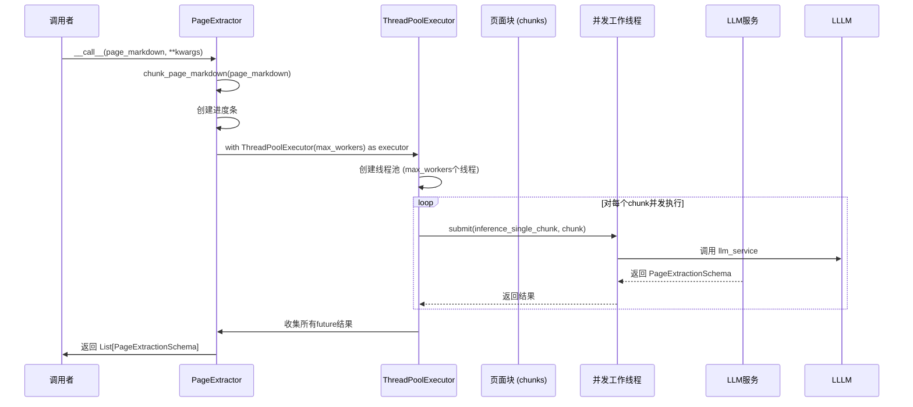
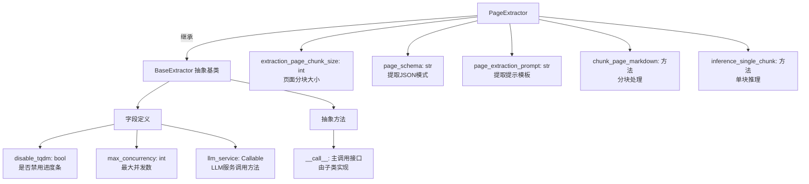
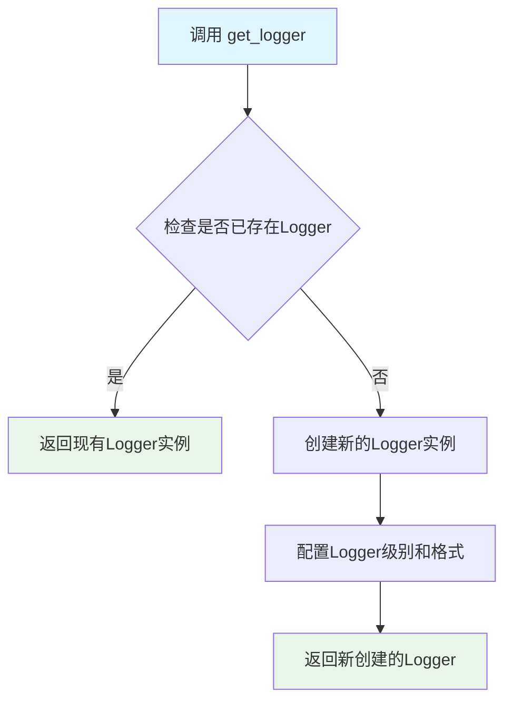
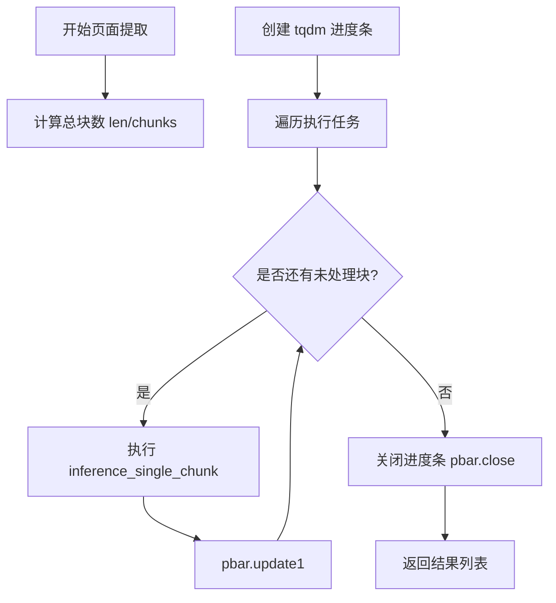
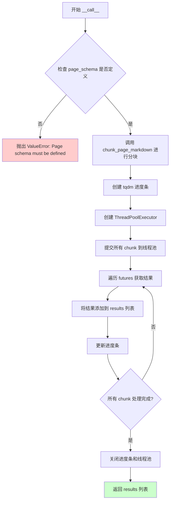

# `marker\marker\extractors\page.py` 详细设计文档

这是一个基于LLM的页面数据提取器,用于从文档页面中根据JSON Schema提取结构化数据。它将页面markdown分块处理,并使用线程池并发调用LLM服务进行提取,最终返回包含描述和详细笔记的提取结果。

## 整体流程

```mermaid
graph TD
    A[接收page_markdown列表] --> B{检查page_schema是否为空}
B -- 是 --> C[抛出ValueError异常]
B -- 否 --> D[调用chunk_page_markdown分块]
D --> E[创建ThreadPoolExecutor]
E --> F[并发提交inference_single_chunk任务]
F --> G{所有chunks处理完成?}
G -- 是 --> H[收集结果并返回List[PageExtractionSchema]]
G -- 否 --> I[更新进度条并继续等待]
H --> J[关闭线程池和进度条]
J --> K[结束]
```

## 类结构

```
BaseExtractor (基类)
└── PageExtractor (页面提取器)
```

## 全局变量及字段


### `logger`
    
全局日志记录器，用于记录提取过程中的调试和运行信息

类型：`Logger`
    


### `PageExtractionSchema.description`
    
提取内容的简短描述

类型：`str`
    


### `PageExtractionSchema.detailed_notes`
    
详细的提取笔记，包含从页面中提取的JSON片段和相关信息

类型：`str`
    


### `PageExtractor.extraction_page_chunk_size`
    
每次提取的页面块大小，默认值为3，用于控制分块处理的数量

类型：`Annotated[int, "The number of pages to chunk together for extraction."]`
    


### `PageExtractor.page_schema`
    
要提取的JSON Schema字符串，定义了从页面中提取数据的结构

类型：`Annotated[str, "The JSON schema to be extracted from the page."]`
    


### `PageExtractor.page_extraction_prompt`
    
LLM提取提示词模板，包含系统指令和输入输出的格式规范

类型：`str`
    
    

## 全局函数及方法


### `PageExtractor.inference_single_chunk`

该方法负责将页面 Markdown 内容与 JSON Schema 结合，通过构建提示词调用 LLM 服务进行单块内容推理并返回结构化的页面提取模式数据。JSON 在此方法中用于将 Python 对象序列化为 JSON 字符串，以替换提示模板中的占位符。

参数：

-  `self`：`PageExtractor`，当前实例
-  `page_markdown`：`str`，需要提取内容的单个页面 Markdown 文本块

返回值：`Optional[PageExtractionSchema]`（可选的 `PageExtractionSchema` 对象），若 LLM 响应有效且包含必需字段则返回结构化提取结果，否则返回 `None`

#### 流程图

```mermaid
flowchart TD
    A[开始 inference_single_chunk] --> B[构建提示词]
    B --> C[替换占位符 {{page_md}} 为页面内容]
    D[调用 json.dumps 序列化 page_schema] --> C
    C --> E[替换占位符 {{schema}} 为 JSON 字符串]
    E --> F[调用 LLM 服务推理]
    F --> G{响应有效?}
    G -->|否| H[返回 None]
    G -->|是| I{包含必需字段?}
    I -->|否| H
    I -->|是| J[构造 PageExtractionSchema 对象]
    J --> K[返回结果]
```

#### 带注释源码

```python
def inference_single_chunk(
    self, page_markdown: str
) -> Optional[PageExtractionSchema]:
    """
    对单个页面块进行推理提取。
    
    参数:
        page_markdown: 页面 Markdown 内容字符串
        
    返回:
        Optional[PageExtractionSchema]: 提取的结构化结果，失败返回 None
    """
    # 构建提示词模板，将页面 Markdown 内容填充到 {{page_md}} 占位符
    # 同时将 page_schema（Python 对象）序列化为 JSON 字符串填充到 {{schema}} 占位符
    # 这里使用 json.dumps 将 Pydantic BaseModel 或字典转换为 JSON 字符串供提示词使用
    prompt = self.page_extraction_prompt.replace(
        "{{page_md}}", page_markdown
    ).replace("{{schema}}", json.dumps(self.page_schema))
    
    # 调用 LLM 服务，传入提示词和期望的响应模式（PageExtractionSchema）
    response = self.llm_service(prompt, None, None, PageExtractionSchema)
    logger.debug(f"Page extraction response: {response}")

    # 验证响应是否存在且包含必需字段
    if not response or any(
        [
            key not in response
            for key in [
                "description",
                "detailed_notes",
            ]
        ]
    ):
        return None

    # 构造并返回结构化提取结果对象
    return PageExtractionSchema(
        description=response["description"],
        detailed_notes=response["detailed_notes"],
    )
```


### `PageExtractor.__call__` 中 ThreadPoolExecutor 的使用

在 `PageExtractor` 类的 `__call__` 方法中，使用了 `ThreadPoolExecutor` 来并发执行页面块的提取任务。

参数：

- 无（仅类实例方法，通过 `self` 访问类属性）

返回值：`List[PageExtractionSchema]`，返回从所有页面块提取的结构化数据列表

#### 流程图



#### 带注释源码

```python
def __call__(
    self,
    page_markdown: List[str],
    **kwargs,
) -> List[PageExtractionSchema]:
    """
    执行页面提取的主入口方法。
    使用 ThreadPoolExecutor 实现多线程并发处理页面块。
    """
    # 验证：确保已定义页面schema
    if not self.page_schema:
        raise ValueError(
            "Page schema must be defined for structured extraction to work."
        )

    # 步骤1：将页面markdown分割成多个块
    chunks = self.chunk_page_markdown(page_markdown)
    results = []
    
    # 步骤2：创建进度条
    pbar = tqdm(
        desc="Running page extraction",
        disable=self.disable_tqdm,
        total=len(chunks),
    )

    # 步骤3：使用 ThreadPoolExecutor 并发处理每个块
    # max_workers 控制最大并发线程数（来自类属性 max_concurrency）
    with ThreadPoolExecutor(max_workers=self.max_concurrency) as executor:
        # 提交所有任务到线程池
        for future in [
            executor.submit(self.inference_single_chunk, chunk) for chunk in chunks
        ]:
            # 阻塞等待每个任务完成并获取结果
            # 如果任何任务抛出异常，result() 会立即重新抛出该异常
            results.append(future.result())  # Raise exceptions if any occurred
            pbar.update(1)

    pbar.close()
    return results
```

---

### ThreadPoolExecutor 使用详解

| 属性 | 值 |
|------|-----|
| **来源** | `concurrent.futures.ThreadPoolExecutor` |
| **max_workers** | `self.max_concurrency`（类属性） |
| **用途** | 并发执行多个 `inference_single_chunk` 任务 |
| **上下文管理** | 使用 `with` 语句确保线程池正确关闭 |
| **异常处理** | `future.result()` 会传播子线程中的异常 |


### `BaseExtractor`

BaseExtractor是marker.extractors模块中的基础提取器抽象基类，为页面内容提取提供通用框架。它定义了提取器的核心接口，包括LLM服务调用配置、并发控制、进度条显示等通用能力，以及具体实现类需要遵循的契约。

参数：

-  `disable_tqdm`：`bool`，是否禁用tqdm进度条显示
-  `max_concurrency`：`int`，最大并发工作线程数
-  `llm_service`：`Callable`，LLM服务调用方法

返回值：`None`，BaseExtractor为抽象基类，不直接返回数据

#### 流程图



#### 带注释源码

```python
# marker/extractors/__init__.py 或类似位置

from abc import ABC, abstractmethod
from typing import Any, Callable, Optional
from pydantic import BaseModel


class BaseExtractor(ABC):
    """
    基础提取器抽象基类
    
    提供页面内容提取的通用框架，子类需实现具体的提取逻辑。
    该类定义了提取器所需的通用配置和能力，包括：
    - LLM服务调用能力
    - 并发控制
    - 进度条显示控制
    """
    
    # 类字段定义
    disable_tqdm: bool = False
    """是否禁用tqdm进度条，默认为False显示进度条"""
    
    max_concurrency: int = 10
    """最大并发工作线程数，用于控制并行处理的规模"""
    
    @property
    @abstractmethod
    def llm_service(self) -> Callable:
        """
        LLM服务调用方法
        
        该属性需要子类实现，提供调用大语言模型的能力。
        应支持prompt生成、模式验证和结构化输出。
        
        返回:
            Callable: 接受(prompt, image, page_num, output_schema)参数的调用对象
        """
        pass
    
    @abstractmethod
    def __call__(self, *args, **kwargs) -> Any:
        """
        主调用接口
        
        子类需要实现此方法以提供具体的提取功能。
        
        参数:
            *args: 位置参数，具体由子类定义
            **kwargs: 关键字参数，具体由子类定义
            
        返回:
            Any: 提取结果，具体类型由子类定义
        """
        pass
```


### `get_logger`

获取一个日志记录器实例，用于在应用程序中记录调试信息和运行状态。

参数： 无

返回值：`logging.Logger`，返回一个标准的 Python 日志记录器对象，用于输出日志信息。

#### 流程图



#### 带注释源码

```python
# 从 marker.logger 模块导入 get_logger 函数
from marker.logger import get_logger

# 获取日志记录器实例
# 返回值是一个具有 debug, info, warning, error 等方法的日志对象
logger = get_logger()

# 在代码中调用 debug 方法记录调试信息
logger.debug(f"Page extraction response: {response}")
```

#### 补充说明

根据代码中的使用方式推断，`get_logger` 函数的特征如下：

| 属性 | 说明 |
|------|------|
| **函数名** | `get_logger` |
| **模块** | `marker.logger` |
| **参数** | 无参数（从调用方式 `get_logger()` 推断） |
| **返回值类型** | `logging.Logger` 或类似日志对象 |
| **返回值描述** | 返回一个配置好的日志记录器，具有 `debug()`, `info()`, `warning()`, `error()` 等方法 |
| **调用位置** | `PageExtractor.inference_single_chunk` 方法中用于记录调试信息 |

> **注**：由于 `get_logger` 的实现源代码不在提供的代码段中，以上信息是基于其使用方式推断得出的。该函数通常返回一个模块级的单例 Logger 实例，用于整个应用程序的日志记录。


### `tqdm`

`tqdm`是一个第三方Python库，用于在循环中显示进度条。在该代码中，`tqdm`被用于在执行页面提取任务时显示处理进度，提供直观的用户体验。

参数：

- `desc`：`str`，进度条的描述文本，此处为"Running page extraction"
- `disable`：`bool`，是否禁用进度条显示，由`self.disable_tqdm`控制
- `total`：`int`，进度条的总步数，此处为待处理的页面块数量（`len(chunks)`）

返回值：`tqdm`返回一个`tqdm`对象，用于更新进度

#### 流程图



#### 带注释源码

```python
# 在 PageExtractor 类的 __call__ 方法中使用 tqdm
def __call__(
    self,
    page_markdown: List[str],
    **kwargs,
) -> List[PageExtractionSchema]:
    """
    执行页面提取的主方法
    """
    # ... 前面的代码省略 ...
    
    # 创建进度条对象
    # desc: 进度条左侧显示的描述文本
    # disable: 如果为 True，则不显示进度条（用于静默模式）
    # total: 进度条的总步数，等于要处理的页面块数量
    pbar = tqdm(
        desc="Running page extraction",    # 描述文本
        disable=self.disable_tqdm,          # 是否禁用进度条
        total=len(chunks),                  # 总迭代次数
    )

    # 使用线程池执行器并发处理多个页面块
    with ThreadPoolExecutor(max_workers=self.max_concurrency) as executor:
        # 提交所有任务到线程池
        for future in [
            executor.submit(self.inference_single_chunk, chunk) for chunk in chunks
        ]:
            # 等待每个任务完成并获取结果
            results.append(future.result())  # 如果有异常会在这里抛出
            pbar.update(1)  # 更新进度条一步

    # 关闭并清理进度条
    pbar.close()
    return results
```


### `PageExtractor.chunk_page_markdown`

将页面markdown列表按照指定的块大小进行分块处理，以便后续进行提取处理。

参数：

- `page_markdown`：`List[str]`，输入的页面markdown列表，每个元素代表一个页面的markdown内容

返回值：`List[str]`，分块后的markdown字符串列表，每个块由多个页面的markdown用双换行符连接组成

#### 流程图

```mermaid
flowchart TD
    A[开始 chunk_page_markdown] --> B{检查 page_markdown 长度}
    B -->|空列表| C[返回空列表]
    B -->|非空| D[初始化空列表 chunks]
    D --> E[设置索引 i = 0]
    E --> F{i 是否小于 page_markdown 长度}
    F -->|是| G[提取子块: page_markdown[i : i + chunk_size]
    G --> H[用双换行符连接子块并添加到 chunks]
    H --> I[更新索引 i = i + chunk_size]
    I --> F
    F -->|否| J[返回 chunks 列表]
    C --> J
```

#### 带注释源码

```python
def chunk_page_markdown(self, page_markdown: List[str]) -> List[str]:
    """
    Chunk the page markdown into smaller pieces for processing.
    
    该方法将一个页面markdown列表按照 extraction_page_chunk_size 
    的大小进行分块，每个块内的多个页面markdown使用双换行符连接起来。
    
    Args:
        page_markdown: 页面markdown列表，每个元素代表一个页面的markdown内容
        
    Returns:
        分块后的markdown字符串列表
    """
    
    # 初始化用于存储分块结果的列表
    chunks = []
    
    # 遍历页面markdown列表，步长为 extraction_page_chunk_size（默认为3）
    for i in range(0, len(page_markdown), self.extraction_page_chunk_size):
        # 提取当前块的页面markdown子列表
        chunk = page_markdown[i : i + self.extraction_page_chunk_size]
        
        # 将子列表中的多个页面markdown用双换行符连接成一个字符串
        chunks.append("\n\n".join(chunk))
    
    # 返回分块后的结果列表
    return chunks
```

#### 详细说明

| 属性 | 值 |
|------|-----|
| 方法所属类 | `PageExtractor` |
| 访问权限 | 公开实例方法 |
| 核心逻辑 | 按照 `extraction_page_chunk_size` 步长遍历输入列表，提取子列表并用 `"\n\n"` 连接 |
| 依赖属性 | `self.extraction_page_chunk_size` (默认为3) |
| 时间复杂度 | O(n)，其中 n 为 page_markdown 列表长度 |
| 空间复杂度 | O(n)，用于存储返回的分块列表 |


### `PageExtractor.inference_single_chunk`

对单个markdown块进行LLM推理提取，生成结构化的页面提取模式（PageExtractionSchema）。该方法将markdown内容与JSON schema填充到提示词模板中，调用LLM服务进行推理，并返回包含描述和详细笔记的结构化结果。

参数：

- `page_markdown`：`str`，单个markdown块的字符串内容，即待提取的页面markdown表示

返回值：`Optional[PageExtractionSchema]`，返回结构化的页面提取模式对象。如果LLM响应无效或缺少必要字段则返回`None`，否则返回包含`description`和`detailed_notes`字段的`PageExtractionSchema`实例。

#### 流程图

```mermaid
flowchart TD
    A[开始 inference_single_chunk] --> B[构建提示词]
    B --> C[替换提示词模板中的 {{page_md}} 为 page_markdown]
    C --> D[替换提示词模板中的 {{schema}} 为 JSON序列化的 page_schema]
    D --> E[调用 llm_service 执行推理]
    E --> F{响应是否有效?}
    F -->|否| G[记录调试日志并返回 None]
    F -->|是| H{响应包含 description 和 detailed_notes?}
    H -->|否| G
    H --> I[构建 PageExtractionSchema 对象]
    I --> J[返回 PageExtractionSchema 实例]
    G --> J
```

#### 带注释源码

```python
def inference_single_chunk(
    self, page_markdown: str
) -> Optional[PageExtractionSchema]:
    """
    对单个markdown块进行LLM推理提取，生成结构化的页面提取模式。
    
    参数:
        page_markdown: 单个markdown块的字符串内容
        
    返回:
        Optional[PageExtractionSchema]: 成功返回PageExtractionSchema对象，失败返回None
    """
    # 步骤1: 构建提示词 - 将markdown内容和schema填充到提示词模板中
    prompt = self.page_extraction_prompt.replace(
        "{{page_md}}", page_markdown  # 替换页面markdown占位符
    ).replace("{{schema}}", json.dumps(self.page_schema))  # 替换schema占位符为JSON字符串
    
    # 步骤2: 调用LLM服务进行推理，传入提示词和期望的响应模式
    response = self.llm_service(prompt, None, None, PageExtractionSchema)
    
    # 步骤3: 记录调试日志，便于排查问题
    logger.debug(f"Page extraction response: {response}")

    # 步骤4: 验证响应有效性 - 检查响应是否存在且包含必要字段
    if not response or any(
        [
            key not in response
            for key in [
                "description",      # 必须包含描述字段
                "detailed_notes",  # 必须包含详细笔记字段
            ]
        ]
    ):
        return None  # 响应无效时返回None

    # 步骤5: 构建并返回结构化的页面提取模式对象
    return PageExtractionSchema(
        description=response["description"],        # 从响应中提取描述
        detailed_notes=response["detailed_notes"],  # 从响应中提取详细笔记
    )
```


### `PageExtractor.__call__`

这是 `PageExtractor` 类的主入口方法，协调整个页面提取流程。该方法接收页面的 Markdown 表示列表，验证页面模式是否定义，将页面 Markdown 分块处理，使用 ThreadPoolExecutor 并发调用 LLM 服务进行单块推理，最终返回提取的 PageExtractionSchema 列表。

参数：

- `page_markdown`：`List[str]`，页面的 Markdown 表示列表
- `**kwargs`：其他可选参数，用于扩展

返回值：`List[PageExtractionSchema]`，包含从页面中提取的描述和详细笔记的模式列表

#### 流程图



#### 带注释源码

```python
def __call__(
    self,
    page_markdown: List[str],
    **kwargs,
) -> List[PageExtractionSchema]:
    """
    主入口方法，协调整个页面提取流程。
    
    参数:
        page_markdown: 页面的 Markdown 表示列表
        **kwargs: 其他可选参数
        
    返回:
        PageExtractionSchema 列表，包含从每个 chunk 提取的描述和详细笔记
    """
    
    # 第一步：验证 page_schema 是否已定义，这是结构化提取的前提
    if not self.page_schema:
        raise ValueError(
            "Page schema must be defined for structured extraction to work."
        )

    # 第二步：将页面 Markdown 分块，每块包含 extraction_page_chunk_size 数量的页面
    # 默认每3个页面组成一个 chunk，以便 LLM 更好地理解上下文
    chunks = self.chunk_page_markdown(page_markdown)
    
    # 初始化结果列表
    results = []
    
    # 创建 tqdm 进度条，用于显示提取进度
    pbar = tqdm(
        desc="Running page extraction",
        disable=self.disable_tqdm,
        total=len(chunks),
    )

    # 第三步：使用 ThreadPoolExecutor 并发处理每个 chunk
    # max_workers 限制并发数量，避免过度消耗资源
    with ThreadPoolExecutor(max_workers=self.max_concurrency) as executor:
        # 提交所有 chunk 到线程池进行推理
        for future in [
            executor.submit(self.inference_single_chunk, chunk) for chunk in chunks
        ]:
            # 获取单个 chunk 的推理结果
            # 如果有异常会在此处抛出
            results.append(future.result())  # Raise exceptions if any occurred
            pbar.update(1)

    # 关闭进度条
    pbar.close()
    
    # 返回提取结果列表
    return results
```

## 关键组件


### PageExtractionSchema

定义从页面提取的数据结构，包含description和detailed_notes两个字段，使用Pydantic BaseModel进行数据验证。

### PageExtractor

主提取器类，继承自BaseExtractor，负责从文档页面中提取结构化数据。支持页面markdown分块、并发处理和JSON schema验证。

### page_extraction_prompt

详细的提示词模板，指导LLM如何分析文档页面并按照JSON schema提取数据。包含分析步骤、指南和示例输出。

### chunk_page_markdown方法

将页面markdown列表按指定大小分块的方法，实现数据的索引分割，便于并行处理长文档。

### inference_single_chunk方法

对单个markdown分块进行推理的方法，调用LLM服务提取数据，返回PageExtractionSchema对象。

### __call__方法

主入口方法，协调整个提取流程。验证schema、分块处理、使用ThreadPoolExecutor实现惰性加载并发执行提取任务。

### ThreadPoolExecutor并发处理

使用线程池实现并发提取，通过max_workers控制并发数，提高处理效率。

### page_schema配置

定义要提取的JSON schema，支持单对象、数组、嵌套对象等复杂结构，实现量化策略。

### tqdm进度条

集成tqdm显示提取进度，支持disable_tqdm配置用于控制输出。

### BaseExtractor基类继承

继承marker.extractors.BaseExtractor，获取llm_service、max_concurrency等基础服务配置。

### ValueError异常处理

在page_schema为空时抛出明确的错误信息，确保使用前正确配置提取模式。


## 问题及建议


### 已知问题

- **异常处理不完善**: `future.result()` 会直接抛出子线程中的异常，导致整个提取流程中断，没有使用 `try-except` 包装来提供更友好的错误处理和部分结果返回
- **响应类型假设不安全**: `self.llm_service` 的返回值类型未明确，代码假设它返回字典并直接用 `key in response` 检查，若返回其他类型会导致运行时错误
- **Prompt注入风险**: `self.page_extraction_prompt.replace()` 简单替换 `{{page_md}}` 和 `{{schema}}`，如果输入内容包含这些模板字符串会导致意外行为
- **资源泄露风险**: `tqdm` 进度条在 `with ThreadPoolExecutor` 外部创建，`pbar.close()` 在 `with` 块外部手动调用，如果中间发生异常可能导致进度条未正确关闭
- **线程池配置不透明**: `max_workers` 完全依赖父类 `BaseExtractor` 的默认值，没有显式设置上限，可能导致资源耗尽
- **结果顺序依赖实现细节**: 使用列表推导式提交任务并按提交顺序追加结果，线程执行顺序不确定时可能产生隐藏的顺序依赖问题
- **分块大小硬编码**: `extraction_page_chunk_size=3` 作为类属性无法根据实际页面大小动态调整

### 优化建议

- 使用 `concurrent.futures.as_completed` 替代阻塞的 `future.result()`，并为每个分块添加异常捕获，返回成功结果同时记录失败项
- 在调用 `self.llm_service` 前添加类型检查，或使用 Pydantic 模型直接验证响应结构而非手动字典检查
- 对用户输入的 markdown 和 schema 进行转义处理，或使用更安全的模板填充方式（如 `str.format` 或专门的模板引擎）
- 将 `tqdm` 进度条放入 `ThreadPoolExecutor` 的 `with` 块内，确保资源在块结束时自动释放
- 添加 `max_workers` 参数的显式校验，设置合理的默认上限（如 `min(max_workers, len(chunks))`）
- 考虑使用 `functools.partial` 保留分块索引，结果按原始顺序组装或在结果中包含索引字段
- 将 `extraction_page_chunk_size` 改为可配置的构造函数参数，根据文档类型和 LLM 上下文窗口动态调整

## 其它


### 设计目标与约束

**设计目标**：实现一个基于大语言模型的文档页面数据提取工具，通过将多页markdown文档分块处理，调用LLM服务从每个块中提取符合预定义JSON schema的结构化数据。

**核心约束**：
- 必须提供有效的page_schema才能执行提取操作
- 使用ThreadPoolExecutor实现多线程并发处理，默认max_concurrency由基类定义
- 每个chunk包含的页面数由extraction_page_chunk_size控制，默认为3页
- 依赖外部llm_service进行实际的语言模型推理
- 返回结果为PageExtractionSchema列表，可能包含None值（当推理失败时）

### 错误处理与异常设计

**异常类型**：
- `ValueError`：当page_schema为空字符串时在__call__方法中抛出，要求必须定义schema
- `Exception`：在ThreadPoolExecutor的future.result()调用时，如果worker线程中的inference_single_chunk抛出异常，该异常会被传播到主线程
- `KeyError`：inference_single_chunk方法中访问response字典时，如果缺少description或detailed_notes键，可能引发KeyError（但被隐式捕获返回None）

**错误处理策略**：
- 使用try-except捕获future.result()的异常，确保一个chunk的处理失败不会导致整个提取流程中断
- 当response为空或缺少必需字段时，返回None而不是抛出异常
- 使用logger.debug记录推理结果用于调试

### 数据流与状态机

**数据流转过程**：
1. 输入：page_markdown（List[str]）—— 原始页面markdown列表
2. 分块：chunk_page_markdown() 将页面列表按extraction_page_chunk_size分块，输出List[str]
3. 并发处理：使用ThreadPoolExecutor并发调用inference_single_chunk处理每个chunk
4. 推理：inference_single_chunk() 构造prompt，调用llm_service获取LLM响应
5. 解析：解析LLM返回的JSON为PageExtractionSchema对象
6. 输出：返回List[PageExtractionSchema]，可能包含None元素

**状态说明**：
- 初始态：接收未处理的markdown列表
- 处理中：通过tqdm显示进度
- 完成态：返回结果列表

### 外部依赖与接口契约

**外部依赖**：
- `marker.extractors.BaseExtractor`：基类，提供llm_service、max_concurrency、disable_tqdm等属性
- `marker.logger.get_logger`：日志记录器获取函数
- `pydantic.BaseModel`：数据验证和序列化基类
- `concurrent.futures.ThreadPoolExecutor`：并发执行框架
- `tqdm`：进度条显示库

**接口契约**：
- `llm_service(prompt, arg2, arg3, response_model)`：必须接受4个参数，返回符合response_model的结构化数据或字典
- `BaseExtractor`：子类必须继承此类以获取必要的配置属性
- 输入page_markdown必须为非空列表，否则chunks为空列表，循环不执行直接返回空结果

### 性能考量与资源消耗

**并发模型**：使用ThreadPoolExecutor，worker数量由max_concurrency控制（非本类定义，继承自BaseExtractor）

**资源消耗点**：
- 每个chunk的LLM调用可能产生较高的计算资源和API调用成本
- ThreadPoolExecutor创建线程有上下文切换开销
- tqdm进度条在disable_tqdm为True时仍会创建但被禁用

**优化空间**：可考虑使用asyncio替代线程池，或添加重试机制处理临时性LLM调用失败

### 安全与合规考量

**输入验证**：
- page_schema仅检查非空，未验证是否为有效的JSON schema
- page_markdown直接传入prompt，未进行恶意内容过滤
- LLM返回的description和detailed_notes未做长度限制或内容审查

**数据泄露风险**：如果page_markdown包含敏感信息，在构造prompt时可能被记录到日志（logger.debug输出response）

### 配置与扩展性

**可配置项**：
- extraction_page_chunk_size：控制每批次处理的页面数，影响内存使用和LLM调用粒度
- page_schema：用户定义的JSON schema，决定提取数据的结构
- page_extraction_prompt：提示词模板，可继承后自定义

**扩展方式**：
- 继承PageExtractor并重写inference_single_chunk方法以定制推理逻辑
- 修改page_extraction_prompt以适应不同的提取场景
- 添加后处理逻辑在__call__方法中对结果进行清洗或聚合


    