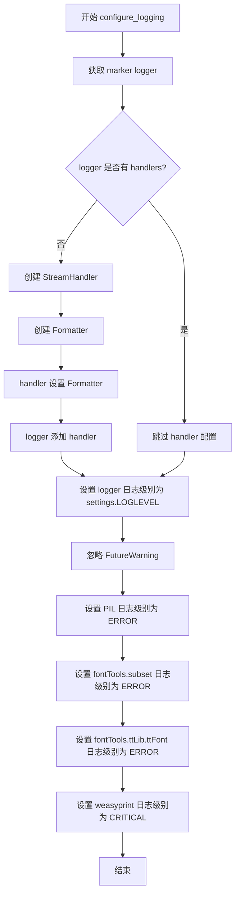
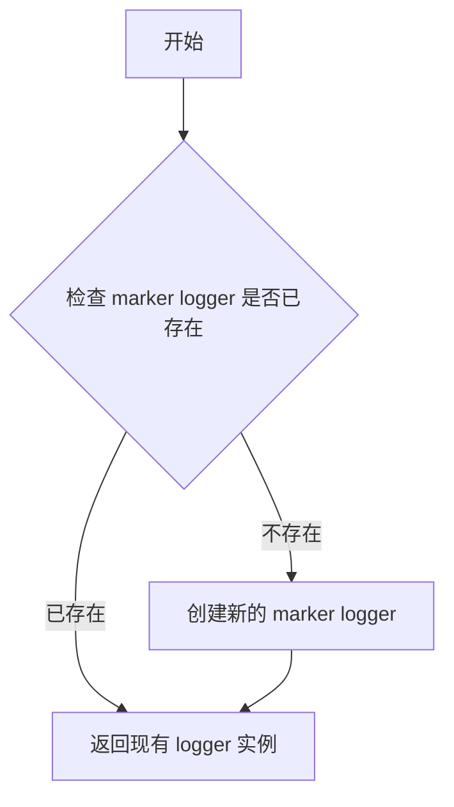

# `marker\marker\logger.py` 详细设计文档

该文件负责配置marker项目的日志系统，包括设置主日志记录器的格式和级别，抑制第三方库（PIL、fontTools、weasyprint）的警告输出，并提供一个获取marker专用logger的全局函数。

## 整体流程

```mermaid
graph TD
    A[开始] --> B[调用 configure_logging()]
    B --> C[调用 get_logger() 获取marker logger]
    C --> D{logger是否有handlers?}
    D -- 否 --> E[创建StreamHandler]
    D -- 是 --> F[跳过handler设置]
    E --> G[设置formatter]
    G --> H[添加handler到logger]
    H --> I[设置logger的level为settings.LOGLEVEL]
    I --> J[忽略FutureWarning]
    J --> K[设置PIL日志级别为ERROR]
    K --> L[设置fontTools.subset日志级别为ERROR]
    L --> M[设置fontTools.ttLib.ttFont日志级别为ERROR]
    M --> N[设置weasyprint日志级别为CRITICAL]
    N --> O[结束]
F --> I
```

## 类结构

```
模块: logging_config (无类定义)
```

## 全局变量及字段


### `settings`
    
从marker.settings导入的配置对象，用于获取日志级别等设置

类型：`module or object`
    


### `configure_logging`
    
配置marker项目的日志系统，设置日志格式、级别和各组件的日志级别

类型：`function`
    


### `get_logger`
    
获取名为'marker'的logger实例，用于项目日志记录

类型：`function`
    


    

## 全局函数及方法


### `configure_logging`

配置marker项目的日志系统，设置日志格式、日志级别，并抑制第三方库（PIL、fontTools、weasyprint）的不必要警告信息。

参数：

- （无参数）

返回值：`None`，无返回值，仅执行日志配置操作

#### 流程图



#### 带注释源码

```
# 导入标准库
import logging
import warnings

# 导入项目配置
from marker.settings import settings


def configure_logging():
    """
    配置 marker 项目的日志系统
    - 创建并设置 logger
    - 设置日志级别
    - 抑制第三方库的警告信息
    """
    # 获取 marker 专用的 logger 实例
    logger = get_logger()

    # 检查 logger 是否已配置过 handler
    if not logger.handlers:
        # 创建标准输出流 handler
        handler = logging.StreamHandler()
        
        # 创建日志格式化器，包含时间、日志级别、logger名称和消息
        formatter = logging.Formatter(
            "%(asctime)s [%(levelname)s] %(name)s: %(message)s"
        )
        # 为 handler 设置格式化器
        handler.setFormatter(formatter)
        # 将 handler 添加到 logger
        logger.addHandler(handler)

    # 从设置中读取日志级别并应用
    logger.setLevel(settings.LOGLEVEL)

    # 忽略所有 FutureWarning 类型的警告，避免冗余警告输出
    warnings.simplefilter(action="ignore", category=FutureWarning)

    # 设置第三方库的日志级别为较高级别，减少日志噪音
    logging.getLogger("PIL").setLevel(logging.ERROR)
    logging.getLogger("fontTools.subset").setLevel(logging.ERROR)
    logging.getLogger("fontTools.ttLib.ttFont").setLevel(logging.ERROR)
    logging.getLogger("weasyprint").setLevel(logging.CRITICAL)


def get_logger():
    """
    获取 marker 项目的 logger 实例
    
    返回:
        logging.Logger: marker 专用的 logger 对象
    """
    return logging.getLogger("marker")
```


### `get_logger`

获取 marker 项目的日志记录器实例，用于记录程序运行过程中的日志信息。

参数： 无

返回值：`logging.Logger`，返回名为 "marker" 的日志记录器实例

#### 流程图



#### 带注释源码

```python
def get_logger():
    """
    获取 marker 项目的日志记录器实例。
    
    该函数内部调用 logging.getLogger() 获取或创建一个名为 "marker" 的 logger。
    logging 模块内部会维护一个 logger 缓存，相同名称的 logger 只会创建一次，
    后续调用会返回同一个实例（单例模式）。
    
    Returns:
        logging.Logger: 名为 "marker" 的日志记录器实例，可用于记录日志信息
    """
    return logging.getLogger("marker")
```

## 关键组件


### configure_logging

日志配置函数，初始化marker项目的日志系统，包括设置日志处理器、格式化器、日志级别，并抑制PIL、fontTools和weasyprint等第三方库的日志输出。

### get_logger

日志获取函数，返回名为"marker"的logger实例，用于在项目中记录日志信息。

### 日志级别管理

通过settings.LOGLEVEL动态设置主日志级别，并根据不同组件（PIL、fontTools.subset、fontTools.ttLib.ttFont、weasyprint）分别配置差异化日志级别，实现精细化日志控制。

### 警告过滤机制

使用warnings.simplefilter忽略FutureWarning类型警告，避免因Python版本兼容性导致的警告信息干扰核心输出。


## 问题及建议


### 已知问题

-   **重复配置风险**：`configure_logging()` 函数没有防止重复调用的机制，虽然检查了 `logger.handlers`，但在某些边缘情况下（如logger被重置）可能被多次调用，导致handler重复添加
-   **硬编码配置**：日志配置完全硬编码，包括日志格式、级别和第三方库设置，缺乏灵活性，无法通过配置文件或环境变量动态调整
-   **全局警告过滤副作用**：`warnings.simplefilter(action="ignore", category=FutureWarning)` 会全局影响整个应用的所有FutureWarning，可能隐藏重要的迁移信息
-   **缺少日志轮转机制**：仅配置了 `StreamHandler`，没有使用 `RotatingFileHandler` 或 `TimedRotatingFileHandler`，在长期运行环境中可能导致日志文件过大或磁盘空间问题
-   **缺乏错误处理**：`configure_logging()` 函数没有任何异常处理机制，如果日志配置失败（例如权限问题），程序将继续运行但可能处于不一致状态
-   **第三方库日志配置缺乏隔离**：对 PIL、fontTools、weasyprint 的日志级别修改混在主配置函数中，降低了代码可维护性和可测试性

### 优化建议

-   **添加配置重复调用防护**：使用装饰器或单例模式确保 `configure_logging()` 仅执行一次，或添加调用标志防止重复执行
-   **支持配置化**：从 `settings` 对象或环境变量读取日志配置，实现日志级别、格式和输出目标的动态配置
-   **精细化警告管理**：考虑使用 `warnings.filterwarnings` 针对特定模块或消息过滤，而非全局忽略 FutureWarning，或提供配置选项控制此行为
-   **增加日志轮转支持**：根据应用场景添加文件日志 handler，使用 `RotatingFileHandler` 或 `TimedRotatingFileHandler` 管理日志文件大小和保留周期
-   **添加异常处理**：在日志配置关键步骤添加 try-except 块，记录配置失败但允许应用继续运行（降级到默认配置）
-   **模块化日志配置**：将第三方库的日志配置提取为独立函数，提高代码内聚性和可测试性
-   **添加日志刷新机制**：在配置完成后调用 `logger.handlers[0].flush()` 确保日志立即输出（如果需要）

## 其它


### 设计目标与约束

**设计目标**：
- 为marker项目提供统一的日志配置管理
- 控制项目自身及第三方库(PIL, fontTools, weasyprint)的日志输出级别
- 抑制Python FutureWarning警告以避免干扰用户

**设计约束**：
- 依赖Python标准库logging和warnings模块
- 日志级别由settings.LOGLEVEL配置决定
- 必须在项目启动早期调用，以确保日志配置生效

### 错误处理与异常设计

**异常处理机制**：
- 本模块未显式抛出自定义异常
- logging.getLogger()和handler配置失败时会抛出Python内置异常
- settings.LOGLEVEL不存在时可能导致AttributeError

**错误传播方式**：
- 异常直接向上层调用者传播
- 调用者应在项目初始化阶段捕获可能的配置错误

### 外部依赖与接口契约

**外部依赖**：
- `logging` (Python标准库) - 日志系统
- `warnings` (Python标准库) - 警告控制
- `marker.settings.settings` - 配置对象，需包含LOGLEVEL属性

**接口契约**：
- `configure_logging()`: 无参数，无返回值，调用后日志系统即生效
- `get_logger()`: 无参数，返回logging.Logger实例

### 关键组件信息

**logger组件**：
- 名称：marker logger
- 描述：项目专用Logger实例，名称为"marker"，用于项目所有模块的日志输出

**handler组件**：
- 名称：StreamHandler
- 描述：日志处理器，将日志输出到stderr

**formatter组件**：
- 名称：日志格式化器
- 描述：格式为"%(asctime)s [%(levelname)s] %(name)s: %(message)s"

### 潜在的技术债务或优化空间

1. **硬编码的第三方库日志级别**：PIL、fontTools、weasyprint的日志级别硬编码，建议移至配置文件
2. **缺少日志文件输出**：当前仅输出到Stream，建议增加文件Handler配置选项
3. **无重入保护**：configure_logging()虽检查handler存在性，但多次调用仍有副作用
4. **日志轮转缺失**：生产环境建议添加RotatingFileHandler
5. **配置验证不足**：未验证settings.LOGLEVEL是否为有效日志级别


    