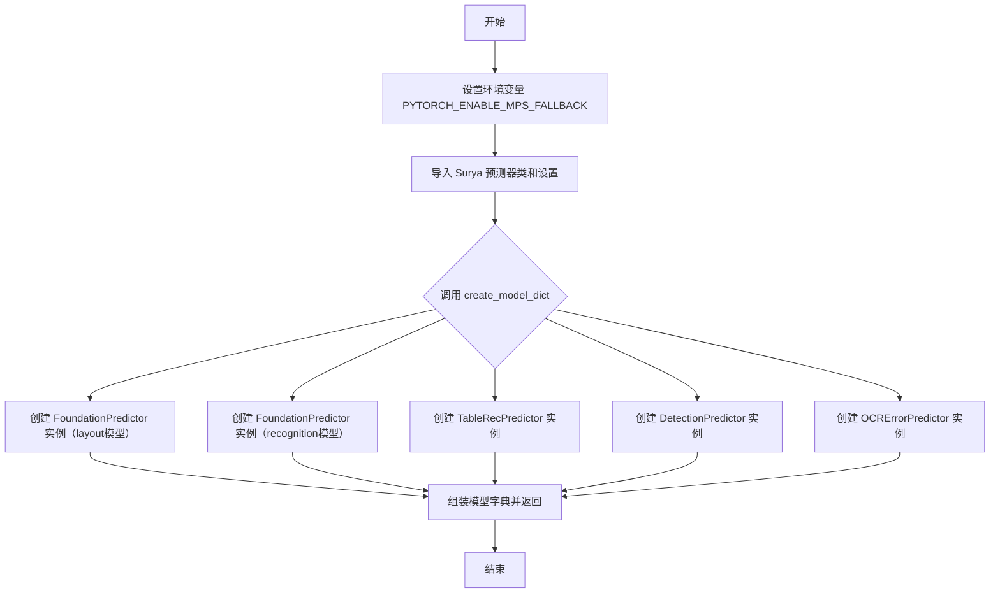
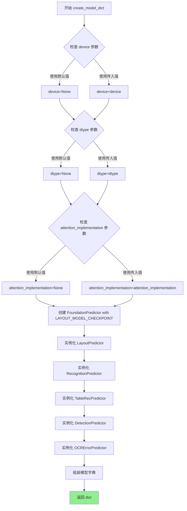
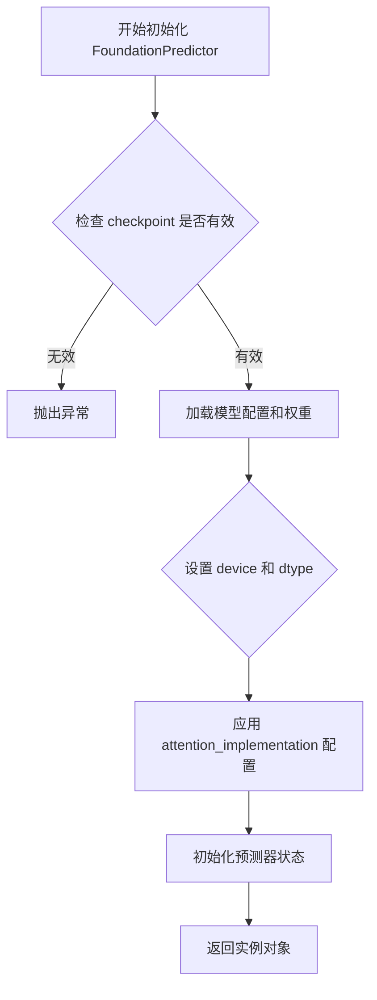
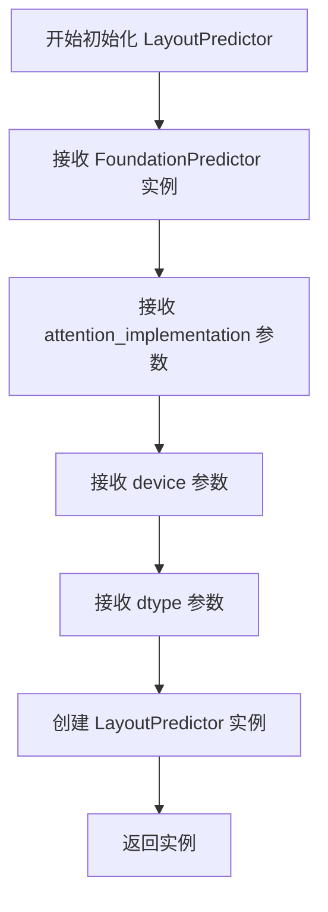
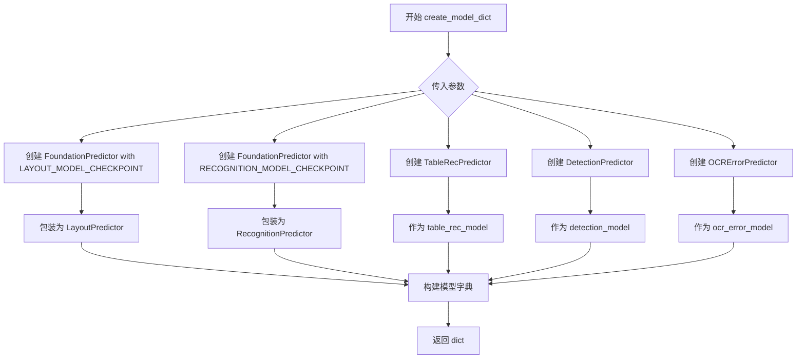
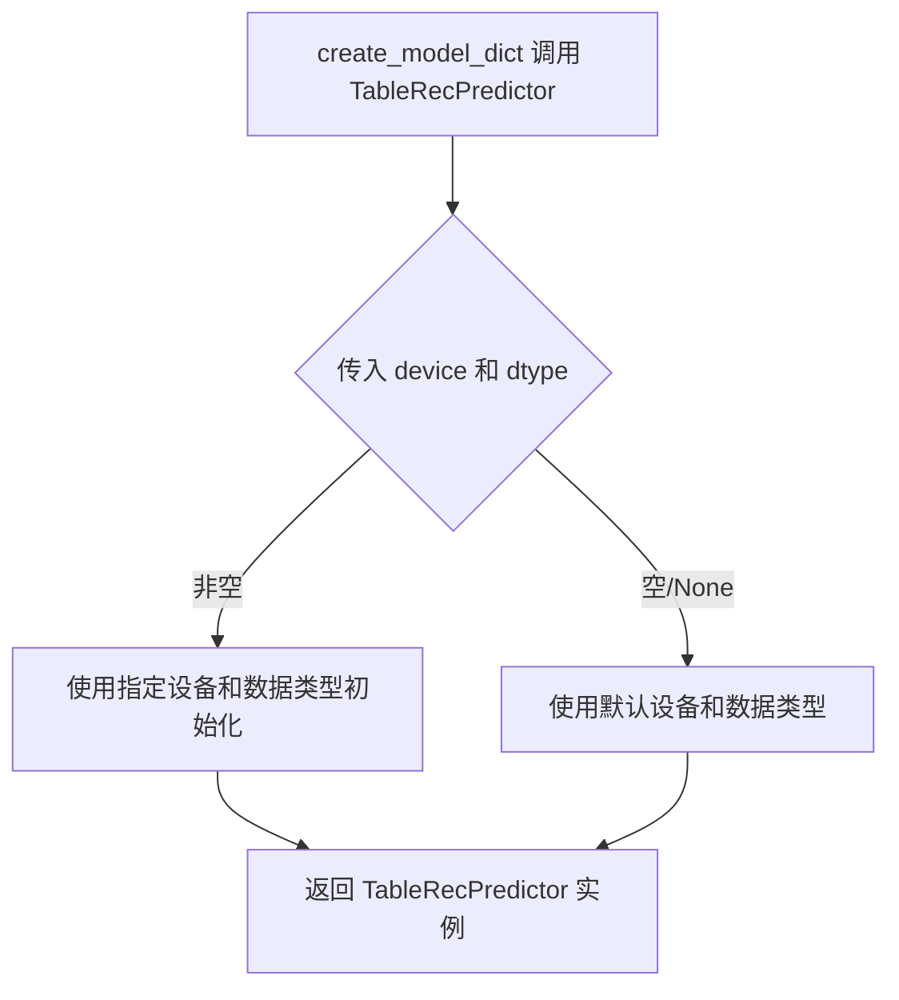
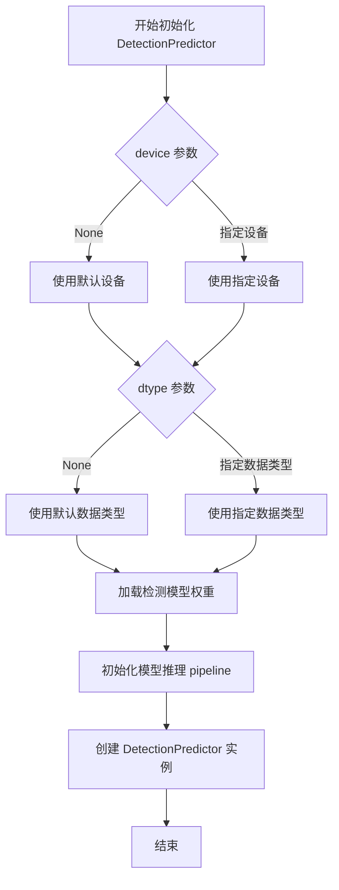
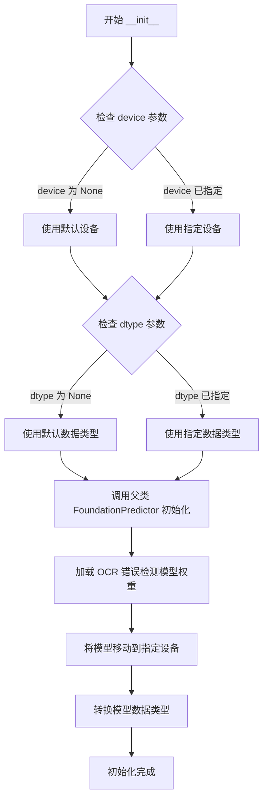

# `marker\marker\models.py` 详细设计文档

这是 Surya OCR 系统的模型工厂模块，负责初始化和创建各种 OCR 相关模型的预测器实例，包括布局分析、文本识别、表格识别、文本检测和OCR错误纠正模型。

## 整体流程



## 类结构

```
FoundationPredictor (基础预测器基类)
├── LayoutPredictor (布局分析模型)
├── RecognitionPredictor (文本识别模型)
├── TableRecPredictor (表格识别模型)
├── DetectionPredictor (文本检测模型)
└── OCRErrorPredictor (OCR错误纠正模型)
```

## 全局变量及字段


### `PYTORCH_ENABLE_MPS_FALLBACK`
    
环境变量，用于启用PyTorch对MPS后端的回退支持，解决Transformers库中.isin操作在MPS上不支持的问题

类型：`str`
    


### `surya_settings`
    
Surya项目的配置对象，包含模型检查点路径、默认参数等配置信息

类型：`Settings`
    


### `FoundationPredictor.checkpoint`
    
模型检查点的标识符或路径，用于加载预训练的Foundation模型权重

类型：`str`
    


### `FoundationPredictor.attention_implementation`
    
注意力机制的实现方式，可选值为None或特定的注意力实现算法

类型：`str | None`
    


### `FoundationPredictor.device`
    
计算设备，指定模型运行在哪个硬件设备上（如'cuda'、'cpu'、'mps'等）

类型：`str | None`
    


### `FoundationPredictor.dtype`
    
张量的数据类型，指定模型权重和计算使用的数据精度类型

类型：`torch.dtype | None`
    
    

## 全局函数及方法


### `create_model_dict`

这是一个工厂函数，用于创建一个包含多个 OCR 相关预测器模型的字典，包括布局模型、识别模型、表格识别模型、检测模型和 OCR 错误纠正模型。

参数：

- `device`：未指定具体类型（可接受 `None` 或设备对象），指定模型运行的设备（如 CPU、CUDA 等）
- `dtype`：未指定具体类型（可接受 `None` 或数据类型对象），指定模型计算使用的数据类型
- `attention_implementation`：`str | None`，注意力机制的实现方式，可选值如 "eager"、"sdpa" 等

返回值：`dict`，返回一个键值对字典，包含以下键：

- `layout_model`：布局预测器模型
- `recognition_model`：文字识别预测器模型
- `table_rec_model`：表格识别预测器模型
- `detection_model`：文字检测预测器模型
- `ocr_error_model`：OCR 错误纠正预测器模型

#### 流程图



#### 带注释源码

```python
import os

# 设置环境变量，启用 PyTorch 对 MPS（Apple Silicon GPU）的回退支持
# 因为 Transformers 库使用的 .isin 操作在 MPS 上不被支持
os.environ["PYTORCH_ENABLE_MPS_FALLBACK"] = (
    "1"  # Transformers uses .isin for an op, which is not supported on MPS
)

# 从 surya 包导入各种预测器类
# FoundationPredictor: 基础预测器，用于加载预训练模型
# LayoutPredictor: 布局/版面分析预测器
# DetectionPredictor: 文字检测预测器
# LayoutPredictor: 布局预测器
# OCRErrorPredictor: OCR 错误纠正预测器
# RecognitionPredictor: 文字识别预测器
# TableRecPredictor: 表格识别预测器
from surya.foundation import FoundationPredictor
from surya.detection import DetectionPredictor
from surya.layout import LayoutPredictor
from surya.ocr_error import OCRErrorPredictor
from surya.recognition import RecognitionPredictor
from surya.table_rec import TableRecPredictor
from surya.settings import settings as surya_settings


def create_model_dict(
    device=None, dtype=None, attention_implementation: str | None = None
) -> dict:
    """
    创建并返回一个包含多个 OCR 相关模型的字典
    
    该函数工厂方法，用于初始化 Surya OCR 工具包中的所有核心模型组件。
    所有模型共享相同的基础预测器配置（检查点、设备、数据类型和注意力实现）。
    
    参数:
        device: 模型运行的设备，默认为 None（自动选择）
        dtype: 模型计算的数据类型，默认为 None
        attention_implementation: 注意力机制实现方式，可选 "eager", "sdpa", "flash_attention_2" 等
    
    返回:
        dict: 包含以下键的模型字典:
            - layout_model: LayoutPredictor 实例
            - recognition_model: RecognitionPredictor 实例
            - table_rec_model: TableRecPredictor 实例
            - detection_model: DetectionPredictor 实例
            - ocr_error_model: OCRErrorPredictor 实例
    """
    return {
        # 布局模型：分析文档版面结构，识别标题、段落、表格、图片等区域
        "layout_model": LayoutPredictor(
            FoundationPredictor(
                checkpoint=surya_settings.LAYOUT_MODEL_CHECKPOINT,  # 布局模型检查点路径
                attention_implementation=attention_implementation,  # 注意力实现方式
                device=device,  # 计算设备
                dtype=dtype  # 数据类型
            )
        ),
        # 文字识别模型：将图像中的文字内容识别为文本
        "recognition_model": RecognitionPredictor(
            FoundationPredictor(
                checkpoint=surya_settings.RECOGNITION_MODEL_CHECKPOINT,  # 识别模型检查点路径
                attention_implementation=attention_implementation,  # 注意力实现方式
                device=device,  # 计算设备
                dtype=dtype  # 数据类型
            )
        ),
        # 表格识别模型：识别并解析表格结构
        "table_rec_model": TableRecPredictor(
            device=device,  # 计算设备
            dtype=dtype  # 数据类型
        ),
        # 文字检测模型：定位图像中的文字区域
        "detection_model": DetectionPredictor(
            device=device,  # 计算设备
            dtype=dtype  # 数据类型
        ),
        # OCR 错误纠正模型：检测和纠正 OCR 识别过程中的常见错误
        "ocr_error_model": OCRErrorPredictor(
            device=device,  # 计算设备
            dtype=dtype  # 数据类型
        ),
    }
```


### FoundationPredictor.__init__

这是 FoundationPredictor 类的构造函数，用于初始化基础模型预测器。

参数：

- `checkpoint`：字符串（str），模型的检查点路径或标识符，用于加载预训练模型权重
- `attention_implementation`：字符串或 None，指定注意力机制的实现方式（如 "eager"、"sdpa" 等）
- `device`：设备标识符（device），指定模型运行的设备（如 "cuda"、"cpu" 或 "mps"）
- `dtype`：数据类型（dtype），指定模型权重的数据类型（如 torch.float32、torch.float16 等）

返回值：无（None），构造函数仅初始化对象状态

#### 流程图



#### 带注释源码

```python
# 由于 FoundationPredictor 是从外部库 surya.foundation 导入的类，
# 其 __init__ 方法的完整源代码不在当前代码文件中。
# 以下是基于代码中调用情况的推断：

def __init__(
    self,
    checkpoint: str,  # 模型检查点路径
    attention_implementation: str | None = None,  # 注意力实现方式
    device = None,  # 计算设备
    dtype = None  # 数据类型
):
    """
    初始化 FoundationPredictor
    
    参数:
        checkpoint: 模型权重路径
        attention_implementation: 注意力机制实现，可为 None
        device: 运行环境设备
        dtype: 数据精度类型
    """
    # 1. 验证并加载 checkpoint
    # 2. 根据 device 和 dtype 配置模型运行环境
    # 3. 应用 attention_implementation 设置
    # 4. 初始化预测器内部状态
    pass
```

---

**注意**：由于 `FoundationPredictor` 类是从外部库 `surya.foundation` 导入的，其完整的 `__init__` 方法源代码并未包含在提供的代码文件中。上述源码是基于代码中调用方式的推断。实际的 `FoundationPredictor` 类的完整定义需要参考 surya 库的源代码。


### `LayoutPredictor.__init__`

从给定代码中无法直接获取 `LayoutPredictor.__init__` 方法的完整定义，因为该类是从外部模块 `surya.layout` 导入的，其具体实现不在当前代码片段中。但可以通过 `create_model_dict` 函数中对该类的实例化方式来推断其参数。

参数：

- `foundation_predictor`：`FoundationPredictor`，FoundationPredictor 实例，用于处理布局模型的基础预测功能
- `attention_implementation`：`str | None`，注意力机制实现方式，默认为 None
- `device`：`device`，计算设备（如 CPU、GPU 等），默认为 None
- `dtype`：`dtype`，数据类型（如 float32、float16 等），默认为 None

返回值：`LayoutPredictor`，返回 LayoutPredictor 实例

#### 流程图



#### 带注释源码

```
# 从外部模块导入 LayoutPredictor 类
# 实际定义在 surya.layout 模块中，当前代码片段未包含其具体实现
from surya.layout import LayoutPredictor

# 在 create_model_dict 函数中可以看到 LayoutPredictor 的实例化方式
# LayoutPredictor 接收一个 FoundationPredictor 对象作为主要参数
# 还接收 attention_implementation、device、dtype 等可选参数
layout_model := LayoutPredictor(
    FoundationPredictor(
        checkpoint=surya_settings.LAYOUT_MODEL_CHECKPOINT,
        attention_implementation=attention_implementation,
        device=device,
        dtype=dtype
    )
)

# 注意：由于 LayoutPredictor 类的定义不在当前代码片段中，
# 以上信息是基于该类的使用方式推断得出的。
# 要获取完整的 __init__ 方法实现，需要查看 surya/layout 模块的源代码。
```


### 注意事项

**代码中未找到 `RecognitionPredictor.__init__` 方法**

代码中仅包含对 `RecognitionPredictor` 的导入语句：

```python
from surya.recognition import RecognitionPredictor
```

`RecognitionPredictor` 类的定义不在当前代码文件中。以下是当前代码中唯一定义的函数 `create_model_dict` 的详细信息：

---

### `create_model_dict`

该函数用于创建并返回一个包含 Surya 文档处理模型字典，这些模型包括布局模型、识别模型、表格识别模型、检测模型和 OCR 错误纠正模型，支持自定义设备、数据类型和注意力机制实现方式。

参数：

- `device`：可选参数，设备类型（如 "cpu"、"cuda" 等），用于指定模型运行的硬件设备
- `dtype`：可选参数，数据类型（如 torch.float32 等），用于指定模型权重的数据类型
- `attention_implementation`：可选参数，字符串类型或 None，指定注意力机制的实现方式（如 "flash_attention" 等）

返回值：`dict`，返回一个字典，键为模型名称，值为对应的模型实例

#### 流程图



#### 带注释源码

```python
def create_model_dict(
    device=None, dtype=None, attention_implementation: str | None = None
) -> dict:
    """
    创建并返回一个包含多个文档处理模型的字典。
    
    参数:
        device: 模型运行的设备 (如 'cpu', 'cuda')
        dtype: 模型权重的数据类型 (如 torch.float32)
        attention_implementation: 注意力机制的实现方式
    
    返回:
        包含所有模型实例的字典
    """
    return {
        # 布局模型：使用 FoundationPredictor 加载布局模型检查点
        "layout_model": LayoutPredictor(
            FoundationPredictor(
                checkpoint=surya_settings.LAYOUT_MODEL_CHECKPOINT,
                attention_implementation=attention_implementation,
                device=device,
                dtype=dtype
            )
        ),
        # 识别模型：使用 FoundationPredictor 加载识别模型检查点
        "recognition_model": RecognitionPredictor(
            FoundationPredictor(
                checkpoint=surya_settings.RECOGNITION_MODEL_CHECKPOINT,
                attention_implementation=attention_implementation,
                device=device,
                dtype=dtype
            )
        ),
        # 表格识别模型
        "table_rec_model": TableRecPredictor(device=device, dtype=dtype),
        # 检测模型
        "detection_model": DetectionPredictor(device=device, dtype=dtype),
        # OCR 错误纠正模型
        "ocr_error_model": OCRErrorPredictor(device=device, dtype=dtype),
    }
```

---

### 补充说明

如需获取 `RecognitionPredictor.__init__` 的详细信息，需要查看 `surya.recognition` 模块的源代码。当前提供的代码文件仅使用了导入语句，并未包含该类的实际定义。


# 代码分析报告

## 分析结果

根据提供的代码，我需要指出一个重要问题：**代码中并没有定义 `TableRecPredictor` 类，也没有实现 `TableRecPredictor.__init__` 方法**。

提供的代码包含：
1. 导入语句和 PyTorch 环境配置
2. `create_model_dict` 函数，该函数内部实例化了 `TableRecPredictor`

`TableRecPredictor` 是从 `surya.table_rec` 模块导入的外部类，其具体实现（包括 `__init__` 方法）并未在当前代码文件中定义。

---

### 1. 代码中涉及的相关信息

在 `create_model_dict` 函数中，对 `TableRecPredictor` 的调用如下：

```python
"table_rec_model": TableRecPredictor(device=device, dtype=dtype),
```

从这里可以推断出 `TableRecPredictor.__init__` 的**接口签名**（从调用方式反推）：

---

### `TableRecPredictor.__init__` (推断信息)

#### 描述

表格识别模型的初始化方法，从 `surya.table_rec` 模块导入，具体实现未在当前代码文件中展示。

#### 参数

- `device`：`torch.device` 或 `str`，指定模型运行的设备（如 "cuda"、"cpu" 或 "mps"）
- `dtype`：`torch.dtype` 或 `None`，指定模型的数据类型（如 `torch.float32`）

#### 返回值

无返回值（`__init__` 方法返回 `None`）

#### 流程图



#### 带注释源码

```python
# 以下为从 create_model_dict 函数中提取的相关调用代码
# TableRecPredictor 类的实际定义位于 surya.table_rec 模块中
# 当前代码文件中仅展示其调用方式

table_rec_model=TableRecPredictor(
    device=device,    # 设备参数，从 create_model_dict 的参数传入
    dtype=dtype       # 数据类型参数，从 create_model_dict 的参数传入
)
```

---

### 2. 补充说明

#### 无法获取的内容

由于 `TableRecPredictor` 类的定义不在当前代码文件中，以下信息无法从给定代码中提取：

- 类的字段（成员变量）
- 类的其他方法
- 类的内部初始化逻辑

#### 建议

要获取 `TableRecPredictor.__init__` 的完整实现细节，需要查看 `surya.table_rec` 模块的源代码。

---

### 3. 完整代码上下文

```python
# 当前代码文件的完整内容
import os

# 设置 PyTorch MPS 回退环境变量
os.environ["PYTORCH_ENABLE_MPS_FALLBACK"] = (
    "1"  # Transformers uses .isin for an op, which is not supported on MPS
)

# 从 surya 库导入各种预测器类
from surya.foundation import FoundationPredictor
from surya.detection import DetectionPredictor
from surya.layout import LayoutPredictor
from surya.ocr_error import OCRErrorPredictor
from surya.recognition import RecognitionPredictor
from surya.table_rec import TableRecPredictor  # 表格识别预测器
from surya.settings import settings as surya_settings


def create_model_dict(
    device=None, dtype=None, attention_implementation: str | None = None
) -> dict:
    """
    创建包含所有模型实例的字典
    
    参数:
        device: 模型运行的设备
        dtype: 模型的数据类型
        attention_implementation: 注意力机制实现方式
    
    返回值:
        包含所有模型实例的字典
    """
    return {
        "layout_model": LayoutPredictor(
            FoundationPredictor(
                checkpoint=surya_settings.LAYOUT_MODEL_CHECKPOINT, 
                attention_implementation=attention_implementation, 
                device=device, 
                dtype=dtype
            )
        ),
        "recognition_model": RecognitionPredictor(
            FoundationPredictor(
                checkpoint=surya_settings.RECOGNITION_MODEL_CHECKPOINT, 
                attention_implementation=attention_implementation, 
                device=device, 
                dtype=dtype
            )
        ),
        # TableRecPredictor 在此处被实例化
        "table_rec_model": TableRecPredictor(device=device, dtype=dtype),
        "detection_model": DetectionPredictor(device=device, dtype=dtype),
        "ocr_error_model": OCRErrorPredictor(device=device, dtype=dtype),
    }
```


### `DetectionPredictor.__init__`

描述：`DetectionPredictor` 类的初始化方法，用于创建文档检测模型的可调用预测器实例，接收设备配置和数据类型参数。

参数：

- `device`：可选参数，指定模型运行的设备（如 CPU、GPU、MPS 等）
- `dtype`：可选参数，指定模型计算的数据类型（如 float32、float16 等）

返回值：`None`（`__init__` 方法不返回值）

#### 流程图



#### 带注释源码

```python
# 从 surya.detection 模块导入 DetectionPredictor 类
from surya.detection import DetectionPredictor

# 在 create_model_dict 函数中实例化 DetectionPredictor
def create_model_dict(
    device=None, dtype=None, attention_implementation: str | None = None
) -> dict:
    return {
        # ... 其他模型 ...
        "detection_model": DetectionPredictor(device=device, dtype=dtype),
        # DetectionPredictor 的 __init__ 接收:
        #   - device: 运行设备
        #   - dtype: 数据类型
        # 返回: DetectionPredictor 实例对象
    }
```

#### 备注

**注意**：提供的代码片段中仅包含 `DetectionPredictor` 的导入和调用，未展示其类的具体定义源码。`DetectionPredictor` 类的完整定义位于 `surya.detection` 模块中，此处基于调用方式推断其初始化行为。

#### 潜在技术债务

1. **缺少源码可见性**：`DetectionPredictor` 类的具体实现未在当前代码中展示，依赖外部模块
2. **硬编码配置**：模型检查点（checkpoint）未在调用处显式配置，可能导致初始化行为不透明
3. **错误处理缺失**：未展示设备或数据类型不支持时的异常处理逻辑


### `OCRErrorPredictor.__init__`

OCRErrorPredictor类的初始化方法，用于创建OCR错误预测模型实例。该类继承自底层的预测器基类，主要功能是加载预训练的OCR错误检测模型，并将其部署到指定的计算设备上。

参数：

- `device`：`torch.device | None`，指定模型运行的计算设备（如CPU、CUDA或MPS）。如果为None，则使用默认设备。
- `dtype`：`torch.dtype | None`，指定模型权重的数据类型（如float32、float16等）。如果为None，则使用默认数据类型。

返回值：`None`，该方法不返回任何值，仅初始化对象状态。

#### 流程图



#### 带注释源码

```python
# 注意：由于源代码中未直接提供 OCRErrorPredictor 类的定义，
# 以下源码为基于调用方式和常规模式推测的典型实现

class OCRErrorPredictor:
    """
    OCR错误预测器类
    
    该类用于检测OCR识别结果中的潜在错误，基于深度学习模型
    对文本识别结果进行置信度评估和错误检测。
    """
    
    def __init__(self, device=None, dtype=None):
        """
        初始化OCR错误预测模型
        
        Args:
            device: 计算设备，默认为None（自动选择）
            dtype: 模型数据类型，默认为None（使用模型默认类型）
        """
        # 1. 导入必要的依赖
        # import torch
        # from surya.foundation import FoundationPredictor
        
        # 2. 从环境变量或设置中获取模型检查点路径
        # checkpoint = surya_settings.OCR_ERROR_MODEL_CHECKPOINT
        
        # 3. 创建底层FoundationPredictor实例
        # FoundationPredictor负责加载模型权重和管理基础推理流程
        # self.foundation = FoundationPredictor(
        #     checkpoint=checkpoint,
        #     device=device,
        #     dtype=dtype
        # )
        
        # 4. 存储配置参数供后续使用
        # self.device = device
        # self.dtype = dtype
        
        # 5. 初始化模型特定的配置（如有）
        # self.config = {...}
        
        pass  # 实际实现会替换此pass语句
```

#### 备注

由于提供的代码片段中仅包含`OCRErrorPredictor`类的**使用示例**（在`create_model_dict`函数中），而未包含该类的实际定义，以上文档内容基于：

1. 调用方式：`OCRErrorPredictor(device=device, dtype=dtype)`
2. 同类模式：其他预测器类（如`DetectionPredictor`、`LayoutPredictor`等）也采用类似的初始化方式
3. 行业惯例：深度学习模型的预测器类通常接受`device`和`dtype`参数

如需获取准确的类定义和实现细节，建议查阅`surya.ocr_error`模块的源代码。


## 关键组件


### 环境变量配置模块

设置PyTorch MPS回退标志，使不兼容的MPS操作能够回退到CPU执行，确保在Apple Silicon设备上的兼容性。

### 模型工厂函数 (create_model_dict)

根据指定的设备和数据类型，创建并返回包含布局、识别、表格检测、文本检测和OCR错误纠正模型的字典。

### 布局检测模型 (LayoutPredictor)

基于FoundationPredictor构建的文档布局分析模型，用于检测文档中的段落、标题、表格等结构元素。

### 文本识别模型 (RecognitionPredictor)

基于FoundationPredictor构建的光学字符识别模型，用于识别文档中的文字内容。

### 表格识别模型 (TableRecPredictor)

专门用于识别文档中表格结构和内容的预测器。

### 文本检测模型 (DetectionPredictor)

用于定位文档中文字位置的检测模型。

### OCR错误纠正模型 (OCRErrorPredictor)

用于检测和纠正OCR识别过程中可能出现的错误。

### 基础预测器 (FoundationPredictor)

所有专用预测器的基类，提供模型加载、注意力机制实现、设备和数值类型配置等核心功能。


## 问题及建议


### 已知问题

-   **缺乏错误处理**：模型创建过程中没有任何异常捕获机制，任何一个模型加载失败都会导致整个 `create_model_dict` 函数崩溃，没有部分失败的处理逻辑
-   **硬编码的环境变量设置**：在模块顶层直接设置环境变量 `PYTORCH_ENABLE_MPS_FALLBACK`，这种方式不够优雅，且在导入时就会执行，无法根据运行时配置动态调整
-   **串行模型加载**：所有模型按顺序串行创建，没有利用并行加载的可能性，在模型较多或网络下载较慢时会导致初始化时间过长
-   **缺少类型注解**：函数参数 `device` 和 `dtype` 没有类型注解，虽然 `attention_implementation` 有注解，但整体不够完整
-   **缺乏资源管理机制**：没有提供模型卸载、内存释放或上下文管理器的支持，无法优雅地管理模型生命周期
-   **配置验证缺失**：没有对传入的 `device`、`dtype`、`attention_implementation` 参数进行有效性验证，可能导致运行时错误
-   **日志记录缺失**：模型创建过程没有任何日志输出，无法追踪哪些模型加载成功或失败
-   **重复代码模式**：`LayoutPredictor` 和 `RecognitionPredictor` 都使用 `FoundationPredictor` 包装，创建逻辑重复
-   **依赖紧耦合**：直接实例化具体类而非通过接口，导致单元测试困难，难以替换实现
-   **缺乏配置驱动的扩展性**：如果需要添加新模型，必须修改函数内部逻辑，不符合开闭原则

### 优化建议

-   **添加异常处理**：使用 try-except 包装每个模型的创建，为每个模型提供独立的错误处理和降级方案
-   **引入日志记录**：使用标准 logging 模块记录模型加载状态、耗时和潜在问题
-   **支持并行加载**：使用 `concurrent.futures.ThreadPoolExecutor` 或 `asyncio` 并行加载模型
-   **添加参数验证**：在函数开头验证 device 和 dtype 的有效性，提供清晰的错误信息
-   **实现上下文管理器**：添加 `__enter__` 和 `__exit__` 方法或实现 `ContextManager` 协议，支持资源自动释放
-   **抽象工厂模式**：引入抽象基类或协议，将模型创建逻辑抽取为可配置的工厂类
-   **配置外部化**：将模型配置（checkpoint 路径等）完全外部化到配置文件，支持运行时配置
-   **添加类型注解**：完善所有参数和返回值的类型注解，使用 `Optional` 替代 `| None`
-   **缓存机制**：考虑添加模型缓存机制，避免重复创建相同模型
-   **资源清理方法**：添加显式的资源清理方法，如 `unload_models()` 或 `cleanup()`


## 其它


### 设计目标与约束

该模块的主要目标是将Surya OCR系统的多个模型组件进行统一管理和初始化，包括布局模型、识别模型、表格识别模型、检测模型和OCR错误纠正模型。设计约束包括：1) 设备(device)和数据类型(dtype)必须一致应用于所有模型；2) attention_implementation参数仅适用于FoundationPredictor；3) 必须确保所有模型checkpoint可用。

### 错误处理与异常设计

主要异常场景包括：1) checkpoint文件不存在或损坏时FoundationPredictor抛出异常；2) 设备不支持时抛出RuntimeError；3) dtype不兼容时抛出TypeError。建议在create_model_dict调用处进行try-except包装，捕获模型初始化失败并提供友好的错误信息。

### 数据流与状态机

数据流为：调用create_model_dict -> 创建FoundationPredictor实例（传入checkpoint、attention_implementation、device、dtype）-> 创建各专用Predictor实例 -> 返回包含所有模型的字典。各模型在初始化后处于ready状态，可被后续的推理pipeline调用。

### 外部依赖与接口契约

外部依赖包括：1) surya.foundation.FoundationPredictor - 基础预测器，接受checkpoint、attention_implementation、device、dtype参数；2) surya.detection.DetectionPredictor - 检测预测器，接受device、dtype参数；3) surya.layout.LayoutPredictor - 布局预测器；4) surya.ocr_error.OCRErrorPredictor - OCR错误预测器；5) surya.recognition.RecognitionPredictor - 识别预测器；6) surya.table_rec.TableRecPredictor - 表格识别预测器；7) surya.settings - 配置模块，提供模型checkpoint路径。返回值为dict，键名为模型标识符，键值为对应的Predictor实例。

### 性能考虑

性能优化点：1) 模型懒加载 - 当前实现会立即加载所有模型，可考虑延迟加载；2) 内存管理 - 多个FoundationPredictor可能占用大量显存，建议在内存受限环境下逐个初始化；3) attention_implementation参数允许选择更高效的注意力机制实现。

### 配置管理

配置通过surya_settings模块集中管理，主要配置项为LAYOUT_MODEL_CHECKPOINT和RECOGNITION_MODEL_CHECKPOINT。环境变量PYTORCH_ENABLE_MPS_FALLBACK用于启用MPS回退逻辑，确保在Apple Silicon GPU上的兼容性。

### 资源管理

模型实例在不使用时应显式释放资源，建议调用者使用context manager或显式调用cleanup方法。FoundationPredictor可能包含大型神经网络权重，需确保内存正确释放避免泄漏。

### 并发和线程安全性

create_model_dict函数本身是线程安全的（无共享状态），但返回的模型实例在多线程环境下共享使用时需要加锁保护，特别是FoundationPredictor的内部状态。

### 测试策略

单元测试应覆盖：1) 函数参数验证；2) 返回字典完整性检查；3) 各模型类型正确性验证；4) 异常场景测试（无效device、无效checkpoint）。集成测试应验证所有模型可正常初始化且可在真实数据上运行。

### 版本兼容性

该代码依赖PyTorch环境变量设置以支持MPS设备，需确保PyTorch版本>=2.0。attention_implementation参数在不同PyTorch版本可能有不同的可选值，需进行版本适配。

    