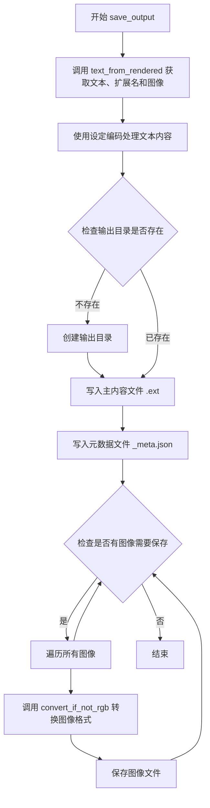

# `marker\marker\output.py` 详细设计文档

该文件是 marker 渲染器的工具模块，提供了处理和转换各种输出格式（Markdown、HTML、JSON）的实用函数，包括文本提取、HTML 处理、图像转换和文件保存等功能。

## 整体流程

```mermaid
graph TD
    A[开始] --> B[调用 text_from_rendered]
    B --> C{判断渲染类型}
    C -->|MarkdownOutput| D[返回 markdown, 'md', images]
    C -->|HTMLOutput| E[返回 html, 'html', images]
    C -->|JSONOutput| F[返回 model_dump_json, 'json', {}]
    C -->|ChunkOutput| G[返回 model_dump_json, 'json', {}]
    C -->|OCRJSONOutput| H[返回 model_dump_json, 'json', {}]
    C -->|ExtractionOutput| I[返回 document_json, 'json', {}]
    C -->|其他| J[抛出 ValueError]
    D --> K[编码文本]
    E --> K
    F --> K
    G --> K
    H --> K
    I --> K
    K --> L[保存文本文件]
    L --> M[保存元数据 JSON]
    M --> N{遍历 images}
    N -->|每个 image| O[转换为 RGB]
    O --> P[保存图像文件]
    P --> Q[结束]
```

## 类结构

```
无类定义 (纯工具函数模块)
```

## 全局变量及字段


### `json`
    
Python内置的JSON编解码模块，用于序列化和解序列化数据

类型：`module`
    


### `os`
    
Python内置的操作系统接口模块，提供文件系统和进程操作功能

类型：`module`
    


### `BeautifulSoup`
    
BeautifulSoup解析器类，用于解析HTML和XML文档

类型：`class`
    


### `Tag`
    
BeautifulSoup中的标签对象类，表示HTML/XML文档中的单个标签元素

类型：`class`
    


### `BaseModel`
    
Pydantic库的基础模型类，用于数据验证和设置管理

类型：`class`
    


### `Image`
    
PIL库的核心图像类，用于打开、处理和保存图像文件

类型：`class`
    


### `ExtractionOutput`
    
标记提取输出类，用于存储文档内容提取的结果数据

类型：`class`
    


### `HTMLOutput`
    
HTML渲染输出类，用于封装HTML格式的渲染结果

类型：`class`
    


### `JSONOutput`
    
JSON输出类，用于封装JSON格式的渲染结果

类型：`class`
    


### `JSONBlockOutput`
    
JSON块输出类，用于表示JSON结构中的嵌套块数据

类型：`class`
    


### `MarkdownOutput`
    
Markdown输出类，用于封装Markdown格式的渲染结果

类型：`class`
    


### `OCRJSONOutput`
    
OCR JSON输出类，用于封装光学字符识别生成的JSON结果

类型：`class`
    


### `BlockOutput`
    
块输出基类，用于定义文档中各种内容块的输出结构

类型：`class`
    


### `settings`
    
标记工具的配置对象，包含输出编码、图像格式等全局设置

类型：`object`
    


    

## 全局函数及方法


### `unwrap_outer_tag`

该函数接收一个HTML字符串作为输入，使用BeautifulSoup解析后，检查该HTML是否仅包含一个`<p>`标签。如果满足条件，则解包该`<p>`标签（即移除标签但保留其内部内容），最终返回处理后的HTML字符串。此函数常用于清理和规范化HTML输出。

参数：

- `html`：`str`，需要处理的原始HTML字符串

返回值：`str`，处理后的HTML字符串

#### 流程图

```mermaid
flowchart TD
    A[开始] --> B[使用html.parser解析HTML为BeautifulSoup对象]
    B --> C[获取soup.contents并转换为列表]
    C --> D{contents长度是否为1?}
    D -->|否| H[直接进入下一步]
    D -->|是| E{第一个元素是否为Tag且name为'p'?}
    E -->|否| H
    E -->|是| F[执行soup.p.unwrap解包p标签]
    F --> G[返回str(soup)]
    H --> G
    G --> I[结束]
    
    style F fill:#f9f,stroke:#333,stroke-width:2px
    style G fill:#9f9,stroke:#333,stroke-width:2px
```

#### 带注释源码

```python
def unwrap_outer_tag(html: str):
    """
    解包HTML中最外层的<p>标签
    
    该函数用于处理那些被不必要的<p>标签包裹的HTML内容。
    当HTML只有一个子元素且该子元素是<p>标签时，移除<p>标签
    但保留其内部内容，使HTML结构更加扁平化。
    
    Args:
        html: str，需要处理的HTML字符串
        
    Returns:
        str，处理后的HTML字符串
    """
    # 使用html.parser解析器将HTML字符串解析为BeautifulSoup对象
    soup = BeautifulSoup(html, "html.parser")
    
    # 获取soup的全部直接子内容并转换为列表
    # contents属性返回的是直接子节点列表，包括标签和字符串
    contents = list(soup.contents)
    
    # 检查是否满足解包条件：
    # 1. 只有一个直接子元素
    # 2. 该元素是Tag类型（而非NavigableString等）
    # 3. 该Tag的名称为"p"
    if len(contents) == 1 and isinstance(contents[0], Tag) and contents[0].name == "p":
        # 解包p标签：移除<p>标签本身，但保留其内部内容
        # 执行后<p>标签被替换为其子内容
        soup.p.unwrap()

    # 将处理后的BeautifulSoup对象转换回字符串并返回
    return str(soup)
```


### `json_to_html`

这是一个递归转换函数，用于将 JSON 块输出结构转换为完整的 HTML 字符串。该函数通过处理嵌套的 children 块，将子块的 HTML 替换到父块中的 `content-ref` 引用位置，最终生成完整的 HTML 表示。

参数：

- `block`：`JSONBlockOutput | BlockOutput`，输入的 JSON 块输出对象，可能包含嵌套的 children 子块

返回值：`str`，返回转换后的完整 HTML 字符串

#### 流程图

```mermaid
flowchart TD
    A[开始: json_to_html] --> B{检查 block 是否有 children 属性}
    B -->|无 children| C[直接返回 block.html]
    B -->|有 children| D[递归调用 json_to_html 处理所有子块]
    D --> E[获取所有子块的 ID 列表]
    E --> F[解析 block.html 为 BeautifulSoup 对象]
    F --> G[查找所有 content-ref 标签]
    G --> H{遍历 content-ref 列表}
    H -->|当前 ref| I{检查 src_id 是否在 child_ids 中}
    I -->|是| J[用对应子块 HTML 替换 content-ref]
    I -->|否| K[保留 content-ref 标签]
    J --> L{继续遍历下一个 ref}
    L --> H
    K --> L
    H -->|遍历完成| M[返回 str(soup)]
    C --> N[结束]
    M --> N
```

#### 带注释源码

```python
def json_to_html(block: JSONBlockOutput | BlockOutput):
    """
    递归将 JSON 块输出转换为完整 HTML 字符串。
    处理嵌套的子块，通过 content-ref 标签进行替换整合。
    """
    # 检查当前块是否有子块（children 属性）
    if not getattr(block, "children", None):
        # 如果没有子块，直接返回该块的 HTML 内容
        return block.html
    else:
        # 递归处理所有子块，获取子块的 HTML 列表
        child_html = [json_to_html(child) for child in block.children]
        
        # 提取所有子块的 ID，用于后续匹配
        child_ids = [child.id for child in block.children]

        # 使用 BeautifulSoup 解析当前块的 HTML
        soup = BeautifulSoup(block.html, "html.parser")
        
        # 查找所有 content-ref 标签（占位符标签）
        content_refs = soup.find_all("content-ref")
        
        # 遍历每个 content-ref 标签
        for ref in content_refs:
            # 获取引用的源 ID
            src_id = ref.attrs["src"]
            
            # 如果源 ID 在子块 ID 列表中
            if src_id in child_ids:
                # 将对应子块的 HTML 解析为 BeautifulSoup 对象
                child_soup = BeautifulSoup(
                    child_html[child_ids.index(src_id)], "html.parser"
                )
                # 用子块内容替换 content-ref 标签
                ref.replace_with(child_soup)
        
        # 返回转换后的完整 HTML 字符串
        return str(soup)
```


### `output_exists`

该函数用于检查给定的输出目录中是否存在指定文件名的多种格式（Markdown、HTML、JSON）输出文件。

参数：

- `output_dir`：`str`，输出目录的路径，用于定位要检查的文件
- `fname_base`：`str`，文件名基础名称（不含扩展名），用于构造完整的文件名

返回值：`bool`，如果存在至少一个对应扩展名的文件则返回 `True`，否则返回 `False`

#### 流程图

```mermaid
flowchart TD
    A[开始 output_exists] --> B[定义扩展名列表 exts = ['md', 'html', 'json']]
    B --> C{遍历扩展名}
    C -->|迭代 1| D[构造完整路径: output_dir/fname_base.md]
    D --> E{检查文件是否存在}
    E -->|是| F[返回 True]
    E -->|否| C
    C -->|迭代 2| G[构造完整路径: output_dir/fname_base.html]
    G --> E
    C -->|迭代 3| H[构造完整路径: output_dir/fname_base.json]
    H --> E
    C -->|全部遍历完| I[返回 False]
    F --> J[结束]
    I --> J
```

#### 带注释源码

```python
def output_exists(output_dir: str, fname_base: str):
    """
    检查输出目录中是否存在指定文件名的多种格式输出文件
    
    参数:
        output_dir: 输出目录的路径
        fname_base: 文件名基础名称（不含扩展名）
    
    返回:
        bool: 如果存在至少一个对应扩展名的文件则返回True，否则返回False
    """
    # 定义要检查的文件扩展名列表
    exts = ["md", "html", "json"]
    
    # 遍历每个扩展名，检查对应文件是否存在
    for ext in exts:
        # 构造完整的文件路径
        full_path = os.path.join(output_dir, f"{fname_base}.{ext}")
        
        # 如果文件存在，立即返回True
        if os.path.exists(full_path):
            return True
    
    # 所有扩展名的文件都不存在，返回False
    return False
```


### `text_from_rendered`

该函数是 marker 库中的核心转换函数，用于将不同类型的渲染输出对象统一转换为标准格式（文本内容、文件扩展名、图像字典），支持 Markdown、HTML、JSON、Chunk、OCR JSON 和 Extraction 六种输出类型的处理。

参数：

- `rendered`：`BaseModel`，待转换的渲染输出对象，支持 MarkdownOutput、HTMLOutput、JSONOutput、ChunkOutput、OCRJSONOutput、ExtractionOutput 等类型

返回值：`tuple[str, str, dict]`，返回包含三个元素的元组：
- 第一个元素为转换后的文本内容（str）
- 第二个元素为对应的文件扩展名（str），如 "md"、"html"、"json"
- 第三个元素为图像字典（dict），存储图像名称到图像对象的映射

#### 流程图

```mermaid
flowchart TD
    A[开始 text_from_rendered] --> B{判断 rendered 类型}
    
    B -->|MarkdownOutput| C[返回 rendered.markdown, 'md', rendered.images]
    B -->|HTMLOutput| D[返回 rendered.html, 'html', rendered.images]
    B -->|JSONOutput| E[返回 model_dump_json, 'json', {}]
    B -->|ChunkOutput| F[返回 model_dump_json, 'json', {}]
    B -->|OCRJSONOutput| G[返回 model_dump_json, 'json', {}]
    B -->|ExtractionOutput| H[返回 document_json, 'json', {}]
    B -->|其他类型| I[抛出 ValueError 异常]
    
    C --> J[结束]
    D --> J
    E --> J
    F --> J
    G --> J
    H --> J
    I --> J
```

#### 带注释源码

```python
def text_from_rendered(rendered: BaseModel):
    """
    将渲染输出对象转换为标准格式（文本、扩展名、图像）
    
    参数:
        rendered: BaseModel类型的渲染输出对象
        
    返回:
        tuple: (文本内容, 文件扩展名, 图像字典)
    """
    # 延迟导入，避免循环依赖
    # ChunkOutput 需要从 marker.renderers.chunk 导入
    from marker.renderers.chunk import ChunkOutput  # Has an import from this file

    # 判断是否为 MarkdownOutput 类型
    if isinstance(rendered, MarkdownOutput):
        # 直接返回 markdown 文本、扩展名 'md' 和图像字典
        return rendered.markdown, "md", rendered.images
    # 判断是否为 HTMLOutput 类型
    elif isinstance(rendered, HTMLOutput):
        # 直接返回 html 文本、扩展名 'html' 和图像字典
        return rendered.html, "html", rendered.images
    # 判断是否为 JSONOutput 类型
    elif isinstance(rendered, JSONOutput):
        # 使用 model_dump_json 转为 JSON 字符串，排除 metadata 字段
        return rendered.model_dump_json(exclude=["metadata"], indent=2), "json", {}
    # 判断是否为 ChunkOutput 类型
    elif isinstance(rendered, ChunkOutput):
        # 使用 model_dump_json 转为 JSON 字符串，排除 metadata 字段
        return rendered.model_dump_json(exclude=["metadata"], indent=2), "json", {}
    # 判断是否为 OCRJSONOutput 类型
    elif isinstance(rendered, OCRJSONOutput):
        # 使用 model_dump_json 转为 JSON 字符串，排除 metadata 字段
        return rendered.model_dump_json(exclude=["metadata"], indent=2), "json", {}
    # 判断是否为 ExtractionOutput 类型
    elif isinstance(rendered, ExtractionOutput):
        # 直接返回 document_json，扩展名为 'json'，无图像
        return rendered.document_json, "json", {}
    # 类型不匹配时抛出异常
    else:
        raise ValueError("Invalid output type")
```


### `convert_if_not_rgb`

该函数用于确保输入的 PIL 图像对象采用 RGB 颜色模式。如果图像当前不是 RGB 模式（例如 RGBA、灰度等），则将其转换为 RGB 模式；否则直接返回原图。这在需要保存为 JPEG 等不支持透明通道的格式时尤为重要。

参数：

- `image`：`Image.Image`，PIL 库的图像对象，需要检查并可能转换颜色模式的输入图像

返回值：`Image.Image`，转换后的 RGB 模式图像对象

#### 流程图

```mermaid
flowchart TD
    A[开始: 接收 image 参数] --> B{检查 image.mode 是否为 'RGB'}
    B -->|是| C[直接返回原图像对象]
    B -->|否| D[调用 image.convert('RGB') 转换为 RGB 模式]
    D --> E[返回转换后的图像对象]
    
    style A fill:#e1f5fe
    style C fill:#c8e6c9
    style E fill:#c8e6c9
    style D fill:#fff9c4
```

#### 带注释源码

```python
def convert_if_not_rgb(image: Image.Image) -> Image.Image:
    """
    确保图像采用 RGB 颜色模式。
    
    某些图像格式（如 PNG）可能使用 RGBA（带透明度）或灰度模式，
    而 JPEG 格式不支持透明通道，因此需要统一转换为 RGB 模式。
    
    参数:
        image: PIL Image 对象，待检查的输入图像
        
    返回值:
        转换后的 RGB 模式 Image 对象
    """
    # 检查当前图像的颜色模式是否为 RGB
    if image.mode != "RGB":
        # 如果不是 RGB 模式，则转换为 RGB 模式
        # 常见的转换包括: RGBA -> RGB, L(灰度) -> RGB, P(调色板) -> RGB 等
        image = image.convert("RGB")
    
    # 返回处理后的图像对象（原图或转换后的新图像）
    return image
```


### `save_output`

该函数负责将渲染后的文档输出（支持 Markdown、HTML、JSON 等多种格式）保存到指定的输出目录，包括主内容文件、元数据 JSON 文件以及所有关联的图像资源。

参数：

- `rendered`：`BaseModel`，渲染后的输出对象，可以是 MarkdownOutput、HTMLOutput、JSONOutput、ChunkOutput、OCRJSONOutput 或 ExtractionOutput 等类型
- `output_dir`：`str`，输出目录的路径，用于保存生成的文件
- `fname_base`：`str`，输出文件的基础名称，最终生成的文件名将基于此名称和扩展名组合

返回值：`None`，该函数不返回任何值，仅执行文件写入操作

#### 流程图



#### 带注释源码

```python
def save_output(rendered: BaseModel, output_dir: str, fname_base: str):
    """
    将渲染后的文档输出保存到指定目录
    
    参数:
        rendered: BaseModel - 渲染后的输出对象，支持多种格式
        output_dir: str - 输出目录路径
        fname_base: str - 输出文件的基础名称
    
    返回:
        None - 不返回任何值，直接写入文件
    """
    
    # 第一步：从渲染对象中提取文本内容、文件扩展名和图像字典
    # text_from_rendered 会根据 rendered 的类型返回不同的数据
    text, ext, images = text_from_rendered(rendered)
    
    # 第二步：对文本进行编码处理，确保使用项目设定的输出编码
    # errors="replace" 会在遇到无法编码的字符时替换为占位符，避免崩溃
    text = text.encode(settings.OUTPUT_ENCODING, errors="replace").decode(
        settings.OUTPUT_ENCODING
    )

    # 第三步：写入主内容文件（根据扩展名可能是 .md、.html 或 .json）
    # "w+" 模式表示写入并创建文件，若文件已存在则覆盖
    with open(
        os.path.join(output_dir, f"{fname_base}.{ext}"),
        "w+",
        encoding=settings.OUTPUT_ENCODING,
    ) as f:
        f.write(text)
    
    # 第四步：写入元数据文件为 JSON 格式
    # 元数据包含文档的额外信息如页码、字体等
    with open(
        os.path.join(output_dir, f"{fname_base}_meta.json"),
        "w+",
        encoding=settings.OUTPUT_ENCODING,
    ) as f:
        f.write(json.dumps(rendered.metadata, indent=2))

    # 第五步：保存所有关联的图像文件
    # 遍历图像字典，img_name 是文件名，img 是 PIL Image 对象
    for img_name, img in images.items():
        # 将图像转换为 RGB 格式
        # RGBA 格式（带透明度）无法直接保存为 JPG 格式
        img = convert_if_not_rgb(img)  # RGBA images can't save as JPG
        
        # 使用设定的图像格式保存到输出目录
        img.save(os.path.join(output_dir, img_name), settings.OUTPUT_IMAGE_FORMAT)
```


## 关键组件


### 张量索引与惰性加载

用于从不同类型的渲染输出中提取文本、扩展名和图像数据，支持Markdown、HTML、JSON、Chunk、OCRJSON和ExtractionOutput等多种格式的统一访问接口。

### 反量化支持

将非RGB模式的图像（PIL Image对象）转换为RGB模式，确保图像可以正确保存为JPG格式，因为JPG不支持RGBA模式。

### 量化策略

检查指定输出目录中是否已存在相同基础名称的多种扩展名文件（md、html、json），用于避免重复渲染和覆盖已有输出。


## 问题及建议


### 已知问题

- **文件操作缺少异常处理**：`save_output` 函数在写入文件和保存图片时没有 try-except 捕获可能的 IOError、PermissionError 等异常，程序可能会因未处理的异常崩溃
- **循环导入问题**：`text_from_rendered` 函数内部导入 `ChunkOutput` 是为了解决循环导入，但这本身是代码结构不良的信号，表明模块间存在隐式耦合
- **低效的查找算法**：`json_to_html` 函数中 `child_ids.index(src_id)` 对列表进行线性查找，时间复杂度为 O(n)，当子块较多时性能较差
- **缺少输入验证**：所有函数都缺乏对输入参数的校验，如 `output_dir` 路径有效性、`fname_base` 合法性、`rendered` 对象类型等
- **编码错误处理不完善**：`save_output` 中使用 `errors="replace"` 会静默替换无法编码的字符，可能导致数据丢失
- **文件覆盖无确认**：`save_output` 使用 `w+` 模式直接覆盖文件，没有备份或确认机制
- **魔法字符串分散**：文件扩展名列表 `["md", "html", "json"]` 硬编码在 `output_exists` 中，不利于维护

### 优化建议

- 为文件读写操作添加 try-except 异常处理，并提供有意义的错误信息
- 重构导入结构，将 `ChunkOutput` 导入移至文件顶部，消除循环导入
- 将 `child_ids` 列表改为字典，以实现 O(1) 的查找性能
- 添加输入参数验证函数，检查路径有效性、对象类型等
- 考虑使用 `errors="strict"` 或记录无法编码的字符，而不是静默替换
- 添加文件存在时的备份或覆盖确认机制
- 将硬编码的配置值（如扩展名列表）提取为常量或配置项

## 其它


### 设计目标与约束

本模块的设计目标是提供统一的文档渲染输出接口，支持将多种格式（Markdown、HTML、JSON、OCR JSON、Extraction）的渲染结果保存为文件，并配套保存元数据文件和提取的图像资源。约束条件包括：输出编码统一使用settings.OUTPUT_ENCODING配置，图像格式统一转换为RGB后以settings.OUTPUT_IMAGE_FORMAT格式保存，输出文件扩展名限制为md、html、json三种。

### 错误处理与异常设计

代码中的异常处理主要体现在以下几处：text_from_rendered函数中通过isinstance判断渲染对象类型，若传入无效类型则抛出ValueError("Invalid output type")异常；save_output函数中处理图像转换时可能出现的格式问题，通过convert_if_not_rgb函数将RGBA转换为RGB以避免JPG保存失败；文件写入操作未显式捕获异常，建议增加文件写入失败的异常处理。当前缺少的异常处理包括：output_dir不存在时的目录创建逻辑、磁盘空间不足的预检查、文件写入权限异常的捕获。

### 数据流与状态机

数据流从rendered对象输入开始，经过text_from_rendered提取文本内容和图像，然后通过save_output进行编码处理后写入文件。状态机方面，文本提取阶段根据rendered类型分发到不同处理分支（MarkdownOutput、HTMLOutput、JSONOutput、ChunkOutput、OCRJSONOutput、ExtractionOutput），每个分支返回对应的文本内容、文件扩展名和图像字典；保存阶段依次执行文本写入、元数据写入、图像转换与保存操作。

### 外部依赖与接口契约

本模块依赖以下外部包：json用于元数据序列化，os用于路径操作，bs4.BeautifulSoup用于HTML解析和标签处理，PIL.Image用于图像格式转换，pydantic.BaseModel用于类型检查。内部依赖marker.renderers下的多个输出类（ExtractionOutput、HTMLOutput、JSONOutput、JSONBlockOutput、MarkdownOutput、OCRJSONOutput、ChunkOutput）和marker.settings模块。接口契约要求调用方传入的rendered对象必须是BaseModel的子类，且必须具有html、markdown、images、document_json或metadata等属性之一。

### 配置文件与参数设计

代码中使用的配置项均来自marker.settings模块，包括settings.OUTPUT_ENCODING（输出文件编码，默认为utf-8）、settings.OUTPUT_IMAGE_FORMAT（输出图像格式，默认为JPEG）。函数参数设计遵循简洁原则：unwrap_outer_tag接受HTML字符串返回处理后的HTML字符串；json_to_html接受BlockOutput或JSONBlockOutput返回拼接后的HTML字符串；output_exists接受输出目录和文件名基础返回布尔值；text_from_rendered接受BaseModel返回元组(文本内容, 扩展名, 图像字典)；convert_if_not_rgb接受PIL.Image返回RGB模式的Image对象；save_output接受BaseModel、output_dir和fname_base三个参数无返回值。

### 性能考虑

性能优化空间包括：json_to_html函数中多次调用BeautifulSoup解析和find_all操作，对于嵌套层级深的块结构可能导致性能下降，建议缓存解析结果或合并操作；save_output函数中逐个保存图像文件，对于大量图像场景可考虑并行保存；text_from_rendered中每次调用model_dump_json都会进行序列化操作，如需多次访问建议缓存结果。当前代码在单文件处理场景下性能可接受，但批处理场景需评估是否需要优化。

### 安全性考虑

代码涉及文件写入操作的安全考量包括：fname_base参数未做严格校验，恶意输入可能导致路径遍历攻击（如../../../etc/passwd），建议添加路径安全检查；输出目录权限需要严格控制，避免被恶意写入；元数据以json.dumps直接序列化，存在对象注入风险，建议对metadata内容进行验证或限制类型。当前缺少输入参数的安全校验机制。

### 测试策略建议

建议为每个全局函数编写单元测试：unwrap_outer_tag需测试正常HTML处理、p标签解包、多内容保持等场景；json_to_html需测试单层嵌套、多层嵌套、content-ref引用不存在等边界情况；output_exists需测试文件存在、不存在、扩展名组合等场景；text_from_rendered需覆盖所有支持的输出类型和无效类型异常；convert_if_not_rgb需测试RGB、RGBA、灰度等不同模式；save_output需测试文件创建、内容正确、图像转换等场景。建议使用pytest框架和pytest-mock进行测试。

### 版本兼容性与迁移

当前代码使用Python 3.10+的联合类型语法（JSONBlockOutput | BlockOutput），需确保运行环境中Python版本>=3.10。BeautifulSoup使用html.parser解析器，在不同操作系统下行为一致。PIL.Image的convert方法在较旧版本Pillow中可能行为略有差异，建议锁定Pillow版本>=9.0.0。未来可能的breaking change包括：marker.renderers模块的内部类结构调整、settings配置项的命名或默认值变更。

    