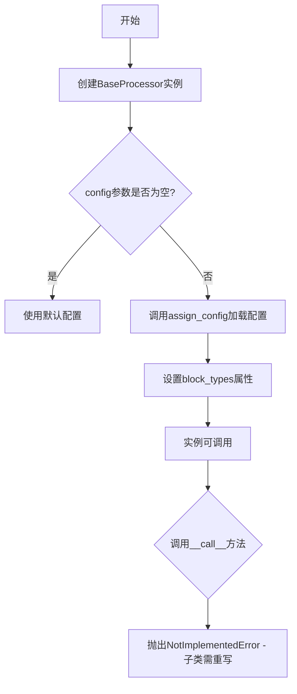
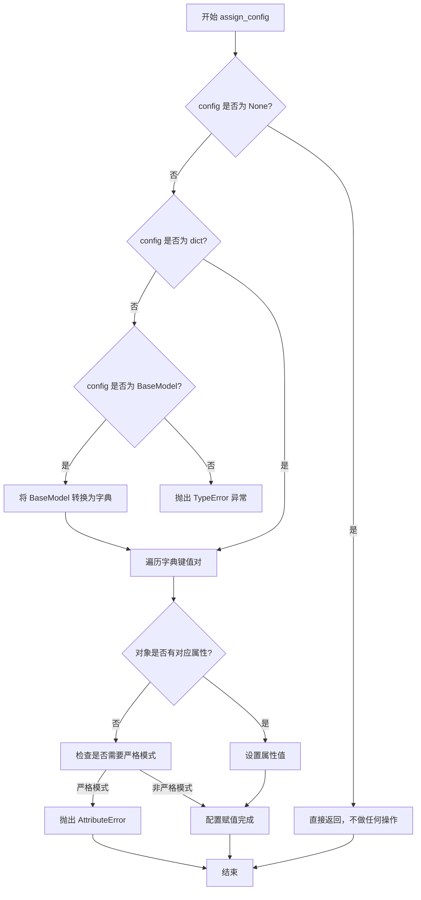
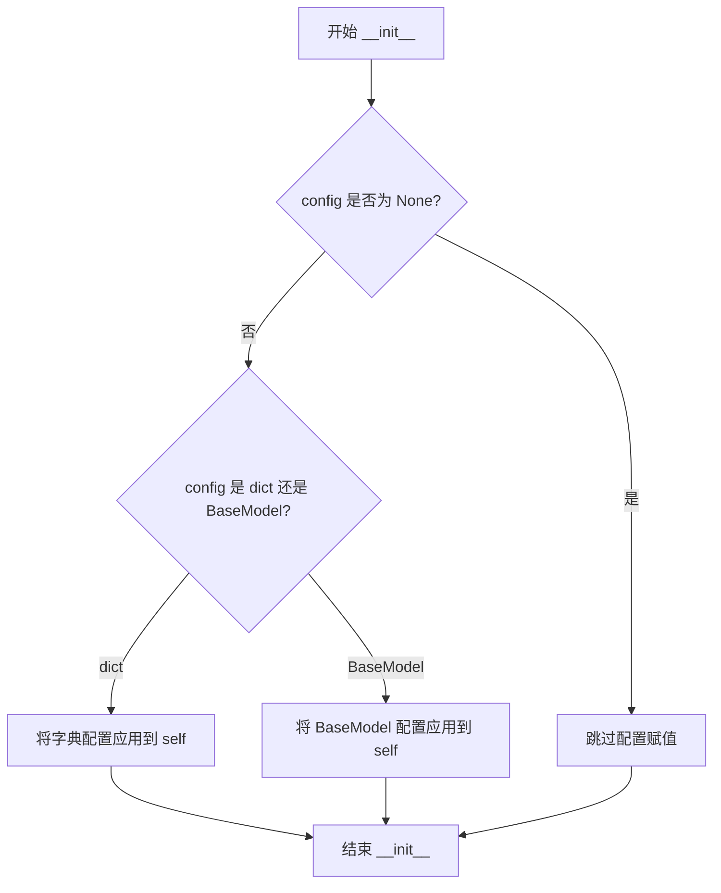
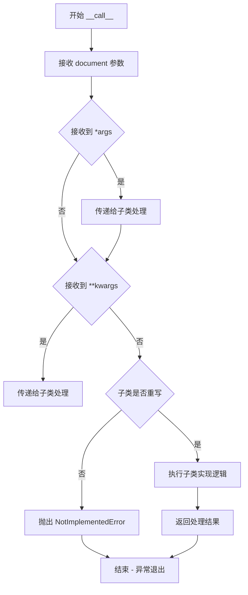

# `marker\marker\processors\__init__.py` 详细设计文档

这是marker库中的处理器基类，定义了处理文档块的基本接口和配置管理功能，用于扩展支持不同的文档块类型处理

## 整体流程



## 类结构

```
BaseProcessor (处理器基类)
```

## 全局变量及字段


### `BaseProcessor.block_types`
    
指定该处理器负责的文档块类型

类型：`Tuple[BlockTypes] | None`
    
    

## 全局函数及方法


### `assign_config`

该函数是 `marker.util` 模块中提供的配置赋值工具，用于将传入的配置对象（`BaseModel` 实例或字典）安全地赋值给目标对象的对应属性，支持配置验证和默认值处理。

参数：

- `self`：`object`，需要接收配置的目标对象实例（通常是类的实例）
- `config`：`BaseModel | dict | None`，配置数据，可以是 Pydantic BaseModel 实例、字典或 None

返回值：`None`，该函数直接修改传入的对象实例，不返回任何值

#### 流程图



#### 带注释源码

```python
# marker/util.py 中的 assign_config 函数实现（推断）

from typing import Optional, Union, Any
from pydantic import BaseModel


def assign_config(
    self, 
    config: Optional[Union[BaseModel, dict]] = None
) -> None:
    """
    将配置对象赋值给目标对象的属性
    
    参数:
        self: 目标对象实例
        config: 配置数据，支持 BaseModel 或字典类型
    
    返回:
        None: 直接修改对象属性，无返回值
    """
    
    # 如果没有传入配置，直接返回
    if config is None:
        return
    
    # 如果是字典类型，直接使用
    if isinstance(config, dict):
        config_dict = config
    # 如果是 Pydantic BaseModel，转换为字典
    elif isinstance(config, BaseModel):
        # model_dump() 获取字典形式，exclude_none 排除 None 值
        config_dict = config.model_dump(exclude_none=True)
    else:
        raise TypeError(
            f"config must be a dict or BaseModel instance, "
            f"got {type(config).__name__}"
        )
    
    # 遍历配置字典，将值赋给对象属性
    for key, value in config_dict.items():
        # 检查对象是否有该属性
        if hasattr(self, key):
            setattr(self, key, value)
        else:
            # 可选：严格模式下抛出异常，或静默忽略
            raise AttributeError(
                f"'{type(self).__name__}' object has no attribute '{key}'"
            )
```

> **注意**：由于 `assign_config` 函数的实际源码不在提供的代码段中，以上为基于其使用方式和功能描述的合理推断。实际实现可能包含更多特性，如默认值合并、类型转换、配置验证等。


### `BaseProcessor.__init__`

初始化处理器并加载配置，接受可选的配置对象（BaseModel实例或字典），通过 assign_config 函数将配置应用到当前处理器实例。

参数：

- `config`：`Optional[BaseModel | dict]`，处理器配置，可为 Pydantic BaseModel 实例、字典或 None

返回值：无（`None`），构造函数不返回任何值

#### 流程图



#### 带注释源码

```python
def __init__(self, config: Optional[BaseModel | dict] = None):
    """
    初始化 BaseProcessor 实例并加载配置
    
    参数:
        config: 可选的配置对象，可以是 Pydantic BaseModel 实例、字典或 None
               如果为 None，则使用默认配置
    
    返回值:
        无返回值
    
    注意:
        具体配置赋值逻辑由 assign_config 函数处理
    """
    assign_config(self, config)  # 调用工具函数将配置应用到当前实例
```


### `BaseProcessor.__call__`

使处理器实例可调用，子类需重写实现该方法以处理文档。该方法是抽象方法，默认实现会抛出 `NotImplementedError` 异常，要求子类必须提供具体的处理逻辑。

参数：

- `document`：`Document`，需要处理的文档对象，包含了待处理的文档数据
- `*args`：可变位置参数，用于传递额外的位置参数，以备子类扩展使用
- `**kwargs`：可变关键字参数，用于传递额外的关键字配置选项，以备子类扩展使用

返回值：`None`，该方法未实现，会抛出 `NotImplementedError` 异常

#### 流程图



#### 带注释源码

```python
def __call__(self, document: Document, *args, **kwargs):
    """
    使处理器实例可调用。
    
    这是一个抽象方法，子类必须重写此方法以实现具体的文档处理逻辑。
    默认实现会抛出 NotImplementedError，以确保子类实现了必要的处理逻辑。
    
    Args:
        document: Document 对象，包含待处理的文档数据
        *args: 可变位置参数，用于传递额外的位置参数
        **kwargs: 可变关键字参数，用于传递额外的配置选项
    
    Raises:
        NotImplementedError: 当子类未重写此方法时抛出
    """
    raise NotImplementedError
```

## 关键组件


### BaseProcessor

BaseProcessor 是文档处理器的抽象基类，定义了处理器的接口和配置机制。通过 `block_types` 类属性指定处理器负责的块类型，并提供可重写的 `__call__` 方法来执行具体的文档处理逻辑。

### block_types

类属性，用于声明该处理器负责处理的 BlockTypes 元组。可为 None 表示不限制处理的块类型，或为 BlockTypes 组成的元组来限定处理的块类型范围。

### __init__

构造函数，接受可选的 config 参数（BaseModel 或字典类型），通过 `assign_config` 函数将配置分配给处理器实例，实现配置驱动的事件处理机制。

### __call__

抽象方法，使处理器实例可调用。接受 document 参数（Document 类型）以及其他可选参数，用于执行具体的文档块处理逻辑。目前抛出 NotImplementedError，强制子类实现具体的处理逻辑。

### assign_config

工具函数调用，来自 marker.util 模块，用于将配置对象动态分配给处理器实例的属性，支持配置与代码的解耦。


## 问题及建议


### 已知问题

-   `block_types` 类属性声明了类型但未初始化默认值，虽然允许为 `None`，但缺乏明确的初始值设定
-   `__call__` 方法使用 `*args, **kwargs` 导致类型安全缺失，调用者无法从类型提示中获知参数信息
-   该类未使用 `abc.ABC` 或 `@abstractmethod` 标记为抽象类，理论上可被实例化但实际调用会抛出 `NotImplementedError`
-   缺少类级别和方法级别的文档字符串（docstring），影响代码可维护性和可理解性
-   `block_types` 的类型注解使用 Python 3.10+ 的 union 语法 `|`，对更低版本 Python 不兼容

### 优化建议

-   为 `block_types` 添加显式默认值 `None`，或考虑添加类级别的抽象属性装饰器
-   重新设计 `__call__` 方法签名，明确参数类型和返回值类型，或定义协议（Protocol）类以提供更好的类型提示
-   继承 `ABC` 类并使用 `@abstractmethod` 装饰器 `__call__` 方法，从语言层面禁止实例化
-   为类和关键方法添加详细的文档字符串，说明职责、参数含义和返回值
-   考虑使用 `Optional[Tuple[BlockTypes]]` 替代 `Tuple[BlockTypes] | None` 以提高兼容性，或明确声明支持的 Python 版本最低要求
-   在 `assign_config` 调用处添加类型检查或文档说明 config 参数的预期结构
-   考虑添加 `__repr__` 或 `__str__` 方法，便于调试和日志输出


## 其它


### 设计目标与约束

本类作为处理器基类，旨在定义文档块处理的通用接口和配置管理机制。设计目标包括：1) 提供统一的处理器初始化和配置加载方式；2) 通过block_types属性明确处理器职责范围；3) 强制子类实现__call__方法以确保多态性。约束条件包括：配置必须为BaseModel实例或字典类型；block_types必须为BlockTypes元组或None。

### 错误处理与异常设计

本类本身未实现复杂的错误处理，主要通过NotImplementedError强制子类实现具体逻辑。预期异常场景包括：1) 子类未重写__call__方法时抛出NotImplementedError；2) assign_config函数在配置类型不匹配时可能抛出TypeError或ValueError；3) document参数类型不符合Document类型时的类型检查异常。建议在子类实现时添加参数验证和异常捕获机制。

### 数据流与状态机

数据流：外部调用者创建Document对象 → 传入Processor实例 → __call__方法被触发 → 处理Document中的特定BlockTypes块 → 返回处理结果（由子类实现）。状态机：本类为无状态设计，不维护内部状态，仅通过配置驱动行为。子类_processor的具体处理逻辑应设计为无副作用或明确状态管理。

### 外部依赖与接口契约

主要依赖包括：1) pydantic.BaseModel用于配置模型定义；2) marker.schema.BlockTypes定义文档块类型枚举；3) marker.schema.document.Document文档数据模型；4) marker.util.assign_config配置分配工具函数。接口契约：子类必须实现__call__方法，签名为(self, document: Document, *args, **kwargs)，返回值类型由子类定义；block_types属性可选覆盖，用于声明处理的块类型。

### 版本兼容性说明

代码使用Python 3.10+的类型联合语法（|）进行类型标注，要求Python版本不低于3.10。pydantic依赖需兼容BaseModel的dict参数构造方式。marker模块为项目内部依赖，需要确保schema和util模块的API稳定性。

### 可测试性设计

本类设计具有良好的可测试性：1) 简洁的接口便于Mock；2) __call__方法可通过子类继承进行测试；3) assign_config的调用可通过配置注入进行单元测试。建议为子类编写继承BaseProcessor的Mock实现用于集成测试。

### 性能考量

本基类本身无性能开销，性能瓶颈主要在子类的__call__实现中。block_types的类型注解为Tuple而非List，暗示应为不可变 tuple 类型以避免意外修改。配置对象在初始化时一次性加载，避免重复解析开销。

    