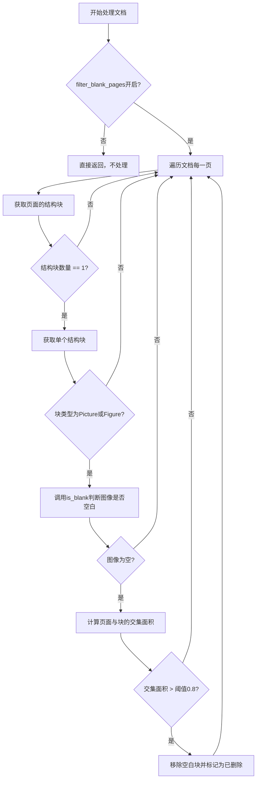
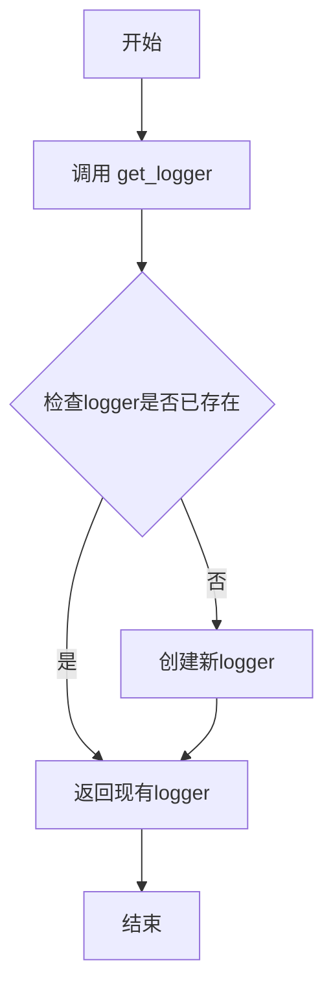
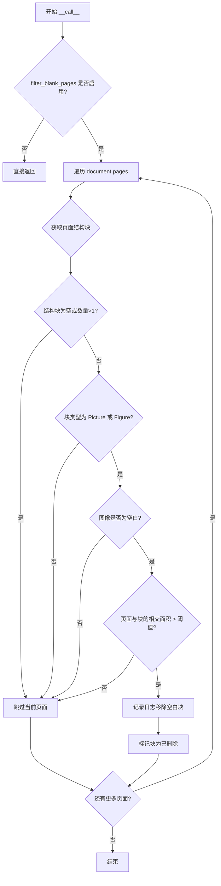

# `marker\marker\processors\blank_page.py` 详细设计文档

一个用于检测和过滤空白页面的文档处理器，通过图像处理技术分析页面内容，识别完全空白的页面并根据配置决定是否移除。

## 整体流程



## 类结构

```
BaseProcessor (基类)
└── BlankPageProcessor (空白页面处理器)
```

## 全局变量及字段


### `logger`
    
日志记录器，用于输出调试信息

类型：`logging.Logger`
    


### `BlankPageProcessor.full_page_block_intersection_threshold`
    
检测空白页面的交集面积阈值，默认为0.8

类型：`Annotated[float]`
    


### `BlankPageProcessor.filter_blank_pages`
    
是否移除空白页面的开关，默认为False

类型：`Annotated[bool]`
    


### `BlankPageProcessor.is_blank`
    
判断给定图像是否为空白的

类型：`method`
    


### `BlankPageProcessor.__call__`
    
处理文档，识别并移除空白页面

类型：`method`
    
    

## 全局函数及方法


### `get_logger`

获取日志记录器的全局函数，用于在模块级别创建或检索一个logger实例，以便在整个模块中使用统一的日志记录功能。

参数：

- （无参数）

返回值：`logging.Logger`，返回标准的Python日志记录器对象，用于模块级别的日志输出。

#### 流程图



#### 带注释源码

```
# 从 marker.logger 模块导入 get_logger 函数
# 该函数通常在模块初始化时调用，为当前模块创建或获取一个logger实例
from marker.logger import get_logger

# 获取一个名为 'marker' 或当前模块名的logger实例
# 这个logger将在整个 BlankPageProcessor 类中使用
logger = get_logger()
```

---

**注意**：由于 `get_logger()` 函数的实现不在当前代码文件中（它是从外部模块 `marker.logger` 导入的），以上信息基于代码的使用方式进行推断。实际的实现可能在 `marker.logger` 模块中，通常会包含以下功能：

- 检查同名的logger是否已存在
- 如果存在则返回现有实例
- 如果不存在则创建新的logger并配置（如设置级别、格式等）
- 可能支持通过参数自定义logger名称或配置


### `BlankPageProcessor.is_blank`

该方法接收一个 PIL 图像对象，通过灰度转换、高斯模糊、自适应阈值二值化、连通组件分析和膨胀操作等步骤，计算图像中非空白区域的像素总和，从而判断图像是否为空白页面。

参数：
- `image`：`Image.Image`，待检测是否为空的图像对象

返回值：`bool`，如果图像为空（全白）返回 `True`，否则返回 `False`

#### 流程图

```mermaid
flowchart TD
    A[开始: 接收 image] --> B{检查图像是否为空}
    B -->|是| C[返回 True]
    B -->|否| D[将图像转换为 NumPy 数组]
    D --> E[RGB 转灰度图]
    E --> F[高斯模糊 (7x7)]
    F --> G[自适应阈值二值化]
    G --> H[连通组件分析]
    H --> I[创建清洁的二值掩码]
    I --> J[膨胀操作 3次]
    J --> K{检查像素总和}
    K -->|总和为0| C
    K -->|总和不为0| L[返回 False]
```

#### 带注释源码

```python
def is_blank(self, image: Image.Image):
    """
    判断给定图像是否为空白页面
    
    参数:
        image: PIL Image 对象，待检测的图像
        
    返回值:
        bool: 图像为空白时返回 True，否则返回 False
    """
    # 将 PIL Image 转换为 NumPy 数组以便后续处理
    image = np.asarray(image)
    
    # 处理空图像或无效尺寸的情况
    if image.size == 0 or image.shape[0] == 0 or image.shape[1] == 0:
        # Handle empty image case
        return True

    # 将 RGB 彩色图像转换为灰度图像
    gray = cv2.cvtColor(image, cv2.COLOR_RGB2GRAY)
    # 应用高斯模糊减少噪声 (核大小 7x7)
    gray = cv2.GaussianBlur(gray, (7, 7), 0)

    # Adaptive threshold (inverse for text as white)
    # 使用自适应阈值进行二值化， inverse 模式将文本等前景设为白色
    binarized = cv2.adaptiveThreshold(
        gray, 255, cv2.ADAPTIVE_THRESH_GAUSSIAN_C, cv2.THRESH_BINARY_INV, 31, 15
    )

    # 进行连通组件分析，获取图像中的独立区域
    num_labels, labels, stats, _ = cv2.cv2.connectedComponentsWithStats(
        binarized, connectivity=8
    )
    
    # 创建与二值化图像同大小的零数组
    cleaned = np.zeros_like(binarized)
    # 遍历所有连通组件（跳过背景，即索引0）
    for i in range(1, num_labels):  # skip background
        cleaned[labels == i] = 255

    # 创建形态学核用于膨胀操作
    kernel = np.ones((1, 5), np.uint8)
    # 对清洁后的二值图进行膨胀操作，扩展连通区域
    dilated = cv2.dilate(cleaned, kernel, iterations=3)
    
    # 将膨胀后的图像归一化到 0-1 范围
    b = dilated / 255
    # 如果像素总和为0，说明图像为空白
    return b.sum() == 0
```


### `BlankPageProcessor.__call__`

该方法为核心文档处理方法，用于遍历文档的每一页，检测并移除被识别为空白图片的页面。它通过检查页面结构块的数量、类型以及图像内容是否为空来判断是否为空白页面，满足条件时从文档中移除该结构块并标记为已删除。

参数：

- `document`：`Document`，待处理的文档对象，包含所有页面和内容结构

返回值：`None`，无返回值（通过修改文档对象本身来移除空白页面）

#### 流程图



#### 带注释源码

```
def __call__(self, document: Document):
    # 检查是否启用空白页面过滤功能
    # 如果未启用，则直接返回，不进行任何处理
    if not self.filter_blank_pages:
        return

    # 遍历文档中的每一页进行处理
    for page in document.pages:
        # 获取当前页面的结构块（Layout blocks）
        structure_blocks = page.structure_blocks(document)
        
        # 如果没有结构块或结构块数量大于1，则跳过此页面
        # 空白页面通常只有一个结构块
        if not structure_blocks or len(structure_blocks) > 1:
            continue

        # 获取页面中唯一的结构块
        full_page_block: Block = structure_blocks[0]

        # 定义多个条件来判断是否为空白页面
        conditions = [
            # 条件1：块类型必须是图片或图形类型
            full_page_block.block_type in [BlockTypes.Picture, BlockTypes.Figure],
            # 条件2：通过图像分析判断是否为空白图像
            self.is_blank(full_page_block.get_image(document)),
            # 条件3：块的面积与页面面积的交集占比必须超过阈值
            # 用于确认该块占据了整页
            page.polygon.intersection_area(full_page_block.polygon)
            > self.full_page_block_intersection_threshold,
        ]

        # 只有当所有条件都满足时，才认定该页为空白页面
        if all(conditions):
            # 记录调试日志，包含被移除块的ID
            logger.debug(f"Removing blank block {full_page_block.id}")
            # 从页面的结构项中移除该块
            page.remove_structure_items([full_page_block.id])
            # 标记该块已被移除
            full_page_block.removed = True
```

## 关键组件


### BlankPageProcessor

用于过滤空白页面的处理器类，继承自 BaseProcessor，通过检测页面中的单个布局块是否为空白图像来识别并移除空白页面。

### 张量索引与惰性加载

使用 `full_page_block.get_image(document)` 实现惰性加载图像，仅在需要时才从文档中提取图像数据，避免不必要的内存开销。

### 图像二值化与连通组件分析

通过 `cv2.adaptiveThreshold` 进行自适应阈值二值化，将图像转换为黑白形式以便分析连通区域。使用 `cv2.connectedComponentsWithStats` 分析连通组件，过滤掉小噪点和背景区域。

### 形态学膨胀操作

使用 `cv2.dilate` 和自定义核 `np.ones((1, 5), np.uint8)` 进行膨胀操作，将孤立的像素点合并成更大的区域，便于判断页面是否为空白。

### 多边形交集判断

通过 `page.polygon.intersection_area(full_page_block.polygon)` 计算页面与块的多边形交集面积，用于判断块是否覆盖整个页面。

### 空白页面过滤逻辑

在 `__call__` 方法中实现核心过滤逻辑：检查页面是否只有一个结构块、该块是否为图片类型、图像是否为空以及是否覆盖整个页面，满足全部条件时移除该块。

### 配置参数

`full_page_block_intersection_threshold` 和 `filter_blank_pages` 两个Annotated配置参数，分别用于设置空白页面检测阈值和控制是否启用空白页面过滤功能。


## 问题及建议


### 已知问题

- **硬编码的图像处理参数**：高斯模糊核大小(7,7)、自适应阈值参数(31,15)、膨胀核(1,5)和迭代次数(3)均为硬编码，缺乏灵活性和可配置性
- **配置默认值可能不符合预期**：filter_blank_pages默认为False，可能导致用户期望的空白页面过滤功能默认不生效
- **异常处理不完善**：cv2相关操作（cvtColor、adaptiveThreshold、connectedComponentsWithStats等）可能抛出异常，但代码中没有try-except捕获；get_image()的返回值未做None检查
- **魔法数字**：intersection_threshold阈值0.8作为魔法数字缺乏注释说明其选择依据
- **日志级别不当**：使用debug级别记录删除操作，在生产环境中可能被忽略
- **重复计算**：structure_blocks被获取后检查长度，但后续直接使用structure_blocks[0]访问，逻辑可更清晰
- **文档缺失**：缺少对类、方法和参数的文档字符串说明
- **类型注解不完整**：__call__方法缺少返回类型注解

### 优化建议

- 将图像处理的关键参数提取为类属性或配置项，提供Annotated注解和默认值
- 考虑将filter_blank_pages的默认值改为True，或添加配置说明文档
- 为cv2操作添加try-except异常处理，捕获可能的OpenCV错误
- 将intersection_threshold值提取为常量并添加注释说明
- 将日志级别改为info或warning，以便更好地追踪空白页面处理
- 简化structure_blocks的检查逻辑，使用更清晰的变量命名
- 添加详细的文档字符串说明类和方法的功能
- 补充__call__方法的返回类型注解（明确返回None）

## 其它


### 设计目标与约束

本处理器的主要设计目标是识别并过滤文档中的空白页面，通过检测全页尺寸的图片/图形块是否为空来减少后续处理的工作量。设计约束包括：仅处理单结构块页面、依赖OpenCV进行图像处理、需要Document对象提供页面结构和图像获取接口。

### 错误处理与异常设计

代码中已处理空图像情况（image.size == 0或尺寸为0时返回True）。潜在异常包括：cv2.cvtColor失败（色彩空间不支持）、cv2.connectedComponentsWithStats返回异常标签数、get_image返回无效图像。当前通过try-except包装cv2操作并返回安全值（True表示空白）来避免异常中断处理流程。建议在文档处理框架层面统一捕获处理器异常，避免单页处理失败导致整个文档处理中止。

### 数据流与状态机

处理器数据流：Document对象 → 遍历所有页面 → 获取页面结构块 → 验证是否为单块且为图片/图形类型 → 调用is_blank方法进行图像分析 → 满足条件则标记移除。状态机：初始状态（filter_blank_pages=False时直接返回）→ 检测状态（遍历页面）→ 判断状态（单块+图片类型+空白判断）→ 移除状态（设置removed=True并移除结构项）。

### 外部依赖与接口契约

主要依赖：PIL（Pillow）用于图像加载、NumPy用于数组操作、OpenCV（cv2）用于图像处理。接口契约：BaseProcessor基类要求实现__call__(document: Document)方法；Document对象需提供pages属性、structure_blocks()方法、get_image()方法；Block对象需提供block_type、polygon、get_image()、removed属性及remove_structure_items()方法。

### 性能考虑与资源消耗

is_blank方法中高斯模糊(7x7)和自适应阈值计算复杂度为O(n)线性于图像像素数。connectedComponentsWithStats是较重操作，复杂度与图像尺寸相关。对于高分辨率扫描文档，建议在调用前进行下采样预处理。当前kernel尺寸(1x5)和迭代次数(3)针对纵向文本优化，若处理横向文档或不同版式可能需要参数调优。

### 安全性考虑

代码不涉及用户输入直接处理，不存在注入风险。图像处理过程中需确保输入图像格式符合预期（RGB格式），cv2.cvtColor在非RGB输入时可能抛出异常。建议在框架层面验证输入图像有效性后再分发给处理器。

### 配置参数说明

full_page_block_intersection_threshold: float类型，默认0.8，定义页面与块的多边形交集面积占比阈值，用于判断块是否占据整个页面。filter_blank_pages: bool类型，默认False，控制是否启用空白页面过滤功能，设为True时才会执行实际过滤逻辑。

### 测试策略建议

应编写单元测试覆盖：空图像输入、纯白图像输入、纯黑图像输入、带少量噪点图像、带文本图像、正常照片图像、正常截图图像等场景。同时需测试边界条件：单页文档、多页文档、无结构块页面、多结构块页面、异常类型块等情况。集成测试需验证处理器与Document对象的交互以及最终文档输出的正确性。

### 版本兼容性说明

代码使用Python 3.9+的类型注解语法（Annotated）。OpenCV版本需支持connectedComponentsWithStats（4.x版本）、adaptiveThreshold和GaussianBlur。NumPy需支持数组除法和布尔运算。PIL/Pillow需支持Image对象转换。建议在requirements.txt中明确版本约束：opencv-python>=4.5、numpy>=1.20、pillow>=8.0。

### 潜在改进方向

1. 当前仅支持Picture和Figure类型块，可考虑扩展支持其他全页块类型；2. is_blank方法使用固定参数，建议提供可配置选项；3. 对于超大图像可先下采样再处理以提升性能；4. 可添加统计信息记录被移除的空白页数量供后续分析；5. 当前逻辑仅检测单块页面，多块页面中的空白块检测可作为扩展功能。

    