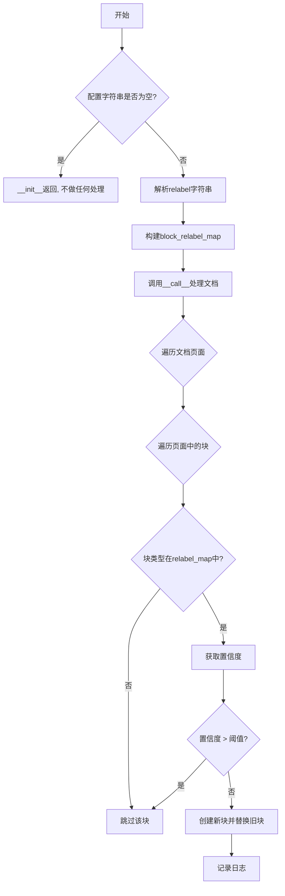
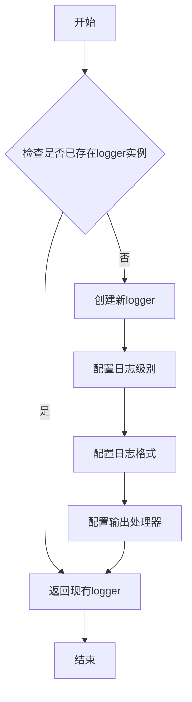
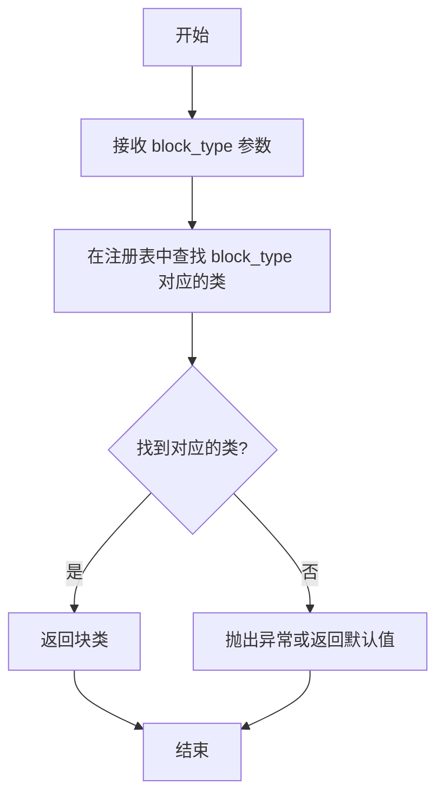

# `marker\marker\processors\block_relabel.py` 详细设计文档

一个文档块重标记处理器，通过解析配置字符串中的置信度阈值规则，对文档中的块进行启发式重标记，将满足置信度条件的块类型替换为新的块类型。

## 整体流程



## 类结构

```
BaseProcessor (基类)
└── BlockRelabelProcessor (文档块重标记处理器)
```

## 全局变量及字段


### `logger`
    
全局日志记录器，用于记录警告和调试信息

类型：`Logger`
    


### `BlockRelabelProcessor.block_relabel_str`
    
逗号分隔的重标记规则字符串，格式为'<原始标签>:<新标签>:<置信度阈值>'，每个规则定义了在置信度超过阈值时如何重标记特定类型的块

类型：`Annotated[str, "Comma-separated relabeling rules in the format '<original_label>:<new_label>:<confidence_threshold>'.", "Each rule defines how blocks of a certain type should be relabeled when the confidence exceeds the threshold.", "Example: 'Table:Picture:0.85,Form:Picture:0.9'"]`
    
    

## 全局函数及方法


# 函数文档提取结果

根据提供的代码分析，`get_logger()`函数是从外部模块`marker.logger`导入的全局函数。以下是详细的设计文档：

### `get_logger`

获取日志记录器的全局函数，用于创建或返回一个配置好的日志记录器实例，供模块内部记录调试和警告信息。

参数：暂无明确参数（基于代码使用推断可能支持可选的配置参数）

返回值：`Logger`，一个Python标准库的logging.Logger对象，用于记录程序运行过程中的调试、警告等信息

#### 流程图



#### 带注释源码

```
# 从marker.logger模块导入get_logger函数
# 注意：实际的函数定义不在本代码文件中
from marker.logger import get_logger

# 获取日志记录器实例
# 该logger对象用于记录模块运行时的各类信息
logger = get_logger()
```

---

### 补充说明

由于提供的代码片段仅包含`get_logger()`函数的使用部分，未包含`marker.logger`模块的实际实现，以上信息基于以下代码使用上下文推断：

1. **使用场景**：代码中通过`logger.warning()`和`logger.debug()`进行日志记录
2. **调用方式**：`logger = get_logger()`，无传入参数
3. **返回值使用**：返回的logger对象具有`.warning()`和`.debug()`方法

如需获取完整的`get_logger()`函数源码实现，建议查看`marker/logger.py`模块文件。

---

### 技术债务与优化建议

1. **缺少直接的函数定义**：该函数依赖外部模块，建议在文档中明确标注外部依赖
2. **日志配置不透明**：无法从当前代码判断日志级别和格式配置，建议添加配置说明
3. **测试难度**：由于依赖外部模块，建议为日志输出编写mock测试

### 参考内容

该函数在代码中的具体使用位置：
```python
# 第70行：记录解析失败的警告
logger.warning(f"Failed to parse relabel rule '{block_config_str}' at index {i}: {e}. Expected format is <original_label>:<new_label>:<confidence_threshold>")

# 第86行：记录跳过的调试信息
logger.debug(f"Skipping relabel for {block_id}; Confidence: {confidence} > Confidence Threshold {confidence_thresh} for re-labelling")

# 第99行：记录重标记成功的调试信息
logger.debug(f"Relabelled {block_id} to {relabel_block_type}")
```


### `get_block_class`

根据块类型（BlockType）获取对应块的注册类，用于在运行时动态创建不同类型的文档块对象。

参数：

- `block_type`：`BlockTypes`，表示目标块的类型枚举值（如 `BlockTypes.Table`、`BlockTypes.Picture` 等）

返回值：`type`，返回与给定块类型对应的块类（Class），该类可用于实例化具体的文档块对象

#### 流程图



#### 带注释源码

```python
# 从 marker.schema.registry 模块导入的全局函数
# 位置：marker/schema/registry.py

def get_block_class(block_type):
    """
    根据块类型获取对应的注册类。
    
    参数:
        block_type: BlockTypes 枚举值，指定需要获取的块类型
        
    返回值:
        返回与 block_type 对应的块类，可用于实例化块对象
        
    使用示例:
        # 在 BlockRelabelProcessor 中使用
        relabel_block_type = BlockTypes[block_relabel]  # 将字符串转换为枚举
        new_block_cls = get_block_class(relabel_block_type)  # 获取对应的类
        new_block = new_block_cls(...)  # 使用返回的类创建新实例
    """
    # 内部实现通常维护一个 BlockType -> Class 的映射字典
    # 当调用此函数时，根据传入的 block_type 从映射中获取对应的类
    pass
```


### `BlockTypes[...]`

`BlockTypes` 是一个从 `marker.schema` 导入的块类型枚举字典，用于将块类型的字符串名称（如 "Table"、"Picture"、"Form" 等）映射为对应的枚举值，以便在文档处理中统一识别和处理不同类型的块。

参数：

- `key`：`str`，要查询的块类型字符串名称（如 "Table"、"Picture" 等）

返回值：`BlockType`，对应的块类型枚举值

#### 流程图

```mermaid
flowchart TD
    A[输入块类型字符串] --> B{字符串是否有效?}
    B -->|是| C[在BlockTypes枚举中查找]
    B -->|否| D[抛出KeyError异常]
    C --> E{找到对应枚举值?}
    E -->|是| F[返回BlockType枚举值]
    E -->|否| G[抛出KeyError异常]
    
    H[在BlockRelabelProcessor中使用] --> I[BlockTypes[block_label]获取原始块类型]
    I --> J[BlockTypes[block_relabel]获取目标块类型]
    J --> K[存储在block_relabel_map中用于后续块重标记]
```

#### 带注释源码

```python
# BlockTypes 的使用示例（在 BlockRelabelProcessor.__init__ 方法中）

# 从配置字符串解析块类型
block_label, block_relabel, confidence_str = parts  # 例如 'Table', 'Picture', '0.85'

# 使用 BlockTypes 枚举字典将字符串映射为枚举值
block_type = BlockTypes[block_label]  # BlockTypes['Table'] -> <BlockType.Table: ...>
relabel_block_type = BlockTypes[block_relabel]  # BlockTypes['Picture'] -> <BlockType.Picture: ...>

# 存储映射关系供后续处理使用
self.block_relabel_map[block_type] = (
    confidence_thresh,
    relabel_block_type
)

# 在 __call__ 方法中检查和处理块
if block.block_type not in self.block_relabel_map:
    continue  # 跳过不在重标记映射中的块类型

confidence_thresh, relabel_block_type = self.block_relabel_map[block.block_type]
```

#### 关键组件信息

| 名称 | 一句话描述 |
|------|-----------|
| `BlockTypes` | 块类型的枚举字典，将字符串名称映射为枚举值 |
| `BlockType` | 枚举类，定义所有支持的块类型（如 Table、Picture、Form 等） |

#### 潜在的技术债务或优化空间

1. **缺少块类型验证**：如果传入无效的块类型字符串，会抛出 `KeyError`，建议在解析时添加更友好的错误处理或默认值
2. **枚举依赖性**：代码强依赖 `marker.schema.BlockTypes`，如果枚举值发生变化可能影响功能，建议添加版本兼容性检查


### BlockRelabelProcessor.__init__

初始化 `BlockRelabelProcessor` 实例，解析 `block_relabel_str` 配置字符串，构建从原始块类型到新块类型及置信度阈值的映射表，供后续 `__call__` 方法重新标记文档块时使用。

参数：

- `config`：`任意类型`，传递给父类 `BaseProcessor` 的配置参数，用于初始化处理器基类

返回值：`None`，无返回值，仅完成实例初始化

#### 流程图

```mermaid
flowchart TD
    A[开始 __init__] --> B[调用 super().__init__config]
    B --> C[初始化 self.block_relabel_map = {}]
    D{self.block_relabel_str 是否为空?}
    C --> D
    D -->|是| E[直接返回]
    D -->|否| F[遍历 block_relabel_str.split(',')]
    F --> G{还有未处理的配置字符串?}
    G -->|是| H[strip 当前配置字符串]
    G -->|否| I[结束]
    H --> J{配置字符串为空?}
    J -->|是| F
    J -->|否| K[按 ':' 分割字符串]
    K --> L{parts 长度是否为 3?}
    L -->|否| M[抛出 ValueError 异常]
    L -->|是| N[提取 block_label, block_relabel, confidence_str]
    N --> O[将 confidence_str 转换为 float]
    O --> P[通过 BlockTypes 获取原始块类型]
    Q[通过 BlockTypes 获取目标块类型]
    P --> Q
    Q --> R[构建映射: self.block_relabel_map[block_type] = (confidence_thresh, relabel_block_type)]
    R --> S{捕获异常}
    S -->|发生异常| T[记录警告日志并继续]
    S -->|无异常| F
    T --> F
    M --> T
    E --> I
```

#### 带注释源码

```python
def __init__(self, config=None):
    # 调用父类 BaseProcessor 的初始化方法，传递 config 参数
    # 基类会处理配置解析和属性设置
    super().__init__(config)
    
    # 初始化块重标记映射表，用于存储原始块类型到(置信度阈值, 目标块类型)的映射
    # 格式: {BlockType: (confidence_threshold: float, relabel_block_type: BlockType)}
    self.block_relabel_map = {}

    # 如果配置字符串为空，则无需进行重标记，直接返回
    # 这是快速路径，避免不必要的字符串解析
    if not self.block_relabel_str:
        return

    # 遍历配置字符串中的每个重标记规则
    # 配置格式: 'Table:Picture:0.85,Form:Picture:0.9'
    # 每个规则由逗号分隔
    for i, block_config_str in enumerate(self.block_relabel_str.split(',')):
        # 去除字符串首尾空白，处理可能的格式问题
        block_config_str = block_config_str.strip()
        
        # 跳过空字符串段，避免索引越界
        if not block_config_str:
            continue  # Skip empty segments

        try:
            # 按冒号分割配置字符串，期望格式: original_label:new_label:confidence_threshold
            parts = block_config_str.split(':')
            
            # 验证配置格式，必须恰好有3个部分
            if len(parts) != 3:
                raise ValueError(f"Expected 3 parts, got {len(parts)}")

            # 解包配置: 原始标签、新标签、置信度阈值字符串
            block_label, block_relabel, confidence_str = parts
            
            # 将置信度阈值字符串转换为浮点数
            confidence_thresh = float(confidence_str)

            # 通过 BlockTypes 枚举将字符串标签转换为枚举值
            # 这确保了输入的标签是有效的块类型
            block_type = BlockTypes[block_label]
            relabel_block_type = BlockTypes[block_relabel]

            # 将解析结果存储到映射表中
            # 键为原始块类型，值为(置信度阈值, 目标块类型)的元组
            self.block_relabel_map[block_type] = (
                confidence_thresh,
                relabel_block_type
            )
        except Exception as e:
            # 捕获解析过程中的所有异常（如枚举键不存在、类型转换失败等）
            # 记录警告日志但继续处理其他规则，提高容错性
            logger.warning(f"Failed to parse relabel rule '{block_config_str}' at index {i}: {e}. Expected format is <original_label>:<new_label>:<confidence_threshold>")
```


### `BlockRelabelProcessor.__call__`

该方法是处理文档的核心入口，接收一个 `Document` 对象作为输入，遍历文档中的所有页面和块，根据预定义的置信度阈值规则对符合条件的块进行重标记（relabel），即将块的类型从原始类型转换为新的类型，但仅当块的置信度不高于指定阈值时才会执行重标记操作。

参数：

- `document`：`Document`，待处理的文档对象，包含了文档的所有页面和块结构

返回值：`None`，该方法直接修改传入的 `document` 对象，不返回任何值

#### 流程图

```mermaid
flowchart TD
    A[开始 __call__] --> B{"block_relabel_map\n是否为空?"}
    B -->|是| C[直接返回]
    B -->|否| D[遍历 document.pages]
    D --> E[遍历 page.structure_blocks]
    E --> F{"块的 block_type\n在 relabel_map 中?"}
    F -->|否| E
    F -->|是| G[获取 confidence_thresh\n和 relabel_block_type]
    G --> H[获取 confidence = block.top_k.get\n(block.block_type)]
    I{"confidence >\nconfidence_thresh?"}
    H --> I
    I -->|是| J[记录日志: 跳过重标记]
    I -->|否| K[get_block_class\n获取新块类型]
    J --> E
    K --> L[创建新块 new_block\n使用 relabel_block_type]
    L --> M[page.replace_block\n用新块替换旧块]
    M --> N[记录日志: 已重标记]
    N --> E
```

#### 带注释源码

```python
def __call__(self, document: Document):
    """
    处理文档，根据预定义的置信度阈值规则对符合条件的块进行重标记。
    
    参数:
        document: Document - 待处理的文档对象
        
    返回:
        None - 直接修改传入的 document 对象，不返回任何值
    """
    
    # 检查是否有配置任何重标记规则，如果没有则直接返回，避免不必要的遍历
    if len(self.block_relabel_map) == 0:
        return

    # 遍历文档中的所有页面
    for page in document.pages:
        # 遍历当前页面中的所有结构块
        for block in page.structure_blocks(document):
            # 仅处理在重标记映射中定义的块类型，跳过其他类型的块
            if block.block_type not in self.block_relabel_map:
                continue
            
            # 构建块ID用于日志记录
            block_id = BlockId(
                page_id=page.page_id, 
                block_id=block.block_id, 
                block_type=block.block_type
            )
            
            # 从映射中获取该块类型的置信度阈值和目标重标记类型
            confidence_thresh, relabel_block_type = self.block_relabel_map[block.block_type]
            
            # 获取当前块的置信度得分
            confidence = block.top_k.get(block.block_type)
            
            # 如果置信度高于阈值，则跳过重标记（高置信度表示原分类可能已正确）
            if confidence > confidence_thresh:
                logger.debug(
                    f"Skipping relabel for {block_id}; "
                    f"Confidence: {confidence} > Confidence Threshold {confidence_thresh} for re-labelling"
                )
                continue

            # 根据目标块类型获取对应的块类构造函数
            new_block_cls = get_block_class(relabel_block_type)
            
            # 创建新块，复制原块的几何结构、内容和元数据，但使用新的块类型
            new_block = new_block_cls(
                polygon=deepcopy(block.polygon),           # 深拷贝多边形坐标
                page_id=block.page_id,                     # 保留页面ID
                structure=deepcopy(block.structure),       # 深拷贝结构信息
                text_extraction_method=block.text_extraction_method,  # 保留文本提取方法
                source="heuristics",                        # 标记来源为启发式方法
                top_k=block.top_k,                         # 保留置信度分布
                metadata=block.metadata                    # 保留元数据
            )
            
            # 在页面中用新块替换原块，实现重标记
            page.replace_block(block, new_block)
            
            # 记录重标记操作
            logger.debug(f"Relabelled {block_id} to {relabel_block_type}")
```

## 关键组件


### BlockRelabelProcessor 类

主处理器类，负责根据置信度阈值重新标记文档块。该类继承自 BaseProcessor，实现 __call__ 方法使其可调用，通过解析配置字符串中的规则，将满足置信度条件的块从一种类型重标记为另一种类型。

### block_relabel_str 配置字段

类型为 Annotated[str, ...] 的类属性，用于配置重标记规则。格式为逗号分隔的规则列表，每条规则为 `<original_label>:<new_label>:<confidence_threshold>`，例如 'Table:Picture:0.85,Form:Picture:0.9'。

### block_relabel_map 映射字典

类型为 dict 的实例属性，存储解析后的规则映射。键为原始 BlockTypes，值为 (confidence_thresh, relabel_block_type) 元组，用于快速查找和执行重标记逻辑。

### __init__ 初始化方法

构造函数，接收可选的 config 参数。负责解析 block_relabel_str 字符串，将其转换为 block_relabel_map 字典。包含错误处理逻辑，当规则格式不正确时记录警告日志。

### __call__ 调用方法

接收 Document 对象作为参数，遍历文档中所有页面和块。对于每个块，检查其类型是否在 block_relabel_map 中，然后比较置信度与阈值，决定是否需要重标记该块。

### 置信度检查逻辑

通过 block.top_k.get(block.block_type) 获取块的置信度分数，与配置的阈值进行比较。代码中的逻辑是：若 confidence > confidence_thresh 则跳过（continue），即仅对置信度低于阈值的块进行重标记。

### 块替换逻辑

当满足重标记条件时，创建新类型的块实例，使用 deepcopy 复制原块的所有属性（polygon、structure、text_extraction_method、top_k、metadata），并将 source 设置为 "heuristics"，最后调用 page.replace_block 进行替换。

### get_block_class 函数调用

从 marker.schema.registry 模块获取指定块类型的类构造函数，用于动态创建新类型的块对象。

### 日志记录

使用 marker.logger.get_logger() 获取日志记录器，在解析规则失败时记录 warning 级别日志，在执行重标记时记录 debug 级别日志。


## 问题及建议


### 已知问题

-   **置信度阈值判断逻辑可能存在反向错误**：在第56行，`if confidence > confidence_thresh:` 时执行跳过重标记操作，但根据变量名和注释语义，当置信度**高于**阈值时应该**执行**重标记（因为高置信度表示模型更确信当前分类），而非跳过。此处逻辑与注释意图相反。
-   **过度使用 deepcopy 导致性能开销**：对 `polygon` 和 `structure` 使用 `deepcopy`，对于大型文档可能造成显著的内存和时间开销，应评估是否可使用浅拷贝或引用传递。
-   **全局变量和类字段缺少类型注解**：`config` 参数无类型提示，`BlockId` 的实例化仅用于日志而非实际逻辑处理。
-   **配置解析错误处理不一致**：构造函数中的异常被捕获并记录警告，但 `__call__` 方法中的块处理循环缺乏异常处理，可能导致单个块处理失败时整个文档处理中断。
-   **类查找未缓存**：`get_block_class(relabel_block_type)` 在每次块重标记时都被调用，可考虑缓存以提升性能。
-   **BlockId 对象创建开销**：`BlockId` 对象仅用于日志输出，每次循环都创建该对象增加了不必要的开销。
-   **硬编码的 source 值**：新块的 `source` 字段硬编码为 "heuristics"，缺乏配置灵活性。
-   **迭代中修改集合风险**：遍历 `page.structure_blocks(document)` 的同时调用 `page.replace_block`，虽然当前可能工作正常，但在某些迭代器实现下可能导致未定义行为。

### 优化建议

-   **修正置信度判断逻辑**：将第56行改为 `if confidence < confidence_thresh:` 或根据实际业务需求调整，确保逻辑与注释意图一致。
-   **优化拷贝策略**：除非必要，否则使用浅拷贝或直接引用，减少内存占用。
-   **添加类型注解**：为 `config` 参数添加 `Optional[dict]` 或具体配置类类型。
-   **增强错误处理**：在 `__call__` 方法的块处理循环中添加 try-except，确保单个块处理失败不影响整个文档。
-   **缓存类查找结果**：在初始化时缓存 `block_relabel_map` 中每个 `relabel_block_type` 对应的类，避免重复查找。
-   **延迟日志对象构建**：仅在需要日志输出时才构建 `BlockId` 字符串，或使用日志格式化函数延迟求值。
-   **将 source 参数化**：将 "heuristics" 提取为类属性或配置项，提高可维护性。

## 其它


### 设计目标与约束

本处理器旨在解决文档解析中误分类问题，通过置信度阈值机制自动修正块类型标签。设计约束包括：仅支持BlockTypes枚举中存在的块类型重标记；置信度比较逻辑采用">"而非">="以确保准确性；重标记操作会创建新块对象而非修改原块。

### 错误处理与异常设计

配置解析阶段：ValueError捕获格式错误（非3部分）、KeyError捕获无效BlockTypes、ValueError捕获无效浮点数。运行时阶段：遍历过程中捕获块操作异常并记录警告日志。异常处理原则为"失败时跳过该规则"而非中断整个处理流程。

### 数据流与状态机

输入：Document对象 → 遍历页面与结构块 → 匹配重标记规则 → 条件判断(置信度<=阈值) → 创建新块 → 替换块 → 输出修改后的Document。状态转换：Original Block → (条件满足) → New Block(replace_block)。

### 外部依赖与接口契约

依赖项：marker.processors.BaseProcessor（基类）、marker.schema.BlockTypes（枚举）、marker.schema.blocks.BlockId（块标识）、marker.schema.document.Document（文档）、marker.schema.registry.get_block_class（块类工厂）、marker.logger.get_logger（日志）。接口契约：__init__(config)接收配置、__call__(document)处理文档返回None（就地修改）。

### 配置说明

block_relabel_str格式：<原标签>:<新标签>:<置信度阈值>，多规则用逗号分隔。示例："Table:Picture:0.85,Form:Picture:0.9"表示Table块置信度<=0.85时转为Picture，Form块置信度<=0.9时转为Picture。

### 性能考虑

时间复杂度O(n*m)，n为块数，m为重标记规则数。优化方向：预编译block_relabel_map避免重复解析；使用生成器迭代块而非一次性加载；考虑缓存已转换的块类型。

### 使用场景

适用于OCR后处理阶段，当模型对某些块类型置信度较低时，将其重标记为更确定的类型。常用于将低置信度表格识别为图片、将表单字段误识别为普通文本等场景。

    