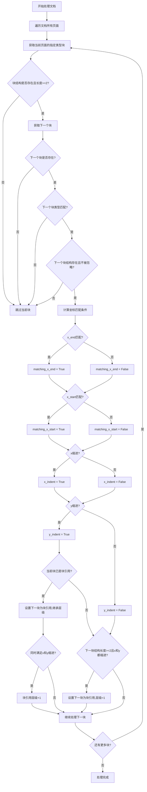

# `marker\marker\processors\blockquote.py` 详细设计文档

BlockquoteProcessor是一个文档处理器，用于通过分析文本块的坐标位置（水平缩进、起始x坐标对齐、y轴缩进）来识别和标记文档中的块引用内容。它继承自BaseProcessor，主要处理Text和TextInlineMath类型的块，并递归检查相邻块以确定块引用关系和层级。

## 整体流程



## 类结构

```
BaseProcessor (抽象基类)
└── BlockquoteProcessor (块引用处理器)
```

## 全局变量及字段


### `BlockquoteProcessor.block_types`
    
要处理的块类型

类型：`Tuple[BlockTypes]`
    


### `BlockquoteProcessor.min_x_indent`
    
视为块引用的最小水平缩进百分比

类型：`float`
    


### `BlockquoteProcessor.x_start_tolerance`
    
起始x坐标对齐的容差百分比

类型：`float`
    


### `BlockquoteProcessor.x_end_tolerance`
    
结束x坐标对齐的容差百分比

类型：`float`
    
    

## 全局函数及方法


### `BlockquoteProcessor.__init__`

这是BlockquoteProcessor类的初始化方法，负责调用父类BaseProcessor的构造函数来初始化处理器配置。

参数：

- `self`：`BlockquoteProcessor`，类的实例本身
- `config`：`Any`（未显式声明类型，从父类继承推断），配置对象，包含处理器所需的配置参数

返回值：`None`，该方法不返回任何值，仅执行初始化逻辑

#### 流程图

```mermaid
flowchart TD
    A[__init__ 方法被调用] --> B[接收 config 参数]
    B --> C[调用 super().__init__(config)]
    C --> D[继承自 BaseProcessor 的初始化逻辑]
    D --> E[初始化完成]
```

#### 带注释源码

```python
def __init__(self, config):
    """
    初始化 BlockquoteProcessor 实例。
    
    参数:
        config: 配置对象，包含处理器所需的配置参数
               该参数会被传递给父类 BaseProcessor 的 __init__ 方法
    
    返回:
        None
    """
    # 调用父类 BaseProcessor 的构造函数进行初始化
    # 这会设置 config 属性并执行父类的初始化逻辑
    super().__init__(config)
```


### `BlockquoteProcessor.__call__`

该方法用于标记文档中的块引用（Blockquote），通过遍历文档页面的每个块，检查连续块之间的水平对齐和缩进关系，根据预定义的容差阈值判断块是否属于块引用，并相应地设置 `blockquote` 和 `blockquote_level` 属性。

参数：

- `self`：实例本身，包含处理器的配置参数（`block_types`、`min_x_indent`、`x_start_tolerance`、`x_end_tolerance`）
- `document`：`Document`，待处理的文档对象，包含页面和块的层次结构

返回值：`None`，该方法直接修改 `document` 对象中块引用的相关属性，不返回任何值

#### 流程图

```mermaid
flowchart TD
    A[开始 __call__] --> B[遍历 document 的每一页]
    B --> C[遍历页面中符合 block_types 的每个块]
    C --> D{检查 block.structure 是否存在}
    D -->|否| C
    D -->|是| E{block.structure 长度 >= 2}
    E -->|否| C
    E -->|是| F[获取下一个块 next_block]
    F --> G{next_block 存在且类型符合}
    G -->|否| C
    G -->|是| H{next_block.structure 存在且不忽略输出}
    H -->|否| C
    H -->|是| I[计算匹配条件]
    I --> J[matching_x_end: |next.x_end - block.x_end| < 容差]
    I --> K[matching_x_start: |next.x_start - block.x_start| < 容差]
    I --> L[x_indent: next.x_start > block.x_start + 最小缩进]
    I --> M[y_indent: next.y_start > block.y_end]
    J --> N{block.blockquote 为真}
    N -->|是| O[设置 next_block.blockquote = matching条件 或 x_indent且y_indent]
    N -->|否| P{next结构长度>=2 且 x_indent且y_indent}
    O --> Q[设置 blockquote_level]
    P -->|是| R[设置 next_block.blockquote=True, blockquote_level=1]
    Q --> C
    R --> C
```

#### 带注释源码

```python
def __call__(self, document: Document):
    """
    处理文档中的块，识别并标记块引用（blockquote）。
    
    该方法通过检查连续块的对齐方式和缩进关系来判断是否为块引用。
    """
    # 遍历文档中的每一页
    for page in document.pages:
        # 遍历当前页中符合 block_types 条件的每个块
        for block in page.contained_blocks(document, self.block_types):
            # 跳过没有结构信息的块
            if block.structure is None:
                continue

            # 只处理结构长度 >= 2 的块（排除简单文本行）
            if not len(block.structure) >= 2:
                continue

            # 获取当前块的下一个块
            next_block = page.get_next_block(block)
            # 如果没有下一个块，跳过
            if next_block is None:
                continue
            # 如果下一个块的类型不在处理范围内，跳过
            if next_block.block_type not in self.block_types:
                continue
            # 如果下一个块没有结构信息，跳过
            if next_block.structure is None:
                continue
            # 如果下一个块被标记为忽略输出，跳过
            if next_block.ignore_for_output:
                continue

            # 计算 x 轴结束位置是否对齐（允许一定的容差）
            # 容差 = x_end_tolerance * 当前块宽度
            matching_x_end = abs(next_block.polygon.x_end - block.polygon.x_end) < self.x_end_tolerance * block.polygon.width
            
            # 计算 x 轴开始位置是否对齐
            matching_x_start = abs(next_block.polygon.x_start - block.polygon.x_start) < self.x_start_tolerance * block.polygon.width
            
            # 检查下一个块是否有水平缩进（向右偏移）
            # 下一个块的 x_start 大于当前块 x_start + 最小缩进距离
            x_indent = next_block.polygon.x_start > block.polygon.x_start + (self.min_x_indent * block.polygon.width)
            
            # 检查下一个块是否有垂直缩进（向下偏移）
            # 下一个块的 y_start 大于当前块的 y_end
            y_indent = next_block.polygon.y_start > block.polygon.y_end

            # 如果当前块已经是块引用
            if block.blockquote:
                # 根据对齐或缩进条件设置下一个块的 blockquote 标志
                next_block.blockquote = (matching_x_end and matching_x_start) or (x_indent and y_indent)
                # 继承当前块的块引用层级
                next_block.blockquote_level = block.blockquote_level
                # 如果同时满足水平和垂直缩进，增加块引用层级
                if (x_indent and y_indent):
                    next_block.blockquote_level += 1
            # 如果当前块不是块引用，但下一个块满足缩进条件
            elif len(next_block.structure) >= 2 and (x_indent and y_indent):
                # 将下一个块标记为块引用，层级为 1
                next_block.blockquote = True
                next_block.blockquote_level = 1
```

## 关键组件


### 块类型过滤（Block Type Filtering）

通过 `block_types` 属性定义要处理的文档块类型（Text 和 TextInlineMath），使用 `contained_blocks` 方法进行过滤遍历

### 几何对齐检测（Geometric Alignment Detection）

通过 `x_start_tolerance` 和 `x_end_tolerance` 参数判断连续块的起始和结束 x 坐标是否对齐（容差为块宽度的百分比）

### 缩进检测（Indent Detection）

通过 `min_x_indent` 参数检测水平缩进（水平方向）和垂直缩进（y 坐标增加），用于识别块引用层级结构

### 块引用标记（Blockquote Tagging）

根据对齐和缩进条件设置 `next_block.blockquote` 标志，将连续的块标记为块引用

### 块引用级别管理（Blockquote Level Management）

通过 `blockquote_level` 属性跟踪块引用的嵌套深度，遇到缩进时递增级别

### 惰性块遍历（Lazy Block Traversal）

使用 `page.get_next_block(block)` 方法按需获取下一个块，避免一次性加载所有块到内存


## 问题及建议


### 已知问题

-   **魔法数字**：代码中 `>= 2` 的判断没有使用具名常量，语义不清晰
-   **重复计算**：`block.polygon.width` 在同一轮循环中被多次计算（4次），造成性能开销
-   **缺乏参数验证**：配置参数（`min_x_indent`、`x_start_tolerance`、`x_end_tolerance`）未进行有效性校验，可能接受负值或大于1的值导致异常行为
-   **方法职责过重**：`__call__` 方法包含约25行逻辑，混合了遍历、条件判断和状态更新，可读性和可维护性较差
-   **缺少日志记录**：没有调试日志或追踪信息，难以排查块引用识别失败的原因
-   **类型注解不完整**：部分局部变量（如 `matching_x_end`、`matching_x_start`、`x_indent`、`y_indent`）缺少类型注解
-   **边界条件处理不足**：未处理 `document.pages` 为空或 `page.contained_blocks()` 返回空迭代器的情况

### 优化建议

-   将 `>= 2` 的判断提取为类常量 `MIN_STRUCTURE_LENGTH = 2`，增强可读性
-   在方法开始处将 `block.polygon.width` 缓存到局部变量，减少重复属性访问
-   在 `__init__` 中添加参数校验，确保 `min_x_indent`、`x_start_tolerance`、`x_end_tolerance` 在合理范围内（如 0-1 之间）
-   将 `__call__` 方法拆分为多个私有方法，如 `_is_aligned_with_previous`、`_should_extend_blockquote`、`_start_new_blockquote`，每个方法职责单一
-   添加 Python 标准日志记录器（`logging.getLogger(__name__)`）用于调试和监控
-   为局部变量补充类型注解，如 `matching_x_end: bool = ...`
-   在遍历前添加空值检查：`if not document.pages: return`

## 其它


### 设计目标与约束

该处理器旨在自动识别文档中的块引用（blockquote），通过分析块的水平和垂直位置关系来判断是否为块引用内容。设计约束包括：仅处理Text和TextInlineMath类型的块，要求块具有structure属性，且通过坐标容差来控制匹配的精确度。

### 错误处理与异常设计

代码中已包含基础的错误处理逻辑：
- 使用`if block.structure is None: continue`跳过无结构的块
- 使用`if not len(block.structure) >= 2: continue`过滤结构不完整的块
- 使用`if next_block is None: continue`处理无后续块的情况
- 使用`if next_block.ignore_for_output: continue`跳过被忽略的块
- 缺少对polygon属性为None的显式检查，可能导致AttributeError

### 数据流与状态机

处理器遍历Document对象中的所有Page，对每个Page中的符合block_types条件的Block进行迭代。对于每对相邻块，根据以下逻辑更新blockquote状态：
- 若当前块已是blockquote，根据坐标匹配或缩进条件设置下一块的blockquote和blockquote_level
- 若当前块不是blockquote但满足缩进条件，则将下一块标记为blockquote并设置level为1

### 外部依赖与接口契约

**依赖项：**
- `marker.processors.BaseProcessor`: 父类，提供处理器基础架构
- `marker.schema.BlockTypes`: 枚举类型，定义块类型
- `marker.schema.document.Document`: 文档对象模型，包含pages集合

**接口契约：**
- 输入：Document对象，需包含pages属性，每个page需支持contained_blocks()、get_next_block()方法
- 输出：修改Document中Block的blockquote和blockquote_level属性
- Block需具有polygon（含x_start、x_end、y_start、y_end、width属性）、structure、block_type、ignore_for_output属性

### 性能考虑

当前实现使用嵌套循环遍历所有块，对每个块调用get_next_block()和contained_blocks()，时间复杂度为O(n²)级别。可考虑优化：使用索引缓存减少重复查询，或使用一次遍历同时处理多个块。

### 配置参数说明

所有配置参数均通过Annotated类型标注：
- `block_types`: 默认为(Text, TextInlineMath)，控制处理的块类型范围
- `min_x_indent`: 默认为0.1（10%），最小水平缩进阈值
- `x_start_tolerance`: 默认为0.01（1%），起始坐标对齐容差
- `x_end_tolerance`: 默认为0.01（1%），结束坐标对齐容差

### 使用示例

```python
from marker.converters import get_model
from marker.processors import BlockquoteProcessor

# 初始化配置
config = {...}
processor = BlockquoteProcessor(config)

# 处理文档
doc = Document(...)
processor(doc)
# 处理后doc中的块引用已被标记
```

### 边界情况与限制

- 仅支持从左到右的文本布局，对RTL语言可能不适用
- 依赖块的structure属性长度>=2的条件判断
- 水平缩进判断使用固定的min_x_indent百分比，对不同字体大小或行宽的文档适应性有限
- 未处理跨越多页的块引用连续性

    