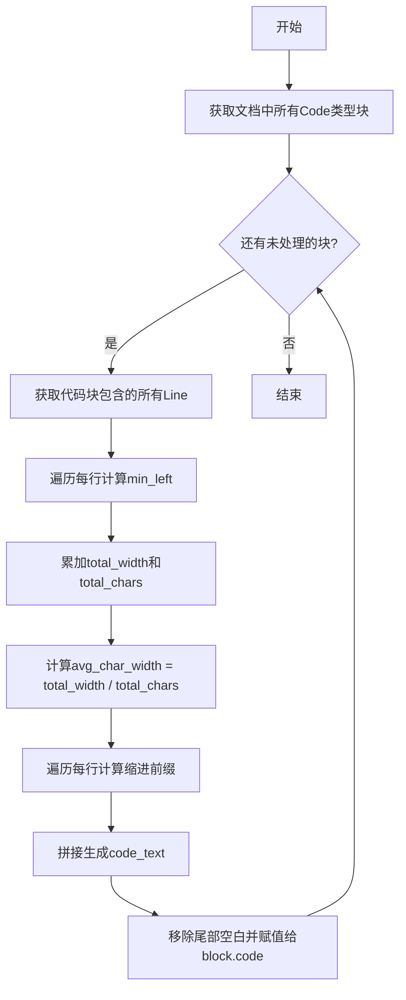
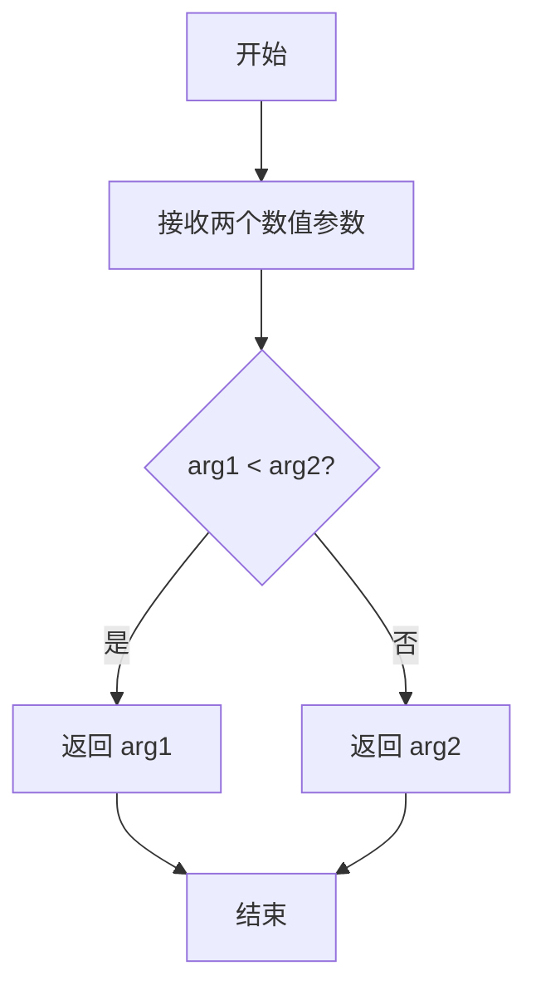
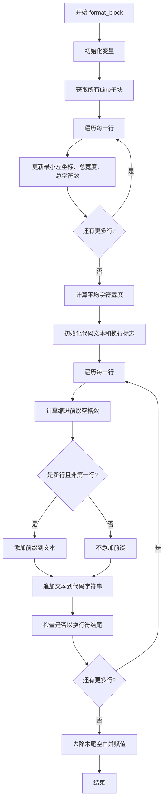
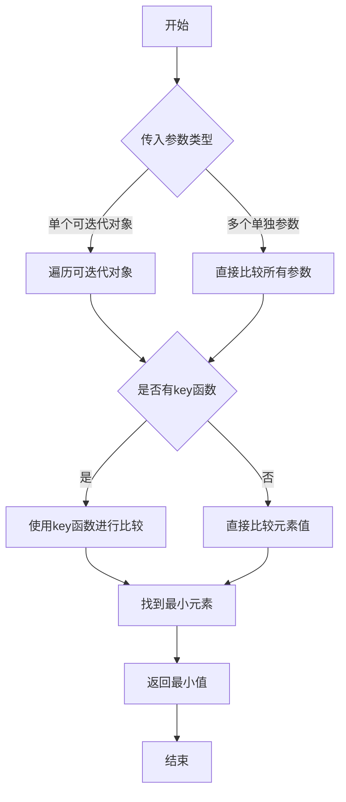
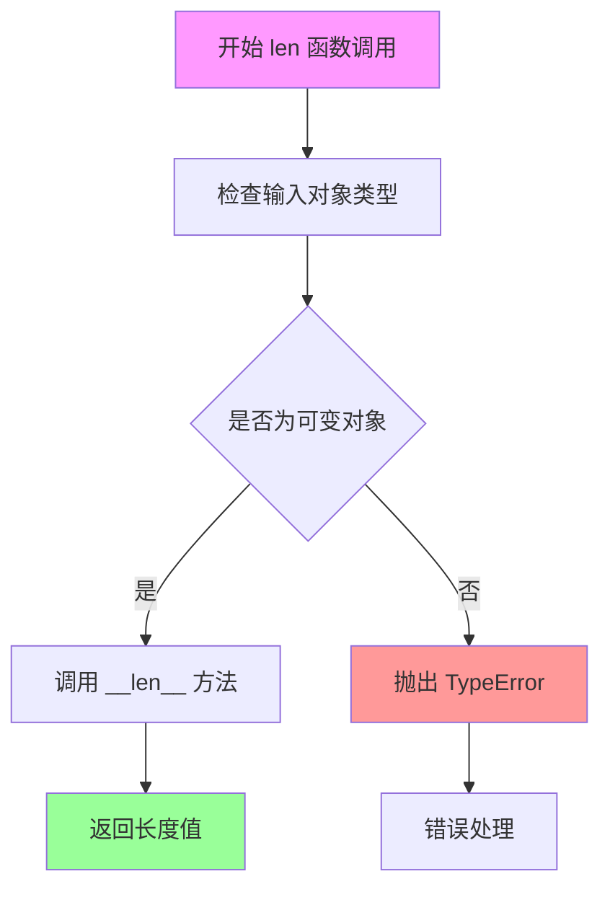
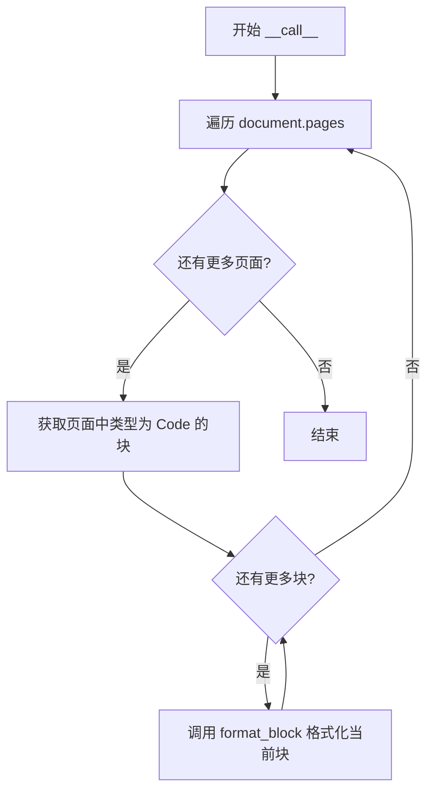

# `marker\marker\processors\code.py` 详细设计文档

CodeProcessor是一个代码块格式化处理器，继承自BaseProcessor，用于处理PDF文档中的代码块。它通过计算平均字符宽度来确定代码的缩进，并移除多余的空白字符，将原始代码文本规范化后存储到block.code属性中。

## 整体流程



## 类结构

```
BaseProcessor (基类)
└── CodeProcessor (代码块格式化处理器)
```

## 全局变量及字段


### `min_left`
    
代码块最左端x坐标

类型：`int`
    


### `total_width`
    
所有行的总宽度

类型：`float`
    


### `total_chars`
    
所有行的总字符数

类型：`int`
    


### `avg_char_width`
    
平均字符宽度

类型：`float`
    


### `code_text`
    
格式化后的代码文本

类型：`str`
    


### `is_new_line`
    
标记是否是新行

类型：`bool`
    


### `contained_lines`
    
代码块包含的Line块列表

类型：`list`
    


### `line`
    
当前迭代的Line对象

类型：`Line`
    


### `text`
    
当前行的文本

类型：`str`
    


### `prefix`
    
计算得到的缩进前缀空格

类型：`str`
    


### `total_spaces`
    
需要添加的空格数

类型：`int`
    


### `CodeProcessor.block_types`
    
处理的块类型，包含BlockTypes.Code

类型：`tuple`
    
    

## 全局函数及方法


### `min`

Python 内置函数，用于比较两个数值并返回较小的值。在该代码中用于计算代码块中所有行的最左侧 x 坐标。

参数：

-  `arg1`：`数值类型`，第一个要比较的值（当前为 `line.polygon.bbox[0]`，表示线条的左边界 x 坐标）
-  `arg2`：`数值类型`，第二个要比较的值（当前为 `min_left`，当前记录的最左 x 坐标）

返回值：`数值类型`，返回两个数值中较小的那个

#### 流程图



#### 带注释源码

```python
# 在 CodeProcessor.format_block 方法中使用 min() 函数
def format_block(self, document: Document, block: Code):
    min_left = 9999  # 初始化为较大值，用于记录最左边的 x 坐标
    total_width = 0
    total_chars = 0
    
    contained_lines = block.contained_blocks(document, (BlockTypes.Line,))
    for line in contained_lines:
        # min() 函数：比较当前行的左边界 x 坐标与当前最小值
        # 更新 min_left 为两者中的较小值
        min_left = min(line.polygon.bbox[0], min_left)
        total_width += line.polygon.width
        total_chars += len(line.raw_text(document))

    avg_char_width = total_width / max(total_chars, 1)
    # ... 后续代码用于格式化代码文本
```


### `CodeProcessor.format_block`

该方法用于格式化代码块，通过计算平均字符宽度来推断代码的缩进，并重新构建去除多余空白字符的代码文本。

参数：

- `document`：`Document`，包含完整文档数据的文档对象，用于获取块的原始文本
- `block`：`Code`，需要格式化的代码块对象

返回值：`None`，该方法直接修改 `block.code` 属性

#### 流程图



#### 带注释源码

```python
def format_block(self, document: Document, block: Code):
    # 初始化最小左坐标为较大值，用于找到最左边的列
    min_left = 9999  # will contain x- coord of column 0
    # 初始化总宽度和总字符数累加器
    total_width = 0
    total_chars = 0
    
    # 获取代码块中所有的行（Line类型子块）
    contained_lines = block.contained_blocks(document, (BlockTypes.Line,))
    
    # 第一遍循环：计算统计信息
    for line in contained_lines:
        # 更新最小左坐标（最左侧x坐标）
        min_left = min(line.polygon.bbox[0], min_left)
        # 累加每行的宽度
        total_width += line.polygon.width
        # 累加每行的字符数
        total_chars += len(line.raw_text(document))

    # 计算平均字符宽度，避免除零错误
    avg_char_width = total_width / max(total_chars, 1)
    
    # 初始化结果字符串和换行标志
    code_text = ""
    is_new_line = False
    
    # 第二遍循环：构建格式化的代码文本
    for line in contained_lines:
        # 获取该行的原始文本
        text = line.raw_text(document)
        
        if avg_char_width == 0:
            # 如果平均宽度为0，无缩进
            prefix = ""
        else:
            # 计算该行相对于最小左坐标的空格数
            # 使用int()将计算结果转换为整数（类型转换）
            total_spaces = int((line.polygon.bbox[0] - min_left) / avg_char_width)
            # 生成对应数量的空格前缀
            prefix = " " * max(0, total_spaces)

        # 如果是新行（非第一行），在文本前添加缩进前缀
        if is_new_line:
            text = prefix + text

        # 追加文本到结果字符串
        code_text += text
        # 检查当前文本是否以换行符结尾
        is_new_line = text.endswith("\n")

    # 去除代码末尾的空白字符，并赋值回块对象
    block.code = code_text.rstrip()
```


### `min()`

Python内置函数min()用于获取可迭代对象中的最小值，或者比较两个或多个参数返回最小值。

参数：

-  `*iterables`：可迭代对象（如列表、元组、集合等），或者多个要比较的值
-  `key`：可选关键字参数，指定比较的键函数
-  `default`：可选关键字参数，当可迭代对象为空时返回的默认值

返回值：返回可迭代对象中的最小值，或者多个参数中的最小值

#### 流程图



#### 带注释源码

```python
# 代码中min()的使用示例
min_left = min(line.polygon.bbox[0], min_left)
# min_left: 整型变量，存储当前找到的最小x坐标
# line.polygon.bbox[0]: 当前行的x坐标（ bounding box的左边界）
# min_left: 之前找到的最小x坐标
# 返回值: 两个值中的较小者，更新min_left为当前行的左边界或之前的最小值
```


### `len(line.raw_text(document))`

这是一个 Python 内置函数调用，用于获取代码中文本行的字符长度。在 `CodeProcessor` 类的 `format_block` 方法中，该函数用于计算每行代码的字符数，以便估算平均字符宽度，从而正确计算代码的缩进空格数。

参数：

-  `line.raw_text(document)`：`str`，通过 `raw_text` 方法获取的文本行内容

返回值：`int`，返回文本行的字符数量

#### 流程图



#### 带注释源码

```python
# 使用 len() 获取文本行的字符长度
# line.raw_text(document) 返回该行的文本内容（字符串类型）
# len() 函数接受一个序列或集合参数，返回其元素数量
total_chars += len(line.raw_text(document))

# 具体流程：
# 1. line.raw_text(document) 方法被调用，返回该行的原始文本字符串
# 2. len() 函数接收这个字符串参数
# 3. 字符串在 Python 中实现了 __len__ 方法
# 4. len() 函数返回字符串的字符数量（整数）
# 5. 这个数量被累加到 total_chars 变量中
# 
# 后续用途：
# - total_chars 用于计算平均字符宽度 avg_char_width
# - avg_char_width 用于计算代码的缩进空格数
# - 这样可以正确保留原代码的缩进格式
```

#### 在上下文中的使用说明

在 `CodeProcessor.format_block` 方法中，`len()` 函数的完整上下文如下：

```python
# 遍历代码块中的所有行
for line in contained_lines:
    # 收集每行的信息用于后续计算
    min_left = min(line.polygon.bbox[0], min_left)  # 找到最左边的x坐标
    total_width += line.polygon.width               # 累加所有行的宽度
    # 使用 len() 获取每行文本的字符数量
    total_chars += len(line.raw_text(document))     # 累加总字符数

# 计算平均字符宽度（用于估算缩进）
avg_char_width = total_width / max(total_chars, 1)
```


### `CodeProcessor.__call__`

该方法是 `CodeProcessor` 类的主入口，用于处理文档中所有代码块。它遍历文档的每一页，筛选出类型为 `Code` 的块，并调用 `format_block` 方法对每个代码块进行格式化处理。

参数：

- `self`：`CodeProcessor` 实例，当前处理器对象本身
- `document`：`Document`，需要处理的文档对象，包含页面和块结构

返回值：`None`，该方法直接修改文档对象中的代码块内容，无返回值

#### 流程图



#### 带注释源码

```python
def __call__(self, document: Document):
    """
    处理文档中所有代码块的主入口
    """
    # 遍历文档中的每一页
    for page in document.pages:
        # 获取当前页中类型为 Code 的所有块
        for block in page.contained_blocks(document, self.block_types):
            # 对每个代码块调用格式化方法
            self.format_block(document, block)
```


### `CodeProcessor.format_block`

该方法负责将 PDF 文档中的代码块从布局格式转换为纯文本格式，通过计算行间距和平均字符宽度来还原代码的缩进结构，最终将格式化后的代码文本存储到代码块对象中。

参数：

- `self`：`CodeProcessor`，调用此方法的处理器实例本身
- `document`：`Document`，文档对象，包含了所有页面和块的结构信息，用于查询行的文本和几何信息
- `block`：`Code`，需要格式化的代码块对象，最终会将处理后的代码文本赋值给其 `code` 属性

返回值：`None`，该方法无返回值，结果直接修改 `block.code` 属性

#### 流程图

```mermaid
flowchart TD
    A[开始 format_block] --> B[初始化变量<br/>min_left=9999<br/>total_width=0<br/>total_chars=0]
    B --> C[获取代码块包含的所有行<br/>contained_lines = block.contained_blocks]
    C --> D[遍历每一行]
    D --> E[更新最小左边界<br/>min_left = min当前行左边界]
    E --> F[累加行宽度<br/>total_width += 行宽度]
    F --> G[累加字符数<br/>total_chars += 行文本长度]
    D --> H[计算平均字符宽度<br/>avg_char_width = total_width / max总字符数]
    H --> I[初始化构建变量<br/>code_text = ''<br/>is_new_line = False]
    I --> J[遍历每一行进行文本构建]
    J --> K[计算缩进空格数<br/>total_spaces = (当前行左边界 - min_left) / avg_char_width]
    K --> L{平均字符宽度是否为0?}
    L -->|是| M[prefix = '']
    L -->|否| N[prefix = ' ' * max总空格数]
    N --> O{is_new_line?}
    M --> O
    O -->|是| P[text = prefix + text 添加缩进前缀]
    O -->|否| Q[保持原文本]
    P --> R[code_text += text]
    Q --> R
    R --> S[更新is_new_line<br/>is_new_line = text.endswith换行符]
    J --> T[遍历完成]
    T --> U[去除尾部空白并赋值<br/>block.code = code_text.rstrip]
    U --> V[结束]
```

#### 带注释源码

```python
def format_block(self, document: Document, block: Code):
    """
    格式化单个代码块，将布局格式的代码转换为带正确缩进的纯文本
    
    Args:
        document: Document对象，包含文档的完整结构，用于查询块的文本和几何信息
        block: Code对象，需要被格式化的代码块，结果会写入block.code属性
    """
    
    # 初始化变量：min_left用于记录最左边的x坐标（即列0位置）
    # total_width累计所有行的宽度，total_chars累计所有行的字符总数
    min_left = 9999  # will contain x- coord of column 0
    total_width = 0
    total_chars = 0
    
    # 获取代码块中包含的所有行（Line类型的块）
    contained_lines = block.contained_blocks(document, (BlockTypes.Line,))
    
    # 第一遍遍历：计算布局参数
    # 找到最左边界、累计总宽度和总字符数，用于计算平均字符宽度
    for line in contained_lines:
        # line.polygon.bbox[0] 是行的左边界x坐标
        min_left = min(line.polygon.bbox[0], min_left)
        # 累加每行的宽度（像素）
        total_width += line.polygon.width
        # 累加每行的字符数量
        total_chars += len(line.raw_text(document))

    # 计算平均字符宽度，用于估算缩进空格数
    # 使用max(total_chars, 1)避免除零错误
    avg_char_width = total_width / max(total_chars, 1)
    
    # 初始化文本构建变量
    code_text = ""
    is_new_line = False
    
    # 第二遍遍历：根据计算的平均字符宽度构建带缩进的代码文本
    for line in contained_lines:
        # 获取该行的原始文本
        text = line.raw_text(document)
        
        # 计算缩进前缀的空格数
        if avg_char_width == 0:
            # 如果平均字符宽度为0（空行情况），不使用缩进
            prefix = ""
        else:
            # 当前行左边界与最左边的差值，除以平均字符宽度，得到需要插入的空格数
            total_spaces = int((line.polygon.bbox[0] - min_left) / avg_char_width)
            # 生成对应数量的空格字符串，确保非负
            prefix = " " * max(0, total_spaces)

        # 如果是新的一行（在上一行有换行符），需要添加缩进前缀
        if is_new_line:
            text = prefix + text

        # 追加当前行的文本
        code_text += text
        
        # 判断当前行是否以换行符结尾，决定下一行是否需要添加缩进
        is_new_line = text.endswith("\n")

    # 去除代码文本末尾的空白字符（包括可能的最后换行符），并赋值给代码块
    block.code = code_text.rstrip()
```

## 关键组件


### CodeProcessor 类

负责格式化代码块的处理器，继承自 BaseProcessor，通过遍历文档中的代码块并调用 format_block 方法进行格式化处理。

### format_block 方法

核心格式化逻辑，计算代码块的平均字符宽度并根据行的位置信息添加适当的空格缩进，最终将处理后的代码文本赋值给 block.code 属性。

### 字符宽度计算逻辑

通过遍历代码块中的所有行，计算总宽度和总字符数，从而得出平均字符宽度，用于后续的缩进计算。

### 行前缀计算逻辑

根据每行相对于最左边的 x 坐标和平均字符宽度，计算需要添加的前导空格数量，实现代码的缩进对齐。

### 代码文本组装逻辑

遍历所有行，按顺序拼接文本内容，处理换行符以确保正确的代码格式，最终去除尾部空白字符。

### BlockTypes.Code 块类型识别

定义了处理的块类型为 Code 类型，通过 block_types 元组指定要处理的文档块类型。

### 潜在技术债务与优化空间

1. 硬编码的初始最小值 9999 可能导致在某些边界情况下的问题
2. avg_char_width 为 0 时的处理逻辑可以更优雅
3. 缺少对空代码块或无效输入的显式错误处理
4. 没有缓存机制，重复调用时可能存在性能优化空间


## 问题及建议


### 已知问题

- 硬编码魔数问题：`min_left = 9999` 使用了硬编码的魔数，应使用 `float('inf')` 替代以提高代码可读性和正确性
- 字符串拼接性能问题：使用 `code_text += text` 进行字符串拼接，在循环中效率低下，应使用列表或 `io.StringIO`
- 重复计算：`line.raw_text(document)` 和 `line.polygon.bbox[0]` 在不同循环中被多次调用，未缓存结果
- 边界处理不完善：当 `avg_char_width` 为 0 时，逻辑不清晰，可能导致缩进计算错误
- 换行符处理逻辑缺陷：`is_new_line` 的判断在循环末尾，导致最后一行即使应该换行也可能被遗漏
- 尾随空格处理不当：`code_text.rstrip()` 会移除代码末尾的所有空格，可能影响代码语义（如字符串字面量中的空格）
- 类型注解缺失：方法缺少返回类型注解

### 优化建议

- 将 `min_left = 9999` 改为 `min_left = float('inf')`
- 使用 `io.StringIO()` 或列表 `append + join` 替代字符串拼接
- 在循环外预先缓存 `line.raw_text(document)` 和 `line.polygon.bbox[0]` 的值
- 添加对空 `contained_lines` 的提前返回处理
- 重新设计换行符逻辑，确保每行都正确处理
- 考虑使用 `rstrip('\n')` 替代 `rstrip()` 以保留有意义的尾随空格
- 为所有方法添加适当的类型注解

## 其它


### 设计目标与约束

本代码的目标是将PDF文档中分离的代码块重新组装成格式正确的代码文本。主要约束包括：1) 仅处理BlockTypes.Code类型的块；2) 假设代码块的行以Line类型块呈现；3) 依赖polygon.bbox进行坐标计算；4) 处理空代码块时使用max(total_chars, 1)避免除零错误。

### 错误处理与异常设计

代码中已处理除零异常（avg_char_width == 0或total_chars为0的情况）。潜在错误场景：1) document.pages为空时不会执行任何操作；2) block.contained_blocks返回空列表时avg_char_width为0，prefix为空字符串；3) Line块缺少polygon属性时会导致AttributeError；4) line.raw_text(document)返回None时的处理缺失。

### 数据流与状态机

数据流：Document → Page遍历 → Code块筛选 → Line块遍历 → 坐标统计 → 平均字符宽度计算 → 文本重组 → 赋值给block.code。状态机包含：初始化状态（计算统计信息）→ 迭代状态（逐行处理）→ 完成状态（rstrip清理）。

### 外部依赖与接口契约

依赖项：1) marker.processors.BaseProcessor - 处理器基类；2) marker.schema.BlockTypes - 块类型枚举；3) marker.schema.blocks.Code - 代码块类；4) marker.schema.document.Document - 文档类。接口契约：__call__方法接收Document对象并原地修改block.code属性；format_block方法为私有方法，接收Document和Code对象。

### 性能考虑

时间复杂度为O(n)，n为代码块总行数。性能瓶颈：1) 多次调用contained_blocks可能产生迭代器重新遍历；2) 字符串拼接使用+=在Python中效率较低，建议使用list和join；3) polygon.bbox和raw_text的重复调用可考虑缓存。

### 安全性考虑

代码不涉及用户输入处理、文件访问或网络请求，安全性风险较低。主要风险：1) raw_text返回非字符串类型时的类型处理；2) 极端坐标值（如min_left初始化为9999）可能导致整数溢出。

### 测试策略

建议测试用例：1) 空文档或无代码块文档；2) 单行代码块；3) 多行无缩进代码块；4) 多行有缩进代码块；5) 包含特殊字符（制表符、unicode）的代码块；6) avg_char_width为0的边界情况；7) Line块缺失polygon属性的异常情况。

### 配置与可扩展性

block_types类属性定义了处理的块类型，可通过子类继承修改。format_block方法可被子类重写以实现不同的格式化逻辑。潜在扩展：支持自定义缩进字符、支持代码语言检测、添加行号处理。

### 并发与线程安全

代码为单线程设计，不涉及共享状态修改。Document对象的修改非线程安全，在多线程环境下需确保document对象的访问同步。

### 日志与监控

代码缺少日志记录。建议添加：1) 处理代码块数量的统计日志；2) 异常情况（如空代码块、计算异常）的警告日志；3) 性能监控（处理时间）。

    