# `marker\marker\processors\debug.py` 详细设计文档

这是一个文档调试处理器，用于在文档转换过程中生成可视化调试图像和JSON数据，帮助开发者分析和调试文档布局、PDF渲染和块结构等信息。

## 整体流程

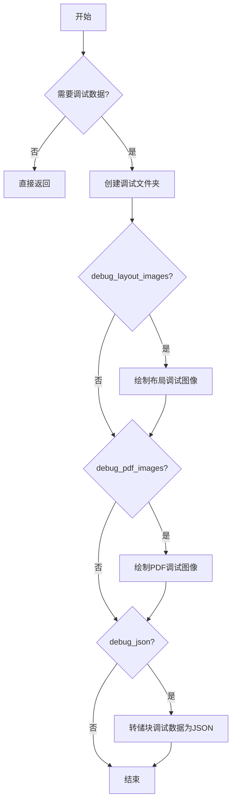

## 类结构

```
BaseProcessor (抽象基类)
└── DebugProcessor (调试处理器)
```

## 全局变量及字段


### `logger`
    
日志记录器实例，用于记录调试信息

类型：`logging.Logger`
    


### `DebugProcessor.block_types`
    
要处理的块类型，默认为空元组

类型：`Annotated[tuple, str, str]`
    


### `DebugProcessor.debug_data_folder`
    
调试数据转储文件夹

类型：`Annotated[str, str]`
    


### `DebugProcessor.debug_layout_images`
    
是否转储布局调试图像

类型：`Annotated[bool, str]`
    


### `DebugProcessor.debug_pdf_images`
    
是否转储PDF调试图像

类型：`Annotated[bool, str]`
    


### `DebugProcessor.debug_json`
    
是否转储块调试数据

类型：`Annotated[bool, str]`
    


### `DebugProcessor.debug_folder`
    
当前文档调试数据文件夹路径

类型：`str`
    
    

## 全局函数及方法


### `get_logger`

获取一个日志记录器实例，用于在项目中记录日志信息。

参数：

- 无

返回值：`logging.Logger`，返回一个 Python 标准库的日志记录器对象，可调用 `info()`、`warning()`、`error()` 等方法记录不同级别的日志。

#### 流程图

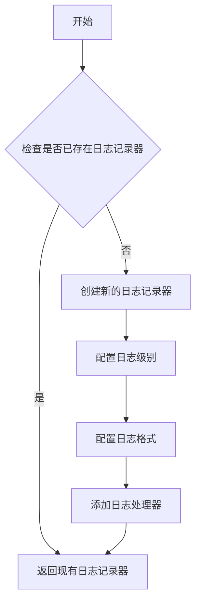

#### 带注释源码

```python
# 从 marker.logger 模块导入 get_logger 函数
# 该函数负责获取或创建一个日志记录器实例
from marker.logger import get_logger

# 调用 get_logger() 获取日志记录器
# 返回的 logger 是 Python 标准库 logging 模块的 Logger 对象
logger = get_logger()

# 之后可以使用 logger 的各种方法记录日志：
# - logger.info() 记录信息级别日志
# - logger.warning() 记录警告级别日志
# - logger.error() 记录错误级别日志
# - logger.debug() 记录调试级别日志
#
# 示例用法：
logger.info(f"Dumped layout debug images to {self.debug_data_folder}")
logger.info(f"Dumped PDF debug images to {self.debug_data_folder}")
logger.info(f"Dumped block debug data to {self.debug_data_folder}")
```

> **注意**：由于 `get_logger` 函数定义在外部模块 `marker.logger` 中，源码未在此文件中展示。上述源码展示了该函数在此模块中的导入和使用方式。根据使用方式推断，该函数返回一个配置好的 Python `logging.Logger` 实例，支持标准的日志记录方法。


### `Image.new`

在 `draw_layout_debug_images` 方法中调用 `Image.new()` 创建一个新的空白 RGB 图像，用于绘制布局调试信息。

参数：

- `mode`：`str`，图像模式，此处为 `"RGB"` 表示 RGB 彩色图像
- `size`：`tuple[int, int]`，图像尺寸，从 `page.get_image(highres=True).size` 获取
- `color`：`str`，背景颜色，此处为 `"white"` 表示白色背景

返回值：`PIL.Image.Image`，新创建的空白图像对象，用于后续绘制调试信息

#### 流程图

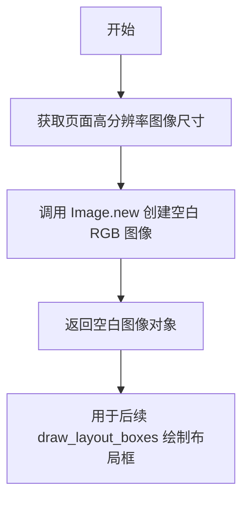

#### 带注释源码

```python
def draw_layout_debug_images(self, document: Document, pdf_mode=False):
    for page in document.pages:
        # 获取页面的高分辨率图像尺寸
        img_size = page.get_image(highres=True).size
        
        # 创建一个空白 RGB 图像，背景为白色
        # mode: "RGB" 表示 RGB 彩色模式
        # size: img_size 来自页面图像的实际尺寸
        # color: "white" 设置背景色为白色
        png_image = Image.new("RGB", img_size, color="white")

        # ... 后续使用 png_image 进行绘制调试信息
```


### `ImageDraw.Draw()`

`ImageDraw.Draw()` 是 PIL (Pillow) 库中的函数，用于创建一个与指定图像关联的绘图对象（ImageDraw 实例），以便在该图像上进行绘制操作（如矩形、文本、线条等）。

参数：

-  `image`：`PIL.Image.Image`，需要进行绘制的目标图像对象

返回值：`PIL.ImageDraw.ImageDraw`，返回与输入图像关联的绘图对象，可用于后续的绘制方法调用

#### 流程图

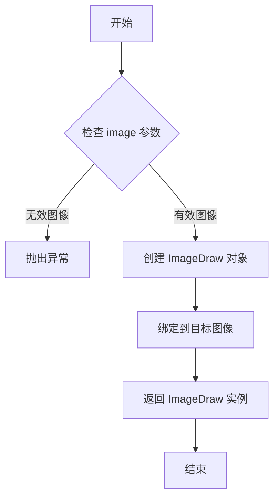

#### 带注释源码

```python
# 在 DebugProcessor.render_on_image 方法中使用 ImageDraw.Draw()

def render_on_image(
    self,
    bboxes,
    image,
    labels=None,
    label_offset=1,
    label_font_size=10,
    color: str | list = "red",
    draw_bbox=True,
):
    # 创建 ImageDraw 绘图对象
    # 参数：image - 需要绑定的目标图像（PIL Image 对象）
    # 返回值：ImageDraw 实例，可在该图像上绘制形状和文本
    draw = ImageDraw.Draw(image)
    
    # 加载字体文件
    font_path = settings.FONT_PATH
    label_font = ImageFont.truetype(font_path, label_font_size)

    # 遍历所有边界框进行绘制
    for i, bbox in enumerate(bboxes):
        bbox = [int(p) for p in bbox]
        if draw_bbox:
            # 绘制矩形边界框
            draw.rectangle(
                bbox,
                outline=color[i] if isinstance(color, list) else color,
                width=1,
            )

        # 如果有标签，则绘制文本标签
        if labels is not None:
            label = labels[i]
            text_position = (bbox[0] + label_offset, bbox[1] + label_offset)
            text_size = self.get_text_size(label, label_font)
            if text_size[0] <= 0 or text_size[1] <= 0:
                continue
            # 绘制文本背景框
            box_position = (
                text_position[0],
                text_position[1],
                text_position[0] + text_size[0],
                text_position[1] + text_size[1],
            )
            draw.rectangle(box_position, fill="white")
            # 绘制文本
            draw.text(
                text_position,
                label,
                fill=color[i] if isinstance(color, list) else color,
                font=label_font,
            )

    return image
```

#### 补充说明

| 项目 | 说明 |
|------|------|
| **调用位置** | `DebugProcessor.render_on_image()` 方法第 193 行 |
| **依赖库** | PIL (Pillow) |
| **使用场景** | 在调试过程中可视化文档布局和 PDF 内容的边界框 |
| **绘制能力** | 支持矩形、文本、线条、椭圆等基本图形绘制 |


### `ImageFont.truetype()`

加载指定的TrueType字体文件并返回一个字体对象，该对象可用于在PIL图像上绘制文本。

参数：

- `font_path`：`str`，字体文件的路径，通常从设置中获取（settings.FONT_PATH）
- `font_size`：`int`，字体的大小，以磅（points）为单位

返回值：`ImageFont.FreeTypeFont`，PIL的FreeType字体对象，可用于`ImageDraw`对象的文本绘制方法

#### 流程图

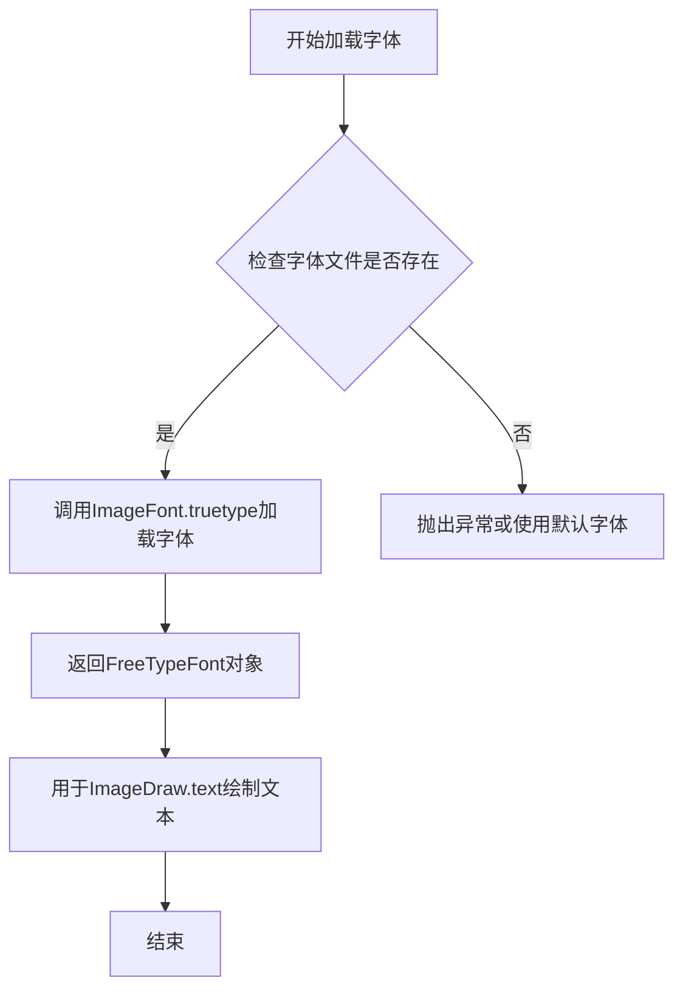

#### 带注释源码

```python
def render_on_image(
    self,
    bboxes,
    image,
    labels=None,
    label_offset=1,
    label_font_size=10,
    color: str | list = "red",
    draw_bbox=True,
):
    """
    在图像上渲染边界框和标签
    
    参数:
        bboxes: 边界框列表
        image: PIL图像对象
        labels: 可选的标签列表
        label_offset: 标签偏移量
        label_font_size: 字体大小
        color: 边框颜色
        draw_bbox: 是否绘制边界框
    """
    draw = ImageDraw.Draw(image)
    font_path = settings.FONT_PATH  # 从设置获取字体路径
    # 加载TrueType字体文件
    # font_path: 字体文件路径
    # label_font_size: 字体大小
    label_font = ImageFont.truetype(font_path, label_font_size)

    for i, bbox in enumerate(bboxes):
        bbox = [int(p) for p in bbox]
        if draw_bbox:
            draw.rectangle(
                bbox,
                outline=color[i] if isinstance(color, list) else color,
                width=1,
            )

        if labels is not None:
            label = labels[i]
            text_position = (bbox[0] + label_offset, bbox[1] + label_offset)
            # 使用加载的字体对象获取文本尺寸
            text_size = self.get_text_size(label, label_font)
            if text_size[0] <= 0 or text_size[1] <= 0:
                continue
            box_position = (
                text_position[0],
                text_position[1],
                text_position[0] + text_size[0],
                text_position[1] + text_size[1],
            )
            draw.rectangle(box_position, fill="white")
            # 使用加载的字体对象绘制文本
            draw.text(
                text_position,
                label,
                fill=color[i] if isinstance(color, list) else color,
                font=label_font,
            )

    return image
```


### DebugProcessor.__call__

这是一个调试处理器方法，当作为可调用对象被调用时，会将文档的调试数据（如布局可视化图像、PDF页面图像、JSON块数据）导出到指定文件夹，以便开发者检查文档处理过程中的中间结果。

参数：

- `document`：`Document`，要处理的文档对象，包含文件路径和页面信息

返回值：`None`，无返回值（该方法直接修改document的debug_data_path属性并写入调试文件）

#### 流程图

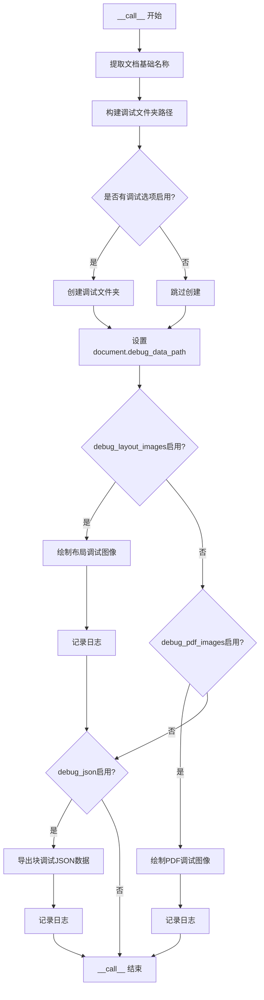

#### 带注释源码

```python
def __call__(self, document: Document):
    # 从文档路径中提取文件名，去掉扩展名作为基础名称
    # 例如："/path/to/document.pdf" -> "document"
    doc_base = os.path.basename(document.filepath).rsplit(".", 1)[0]
    
    # 拼接调试数据文件夹的完整路径
    # 格式：debug_data/{文档名}
    self.debug_folder = os.path.join(self.debug_data_folder, doc_base)
    
    # 检查是否启用了任何调试功能
    # 如果启用了布局图像、PDF图像或JSON调试中的任一选项
    if any([self.debug_layout_images, self.debug_pdf_images, self.debug_json]):
        # 创建调试文件夹（如果不存在则创建，包含父目录）
        os.makedirs(self.debug_folder, exist_ok=True)

    # 将调试文件夹路径存储到文档对象中，供其他组件使用
    document.debug_data_path = self.debug_folder

    # 如果启用了布局调试图像选项
    if self.debug_layout_images:
        # 调用内部方法绘制并保存布局调试图像
        self.draw_layout_debug_images(document)
        # 记录日志信息，包含调试数据的目标文件夹路径
        logger.info(f"Dumped layout debug images to {self.debug_data_folder}")

    # 如果启用了PDF调试图像选项
    if self.debug_pdf_images:
        # 调用内部方法绘制并保存PDF页面调试图像
        self.draw_pdf_debug_images(document)
        # 记录日志信息
        logger.info(f"Dumped PDF debug images to {self.debug_data_folder}")

    # 如果启用了JSON调试数据选项
    if self.debug_json:
        # 调用内部方法导出文档块的结构化调试数据为JSON
        self.dump_block_debug_data(document)
        # 记录日志信息
        logger.info(f"Dumped block debug data to {self.debug_data_folder}")
```


### `DebugProcessor.draw_pdf_debug_images`

该方法用于生成PDF页面的调试图像，它遍历文档的每一页，获取高分辨率图像，提取页面中所有未移除的Line和Span元素的边界框信息，然后将这些边界框渲染到图像上，最后将带有调试信息的图像保存到指定的调试文件夹中。

参数：

- `document`：`Document`，需要生成PDF调试图像的文档对象

返回值：`None`，无返回值，该方法直接保存调试图像文件到磁盘

#### 流程图

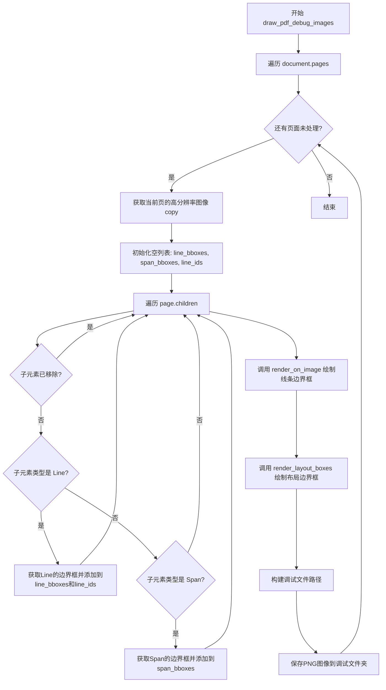

#### 带注释源码

```python
def draw_pdf_debug_images(self, document: Document):
    """
    绘制并保存PDF调试图像。
    
    该方法遍历文档的每一页，获取页面的高分辨率图像，
    然后提取页面中所有Line和Span元素的边界框信息，
    并将这些调试信息渲染到图像上，最后保存到指定的调试文件夹。
    
    参数:
        document: Document - 包含页面数据的文档对象
        
    返回:
        None - 直接将调试图像写入磁盘，不返回任何值
    """
    # 遍历文档中的每一页
    for page in document.pages:
        # 获取当前页面的高分辨率图像，并创建副本以避免修改原始图像
        # get_image(highres=True) 返回PIL Image对象
        png_image = page.get_image(highres=True).copy()

        # 初始化用于存储边界框和ID的列表
        line_bboxes = []      # 存储所有Line块的边界框
        span_bboxes = []      # 存储所有Span块的边界框
        line_ids = []         # 存储所有Line块的ID
        
        # 遍历页面的所有子元素
        for child in page.children:
            # 跳过已被移除的块
            if child.removed:
                continue

            # 处理Line类型的块
            if child.block_type == BlockTypes.Line:
                # 将Line的多边形坐标从页面坐标系重新缩放到图像坐标系
                # 获取边界框 (x_min, y_min, x_max, y_max) 格式
                bbox = child.polygon.rescale(page.polygon.size, png_image.size).bbox
                line_bboxes.append(bbox)
                # 记录Line块的唯一标识符
                line_ids.append(child.block_id)
            
            # 处理Span类型的块
            elif child.block_type == BlockTypes.Span:
                # 同样进行坐标系的重新缩放
                bbox = child.polygon.rescale(page.polygon.size, png_image.size).bbox
                span_bboxes.append(bbox)

        # 调用render_on_image方法在图像上绘制线条边界框
        # 参数说明:
        #   - line_bboxes: 要绘制的边界框列表
        #   - png_image: 目标图像
        #   - color="blue": 边界框颜色为蓝色
        #   - draw_bbox=True: 绘制矩形边界框
        #   - label_font_size=24: 标签字体大小为24
        #   - labels: 将line_ids转换为字符串列表作为标签
        self.render_on_image(
            line_bboxes,
            png_image,
            color="blue",
            draw_bbox=True,
            label_font_size=24,
            labels=[str(i) for i in line_ids],
        )

        # 渲染布局盒子（除Line和Span之外的其他块类型）
        png_image = self.render_layout_boxes(page, png_image)

        # 构建调试文件的保存路径
        # 格式: debug_folder/pdf_page_{page_id}.png
        debug_file = os.path.join(self.debug_folder, f"pdf_page_{page.page_id}.png")
        
        # 将处理后的图像保存到指定路径
        png_image.save(debug_file)
```


### `DebugProcessor.draw_layout_debug_images`

该方法用于为文档的每一页生成布局调试图像，将页面中的文本行以标签形式绘制在白色背景图像上，并叠加显示布局框（段落、表格等），最终保存为PNG格式的调试图像。

参数：

- `document`：`Document`，需要进行布局调试图像绘制的文档对象
- `pdf_mode`：`bool`，默认为False，PDF模式标志（当前实现中未使用，保留以备扩展）

返回值：`None`，该方法无返回值，直接将调试图像写入磁盘

#### 流程图

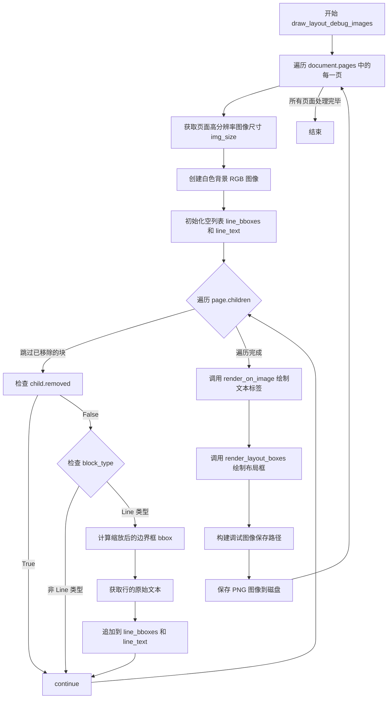

#### 带注释源码

```python
def draw_layout_debug_images(self, document: Document, pdf_mode=False):
    """
    为文档的每一页生成布局调试图像。
    
    该方法遍历文档的所有页面，为每一页创建一个包含文本行标签
    和布局框的调试图像，并保存到指定的调试文件夹中。
    
    参数:
        document: Document 对象，包含需要绘制调试图像的文档数据
        pdf_mode: bool，PDF模式标志，当前版本中未使用
    """
    # 遍历文档中的每一页
    for page in document.pages:
        # 获取页面高分辨率图像的尺寸 (width, height)
        img_size = page.get_image(highres=True).size
        
        # 创建一个白色背景的RGB图像，用于绘制调试信息
        png_image = Image.new("RGB", img_size, color="white")

        # 初始化列表用于存储行的边界框和对应的文本
        line_bboxes = []
        line_text = []
        
        # 遍历页面中的所有子块
        for child in page.children:
            # 跳过已被移除的块
            if child.removed:
                continue

            # 只处理 Line 类型的块（文本行）
            if child.block_type != BlockTypes.Line:
                continue

            # 将行的多边形坐标从页面坐标系缩放到图像坐标系，并获取边界框
            bbox = child.polygon.rescale(page.polygon.size, img_size).bbox
            line_bboxes.append(bbox)
            
            # 获取该行的原始文本内容
            line_text.append(child.raw_text(document))

        # 调用 render_on_image 方法在图像上绘制文本标签
        # 使用黑色文本，不绘制边界框，字体大小为24
        self.render_on_image(
            line_bboxes,
            png_image,
            labels=line_text,
            color="black",
            draw_bbox=False,
            label_font_size=24,
        )

        # 调用 render_layout_boxes 方法在图像上绘制布局框
        # 包括段落、表格等结构，用红色绘制边界框，绿色绘制顺序编号
        png_image = self.render_layout_boxes(page, png_image)

        # 构建调试图像的保存路径，格式为: debug_folder/layout_page_{page_id}.png
        debug_file = os.path.join(
            self.debug_folder, f"layout_page_{page.page_id}.png"
        )
        
        # 将图像保存为PNG格式
        png_image.save(debug_file)
```


### `DebugProcessor.render_layout_boxes`

该方法用于在给定的页面图像上渲染布局调试信息，包括布局块的边界框和顺序标签，以便可视化文档的布局结构。

参数：

- `page`：对象，页面对象，包含文档页面的结构信息（如 `structure` 属性和 `polygon` 属性），用于获取布局块
- `png_image`：`PIL.Image`，需要进行布局渲染的图像对象

返回值：`PIL.Image`，渲染布局信息后的图像对象

#### 流程图

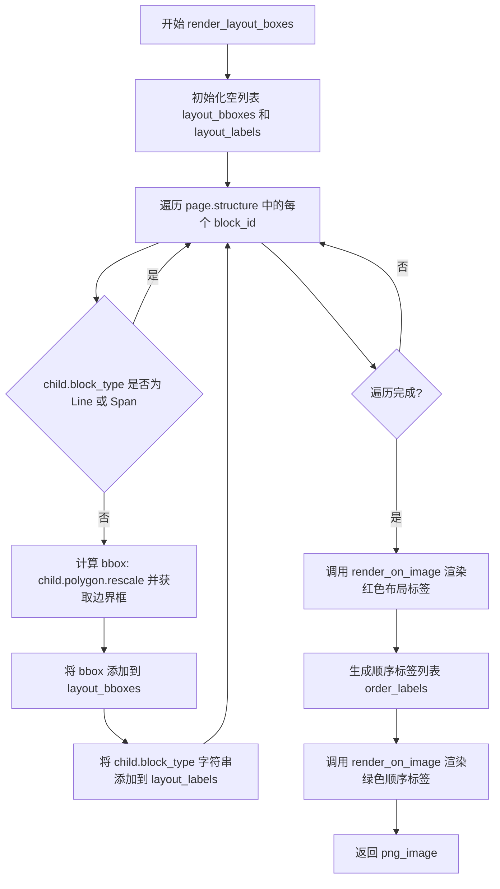

#### 带注释源码

```python
def render_layout_boxes(self, page, png_image):
    """
    在图像上渲染布局调试信息，包括布局块的边界框和顺序编号
    
    参数:
        page: 页面对象，包含文档结构信息
        png_image: PIL Image对象，需要渲染的图像
    
    返回:
        渲染后的PIL Image对象
    """
    # 初始化用于存储布局边界框和标签的列表
    layout_bboxes = []
    layout_labels = []
    
    # 遍历页面结构中的所有块ID
    for block_id in page.structure:
        # 获取对应的块对象
        child = page.get_block(block_id)
        
        # 跳过行和Span类型的块，只处理布局块（如段落、表格等）
        if child.block_type in [BlockTypes.Line, BlockTypes.Span]:
            continue

        # 将块的 polygon 从页面坐标系缩放到图像坐标系，并获取边界框
        bbox = child.polygon.rescale(page.polygon.size, png_image.size).bbox
        
        # 收集边界框和块类型标签
        layout_bboxes.append(bbox)
        layout_labels.append(str(child.block_type))

    # 第一次渲染：绘制红色标签，显示块类型（如 'Paragraph', 'Table' 等）
    self.render_on_image(
        layout_bboxes,
        png_image,
        labels=layout_labels,
        color="red",
        label_font_size=24,
    )

    # 生成顺序编号标签（0, 1, 2, ...）
    order_labels = [str(i) for i in range(len(layout_bboxes))]
    
    # 第二次渲染：绘制绿色顺序编号（不绘制边界框，仅显示编号）
    self.render_on_image(
        layout_bboxes,
        png_image,
        labels=order_labels,
        color="green",
        draw_bbox=False,
        label_offset=5,
        label_font_size=24,
    )
    
    # 返回渲染后的图像
    return png_image
```


### `DebugProcessor.dump_block_debug_data`

该方法用于将文档的页面块调试数据导出为 JSON 格式的文件，方便开发者在调试时查看文档的结构化信息，排除图像数据以减少文件体积。

参数：

- `document`：`Document`，需要进行调试数据转储的文档对象，包含多个页面及其子块的结构化数据。

返回值：`None`，该方法无返回值，直接将调试数据写入文件。

#### 流程图

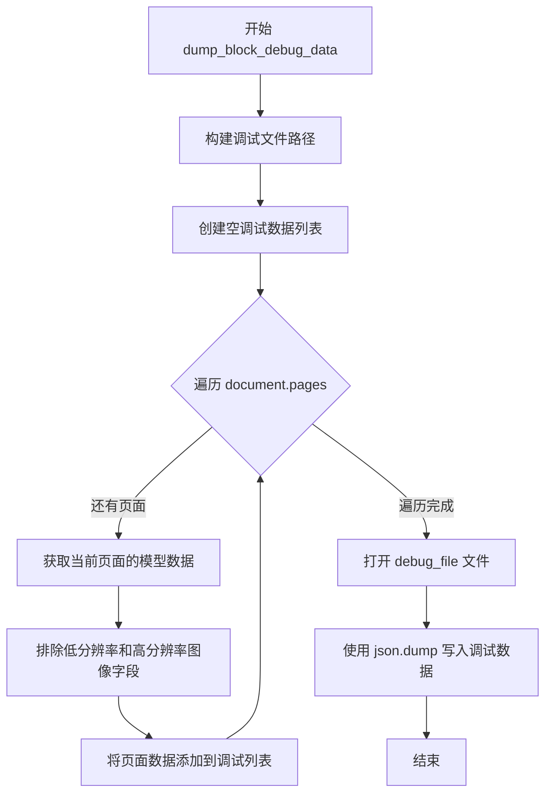

#### 带注释源码

```python
def dump_block_debug_data(self, document: Document):
    """
    将文档的块调试数据转储到 JSON 文件中。
    
    该方法遍历文档的所有页面，提取每个页面的结构化数据
    （排除图像数据），并将其保存为 JSON 格式以便调试分析。
    """
    # 构建调试文件的完整路径：debug_folder/blocks.json
    debug_file = os.path.join(self.debug_folder, "blocks.json")
    
    # 初始化用于存储所有页面调试数据的列表
    debug_data = []
    
    # 遍历文档中的每一页
    for page in document.pages:
        # 调用 model_dump 获取页面的字典形式数据
        # exclude 参数用于排除不需要的字段：
        # - lowres_image: 低分辨率图像
        # - highres_image: 高分辨率图像
        # - children 中的所有子块的图像字段
        page_data = page.model_dump(
            exclude={
                "lowres_image": True,
                "highres_image": True,
                "children": {
                    "__all__": {"lowres_image": True, "highres_image": True}
                },
            }
        )
        
        # 将当前页面的调试数据添加到列表中
        debug_data.append(page_data)

    # 以写入模式打开调试文件（如果不存在则创建）
    with open(debug_file, "w+") as f:
        # 将调试数据以 JSON 格式写入文件
        json.dump(debug_data, f)
```


### `DebugProcessor.get_text_size`

该方法用于计算给定文本在指定字体下的像素尺寸，通过创建一个临时的图像绘制对象并利用其 `textbbox` 方法获取文本边界框来实现。

参数：

- `text`：`str`，需要测量大小的文本字符串
- `font`：`ImageFont`，用于渲染文本的字体对象（PIL ImageFont 类型）

返回值：`tuple[int, int]`，返回文本的宽度和高度组成的元组

#### 流程图

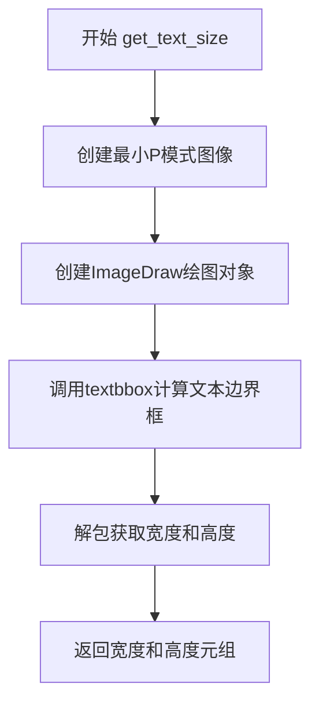

#### 带注释源码

```python
def get_text_size(self, text, font):
    """
    计算文本在指定字体下的像素尺寸
    
    参数:
        text: str - 需要测量大小的文本
        font: ImageFont - PIL字体对象
    
    返回:
        tuple[int, int] - 文本的宽度和高度
    """
    # 创建一个最小的调色板模式图像，用于文本测量
    # mode="P" 表示使用调色板模式，size=(0,0)表示创建最小尺寸图像
    im = Image.new(mode="P", size=(0, 0))
    
    # 创建ImageDraw对象，用于文本绘制操作
    draw = ImageDraw.Draw(im)
    
    # 使用textbbox方法获取文本的边界框
    # 参数(0,0)是起始坐标，text和font指定要测量的内容和字体
    # 返回元组：(x0, y0, x1, y1)，其中x1-x0为宽度，y1-y0为高度
    # 使用_忽略左上角坐标(x0, y0)
    _, _, width, height = draw.textbbox((0, 0), text=text, font=font)
    
    # 返回文本的宽度和高度
    return width, height
```


### `DebugProcessor.render_on_image`

该方法用于在图像上绘制边界框和可选的文本标签，支持单色或为每个边界框指定不同颜色，主要用于文档调试场景（如可视化PDF布局、行号、块类型等）。

参数：

- `bboxes`：`list`，边界框坐标列表，每个边界框是一个包含四个坐标值的序列（如 `[x1, y1, x2, y2]`）
- `image`：`PIL.Image.Image`，PIL图像对象，要在之上绘制边界框和标签的图像
- `labels`：`list | None`，可选的文本标签列表，用于在每个边界框附近显示文本，默认为 `None`
- `label_offset`：`int`，标签相对于边界框左上角的偏移量（像素），默认值为 `1`
- `label_font_size`：`int`，标签文本的字体大小，默认值为 `10`
- `color`：`str | list`，绘制颜色，可以是单个颜色字符串（如 `"red"`）或与 `bboxes` 长度相同的颜色列表，默认值为 `"red"`
- `draw_bbox`：`bool`，是否绘制边界框轮廓，默认值为 `True`

返回值：`PIL.Image.Image`，绘制完成后的图像对象（与输入的 `image` 参数是同一个对象）

#### 流程图

```mermaid
flowchart TD
    A[开始 render_on_image] --> B[创建 ImageDraw.Draw 对象]
    B --> C[加载指定大小的 TrueType 字体]
    C --> D[遍历 bboxes 列表]
    D --> E{当前索引 i < len(bboxes)?}
    E -->|是| F[将 bbox 坐标转换为整数]
    E -->|否| K[返回绘制后的 image]
    F --> G{draw_bbox == True?}
    G -->|是| H[绘制矩形边界框]
    G -->|否| I
    H --> I{labels 不为 None?}
    I -->|是| J[获取对应标签 label]
    I -->|否| D
    J --> L[计算文本位置]
    L --> M[获取文本尺寸]
    M --> N{文本尺寸有效?}
    N -->|是| O[绘制白色背景矩形]
    O --> P[绘制文本标签]
    P --> D
    N -->|否| D
```

#### 带注释源码

```python
def render_on_image(
    self,
    bboxes,
    image,
    labels=None,
    label_offset=1,
    label_font_size=10,
    color: str | list = "red",
    draw_bbox=True,
):
    """
    在图像上渲染边界框和标签
    
    参数:
        bboxes: 边界框坐标列表
        image: PIL图像对象
        labels: 可选的文本标签列表
        label_offset: 标签偏移量
        label_font_size: 标签字体大小
        color: 绘制颜色（字符串或列表）
        draw_bbox: 是否绘制边界框
    """
    # 创建PIL绘图对象，用于在图像上绘制形状和文本
    draw = ImageDraw.Draw(image)
    
    # 从设置中获取字体路径，并创建指定大小的TrueType字体对象
    font_path = settings.FONT_PATH
    label_font = ImageFont.truetype(font_path, label_font_size)

    # 遍历所有边界框
    for i, bbox in enumerate(bboxes):
        # 将边界框坐标转换为整数（PIL要求整数坐标）
        bbox = [int(p) for p in bbox]
        
        # 如果需要绘制边界框
        if draw_bbox:
            # 根据color类型选择颜色：如果是列表则取对应索引的颜色，否则使用统一颜色
            draw.rectangle(
                bbox,
                outline=color[i] if isinstance(color, list) else color,
                width=1,
            )

        # 如果提供了标签
        if labels is not None:
            # 获取当前边界框对应的标签
            label = labels[i]
            
            # 计算文本起始位置（边界框左上角 + 偏移量）
            text_position = (bbox[0] + label_offset, bbox[1] + label_offset)
            
            # 获取文本的宽和高尺寸
            text_size = self.get_text_size(label, label_font)
            
            # 检查文本尺寸是否有效（避免绘制无效文本）
            if text_size[0] <= 0 or text_size[1] <= 0:
                continue
            
            # 计算文本背景矩形的位置（用于确保文本可读）
            box_position = (
                text_position[0],
                text_position[1],
                text_position[0] + text_size[0],
                text_position[1] + text_size[1],
            )
            
            # 绘制白色背景矩形覆盖边界框区域，提高文本可读性
            draw.rectangle(box_position, fill="white")
            
            # 绘制文本标签，使用与边界框相同的颜色
            draw.text(
                text_position,
                label,
                fill=color[i] if isinstance(color, list) else color,
                font=label_font,
            )

    # 返回绘制完成的图像对象
    return image
```

## 关键组件


### 调试处理器（DebugProcessor）

这是一个文档调试处理器，用于在文档转换过程中生成调试可视化图像和调试数据，帮助开发者分析和验证文档解析结果。

### 惰性图像加载（Lazy Image Loading）

通过 `page.get_image(highres=True)` 按需获取高分辨率页面图像，避免一次性加载所有图像导致的内存浪费。

### 边界框重缩放（_bbox Rescaling）

使用 `polygon.rescale(page.polygon.size, png_image.size).bbox` 将原始坐标系统的边界框动态缩放到目标图像尺寸，支持不同分辨率下的坐标映射。

### 布局调试可视化（Layout Debug Visualization）

通过 `draw_layout_debug_images` 方法将文档的行文本和布局框渲染为可视化图像，帮助识别文档结构解析的准确性。

### PDF调试可视化（PDF Debug Visualization）

通过 `draw_pdf_debug_images` 方法生成带有行ID标注的PDF页面图像，用于调试PDF渲染和文本提取结果。

### 块调试数据转储（Block Debug Data Dump）

通过 `dump_block_debug_data` 方法将页面块结构序列化为JSON文件，排除高/低分辨率图像以减小输出文件大小。

### 图像渲染引擎（Image Rendering Engine）

`render_on_image` 方法提供通用的图像标注功能，支持边界框绘制、标签渲染、字体配置和多色支持。

### 布局框渲染（Layout Box Rendering）

`render_layout_boxes` 方法遍历页面结构，排除行和span块，仅渲染顶层布局块（如段落、表格等）的边界框和序号。


## 问题及建议


### 已知问题

- **参数未使用**：`draw_layout_debug_images` 方法接收 `pdf_mode` 参数但从未使用，造成代码冗余和混淆。
- **字体重复加载**：每次调用 `render_on_image` 时都通过 `ImageFont.truetype` 重新加载字体文件，在处理大量页面时造成性能瓶颈。
- **临时图像创建**：`get_text_size` 方法每次调用都创建一个全新的 `P` 模式空图像，仅用于测量文本尺寸，资源消耗不必要的内存。
- **文件操作缺乏异常处理**：`dump_block_debug_data` 中的文件写入操作没有 try-except 保护，可能导致未捕获的 IO 异常。
- **硬编码颜色值**：颜色值如 `"red"`、`"blue"`、`"green"` 等以字符串形式硬编码，不利于后续统一修改或主题定制。
- **类型注解不精确**：`block_types` 字段的类型注解仅为 `tuple`，缺少泛型参数，应明确为 `tuple[BlockTypes, ...]` 以提高类型安全性。
- **图像重复加载**：在 `draw_pdf_debug_images` 和 `draw_layout_debug_images` 中都调用 `page.get_image(highres=True)`，同一页面的高分辨率图像可能被多次加载到内存。
- **循环效率低下**：在 `render_on_image` 中每次都调用 `get_text_size` 计算文本尺寸，可预先计算或缓存。

### 优化建议

- **缓存字体对象**：在类初始化或首次使用时加载字体一次，并将字体对象存储为实例变量，避免重复加载。
- **统一异常处理**：为所有文件写入操作添加 try-except 块，并考虑使用上下文管理器 (`with open(...) as f`) 确保资源正确释放。
- **使用枚举或常量类**：定义颜色枚举或常量类，将硬编码的颜色值统一管理。
- **修复未使用参数**：移除 `draw_layout_debug_images` 中未使用的 `pdf_mode` 参数，或实现其预期功能。
- **图像缓存机制**：在 `Document` 或 `Page` 类中实现图像缓存，避免同一页面图像的重复解码。
- **优化文本尺寸计算**：考虑使用 `font.getbbox()` 或 `font.getsize()` 替代创建临时图像的方式（取决于 PIL 版本）。
- **代码复用**：提取 `draw_pdf_debug_images` 和 `draw_layout_debug_images` 中的公共逻辑（如遍历页面、获取图像、渲染布局框），减少代码重复。


## 其它


### 设计目标与约束

设计目标：为文档处理流水线提供调试能力，支持输出布局调试图像、PDF调试图像和块级JSON数据，帮助开发人员定位文档解析问题。

约束条件：
1. 依赖PIL库进行图像渲染，需要配置正确的字体路径
2. 调试输出会生成大量文件，需要确保磁盘空间充足
3. 高分辨率图像处理可能占用较多内存
4. 仅在debug标志启用时执行，避免生产环境性能开销

### 错误处理与异常设计

异常处理机制：
1. 文件系统异常：os.makedirs在创建目录时可能抛出PermissionError或OSError，已通过os.path.join和exist_ok=True处理目录创建
2. 图像保存异常：png_image.save可能抛出IOError或文件路径相关异常，由调用方处理
3. JSON序列化异常：json.dump可能抛出序列化异常，调试数据模型需保证可序列化
4. 字体加载异常：ImageFont.truetype在字体文件不存在时会抛出OSError，导致调试图像无法标注文字

关键错误场景：
- 字体路径无效：settings.FONT_PATH配置错误时get_text_size和render_on_image会失败
- 文档页码为空：document.pages为空时不执行任何调试操作
- 内存不足：高分辨率图像处理可能引发MemoryError

### 数据流与状态机

数据流：
1. 输入：Document对象（包含文件路径、页面集合、块结构）
2. 处理流程：
   - 创建调试目录 → 设置document.debug_data_path
   - 条件触发draw_layout_debug_images → 渲染页面布局盒子和文本行
   - 条件触发draw_pdf_debug_images → 渲染PDF页面、线条边界框、跨距边界框
   - 条件触发dump_block_debug_data → 序列化页面和块数据为JSON
3. 输出：调试图像文件（PNG）和JSON数据文件

状态转换：
- 初始状态：debug_folder未创建
- 创建状态：debug_folder已创建（当任一debug标志启用）
- 执行状态：根据各标志位执行对应的调试输出方法

### 外部依赖与接口契约

外部依赖：
1. marker.processors.BaseProcessor：基类，定义处理器接口
2. marker.schema.document.Document：文档数据模型
3. marker.schema.BlockTypes：块类型枚举
4. marker.settings：配置对象，提供FONT_PATH等设置
5. PIL (Pillow)：图像处理库，用于创建、绘制、保存图像
6. json：标准库，用于序列化调试数据
7. os：标准库，用于文件系统操作
8. typing.Annotated：类型注解

接口契约：
- 输入：Document对象，必须包含filepath、pages属性
- 输出：无返回值，通过副作用（文件IO）输出调试数据
- 约束：Document对象需实现get_image()、model_dump()等方法

### 配置管理

配置项（通过类属性Annotated注解）：
1. block_types: tuple - 要处理的块类型，默认空元组
2. debug_data_folder: str - 调试数据输出目录，默认"debug_data"
3. debug_layout_images: bool - 是否输出布局调试图像，默认False
4. debug_pdf_images: bool - 是否输出PDF调试图像，默认False
5. debug_json: bool - 是否输出块调试JSON，默认False

运行时配置：
- doc_base：从document.filepath提取文件名（不含扩展名）
- debug_folder：基于debug_data_folder和doc_base动态构建

### 性能考虑

性能因素：
1. 高分辨率图像获取：page.get_image(highres=True)会生成大尺寸图像，可能占用大量内存
2. 多次图像复制：draw_pdf_debug_images中使用.copy()创建图像副本
3. 循环处理：每个页面都执行图像渲染操作，页数多时性能下降
4. JSON序列化：page.model_dump对整个页面模型进行深拷贝，内存开销大

优化建议：
- 考虑使用生成器模式按需处理页面
- 对大文档可考虑分批处理或流式输出
- 调试完成后及时释放图像对象引用

### 资源管理

资源管理：
1. 文件资源：调试文件夹和文件由os.makedirs和Image.save管理
2. 图像资源：PIL Image对象在方法结束时由Python垃圾回收
3. 字体资源：ImageFont.truetype每次调用会加载字体文件，建议缓存

临时文件清理：
- 当前实现不自动清理调试文件
- 建议在调试完成后手动清理debug_data_folder

### 日志与监控

日志记录：
- 使用marker.logger.get_logger获取logger实例
- 三处info级别日志：分别记录布局图像、PDF图像、JSON数据的输出路径
- 无error或warning级别日志，错误由调用方处理

监控建议：
- 可添加调试数据文件大小统计
- 可记录每个页面处理耗时
- 可监控磁盘空间使用情况

### 测试策略

测试用例建议：
1. 单元测试：测试render_on_image的边界框绘制和标签渲染
2. 集成测试：使用示例PDF文档测试完整调试流程
3. 异常测试：测试字体缺失、目录权限不足等异常场景
4. 性能测试：测量大文档处理时的内存和CPU占用

模拟对象：
- Mock Document对象和page对象
- Mock settings.FONT_PATH

### 使用示例

基本用法：
```python
from marker.convert import convert_single_pdf
from marker.processors import ProcessorRegistry

# 配置DebugProcessor
debug_processor = DebugProcessor(
    debug_layout_images=True,
    debug_pdf_images=True,
    debug_json=True
)

# 注册到处理流水线
ProcessorRegistry.register(debug_processor)

# 执行转换
convert_single_pdf("input.pdf", "output.pdf")
```

调试输出结构：
```
debug_data/
└── doc_name/
    ├── layout_page_0.png
    ├── layout_page_1.png
    ├── pdf_page_0.png
    ├── pdf_page_1.png
    └── blocks.json
```

### 并发与线程安全

线程安全分析：
1. 实例级状态：debug_folder在__call__时创建，无共享状态
2. 类级配置：block_types等类属性为只读，无线程安全问题
3. 图像处理：PIL ImageDraw操作为线程安全，但建议避免并发修改同一图像

结论：在单线程文档处理流程中使用无需额外同步措施

    