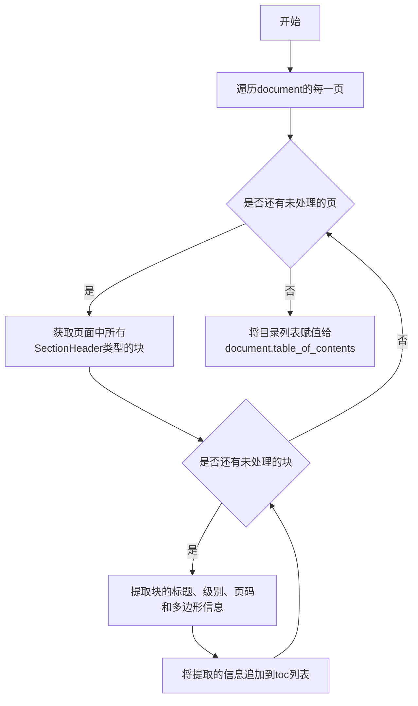
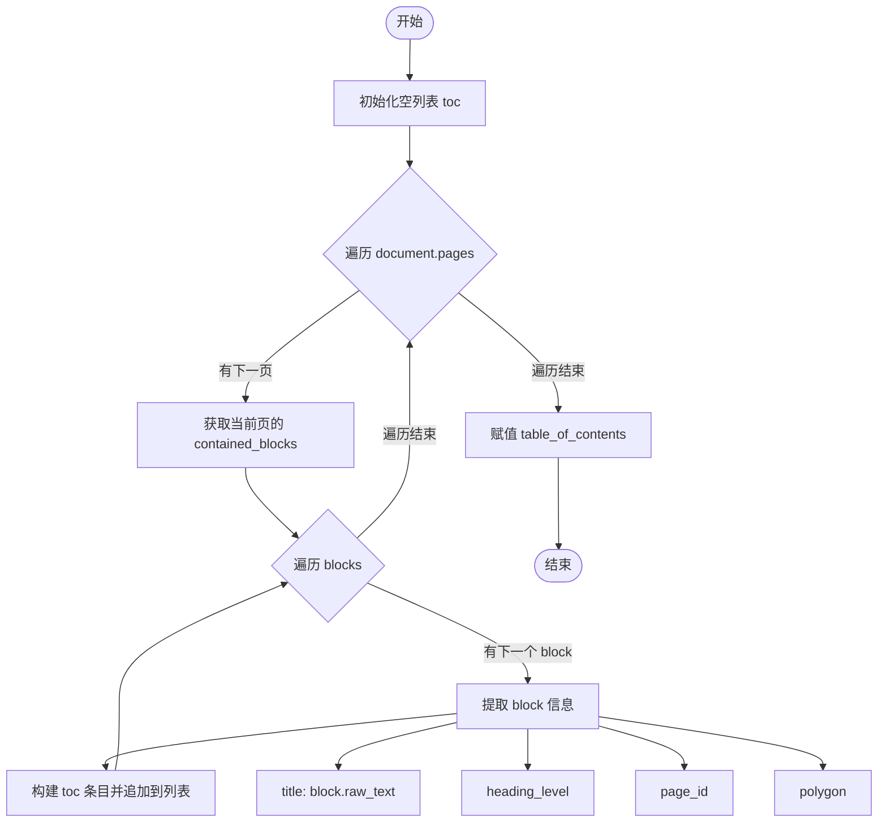

# `marker\marker\processors\document_toc.py` 详细设计文档

这是一个文档目录生成处理器，通过遍历文档中的SectionHeader类型的块，提取标题、级别、页码和位置信息，生成完整的目录结构并附加到文档对象上。

## 整体流程



## 类结构

```
BaseProcessor (抽象基类)
└── DocumentTOCProcessor (文档目录处理器)
```

## 全局变量及字段


### `DocumentTOCProcessor.block_types`
    
要处理的块类型元组，这里只包含SectionHeader

类型：`tuple`
    
    

## 全局函数及方法


### `DocumentTOCProcessor.__call__`

该方法实现文档目录（Table of Contents）的生成功能，通过遍历文档的所有页面，筛选出指定类型的块（如章节标题），提取其文本内容、层级信息和位置多边形数据，最终将生成的目录列表直接挂载到文档对象的 `table_of_contents` 属性中。

参数：

- `document`：`Document`，要处理的目标文档对象，包含页面集合和待填充的目录属性

返回值：`None`，直接修改 `document` 对象的 `table_of_contents` 属性，无返回值

#### 流程图



#### 带注释源码

```python
def __call__(self, document: Document):
    """
    处理文档并生成目录表
    
    该方法实现了 BaseProcessor 的核心逻辑，遍历文档中的所有页面，
    筛选出符合 block_types 条件的块（如章节标题），提取关键信息
    并生成结构化的目录数据。
    
    Args:
        document: Document 对象，包含待处理的页面和需要填充的 table_of_contents 属性
        
    Returns:
        None: 直接修改传入的 document 对象，无返回值
    """
    # 步骤1: 初始化空的目录列表，用于存储所有标题条目
    toc = []
    
    # 步骤2: 遍历文档中的所有页面
    for page in document.pages:
        # 步骤3: 获取当前页面中符合类型的块（章节标题）
        # contained_blocks 方法会根据 block_types 过滤出匹配的块
        for block in page.contained_blocks(document, self.block_types):
            # 步骤4: 构建目录条目，包含标题、层级、页码和多边形位置
            toc.append({
                # 提取块的原始文本并去除首尾空格
                "title": block.raw_text(document).strip(),
                # 标题的层级（如 H1、H2、H3 等）
                "heading_level": block.heading_level,
                # 标题所在页面的 ID
                "page_id": page.page_id,
                # 标题块的位置多边形坐标
                "polygon": block.polygon.polygon
            })
    
    # 步骤5: 将生成的目录列表直接赋值给文档对象的 table_of_contents 属性
    document.table_of_contents = toc
```

## 关键组件


### DocumentTOCProcessor

负责为文档生成目录（TOC）的处理器类，继承自BaseProcessor，通过遍历文档中的SectionHeader块来构建目录结构。

### BaseProcessor

处理器基类，定义了处理器的通用接口和行为规范，DocumentTOCProcessor继承此类以获得标准的处理器能力。

### block_types

指定该处理器关注的文档块类型为SectionHeader（章节标题），用于过滤需要纳入目录的文档块。

### __call__ 方法

执行目录生成的核心逻辑，遍历文档所有页面中的指定块类型，提取标题、级别、页面ID和多边形信息，组装成目录数据结构并赋值给document.table_of_contents。

### table_of_contents

文档的目录属性，用于存储生成的目录条目列表，每个条目包含标题、标题级别、页面ID和多边形坐标信息。


## 问题及建议


### 已知问题

-   **缺少错误处理**：当 `document`、`page` 或 `block` 为 `None` 时，代码可能抛出 `AttributeError` 或 `TypeError` 异常
-   **缺少空值检查**：访问 `block.raw_text()`、`block.heading_level`、`block.polygon.polygon` 时没有验证这些属性是否存在
-   **类型提示不完整**：`__call__` 方法缺少返回类型注解，且 `toc` 列表的类型可以更明确
-   **硬编码的块类型**：仅支持 `SectionHeader`，无法灵活处理其他标题类型
-   **性能未优化**：每次调用都遍历所有页面和块，重复调用时没有缓存机制
-   **文档字符串不完整**：缺少参数类型、返回值和异常说明
-   **魔法数字/字符串**：多处使用字符串键（如 "title"、"heading_level" 等），缺乏常量定义
-   **缺乏日志记录**：没有调试或日志输出，难以追踪执行过程

### 优化建议

-   添加参数验证和异常处理，确保 `document`、`page` 和 `block` 的属性访问安全
-   补充完整的类型注解，包括返回类型 `None`
-   将 `block_types` 改为可配置参数，支持自定义块类型
-   考虑实现缓存机制或添加缓存参数，避免重复计算
-   使用 dataclass 或 TypedDict 定义目录项的结构常量
-   增强文档字符串，补充参数说明、返回值和可能抛出的异常
-   添加日志记录，支持不同级别的调试信息输出

## 其它


### 设计目标与约束

该处理器的主要设计目标是从文档中自动提取章节目录信息，并以结构化形式存储，便于后续的文档渲染、导航和索引构建。设计约束包括：仅处理BlockTypes.SectionHeader类型的块，不处理其他类型的标题或内容；依赖document对象的pages属性和contained_blocks方法；假设document对象已包含完整的页面解析结果。

### 错误处理与异常设计

该处理器未实现显式的错误处理机制。潜在的异常场景包括：document对象为None或不符合预期结构时可能引发AttributeError；page.contained_blocks()方法调用失败时可能抛出异常；block.raw_text()或block.polygon返回None时可能导致数据丢失。建议添加空值检查和异常捕获机制，确保处理过程的健壮性。

### 数据流与状态机

数据流从Document对象输入开始，经过以下流程：1)遍历document.pages获取所有页面；2)对每个页面调用contained_blocks方法筛选SectionHeader块；3)提取每个块的文本、级别、页码和多边形信息；4)构建toc列表；5)将toc赋值给document.table_of_contents。无状态机设计，处理器为纯函数式逻辑。

### 外部依赖与接口契约

主要依赖包括：BaseProcessor基类（marker.processors）、BlockTypes枚举（marker.schema）、Document类（marker.schema.document）。输入契约：document参数必须为Document类型且包含pages属性。输出契约：document.table_of_contents属性被设置为包含字典的列表，每个字典包含title、heading_level、page_id、polygon四个键。

### 性能考虑

该处理器的时间复杂度为O(n)，其中n为文档中所有块的数量。空间复杂度为O(m)，其中m为SectionHeader块的数量。性能优化方向：可以考虑添加缓存机制避免重复解析；如文档过大，可考虑分页处理或流式处理；可添加最大条目数限制防止超大型目录。

### 配置参数

当前类级别的配置参数为block_types，默认为(BlockTypes.SectionHeader,)，用于指定要提取的块类型。实例级别的配置通过__call__方法的document参数传入。如需扩展，可考虑添加配置项如：max_entries限制最大目录条目数、include_levels指定要包含的标题级别范围、page_range指定处理的页面范围。

### 使用示例

```python
from marker.processors import BaseProcessor
from marker.schema import BlockTypes
from marker.schema.document import Document

# 初始化处理器
processor = DocumentTOCProcessor()

# 假设已有document对象
document = Document(...)

# 调用处理器生成目录
processor(document)

# 访问生成的目录
toc = document.table_of_contents
for item in toc:
    print(f"{item['heading_level']} - {item['title']} (Page {item['page_id']})")
```

### 扩展性与可维护性

该处理器具有良好的扩展性：可通过修改block_types元组支持多种块类型；可继承该类实现自定义的目录生成逻辑；可轻松集成到marker的处理器链中。建议的扩展方向：支持嵌套目录结构、支持目录层级过滤、添加目录项排序功能、支持自定义提取字段。


    